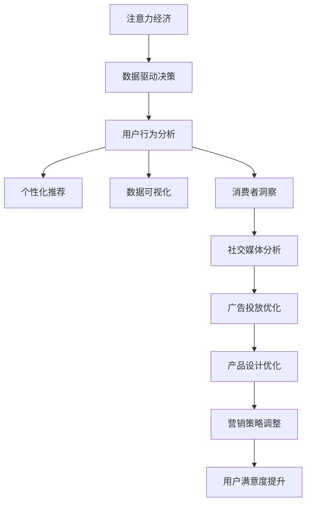

                 

# 注意力经济与数据分析技巧：如何利用数据理解受众行为和偏好

> 关键词：
1. 注意力经济
2. 数据驱动决策
3. 用户行为分析
4. 个性化推荐
5. 数据可视化
6. 消费者洞察
7. 社交媒体分析

## 1. 背景介绍

### 1.1 问题由来

随着互联网和移动互联网的普及，数字化时代的到来使得注意力经济蓬勃发展。无论是品牌营销、产品设计还是内容创作，都需要深入理解受众的行为和偏好，从而制定有效的策略。在这其中，数据驱动决策成为不可或缺的一部分。然而，如何从海量数据中提取有价值的信息，进行深入分析和理解，依然是一个挑战。

### 1.2 问题核心关键点

数据驱动决策的核心在于如何利用数据洞察受众行为和偏好，从而制定更精准、高效的策略。这一过程通常包括以下几个步骤：

1. **数据收集**：从不同渠道收集用户行为数据，如点击流、搜索行为、社交媒体互动等。
2. **数据清洗与预处理**：处理缺失值、异常值，进行数据标准化和特征工程，确保数据质量。
3. **数据分析与建模**：运用统计学、机器学习等技术，分析数据背后的规律和模式。
4. **数据可视化**：将分析结果以图表、仪表盘等形式展示，直观展示数据洞见。
5. **决策应用**：基于分析结果，制定策略，优化产品、营销方案等。

本文将详细探讨这些关键点，结合实际案例，展示如何利用数据驱动决策，理解受众行为和偏好。

## 2. 核心概念与联系

### 2.1 核心概念概述

为更好地理解注意力经济与数据分析技巧，本节将介绍几个密切相关的核心概念：

- **注意力经济**：在信息过载的互联网时代，用户的时间和注意力成为稀缺资源。企业需要争夺用户的注意力，才能实现商业价值。
- **数据驱动决策**：基于数据的洞察和分析，做出科学合理的决策，提升业务效率和效果。
- **用户行为分析**：通过分析用户的行为数据，理解其需求和偏好，从而制定针对性的策略。
- **个性化推荐**：利用用户行为数据，为用户提供个性化的产品、内容和服务推荐。
- **数据可视化**：将数据分析结果以直观的图表、仪表盘等形式展示，便于理解和决策。
- **消费者洞察**：通过深入分析用户行为和偏好，洞察消费者的真实需求和价值取向。
- **社交媒体分析**：利用社交媒体平台的数据，分析用户行为和情感，获取市场动态和消费者反馈。

这些核心概念之间的逻辑关系可以通过以下Mermaid流程图来展示：



这个流程图展示了注意力经济与数据分析技巧的各个环节及其相互关系：

1. 注意力经济通过数据驱动决策来获取用户注意力。
2. 数据驱动决策基于用户行为分析，为用户提供个性化推荐。
3. 数据可视化将分析结果直观展示，辅助决策。
4. 消费者洞察通过深入分析用户行为，洞察消费者需求。
5. 社交媒体分析利用社交数据，获取市场动态和消费者反馈。
6. 基于以上洞察，企业可以进行广告投放优化、产品设计优化、营销策略调整等，最终提升用户满意度。

这些概念共同构成了利用数据驱动决策，理解受众行为和偏好的整体框架，有助于企业更好地利用数据，实现商业目标。

## 3. 核心算法原理 & 具体操作步骤

### 3.1 算法原理概述

注意力经济与数据分析技巧的核心在于利用数据分析，理解用户行为和偏好，从而制定更精准的决策。这一过程通常基于以下步骤：

1. **数据收集与清洗**：从不同渠道收集用户行为数据，并进行清洗和预处理。
2. **特征工程**：设计合适的特征，并进行特征选择和降维。
3. **模型构建与训练**：选择适当的模型，并进行训练和调优。
4. **评估与优化**：评估模型效果，并根据反馈进行优化。
5. **结果展示与决策**：将分析结果可视化，辅助决策。

### 3.2 算法步骤详解

#### 3.2.1 数据收集与清洗

数据收集与清洗是数据分析的基础，通常包括以下步骤：

1. **数据来源**：从网站流量、移动应用、社交媒体平台等渠道收集数据。
2. **数据格式转换**：将不同格式的数据转换为统一格式，便于后续处理。
3. **数据去重**：去除重复数据，确保数据唯一性。
4. **数据清洗**：处理缺失值、异常值，进行数据标准化和特征工程。

#### 3.2.2 特征工程

特征工程是数据分析的关键步骤，通过设计合适的特征，提高模型的预测能力。常见的特征工程方法包括：

1. **特征提取**：从原始数据中提取有意义的特征，如时间戳、设备类型、地理位置等。
2. **特征选择**：选择对目标变量有影响的特征，剔除无关特征。
3. **特征变换**：对特征进行归一化、离散化、编码等处理，提高特征质量。
4. **特征降维**：使用PCA、LDA等技术，减少特征维度，提高模型效率。

#### 3.2.3 模型构建与训练

选择合适的模型，并进行训练和调优，是数据分析的核心。常见的模型包括：

1. **回归模型**：如线性回归、逻辑回归，用于预测数值型变量。
2. **分类模型**：如决策树、随机森林、支持向量机，用于分类预测。
3. **聚类模型**：如K-Means、层次聚类，用于用户分群。
4. **关联规则模型**：如Apriori、FP-Growth，用于发现数据中的关联规律。
5. **推荐系统模型**：如协同过滤、基于内容的推荐，用于个性化推荐。

#### 3.2.4 评估与优化

评估模型效果，并根据反馈进行优化，是数据分析的重要环节。常见的评估指标包括：

1. **准确率**：模型预测结果与实际结果的匹配程度。
2. **召回率**：模型预测出的正样本占实际正样本的比例。
3. **F1值**：综合考虑准确率和召回率。
4. **ROC曲线**：评估模型的分类性能。
5. **AUC值**：ROC曲线下的面积，用于衡量模型的分类能力。

#### 3.2.5 结果展示与决策

将分析结果可视化，辅助决策，是数据分析的最终目的。常见的数据可视化工具包括：

1. **数据仪表盘**：如Tableau、Power BI，用于展示数据洞见。
2. **热力图**：用于展示数据的分布情况。
3. **时间序列图**：用于展示数据随时间的变化趋势。
4. **散点图**：用于展示两个变量之间的关系。
5. **饼图/条形图**：用于展示分类数据的分布情况。

### 3.3 算法优缺点

#### 3.3.1 优点

1. **数据驱动**：基于数据分析结果制定决策，科学合理。
2. **精准预测**：通过模型训练，可以精准预测用户行为和偏好。
3. **多渠道数据整合**：可以整合不同渠道的数据，形成全面的视角。
4. **实时更新**：数据实时更新，模型可以及时反映最新趋势。

#### 3.3.2 缺点

1. **数据质量问题**：数据收集和清洗过程容易出现偏差，影响结果。
2. **模型复杂性**：模型构建和训练过程复杂，需要专业知识。
3. **计算资源需求高**：大数据量、高维度数据需要高性能计算资源。
4. **隐私问题**：数据收集和处理过程中需要保护用户隐私。

### 3.4 算法应用领域

注意力经济与数据分析技巧在多个领域都有广泛应用，具体包括：

1. **电子商务**：通过分析用户点击流、购买行为，优化商品推荐，提升转化率。
2. **金融服务**：利用用户行为数据，进行风险评估和用户画像，优化客户服务。
3. **媒体与广告**：分析用户观看、互动数据，优化广告投放策略，提高广告效果。
4. **健康医疗**：通过分析用户健康数据，提供个性化医疗建议，提升医疗服务质量。
5. **旅游与酒店**：利用用户预订数据，优化价格策略，提升用户满意度。
6. **教育培训**：分析用户学习行为，提供个性化课程推荐，提升学习效果。
7. **社交媒体**：通过分析用户互动数据，洞察用户需求，优化社区管理。

## 4. 数学模型和公式 & 详细讲解 & 举例说明

### 4.1 数学模型构建

本节将使用数学语言对注意力经济与数据分析技巧进行更加严格的刻画。

假设我们有一组用户行为数据，包含时间戳 $t$、用户ID $u$、行为类型 $a$ 和行为特征 $f$。我们需要设计一个回归模型，预测用户在未来的行为。设模型为 $y = f(X)$，其中 $y$ 为目标变量，$X$ 为输入特征，$f$ 为回归函数。

模型参数为 $\theta$，目标是最小化损失函数 $L$。常见的损失函数包括均方误差（MSE）和平均绝对误差（MAE）。设样本数为 $N$，则损失函数为：

$$
L(\theta) = \frac{1}{N}\sum_{i=1}^N (y_i - f(X_i; \theta))^2
$$

其中 $y_i$ 为实际值，$f(X_i; \theta)$ 为模型预测值。

### 4.2 公式推导过程

以下我们以线性回归模型为例，推导回归模型的梯度更新公式。

线性回归模型假设为 $y = \theta_0 + \theta_1 x_1 + \theta_2 x_2 + \cdots + \theta_p x_p$，其中 $\theta = (\theta_0, \theta_1, \theta_2, \cdots, \theta_p)^T$ 为模型参数。目标是最小化损失函数 $L(\theta)$。

根据梯度下降法，模型参数的更新公式为：

$$
\theta \leftarrow \theta - \eta \nabla_{\theta} L(\theta)
$$

其中 $\eta$ 为学习率。目标函数对 $\theta_j$ 的梯度为：

$$
\frac{\partial L(\theta)}{\partial \theta_j} = \frac{1}{N}\sum_{i=1}^N -2(x_{i1}y_i - \hat{y}_i) \theta_j
$$

其中 $\hat{y}_i = \theta_0 + \theta_1 x_{i1} + \theta_2 x_{i2} + \cdots + \theta_p x_{ip}$。

### 4.3 案例分析与讲解

假设我们有一组用户行为数据，包含时间戳、用户ID、点击行为、购买行为和浏览行为。我们的目标是预测用户是否会购买某件商品，并生成相应的营销策略。

首先，我们将数据划分为训练集和测试集。设训练集为 $D_{train}$，测试集为 $D_{test}$。使用线性回归模型 $y = \theta_0 + \theta_1 x_1 + \theta_2 x_2 + \cdots + \theta_p x_p$ 进行训练。

模型训练过程如下：

1. 数据清洗与预处理：去除重复数据，处理缺失值，进行数据标准化和特征工程。
2. 特征选择：选择对购买行为有影响的特征，如点击次数、浏览时间、购买频率等。
3. 模型训练：使用训练集数据，最小化损失函数 $L(\theta)$，求解最优模型参数 $\theta^*$。
4. 模型评估：使用测试集数据，评估模型效果，计算准确率、召回率等指标。
5. 结果展示：将模型结果展示在仪表盘上，直观展示数据洞见。

## 5. 项目实践：代码实例和详细解释说明

### 5.1 开发环境搭建

在进行数据分析实践前，我们需要准备好开发环境。以下是使用Python进行Pandas、NumPy等工具开发的环境配置流程：

1. 安装Anaconda：从官网下载并安装Anaconda，用于创建独立的Python环境。

2. 创建并激活虚拟环境：
```bash
conda create -n pyenv python=3.8 
conda activate pyenv
```

3. 安装Pandas、NumPy、Matplotlib、Scikit-Learn等工具包：
```bash
pip install pandas numpy matplotlib scikit-learn
```

4. 安装Jupyter Notebook：
```bash
pip install jupyter notebook
```

完成上述步骤后，即可在`pyenv`环境中开始数据分析实践。

### 5.2 源代码详细实现

下面我们以用户行为数据分析为例，给出使用Pandas、NumPy等工具对用户行为数据进行回归分析的Python代码实现。

首先，导入所需的库：

```python
import pandas as pd
import numpy as np
import matplotlib.pyplot as plt
from sklearn.linear_model import LinearRegression
from sklearn.model_selection import train_test_split
from sklearn.metrics import mean_squared_error, r2_score
```

然后，读取用户行为数据：

```python
data = pd.read_csv('user_behavior.csv')
```

进行数据清洗与预处理：

```python
# 删除缺失值
data.dropna(inplace=True)

# 时间戳标准化
data['timestamp'] = pd.to_datetime(data['timestamp'])
data['timestamp'] = data['timestamp'] - data['timestamp'].min()

# 特征工程
features = ['click_count', 'browsing_time', 'purchase_frequency']
target = 'purchase'
X = data[features]
y = data[target]
```

进行特征选择和降维：

```python
# 特征选择
X = X.select_dtypes(include=[np.number])

# 特征降维
X = X.dropna()
X = X.pivot_table(index=['user_id'], columns=['timestamp'], values=features).stack().reset_index()
X.columns = ['user_id', 'timestamp', 'value']
X = X.pivot_table(index=['user_id', 'timestamp'], columns='value', aggfunc='sum')
X.index.name = 'timestamp'
X.columns.name = 'feature'
```

构建并训练线性回归模型：

```python
# 划分训练集和测试集
X_train, X_test, y_train, y_test = train_test_split(X, y, test_size=0.2, random_state=42)

# 训练模型
model = LinearRegression()
model.fit(X_train, y_train)
```

评估模型效果：

```python
# 预测结果
y_pred = model.predict(X_test)

# 计算MSE和R2分数
mse = mean_squared_error(y_test, y_pred)
r2 = r2_score(y_test, y_pred)

# 打印结果
print(f"MSE: {mse}")
print(f"R2: {r2}")
```

将结果可视化展示：

```python
# 绘制残差图
plt.scatter(y_test, y_pred - y_test, alpha=0.5)
plt.xlabel('True Values')
plt.ylabel('Residuals')
plt.show()

# 绘制时间序列图
plt.plot(y_test)
plt.plot(y_pred)
plt.xlabel('Time')
plt.ylabel('Purchase Probability')
plt.legend(['Actual', 'Predicted'])
plt.show()
```

以上就是使用Pandas、NumPy等工具进行用户行为数据分析的完整代码实现。可以看到，借助这些工具，我们能够轻松地进行数据清洗、特征工程、模型训练和评估，并直观地展示分析结果。

### 5.3 代码解读与分析

让我们再详细解读一下关键代码的实现细节：

**数据清洗与预处理**：
- `dropna`：删除缺失值，保证数据完整性。
- `to_datetime`：将时间戳转换为Python时间戳，方便后续操作。
- `pivot_table`：对多维度数据进行透视表操作，方便后续处理。

**特征工程**：
- `select_dtypes`：选择数值型数据。
- `stack`：将透视表进行堆叠操作，便于后续处理。
- `pivot_table`：对堆叠数据进行透视表操作，生成时间序列数据。

**模型训练与评估**：
- `train_test_split`：将数据划分为训练集和测试集。
- `LinearRegression`：使用线性回归模型进行训练。
- `mean_squared_error`：计算均方误差。
- `r2_score`：计算决定系数。

**结果展示**：
- `scatter`：绘制残差图，展示模型预测误差。
- `plot`：绘制时间序列图，展示预测结果与实际值的对比。

可以看出，通过使用Pandas、NumPy等工具，我们能够高效地进行数据分析，并利用可视化工具将结果直观展示。这一流程对于理解用户行为和偏好，制定针对性策略具有重要意义。

当然，工业级的系统实现还需考虑更多因素，如模型参数调优、特征工程自动化、数据隐私保护等。但核心的数据分析流程基本与此类似。

## 6. 实际应用场景

### 6.1 智能推荐系统

基于用户行为数据分析的推荐系统，可以为用户提供个性化的产品、内容和服务推荐。通过分析用户的历史行为数据，识别用户的兴趣点，进行推荐，提升用户体验和满意度。

在技术实现上，可以使用协同过滤、基于内容的推荐等方法。具体步骤如下：

1. 收集用户行为数据，如浏览记录、购买记录、评分记录等。
2. 进行数据清洗和预处理，去除噪声和异常值。
3. 设计合适的特征，如商品ID、用户ID、时间戳等。
4. 构建推荐模型，如协同过滤模型、基于内容的推荐模型等。
5. 训练模型，进行预测和推荐。
6. 评估模型效果，进行迭代优化。
7. 将推荐结果展示给用户，提供个性化推荐服务。

### 6.2 用户分群与细分

用户分群与细分是通过分析用户行为数据，将用户按照一定标准进行分组，便于进行个性化营销和策略优化。常见的分群方式包括：

1. **基于行为的细分**：根据用户点击、购买等行为，将用户分为不同的细分市场。
2. **基于地理位置的细分**：根据用户的地理位置，将用户分为不同区域的用户群。
3. **基于人口统计的细分**：根据用户的年龄、性别、收入等人口统计特征，进行用户细分。
4. **基于心理特征的细分**：通过分析用户行为，推断用户的心理特征，进行心理细分。

通过用户分群和细分，企业可以更好地理解用户需求，制定更加精准的营销策略，提升用户满意度和忠诚度。

### 6.3 用户画像构建

用户画像构建是通过分析用户行为数据，构建用户虚拟形象，用于指导产品开发和市场策略。用户画像通常包括：

1. **基本信息**：如年龄、性别、职业等。
2. **兴趣偏好**：如购物偏好、娱乐偏好等。
3. **行为特征**：如购买行为、浏览行为等。
4. **心理特征**：如消费习惯、价值观等。

通过构建详细的用户画像，企业可以更好地了解用户需求和行为特征，制定更加针对性的策略。

### 6.4 未来应用展望

随着数据分析技术的不断进步，基于用户行为数据分析的应用场景将更加广泛，带来更多的商业价值。

在电子商务领域，基于用户行为数据分析的推荐系统将更加精准，提升用户购物体验和满意度。在金融服务领域，用户画像和行为分析将帮助金融机构更好地进行风险评估和用户管理。在媒体与广告领域，用户行为数据分析将优化广告投放策略，提高广告效果。

未来，随着大数据、人工智能等技术的进一步发展，基于用户行为数据分析的应用将更加深入和全面，为企业的商业决策提供更多有力支持。

## 7. 工具和资源推荐
### 7.1 学习资源推荐

为了帮助开发者系统掌握数据分析的理论基础和实践技巧，这里推荐一些优质的学习资源：

1. **《Python数据分析实战》**：一本系统介绍数据分析的书籍，涵盖数据清洗、特征工程、模型训练等全流程。
2. **《数据科学实战》**：一本实战性很强的书籍，通过具体案例，讲解数据分析的流程和方法。
3. **Kaggle在线学习平台**：提供丰富的数据分析项目和竞赛，帮助你实践和提升数据分析能力。
4. **Coursera《数据科学基础》课程**：斯坦福大学开设的课程，涵盖数据分析的基础知识和实践技巧。
5. **edX《数据分析和可视化》课程**：麻省理工学院开设的课程，介绍数据分析和可视化的工具和技术。

通过对这些资源的学习实践，相信你一定能够快速掌握数据分析的精髓，并用于解决实际的业务问题。

### 7.2 开发工具推荐

高效的数据分析离不开优秀的工具支持。以下是几款用于数据分析开发的常用工具：

1. **Pandas**：Python的强大数据处理库，支持数据清洗、预处理、分析和可视化。
2. **NumPy**：Python的数值计算库，支持高效数组操作和数学计算。
3. **Matplotlib**：Python的绘图库，支持绘制各种类型的图表。
4. **Seaborn**：基于Matplotlib的高级绘图库，支持绘制美观的统计图表。
5. **Scikit-Learn**：Python的机器学习库，支持多种模型训练和评估。
6. **Jupyter Notebook**：Python的交互式编程环境，支持代码编写、运行和展示。

合理利用这些工具，可以显著提升数据分析的效率和效果，助力企业获得更多的商业价值。

### 7.3 相关论文推荐

数据分析与注意力经济研究源于学界的持续研究。以下是几篇奠基性的相关论文，推荐阅读：

1. **《数据挖掘：概念与技术》**：一本介绍数据挖掘技术和方法的经典书籍，涵盖多种数据分析方法。
2. **《用户行为分析：理论与应用》**：一本系统介绍用户行为分析的书籍，涵盖数据分析和用户研究。
3. **《数据驱动营销：从洞察到行动》**：一本实战性很强的书籍，通过具体案例，讲解数据驱动营销的全流程。
4. **《用户画像构建与分析》**：一本介绍用户画像构建和分析的书籍，涵盖用户画像的构建方法和应用。
5. **《基于用户行为的数据分析》**：一篇介绍用户行为数据分析的论文，涵盖数据分析方法和技术。

这些论文代表了大数据分析与注意力经济研究的进展，通过学习这些前沿成果，可以帮助研究者把握学科前进方向，激发更多的创新灵感。

## 8. 总结：未来发展趋势与挑战

### 8.1 总结

本文对基于用户行为数据分析的应用进行了全面系统的介绍。首先阐述了注意力经济与数据分析技巧的研究背景和意义，明确了数据分析在理解用户行为和偏好方面的重要作用。其次，从原理到实践，详细讲解了数据分析的各个步骤，给出了具体的代码实例。最后，探讨了数据分析在实际应用中的前景和挑战。

通过本文的系统梳理，可以看到，基于用户行为数据分析的方法正在成为企业决策的重要工具，帮助企业在市场竞争中占据优势。未来，随着数据分析技术的不断进步，这一方法将更加深入和广泛地应用于多个领域，带来更多的商业价值。

### 8.2 未来发展趋势

展望未来，基于用户行为数据分析的应用将呈现以下几个趋势：

1. **大数据与云计算的结合**：通过云计算平台，可以处理更大规模的数据，提供更高效的数据分析服务。
2. **实时数据流处理**：通过实时数据流处理技术，可以对实时数据进行分析和处理，满足动态业务需求。
3. **多模态数据融合**：结合文本、图像、音频等多模态数据，进行更全面的用户行为分析。
4. **人工智能与机器学习的融合**：结合人工智能和机器学习技术，提升数据分析的精度和效果。
5. **自动化和智能化**：通过自动化和智能化工具，提高数据分析的效率和准确性，降低人力成本。
6. **数据隐私保护**：在数据采集和处理过程中，注重数据隐私保护，确保用户数据安全。

以上趋势凸显了基于用户行为数据分析的应用前景，这些方向的探索发展，必将进一步提升企业的数据分析能力，推动业务创新和智能化进程。

### 8.3 面临的挑战

尽管基于用户行为数据分析的应用前景广阔，但在实际应用中也面临诸多挑战：

1. **数据质量问题**：数据收集和清洗过程中容易出现偏差，影响分析结果。
2. **数据隐私保护**：数据采集和处理过程中需要保护用户隐私，避免数据泄露。
3. **计算资源需求高**：大数据量、高维度数据需要高性能计算资源，处理成本较高。
4. **模型复杂性**：模型构建和训练过程复杂，需要专业知识。
5. **结果解释性不足**：数据分析结果往往缺乏可解释性，难以理解模型决策过程。

这些挑战需要企业结合自身情况，积极应对并寻求突破，才能更好地利用数据分析，实现商业目标。

### 8.4 研究展望

未来，数据分析领域需要在以下几个方面寻求新的突破：

1. **自动化和智能化**：开发更加自动化和智能化的数据分析工具，提高数据分析效率。
2. **多模态数据融合**：结合多种数据源，进行更全面的用户行为分析。
3. **数据隐私保护**：结合数据隐私保护技术，确保用户数据安全。
4. **结果解释性**：结合可解释性技术，提升数据分析结果的可理解性。
5. **跨领域应用**：结合其他领域的技术和知识，拓展数据分析的应用范围。

这些研究方向的探索，必将引领数据分析技术的进一步发展，为企业的商业决策提供更多有力支持。

## 9. 附录：常见问题与解答

**Q1：如何进行用户分群与细分？**

A: 用户分群与细分通常包括以下步骤：

1. **数据收集**：从用户行为数据中收集相关特征，如点击次数、浏览时间、购买金额等。
2. **特征选择**：选择对用户行为有影响的特征，剔除无关特征。
3. **数据处理**：进行数据清洗和预处理，去除噪声和异常值。
4. **聚类分析**：使用聚类算法，如K-Means、层次聚类等，对用户进行分组。
5. **细分验证**：通过验证和调整，得到合理的用户分群和细分方案。

常用的聚类算法包括K-Means、层次聚类、DBSCAN等。用户分群与细分的结果可以作为后续的营销、推荐和优化策略的基础。

**Q2：如何构建用户画像？**

A: 用户画像构建通常包括以下步骤：

1. **数据收集**：收集用户行为数据，如浏览记录、购买记录、评分记录等。
2. **数据清洗与预处理**：处理缺失值和异常值，进行数据标准化和特征工程。
3. **特征选择**：选择对用户行为有影响的特征，如商品ID、用户ID、时间戳等。
4. **模型训练**：使用机器学习模型，如线性回归、决策树等，对用户行为进行预测和分析。
5. **画像展示**：将用户画像结果可视化，展示用户的基本信息、兴趣偏好、行为特征等。

常用的特征工程方法包括PCA、LDA等。用户画像的构建可以帮助企业更好地了解用户需求和行为特征，制定更加针对性的策略。

**Q3：如何评估数据分析模型的效果？**

A: 数据分析模型的效果评估通常包括以下指标：

1. **准确率**：模型预测结果与实际结果的匹配程度。
2. **召回率**：模型预测出的正样本占实际正样本的比例。
3. **F1值**：综合考虑准确率和召回率。
4. **ROC曲线**：评估模型的分类性能。
5. **AUC值**：ROC曲线下的面积，用于衡量模型的分类能力。

常用的评估方法包括交叉验证、混淆矩阵、ROC曲线等。通过评估模型的效果，可以进行迭代优化，提升模型的预测能力和应用效果。

**Q4：如何利用数据分析进行智能推荐？**

A: 智能推荐系统通常包括以下步骤：

1. **数据收集**：收集用户行为数据，如浏览记录、购买记录、评分记录等。
2. **数据清洗与预处理**：处理缺失值和异常值，进行数据标准化和特征工程。
3. **特征选择**：选择对推荐效果有影响的特征，如商品ID、用户ID、时间戳等。
4. **模型训练**：使用推荐模型，如协同过滤模型、基于内容的推荐模型等，进行训练。
5. **推荐预测**：使用训练好的模型，对新用户和新商品进行推荐预测。
6. **结果展示**：将推荐结果展示给用户，提供个性化推荐服务。

常用的推荐算法包括协同过滤、基于内容的推荐、混合推荐等。智能推荐系统可以通过分析用户行为，提升用户体验和满意度。

**Q5：如何保护用户数据隐私？**

A: 用户数据隐私保护通常包括以下方法：

1. **数据匿名化**：对用户数据进行去标识化处理，确保用户身份无法被识别。
2. **差分隐私**：在数据分析过程中加入噪声，保护用户隐私。
3. **访问控制**：对用户数据进行访问控制，确保数据只能被授权人员访问。
4. **加密存储**：对用户数据进行加密存储，防止数据泄露。
5. **审计和监控**：对数据访问和操作进行审计和监控，确保数据安全。

通过这些方法，可以有效保护用户数据隐私，确保用户数据安全。

---

作者：禅与计算机程序设计艺术 / Zen and the Art of Computer Programming

