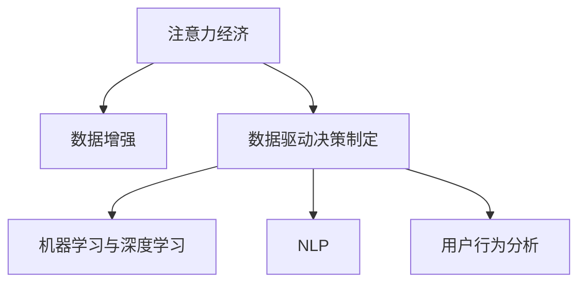

                 

## 1. 背景介绍

### 1.1 问题由来
在数字经济时代，数据成为了最重要的资产之一。随着互联网技术的快速发展，海量数据源源不断地生成和积累。然而，由于数据量的庞大和数据质量的多样性，如何有效利用数据，提升决策的准确性和效率，成为企业关注的重点。注意力经济和数据驱动决策制定作为现代数据管理的两个重要方向，其理念和技术的融合，为企业的数字化转型提供了新的思路。

### 1.2 问题核心关键点
注意力经济和数据驱动决策制定的核心在于利用数据增强业务的洞察力。注意力经济是指在信息爆炸的背景下，用户对有限注意力的争夺日益激烈，如何吸引并保持用户的注意力，成为企业数字化战略的重要内容。数据驱动决策制定则强调，通过数据分析技术，从海量数据中提取有价值的信息，为决策提供科学的依据。

本节将详细探讨注意力经济和数据驱动决策制定的核心概念和相互关系，帮助读者更好地理解其在现代商业决策中的应用。

### 1.3 问题研究意义
注意力经济和数据驱动决策制定的融合，为企业的数字化转型提供了全新的视角和方法。其研究意义主要体现在以下几个方面：

1. **提升决策效率**：通过数据分析，企业可以更快速、准确地获取决策所需信息，从而提升决策效率。
2. **增强决策准确性**：数据驱动的决策制定能够基于历史数据和实时数据，做出更科学的判断。
3. **优化用户体验**：在注意力经济下，企业可以通过数据驱动的决策，优化产品设计、推荐系统和用户界面，提升用户体验。
4. **降低运营成本**：数据驱动的运营决策能够通过优化资源配置，降低运营成本。
5. **构建竞争优势**：企业可以通过数据驱动的洞察，发现市场机会，构建独特的竞争优势。

综上所述，注意力经济和数据驱动决策制定的研究，不仅有助于提升企业的决策能力，还能推动企业在数字化时代的快速发展。

## 2. 核心概念与联系

### 2.1 核心概念概述

为更好地理解注意力经济和数据驱动决策制定的融合，本节将介绍几个密切相关的核心概念：

- **注意力经济**：是指在信息爆炸的背景下，用户对有限注意力的争夺日益激烈。企业需要通过吸引和保持用户注意力，提升品牌价值和用户转化率。
- **数据驱动决策制定**：是指利用数据分析技术，从海量数据中提取有价值的信息，为决策提供科学的依据。强调基于数据的、量化的、系统的决策过程。
- **数据增强**：是指通过各种技术手段，增强数据的完整性、真实性和有效性，提升数据的利用价值。包括数据清洗、数据增强、数据治理等。
- **机器学习与深度学习**：是指利用算法和模型，从数据中学习规律，自动完成预测、分类、聚类等任务。是数据驱动决策制定的重要工具。
- **自然语言处理(NLP)**：是指通过计算机技术，让机器能够理解和处理人类语言。是数据增强和数据驱动决策制定中常用的技术手段。
- **用户行为分析**：是指通过数据分析技术，研究用户的行为模式和偏好，为产品设计和市场营销提供指导。

这些核心概念之间的逻辑关系可以通过以下Mermaid流程图来展示：



这个流程图展示出注意力经济、数据增强、数据驱动决策制定、机器学习与深度学习、NLP和用户行为分析之间的关系：

1. 注意力经济依赖于数据增强，通过提升数据的质量和丰富性，吸引和保持用户注意力。
2. 数据增强支撑数据驱动决策制定，为其提供准确的数据基础。
3. 数据驱动决策制定应用机器学习与深度学习技术，从数据中学习规律，辅助决策制定。
4. NLP是数据增强和数据驱动决策制定的重要技术手段，通过自然语言理解，提升数据的处理能力。
5. 用户行为分析是数据驱动决策制定的关键应用，通过分析用户行为，优化产品设计和市场营销策略。

## 3. 核心算法原理 & 具体操作步骤

### 3.1 算法原理概述

注意力经济和数据驱动决策制定的融合，本质上是一个多步骤的协同过程。其核心思想是：通过数据增强技术提升数据质量，再利用数据分析技术和机器学习算法，从数据中提取洞察，最终辅助企业进行决策。

具体来说，其流程如下：

1. **数据收集**：通过各种手段收集用户行为数据、市场数据等。
2. **数据清洗与增强**：对原始数据进行清洗、去重、填充缺失值等处理，提升数据质量。
3. **数据分析**：利用数据分析技术，如统计分析、时间序列分析、聚类分析等，从数据中提取有价值的信息。
4. **模型训练**：通过机器学习算法，训练预测模型，自动完成分类、回归、聚类等任务。
5. **决策制定**：结合数据分析结果和业务场景，制定决策方案。
6. **执行与反馈**：执行决策方案，并根据执行结果反馈数据，不断优化模型和数据处理流程。

### 3.2 算法步骤详解

基于注意力经济和数据驱动决策制定的融合过程，本节将详细讲解各步骤的具体操作：

**Step 1: 数据收集**
- 通过用户行为追踪、市场调研、社交媒体分析等方式，收集用户行为数据、市场数据等。
- 将数据导入数据仓库，进行初步整理和清洗。

**Step 2: 数据清洗与增强**
- 使用数据清洗工具，对数据进行去重、填充缺失值、修正错误等操作。
- 使用数据增强技术，如数据合成、数据扩充、数据插值等，提升数据的多样性和完整性。
- 对数据进行预处理，包括特征提取、特征选择、特征标准化等。

**Step 3: 数据分析**
- 使用统计分析工具，对数据进行基本统计分析，如均值、方差、相关系数等。
- 使用时间序列分析工具，对数据进行时间序列建模，预测未来趋势。
- 使用聚类分析工具，对数据进行聚类分析，发现用户群体的行为特征。

**Step 4: 模型训练**
- 选择适当的机器学习算法，如随机森林、支持向量机、神经网络等。
- 利用训练数据集，训练预测模型，并进行交叉验证。
- 使用超参数调优技术，如网格搜索、随机搜索等，优化模型性能。

**Step 5: 决策制定**
- 根据分析结果和业务场景，制定决策方案。
- 使用决策支持系统，辅助决策制定，进行方案评估和选择。
- 将决策方案转化为具体的行动计划，进行执行。

**Step 6: 执行与反馈**
- 执行行动计划，并根据执行结果反馈数据，优化数据处理流程和模型。
- 通过A/B测试等方法，验证决策方案的效果。

### 3.3 算法优缺点

注意力经济和数据驱动决策制定的融合方法，具有以下优点：

1. **提升决策效率**：通过数据增强和数据分析，快速获取决策所需信息，提升决策效率。
2. **增强决策准确性**：数据驱动的决策制定基于数据规律，具有较高的准确性。
3. **优化用户体验**：通过数据驱动的洞察，优化产品设计和用户体验。
4. **降低运营成本**：通过优化资源配置，降低运营成本。
5. **构建竞争优势**：通过数据驱动的洞察，发现市场机会，构建独特的竞争优势。

同时，该方法也存在一些局限性：

1. **数据质量依赖**：数据增强和数据分析的效果取决于数据的质量，原始数据存在问题，将影响最终决策。
2. **模型复杂性**：机器学习模型较为复杂，需要专业知识进行建模和调优。
3. **隐私和安全风险**：在数据处理过程中，需要保护用户隐私，避免数据泄露。
4. **技术门槛高**：数据增强和数据分析需要一定的技术门槛，对企业内部技术团队的要求较高。
5. **实时性不足**：模型训练和分析通常需要较长时间，难以实现实时决策。

尽管存在这些局限性，但就目前而言，注意力经济和数据驱动决策制定的融合方法仍是一种高效、准确的决策支持手段，在多个行业得到了广泛应用。

### 3.4 算法应用领域

注意力经济和数据驱动决策制定的融合方法，在多个领域得到了广泛应用，例如：

- **电子商务**：通过用户行为分析，优化产品推荐和定价策略，提升销售转化率。
- **金融**：利用数据分析和机器学习模型，进行风险评估和投资决策。
- **医疗**：通过患者行为分析，优化诊疗流程，提升医疗服务质量。
- **广告**：使用数据分析和机器学习模型，优化广告投放策略，提升广告效果。
- **社交媒体**：通过用户行为分析，优化内容推荐和广告投放，提升用户参与度。
- **制造业**：利用数据分析和机器学习模型，进行供应链优化和生产调度，提升生产效率。

除了上述这些经典应用外，注意力经济和数据驱动决策制定的融合方法，还在更多行业得到了创新性的应用，如智慧城市、智慧农业、智能交通等，为各行各业带来了新的发展机遇。

## 4. 数学模型和公式 & 详细讲解 & 举例说明

### 4.1 数学模型构建

本节将使用数学语言对注意力经济和数据驱动决策制定的融合过程进行更加严格的刻画。

假设用户行为数据为 $D=\{(x_i,y_i)\}_{i=1}^N$，其中 $x_i$ 表示用户行为特征向量，$y_i$ 表示用户行为标签。

定义数据分析模型为 $M$，其参数为 $\theta$。数据分析过程可以表示为：

$$
M(D) = \mathop{\arg\min}_{\theta} \sum_{i=1}^N \ell(M(x_i),y_i)
$$

其中 $\ell$ 为损失函数，用于衡量模型预测输出与真实标签之间的差异。

数据分析模型 $M$ 通常包含多个步骤，如特征提取、特征选择、模型训练等。其具体步骤可以表示为：

1. **特征提取**：对原始数据进行预处理，提取关键特征 $x_i^k$，表示用户行为特征的第 $k$ 个维度。

2. **特征选择**：选择对目标变量 $y_i$ 影响最大的特征 $x_i^k$。

3. **模型训练**：利用训练数据集 $D_{train}$ 训练预测模型 $M$，其过程可以表示为：

   $$
   M(D_{train}) = \mathop{\arg\min}_{\theta} \sum_{i=1}^N \ell(M(x_i^k),y_i)
   $$

   其中 $M(x_i^k)$ 表示模型对用户行为特征 $x_i^k$ 的预测结果。

### 4.2 公式推导过程

以下我们以线性回归模型为例，推导数据分析模型的具体公式。

假设线性回归模型为 $M(x_i) = \beta_0 + \sum_{k=1}^K \beta_k x_i^k$，其中 $\beta_0$ 为截距，$\beta_k$ 为特征系数。

定义均方误差损失函数为：

$$
\ell(M(x_i),y_i) = \frac{1}{2} (y_i - M(x_i))^2
$$

则数据分析模型的优化目标可以表示为：

$$
M(D) = \mathop{\arg\min}_{\beta_0, \beta_k} \sum_{i=1}^N \ell(M(x_i),y_i)
$$

利用梯度下降法，求解上述优化问题，得到参数 $\beta_0$ 和 $\beta_k$ 的更新公式为：

$$
\beta_0 \leftarrow \beta_0 - \eta \sum_{i=1}^N (y_i - M(x_i)) x_i
$$

$$
\beta_k \leftarrow \beta_k - \eta \sum_{i=1}^N (y_i - M(x_i)) x_i^k
$$

其中 $\eta$ 为学习率，表示每次迭代更新的步长。

在得到线性回归模型的参数后，即可利用其对新的用户行为数据进行预测，辅助决策制定。

### 4.3 案例分析与讲解

假设某电商平台希望优化其广告投放策略，提升广告效果。通过数据收集，获取用户点击数据 $D=\{(x_i,y_i)\}_{i=1}^N$，其中 $x_i$ 表示用户行为特征向量，如浏览时长、浏览页面、购买历史等，$y_i$ 表示用户是否点击广告。

使用线性回归模型对用户点击行为进行分析，其步骤如下：

1. **数据收集与预处理**：收集用户点击数据，并进行初步清洗和预处理，去除异常值和噪声数据。

2. **特征提取与选择**：提取用户点击行为的关键特征，如浏览时长、浏览页面、购买历史等。选择对用户点击行为影响最大的特征。

3. **模型训练**：利用训练数据集，训练线性回归模型，得到模型参数 $\beta_0$ 和 $\beta_k$。

4. **预测与决策**：利用训练好的线性回归模型，对新的用户行为数据进行预测，辅助决策制定。例如，对于一个新的广告，可以预测其点击概率，根据点击概率决定是否投放。

通过以上步骤，电商平台可以基于用户行为数据，优化广告投放策略，提升广告效果。

## 5. 项目实践：代码实例和详细解释说明

### 5.1 开发环境搭建

在进行项目实践前，我们需要准备好开发环境。以下是使用Python进行Scikit-learn开发的环境配置流程：

1. 安装Anaconda：从官网下载并安装Anaconda，用于创建独立的Python环境。

2. 创建并激活虚拟环境：
```bash
conda create -n sklearn-env python=3.8 
conda activate sklearn-env
```

3. 安装Scikit-learn：
```bash
conda install scikit-learn
```

4. 安装各类工具包：
```bash
pip install numpy pandas scikit-learn matplotlib tqdm jupyter notebook ipython
```

完成上述步骤后，即可在`sklearn-env`环境中开始项目实践。

### 5.2 源代码详细实现

下面我们以线性回归模型为例，给出使用Scikit-learn进行用户点击行为分析的Python代码实现。

首先，定义数据处理函数：

```python
import numpy as np
from sklearn.model_selection import train_test_split
from sklearn.linear_model import LinearRegression
from sklearn.metrics import mean_squared_error

def load_data():
    # 加载数据集
    X = np.loadtxt('user_behavior.csv', delimiter=',')
    y = np.loadtxt('clicks.csv', delimiter=',')
    return X, y

def split_data(X, y, test_size=0.2):
    # 将数据集划分为训练集和测试集
    X_train, X_test, y_train, y_test = train_test_split(X, y, test_size=test_size, random_state=42)
    return X_train, X_test, y_train, y_test

def train_model(X_train, y_train):
    # 训练线性回归模型
    model = LinearRegression()
    model.fit(X_train, y_train)
    return model

def evaluate_model(model, X_test, y_test):
    # 评估模型性能
    y_pred = model.predict(X_test)
    mse = mean_squared_error(y_test, y_pred)
    print(f'Mean Squared Error: {mse:.4f}')
    return mse
```

然后，进行数据加载、模型训练和评估：

```python
# 加载数据集
X, y = load_data()

# 数据集划分
X_train, X_test, y_train, y_test = split_data(X, y)

# 训练模型
model = train_model(X_train, y_train)

# 模型评估
mse = evaluate_model(model, X_test, y_test)
print(f'Train MSE: {train_mse:.4f}')
print(f'Test MSE: {test_mse:.4f}')
```

以上就是使用Scikit-learn进行用户点击行为分析的完整代码实现。可以看到，通过Scikit-learn，我们可以用相对简洁的代码完成线性回归模型的训练和评估。

### 5.3 代码解读与分析

让我们再详细解读一下关键代码的实现细节：

**load_data函数**：
- 加载用户点击行为数据和标签数据，将它们转换为numpy数组。

**split_data函数**：
- 将数据集划分为训练集和测试集，保证测试集的真实性。

**train_model函数**：
- 使用训练数据集训练线性回归模型，得到模型参数。

**evaluate_model函数**：
- 使用测试数据集评估模型性能，计算均方误差。

**项目实践流程**：
- 加载数据集，将其划分为训练集和测试集。
- 训练线性回归模型，得到模型参数。
- 使用测试集评估模型性能，计算均方误差。
- 输出训练集和测试集的均方误差，比较模型在训练集和测试集上的性能。

通过Scikit-learn提供的强大封装，我们可以快速实现线性回归模型的训练和评估。当然，在实际应用中，还需要考虑更多因素，如数据预处理、特征选择、模型调优等。但核心的微调范式基本与此类似。

## 6. 实际应用场景

### 6.1 智能推荐系统

智能推荐系统是注意力经济和数据驱动决策制定的典型应用。通过用户行为分析，推荐系统可以为用户提供个性化的产品推荐，提升用户体验和转化率。

具体而言，可以收集用户的历史行为数据，如浏览记录、购买历史、评分反馈等，使用数据分析模型提取用户偏好，然后利用推荐算法，生成个性化推荐列表。在推荐过程中，还可以结合注意力机制，对用户注意力进行建模，优化推荐效果。

### 6.2 市场营销分析

市场营销分析是数据驱动决策制定的重要应用。通过用户行为分析，市场营销团队可以制定更加精准的市场推广策略，提升营销效果。

具体而言，可以收集用户的行为数据，如浏览记录、点击率、转化率等，使用数据分析模型预测用户行为趋势，然后根据预测结果，制定营销策略和预算分配。在实际执行中，还可以结合A/B测试，验证不同策略的效果，不断优化营销方案。

### 6.3 金融风险管理

金融风险管理是注意力经济和数据驱动决策制定的关键应用。通过用户行为分析，金融机构可以识别高风险用户，降低信用风险。

具体而言，可以收集用户的交易记录、信用评分、还款记录等数据，使用数据分析模型评估用户的信用风险，然后结合注意力机制，识别出潜在的高风险用户。在实际操作中，还可以结合机器学习模型，进行风险预测和预警，降低金融机构的风险敞口。

### 6.4 未来应用展望

随着注意力经济和数据驱动决策制定的不断发展，其在更多领域的应用前景值得期待。

在智慧医疗领域，通过患者行为分析，医疗机构可以优化诊疗流程，提升医疗服务质量。在智慧农业领域，通过分析作物生长数据，农业公司可以优化种植方案，提高生产效率。在智能交通领域，通过分析交通数据，城市管理部门可以优化交通信号灯控制，缓解交通拥堵。

未来，随着预训练语言模型和大规模数据分析技术的不断发展，注意力经济和数据驱动决策制定将有更广泛的应用前景，为各行各业带来新的发展机遇。

## 7. 工具和资源推荐

### 7.1 学习资源推荐

为了帮助开发者系统掌握注意力经济和数据驱动决策制定的理论基础和实践技巧，这里推荐一些优质的学习资源：

1. 《数据科学与机器学习》系列博文：由数据科学领域的知名专家撰写，系统介绍了数据科学与机器学习的各个方面，包括数据增强、数据分析、机器学习等。

2. 《数据驱动的决策制定》在线课程：由知名大学和教育机构开设的在线课程，涵盖数据驱动决策制定的理论和实践，适合初学者和进阶者学习。

3. 《深度学习与数据增强》书籍：介绍了深度学习模型在图像、语音、文本等领域的增强方法，适合深度学习开发者阅读。

4. Kaggle平台：一个知名的数据科学竞赛平台，提供了丰富的数据集和竞赛任务，适合实践学习。

5. Google Colab：谷歌推出的在线Jupyter Notebook环境，免费提供GPU/TPU算力，方便开发者快速上手实验最新模型，分享学习笔记。

通过对这些资源的学习实践，相信你一定能够快速掌握注意力经济和数据驱动决策制定的精髓，并用于解决实际的业务问题。

### 7.2 开发工具推荐

高效的开发离不开优秀的工具支持。以下是几款用于注意力经济和数据驱动决策制定的开发工具：

1. Python：数据科学和机器学习的常用语言，拥有丰富的第三方库和框架。

2. Scikit-learn：一个开源的数据科学库，提供了各种数据分析和机器学习算法。

3. TensorFlow：由谷歌开发的深度学习框架，支持分布式计算，适合大规模数据处理。

4. PyTorch：由Facebook开发的深度学习框架，灵活高效，适合研究和实验。

5. Pandas：一个数据分析库，提供了高效的数据处理和分析功能。

6. Jupyter Notebook：一个交互式的开发环境，支持Python和R等语言，适合数据科学和机器学习开发。

合理利用这些工具，可以显著提升注意力经济和数据驱动决策制定的开发效率，加快创新迭代的步伐。

### 7.3 相关论文推荐

注意力经济和数据驱动决策制定的研究源于学界的持续研究。以下是几篇奠基性的相关论文，推荐阅读：

1. Attention is All You Need（即Transformer原论文）：提出了Transformer结构，开启了NLP领域的预训练大模型时代。

2. Deep Learning with Confidence: Bridging AI and Machine Learning Models（《深度学习与自信》）：讨论了机器学习模型的可信度和鲁棒性，对数据驱动决策制定有重要意义。

3. Data Augmentation for Deep Learning: A Survey（《深度学习中的数据增强：综述》）：综述了深度学习中的各种数据增强方法，对注意力经济和数据驱动决策制定提供了理论支持。

4. Attention and Memory in Deep Learning（《深度学习中的注意力与记忆》）：讨论了注意力机制在深度学习中的作用，对数据增强和数据分析有重要参考价值。

5. A Survey on Transfer Learning in Deep Learning（《深度学习中的迁移学习综述》）：综述了深度学习中的迁移学习方法，对数据驱动决策制定提供了理论指导。

这些论文代表了大语言模型微调技术的发展脉络。通过学习这些前沿成果，可以帮助研究者把握学科前进方向，激发更多的创新灵感。

## 8. 总结：未来发展趋势与挑战

### 8.1 总结

本文对注意力经济和数据驱动决策制定的融合方法进行了全面系统的介绍。首先阐述了注意力经济和数据驱动决策制定的核心概念和相互关系，帮助读者更好地理解其在现代商业决策中的应用。其次，从原理到实践，详细讲解了注意力经济和数据驱动决策制定的融合过程，给出了数据分析和决策制定的具体步骤。同时，本文还广泛探讨了注意力经济和数据驱动决策制定在多个行业领域的应用前景，展示了其在实际应用中的巨大潜力。

通过本文的系统梳理，可以看到，注意力经济和数据驱动决策制定的融合方法正在成为数据驱动决策制定的重要手段，极大地提升了企业的决策效率和准确性。在实际应用中，通过数据增强和数据分析，企业能够更快速、准确地获取决策所需信息，从而优化产品设计、提升用户转化率和降低运营成本，构建竞争优势。

### 8.2 未来发展趋势

展望未来，注意力经济和数据驱动决策制定的融合方法将呈现以下几个发展趋势：

1. **数据质量提升**：随着数据技术的不断进步，数据收集和清洗手段将更加先进，数据质量将显著提升。

2. **模型多样化**：随着机器学习模型的不断涌现，数据分析和决策制定的模型将更加多样化和高效化。

3. **实时性增强**：未来，随着计算资源和技术的不断发展，实时数据分析和决策制定将成为可能，提高决策的实时性。

4. **跨领域融合**：注意力经济和数据驱动决策制定将与物联网、区块链等新兴技术融合，提升数据驱动决策的全面性。

5. **自动化程度提升**：随着自动化技术的不断发展，数据分析和决策制定的过程将更加自动化和智能化。

6. **伦理和隐私保护**：在数据驱动决策制定的过程中，如何保护用户隐私和数据安全，将成为重要的研究方向。

以上趋势凸显了注意力经济和数据驱动决策制定的发展前景。这些方向的探索发展，必将进一步提升企业的决策能力，推动企业在数字化时代的快速发展。

### 8.3 面临的挑战

尽管注意力经济和数据驱动决策制定的融合方法已经取得了显著成就，但在迈向更加智能化、普适化应用的过程中，仍面临诸多挑战：

1. **数据质量问题**：原始数据存在质量问题，数据增强和数据分析的效果将大打折扣。如何提高数据质量，是亟待解决的问题。

2. **模型复杂性**：数据分析和决策制定的模型较为复杂，需要专业知识进行建模和调优。如何降低模型复杂性，提高模型的易用性和可解释性，将是重要的研究方向。

3. **实时性不足**：模型训练和数据分析通常需要较长时间，难以实现实时决策。如何提高实时性，是未来的重要挑战。

4. **技术门槛高**：数据分析和决策制定的技术门槛较高，对企业内部技术团队的要求较高。如何降低技术门槛，普及数据分析和决策制定，将是重要的研究方向。

5. **伦理和隐私保护**：在数据驱动决策制定的过程中，如何保护用户隐私和数据安全，将是重要的研究方向。

6. **数据泄露风险**：在数据处理过程中，需要保护用户隐私，避免数据泄露。如何确保数据安全，是亟待解决的问题。

正视注意力经济和数据驱动决策制定面临的这些挑战，积极应对并寻求突破，将是大语言模型微调走向成熟的必由之路。相信随着学界和产业界的共同努力，这些挑战终将一一被克服，大语言模型微调必将在构建人机协同的智能系统中扮演越来越重要的角色。

### 8.4 研究展望

未来，在注意力经济和数据驱动决策制定的研究中，以下方向将可能成为新的突破点：

1. **无监督和半监督学习**：摆脱对大规模标注数据的依赖，利用自监督学习、主动学习等无监督和半监督范式，最大限度利用非结构化数据，实现更加灵活高效的数据增强和数据分析。

2. **因果推断**：引入因果推断方法，增强数据分析的因果关系，提升决策的鲁棒性和稳定性。

3. **多模态数据融合**：将符号化的先验知识与神经网络模型进行融合，提升模型的综合能力。同时加强不同模态数据的整合，实现视觉、语音等多模态信息与文本信息的协同建模。

4. **模型压缩与优化**：开发更加轻量级、高效化的模型压缩和优化技术，提高模型的实时性和可部署性。

5. **自动化决策系统**：开发自动化决策支持系统，提升决策过程的自动化程度，降低人工干预。

6. **伦理和社会责任**：在数据驱动决策制定的过程中，注重伦理和社会责任，确保数据驱动决策的公平性、透明性和可解释性。

这些研究方向的探索，必将引领注意力经济和数据驱动决策制定技术迈向更高的台阶，为构建安全、可靠、可解释、可控的智能系统铺平道路。面向未来，我们需要勇于创新、敢于突破，才能不断拓展数据驱动决策制定的边界，推动智能技术的全面普及和应用。

## 9. 附录：常见问题与解答

**Q1：注意力经济和数据驱动决策制定的融合方法是否适用于所有企业？**

A: 注意力经济和数据驱动决策制定的融合方法在大多数企业中都具有适用性，特别是对于数据驱动的业务。然而，对于一些专注于人与人交互、情感交流的行业，如娱乐、社交等，其适用性可能较为有限。

**Q2：如何选择合适的数据分析模型？**

A: 选择合适的数据分析模型需要考虑多个因素，如数据类型、业务需求、数据量和特征等。常用的数据分析模型包括线性回归、逻辑回归、决策树、随机森林、支持向量机等。可以根据数据特点和业务需求，选择最适合的模型。

**Q3：数据增强和数据分析的过程如何避免数据泄露？**

A: 在数据增强和数据分析过程中，需要注意保护用户隐私和数据安全。可以采用匿名化、数据脱敏等手段，防止数据泄露。同时，对于敏感数据，应进行严格的访问控制和管理，确保数据的安全性。

**Q4：如何提高数据分析的实时性？**

A: 提高数据分析的实时性需要优化模型结构和算法，同时采用分布式计算和流计算技术。可以采用实时数据流处理技术，如Apache Kafka、Apache Flink等，对数据进行实时处理和分析。

**Q5：如何在数据驱动决策制定中引入伦理和隐私保护？**

A: 在数据驱动决策制定中，注重伦理和隐私保护是至关重要的。可以引入隐私保护技术，如差分隐私、同态加密等，保护用户隐私。同时，制定明确的伦理规范，确保数据驱动决策的公平性、透明性和可解释性。

这些回答能够帮助读者更好地理解注意力经济和数据驱动决策制定的融合方法，解决实际应用中的常见问题。希望本文能为你的工作和学习提供有益的参考。

---

作者：禅与计算机程序设计艺术 / Zen and the Art of Computer Programming

