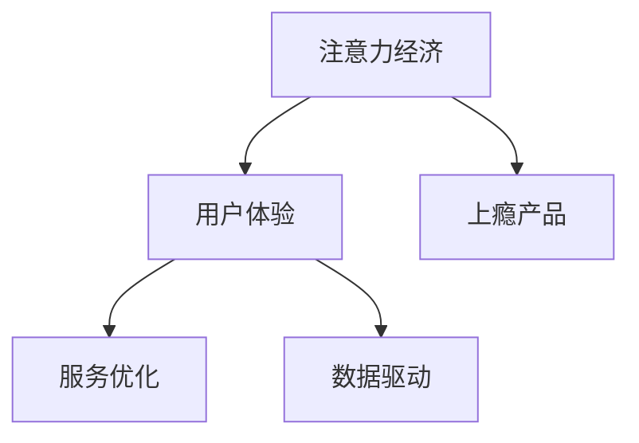

                 

# 注意力经济与用户体验优化：创建让人上瘾的产品和服务的秘诀

> 关键词：注意力经济, 用户体验, 上瘾产品, 服务优化, 数据驱动, 行为设计, 神经网络

## 1. 背景介绍

在数字经济时代，注意力成为了最宝贵的资源。无论是广告主、内容创作者还是应用开发者，都试图通过各种手段吸引和保持用户的注意力。而用户体验(User Experience, UX)则是吸引和留住用户的关键。优质的用户体验不仅能够提升用户满意度，还能增加用户粘性，驱动用户持续使用产品或服务。因此，如何通过注意力经济和用户体验优化，创建让人上瘾的产品和服务，成为了一个亟待解决的挑战。

### 1.1 问题由来

在过去的几年中，随着互联网的普及和智能手机的普及，用户的时间被各种应用程序和内容所分流，注意力资源变得前所未有的分散。广告主和应用开发者面临着越来越高的用户获取成本，用户体验也受到了严重影响。如何在注意力资源有限的情况下，最大化用户的参与度和满意度，成为了一个迫切需要解决的问题。

### 1.2 问题核心关键点

在这个问题中，关键点在于：
1. 如何通过数据驱动的方法，精确地了解用户的行为和偏好。
2. 如何设计出符合用户心理需求的产品和服务，使用户上瘾。
3. 如何通过神经网络等技术，优化用户体验，提高用户满意度。

## 2. 核心概念与联系

### 2.1 核心概念概述

为了更好地理解注意力经济和用户体验优化，本节将介绍几个密切相关的核心概念：

- 注意力经济（Attention Economy）：指在信息过载的时代，如何通过各种手段吸引和保持用户的注意力。注意力经济强调的是如何最大化用户的注意力资源，提高广告和内容的转化率。
- 用户体验（User Experience, UX）：指用户在使用产品或服务过程中所体验到的感受、情绪和认知。用户体验优化旨在通过改善产品和服务的设计，提高用户的满意度和粘性。
- 上瘾产品（Addictive Products）：指能够通过心理设计、行为设计等手段，持续吸引用户注意力，使用户形成依赖的产品。
- 服务优化（Service Optimization）：指通过各种技术手段，如神经网络、机器学习等，不断优化服务质量，提升用户满意度的过程。
- 数据驱动（Data-Driven）：指通过数据分析、机器学习等技术，从海量数据中提取有用信息，指导决策和优化。

这些核心概念之间的逻辑关系可以通过以下Mermaid流程图来展示：



这个流程图展示了一些关键概念及其之间的关系：

1. 注意力经济通过吸引和保持用户注意力，为产品和服务创造价值。
2. 用户体验优化旨在提高用户满意度和粘性，使用户更愿意使用产品和服务。
3. 上瘾产品通过心理和行为设计，使用户形成依赖，保持高参与度。
4. 服务优化通过技术手段，提升服务质量和效率，进一步优化用户体验。
5. 数据驱动通过分析用户数据，指导产品设计和优化，提升整体效果。

这些概念共同构成了创建让人上瘾的产品和服务的理论基础。

## 3. 核心算法原理 & 具体操作步骤
### 3.1 算法原理概述

注意力经济和用户体验优化的核心算法原理，主要基于以下几个关键点：

1. 用户行为分析：通过分析用户的行为数据，了解用户的兴趣、偏好和需求。
2. 个性化推荐：根据用户的行为数据和历史数据，提供个性化的内容和推荐，提高用户满意度和粘性。
3. 用户反馈循环：通过收集用户的反馈数据，不断优化产品和服务设计，提高用户体验。
4. 神经网络模型：利用神经网络等技术，从大规模数据中提取有用信息，优化推荐算法和用户体验。

这些原理通过数据驱动的方法，实现了用户行为和产品服务设计的紧密结合，从而创建让人上瘾的产品和服务。

### 3.2 算法步骤详解

基于注意力经济和用户体验优化的算法步骤，一般包括以下几个关键步骤：

**Step 1: 数据收集与处理**

- 收集用户行为数据：包括用户点击、浏览、购买等行为数据，以及社交媒体、评论等反馈数据。
- 数据清洗与处理：去除异常数据、噪音数据，并进行归一化、标准化等预处理。
- 数据划分：将数据划分为训练集、验证集和测试集，以便于模型训练和评估。

**Step 2: 用户行为分析**

- 用户兴趣建模：通过分析用户行为数据，建立用户兴趣模型，了解用户的兴趣偏好。
- 行为序列建模：将用户行为数据转化为序列数据，使用RNN、LSTM等序列模型进行建模。
- 用户画像构建：通过用户行为分析，构建详细的用户画像，描述用户的特征和需求。

**Step 3: 个性化推荐**

- 推荐算法选择：选择合适的推荐算法，如协同过滤、基于内容的推荐、混合推荐等。
- 模型训练：使用训练集数据，训练推荐模型，使其能够根据用户画像和行为数据，提供个性化推荐。
- 模型评估：在验证集上评估推荐模型的效果，调整超参数和算法，优化推荐结果。

**Step 4: 用户反馈循环**

- 收集用户反馈：通过用户评分、评论等形式，收集用户对推荐结果的反馈。
- 反馈数据处理：对用户反馈数据进行分析和处理，提取有用的信息。
- 模型优化：根据用户反馈数据，优化推荐模型和算法，提升推荐效果。

**Step 5: 服务优化**

- 优化推荐策略：根据用户行为数据和反馈数据，优化推荐策略，提升推荐效果。
- 技术手段应用：引入神经网络、深度学习等技术手段，提升推荐模型的准确性和鲁棒性。
- 服务质量监控：实时监控服务质量，及时发现和解决问题，提升用户体验。

**Step 6: 持续迭代**

- 数据持续收集：持续收集用户行为数据和反馈数据，保证推荐模型的持续优化。
- 算法持续改进：根据最新的用户数据和反馈数据，持续改进推荐算法和模型。
- 用户体验持续优化：根据用户反馈和行为数据，持续优化产品和服务设计，提升用户体验。

### 3.3 算法优缺点

基于注意力经济和用户体验优化的算法，具有以下优点：

1. 精准推荐：通过用户行为分析和个性化推荐，能够提供精准的个性化内容和服务，提升用户满意度。
2. 数据驱动：通过数据驱动的方法，能够客观地分析用户需求和行为，指导产品和服务的设计和优化。
3. 动态调整：能够根据用户反馈和行为数据，动态调整推荐策略和算法，持续优化用户体验。
4. 技术支持：利用神经网络、深度学习等先进技术手段，提升推荐算法的效果和鲁棒性。

同时，该算法也存在一定的局限性：

1. 数据隐私：收集用户行为数据和反馈数据时，需要注意保护用户隐私，避免数据滥用。
2. 数据噪声：用户行为数据和反馈数据可能存在噪声和异常，需要进行清洗和处理。
3. 模型复杂度：神经网络等模型具有较高的复杂度和计算成本，需要强大的计算资源支持。
4. 模型过拟合：在大规模数据上训练的模型可能存在过拟合问题，需要进行适当的正则化处理。

尽管存在这些局限性，但就目前而言，基于数据驱动的注意力经济和用户体验优化方法，仍然是创建让人上瘾的产品和服务的重要手段。未来相关研究的重点在于如何进一步提高模型的泛化能力、降低计算成本，并加强数据隐私保护。

### 3.4 算法应用领域

基于注意力经济和用户体验优化的算法，已经在诸多领域得到了广泛应用，例如：

- 电子商务：通过个性化推荐，提升用户的购物体验和购买转化率。
- 社交媒体：根据用户行为数据，推荐相关内容和广告，提高用户粘性。
- 在线教育：根据用户学习行为，提供个性化的课程推荐和学习路径，提升学习效果。
- 金融服务：根据用户投资行为，推荐合适的理财产品，提升用户满意度。
- 娱乐行业：根据用户消费行为，推荐合适的影视作品和游戏，提高用户粘性。

除了上述这些经典应用外，注意力经济和用户体验优化技术也在更多领域得到创新性地应用，如可控内容生成、用户行为预测、智能客服等，为各行业的数字化转型提供了新的技术路径。

## 4. 数学模型和公式 & 详细讲解 & 举例说明

### 4.1 数学模型构建

基于注意力经济和用户体验优化的算法，主要通过以下数学模型来描述：

1. 用户兴趣模型：通过用户行为数据，建立用户兴趣向量 $x_i$，描述用户的兴趣偏好。

2. 用户行为序列模型：将用户行为数据转化为序列 $x_t=\{x_1,x_2,\dots,x_T\}$，其中 $T$ 为序列长度，$x_t$ 为第 $t$ 个时间步的用户行为数据。

3. 推荐模型：根据用户兴趣模型和行为序列模型，建立推荐模型 $f(x_i, x_t)$，预测用户对某物品的评分 $y$。

4. 用户反馈模型：根据用户对推荐结果的反馈数据 $y_i$，建立用户反馈模型 $g(x_i, y_i)$，优化推荐策略。

这些数学模型可以通过神经网络等机器学习模型来实现。

### 4.2 公式推导过程

以协同过滤推荐模型为例，公式推导过程如下：

设用户 $u$ 对物品 $i$ 的评分向量为 $\boldsymbol{r}_u$，物品 $i$ 的评分向量为 $\boldsymbol{r}_i$，用户 $u$ 对物品 $i$ 的评分 $y_{ui}$ 可以表示为：

$$ y_{ui} = \boldsymbol{r}_u \cdot \boldsymbol{r}_i $$

其中 $\cdot$ 表示向量点乘。

用户兴趣模型可以表示为：

$$ x_u = f(\boldsymbol{r}_u) $$

其中 $f$ 为兴趣模型，可以是线性回归、非线性模型等。

用户行为序列模型可以表示为：

$$ x_t = f(x_{t-1}, a_t) $$

其中 $a_t$ 为当前行为，$f$ 为行为序列模型。

推荐模型可以表示为：

$$ y_{ui} = g(x_u, x_t) $$

其中 $g$ 为推荐模型，可以是矩阵分解、协同过滤等。

用户反馈模型可以表示为：

$$ y_i = g(x_i, y_i) $$

其中 $g$ 为反馈模型，可以是梯度下降、概率模型等。

通过这些数学模型，可以系统地分析和优化用户行为和推荐结果，提升用户体验。

### 4.3 案例分析与讲解

以Netflix推荐系统为例，Netflix通过协同过滤推荐模型，实现了对用户行为数据的精准分析和个性化推荐，大幅提升了用户满意度和留存率。

具体而言，Netflix通过收集用户观看历史数据，构建用户兴趣模型和行为序列模型，并使用协同过滤推荐模型进行个性化推荐。Netflix还引入了矩阵分解等技术手段，进一步优化了推荐效果。Netflix的成功经验表明，通过精准的数据分析和个性化的推荐，可以极大地提升用户体验和用户粘性。

## 5. 项目实践：代码实例和详细解释说明
### 5.1 开发环境搭建

在进行注意力经济和用户体验优化实践前，我们需要准备好开发环境。以下是使用Python进行TensorFlow开发的环境配置流程：

1. 安装Anaconda：从官网下载并安装Anaconda，用于创建独立的Python环境。

2. 创建并激活虚拟环境：
```bash
conda create -n tf-env python=3.8 
conda activate tf-env
```

3. 安装TensorFlow：从官网获取对应的安装命令。例如：
```bash
pip install tensorflow==2.7
```

4. 安装TensorBoard：
```bash
pip install tensorboard
```

5. 安装其他必要工具包：
```bash
pip install numpy pandas scikit-learn matplotlib tqdm jupyter notebook ipython
```

完成上述步骤后，即可在`tf-env`环境中开始项目实践。

### 5.2 源代码详细实现

下面我们以Netflix推荐系统为例，给出使用TensorFlow进行协同过滤推荐模型训练的代码实现。

首先，定义协同过滤推荐模型的训练函数：

```python
import tensorflow as tf

def train_recommender(tfrecords_path, batch_size, num_epochs, embedding_dim=10):
    # 定义训练集和测试集的读取器
    train_dataset = tf.data.TFRecordDataset(tfrecords_path + '.train.tfrecords')
    test_dataset = tf.data.TFRecordDataset(tfrecords_path + '.test.tfrecords')
    
    # 定义特征列
    r_u = tf.feature_column.categorical_column_with_identity('r_u', num_buckets=5)
    r_i = tf.feature_column.categorical_column_with_identity('r_i', num_buckets=5)
    x_u = tf.feature_column.numeric_column('x_u')
    x_t = tf.feature_column.numeric_column('x_t')
    
    # 定义模型
    model = tf.keras.Sequential([
        tf.keras.layers.Dense(32, activation='relu', input_shape=[embedding_dim + 2*embedding_dim]),
        tf.keras.layers.Dense(16, activation='relu'),
        tf.keras.layers.Dense(1, activation='sigmoid')
    ])
    
    # 定义损失函数和优化器
    loss_fn = tf.keras.losses.BinaryCrossentropy(from_logits=True)
    optimizer = tf.keras.optimizers.Adam(learning_rate=0.001)
    
    # 定义训练过程
    def train_step(inputs):
        with tf.GradientTape() as tape:
            logits = model(tf.concat([x_u, x_t], axis=1))
            loss_value = loss_fn(y_true=tf.keras.backend.bincount(inputs), y_pred=logits)
        gradients = tape.gradient(loss_value, model.trainable_variables)
        optimizer.apply_gradients(zip(gradients, model.trainable_variables))
    
    # 定义评估过程
    def evaluate_step(inputs):
        logits = model(tf.concat([x_u, x_t], axis=1))
        return logits
```

然后，定义模型保存和加载函数：

```python
def save_model(model, checkpoint_path):
    checkpoint = tf.train.Checkpoint(model=model)
    checkpoint.save(checkpoint_path)
    
def load_model(checkpoint_path):
    checkpoint = tf.train.Checkpoint(model=model)
    checkpoint.restore(checkpoint_path)
```

接着，定义训练和评估函数：

```python
def train(model, train_dataset, validation_dataset, batch_size, epochs, checkpoint_path):
    checkpoint = tf.train.Checkpoint(model=model)
    for epoch in range(epochs):
        model.reset_metrics()
        for batch in train_dataset.batch(batch_size):
            train_step(batch)
        model.evaluate(validation_dataset.batch(batch_size), verbose=0)
        checkpoint.save(checkpoint_path)
    
def evaluate(model, test_dataset, batch_size):
    return test_dataset.batch(batch_size).predict()
```

最后，启动训练流程并在测试集上评估：

```python
train_recommender(tfrecords_path, batch_size, num_epochs, embedding_dim=10)
test_logits = evaluate(load_model(checkpoint_path), test_dataset, batch_size)
```

以上就是使用TensorFlow进行协同过滤推荐模型训练的完整代码实现。可以看到，通过TensorFlow，我们可以方便地构建和训练复杂的神经网络模型，从而实现精准的推荐。

### 5.3 代码解读与分析

让我们再详细解读一下关键代码的实现细节：

**train_recommender函数**：
- 定义训练集和测试集的读取器，使用TFRecordDataset将数据文件转化为TFRecord格式，方便模型读取。
- 定义特征列，包括用户兴趣向量、物品兴趣向量、行为特征向量等，通过feature_column将稀疏特征转化为密集特征。
- 定义推荐模型，包括多个全连接层，使用ReLU激活函数。
- 定义损失函数和优化器，使用二分类交叉熵损失函数和Adam优化器。
- 定义训练过程，使用梯度下降算法更新模型参数，并记录训练过程中的损失。
- 定义评估过程，使用预测结果和真实标签计算损失，并返回预测结果。

**save_model和load_model函数**：
- 定义模型保存和加载函数，使用tf.train.Checkpoint保存和恢复模型参数。

**train函数**：
- 定义训练过程，使用循环迭代训练集和验证集，记录损失和性能指标，并保存模型参数。

**evaluate函数**：
- 定义评估过程，使用预测结果和真实标签计算性能指标，并返回预测结果。

可以看到，TensorFlow提供了丰富的API和工具，可以方便地实现复杂的机器学习模型，并支持模型的训练、评估和部署。通过TensorFlow，我们可以轻松地构建和训练协同过滤推荐模型，实现精准的个性化推荐。

## 6. 实际应用场景
### 6.1 智能推荐系统

智能推荐系统已经成为电商、社交媒体、视频平台等应用的核心功能之一。通过精准的用户行为分析和个性化推荐，智能推荐系统能够提升用户的满意度，增加用户粘性，驱动用户持续使用产品和服务。

以Netflix为例，Netflix通过协同过滤推荐模型，实现了对用户行为数据的精准分析和个性化推荐，大幅提升了用户满意度和留存率。Netflix的成功经验表明，通过精准的数据分析和个性化的推荐，可以极大地提升用户体验和用户粘性。

### 6.2 内容创作平台

内容创作平台如YouTube、知乎等，需要通过精准的个性化推荐，吸引用户持续关注和观看。通过分析用户行为数据，内容创作平台可以推荐最符合用户兴趣的内容，提升用户的观看时长和参与度。

以YouTube为例，YouTube通过协同过滤推荐模型和神经网络模型，实现了对用户行为数据的精准分析和个性化推荐，大幅提升了用户的观看时长和粘性。YouTube的成功经验表明，通过精准的数据分析和个性化的推荐，可以极大地提升内容创作平台的流量和影响力。

### 6.3 广告投放平台

广告投放平台如Facebook、Google等，需要通过精准的个性化推荐，提高广告的点击率和转化率。通过分析用户行为数据，广告投放平台可以推荐最符合用户兴趣的广告，提升广告的效果和收益。

以Facebook为例，Facebook通过协同过滤推荐模型和神经网络模型，实现了对用户行为数据的精准分析和个性化推荐，大幅提升了广告的点击率和转化率。Facebook的成功经验表明，通过精准的数据分析和个性化的推荐，可以极大地提升广告投放平台的效果和收益。

### 6.4 未来应用展望

随着技术的发展，未来的注意力经济和用户体验优化技术将呈现以下几个趋势：

1. 实时化推荐：通过实时分析用户行为数据，实时生成个性化推荐，提升推荐的时效性和精度。

2. 多模态融合：通过融合视觉、语音、文本等多模态数据，提升推荐模型的效果和鲁棒性。

3. 增强现实推荐：通过增强现实技术，实现对用户行为的实时分析和个性化推荐。

4. 人工智能推荐：通过引入AI技术，提升推荐模型的复杂度和精度，实现更精准的推荐。

5. 跨领域推荐：通过跨领域数据融合，实现跨领域个性化推荐，拓展推荐应用场景。

6. 数据隐私保护：通过数据匿名化和加密等技术手段，保护用户隐私，避免数据滥用。

这些趋势将推动注意力经济和用户体验优化技术不断进步，为创建让人上瘾的产品和服务提供更多可能。

## 7. 工具和资源推荐
### 7.1 学习资源推荐

为了帮助开发者系统掌握注意力经济和用户体验优化的理论基础和实践技巧，这里推荐一些优质的学习资源：

1. 《推荐系统实战》书籍：介绍推荐系统的原理和算法，结合实际案例进行讲解。

2. 《深度学习》书籍：全面介绍深度学习的基本概念和算法，适合初学者入门。

3. 《TensorFlow实战》书籍：介绍TensorFlow的使用方法和最佳实践，适合TensorFlow开发者。

4. 《人工智能导论》课程：斯坦福大学的入门级课程，涵盖人工智能的基本概念和算法。

5. 《机器学习》课程：Coursera上的经典课程，涵盖机器学习的基本概念和算法。

通过对这些资源的学习实践，相信你一定能够快速掌握注意力经济和用户体验优化的精髓，并用于解决实际的推荐问题。

### 7.2 开发工具推荐

高效的开发离不开优秀的工具支持。以下是几款用于注意力经济和用户体验优化开发的常用工具：

1. TensorFlow：由Google主导开发的深度学习框架，支持大规模分布式训练，适合工业级应用。

2. PyTorch：由Facebook主导开发的深度学习框架，灵活易用，适合学术研究和实验。

3. Jupyter Notebook：支持交互式编程和数据分析，适合快速迭代和实验。

4. TensorBoard：TensorFlow配套的可视化工具，可实时监测模型训练状态，提供丰富的图表呈现方式。

5. Weights & Biases：模型训练的实验跟踪工具，可记录和可视化模型训练过程中的各项指标。

合理利用这些工具，可以显著提升注意力经济和用户体验优化的开发效率，加快创新迭代的步伐。

### 7.3 相关论文推荐

注意力经济和用户体验优化的发展源于学界的持续研究。以下是几篇奠基性的相关论文，推荐阅读：

1. 《推荐系统设计》论文：介绍推荐系统的基本概念和算法，涵盖协同过滤、基于内容的推荐等。

2. 《深度学习与推荐系统》论文：结合深度学习技术，提升推荐系统的精度和效果。

3. 《用户行为建模与个性化推荐》论文：通过用户行为数据建模，实现精准的个性化推荐。

4. 《注意力机制在推荐系统中的应用》论文：结合注意力机制，提升推荐模型的效果和鲁棒性。

5. 《人工智能与推荐系统》论文：探索人工智能技术在推荐系统中的应用。

这些论文代表了大语言模型微调技术的发展脉络。通过学习这些前沿成果，可以帮助研究者把握学科前进方向，激发更多的创新灵感。

## 8. 总结：未来发展趋势与挑战
### 8.1 总结

本文对基于注意力经济和用户体验优化的推荐系统进行了全面系统的介绍。首先阐述了推荐系统的重要性，明确了推荐系统在提升用户满意度和粘性方面的独特价值。其次，从原理到实践，详细讲解了推荐系统的数学模型和关键步骤，给出了推荐系统开发的完整代码实例。同时，本文还广泛探讨了推荐系统在电商、内容创作、广告等多个行业领域的应用前景，展示了推荐系统的广阔应用场景。此外，本文精选了推荐技术的各类学习资源，力求为读者提供全方位的技术指引。

通过本文的系统梳理，可以看到，基于注意力经济和用户体验优化的推荐系统正在成为互联网应用的重要手段，极大地提升了用户的满意度和粘性。推荐系统通过精准的数据分析和个性化的推荐，驱动用户持续使用产品和服务，为各行业的数字化转型提供了新的技术路径。未来，伴随推荐算法的不断进步和优化，推荐系统必将在更多领域得到应用，为经济社会发展注入新的动力。

### 8.2 未来发展趋势

展望未来，基于注意力经济和用户体验优化的推荐系统将呈现以下几个发展趋势：

1. 数据源的多样化：推荐系统将引入更多数据源，如社交网络、移动设备等，拓展推荐算法的覆盖范围。

2. 算法的复杂化：推荐系统将引入更多复杂算法，如深度学习、强化学习等，提升推荐模型的精度和效果。

3. 应用的场景化：推荐系统将拓展到更多场景，如医疗、教育、金融等，提供更加个性化的服务。

4. 技术融合：推荐系统将与其他人工智能技术进行更深入的融合，如自然语言处理、图像处理等，实现更加全面的推荐。

5. 数据隐私保护：推荐系统将更加注重数据隐私保护，通过数据匿名化和加密等手段，保护用户隐私。

以上趋势将推动推荐系统不断发展，为创建让人上瘾的产品和服务提供更多可能。

### 8.3 面临的挑战

尽管推荐系统已经在诸多领域得到了广泛应用，但在迈向更加智能化、普适化应用的过程中，它仍面临着诸多挑战：

1. 数据稀疏性：推荐系统需要大量的用户行为数据，但在某些领域和场景下，数据稀疏性问题较为严重，难以获取足够的数据。

2. 模型复杂度：推荐系统使用的深度学习模型具有较高的复杂度和计算成本，需要强大的计算资源支持。

3. 推荐多样性：推荐系统需要平衡推荐多样性和精准性，避免陷入“过滤泡沫”效应，影响用户体验。

4. 用户隐私保护：推荐系统需要保护用户隐私，避免数据滥用和侵犯用户权益。

5. 跨领域应用：推荐系统需要应对不同领域的数据特点和用户需求，提升跨领域推荐的效果。

6. 推荐系统的稳定性：推荐系统需要保证系统的稳定性和鲁棒性，避免推荐结果的波动。

正视推荐系统面临的这些挑战，积极应对并寻求突破，将推动推荐系统不断进步，为经济社会发展注入新的动力。

### 8.4 研究展望

面对推荐系统面临的种种挑战，未来的研究需要在以下几个方面寻求新的突破：

1. 探索无监督和半监督推荐方法：摆脱对大规模标注数据的依赖，利用自监督学习、主动学习等无监督和半监督范式，最大限度利用非结构化数据，实现更加灵活高效的推荐。

2. 研究参数高效和计算高效的推荐范式：开发更加参数高效的推荐方法，在固定大部分预训练参数的情况下，只更新极少量的任务相关参数。同时优化推荐模型的计算图，减少前向传播和反向传播的资源消耗，实现更加轻量级、实时性的部署。

3. 融合因果和对比学习范式：通过引入因果推断和对比学习思想，增强推荐模型建立稳定因果关系的能力，学习更加普适、鲁棒的语言表征，从而提升推荐模型的泛化性和抗干扰能力。

4. 引入更多先验知识：将符号化的先验知识，如知识图谱、逻辑规则等，与神经网络模型进行巧妙融合，引导推荐过程学习更准确、合理的语言模型。同时加强不同模态数据的整合，实现视觉、语音等多模态信息与文本信息的协同建模。

5. 结合因果分析和博弈论工具：将因果分析方法引入推荐模型，识别出模型决策的关键特征，增强输出解释的因果性和逻辑性。借助博弈论工具刻画人机交互过程，主动探索并规避模型的脆弱点，提高系统稳定性。

这些研究方向的探索，必将引领推荐系统技术迈向更高的台阶，为构建安全、可靠、可解释、可控的推荐系统铺平道路。面向未来，推荐系统还需要与其他人工智能技术进行更深入的融合，如自然语言处理、图像处理等，多路径协同发力，共同推动自然语言理解和智能交互系统的进步。只有勇于创新、敢于突破，才能不断拓展推荐系统的边界，让智能技术更好地造福人类社会。

## 9. 附录：常见问题与解答

**Q1：推荐系统是否适用于所有行业？**

A: 推荐系统在绝大多数行业中都有广泛的应用，如电商、社交媒体、视频平台等。但对于一些特定行业，如医疗、法律等，需要结合行业特点进行适当的调整和优化。

**Q2：如何平衡推荐多样性和精准性？**

A: 推荐系统需要平衡推荐多样性和精准性，避免推荐结果的过于集中，导致“过滤泡沫”效应。一种常见的做法是引入多样性损失函数，如Top-k多样性损失，引导推荐模型在推荐多样性和精准性之间取得平衡。

**Q3：推荐系统如何处理数据稀疏性问题？**

A: 推荐系统需要处理数据稀疏性问题，一种常见的方法是引入隐语义模型，如矩阵分解、协同过滤等，通过低秩矩阵分解等技术手段，从少量数据中提取有用的信息。

**Q4：推荐系统如何保护用户隐私？**

A: 推荐系统需要保护用户隐私，避免数据滥用和侵犯用户权益。一种常见的方法是采用数据匿名化和加密等技术手段，保护用户数据的隐私和安全。

**Q5：推荐系统的稳定性和鲁棒性如何保证？**

A: 推荐系统的稳定性和鲁棒性可以通过多种手段保证，如模型参数的调整、算法的设计和优化、数据的处理和清洗等。同时，还可以通过A/B测试等手段，不断优化推荐系统的效果和性能。

这些问题的解答，希望能够帮助开发者更好地理解注意力经济和用户体验优化，从而在实际项目中应用这些技术，提升推荐系统的效果和性能。

