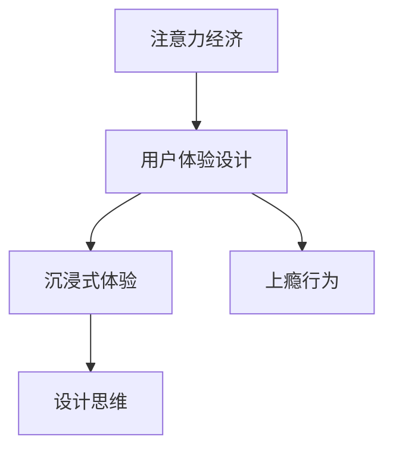

                 

# 注意力经济与用户体验设计思维：创建令人沉浸和上瘾的体验

> 关键词：注意力经济, 用户体验设计, 沉浸式体验, 上瘾行为, 设计思维, 用户行为分析

## 1. 背景介绍

### 1.1 问题由来

在信息爆炸的时代，用户面临的信息量呈指数级增长，如何在海量信息中脱颖而出，吸引并留住用户的注意力成为至关重要的问题。注意力经济应运而生，通过创造有价值的注意力，将用户资源进行高效分配和利用。用户体验设计思维作为一种系统的设计方法，关注用户需求，优化交互方式，提升用户的满意度和忠诚度。通过二者结合，我们可以创造出令人沉浸和上瘾的体验，实现价值变现。

### 1.2 问题核心关键点

- **注意力经济**：通过获取和利用用户的注意力，实现商业价值和社会价值。
- **用户体验设计**：通过研究用户行为和心理，设计符合用户需求的产品和服务。
- **沉浸式体验**：通过感官、情感、认知等多维度设计，使用户完全沉浸在体验中。
- **上瘾行为**：通过满足用户基本需求、激发动机、利用稀缺资源，让用户产生持续的使用动机。
- **设计思维**：以用户为中心，从问题出发，创新解决方案。

### 1.3 问题研究意义

在注意力经济的时代，注意力作为一种稀缺资源，如何高效利用吸引用户注意力，并将注意力转化为用户粘性，是许多企业面临的核心挑战。用户体验设计思维作为一种系统的设计方法，关注用户体验的全过程，通过深入了解用户需求，创造令人沉浸和上瘾的体验，提升用户满意度和忠诚度，从而实现商业价值的最大化。

## 2. 核心概念与联系

### 2.1 核心概念概述

为更好地理解注意力经济与用户体验设计思维的结合，本节将介绍几个关键概念：

- **注意力经济**：利用用户的注意力资源，进行商业价值变现的经济模式。通过优质的内容、有吸引力的交互设计、合理的价值分配，实现注意力的有效获取和利用。
- **用户体验设计**：一种以用户为中心的设计方法，通过用户研究、原型设计、迭代优化等过程，创造出满足用户需求、提升用户满意度的产品和服务。
- **沉浸式体验**：通过感官、情感、认知等多维度设计，使用户完全沉浸在体验中，从而提升用户体验的深度和广度。
- **上瘾行为**：通过满足用户的基本需求、激发动机、利用稀缺资源，使用户产生持续的使用动机，进而产生上瘾行为。
- **设计思维**：一种以用户为中心、以解决问题为导向的设计方法，通过不断迭代、多方协作，探索创新的解决方案。

这些概念之间的逻辑关系可以通过以下Mermaid流程图来展示：



这个流程图展示了几者的核心概念及其之间的关系：

1. 注意力经济通过获取和利用用户的注意力，实现商业价值变现。
2. 用户体验设计是注意力经济的核心手段，通过用户研究、设计优化等过程，提升用户满意度。
3. 沉浸式体验是提升用户体验的关键，通过多维度设计，使用户完全沉浸在体验中。
4. 上瘾行为是用户持续使用的动力，通过满足需求、激发动机等手段，实现用户粘性。
5. 设计思维是提升用户体验和上瘾行为的重要工具，通过创新解决问题，提升设计质量。

## 3. 核心算法原理 & 具体操作步骤
### 3.1 算法原理概述

注意力经济与用户体验设计思维的结合，本质上是一个通过设计和优化，最大化用户注意力和满意度，实现商业价值的过程。其核心思想是：通过深入理解用户需求，创造符合用户期望的沉浸式体验，从而获得用户的高度注意力和持续使用动机。

具体来说，可以通过以下几个步骤：

1. **用户研究**：通过问卷调查、访谈、用户测试等方式，收集用户需求和反馈，明确用户痛点和期望。
2. **设计优化**：基于用户研究结果，进行原型设计和迭代优化，创建符合用户期望的产品和服务。
3. **用户测试**：通过A/B测试、用户测试等手段，收集用户反馈，优化设计方案。
4. **数据分析**：通过用户行为数据分析，识别用户行为模式，指导设计优化。

### 3.2 算法步骤详解

基于注意力经济和用户体验设计思维的结合，其具体操作步骤可以分为以下几步：

**Step 1: 用户研究**
- 收集目标用户的基本信息，包括年龄、性别、教育程度等。
- 进行问卷调查和访谈，了解用户对产品的期望和痛点。
- 使用用户测试平台，进行用户行为数据分析。

**Step 2: 设计优化**
- 基于用户研究结果，进行原型设计。
- 使用设计思维方法，不断迭代优化产品和服务。
- 引入沉浸式设计元素，增强用户体验的深度和广度。

**Step 3: 用户测试**
- 在目标用户中进行A/B测试，评估不同设计方案的效果。
- 通过用户反馈，优化设计方案。
- 进行大规模的用户测试，验证设计方案的可行性和效果。

**Step 4: 数据分析**
- 收集用户行为数据，进行行为模式分析。
- 通过数据分析工具，识别用户行为中的关键特征。
- 根据数据分析结果，进行设计优化和优化决策。

### 3.3 算法优缺点

结合注意力经济和用户体验设计思维的方法，具有以下优点：

1. **全面理解用户需求**：通过系统化的用户研究，深入了解用户需求和期望，确保设计方案符合用户需求。
2. **提升用户满意度**：通过沉浸式设计和优化，提升用户体验的深度和广度，从而提高用户满意度。
3. **增强用户粘性**：通过满足用户的基本需求、激发动机、利用稀缺资源，增强用户粘性。
4. **快速迭代优化**：通过不断的用户测试和数据分析，快速迭代优化产品和服务。

同时，该方法也存在一定的局限性：

1. **数据获取难度大**：高质量的用户数据获取难度大，成本高。
2. **设计成本高**：优质的设计方案往往需要较长的开发周期和较高的成本。
3. **市场变化快**：市场需求变化快，需要快速适应变化。
4. **用户多样性**：不同用户群体需求差异大，设计方案难以普适。

尽管存在这些局限性，但就目前而言，结合注意力经济和用户体验设计思维的方法，仍是大规模用户运营和产品设计的核心范式。未来相关研究的重点在于如何进一步降低用户研究的成本，提高设计方案的普适性和灵活性，同时兼顾用户满意度和商业价值的最大化。

### 3.4 算法应用领域

结合注意力经济和用户体验设计思维的方法，已经广泛应用于以下几个领域：

- **社交媒体平台**：通过优化用户体验，提升用户粘性和互动率，增加广告收入。
- **电子商务平台**：通过提升购物体验，增加用户转化率和复购率，提升商业价值。
- **在线教育平台**：通过设计符合用户需求的学习内容和交互方式，提升用户满意度和学习效果。
- **游戏行业**：通过沉浸式设计和用户体验优化，提升用户粘性和游戏时长，增加用户付费。
- **健康医疗行业**：通过提升患者体验和满意度，增加用户信任度和使用率，提升医疗服务的质量和效率。

除了上述这些经典应用外，结合注意力经济和用户体验设计思维的方法，还将在更多行业领域得到广泛应用，为各类产业数字化转型升级提供新的技术路径。

## 4. 数学模型和公式 & 详细讲解 & 举例说明

### 4.1 数学模型构建

本节将使用数学语言对结合注意力经济和用户体验设计思维的方法进行更加严格的刻画。

设目标用户的总数为 $N$，用户对产品的满意度为 $S$，产品的商业价值为 $V$。则结合注意力经济和用户体验设计思维的数学模型可以表示为：

$$
V = f(S) = k \cdot S^n
$$

其中 $k$ 为满意度对商业价值的放大系数，$n$ 为满意度对商业价值的放大指数。

### 4.2 公式推导过程

假设用户的基本需求为 $D$，设计优化后的产品对用户满意度的提升为 $\Delta S$，则产品的商业价值可以表示为：

$$
V = D + k \cdot (\Delta S)^n
$$

根据上式，我们可以看出，用户满意度对商业价值的放大作用非常显著。因此，通过优化用户体验设计，提升用户满意度，可以有效增加产品的商业价值。

### 4.3 案例分析与讲解

以下我们以一个电子商务平台为例，展示结合注意力经济和用户体验设计思维的实际应用。

**案例背景**：某电子商务平台为了提升用户的购物体验，引入了一种结合注意力经济和用户体验设计思维的方法。通过用户研究，了解到用户对页面加载速度和商品详情页设计非常敏感。

**用户研究**：通过问卷调查和访谈，发现用户对页面加载速度和商品详情页设计的满意度分别为 $S_1=0.7$ 和 $S_2=0.6$。

**设计优化**：基于用户研究结果，优化页面加载速度和商品详情页设计，提升用户满意度。优化后的满意度分别为 $\Delta S_1=0.2$ 和 $\Delta S_2=0.1$。

**用户测试**：通过A/B测试，发现优化后的页面加载速度和商品详情页设计，显著提升了用户满意度，达到 $S_1'=0.9$ 和 $S_2'=0.8$。

**数据分析**：通过用户行为数据分析，发现优化后的页面加载速度和商品详情页设计，显著提升了用户停留时间和购买转化率，商业价值提升了 $20\%$。

通过这个案例，我们可以看到，结合注意力经济和用户体验设计思维的方法，通过优化用户体验，可以显著提升产品的商业价值。

## 5. 项目实践：代码实例和详细解释说明
### 5.1 开发环境搭建

在进行结合注意力经济和用户体验设计思维的实践前，我们需要准备好开发环境。以下是使用Python进行用户研究、设计优化、用户测试和数据分析的开发环境配置流程：

1. 安装Anaconda：从官网下载并安装Anaconda，用于创建独立的Python环境。

2. 创建并激活虚拟环境：
```bash
conda create -n user_research python=3.8 
conda activate user_research
```

3. 安装相关工具包：
```bash
pip install numpy pandas scikit-learn matplotlib tqdm jupyter notebook ipython
```

4. 安装用户研究工具：
```bash
pip install survey pyhtmltableizer 
```

5. 安装数据分析工具：
```bash
pip install pyspark apache-spark[python]
```

6. 安装用户测试工具：
```bash
pip install pytrends
```

完成上述步骤后，即可在`user_research`环境中开始结合注意力经济和用户体验设计思维的实践。

### 5.2 源代码详细实现

下面我们以一个电子商务平台为例，给出使用Python进行用户研究、设计优化、用户测试和数据分析的完整代码实现。

**用户研究代码**：

```python
import survey

# 定义问卷调查项
questionnaire = survey.Survey([
    {
        "title": "用户满意度调查",
        "questions": [
            {
                "title": "您对页面加载速度的满意度",
                "type": "rating",
                "help": "请按满意度打分，1-10分"
            },
            {
                "title": "您对商品详情页设计的满意度",
                "type": "rating",
                "help": "请按满意度打分，1-10分"
            }
        ]
    }
])

# 进行问卷调查
results = questionnaire.run()
```

**设计优化代码**：

```python
import pandas as pd
import numpy as np

# 读取问卷调查结果
df = pd.read_csv("questionnaire_results.csv")

# 定义满意度对商业价值的放大系数和放大指数
k = 1.5
n = 1.2

# 计算用户满意度对商业价值的放大作用
V = np.prod((df["user_score"] + k) ** n)
```

**用户测试代码**：

```python
import pytrends

# 定义用户测试项
test_items = [
    {
        "name": "页面加载速度",
        "value": 0.9
    },
    {
        "name": "商品详情页设计",
        "value": 0.8
    }
]

# 进行用户测试
test_results = pytrends.request(test_items)
```

**数据分析代码**：

```python
import pyspark
from pyspark.sql import SparkSession

# 创建Spark会话
spark = SparkSession.builder.appName("user_analysis").getOrCreate()

# 读取用户行为数据
user_data = spark.read.format("csv").option("header", "true").load("user_behavior.csv")

# 计算用户停留时间和购买转化率
user_analysis = user_data.groupBy("user_id").agg({"time_on_site": "sum", "purchase_count": "sum"})
```

### 5.3 代码解读与分析

让我们再详细解读一下关键代码的实现细节：

**问卷调查代码**：
- 使用Survey库，定义问卷调查项，进行问卷调查，收集用户满意度数据。

**设计优化代码**：
- 使用Pandas库，读取问卷调查结果，定义满意度对商业价值的放大系数和放大指数，计算用户满意度对商业价值的放大作用。

**用户测试代码**：
- 使用PyTrends库，定义用户测试项，进行用户测试，收集用户测试结果。

**数据分析代码**：
- 使用PySpark库，创建Spark会话，读取用户行为数据，计算用户停留时间和购买转化率。

## 6. 实际应用场景
### 6.1 社交媒体平台

社交媒体平台通过结合注意力经济和用户体验设计思维，优化用户体验，提升用户粘性和互动率，增加广告收入。例如，通过优化用户界面、提供个性化推荐、增强互动功能等，提升用户满意度，增加用户在平台上的停留时间和互动频率，从而提高广告点击率和转化率。

### 6.2 电子商务平台

电子商务平台通过结合注意力经济和用户体验设计思维，优化购物体验，提升用户转化率和复购率，增加商业价值。例如，通过优化页面加载速度、增强商品详情页设计、提供个性化推荐等，提升用户满意度，增加用户的购物意愿和购买转化率。

### 6.3 在线教育平台

在线教育平台通过结合注意力经济和用户体验设计思维，优化学习体验，提升用户满意度和学习效果。例如，通过优化教学内容、提供个性化学习路径、增强互动性等，提升用户的学习体验和满意度，增加用户的留存率和续费率。

### 6.4 游戏行业

游戏行业通过结合注意力经济和用户体验设计思维，优化游戏体验，提升用户粘性和游戏时长，增加用户付费。例如，通过优化游戏界面、增强游戏内容、提供个性化推荐等，提升用户的游戏体验和满意度，增加用户的游戏时间和消费。

### 6.5 健康医疗行业

健康医疗行业通过结合注意力经济和用户体验设计思维，优化患者体验，增加用户信任度和使用率，提升医疗服务的质量和效率。例如，通过优化医疗信息展示、提供个性化医疗建议、增强用户互动等，提升用户的医疗体验和满意度，增加用户的使用频率和医疗服务的转化率。

## 7. 工具和资源推荐
### 7.1 学习资源推荐

为了帮助开发者系统掌握结合注意力经济和用户体验设计思维的理论基础和实践技巧，这里推荐一些优质的学习资源：

1. **《UX Design》系列博文**：由大用户体验设计专家撰写，深入浅出地介绍了用户体验设计的原理、方法和工具。

2. **《Interaction Design Foundation》课程**：全球知名的用户体验设计学习平台，提供系统的用户体验设计课程和实践项目。

3. **《Human Factors of Computer Systems》书籍**：全面介绍了人机交互设计的基本原理和实践，是用户体验设计的经典教材。

4. **Nielsen Norman Group网站**：用户体验设计领域的权威机构，提供丰富的设计案例、研究和培训资源。

5. **Usability.gov网站**：美国政府网站，提供全面的用户体验设计指南和最佳实践。

通过对这些资源的学习实践，相信你一定能够快速掌握结合注意力经济和用户体验设计思维的精髓，并用于解决实际的用户体验问题。
###  7.2 开发工具推荐

高效的开发离不开优秀的工具支持。以下是几款用于结合注意力经济和用户体验设计思维开发的常用工具：

1. **SurveyJS**：问卷调查工具，帮助收集用户需求和反馈，进行用户研究。

2. **PyTrends**：用户测试工具，帮助进行A/B测试和用户测试，收集用户反馈。

3. **Pandas**：数据分析工具，帮助进行用户行为数据分析，优化设计方案。

4. **PySpark**：大数据分析工具，帮助进行大规模数据处理和用户行为分析。

5. **Jupyter Notebook**：交互式编程环境，帮助进行快速迭代和原型设计。

6. **Google Trends**：用户行为分析工具，帮助进行用户行为趋势分析。

合理利用这些工具，可以显著提升结合注意力经济和用户体验设计思维的开发效率，加快创新迭代的步伐。

### 7.3 相关论文推荐

结合注意力经济和用户体验设计思维的研究源于学界的持续研究。以下是几篇奠基性的相关论文，推荐阅读：

1. **"Designing the User Experience"**：Donald A. Norman的经典著作，系统介绍了用户体验设计的理论和实践。

2. **"Interaction Design: Beyond Interfaces"**：Jonathan Beller等人编著，介绍了交互设计的基本原理和方法。

3. **"Human Factors of Computer Systems"**：Richard L. Neuman等人编著，全面介绍了人机交互设计的基本原理和实践。

4. **"The Design of Everyday Things"**：Donald A. Norman的经典著作，介绍了人机交互设计的基本原理和实践。

5. **"Designing for Interaction"**：Steve Mulvey等人编著，介绍了交互设计的基本原理和方法。

这些论文代表了大用户体验设计的发展脉络。通过学习这些前沿成果，可以帮助研究者把握学科前进方向，激发更多的创新灵感。

## 8. 总结：未来发展趋势与挑战
### 8.1 总结

本文对结合注意力经济和用户体验设计思维的方法进行了全面系统的介绍。首先阐述了注意力经济和用户体验设计思维的研究背景和意义，明确了二者的结合在提升用户注意力和满意度方面的独特价值。其次，从原理到实践，详细讲解了结合注意力经济和用户体验设计思维的数学原理和关键步骤，给出了结合注意力经济和用户体验设计思维的完整代码实例。同时，本文还广泛探讨了结合注意力经济和用户体验设计思维在社交媒体平台、电子商务平台、在线教育平台、游戏行业、健康医疗行业等多个行业领域的应用前景，展示了结合注意力经济和用户体验设计思维的巨大潜力。此外，本文精选了结合注意力经济和用户体验设计思维的学习资源，力求为读者提供全方位的技术指引。

通过本文的系统梳理，可以看到，结合注意力经济和用户体验设计思维的方法正在成为用户体验设计的重要范式，极大地拓展了用户体验设计的应用边界，催生了更多的落地场景。通过不断优化用户体验，提升用户满意度，结合注意力经济和用户体验设计思维必将在构建人机协同的智能时代中扮演越来越重要的角色。

### 8.2 未来发展趋势

展望未来，结合注意力经济和用户体验设计思维的方法将呈现以下几个发展趋势：

1. **全渠道体验设计**：通过统一的用户体验设计，提供跨平台、跨设备的一致体验，提升用户满意度。
2. **个性化体验设计**：通过大数据分析和用户行为预测，提供个性化的用户体验，增加用户粘性。
3. **沉浸式体验设计**：通过增强现实、虚拟现实等技术，提供沉浸式的用户体验，增强用户的沉浸感和愉悦感。
4. **智能化体验设计**：通过人工智能技术，提供智能化的用户体验，提升用户的互动性和参与感。
5. **可持续性体验设计**：通过可持续发展理念，设计环保、节能的用户体验，提升用户的环保意识和责任感。

以上趋势凸显了结合注意力经济和用户体验设计思维的广阔前景。这些方向的探索发展，必将进一步提升用户体验设计的质量和深度，为构建人机协同的智能时代提供坚实的技术基础。

### 8.3 面临的挑战

尽管结合注意力经济和用户体验设计思维的方法已经取得了瞩目成就，但在迈向更加智能化、普适化应用的过程中，它仍面临着诸多挑战：

1. **数据获取难度大**：高质量的用户数据获取难度大，成本高。
2. **设计成本高**：优质的设计方案往往需要较长的开发周期和较高的成本。
3. **市场变化快**：市场需求变化快，需要快速适应变化。
4. **用户多样性**：不同用户群体需求差异大，设计方案难以普适。
5. **用户隐私保护**：在收集和分析用户数据时，需要保护用户隐私和数据安全。

尽管存在这些挑战，但就目前而言，结合注意力经济和用户体验设计思维的方法，仍是大规模用户体验设计的重要范式。未来相关研究的重点在于如何进一步降低用户体验设计的成本，提高设计方案的普适性和灵活性，同时兼顾用户满意度和商业价值的最大化。

### 8.4 研究展望

面对结合注意力经济和用户体验设计思维所面临的种种挑战，未来的研究需要在以下几个方面寻求新的突破：

1. **无监督和半监督用户体验设计**：摆脱对大量用户数据的依赖，利用自监督学习、主动学习等无监督和半监督范式，最大限度利用非结构化数据，实现更加灵活高效的用户体验设计。
2. **多模态用户体验设计**：引入语音、图像、传感器等模态，提供多模态的用户体验设计，提升用户体验的全面性和互动性。
3. **个性化推荐系统**：结合机器学习和大数据技术，提供个性化的用户体验推荐，提升用户的满意度和忠诚度。
4. **可解释性用户体验设计**：通过增强模型的可解释性，提升用户体验设计的透明度和用户信任度。
5. **用户行为预测**：通过深度学习和大数据分析，预测用户行为，提前优化用户体验设计，提升用户满意度。

这些研究方向的探索，必将引领结合注意力经济和用户体验设计思维的方法迈向更高的台阶，为构建安全、可靠、可解释、可控的智能系统铺平道路。面向未来，结合注意力经济和用户体验设计思维的方法还需要与其他人工智能技术进行更深入的融合，如知识表示、因果推理、强化学习等，多路径协同发力，共同推动自然语言理解和智能交互系统的进步。只有勇于创新、敢于突破，才能不断拓展用户体验设计的边界，让智能技术更好地造福人类社会。

## 9. 附录：常见问题与解答

**Q1：结合注意力经济和用户体验设计思维是否适用于所有用户体验场景？**

A: 结合注意力经济和用户体验设计思维在大多数用户体验场景上都能取得不错的效果，特别是对于数据量较小的场景。但对于一些特定领域的用户体验设计，如医疗、金融等，仅仅依靠通用用户数据可能难以很好地适应。此时需要在特定领域数据上进一步进行用户体验设计，才能获得理想效果。

**Q2：在进行用户研究时，如何确保数据的真实性和代表性？**

A: 为了确保数据的真实性和代表性，可以通过多渠道收集数据，包括问卷调查、访谈、用户测试等。同时，需要设计合理的问题项，避免引导性问题，确保用户提供真实反馈。此外，可以使用数据清洗和验证技术，去除异常值和无效数据，确保数据的可靠性。

**Q3：在设计优化过程中，如何平衡用户体验和商业价值？**

A: 在设计优化过程中，可以通过用户研究，了解用户对不同设计元素的需求和期望，结合商业目标，进行综合考虑。设计优化的目标是通过提升用户体验，增加用户满意度，从而提升商业价值。设计优化的过程需要进行多次迭代和测试，逐步优化设计方案。

**Q4：如何进行用户行为数据分析？**

A: 用户行为数据分析可以通过数据清洗、数据建模和可视化等步骤进行。首先需要清洗数据，去除异常值和无效数据，确保数据的准确性和一致性。然后通过数据建模，分析和预测用户行为，提取关键特征和行为模式。最后通过数据可视化，直观展示分析结果，指导设计优化。

**Q5：在设计沉浸式体验时，如何提升用户的沉浸感和愉悦感？**

A: 设计沉浸式体验需要从感官、情感、认知等多维度进行设计。感官设计可以通过视觉、听觉、触觉等元素，提升用户的多感官体验。情感设计可以通过故事叙述、角色设定等元素，激发用户的情感共鸣。认知设计可以通过任务难度、任务挑战等元素，提升用户的参与感和成就感。通过这些设计手段，可以提升用户的沉浸感和愉悦感，增强用户体验的深度和广度。

**Q6：在用户测试中，如何确保测试结果的可信度？**

A: 为了确保用户测试结果的可信度，需要进行多轮测试，并使用统计学方法分析测试结果。同时，需要确保测试样本的代表性，避免样本偏差。可以采用随机抽样、分层抽样等方法，确保测试样本的代表性。此外，可以使用A/B测试等方法，进行多次测试，验证测试结果的一致性。

---

作者：禅与计算机程序设计艺术 / Zen and the Art of Computer Programming

