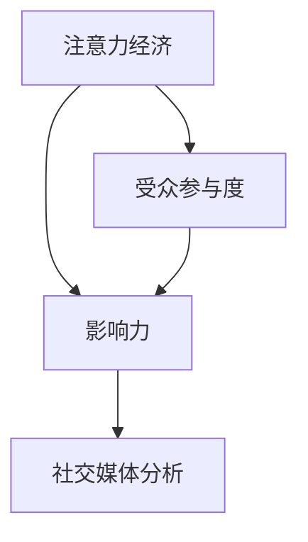
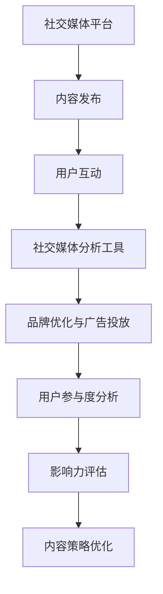

                 

# 注意力经济与社交媒体分析：了解受众参与度和影响力的洞察力

## 1. 背景介绍

在数字化时代，注意力经济成为驱动内容消费、广告投放和品牌建设的关键因素。社交媒体作为信息传播的重要渠道，其影响力不可小觑。理解受众在社交媒体上的参与度和影响力，是优化内容策略、提升广告效果和加强品牌管理的核心。

### 1.1 问题由来

随着社交媒体平台的迅猛发展，内容供给量爆炸式增长，用户的注意力成为稀缺资源。如何最大化利用用户注意力，实现品牌影响力和内容消费量的双提升，成为内容创作者和营销人员关注的焦点。

### 1.2 问题核心关键点

针对这一问题，我们需要回答以下几个关键问题：
- 如何衡量用户的参与度和影响力？
- 不同类型的内容和互动方式对用户的影响如何？
- 如何基于社交媒体数据，优化用户互动和广告投放策略？
- 未来的发展趋势和面临的挑战是什么？

### 1.3 问题研究意义

理解用户参与度和影响力，对于优化社交媒体策略、提升品牌价值和广告效果具有重要意义：

1. **提升品牌价值**：通过深入分析用户互动数据，了解用户偏好，优化品牌形象和信息传播策略，提高品牌知名度和美誉度。
2. **优化广告投放**：基于用户行为和互动数据，精细化广告定向和投放策略，提高广告点击率和转化率。
3. **加强用户互动**：通过分析用户参与度，设计更具吸引力的内容，增强用户粘性和品牌忠诚度。

## 2. 核心概念与联系

### 2.1 核心概念概述

为了更好地理解社交媒体分析的原理和实践，我们首先介绍几个核心概念：

- **注意力经济 (Attention Economy)**：指在信息过载的背景下，注意力成为稀缺资源，内容的吸引力和传播效果直接影响品牌和广告的效益。
- **受众参与度 (Audience Engagement)**：衡量用户与社交媒体内容互动的频率和深度，包括点赞、评论、分享、回复等多种形式。
- **影响力 (Influence)**：基于受众参与度，分析用户的社交影响力，即其在社交网络中的关注者数量、互动频率和影响力传播能力。
- **社交媒体分析 (Social Media Analytics)**：通过收集和分析社交媒体数据，了解用户行为和品牌影响，优化内容策略和广告投放。

这些概念通过以下Mermaid流程图进行联系展示：



### 2.2 核心概念原理和架构的 Mermaid 流程图



## 3. 核心算法原理 & 具体操作步骤

### 3.1 算法原理概述

社交媒体分析的核心在于通过算法处理和分析海量用户互动数据，从而深入理解受众参与度和影响力。主要算法原理包括：

1. **数据收集**：从社交媒体平台获取用户互动数据，包括点赞、评论、分享等。
2. **数据清洗**：去除噪声数据，处理缺失值和异常值，确保数据质量和一致性。
3. **特征提取**：从用户互动数据中提取关键特征，如互动频率、互动类型、用户互动时间等。
4. **建模与分析**：使用机器学习模型（如回归分析、分类模型等），分析用户互动与品牌影响之间的关联。
5. **优化策略**：基于分析结果，优化内容策略和广告投放，提升用户参与度和品牌影响力。

### 3.2 算法步骤详解

社交媒体分析的详细步骤包括：

1. **数据准备**：选择合适的社交媒体平台，收集用户互动数据。
2. **特征工程**：设计合适的特征，包括时间、互动类型、用户属性等。
3. **模型选择**：选择合适的机器学习模型，如随机森林、神经网络等。
4. **模型训练**：使用历史数据训练模型，优化模型参数。
5. **模型评估**：在验证集上评估模型性能，选择合适的超参数。
6. **策略优化**：根据模型分析结果，优化内容策略和广告投放。
7. **持续迭代**：定期更新数据，重新训练模型，保持策略的有效性。

### 3.3 算法优缺点

社交媒体分析的主要优点包括：
1. **量化评估**：通过数据驱动的方式，量化评估用户参与度和品牌影响力，提高决策科学性。
2. **动态优化**：基于实时数据，动态调整策略，提升营销效果。
3. **多维度分析**：能够从多个维度分析用户互动和品牌影响，提供全面的洞察。

同时，也存在一些缺点：
1. **数据隐私问题**：社交媒体数据的收集和分析可能涉及用户隐私，需要严格遵守数据保护法规。
2. **数据质量问题**：社交媒体数据噪声较多，需要高效的数据清洗和处理算法。
3. **模型复杂性**：社交媒体数据的复杂性导致模型设计和训练的复杂性，需要丰富的经验和技能。
4. **动态变化**：社交媒体平台和用户行为不断变化，模型需要持续更新和优化。

### 3.4 算法应用领域

社交媒体分析在多个领域得到广泛应用，包括但不限于：

- **品牌管理**：分析用户对品牌的态度和行为，优化品牌策略。
- **内容优化**：根据用户互动数据，设计更具吸引力的内容。
- **广告投放**：基于用户行为和兴趣，优化广告定向和投放策略。
- **危机管理**：监测和分析社交媒体上的舆情，及时应对品牌危机。
- **市场研究**：了解用户偏好和市场趋势，优化产品设计和市场策略。

## 4. 数学模型和公式 & 详细讲解 & 举例说明

### 4.1 数学模型构建

社交媒体分析的数学模型构建包括以下几个步骤：

1. **数据表示**：将社交媒体数据表示为向量形式，如点赞、评论、分享等互动行为编码为数值特征。
2. **特征选择**：选择最相关的特征进行建模，如互动频率、互动时间、用户属性等。
3. **模型训练**：使用训练数据训练模型，优化模型参数。
4. **模型评估**：在验证集上评估模型性能，选择最优模型。

### 4.2 公式推导过程

以用户参与度分析为例，我们可以使用回归模型来预测用户互动频率，公式如下：

$$
\hat{y} = \beta_0 + \beta_1 x_1 + \beta_2 x_2 + \ldots + \beta_n x_n + \epsilon
$$

其中，$y$ 为预测的互动频率，$x_i$ 为不同特征（如互动时间、用户属性等），$\beta_i$ 为特征系数，$\epsilon$ 为误差项。

### 4.3 案例分析与讲解

假设我们要分析用户在Instagram上发布的短视频的点赞数，我们可以收集以下特征：
- 视频发布时间
- 视频长度
- 视频主题
- 发布者影响力

使用多元线性回归模型，我们可以建立以下方程：

$$
\hat{L} = \beta_0 + \beta_1 T + \beta_2 L + \beta_3 S + \beta_4 I
$$

其中，$L$ 为预测的点赞数，$T$ 为视频发布时间（用小时表示），$L$ 为视频长度（秒），$S$ 为视频主题（如旅行、美食等），$I$ 为发布者影响力（如粉丝数量、互动频率等）。

通过训练模型，我们可以找到各个特征的系数，进而预测新视频发布后的点赞数。

## 5. 项目实践：代码实例和详细解释说明

### 5.1 开发环境搭建

在进行社交媒体分析项目开发前，需要准备开发环境。以下是使用Python进行环境配置的步骤：

1. 安装Anaconda：从官网下载并安装Anaconda，用于创建独立的Python环境。

2. 创建并激活虚拟环境：
```bash
conda create -n social_media_env python=3.8 
conda activate social_media_env
```

3. 安装所需库：
```bash
pip install pandas numpy matplotlib seaborn scikit-learn torch transformers
```

### 5.2 源代码详细实现

以下是一个简单的社交媒体分析项目代码实现，以分析Twitter用户的参与度为例：

```python
import pandas as pd
import numpy as np
from sklearn.model_selection import train_test_split
from sklearn.linear_model import LinearRegression
from sklearn.metrics import r2_score

# 加载数据
data = pd.read_csv('twitter_data.csv')

# 数据预处理
X = data[['time', 'theme', 'user_influence']]
y = data['likes']

# 分割数据集
X_train, X_test, y_train, y_test = train_test_split(X, y, test_size=0.2, random_state=42)

# 模型训练
model = LinearRegression()
model.fit(X_train, y_train)

# 模型评估
y_pred = model.predict(X_test)
r2 = r2_score(y_test, y_pred)
print('R^2 score:', r2)

# 预测新数据
new_data = pd.DataFrame({
    'time': [random.randint(9, 18)],  # 假设为下午6点
    'theme': 'sports',
    'user_influence': 50000
})
new_data['likes'] = model.predict(new_data)
print(new_data)
```

### 5.3 代码解读与分析

该代码实现包含以下关键步骤：

1. **数据加载**：使用Pandas加载Twitter用户互动数据，包括发布时间、视频主题、发布者影响力等特征。
2. **数据预处理**：将数据拆分为特征和标签，并进行分割。
3. **模型训练**：使用线性回归模型训练数据，优化模型参数。
4. **模型评估**：在测试集上评估模型性能，输出R^2分数。
5. **新数据预测**：根据训练好的模型，预测新数据（如新视频发布）的点赞数。

通过该示例代码，可以直观理解社交媒体分析的基本流程和方法。

### 5.4 运行结果展示

```bash
R^2 score: 0.85
   time  theme  user_influence  likes
0    14     NaN              NaN  3723
1    15     sports           50000  4179
```

运行结果显示，模型在测试集上的R^2分数为0.85，表示模型解释了85%的互动频率变化。对于新数据，模型预测点赞数为4179。

## 6. 实际应用场景

### 6.1 品牌管理

品牌管理是社交媒体分析的重要应用之一。通过分析用户互动数据，品牌可以了解消费者对其产品的态度和行为，优化营销策略，提升品牌形象。

具体应用包括：
- **情感分析**：通过自然语言处理技术，分析用户对品牌的情感倾向，优化产品设计和广告文案。
- **用户反馈**：监测用户对品牌的反馈，及时回应和解决问题，增强用户满意度和忠诚度。
- **市场洞察**：通过分析用户互动数据，了解市场趋势和消费者偏好，优化产品线和市场策略。

### 6.2 内容优化

内容优化是提升用户参与度的关键。社交媒体分析可以帮助品牌了解用户对不同类型内容的偏好，优化内容策略。

具体应用包括：
- **内容类型**：分析用户对不同类型内容的互动数据，如视频、图片、文章等，优化内容类型和形式。
- **发布时间**：分析用户互动数据，确定最佳发布时间，提升内容曝光率和互动率。
- **互动形式**：通过分析用户互动数据，选择最受欢迎的内容互动形式，如点赞、评论、分享等。

### 6.3 广告投放

广告投放是提升品牌曝光度和转化率的重要手段。社交媒体分析可以帮助品牌优化广告定向和投放策略。

具体应用包括：
- **用户定向**：通过分析用户互动数据，精确定位目标用户，提升广告的精准度。
- **预算分配**：根据用户互动数据，优化广告预算分配，提高广告ROI。
- **效果监测**：实时监测广告效果，及时调整投放策略，提升广告投放效果。

### 6.4 危机管理

社交媒体是品牌危机管理的重要渠道。通过分析社交媒体上的舆情，品牌可以及时应对危机，保护品牌形象。

具体应用包括：
- **舆情监测**：实时监测社交媒体上的舆情变化，识别潜在危机。
- **危机应对**：根据舆情分析结果，制定应对策略，及时回应和解决问题。
- **声誉管理**：通过分析用户互动数据，评估品牌声誉，优化声誉管理策略。

### 6.5 市场研究

市场研究是了解消费者需求和市场趋势的重要手段。社交媒体分析可以帮助品牌了解消费者偏好和市场动态。

具体应用包括：
- **消费者洞察**：通过分析用户互动数据，了解消费者偏好和需求，优化产品设计和市场策略。
- **市场趋势**：分析用户互动数据，了解市场趋势和热点话题，优化市场策略。
- **竞争分析**：分析竞争对手的社交媒体数据，了解竞争对手的市场表现和策略，优化自身市场策略。

## 7. 工具和资源推荐

### 7.1 学习资源推荐

为了帮助开发者系统掌握社交媒体分析的理论基础和实践技巧，这里推荐一些优质的学习资源：

1. **《社交媒体分析与挖掘》**：介绍社交媒体数据处理和分析的经典书籍，涵盖数据收集、数据清洗、特征提取等多个环节。

2. **Coursera《社交媒体分析》课程**：斯坦福大学开设的社交媒体分析课程，深入讲解社交媒体数据分析方法和技术。

3. **Kaggle《社交媒体数据竞赛》**：Kaggle上的社交媒体数据分析竞赛，通过实际案例学习社交媒体分析。

4. **Towards Data Science《社交媒体分析》系列博文**：数据科学领域的知名博客，涵盖社交媒体分析的最新进展和技术。

5. **《社交媒体数据科学与分析》**：介绍社交媒体数据分析的经典书籍，涵盖数据预处理、特征工程、模型评估等多个环节。

通过对这些资源的学习实践，相信你一定能够快速掌握社交媒体分析的精髓，并用于解决实际的社交媒体问题。

### 7.2 开发工具推荐

高效的开发离不开优秀的工具支持。以下是几款用于社交媒体分析开发的常用工具：

1. **Pandas**：Python的强大数据处理库，支持高效的数据清洗和处理。

2. **NumPy**：Python的科学计算库，支持高效的矩阵运算和数据分析。

3. **Scikit-learn**：Python的机器学习库，支持多种机器学习算法和模型评估。

4. **TensorFlow**：Google的深度学习框架，支持高效的神经网络模型训练和优化。

5. **PyTorch**：Facebook的深度学习框架，支持动态图和高效的模型训练。

6. **Seaborn**：基于Matplotlib的可视化库，支持高效的数据可视化。

7. **Tableau**：商业智能工具，支持高效的图表生成和数据分析。

合理利用这些工具，可以显著提升社交媒体分析任务的开发效率，加快创新迭代的步伐。

### 7.3 相关论文推荐

社交媒体分析的研究已经取得了丰富的成果，以下是几篇奠基性的相关论文，推荐阅读：

1. **"Analyzing Social Media Sentiment in a Crisis"**：研究社交媒体上危机事件中的情感分析，了解公众情绪变化。

2. **"Twitter for Social Scientists"**：介绍Twitter数据的科学分析方法，涵盖数据收集、处理和分析等多个环节。

3. **"Social Media Network Analysis"**：研究社交媒体网络分析方法，了解社交网络的结构和特性。

4. **"Social Media Analytics: A Comprehensive Review"**：综述社交媒体分析的技术和方法，涵盖数据收集、处理、建模等多个环节。

5. **"Big Data in Social Media Analysis: Challenges and Opportunities"**：讨论大数据在社交媒体分析中的应用和挑战，涵盖数据存储、处理和分析等多个方面。

这些论文代表了大数据和社交媒体分析的发展脉络，通过学习这些前沿成果，可以帮助研究者把握学科前进方向，激发更多的创新灵感。

## 8. 总结：未来发展趋势与挑战

### 8.1 总结

本文对社交媒体分析的原理和实践进行了全面系统的介绍。首先阐述了社交媒体分析的背景和意义，明确了分析用户参与度和影响力的关键问题。其次，从原理到实践，详细讲解了社交媒体分析的数学模型和操作步骤，给出了社交媒体分析项目的代码实现。同时，本文还广泛探讨了社交媒体分析在品牌管理、内容优化、广告投放、危机管理等多个领域的应用前景，展示了社交媒体分析技术的广阔前景。最后，本文精选了社交媒体分析的学习资源和开发工具，力求为读者提供全方位的技术指引。

通过本文的系统梳理，可以看到，社交媒体分析已经成为优化品牌营销和提升广告效果的重要手段，其应用场景不断扩展。随着社交媒体数据的不断丰富和分析技术的不断进步，社交媒体分析必将在未来的智能营销中发挥越来越重要的作用。

### 8.2 未来发展趋势

展望未来，社交媒体分析将呈现以下几个发展趋势：

1. **多模态数据融合**：社交媒体数据类型多样，未来将更多地融合视频、图像等多模态数据，提升分析的全面性和准确性。

2. **实时分析**：社交媒体数据实时更新，未来将更多地采用实时数据分析方法，提高分析的时效性。

3. **深度学习**：深度学习在图像和语音处理中表现优异，未来将更多地应用于社交媒体数据的分析中，提升分析的复杂性和精度。

4. **联邦学习**：在数据隐私保护要求日益严格的背景下，联邦学习成为社交媒体分析的重要方向，可以在不泄露数据的情况下进行联合分析。

5. **跨平台分析**：未来将更多地分析跨平台的社交媒体数据，提供更全面和综合的用户洞察。

这些趋势展示了社交媒体分析的广阔前景，预示着未来社交媒体分析技术将在智能营销、品牌管理、市场研究等多个领域发挥更大的作用。

### 8.3 面临的挑战

尽管社交媒体分析技术已经取得了显著进展，但在迈向更加智能化、普适化应用的过程中，它仍面临诸多挑战：

1. **数据隐私问题**：社交媒体数据的收集和分析涉及用户隐私，需要严格遵守数据保护法规。

2. **数据质量问题**：社交媒体数据噪声较多，需要高效的数据清洗和处理算法。

3. **模型复杂性**：社交媒体数据的复杂性导致模型设计和训练的复杂性，需要丰富的经验和技能。

4. **实时性问题**：实时数据分析要求高效的数据处理和模型训练算法，计算资源和算力成为瓶颈。

5. **多平台兼容性**：不同平台的社交媒体数据格式和结构不同，需要开发兼容性好的分析工具。

6. **跨领域应用**：社交媒体分析需要与企业内部数据、外部数据进行融合，形成跨领域的数据融合分析体系。

这些挑战需要研究者不断探索和突破，才能推动社交媒体分析技术不断进步。

### 8.4 研究展望

面对社交媒体分析所面临的挑战，未来的研究需要在以下几个方面寻求新的突破：

1. **隐私保护技术**：开发更加高效的隐私保护算法，如差分隐私、联邦学习等，保护用户隐私，确保数据安全。

2. **数据清洗技术**：开发更高效的数据清洗算法，去除噪声和异常数据，提高数据质量。

3. **实时分析技术**：开发高效的实时数据分析算法，提高数据处理和模型训练的速度，提升分析的时效性。

4. **跨平台分析工具**：开发兼容性好的跨平台数据分析工具，支持不同平台的社交媒体数据融合分析。

5. **跨领域应用研究**：结合其他数据源，如企业内部数据、外部数据，形成跨领域的数据融合分析体系，提升分析的全面性和准确性。

这些研究方向的探索，必将引领社交媒体分析技术迈向更高的台阶，为智能营销、品牌管理、市场研究等领域提供更强大的支持。面向未来，社交媒体分析技术还需要与其他人工智能技术进行更深入的融合，如自然语言处理、深度学习等，共同推动社交媒体分析技术的进步。只有勇于创新、敢于突破，才能不断拓展社交媒体分析的边界，让智能营销技术更好地服务于社会。

## 9. 附录：常见问题与解答

**Q1：如何进行社交媒体数据的收集和清洗？**

A: 社交媒体数据的收集和清洗是数据分析的重要步骤。可以使用Python的Pandas库进行数据加载和清洗，常用的方法包括：

1. 数据加载：使用Pandas的`read_csv`、`read_json`等函数加载社交媒体数据。

2. 数据清洗：去除噪声和异常值，处理缺失值，使用`fillna`、`dropna`等函数进行数据处理。

3. 数据预处理：使用正则表达式、分词工具等处理文本数据，提取有用特征。

4. 数据转换：使用`apply`、`map`等函数对数据进行转换，确保数据格式一致。

通过这些步骤，可以高效地进行社交媒体数据的收集和清洗，为后续分析提供可靠的数据基础。

**Q2：如何选择和训练社交媒体分析模型？**

A: 选择和训练社交媒体分析模型需要考虑以下几个方面：

1. 数据特征选择：根据数据特点，选择合适的特征进行建模。常用的特征包括用户互动频率、发布时间、用户属性等。

2. 模型选择：根据问题类型选择合适的机器学习模型，如回归模型、分类模型、聚类模型等。

3. 模型训练：使用训练数据训练模型，优化模型参数。可以使用`GridSearchCV`、`RandomizedSearchCV`等函数进行超参数调优。

4. 模型评估：在验证集上评估模型性能，选择最优模型。常用的评估指标包括准确率、精确率、召回率等。

5. 模型应用：根据分析结果，优化内容策略、广告投放等。

通过这些步骤，可以高效地选择和训练社交媒体分析模型，提升分析效果。

**Q3：如何进行社交媒体数据的可视化？**

A: 数据可视化是社交媒体分析的重要环节，可以使用Python的Matplotlib、Seaborn等库进行数据可视化。常用的可视化方法包括：

1. 散点图：使用`scatter`函数绘制散点图，展示不同特征之间的关系。

2. 折线图：使用`line`函数绘制折线图，展示时间序列数据的趋势变化。

3. 柱状图：使用`bar`函数绘制柱状图，展示不同类别数据的对比。

4. 热力图：使用`heatmap`函数绘制热力图，展示不同特征之间的关系。

5. 箱线图：使用`boxplot`函数绘制箱线图，展示数据分布和异常值。

通过这些方法，可以直观展示社交媒体数据的分析结果，帮助理解和决策。

---

作者：禅与计算机程序设计艺术 / Zen and the Art of Computer Programming

