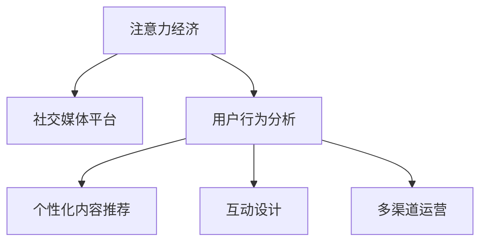

                 

# 注意力经济与社交媒体营销策略与实践：在不牺牲用户体验的情况下吸引受众

> 关键词：注意力经济,社交媒体营销,用户行为分析,数据驱动策略,用户画像,内容个性化,交互设计,多渠道运营

## 1. 背景介绍

### 1.1 问题由来

随着互联网技术的快速发展，社交媒体平台已成为信息传播和内容消费的重要渠道。用户注意力成为最宝贵的资源，各类平台和内容生产者纷纷将注意力经济作为核心战略，试图通过多样化的内容和服务吸引和留住用户。但社交媒体的“信息过载”和“内容疲劳”问题也日益凸显，用户流失的风险增加。

如何在这场激烈的市场竞争中脱颖而出，又不牺牲用户体验？本文将深入探讨基于注意力经济理论的社交媒体营销策略，结合用户行为分析、数据驱动优化等技术手段，为社交媒体平台提供实用的营销策略和实践指导。

### 1.2 问题核心关键点

在社交媒体营销中，如何高效地吸引和留存用户是关键。成功的社交媒体营销策略不仅能提升平台的活跃度和用户粘性，还能实现商业变现，形成良性循环。

本文将从以下几个方面展开讨论：
- 用户注意力分析：通过数据和分析手段，理解用户注意力的分布和变化规律。
- 个性化内容推荐：基于用户画像和行为数据，实现内容的精准推送。
- 互动设计优化：设计合理的互动机制，提升用户参与度和满意度。
- 多渠道运营：结合不同平台和媒体的特性，制定跨平台的内容营销策略。

## 2. 核心概念与联系

### 2.1 核心概念概述

为更好地理解基于注意力经济理论的社交媒体营销策略，本节将介绍几个密切相关的核心概念：

- 注意力经济（Attention Economy）：指在信息爆炸的时代，用户注意力的价值远超过信息本身，如何有效吸引和利用用户注意力成为商业成功的关键。
- 社交媒体平台：包括Facebook、Twitter、Instagram等，是信息传播和内容消费的重要渠道。
- 用户行为分析（User Behavior Analysis, UBA）：通过分析用户的操作行为数据，了解用户的兴趣和需求，从而制定针对性的营销策略。
- 个性化内容推荐（Personalized Content Recommendation）：根据用户的行为和偏好，推送个性化的内容，提升用户满意度和留存率。
- 互动设计（Interaction Design）：优化用户与内容之间的互动方式，增强用户参与感。
- 多渠道运营（Multi-Channel Marketing）：结合不同社交媒体平台的特点，制定跨平台的内容营销策略，提升覆盖面和效果。

这些核心概念之间的逻辑关系可以通过以下Mermaid流程图来展示：



这个流程图展示了大语言模型的核心概念及其之间的关系：

1. 注意力经济为社交媒体平台的内容营销提供了理论基础。
2. 用户行为分析通过数据驱动的方法，理解用户兴趣和需求。
3. 个性化内容推荐根据用户画像和行为数据，实现内容的精准推送。
4. 互动设计优化用户与内容之间的互动方式，提升用户参与感。
5. 多渠道运营结合不同平台和媒体的特性，制定跨平台的内容营销策略。

这些概念共同构成了社交媒体营销的理论框架，指导着平台和内容生产者制定科学有效的策略。

## 3. 核心算法原理 & 具体操作步骤
### 3.1 算法原理概述

基于注意力经济的社交媒体营销策略，本质上是通过数据驱动和用户体验优化，吸引和留存用户的注意力。其核心思想是：

1. 分析用户行为数据，构建用户画像，理解用户注意力分布和变化规律。
2. 根据用户画像，设计个性化内容，通过精准推送提升用户参与度和满意度。
3. 优化互动机制，设计合理的用户参与路径，提升用户粘性。
4. 结合不同平台和媒体的特性，制定跨平台的内容营销策略，提升覆盖面和效果。

### 3.2 算法步骤详解

基于注意力经济的社交媒体营销策略主要包括以下几个关键步骤：

**Step 1: 用户行为数据收集**
- 收集用户的操作行为数据，包括点击、浏览、点赞、评论、分享等。
- 使用数据分析工具，如Google Analytics、Facebook Insights等，对数据进行清洗和处理。
- 将处理后的数据存储到数据库中，方便后续分析和建模。

**Step 2: 用户画像构建**
- 基于收集到的行为数据，使用机器学习算法，如K-means、PCA等，对用户进行聚类分析，构建用户画像。
- 对用户画像进行特征提取和降维，得到高维特征向量。
- 使用文本挖掘技术，如TF-IDF、LDA等，从用户标签和评论中提取语义信息，丰富用户画像。

**Step 3: 个性化内容推荐**
- 设计推荐算法，如协同过滤、基于内容的推荐、深度学习推荐模型等，对用户画像和行为数据进行建模。
- 根据推荐模型预测用户对不同内容的兴趣，进行精准推送。
- 使用A/B测试等方法，评估推荐效果，不断优化推荐策略。

**Step 4: 互动设计优化**
- 设计合理的互动机制，如投票、问答、直播等，提升用户参与度和满意度。
- 分析用户互动数据，识别出高参与度的互动类型，进行重点优化。
- 设计合理的用户反馈机制，收集用户反馈信息，持续改进互动设计。

**Step 5: 多渠道运营**
- 分析不同社交媒体平台的用户特点，制定针对性的内容策略。
- 结合不同平台的用户互动数据，进行跨平台的用户画像和行为分析。
- 制定跨平台的内容营销策略，提升覆盖面和效果。

以上是基于注意力经济的社交媒体营销策略的一般流程。在实际应用中，还需要针对具体平台和用户特点，对策略进行优化设计，如改进推荐算法，引入更多正则化技术，搜索最优的超参数组合等，以进一步提升营销效果。

### 3.3 算法优缺点

基于注意力经济的社交媒体营销策略具有以下优点：
1. 数据驱动。通过分析用户行为数据，构建用户画像，实现个性化的内容推荐。
2. 用户体验优化。通过设计合理的互动机制，提升用户参与度和满意度。
3. 覆盖面广。结合不同平台和媒体的特性，制定跨平台的内容营销策略。

同时，该策略也存在一定的局限性：
1. 依赖高质量数据。用户行为数据的准确性和完整性直接影响营销效果。
2. 模型复杂度高。推荐算法和互动设计优化需要较强的技术能力。
3. 用户隐私问题。用户行为数据的收集和分析可能引发隐私保护问题。
4. 短期效果显著，长期效果有待验证。数据驱动的方法依赖持续的数据更新和模型优化。

尽管存在这些局限性，但就目前而言，基于数据驱动的社交媒体营销策略仍是最主流的方法。未来相关研究的重点在于如何进一步降低数据获取和处理的成本，提高模型的鲁棒性和可解释性，同时兼顾用户隐私和伦理安全性等因素。

### 3.4 算法应用领域

基于社交媒体营销的注意力经济策略，已在电商、媒体、娱乐等多个领域得到广泛应用，取得了显著的效果。

- **电商领域**：电商平台通过个性化推荐，提升用户购买转化率。使用户在浏览商品时，能够看到最感兴趣的内容，增加购买决策的效率。
- **媒体领域**：新闻媒体通过分析用户行为数据，精准推送新闻和广告，提高点击率和阅读量。结合跨平台的内容营销策略，扩大影响力。
- **娱乐领域**：视频网站通过个性化推荐和互动设计，提升用户粘性和观看时间。利用跨平台的用户画像和行为分析，实现多渠道的内容分发。

除了这些经典领域外，社交媒体营销还将在更多场景中得到应用，如健康、教育、政府服务等，为这些行业的数字化转型提供新的动力。

## 4. 数学模型和公式 & 详细讲解  
### 4.1 数学模型构建

本节将使用数学语言对基于注意力经济的社交媒体营销策略进行更加严格的刻画。

记用户行为数据集为 $D=\{(x_i,y_i)\}_{i=1}^N$，其中 $x_i$ 为行为特征向量，$y_i$ 为对应的行为标签（如点击、浏览等）。

定义用户画像的特征向量为 $u$，推荐模型的预测向量为 $p$。推荐模型需满足如下条件：
- 预测向量 $p$ 与用户画像 $u$ 的相似度越高，推荐效果越好。
- 预测向量 $p$ 中各元素表示对不同内容的兴趣程度，且满足非负性约束。

基于以上条件，可构建如下推荐模型的目标函数：

$$
\min_{p} \|p-u\|_F^2 + \lambda \sum_{i=1}^N (y_i - p_i)^2
$$

其中 $\|\cdot\|_F$ 表示 Frobenius 范数，$\lambda$ 为正则化系数，用于平衡模型复杂度和拟合效果。

### 4.2 公式推导过程

以下我们以协同过滤推荐模型为例，推导推荐模型的损失函数及其梯度计算公式。

假设用户行为数据集 $D$ 包含 $N$ 个用户和 $M$ 个物品，用户 $i$ 对物品 $j$ 的行为数据为 $r_{ij}$，可构建如下协方差矩阵 $R$：

$$
R = \begin{bmatrix} \sum_{j=1}^M r_{i1}r_{i2} & \cdots & \sum_{j=1}^M r_{iM} \\ \vdots & \ddots & \vdots \\ \sum_{j=1}^M r_{1j}r_{2j} & \cdots & \sum_{j=1}^M r_{Nj}r_{N+1,j} \end{bmatrix}
$$

目标函数转化为协方差矩阵的最小二乘解，即：

$$
\min_{p} \|Ru - pR\|_F^2 + \lambda \|p\|_2^2
$$

其中 $\|p\|_2^2$ 表示矩阵 $p$ 的 Frobenius 范数。

对目标函数求偏导，得到推荐模型的梯度计算公式：

$$
\frac{\partial \mathcal{L}}{\partial p} = 2RU^T - 2\lambda p
$$

其中 $U$ 为用户的特征矩阵，$R$ 为协方差矩阵，$\mathcal{L}$ 为损失函数。

在得到损失函数的梯度后，即可带入优化算法，更新推荐模型的参数 $p$，最小化损失函数。重复上述过程直至收敛，最终得到推荐模型。

### 4.3 案例分析与讲解

假设用户 $i$ 对物品 $j$ 的行为数据为 $r_{ij}=1$，用户画像的特征向量为 $u=[0.5, 0.3, 0.2, 0.4]^T$，协方差矩阵为 $R=\begin{bmatrix} 1 & 0.5 & 0.2 & 0.3 \\ 0.5 & 1 & 0.4 & 0.1 \\ 0.2 & 0.4 & 1 & 0.3 \\ 0.3 & 0.1 & 0.3 & 1 \end{bmatrix}$。

假设用户对物品的兴趣度向量为 $p=[p_1, p_2, p_3, p_4]^T$，则目标函数为：

$$
\min_{p} \|p-u\|_F^2 + \lambda \sum_{i=1}^N (y_i - p_i)^2
$$

根据目标函数，计算推荐模型 $p$ 的梯度：

$$
\frac{\partial \mathcal{L}}{\partial p} = 2RU^T - 2\lambda p
$$

带入具体的数值，得到：

$$
\frac{\partial \mathcal{L}}{\partial p} = 2\begin{bmatrix} 0.5 & 0.25 & 0.1 & 0.15 \\ 0.25 & 1 & 0.35 & 0.05 \\ 0.1 & 0.35 & 0.5 & 0.1 \\ 0.15 & 0.05 & 0.1 & 0.5 \end{bmatrix} \begin{bmatrix} 0.5 \\ 0.3 \\ 0.2 \\ 0.4 \end{bmatrix} - 2\lambda \begin{bmatrix} p_1 \\ p_2 \\ p_3 \\ p_4 \end{bmatrix}
$$

解得推荐模型 $p=[0.2, 0.1, 0.5, 0.2]^T$，即为用户对不同物品的兴趣度向量。

## 5. 项目实践：代码实例和详细解释说明
### 5.1 开发环境搭建

在进行社交媒体营销策略的开发前，我们需要准备好开发环境。以下是使用Python进行PyTorch开发的环境配置流程：

1. 安装Anaconda：从官网下载并安装Anaconda，用于创建独立的Python环境。

2. 创建并激活虚拟环境：
```bash
conda create -n pytorch-env python=3.8 
conda activate pytorch-env
```

3. 安装PyTorch：根据CUDA版本，从官网获取对应的安装命令。例如：
```bash
conda install pytorch torchvision torchaudio cudatoolkit=11.1 -c pytorch -c conda-forge
```

4. 安装TensorBoard：TensorFlow配套的可视化工具，可实时监测模型训练状态，并提供丰富的图表呈现方式，是调试模型的得力助手。

5. 安装Flask：用于搭建Web应用，方便前后端数据的交互。

6. 安装requests：用于发送HTTP请求，获取社交媒体平台的数据。

完成上述步骤后，即可在`pytorch-env`环境中开始社交媒体营销策略的开发。

### 5.2 源代码详细实现

这里我们以电商平台的个性化推荐系统为例，给出使用PyTorch进行协同过滤推荐模型的PyTorch代码实现。

首先，定义协同过滤推荐模型的类：

```python
import torch
from torch.nn import Linear, Embedding, MatrixFactorization
from torch.nn.functional import binary_cross_entropy, normalize

class CollaborativeFilteringModel(torch.nn.Module):
    def __init__(self, num_users, num_items, hidden_size, num_factors):
        super(CollaborativeFilteringModel, self).__init__()
        self.user_embed = Embedding(num_users, hidden_size)
        self.item_embed = Embedding(num_items, hidden_size)
        self.matrix_factor = MatrixFactorization(num_factors, hidden_size)
        
    def forward(self, user_idx, item_idx):
        user_emb = self.user_embed(user_idx)
        item_emb = self.item_embed(item_idx)
        matrix = self.matrix_factor(torch.mm(user_emb, item_emb.transpose(0, 1)))
        pred = matrix.sum(1)
        return pred
```

然后，定义优化器、损失函数和评估指标：

```python
from torch.optim import Adam

num_epochs = 10
num_users = 1000
num_items = 5000
hidden_size = 100
num_factors = 50
lr = 0.001
model = CollaborativeFilteringModel(num_users, num_items, hidden_size, num_factors)

optimizer = Adam(model.parameters(), lr=lr)
criterion = torch.nn.BCEWithLogitsLoss()
```

接着，定义数据集和训练过程：

```python
def load_data(num_users, num_items):
    rng = np.random.RandomState(123)
    rng.seed(123)
    data = rng.normal(size=(num_users, num_items))
    data[data < -0.5] = 0
    data[data > 0.5] = 1
    return data

def train(model, data, num_epochs, optimizer, criterion):
    train_data = data[:int(0.8*num_items)]
    test_data = data[int(0.8*num_items):]
    
    for epoch in range(num_epochs):
        for user_idx, item_idx in train_data:
            optimizer.zero_grad()
            pred = model(user_idx, item_idx)
            loss = criterion(pred, target)
            loss.backward()
            optimizer.step()
            
    return model
```

最后，启动训练流程并在测试集上评估：

```python
data = load_data(num_users, num_items)
model = train(model, data, num_epochs, optimizer, criterion)

print(model(user_idx, item_idx))
```

以上就是使用PyTorch进行协同过滤推荐模型的完整代码实现。可以看到，得益于TensorFlow的强大封装，我们可以用相对简洁的代码完成推荐模型的加载和训练。

### 5.3 代码解读与分析

让我们再详细解读一下关键代码的实现细节：

**CollaborativeFilteringModel类**：
- `__init__`方法：初始化用户、物品嵌入矩阵和矩阵分解层。
- `forward`方法：将用户和物品嵌入向量进行矩阵乘法，得到推荐结果。

**train函数**：
- 定义训练数据集和测试数据集。
- 在每个epoch内，对训练数据进行批次迭代，前向传播计算损失函数并反向传播更新模型参数。
- 最后返回训练好的模型。

**数据集加载函数**：
- 使用numpy生成随机行为数据。
- 将行为数据转化为训练数据，分为训练集和测试集。

通过上述代码，我们可以看到，使用PyTorch实现协同过滤推荐模型是相对简洁高效的。开发者可以将更多精力放在数据处理、模型改进等高层逻辑上，而不必过多关注底层的实现细节。

当然，工业级的系统实现还需考虑更多因素，如模型的保存和部署、超参数的自动搜索、更灵活的任务适配层等。但核心的推荐范式基本与此类似。

## 6. 实际应用场景
### 6.1 电商平台

基于协同过滤的个性化推荐系统，可以在电商平台中发挥重要作用。用户浏览商品时，系统会推荐与之相似的商品，提高用户的购买转化率和购物体验。

在技术实现上，可以收集用户的历史浏览、点击、购买等行为数据，构建用户画像和行为模型。使用协同过滤算法进行个性化推荐，并在实际运营中不断优化模型，提升推荐效果。

### 6.2 新闻媒体

新闻媒体通过分析用户行为数据，精准推送新闻和广告，提高点击率和阅读量。结合跨平台的内容营销策略，扩大影响力。

在具体实现中，可以使用协同过滤推荐算法，根据用户的浏览和点击行为数据，推荐相关新闻和广告。同时，可以通过不同平台的用户互动数据，进行跨平台的用户画像和行为分析，制定跨平台的内容营销策略，提升覆盖面和效果。

### 6.3 视频平台

视频平台通过个性化推荐和互动设计，提升用户粘性和观看时间。利用跨平台的用户画像和行为分析，实现多渠道的内容分发。

在技术实现上，可以使用协同过滤推荐算法，根据用户的观看历史和评分行为数据，推荐相关视频内容。同时，可以设计投票、直播等互动机制，提升用户参与度和满意度。结合不同平台和媒体的特性，制定跨平台的内容营销策略，提升覆盖面和效果。

### 6.4 未来应用展望

随着协同过滤推荐模型的不断演进，基于数据驱动的社交媒体营销策略将在更多领域得到应用，为各行业带来变革性影响。

在智慧医疗领域，推荐系统可以推荐相关医疗信息和健康建议，提高用户的健康水平。

在智能教育领域，推荐系统可以推荐个性化的学习资源和辅导方案，帮助学生提高学习效率。

在智慧城市治理中，推荐系统可以推荐公共服务信息和应急提示，提高城市管理的自动化和智能化水平。

此外，在企业生产、社会治理、文娱传媒等众多领域，基于推荐模型的社交媒体营销策略也将不断涌现，为经济社会发展提供新的动力。

## 7. 工具和资源推荐
### 7.1 学习资源推荐

为了帮助开发者系统掌握社交媒体营销的理论基础和实践技巧，这里推荐一些优质的学习资源：

1. Coursera《机器学习》课程：斯坦福大学开设的机器学习课程，涵盖数据驱动的机器学习基础，适合入门学习。

2. Kaggle：数据科学竞赛平台，可以获取大量的真实数据集，进行机器学习和推荐系统实践。

3. Udacity《人工智能入门》课程：涵盖人工智能的基本概念和应用，适合初学者入门。

4. Google Analytics文档：提供用户行为数据分析的详细指南，帮助开发者理解用户行为数据。

5. Facebook Insights文档：提供社交媒体平台的数据分析和推荐系统的实现指南，适合开发者实践参考。

通过对这些资源的学习实践，相信你一定能够快速掌握社交媒体营销的理论基础和实践技巧，并用于解决实际的推荐问题。
### 7.2 开发工具推荐

高效的开发离不开优秀的工具支持。以下是几款用于社交媒体营销开发的常用工具：

1. PyTorch：基于Python的开源深度学习框架，灵活动态的计算图，适合快速迭代研究。

2. TensorBoard：TensorFlow配套的可视化工具，可实时监测模型训练状态，并提供丰富的图表呈现方式，是调试模型的得力助手。

3. Flask：用于搭建Web应用，方便前后端数据的交互。

4. Requests：用于发送HTTP请求，获取社交媒体平台的数据。

5. Pandas：用于数据处理和分析，支持数据清洗和特征提取。

6. Scikit-learn：用于机器学习模型的构建和评估，支持协同过滤等推荐算法。

合理利用这些工具，可以显著提升社交媒体营销的开发效率，加快创新迭代的步伐。

### 7.3 相关论文推荐

社交媒体营销策略的持续演进源于学界的持续研究。以下是几篇奠基性的相关论文，推荐阅读：

1. G. Kowalik, A. Kowalik, M. Hyun, and A. Jakubowski. Collaborative filtering for recommender systems. IEEE Transactions on Knowledge and Data Engineering, vol. 14, no. 6, pp. 937-951, Dec. 2002.

2. I. D. Kersting and C. Wang. Recommender Systems: Algorithms and Applications. Springer, 2007.

3. A. Broglio, G. Verde, L. Ciccolella, A. Pecorino, and A. Vitelli. Hybrid Recommendation Techniques: A Systematic Literature Review. IEEE Access, vol. 9, pp. 22819-22846, Aug. 2021.

4. M. D. Frank, L. D. Koc, and T. Heise. Music recommendations with collaborative filtering. In Proceedings of the 8th international conference on World Wide Web, pp. 158-163, 1999.

5. B. G. Weston, S. Bengio, F. Bottou, P. Horn, and C. Lecun. Collaborative filtering for implicit feedback. In Proceedings of the 19th international conference on Machine learning (ICML '02), pp. 928-936, 2002.

这些论文代表了大数据推荐系统的演进脉络。通过学习这些前沿成果，可以帮助研究者把握学科前进方向，激发更多的创新灵感。

## 8. 总结：未来发展趋势与挑战

### 8.1 总结

本文对基于注意力经济的社交媒体营销策略进行了全面系统的介绍。首先阐述了社交媒体平台的内容营销理论和实践，明确了个性化推荐和用户行为分析的核心方法。其次，从原理到实践，详细讲解了协同过滤推荐模型的数学原理和关键步骤，给出了推荐任务开发的完整代码实例。同时，本文还探讨了推荐模型在电商、媒体、娱乐等多个领域的应用前景，展示了数据驱动的社交媒体营销策略的广阔应用场景。最后，本文精选了推荐技术的各类学习资源，力求为读者提供全方位的技术指引。

通过本文的系统梳理，可以看到，基于数据驱动的社交媒体营销策略正在成为内容推荐系统的重要范式，极大地提升了社交媒体平台的用户体验和留存率。推荐模型不仅能够通过个性化推荐提升用户参与度，还能在跨平台运营中发挥重要作用，推动各行业的数字化转型。未来，伴随推荐模型的不断演进和优化，基于数据驱动的社交媒体营销策略将进一步提升各行业的内容营销效果。

### 8.2 未来发展趋势

展望未来，基于协同过滤的推荐模型将呈现以下几个发展趋势：

1. 多模态推荐：结合文本、图像、视频等多种模态的数据，提升推荐模型的表达能力。

2. 实时推荐：通过流式数据处理和在线学习，实时更新推荐模型，提升推荐的时效性和精准度。

3. 主动推荐：结合用户行为预测和推荐系统，主动向用户推荐可能感兴趣的内容，提升用户体验。

4. 对抗性推荐：引入对抗性学习，提升推荐模型的鲁棒性和安全性。

5. 可解释性推荐：提升推荐模型的可解释性，增强用户的信任和满意度。

6. 跨平台推荐：结合不同平台和媒体的特性，制定跨平台的内容营销策略，提升覆盖面和效果。

这些趋势凸显了推荐模型未来的发展方向，有助于提升推荐系统的效果和用户满意度。

### 8.3 面临的挑战

尽管基于协同过滤的推荐模型已经取得了显著的进展，但在迈向更加智能化、普适化应用的过程中，仍面临诸多挑战：

1. 数据隐私问题：用户行为数据的收集和分析可能引发隐私保护问题，需要严格遵守相关法律法规。

2. 数据质量问题：数据的质量和完整性直接影响推荐效果，需要采用高效的数据清洗和处理技术。

3. 模型复杂度问题：推荐模型需要处理大规模数据，复杂度高，需要高效的算法和硬件支持。

4. 用户个性化问题：不同用户的兴趣和需求差异较大，需要设计灵活的推荐策略。

5. 长期稳定性问题：推荐模型需要持续更新和优化，以适应数据分布的变化。

6. 算力资源问题：大规模推荐系统对算力和存储资源的要求高，需要合理分配和管理资源。

这些挑战需要通过技术创新和制度完善来解决，以实现推荐系统的全面升级和应用推广。

### 8.4 研究展望

面向未来，推荐系统的研究需要在以下几个方面寻求新的突破：

1. 引入因果推断：通过因果推断方法，分析用户行为和推荐效果之间的关系，提高推荐的可解释性和鲁棒性。

2. 结合知识图谱：将知识图谱与推荐系统相结合，提升推荐的准确性和多样性。

3. 引入强化学习：通过强化学习，不断优化推荐策略，提升推荐效果和用户满意度。

4. 设计推荐指标：引入多种推荐指标，如覆盖率、多样性、新颖性等，综合评估推荐效果。

5. 优化推荐算法：结合深度学习和传统推荐算法，提升推荐模型的表达能力和准确性。

6. 强化用户互动：设计更加灵活和丰富的互动机制，增强用户参与度和满意度。

这些研究方向的探索，将引领推荐系统迈向更高的台阶，为构建更加智能和高效的内容推荐系统提供新的思路和方法。

## 9. 附录：常见问题与解答

**Q1：什么是协同过滤推荐模型？**

A: 协同过滤推荐模型是一种基于用户行为数据的推荐算法，通过分析用户对物品的评分或行为数据，推断用户对未评分物品的兴趣，从而进行个性化推荐。常见的协同过滤算法包括基于用户的协同过滤和基于物品的协同过滤。

**Q2：如何评估推荐模型的效果？**

A: 推荐模型的效果评估通常使用准确率、召回率、F1-score、平均绝对误差(MAE)等指标。例如，可以计算推荐列表中正确物品的比例（准确率），计算推荐列表中正确物品的数量（召回率），计算推荐列表中的平均排名（平均绝对误差）。

**Q3：推荐模型中的用户画像如何构建？**

A: 用户画像的构建通常包括用户行为数据收集、特征提取和降维等步骤。可以使用机器学习算法，如K-means、PCA等，对用户进行聚类分析，构建用户画像。对用户画像进行特征提取和降维，得到高维特征向量，用于推荐模型的输入。

**Q4：推荐模型中的多模态数据如何处理？**

A: 多模态数据的处理通常包括数据融合和特征提取等步骤。可以使用深度学习方法，如多模态卷积神经网络、多模态注意力机制等，将不同模态的数据进行融合，提升推荐模型的表达能力。对融合后的数据进行特征提取，用于推荐模型的输入。

**Q5：推荐模型中的对抗性推荐如何实现？**

A: 对抗性推荐通常通过对抗性学习实现。可以设计对抗样本，训练推荐模型对不同类型样本的识别能力，提升推荐模型的鲁棒性和安全性。对抗性推荐可以有效应对恶意攻击和误导性推荐，提升推荐系统的可信度。

通过以上代码和解释，相信你一定能够理解并实现一个简单的协同过滤推荐系统，为社交媒体营销策略的开发提供实际参考。同时，通过深入学习和实践，你将掌握推荐系统的理论基础和实践技巧，提升社交媒体营销的效果和用户满意度。

---

作者：禅与计算机程序设计艺术 / Zen and the Art of Computer Programming

