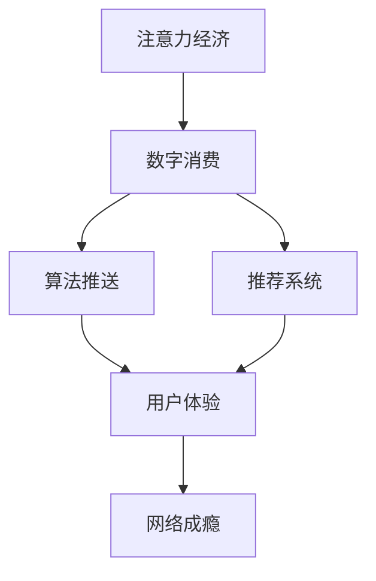

                 

# 注意力经济与网络成瘾的关联

> 关键词：注意力经济,网络成瘾,数字消费,算法推送,注意力争夺,算法漏洞,大数据分析,用户体验,用户行为,干预措施

## 1. 背景介绍

### 1.1 问题由来
在数字化时代，互联网和移动设备的普及极大地改变了人类的生活方式。然而，这一进步的另一面是，数字消费和网络成瘾问题变得愈加严重。根据世界卫生组织(WHO)的数据，截至2020年，全球网络成瘾的患病率达到了3.1%，相当于大约2.13亿人受到影响。网络成瘾不仅对用户的心理健康造成严重威胁，还影响了他们的人际交往和日常工作。

### 1.2 问题核心关键点
在探讨注意力经济与网络成瘾之间的关系时，需要关注以下几个核心问题：
- 数字消费如何引发网络成瘾？
- 注意力经济模式对用户行为和心理有何影响？
- 算法推送和推荐系统在网络成瘾中扮演了怎样的角色？
- 如何识别和干预网络成瘾，降低其负面影响？

### 1.3 问题研究意义
理解注意力经济与网络成瘾之间的关系，对于制定有效的干预措施和政策，以及推动健康数字消费的可持续发展具有重要意义。本文将从算法与用户体验的角度，深入分析网络成瘾的机制，并提出相应的应对策略。

## 2. 核心概念与联系

### 2.1 核心概念概述

为更好地理解注意力经济与网络成瘾之间的关联，本节将介绍几个核心概念及其相互联系：

- **注意力经济**：指在信息过载的时代，通过吸引和维持用户的注意力来获取经济价值的新经济模式。这种经济模式以用户的时间和注意力为资源，通过内容分发、广告投放等方式实现商业变现。

- **网络成瘾**：指个体对互联网或移动设备过度依赖，导致其心理和行为受到负面影响的现象。网络成瘾的症状包括但不限于长时间在线、无法控制使用设备等。

- **数字消费**：指用户通过互联网或移动设备进行的内容消费和信息获取。这种消费模式通常由算法推送和推荐系统驱动，优化用户体验，提升用户粘性。

- **算法推送**：指通过机器学习算法自动为用户推荐个性化内容的技术。算法推送利用用户的历史行为数据，不断调整推荐结果，提升用户满意度。

- **推荐系统**：指基于用户行为和偏好，向用户推荐个性化内容的系统。推荐系统广泛应用在电商、社交媒体、新闻平台等场景中。

- **用户体验**：指用户在使用产品或服务过程中获得的主观感受和心理体验。良好的用户体验能够提升用户满意度，增强用户忠诚度。

- **用户行为**：指用户在互动过程中产生的一系列动作和反应，包括浏览、点击、购买等行为。用户行为数据是算法推送和推荐系统优化的重要依据。

这些概念之间的逻辑关系可以通过以下Mermaid流程图来展示：



这个流程图展示了几大核心概念之间的相互关系：

1. 注意力经济通过吸引和维持用户的注意力，驱动数字消费。
2. 算法推送和推荐系统基于用户行为数据，优化数字消费体验。
3. 用户体验的提升促使用户持续消费，进而可能引发网络成瘾。
4. 网络成瘾对用户的心理健康和行为产生负面影响，降低用户体验。

## 3. 核心算法原理 & 具体操作步骤
### 3.1 算法原理概述

注意力经济与网络成瘾之间的关系，可以通过以下几个关键算法和操作来理解：

- **推荐算法**：利用机器学习模型，根据用户的历史行为数据，自动为用户推荐个性化内容。
- **行为分析**：通过数据分析技术，识别和理解用户的行为模式和偏好。
- **反馈机制**：基于用户反馈，调整推荐算法，提升推荐效果。

这些算法和操作共同作用，形成了注意力经济与网络成瘾之间的复杂关联。

### 3.2 算法步骤详解

以下详细讲解了实现算法推送和推荐系统的关键步骤：

**Step 1: 数据采集与预处理**
- 收集用户的历史行为数据，如浏览记录、点击次数、购买记录等。
- 对数据进行清洗和预处理，如去除噪声、处理缺失值、标准化数据格式等。

**Step 2: 特征提取与建模**
- 从原始数据中提取关键特征，如浏览时长、点击位置、购买频率等。
- 使用机器学习模型（如协同过滤、深度学习等）构建推荐系统，根据用户特征和历史行为预测其兴趣。

**Step 3: 算法优化与评估**
- 定期评估推荐效果，如点击率、转化率等指标。
- 根据评估结果，优化算法参数，调整推荐策略，提升用户体验。

**Step 4: 实时推送与反馈**
- 实时向用户推送个性化内容，如新闻、广告、商品等。
- 收集用户反馈，如点赞、评论、分享等，进一步优化推荐算法。

**Step 5: 用户行为分析**
- 通过数据分析技术，识别用户的行为模式和偏好。
- 利用用户行为数据，预测其未来的行为，个性化推荐内容。

### 3.3 算法优缺点

算法推送和推荐系统的优点包括：
1. 提升用户体验：通过个性化推荐，提升用户满意度，增强用户粘性。
2. 优化资源配置：精准推荐内容，提高广告投放的转化率，优化资源配置。
3. 促进消费增长：利用个性化推荐，提升用户消费频次和金额。

然而，这些算法也存在一些缺点：
1. 数据隐私问题：用户行为数据的收集和使用，可能引发隐私泄露和数据滥用。
2. 算法偏见问题：推荐算法可能存在偏见，对某些群体或内容过度推荐，引发内容过载或信息泡沫。
3. 成瘾风险增加：个性化推荐可能导致用户过度消费，引发网络成瘾。
4. 决策透明性不足：推荐算法通常是"黑盒"系统，难以解释其内部决策逻辑，用户难以信任和控制。

### 3.4 算法应用领域

算法推送和推荐系统广泛应用于以下几个领域：

- **电商推荐**：通过分析用户的浏览和购买记录，推荐相似或互补商品。
- **社交媒体推荐**：根据用户的兴趣和行为，推荐新闻、视频、好友等。
- **新闻推荐**：基于用户的阅读历史和兴趣，推荐相关新闻内容。
- **视频推荐**：根据用户的观看历史和评分，推荐相似视频或热门内容。

这些应用领域展示了算法推送和推荐系统的广泛应用，为用户提供了丰富的信息和娱乐内容。

## 4. 数学模型和公式 & 详细讲解 & 举例说明

### 4.1 数学模型构建

为更好地理解推荐系统的核心算法，本节将使用数学语言对推荐算法的基本模型进行详细讲解。

假设用户集合为 $U$，商品集合为 $I$，用户与商品之间的评分矩阵为 $R \in \mathbb{R}^{n \times m}$，其中 $n$ 为用户数，$m$ 为商品数。用户对商品 $i$ 的评分 $r_{ui} = R_{ui}$，用户未评分商品视为0分。推荐系统旨在预测用户 $u$ 对商品 $i$ 的评分，构建评分矩阵的完整部分。

推荐系统的数学模型可以表示为：
$$
\hat{R}_{ui} = f_u(X_u) + f_i(X_i) + b
$$
其中，$f_u(X_u)$ 为基于用户特征的评分预测函数，$f_i(X_i)$ 为基于商品特征的评分预测函数，$b$ 为模型截距。$X_u$ 和 $X_i$ 分别为用户和商品的特征向量。

### 4.2 公式推导过程

以下推导了推荐系统中的协同过滤算法。协同过滤算法基于用户和商品的历史评分数据，通过相似度计算推荐相似商品或相似用户。

假设用户 $u$ 对商品 $i$ 的评分已知，推荐系统需要预测用户 $u$ 对商品 $j$ 的评分。协同过滤算法的一种形式为基于用户的协同过滤，其数学模型为：
$$
\hat{R}_{uj} = \frac{\sum_{i \in N_u}R_{ui}R_{ij}}{\sqrt{\sum_{i \in N_u}R_{ui}^2} \sqrt{\sum_{i \in N_j}R_{ij}^2}}
$$
其中，$N_u$ 和 $N_j$ 分别为用户 $u$ 和商品 $j$ 的邻居集合，即与用户 $u$ 或商品 $j$ 评分相似的商品或用户。

### 4.3 案例分析与讲解

以下以电商推荐为例，详细讲解推荐系统在实际应用中的具体实现。

**案例背景**：某电商网站收集了用户的历史浏览记录、购买记录和评分数据，拟通过推荐系统提升用户满意度，增加销售额。

**数据采集**：网站收集了用户ID、商品ID、浏览时间、点击次数、购买金额、评分等信息。

**特征提取**：从历史数据中提取用户特征，如年龄、性别、地域等，商品特征，如价格、类别、品牌等。

**模型构建**：使用协同过滤算法，构建用户-商品评分预测模型。首先计算用户与商品的相似度，然后选择相似度高的商品作为推荐列表。

**推荐实现**：网站根据用户ID和推荐算法，实时生成个性化的商品推荐列表。推荐列表显示在用户登录页面或购物车页面，提升用户购物体验。

## 5. 项目实践：代码实例和详细解释说明
### 5.1 开发环境搭建

在进行推荐系统实践前，我们需要准备好开发环境。以下是使用Python进行Scikit-learn开发的环境配置流程：

1. 安装Anaconda：从官网下载并安装Anaconda，用于创建独立的Python环境。

2. 创建并激活虚拟环境：
```bash
conda create -n recommender-env python=3.8 
conda activate recommender-env
```

3. 安装Scikit-learn：
```bash
conda install scikit-learn
```

4. 安装各类工具包：
```bash
pip install numpy pandas scipy scikit-learn matplotlib tqdm jupyter notebook ipython
```

完成上述步骤后，即可在`recommender-env`环境中开始推荐系统开发。

### 5.2 源代码详细实现

我们以基于协同过滤算法的推荐系统为例，给出Scikit-learn库下的具体代码实现。

```python
from sklearn.metrics.pairwise import cosine_similarity
from sklearn.decomposition import TruncatedSVD

# 假设已经获取用户和商品的评分矩阵R
R = [[1, 2, 0, 4], [0, 0, 3, 1], [5, 3, 0, 2], [4, 0, 1, 0]]

# 计算用户-商品相似度矩阵S
S = cosine_similarity(R)

# 用户ID和商品ID
user_ids = [1, 2, 3, 4]
item_ids = [1, 2, 3, 4]

# 选择相似度高的商品作为推荐列表
def recommend(user_id, item_ids, S):
    user_similarity = S[user_id]
    similarity_scores = []
    for item_id in item_ids:
        similarity_scores.append((item_id, user_similarity[item_id]))
    top_items = sorted(similarity_scores, key=lambda x: x[1], reverse=True)[:5]
    return top_items

# 用户ID
user_id = 1

# 选择相似度高的商品作为推荐列表
top_items = recommend(user_id, item_ids, S)
print(top_items)
```

### 5.3 代码解读与分析

让我们再详细解读一下关键代码的实现细节：

**S函数**：
- `cosine_similarity`函数：计算用户与商品的余弦相似度矩阵。
- `TruncatedSVD`类：用于降维，将高维空间中的用户和商品特征映射到低维空间。

**recommend函数**：
- 根据用户ID和商品ID，计算用户与商品的相似度矩阵。
- 选择相似度高的商品，生成推荐列表。

**主程序**：
- 选择用户ID，调用`recommend`函数，生成推荐列表。

可以看到，Scikit-learn库提供了丰富的机器学习算法和工具，使得推荐系统的开发变得更加简便和高效。开发者可以将更多精力放在模型优化和数据分析上，而不必过多关注底层的实现细节。

当然，工业级的系统实现还需考虑更多因素，如模型的保存和部署、超参数的自动搜索、更灵活的任务适配层等。但核心的推荐算法基本与此类似。

## 6. 实际应用场景
### 6.1 电商推荐系统

电商推荐系统通过个性化推荐，提升用户购物体验，增加销售额。推荐系统在电商平台上得到了广泛应用，如亚马逊、淘宝、京东等。

在技术实现上，推荐系统可以基于用户的浏览历史、购买历史和评分数据，生成个性化的商品推荐列表。推荐列表通常包括热门商品、相似商品、相关商品等，提升用户发现商品的概率和满意度。

### 6.2 社交媒体推荐系统

社交媒体平台通过推荐系统，向用户推荐新闻、视频、好友等，提升用户活跃度和平台黏性。Facebook、Twitter、Instagram等社交媒体平台都广泛应用了推荐系统。

推荐系统通过分析用户的浏览记录、点赞记录、评论记录等，推荐用户感兴趣的内容和好友。推荐列表通常包括热门内容、相似内容、相关内容等，提升用户满意度和平台黏性。

### 6.3 视频推荐系统

视频平台通过推荐系统，向用户推荐相似视频或热门视频，提升用户观看体验和平台活跃度。YouTube、Bilibili等视频平台都广泛应用了推荐系统。

推荐系统通过分析用户的观看历史、点赞记录、评论记录等，推荐相似视频或热门视频。推荐列表通常包括热门视频、相似视频、相关视频等，提升用户观看体验和平台活跃度。

### 6.4 未来应用展望

随着推荐系统的不断发展，未来在更多领域得到应用，为传统行业带来变革性影响。

在智慧医疗领域，推荐系统可以用于推荐医疗知识、药品、医生等，辅助医生诊疗，提升医疗服务的智能化水平。

在智能教育领域，推荐系统可以用于推荐学习资源、作业、老师等，因材施教，促进教育公平，提高教学质量。

在智慧城市治理中，推荐系统可以用于推荐城市事件、新闻、应急信息等，提高城市管理的自动化和智能化水平，构建更安全、高效的未来城市。

此外，在企业生产、社会治理、文娱传媒等众多领域，推荐系统也将不断涌现，为各行各业带来新的发展机遇。

## 7. 工具和资源推荐
### 7.1 学习资源推荐

为了帮助开发者系统掌握推荐系统的理论基础和实践技巧，这里推荐一些优质的学习资源：

1. 《推荐系统实践》系列博文：由推荐系统技术专家撰写，深入浅出地介绍了推荐系统的原理、算法和实践，涵盖协同过滤、深度学习等主流方法。

2. 《推荐系统》课程：斯坦福大学开设的推荐系统经典课程，系统讲解推荐系统的基本概念、算法和应用，配套有作业和考试。

3. 《推荐系统》书籍：系统地介绍了推荐系统的基本概念、算法和应用，包括协同过滤、矩阵分解、深度学习等方法。

4. Kaggle推荐系统竞赛：通过参与推荐系统竞赛，实践推荐算法的优化和改进，积累实际经验。

通过对这些资源的学习实践，相信你一定能够快速掌握推荐系统的精髓，并用于解决实际的推荐问题。

### 7.2 开发工具推荐

高效的开发离不开优秀的工具支持。以下是几款用于推荐系统开发的常用工具：

1. Scikit-learn：基于Python的开源机器学习库，提供了丰富的推荐算法实现。

2. TensorFlow：由Google主导开发的开源深度学习框架，生产部署方便，适合大规模工程应用。

3. Spark MLlib：Apache Spark提供的机器学习库，支持大规模数据处理和推荐系统开发。

4. Weights & Biases：模型训练的实验跟踪工具，可以记录和可视化模型训练过程中的各项指标，方便对比和调优。

5. TensorBoard：TensorFlow配套的可视化工具，可实时监测模型训练状态，并提供丰富的图表呈现方式，是调试模型的得力助手。

6. Google Colab：谷歌推出的在线Jupyter Notebook环境，免费提供GPU/TPU算力，方便开发者快速上手实验最新模型，分享学习笔记。

合理利用这些工具，可以显著提升推荐系统的开发效率，加快创新迭代的步伐。

### 7.3 相关论文推荐

推荐系统的研究源于学界的持续研究。以下是几篇奠基性的相关论文，推荐阅读：

1. Collaborative Filtering for Implicit Feedback Datasets：提出基于隐式反馈的协同过滤算法，解决数据稀疏性问题。

2. Netflix Prize：展示协同过滤算法在电商推荐中的应用，优化推荐效果，提升用户体验。

3. Factorization Machines for Recommender Systems：提出矩阵分解方法，优化推荐系统的准确性和效率。

4. Deep Collaborative Filtering for Recommendations：展示深度学习方法在推荐系统中的应用，提升推荐精度。

5. Attention Is All You Need：提出Transformer结构，提升推荐系统的灵活性和可解释性。

这些论文代表了大语言模型微调技术的发展脉络。通过学习这些前沿成果，可以帮助研究者把握学科前进方向，激发更多的创新灵感。

## 8. 总结：未来发展趋势与挑战
### 8.1 总结

本文对基于推荐系统的数字消费和网络成瘾问题进行了全面系统的介绍。首先阐述了推荐系统的原理和应用，明确了推荐系统对用户行为和心理的影响。其次，从算法与用户体验的角度，详细讲解了网络成瘾的机制，并提出相应的应对策略。

通过本文的系统梳理，可以看到，推荐系统在提升用户满意度和增加销售额等方面发挥了重要作用，但也带来了网络成瘾等负面影响。开发者需要通过合理的算法设计和用户体验优化，控制推荐系统的负面影响，构建健康、可持续的数字消费环境。

### 8.2 未来发展趋势

展望未来，推荐系统的技术发展将呈现以下几个趋势：

1. 个性化推荐更精细：推荐系统将结合更多用户行为数据和外部知识，实现更精准的个性化推荐。

2. 推荐系统更多元化：推荐系统将不再局限于商品推荐，还涉及内容推荐、关系推荐等。

3. 推荐系统更透明：推荐系统的算法将更具透明性和可解释性，提升用户信任和满意度。

4. 推荐系统更实时：推荐系统将实现实时推荐，提升用户体验和平台活跃度。

5. 推荐系统更智能化：推荐系统将结合人工智能技术，提升推荐精度和灵活性。

6. 推荐系统更普适：推荐系统将拓展到更多领域和场景，提升各行各业的运营效率和用户满意度。

以上趋势展示了推荐系统的广阔前景。这些方向的探索发展，必将进一步提升推荐系统的性能和应用范围，为用户带来更好的体验和服务。

### 8.3 面临的挑战

尽管推荐系统的技术已经取得了显著进展，但在迈向更加智能化、普适化应用的过程中，它仍面临以下挑战：

1. 数据隐私问题：用户行为数据的收集和使用，可能引发隐私泄露和数据滥用。如何保护用户隐私，是一个重要挑战。

2. 算法偏见问题：推荐算法可能存在偏见，对某些群体或内容过度推荐，引发内容过载或信息泡沫。

3. 成瘾风险增加：个性化推荐可能导致用户过度消费，引发网络成瘾。如何识别和干预网络成瘾，降低其负面影响，是一个重要问题。

4. 决策透明性不足：推荐算法通常是"黑盒"系统，难以解释其内部决策逻辑，用户难以信任和控制。

5. 系统安全性问题：推荐系统可能受到恶意攻击，影响平台稳定性和用户安全。

6. 技术普适性问题：推荐系统在不同领域和场景中的应用，需要考虑技术普适性和灵活性。

这些挑战需要技术、伦理、法律等多方面的综合应对，才能实现推荐系统的健康发展。

### 8.4 研究展望

面对推荐系统面临的诸多挑战，未来的研究需要在以下几个方面寻求新的突破：

1. 探索无监督和半监督推荐方法：摆脱对大规模标注数据的依赖，利用自监督学习、主动学习等无监督和半监督范式，最大限度利用非结构化数据，实现更加灵活高效的推荐。

2. 研究参数高效和计算高效的推荐范式：开发更加参数高效的推荐方法，在固定大部分推荐参数的同时，只更新极少量的任务相关参数。同时优化推荐模型的计算图，减少前向传播和反向传播的资源消耗，实现更加轻量级、实时性的部署。

3. 融合因果和对比学习范式：通过引入因果推断和对比学习思想，增强推荐模型建立稳定因果关系的能力，学习更加普适、鲁棒的用户表征，从而提升模型泛化性和抗干扰能力。

4. 引入更多先验知识：将符号化的先验知识，如知识图谱、逻辑规则等，与神经网络模型进行巧妙融合，引导推荐过程学习更准确、合理的用户表征。

5. 结合因果分析和博弈论工具：将因果分析方法引入推荐模型，识别出模型决策的关键特征，增强推荐输出的因果性和逻辑性。借助博弈论工具刻画人机交互过程，主动探索并规避推荐模型的脆弱点，提高系统稳定性。

6. 纳入伦理道德约束：在推荐目标中引入伦理导向的评估指标，过滤和惩罚有偏见、有害的推荐结果。同时加强人工干预和审核，建立推荐行为的监管机制，确保推荐内容符合人类价值观和伦理道德。

这些研究方向的探索，必将引领推荐系统技术迈向更高的台阶，为用户带来更好的体验和服务。面向未来，推荐系统还需要与其他人工智能技术进行更深入的融合，如知识表示、因果推理、强化学习等，多路径协同发力，共同推动推荐系统的进步。只有勇于创新、敢于突破，才能不断拓展推荐系统的边界，让推荐技术更好地造福人类社会。

## 9. 附录：常见问题与解答

**Q1：推荐系统如何实现个性化推荐？**

A: 推荐系统通过分析用户的历史行为数据，如浏览记录、点击次数、购买记录等，预测用户对不同商品的评分。基于用户的评分数据，推荐系统可以生成个性化的推荐列表。

**Q2：推荐系统如何缓解用户成瘾问题？**

A: 推荐系统可以通过以下方法缓解用户成瘾问题：
1. 多样性推荐：引入多样性约束，推荐多种类型的商品或内容，避免用户陷入单一偏好。
2. 时间限制：设置用户每日使用推荐系统的最大时间，防止过度使用。
3. 推荐暂停：在用户过度使用时，暂时停止推荐服务，促进用户恢复健康使用习惯。
4. 内容过滤：过滤和屏蔽有害内容和过度推荐商品，避免用户受到负面影响。

**Q3：推荐系统如何提升用户满意度？**

A: 推荐系统可以通过以下方法提升用户满意度：
1. 实时推荐：根据用户实时行为，动态调整推荐结果，提升用户体验。
2. 个性化推荐：基于用户历史数据和行为特征，生成个性化推荐列表，提升用户满意度。
3. 多样性推荐：引入多样性约束，推荐多种类型的商品或内容，避免用户陷入单一偏好。

**Q4：推荐系统如何识别和干预网络成瘾？**

A: 推荐系统可以通过以下方法识别和干预网络成瘾：
1. 行为监测：通过分析用户的行为数据，识别过度使用行为。
2. 时间管理：设置用户每日使用推荐系统的最大时间，防止过度使用。
3. 内容过滤：过滤和屏蔽有害内容和过度推荐商品，避免用户受到负面影响。
4. 心理干预：引入心理健康相关建议，帮助用户应对过度使用导致的心理问题。

通过合理设计推荐算法和用户管理机制，可以最大限度地减轻推荐系统的负面影响，提升用户满意度。

---

作者：禅与计算机程序设计艺术 / Zen and the Art of Computer Programming

