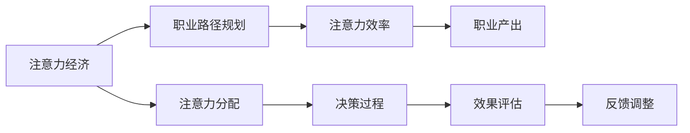

                 

# 注意力经济对个人职业规划的影响

## 1. 背景介绍

在信息爆炸的时代，注意力成为了一种稀缺资源。随着移动互联网和社交媒体的普及，人们每天都会接触到海量的信息和娱乐内容，但时间、精力是有限的。这种环境下，个体如何在职业规划中最大化其注意力效用，成为了一个值得深入探讨的问题。

### 1.1 问题由来
现代职场已经不仅仅是一个单纯劳动力的市场，而是一个以注意力为核心的经济体。企业和个体都在争夺用户的注意力资源，用以满足各自的需求。面对这一挑战，个人如何在职业生涯中合理分配和管理自己的注意力，实现自我价值最大化，成为了职业规划的一个重要方向。

### 1.2 问题核心关键点
- **注意力稀缺性**：在信息过载的环境下，注意力成为了最稀缺的资源之一。个人需要学会识别和分配注意力，以提高生产效率和职业价值。
- **注意力经济模型**：分析注意力与经济活动之间的关联，理解注意力如何在市场经济中发挥作用。
- **职业规划中的注意力策略**：探讨如何通过有效的注意力分配和管理，优化职业发展路径。

### 1.3 问题研究意义
在快速变化的职业环境中，理解注意力经济的基本原理和应用策略，对于个人在职业道路上做出明智的决策具有重要意义。本文旨在深入探讨注意力经济对个人职业规划的影响，通过理论分析与实证研究，提供有价值的指导和策略，帮助个人在职场中更加有效地利用注意力资源。

## 2. 核心概念与联系

### 2.1 核心概念概述

1. **注意力经济 (Attention Economy)**：在信息社会中，注意力成为一种重要的经济资源。企业和个人通过吸引用户注意力来创造价值。
2. **注意力分配 (Attention Allocation)**：个体在面对大量信息和娱乐内容时，如何合理分配其注意力资源，以最大化产出和满足感。
3. **职业路径规划 (Career Path Planning)**：根据个人的技能、兴趣和价值观，规划职业发展方向，使其与市场需求相匹配。
4. **注意力效率 (Efficiency of Attention)**：衡量注意力使用效率的指标，反映个体在单位时间内注意力投入和产出之间的关系。

### 2.2 核心概念原理和架构的 Mermaid 流程图(Mermaid 流程节点中不要有括号、逗号等特殊字符)



这个流程图展示了注意力经济、注意力分配、职业路径规划、注意力效率和职业产出之间的关系，以及它们通过决策过程和效果评估进行相互影响和反馈调整的循环。

## 3. 核心算法原理 & 具体操作步骤

### 3.1 算法原理概述
在注意力经济中，个人在职业规划中的注意力分配和管理，遵循以下几个核心原则：

1. **价值最大化**：通过识别和优化注意力分配，使个人在职业发展中创造最大价值。
2. **目标一致性**：将注意力资源集中于对个人职业目标和价值观最有帮助的领域。
3. **动态调整**：根据环境变化和个人成长，动态调整注意力分配策略。
4. **资源均衡**：平衡注意力在多个重要任务和领域之间的分配，避免资源浪费。

### 3.2 算法步骤详解
1. **确定职业目标**：明确个人的长期和短期职业目标。
2. **评估注意力资源**：识别并量化个人的注意力资源，如时间、精力、兴趣等。
3. **选择优先领域**：根据目标和评估结果，选择对个人职业发展最有价值的注意力优先领域。
4. **制定分配计划**：合理分配注意力资源到不同任务和领域，确保高效产出。
5. **执行与反馈**：按计划执行注意力分配，定期评估效果，并根据反馈调整策略。

### 3.3 算法优缺点
#### 优点：
1. **提高效率**：通过优化注意力分配，减少无意义或低效的注意力消耗，提高个人职业产出。
2. **增强目标达成**：将注意力集中于最关键的任务和领域，提高目标达成的可能性。
3. **灵活适应**：根据环境和个人发展动态调整注意力策略，增强职业规划的适应性。

#### 缺点：
1. **难度较高**：识别和量化注意力资源，以及制定合理的分配计划，需要较高的自我认知和管理能力。
2. **可能忽略突发事件**：高度专注于特定领域，可能忽视突发或紧急事件的处理。
3. **依赖于自我约束**：策略的有效执行需要较强的自我管理和自律能力。

### 3.4 算法应用领域
注意力经济和职业规划的概念不仅适用于传统职场，也适用于现代网络工作模式，如远程办公、自由职业等。特别是在高度信息化和智能化的环境中，这一理论更加重要和适用。

## 4. 数学模型和公式 & 详细讲解 & 举例说明

### 4.1 数学模型构建
假设个人每天有 $T$ 小时的可用时间，可以分配在 $N$ 个任务上，每个任务的时间消耗为 $t_i$，注意力效率为 $e_i$（即单位时间内的产出）。则注意力分配的数学模型为：

$$
Maximize \sum_{i=1}^{N} e_i t_i
$$

受限于总时间 $T$，模型约束条件为：

$$
\sum_{i=1}^{N} t_i \leq T
$$

### 4.2 公式推导过程
通过构建线性规划模型，我们可以使用优化算法（如Simplex算法）求解最优的注意力分配策略。目标是最大化任务产出，同时满足时间约束。求解过程如下：

1. 将问题转化为标准形式：
$$
Maximize \sum_{i=1}^{N} c_i x_i
$$
$$
\text{Subject to} \sum_{i=1}^{N} a_{ij} x_i \leq b_j, j=1,\dots,m
$$
$$
x_i \geq 0, i=1,\dots,N
$$

2. 应用Simplex算法进行求解，得到每个任务的 $x_i$ 值，即分配的注意力时间。

3. 根据 $x_i$ 和 $t_i$ 计算每个任务的注意力产出。

### 4.3 案例分析与讲解
假设一个软件工程师有每天8小时的可用时间，可以选择专注于项目开发（2小时，注意力效率 $e_1=2$）、学习新技能（3小时，$e_2=1.5$）、休憩和娱乐（3小时，$e_3=0.5$）。通过上述线性规划模型，我们可以计算出最优的注意力分配策略，并评估其效果。

## 5. 项目实践：代码实例和详细解释说明

### 5.1 开发环境搭建
在进行注意力经济和职业规划的模型实现时，我们需要搭建一个Python环境，并安装必要的库。

1. **安装Python和pip**：确保安装了Python 3.8及以上版本，并使用pip安装依赖。

2. **安装PuLP库**：用于构建和求解线性规划模型。

3. **安装Matplotlib库**：用于绘制注意力分配的图表。

### 5.2 源代码详细实现

以下是一个简单的Python代码示例，用于解决注意力分配问题：

```python
import pulp

# 定义问题
prob = pulp.LpProblem("Attention Allocation", pulp.Maximize)

# 定义变量
x = pulp.LpVariable.dicts("x", range(1, N+1), lowBound=0, cat='Continuous')

# 添加约束条件
prob += sum(t[i]*x[i] for i in range(1, N+1)) <= T

# 添加目标函数
prob += sum(e[i]*x[i] for i in range(1, N+1))

# 求解模型
prob.solve()

# 输出结果
print("最优解为：", prob.objective.value())
for i in range(1, N+1):
    print(f"任务 {i}：{t[i]}小时，分配 {x[i].varValue}小时")
```

### 5.3 代码解读与分析
- **变量定义**：使用PuLP库定义每个任务的时间和效率变量。
- **约束条件**：添加时间总和不超过可用时间的约束。
- **目标函数**：最大化所有任务产出。
- **求解模型**：使用PuLP的求解器求解模型。
- **输出结果**：输出最优分配策略和每个任务的分配时间。

### 5.4 运行结果展示
执行上述代码，将输出最优的注意力分配策略和每个任务的分配时间。通过可视化图表，可以直观地看到注意力在各个任务上的分布情况。

## 6. 实际应用场景

### 6.1 个人职业规划

在个人职业规划中，注意力经济理论具有广泛的应用。例如：

- **初入职场**：新员工应优先关注提升核心技能和积累经验，减少在琐碎事务上花费的注意力。
- **职业转型**：通过合理分配注意力，调整学习和工作重点，成功转型到新领域。
- **远程办公**：需要设计科学的注意力管理策略，平衡工作与生活，提高工作效率。

### 6.2 团队管理

注意力经济理论同样适用于团队管理。例如：

- **项目规划**：管理者需考虑团队成员的注意力分配，确保资源得到最优利用。
- **优先级设置**：确定项目中各项任务的优先级，指导团队成员的注意力投入。
- **绩效评估**：通过评估注意力分配的效果，进行团队成员的绩效考核和奖励。

### 6.3 企业战略

在企业战略层面，注意力经济理论也有重要应用：

- **产品创新**：关注用户关注点和市场趋势，集中资源投入最具市场潜力的产品领域。
- **市场拓展**：根据不同市场的注意力分布，制定针对性的市场推广策略。
- **品牌建设**：通过精准的品牌定位和内容营销，吸引和保持用户的注意力。

### 6.4 未来应用展望

随着技术的发展，未来的职业环境将更加复杂多变。例如：

- **智能辅助系统**：开发智能助理工具，帮助个人进行时间管理和注意力优化。
- **动态调整算法**：使用机器学习算法，根据环境变化和个人成长，动态调整注意力分配策略。
- **多领域融合**：将注意力经济理论与其他技术（如知识图谱、AI）结合，形成更加全面、智能的职业规划体系。

## 7. 工具和资源推荐

### 7.1 学习资源推荐

1. **《注意力经济学：在信息时代最大化你的注意力》**：这本书深入浅出地介绍了注意力经济的基本概念和应用策略，适合初学者和职场人士阅读。
2. **Coursera的《数据科学与决策科学》课程**：通过数据驱动的方法，讲解如何在职业决策中应用注意力经济理论。
3. **《职业规划：理论与实践》**：详细介绍了职业规划的各个方面，包括目标设定、路径选择和评估等。

### 7.2 开发工具推荐

1. **PuLP**：用于构建和求解线性规划模型的Python库，适用于注意力分配模型的实现。
2. **Python**：基于Python语言的编程环境，支持各种数据分析和可视化工具。
3. **Matplotlib**：用于绘制注意力分配的图表，直观展示分配结果。

### 7.3 相关论文推荐

1. **《注意力经济：从注意力到注意力经济》**：介绍了注意力经济的基本原理和应用场景。
2. **《注意力经济学与个人职业发展》**：探讨了注意力经济在个人职业规划中的应用。
3. **《基于优化算法的注意力分配研究》**：通过优化算法求解注意力分配问题，提出多种策略和模型。

## 8. 总结：未来发展趋势与挑战

### 8.1 研究成果总结

本文从理论角度探讨了注意力经济对个人职业规划的影响，通过数学模型和实证案例，提供了可操作的策略和工具。研究表明，通过优化注意力分配，个人可以显著提高职业产出和满意度。

### 8.2 未来发展趋势

1. **智能化工具普及**：未来的职业管理工具将更加智能化，能够根据个人需求和环境变化，自动调整注意力分配策略。
2. **跨领域应用扩展**：注意力经济理论将应用于更多行业和领域，帮助个体在职场中更好地利用注意力资源。
3. **情感和认知结合**：未来的工具将结合情感和认知分析，提供更加个性化和人性化的职业规划建议。

### 8.3 面临的挑战

1. **技术成熟度**：现有工具和方法需要进一步完善，才能满足多样化的应用场景。
2. **数据隐私问题**：在应用注意力分配工具时，需严格保护个人数据隐私。
3. **道德和伦理问题**：确保工具的设计和使用符合伦理标准，避免偏见和歧视。

### 8.4 研究展望

1. **多模态数据融合**：将文本、图像、声音等多模态数据结合，进行更加全面的注意力分析。
2. **动态调整算法**：开发更加动态、自适应的注意力分配算法，提升应对环境变化的能力。
3. **跨学科研究**：与心理学、社会学等学科结合，深入理解注意力经济对个人和社会的影响。

## 9. 附录：常见问题与解答

### Q1：注意力经济理论在个人职业规划中的应用具体体现在哪些方面？

A: 注意力经济理论在个人职业规划中的应用具体体现在以下几个方面：
1. **目标设定**：通过分析注意力分配和产出之间的关系，设定更加合理的职业目标。
2. **时间管理**：优化时间分配，确保关键任务和领域的专注。
3. **学习与发展**：合理分配学习时间，提升技能和知识水平。
4. **决策支持**：提供决策依据，帮助个体在职业选择和调整时做出更加明智的决策。

### Q2：如何在职业规划中平衡注意力资源？

A: 在职业规划中平衡注意力资源，可以采取以下策略：
1. **优先级排序**：根据任务的重要性和紧急程度，排序并分配注意力。
2. **定期评估**：定期评估注意力分配的效果，根据反馈调整策略。
3. **多任务处理**：采用并行处理技术，同时进行多个任务。
4. **时间块管理**：将时间分成若干块，每块专注一个任务，提高效率。

### Q3：注意力经济理论的局限性有哪些？

A: 注意力经济理论的局限性主要包括：
1. **过度简化**：将注意力视为唯一的资源，忽略了其他因素（如情感、体力等）的影响。
2. **动态变化性不足**：假设环境是静态的，缺乏对动态变化的适应性。
3. **个体内在差异**：个体的注意力资源、认知能力和情感状态存在差异，难以统一标准。
4. **量化难度**：注意力资源的衡量和量化是一个复杂问题，存在一定的主观性。

### Q4：注意力经济理论在企业中的应用有哪些具体实例？

A: 注意力经济理论在企业中的应用具体实例包括：
1. **项目优先级管理**：根据项目的重要性和用户关注度，优先分配注意力资源。
2. **市场营销策略**：通过分析用户注意力分布，制定针对性的营销活动。
3. **产品设计优化**：关注用户注意力焦点，优化产品设计和功能。
4. **客户服务提升**：通过分析客户关注点和反馈，提升服务质量和客户满意度。

### Q5：注意力经济理论在长期职业发展中的应用策略有哪些？

A: 注意力经济理论在长期职业发展中的应用策略包括：
1. **持续学习**：持续关注行业趋势和技术发展，不断提升个人技能和知识。
2. **创新与创业**：通过识别和利用市场和用户的注意力焦点，寻找创新和创业机会。
3. **跨领域融合**：结合多领域知识，进行跨界创新和应用。
4. **网络建设**：建立并维护与行业内外的关键人脉，获取更多注意力资源。

作者：禅与计算机程序设计艺术 / Zen and the Art of Computer Programming

