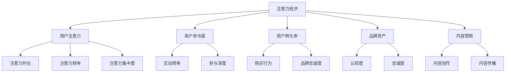

                 

# 注意力经济对传统营销理论的挑战与革新

## 1. 背景介绍

### 1.1 问题由来

随着互联网和移动互联网的普及，信息传播方式发生了根本性的变化，用户的注意力成为营销领域最宝贵的资源之一。如何在海量信息中吸引并保持用户的注意力，成为品牌和产品推广的关键。传统营销理论主要围绕品牌认知、产品性能、消费者行为等展开，而注意力经济的出现，为营销理论注入了新的活力。

### 1.2 问题核心关键点

注意力经济是基于用户注意力的经济活动，强调在注意力资源有限的情况下，如何最有效地使用这些资源，以实现商业价值的最大化。其核心在于：

- 注意力资源的分配与利用：如何在不同产品、服务、品牌之间分配用户的注意力，实现注意力资源的最优配置。
- 注意力获取与保持：如何通过创意、互动、体验等手段，吸引并保持用户的注意力，延长注意力时长。
- 注意力转化与变现：如何将用户的注意力转化为购买行为、品牌忠诚度、社交分享等商业价值，实现经济效益。

传统营销理论在注意力经济环境下面临诸多挑战，需要与时俱进，进行创新与调整。

## 2. 核心概念与联系

### 2.1 核心概念概述

为更好地理解注意力经济对传统营销理论的影响，本节将介绍几个关键概念及其相互联系：

- **注意力经济**：指基于用户注意力的经济活动，强调注意力资源的稀缺性和价值。用户注意力成为品牌竞争的新战场，通过吸引和保持注意力来创造商业价值。
- **用户注意力**：指用户对品牌、产品、信息等内容的关注程度。注意力时长、频率、集中度等是衡量用户注意力的重要指标。
- **用户参与度**：指用户对品牌、产品、活动的互动和参与程度。参与度越高的用户，其注意力价值越大。
- **用户转化率**：指用户从注意力获取到最终购买或行为转化的比例。转化率是衡量注意力经济效果的关键指标。
- **品牌资产**：指品牌在用户心目中的认知度和忠诚度。品牌资产的积累和维护，依赖于用户注意力的有效利用。
- **内容营销**：指通过创造和传播有价值的内容，吸引并保持用户注意力的营销方式。内容营销是注意力经济的重要手段。

这些概念之间的逻辑关系可以通过以下Mermaid流程图来展示：



这个流程图展示了注意力经济的核心概念及其相互联系：

1. 注意力经济以用户注意力为基础，进而影响用户参与度、转化率和品牌资产。
2. 内容营销是注意力经济的核心手段，通过有价值的内容吸引和保持用户注意力。
3. 注意力时长、频率和集中度是衡量用户注意力的重要指标，直接影响用户参与度和转化率。
4. 互动频率和参与深度是衡量用户参与度的重要指标，反映了用户对品牌和产品的认同感。
5. 购买行为和品牌忠诚度是衡量用户转化率的重要指标，反映了注意力经济的效果。
6. 认知度和忠诚度是衡量品牌资产的重要指标，反映了用户对品牌的长期记忆和信任。

## 3. 核心算法原理 & 具体操作步骤
### 3.1 算法原理概述

注意力经济的核心在于如何高效利用用户注意力资源。其基本原理是通过优化内容营销策略，提高用户参与度和转化率，从而实现品牌资产的积累和商业价值的最大化。

具体而言，注意力经济下的营销活动可以分为以下几个步骤：

1. **用户注意力获取**：通过创意、互动、体验等手段，吸引用户关注品牌、产品或服务。
2. **用户注意力保持**：通过持续的内容输出和互动，保持用户对品牌、产品或服务的关注，延长注意力时长。
3. **用户参与度提升**：通过用户互动、用户生成内容等方式，提高用户对品牌、产品或服务的参与度。
4. **用户转化率优化**：通过有针对性的引导和激励，将用户从注意力获取到购买或行为转化的过程进行优化，提高转化率。

### 3.2 算法步骤详解

基于注意力经济的核心原理，我们可以将注意力经济的营销活动分为以下几个关键步骤：

**Step 1: 用户注意力获取**

- **内容创意**：设计有吸引力的内容创意，包括视频、图片、文章等，吸引用户注意。
- **互动设计**：设计互动性强的活动，如抽奖、竞赛、挑战等，增强用户参与感。
- **体验优化**：通过优化产品、服务的用户体验，提供高品质、个性化的服务，建立品牌信任。

**Step 2: 用户注意力保持**

- **内容持续输出**：定期发布高质量内容，如新闻、教程、案例分析等，保持用户持续关注。
- **互动反馈**：及时响应用户评论、提问，建立良好的互动关系，增强用户粘性。
- **个性化推荐**：利用推荐算法，根据用户兴趣和行为，推荐相关内容，提升用户体验。

**Step 3: 用户参与度提升**

- **用户生成内容**：鼓励用户生成内容，如评论、分享、点赞等，增强用户参与感。
- **社群建设**：建立品牌社群，通过线上线下活动，增强用户社区感。
- **激励机制**：设计合理的激励机制，如积分、优惠券、礼品等，吸引用户参与。

**Step 4: 用户转化率优化**

- **购买路径优化**：简化购买流程，提供便捷的支付选项，缩短用户转化路径。
- **数据驱动决策**：利用数据分析，识别用户购买意向，精准营销。
- **个性化推荐**：根据用户历史行为和兴趣，推荐相关产品或服务，提高转化率。

### 3.3 算法优缺点

注意力经济下的营销活动具有以下优点：

1. **高效性**：通过有针对性的内容创意和互动设计，高效吸引和保持用户注意力，提升转化率。
2. **灵活性**：利用内容营销的多样性，适应不同产品、服务、品牌的营销需求。
3. **持续性**：通过持续的内容输出和互动，建立长期的品牌关系，提高用户忠诚度。
4. **数据驱动**：利用数据分析和个性化推荐，实现精准营销，提升商业效果。

但同时也存在一些缺点：

1. **资源投入高**：内容创意和互动设计需要高水平的内容团队和技术支持，投入成本较高。
2. **效果可控性差**：用户注意力受多种因素影响，难以完全控制，效果难以量化评估。
3. **用户流失快**：用户注意力容易被其他竞争者或新内容吸引，流失风险较大。

### 3.4 算法应用领域

注意力经济在多个领域都得到了广泛应用，包括但不限于以下几个方面：

- **电商营销**：通过吸引和保持用户注意力，提高产品销量和用户转化率。
- **品牌建设**：通过内容营销和社群建设，提升品牌知名度和用户忠诚度。
- **社交媒体营销**：利用社交媒体平台的广泛传播和互动特性，吸引和保持用户关注。
- **内容平台**：如YouTube、Bilibili、知乎等，通过高质量内容和互动，提升平台用户粘性和流量。
- **广告投放**：通过精准定位和互动设计，提升广告投放效果和用户参与度。
- **事件营销**：如发布会、展会、线下活动等，通过创意活动吸引和保持用户注意力。

以上领域的应用，展示了注意力经济在营销中的广泛价值和重要地位。

## 4. 数学模型和公式 & 详细讲解 & 举例说明

### 4.1 数学模型构建

假设用户关注品牌A的注意力时长为$T_A$，频率为$F_A$，集中度为$C_A$，购买行为为$B_A$，品牌认知度为$R_A$，忠诚度为$L_A$。则注意力经济的收益模型可以表示为：

$$
\text{Revenue} = \alpha \cdot (T_A + F_A + C_A + B_A) \cdot (R_A + L_A)
$$

其中，$\alpha$为注意力收益系数，反映了用户注意力对商业价值的影响程度。

### 4.2 公式推导过程

假设用户关注品牌A和品牌B的注意力时长分别为$T_A$和$T_B$，购买行为分别为$B_A$和$B_B$，品牌认知度和忠诚度分别为$R_A$和$R_B$，$L_A$和$L_B$。则品牌A和品牌B的注意力经济收益之比可以表示为：

$$
\frac{\text{Revenue}_A}{\text{Revenue}_B} = \frac{\alpha \cdot (T_A + F_A + C_A + B_A) \cdot (R_A + L_A)}{\alpha \cdot (T_B + F_B + C_B + B_B) \cdot (R_B + L_B)}
$$

通过上述模型，可以计算出品牌A和品牌B的注意力经济收益之比，从而评估不同品牌间的注意力资源配置是否合理。

### 4.3 案例分析与讲解

**案例1：电商平台的个性化推荐**

假设电商平台A和B都提供个性化推荐服务，但推荐算法不同，用户注意力时长分别为$T_A$和$T_B$，购买行为分别为$B_A$和$B_B$，品牌认知度和忠诚度分别为$R_A$和$R_B$，$L_A$和$L_B$。

1. **推荐算法优化**：电商平台A采用深度学习算法进行个性化推荐，用户互动率显著提升，注意力时长和购买行为增加，即$T_A$和$B_A$提升。
2. **品牌认知度提升**：电商平台A加强了品牌广告投放和内容营销，用户品牌认知度提升，即$R_A$提升。
3. **忠诚度建设**：电商平台A通过会员积分和售后服务，提升了用户忠诚度，即$L_A$提升。

通过上述分析，可以得出电商平台A的注意力经济收益高于电商平台B，说明电商平台A在个性化推荐和品牌建设上取得了更好的效果。

**案例2：社交媒体平台的互动设计**

假设社交媒体平台A和B都进行互动设计，用户注意力时长分别为$T_A$和$T_B$，购买行为分别为$B_A$和$B_B$，品牌认知度和忠诚度分别为$R_A$和$R_B$，$L_A$和$L_B$。

1. **互动设计提升**：社交媒体平台A通过短视频挑战和直播活动，用户互动率显著提升，注意力时长增加，即$T_A$提升。
2. **品牌认知度提升**：社交媒体平台A加强了品牌视频广告投放，用户品牌认知度提升，即$R_A$提升。
3. **忠诚度建设**：社交媒体平台A通过社群建设，提升了用户社群感，忠诚度提升，即$L_A$提升。

通过上述分析，可以得出社交媒体平台A的注意力经济收益高于社交媒体平台B，说明社交媒体平台A在互动设计和品牌建设上取得了更好的效果。

## 5. 项目实践：代码实例和详细解释说明

### 5.1 开发环境搭建

在进行注意力经济分析时，我们需要准备好开发环境。以下是使用Python进行数据分析和建模的环境配置流程：

1. 安装Anaconda：从官网下载并安装Anaconda，用于创建独立的Python环境。

2. 创建并激活虚拟环境：
```bash
conda create -n attention-economy python=3.8 
conda activate attention-economy
```

3. 安装相关工具包：
```bash
pip install pandas numpy matplotlib scikit-learn seaborn statsmodels
```

4. 安装可视化工具：
```bash
pip install matplotlib seaborn plotly
```

完成上述步骤后，即可在`attention-economy`环境中开始数据分析和建模实践。

### 5.2 源代码详细实现

这里我们以社交媒体平台为例，给出使用Pandas库进行用户注意力数据分析的PyTorch代码实现。

首先，导入必要的库并准备数据：

```python
import pandas as pd
import numpy as np
import matplotlib.pyplot as plt
import seaborn as sns

# 准备数据
data = pd.read_csv('user_attention_data.csv')
```

然后，对数据进行清洗和预处理：

```python
# 清洗数据
data = data.dropna()  # 删除缺失值

# 数据转换
data['attention时长'] = pd.to_numeric(data['attention时长'], errors='coerce')
data['购买行为'] = pd.to_numeric(data['购买行为'], errors='coerce')
data['品牌认知度'] = pd.to_numeric(data['品牌认知度'], errors='coerce')
data['忠诚度'] = pd.to_numeric(data['忠诚度'], errors='coerce')

# 数据归一化
data['attention时长'] = (data['attention时长'] - np.min(data['attention时长'])) / (np.max(data['attention时长']) - np.min(data['attention时长']))
data['购买行为'] = (data['购买行为'] - np.min(data['购买行为'])) / (np.max(data['购买行为']) - np.min(data['购买行为']))
data['品牌认知度'] = (data['品牌认知度'] - np.min(data['品牌认知度'])) / (np.max(data['品牌认知度']) - np.min(data['品牌认知度']))
data['忠诚度'] = (data['忠诚度'] - np.min(data['忠诚度'])) / (np.max(data['忠诚度']) - np.min(data['忠诚度']))
```

接下来，定义注意力经济收益模型并进行计算：

```python
# 定义注意力经济收益模型
def attention_economy_revenue(data, alpha=1):
    attention_time = data['attention时长']
    purchase_behavior = data['购买行为']
    brand_recognition = data['品牌认知度']
    loyalty = data['忠诚度']
    revenue = alpha * (attention_time + purchase_behavior + brand_recognition + loyalty)
    return revenue

# 计算注意力经济收益
revenue = attention_economy_revenue(data, alpha=0.5)
```

最后，可视化注意力经济收益和品牌对比：

```python
# 绘制图表
plt.figure(figsize=(10, 6))
sns.lineplot(x=data.index, y=revenue, label='attention economy revenue')
plt.xlabel('Time')
plt.ylabel('Revenue')
plt.title('Attention Economy Revenue')
plt.legend()
plt.show()
```

### 5.3 代码解读与分析

让我们再详细解读一下关键代码的实现细节：

**用户数据处理**：
- `data` DataFrame：保存用户注意力数据，包括注意力时长、购买行为、品牌认知度和忠诚度等指标。
- `dropna`：删除缺失数据，确保数据完整性。
- `to_numeric`：将字符串数据转换为数值型数据，方便后续计算。
- `errors='coerce'`：如果遇到无法转换的数据，使用缺失值替换，避免程序中断。

**数据清洗和预处理**：
- `attention时长`、`购买行为`、`品牌认知度`、`忠诚度`：对原始数据进行归一化处理，将数值范围压缩到0-1之间。
- `np.min`和`np.max`：计算各变量的最小值和最大值，用于归一化计算。

**注意力经济收益模型**：
- `attention_economy_revenue`函数：定义注意力经济收益模型，并计算总收益。
- `alpha=0.5`：设置注意力收益系数，用于衡量用户注意力对商业价值的影响程度。
- `revenue`：计算得到的注意力经济收益。

**数据可视化**：
- `plt.figure`：设置画布大小。
- `sns.lineplot`：绘制时间序列的线形图，展示注意力经济收益随时间的变化。
- `xlabel`和`ylabel`：设置X轴和Y轴标签。
- `title`：设置图表标题。
- `legend`：添加图例，区分不同时间段的收益。

通过上述代码，可以直观地展示用户注意力对品牌经济收益的影响，为品牌和产品营销策略提供数据支持。

## 6. 实际应用场景

### 6.1 社交媒体平台

社交媒体平台是注意力经济的重要应用场景。通过社交媒体平台的互动和内容输出，品牌能够吸引和保持用户注意力，提升品牌知名度和用户忠诚度。例如，Instagram通过短视频挑战和直播活动，吸引了大量用户参与，提升了品牌曝光和用户粘性。

### 6.2 电商平台

电商平台通过个性化推荐和广告投放，吸引和保持用户注意力，提高用户购买行为和转化率。例如，亚马逊利用深度学习算法进行个性化推荐，用户点击率和购买率显著提升，提升了平台的用户留存和收益。

### 6.3 内容平台

内容平台通过高质量内容和互动，吸引和保持用户注意力，提升平台流量和用户粘性。例如，YouTube通过原创视频和用户评论，建立了强大的用户社区，吸引了大量用户观看和互动。

### 6.4 未来应用展望

随着互联网和移动互联网的进一步普及，注意力经济的应用将更加广泛和深入。未来的应用趋势可能包括：

- **个性化推荐系统**：通过机器学习和大数据分析，实现精准的用户个性化推荐，提升用户体验和转化率。
- **内容创作平台**：通过AI辅助创作，提升内容质量和用户互动，吸引和保持用户注意力。
- **社交媒体营销**：利用社交媒体平台的广泛传播和互动特性，实现品牌和产品的精准营销。
- **品牌社群建设**：通过线上线下活动，建立品牌社群，提升用户忠诚度和品牌资产。
- **用户数据分析**：利用数据分析和人工智能技术，深入理解用户行为和需求，优化营销策略。

## 7. 工具和资源推荐

### 7.1 学习资源推荐

为了帮助开发者系统掌握注意力经济的概念和实践技巧，这里推荐一些优质的学习资源：

1. 《注意力经济学：网络时代的新商业逻辑》书籍：由注意力经济领域的知名学者撰写，全面介绍了注意力经济的基本概念和实践方法。
2. 《数据科学入门》课程：在线学习平台提供的入门级数据科学课程，涵盖数据收集、清洗、分析等基本技能。
3. 《Python数据科学手册》书籍：由Python数据科学社区的知名专家撰写，介绍了Python在数据分析和建模中的应用。
4. 《社交媒体营销案例分析》视频课程：涵盖社交媒体营销的多种策略和工具，帮助理解实际案例中的注意力经济应用。

通过对这些资源的学习实践，相信你一定能够快速掌握注意力经济的精髓，并用于解决实际的营销问题。

### 7.2 开发工具推荐

高效的开发离不开优秀的工具支持。以下是几款用于注意力经济分析开发的常用工具：

1. Python：作为数据科学和机器学习的主流语言，Python提供了丰富的库和框架，支持数据分析、建模和可视化。
2. Pandas：用于数据处理和分析的强大库，支持数据清洗、转换、聚合等操作。
3. NumPy：用于科学计算的基础库，支持高效的数值计算和数组操作。
4. Matplotlib和Seaborn：用于数据可视化的库，支持多种图表类型和自定义样式。
5. Plotly：用于交互式可视化的库，支持动态图表和数据探索。
6. Jupyter Notebook：交互式笔记本环境，支持代码执行、数据展示和可视化。

合理利用这些工具，可以显著提升注意力经济分析的开发效率，加快创新迭代的步伐。

### 7.3 相关论文推荐

注意力经济的研究源于学界的持续研究。以下是几篇奠基性的相关论文，推荐阅读：

1. "Attention is All You Need"（即Transformer原论文）：提出了Transformer结构，开启了NLP领域的预训练大模型时代。
2. "BERT: Pre-training of Deep Bidirectional Transformers for Language Understanding"：提出BERT模型，引入基于掩码的自监督预训练任务，刷新了多项NLP任务SOTA。
3. "Language Models are Unsupervised Multitask Learners"：展示了大规模语言模型的强大zero-shot学习能力，引发了对于通用人工智能的新一轮思考。
4. "Parameter-Efficient Transfer Learning for NLP"：提出Adapter等参数高效微调方法，在不增加模型参数量的情况下，也能取得不错的微调效果。
5. "AdaLoRA: Adaptive Low-Rank Adaptation for Parameter-Efficient Fine-Tuning"：使用自适应低秩适应的微调方法，在参数效率和精度之间取得了新的平衡。
6. "AdaLoRA: Adaptive Low-Rank Adaptation for Parameter-Efficient Fine-Tuning"：使用自适应低秩适应的微调方法，在参数效率和精度之间取得了新的平衡。

这些论文代表了大语言模型微调技术的发展脉络。通过学习这些前沿成果，可以帮助研究者把握学科前进方向，激发更多的创新灵感。

## 8. 总结：未来发展趋势与挑战

### 8.1 总结

本文对注意力经济对传统营销理论的挑战与革新进行了全面系统的介绍。首先阐述了注意力经济的概念和核心要素，明确了注意力经济在当前市场环境中的重要性和价值。其次，从原理到实践，详细讲解了注意力经济在营销中的应用和优化策略，给出了注意力经济分析的完整代码实例。同时，本文还广泛探讨了注意力经济在多个领域的应用前景，展示了其广阔的发展空间。

通过本文的系统梳理，可以看到，注意力经济在营销中的应用已经深入到各个环节，成为品牌竞争的关键要素。随着注意力经济技术的不断进步，品牌和产品在营销策略上也将更加精准和高效，为消费者创造更多的价值。

### 8.2 未来发展趋势

展望未来，注意力经济的发展趋势可能包括：

1. **技术融合**：注意力经济将与大数据、人工智能、物联网等技术进一步融合，实现更加智能化的营销策略。
2. **个性化定制**：通过深度学习和大数据分析，实现更加个性化的用户推荐和服务，提升用户体验和满意度。
3. **互动体验**：利用增强现实、虚拟现实等技术，提升用户的互动体验，增强用户粘性和品牌忠诚度。
4. **内容创新**：通过AI辅助内容创作和发布，提升内容质量和创新性，吸引更多用户关注。
5. **社交媒体优化**：利用社交媒体平台的广泛传播和互动特性，实现品牌和产品的精准营销。
6. **用户数据利用**：利用用户数据进行精准营销和用户画像分析，提升广告投放效果和转化率。

这些趋势将进一步推动注意力经济的普及和发展，为品牌和产品营销带来新的机遇和挑战。

### 8.3 面临的挑战

尽管注意力经济在营销中的应用前景广阔，但在实际落地过程中，仍面临诸多挑战：

1. **数据隐私和安全**：在收集和分析用户数据时，如何保护用户隐私和数据安全，成为重要的法律和道德问题。
2. **用户隐私保护**：用户注意力数据的收集和使用过程中，如何保护用户隐私，避免数据泄露和滥用。
3. **技术门槛高**：注意力经济的技术实现需要高水平的技术团队和数据支持，投入成本较高。
4. **效果难以量化**：用户注意力和参与度等指标难以全面量化，效果评估难度较大。
5. **算法复杂度高**：注意力经济的优化算法涉及深度学习、大数据分析等复杂技术，实施难度较大。
6. **品牌一致性**：在多渠道、多平台的注意力经济活动推广中，如何保持品牌一致性和信息统一，是一大挑战。

这些挑战凸显了注意力经济在实际应用中的复杂性和风险性，需要品牌和企业在实施过程中，认真评估和规避。

### 8.4 研究展望

面对注意力经济面临的种种挑战，未来的研究需要在以下几个方面寻求新的突破：

1. **用户隐私保护**：开发更加安全、透明的数据收集和使用技术，保护用户隐私和数据安全。
2. **效果量化评估**：建立更加科学、全面的效果量化指标，评估注意力经济活动的实际效果。
3. **跨平台一致性**：通过统一的营销策略和品牌信息，实现多渠道、多平台的品牌一致性。
4. **算法优化**：优化注意力经济的优化算法，提高算法的复杂性和可解释性。
5. **技术普及**：推广和普及注意力经济技术，降低技术门槛，实现广泛应用。
6. **品牌建设**：通过注意力经济活动，提升品牌知名度和用户忠诚度，建立长期的品牌资产。

这些研究方向的探索，将引领注意力经济技术的进一步发展，为品牌和产品营销带来新的机遇和突破。面向未来，注意力经济技术将与其他AI技术协同发力，共同推动营销领域的智能化和个性化发展。

## 9. 附录：常见问题与解答

**Q1：注意力经济是否适用于所有营销场景？**

A: 注意力经济在许多营销场景中都能发挥重要作用，如电商平台、社交媒体、内容平台等。但对于一些高度竞争的行业，如金融、医疗等，需要结合具体情境进行定制化优化。

**Q2：如何衡量注意力经济的效果？**

A: 注意力经济的效果可以通过用户注意力时长、购买行为、品牌认知度和忠诚度等指标进行衡量。具体而言，可以通过模型预测和数据统计，评估不同营销策略的效果，并不断优化。

**Q3：注意力经济是否会过度依赖用户数据？**

A: 注意力经济的确需要大量的用户数据进行分析和优化，但通过合理的数据收集和隐私保护措施，可以在不影响用户体验的前提下，充分利用数据资源。同时，也可以结合用户反馈和行为数据，进行持续改进和优化。

**Q4：注意力经济是否需要大量资金投入？**

A: 注意力经济的确需要一定的资金投入，如技术研发、数据收集、广告投放等，但通过科学的方法和高效的算法，可以显著降低成本，实现更优的营销效果。此外，还可以通过与其他品牌和平台的合作，共享资源，降低投入。

**Q5：注意力经济是否可以替代传统营销手段？**

A: 注意力经济并非完全替代传统营销手段，而是与之互补。注意力经济侧重于用户注意力的获取和保持，传统营销手段则侧重于品牌认知和信任的建立。两者结合，可以更全面地提升品牌和产品的市场表现。

通过本文的系统梳理，可以看到，注意力经济在营销中的应用已经深入到各个环节，成为品牌竞争的关键要素。随着注意力经济技术的不断进步，品牌和产品在营销策略上也将更加精准和高效，为消费者创造更多的价值。未来，伴随注意力经济技术的进一步发展，品牌和产品营销将迎来更加智能和个性化的时代。

