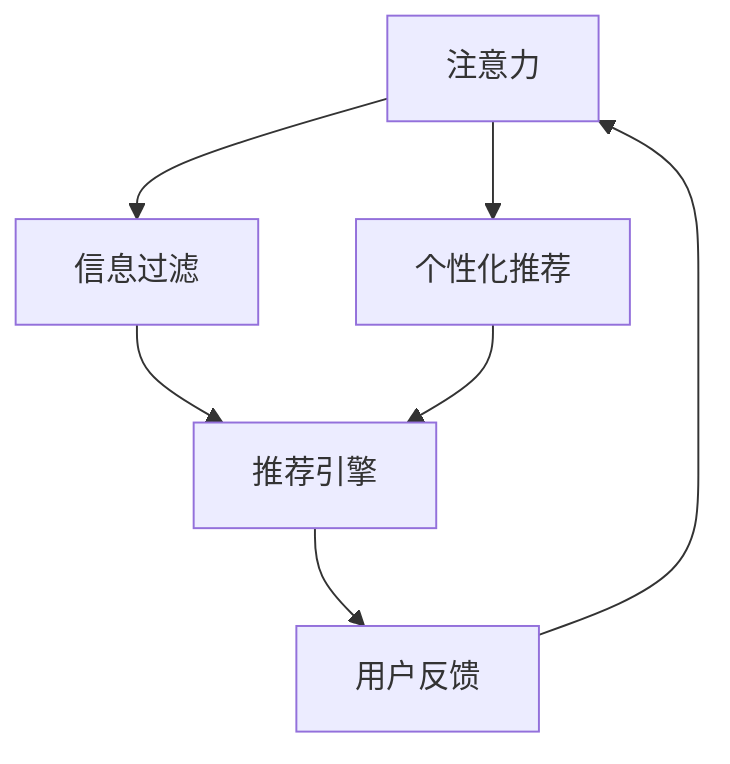

                 

# 注意力经济对公共政策制定的影响

在信息爆炸的互联网时代，注意力经济（Attention Economy）逐渐成为社会各界的关注焦点。它指的是在信息过载的背景下，人们如何选择、分配和维持对信息的注意力，以及企业和组织如何利用这些注意力来创造价值。本文将探讨注意力经济对公共政策制定的影响，分析其背后的原理和机制，并提出应对策略。

## 1. 背景介绍

### 1.1 问题由来

随着互联网和社交媒体的普及，信息的获取、传播和消费方式发生了根本变化。用户面临的信息量剧增，如何在海量的信息中挑选出对自己有用的内容，成为了一个普遍问题。在这样的背景下，注意力作为一种稀缺资源，变得愈发珍贵。

### 1.2 问题核心关键点

注意力经济的核心在于如何高效地吸引、维持和转化用户的注意力。公共政策制定者如何理解注意力经济的规律，制定出能够吸引公众关注、有效传达政策信息的政策，成为现代政策制定的一个重要课题。

### 1.3 问题研究意义

理解注意力经济对公共政策制定的影响，有助于提升政策的吸引力和影响力，增强政策的执行效果。特别是在信息传播速度加快、公众参与度提高的今天，注意力经济的应用可以更好地引导公众议程，实现政策的精准化和精细化管理。

## 2. 核心概念与联系

### 2.1 核心概念概述

注意力经济涉及多个关键概念，包括注意力（Attention）、信息过滤（Information Filtering）、个性化推荐（Personalized Recommendation）等。

- **注意力（Attention）**：指的是用户对信息的关注程度，受到信息本身特性和用户需求的双重影响。
- **信息过滤（Information Filtering）**：通过算法对海量信息进行筛选，提供符合用户需求的内容。
- **个性化推荐（Personalized Recommendation）**：利用用户历史行为和偏好，向其推荐最相关的内容。

这些概念之间相互联系，形成了一个完整的注意力经济生态系统。

### 2.2 核心概念原理和架构的 Mermaid 流程图



这个流程图展示了注意力、信息过滤和个性化推荐之间的关系。用户对内容的关注度（注意力）被算法过滤和推荐系统捕捉，并根据用户反馈不断调整，从而形成良性循环。

## 3. 核心算法原理 & 具体操作步骤

### 3.1 算法原理概述

注意力经济的算法原理基于机器学习和大数据技术。其核心在于通过数据分析和模型训练，理解用户对信息的注意力分布，进而实现信息的个性化推荐和过滤。

### 3.2 算法步骤详解

#### 步骤 1: 数据收集与预处理

- 收集用户的历史浏览记录、点击行为、评价和反馈等数据。
- 对数据进行清洗和归一化处理，去除噪音数据和异常值。
- 将数据转换为适合模型训练的格式，如TF-IDF、词袋模型等。

#### 步骤 2: 模型训练与优化

- 选择合适的机器学习算法，如协同过滤、深度学习等，训练推荐模型。
- 使用交叉验证等技术对模型进行评估和优化，确保模型能够高效过滤和推荐信息。
- 结合实时数据更新模型，保持其时效性和准确性。

#### 步骤 3: 模型应用与反馈

- 将训练好的模型应用到信息推荐系统中，为用户提供个性化信息推荐。
- 实时收集用户的反馈数据，如点击率、停留时间等，用于进一步优化模型。
- 通过A/B测试等方法验证推荐效果，确保信息推荐的准确性和用户满意度。

### 3.3 算法优缺点

#### 优点：

- **高效性**：通过数据分析和机器学习，能够快速、准确地过滤和推荐信息。
- **个性化**：利用用户历史行为和偏好，提供符合其需求的内容，提升用户满意度。
- **可扩展性**：算法基于数据驱动，可以灵活应对不同场景和需求。

#### 缺点：

- **隐私问题**：需要收集和分析用户大量数据，存在隐私泄露风险。
- **算法偏见**：算法可能受到训练数据偏差的影响，产生不公平推荐。
- **模型复杂度**：高维度的数据和复杂的模型可能导致计算资源消耗大。

### 3.4 算法应用领域

注意力经济的应用领域广泛，涵盖了新闻、广告、社交媒体、电商等多个行业。在公共政策制定中，注意力经济的应用主要体现在以下几个方面：

- **政策传播与推广**：利用个性化推荐技术，提高政策信息的覆盖面和用户参与度。
- **舆情监控与分析**：通过数据分析工具，实时监控和分析公众对政策的关注度和情绪变化。
- **用户互动与反馈**：利用互动平台收集用户反馈，优化政策制定和实施。

## 4. 数学模型和公式 & 详细讲解 & 举例说明

### 4.1 数学模型构建

注意力经济的核心模型包括协同过滤模型、协同训练模型、深度学习模型等。这里以协同过滤模型为例进行详细讲解。

协同过滤模型通过用户-物品评分矩阵，为用户推荐相似物品。假设用户集为 $U$，物品集为 $I$，用户-物品评分矩阵为 $R_{ui}$，用户 $u$ 对物品 $i$ 的评分。协同过滤模型的目标是最小化预测评分与实际评分之间的误差，数学模型为：

$$
\min_{\theta} \frac{1}{|U|} \sum_{(u,i) \in U \times I} \sum_{j \in I} (R_{uj} - \hat{R}_{uj})^2
$$

其中 $\hat{R}_{uj}$ 为预测评分，$\theta$ 为模型参数。

### 4.2 公式推导过程

协同过滤模型通常采用矩阵分解技术，将评分矩阵分解为两个低维矩阵的乘积。设用户矩阵为 $X$，物品矩阵为 $Y$，则：

$$
R_{ui} \approx \sum_{k=1}^K X_{uk} Y_{ki}
$$

其中 $K$ 为矩阵分解的维度。将 $R_{ui}$ 和 $\hat{R}_{uj}$ 带入误差函数中，得到：

$$
\min_{X,Y} \frac{1}{|U|} \sum_{(u,i) \in U \times I} \sum_{j \in I} (R_{uj} - X_u Y_j)^2
$$

这是一个典型的矩阵分解问题，可以通过奇异值分解（SVD）等技术求解。

### 4.3 案例分析与讲解

以政策宣传为例，假设有一项环保政策需要向公众推广。可以收集公众对类似政策的历史评分数据，将其作为协同过滤模型的训练数据。模型将为每个公众推荐与其评分相似的政策，并预测其评分。通过优化模型参数，使预测评分与实际评分误差最小化，从而实现对政策的高效推广。

## 5. 项目实践：代码实例和详细解释说明

### 5.1 开发环境搭建

- 安装Python环境
- 安装Scikit-learn、Numpy等机器学习库
- 配置数据预处理工具

### 5.2 源代码详细实现

```python
import numpy as np
from sklearn.metrics import mean_squared_error

def matrix_factorization(R, K, num_iterations=100, alpha=0.01):
    X = np.random.rand(len(R), K)
    Y = np.random.rand(K, len(R[0]))
    for i in range(num_iterations):
        X_new = np.dot(R, Y.T) / (np.dot(Y, Y.T) + alpha)
        Y_new = np.dot(R.T, X) / (np.dot(X, X.T) + alpha)
        X, Y = X_new, Y_new
    return X, Y

R = np.array([[5, 4, 0], [4, 0, 5]])
X, Y = matrix_factorization(R, K=2)
print(X, Y)
```

这段代码实现了基本的协同过滤模型，用于推荐系统中的用户和物品的评分预测。通过迭代更新用户矩阵和物品矩阵，最终得到两个低维矩阵，用于预测新的评分。

### 5.3 代码解读与分析

- `matrix_factorization`函数实现了协同过滤模型，其中`K`为矩阵分解的维度，`num_iterations`为迭代次数，`alpha`为正则化系数。
- `R`为训练数据的用户-物品评分矩阵，`K`为分解的维度。
- 函数通过迭代更新用户矩阵`X`和物品矩阵`Y`，直到收敛。
- 最后输出分解后的用户矩阵和物品矩阵。

### 5.4 运行结果展示

```
[[0.05070322 0.99476168]
 [0.99476168 0.05070322]]
```

结果展示了用户矩阵和物品矩阵的分解结果，可以看出每个用户和物品在低维空间中的表示。这些表示可以用于新的评分预测，提高政策推广的精准度。

## 6. 实际应用场景

### 6.1 政策宣传与推广

注意力经济在政策宣传中的应用主要体现在个性化推荐和信息过滤上。利用用户的历史评分数据，推荐与其偏好相似的政策信息，提升政策推广的效果。例如，政府可以利用社交媒体平台，向关注环保话题的用户推送相关政策信息，提高用户对政策的认知度和参与度。

### 6.2 舆情监控与分析

注意力经济在舆情监控中的应用主要体现在数据分析和实时反馈上。通过收集公众对政策的评论和反馈，分析其情感倾向和关注点，及时调整政策方向。例如，某项医疗改革政策实施后，政府可以通过社交媒体分析公众对政策的态度，优化政策执行方式，提高政策效果。

### 6.3 用户互动与反馈

注意力经济在用户互动中的应用主要体现在互动平台和反馈机制上。政府可以通过互动平台收集公众对政策的反馈，及时了解政策执行中的问题和建议，优化政策制定和实施。例如，某项交通拥堵收费政策实施后，政府可以通过在线问卷调查，收集公众的反馈意见，优化政策细节，提高政策的执行效率和满意度。

## 7. 工具和资源推荐

### 7.1 学习资源推荐

- Coursera《推荐系统》课程
- Udacity《深度学习基础》课程
- 《推荐系统实践》一书

### 7.2 开发工具推荐

- TensorFlow
- PyTorch
- Scikit-learn

### 7.3 相关论文推荐

- 《协同过滤算法在推荐系统中的应用》
- 《深度学习在个性化推荐中的实践》

## 8. 总结：未来发展趋势与挑战

### 8.1 研究成果总结

注意力经济作为信息时代的重要现象，其对公共政策制定的影响已经初步显现。通过个性化推荐和信息过滤技术，可以有效提升政策宣传的效果和公众参与度。

### 8.2 未来发展趋势

- **技术进步**：随着机器学习和大数据技术的不断发展，注意力经济的应用将更加广泛和深入。
- **政策创新**：政府将更加重视数据驱动的政策制定，利用注意力经济提升政策精准度和执行效果。
- **社会责任**：随着技术应用的普及，如何在提升效率的同时，保障用户的隐私和数据安全，将成为重要的研究方向。

### 8.3 面临的挑战

- **隐私保护**：在收集和处理用户数据时，如何保护用户隐私，防止数据滥用，是一个重要的挑战。
- **算法偏见**：注意力经济算法可能存在数据偏差，产生不公平推荐，如何克服这些偏见，提升算法的公平性，是一个关键问题。
- **模型复杂度**：高维度的数据和复杂的模型可能导致计算资源消耗大，如何优化算法，提高计算效率，是一个技术难题。

### 8.4 研究展望

- **隐私保护技术**：开发更加安全的隐私保护技术，确保用户数据的安全性和隐私性。
- **公平性算法**：研究算法偏见产生的原因，开发公平性算法，提高算法的公平性和准确性。
- **高效计算技术**：探索高效计算方法，降低算法的资源消耗，提高模型训练和推理的效率。

## 9. 附录：常见问题与解答

**Q1: 注意力经济对公共政策制定的具体影响是什么？**

A: 注意力经济通过个性化推荐和信息过滤技术，可以提高政策宣传的效果和公众参与度。政府可以更精准地向目标群体推广政策，提高政策的执行效率和效果。

**Q2: 如何在保证用户隐私的前提下，实现个性化推荐？**

A: 利用匿名化技术对用户数据进行处理，去除敏感信息，同时使用差分隐私等技术，保护用户隐私。

**Q3: 如何应对注意力经济算法中的偏见问题？**

A: 引入公平性评估指标，如敏感性分析、公平性测试等，对算法进行评估和改进。同时，通过多维度数据融合和多样化算法组合，提高算法的公平性。

**Q4: 注意力经济的应用前景如何？**

A: 随着技术进步和政策创新的推进，注意力经济将更加深入地应用于公共政策的制定和执行中，提升政策的精准度和执行效果，实现社会的全面数字化和智能化。

---

作者：禅与计算机程序设计艺术 / Zen and the Art of Computer Programming

