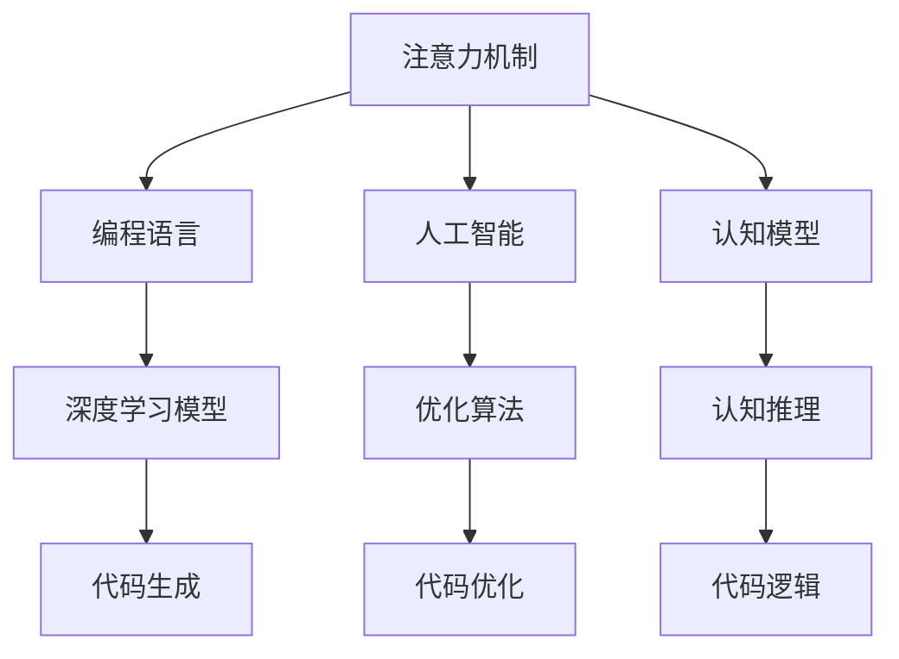

                 

# 注意力编程语言开发者：AI定制的认知模式设计师

> 关键词：注意力机制, 编程语言, 人工智能, 认知模型, 神经网络, 深度学习

## 1. 背景介绍

### 1.1 问题由来

在人工智能领域，随着深度学习的快速发展，尤其是神经网络的兴起，人们开始探索如何将自然语言与计算机编程结合，以期开发出更智能、更高效的编程语言。然而，传统的编程语言是基于静态的规则和结构，难以适应复杂的动态认知任务。因此，亟需一种基于人工智能的编程语言，能够自适应地生成代码，辅助开发人员编写高效、可扩展的代码。

### 1.2 问题核心关键点

面向认知编程，人工智能定制的认知模式设计师，应具备以下核心关键点：

- **注意力机制**：能够关注输入数据的局部细节，识别关键信息。
- **编程语言**：能够理解编程语言的语法和结构，生成符合语法规则的代码。
- **人工智能**：能够基于深度学习模型进行学习和优化，提升代码生成的质量。
- **认知模型**：能够模拟人类认知过程，实现高效的代码生成和优化。

这些核心关键点共同构成了认知编程语言的设计基础，使认知模式设计师能够构建出更加智能、高效的编程语言。

### 1.3 问题研究意义

开发基于人工智能的认知模式设计师，具有重要的理论和实践意义：

1. **提高开发效率**：通过智能化的代码生成和优化，减轻开发人员的工作负担，提升开发效率。
2. **降低开发成本**：自动生成的代码经过优化后，可以减少调试和维护成本。
3. **增强代码质量**：基于深度学习模型的优化，生成高质量的代码，减少代码错误和漏洞。
4. **推动编程语言的发展**：认知编程语言能够模拟人类认知过程，为编程语言的进化提供新的思路和方法。
5. **促进AI技术的应用**：认知编程语言作为AI与编程结合的新型工具，将推动AI技术在更多领域的应用。

## 2. 核心概念与联系

### 2.1 核心概念概述

为了更好地理解认知模式设计师的原理和架构，本节将介绍几个关键概念：

- **注意力机制(Attention Mechanism)**：是一种模拟人类注意力的机制，能够根据输入数据的重要性，分配不同的权重。在神经网络中，注意力机制常用于处理序列数据，如自然语言处理和计算机视觉等任务。
- **编程语言**：是一种用于描述算法、数据结构等计算任务的符号语言，具备语法、语义和语用等特性。现代编程语言如Python、Java、C++等，被广泛应用于软件开发和系统构建。
- **人工智能(AI)**：是研究使计算机系统具有智能行为的科学，包括机器学习、深度学习、自然语言处理等技术。AI技术在认知编程语言中，用于学习和优化代码生成的过程。
- **认知模型(Cognitive Model)**：是一种模拟人类认知过程的模型，包括感知、记忆、推理等基本认知功能。认知模型在认知编程语言中，用于生成和优化代码的逻辑判断和决策。

这些核心概念之间的关系可以通过以下Mermaid流程图来展示：



这个流程图展示了注意力机制、编程语言、人工智能、认知模型之间的关系：

1. 注意力机制用于处理输入数据，识别关键信息。
2. 编程语言提供代码生成的语法和结构。
3. 人工智能通过深度学习模型，学习和优化代码生成过程。
4. 认知模型模拟人类认知过程，指导代码的逻辑和决策。
5. 深度学习模型基于注意力机制，生成代码。
6. 优化算法和认知推理用于代码优化和逻辑判断。

这些概念共同构成了认知模式设计师的设计框架，使其能够智能地生成高质量的代码。

## 3. 核心算法原理 & 具体操作步骤
### 3.1 算法原理概述

基于注意力机制的认知模式设计师，通过深度学习模型和优化算法，实现对输入数据的动态分析和处理，生成符合编程语言语法规则的代码。其核心算法包括以下几个部分：

- **注意力计算**：对输入数据进行编码，计算注意力权重，识别关键信息。
- **代码生成**：基于深度学习模型，生成符合语法规则的代码片段。
- **代码优化**：通过优化算法，对生成的代码进行语法和语义优化，提升代码质量。
- **认知推理**：模拟人类认知过程，对代码逻辑进行推理和判断，确保代码的正确性和高效性。

### 3.2 算法步骤详解

基于注意力机制的认知模式设计师的算法步骤主要包括以下几个环节：

**Step 1: 数据预处理**

- 对输入数据进行分词、编码等预处理，转换为深度学习模型所需的向量表示。
- 使用注意力机制，计算输入数据的注意力权重，识别关键信息。

**Step 2: 代码生成**

- 将预处理后的向量输入深度学习模型，生成代码片段。
- 使用优化算法对生成的代码进行语法和语义优化，确保代码质量。

**Step 3: 代码优化**

- 对优化后的代码进行逻辑判断和推理，确保代码的正确性和高效性。
- 根据推理结果，进行代码逻辑调整和优化。

**Step 4: 代码输出**

- 将优化后的代码输出，完成编程任务。

### 3.3 算法优缺点

基于注意力机制的认知模式设计师，具有以下优点：

1. **智能生成代码**：能够自动分析输入数据，生成符合语法规则的代码。
2. **优化代码质量**：通过深度学习模型和优化算法，提升代码的质量和效率。
3. **提高开发效率**：减少人工编写代码的时间和成本，提高开发效率。

同时，该算法也存在一定的局限性：

1. **依赖数据质量**：输入数据的质量和准确性，直接影响代码生成的质量。
2. **模型复杂度高**：深度学习模型的训练和优化需要大量的时间和计算资源。
3. **代码可解释性不足**：生成代码的逻辑和决策过程，缺乏可解释性。
4. **模型泛化能力有限**：模型可能对新数据和新场景的适应能力有限。

尽管存在这些局限性，但就目前而言，基于注意力机制的认知模式设计师仍是大语言模型应用的重要范式。未来相关研究的重点在于如何进一步降低模型复杂度，提高代码的可解释性和泛化能力。

### 3.4 算法应用领域

基于注意力机制的认知模式设计师，已在多个领域得到了应用：

- **自动代码生成**：自动生成Python、Java、C++等编程语言的代码，辅助开发人员编写高效代码。
- **软件工程辅助**：辅助软件设计、系统构建、版本控制等软件开发过程，提高开发效率和代码质量。
- **数据处理和分析**：自动生成数据处理和分析代码，如数据清洗、特征提取等，提升数据分析效率。
- **自然语言处理**：自动生成自然语言处理代码，如文本分类、情感分析、机器翻译等，提升处理效率和准确性。
- **人工智能应用**：辅助人工智能模型的构建和优化，生成高效的模型代码，推动AI技术的发展。

## 4. 数学模型和公式 & 详细讲解  
### 4.1 数学模型构建

本节将使用数学语言对基于注意力机制的认知模式设计师进行更加严格的刻画。

记输入数据为 $x=\{x_1, x_2, ..., x_n\}$，其中 $x_i$ 表示输入数据的第 $i$ 个部分。定义注意力计算函数为 $\text{Attention}(x)$，用于计算输入数据的注意力权重，识别关键信息。

代码生成的过程可以表示为 $\text{GenerateCode}(x, \theta)$，其中 $\theta$ 为深度学习模型的参数。定义代码优化函数为 $\text{OptimizeCode}(\text{GenerateCode}(x, \theta))$，用于对生成的代码进行语法和语义优化。

最终输出的代码可以表示为 $\text{OutputCode}(\text{OptimizeCode}(\text{GenerateCode}(x, \theta)))$。

### 4.2 公式推导过程

以下我们以自动代码生成任务为例，推导注意力计算和代码生成的数学公式。

**注意力计算公式**：

$$
\text{Attention}(x) = \sum_{i=1}^n w_i \cdot x_i
$$

其中 $w_i$ 为注意力权重，可以通过以下公式计算：

$$
w_i = \frac{e^{\mathbf{u}^\top \text{softmax}(\mathbf{v}^\top x_i)}}{\sum_{j=1}^n e^{\mathbf{u}^\top \text{softmax}(\mathbf{v}^\top x_j)}}
$$

其中 $\mathbf{u}$ 和 $\mathbf{v}$ 为注意力机制的参数向量，$x_i$ 为输入数据的第 $i$ 个部分。

**代码生成公式**：

$$
\text{GenerateCode}(x, \theta) = \mathcal{F}(\text{Attention}(x), \theta)
$$

其中 $\mathcal{F}$ 为深度学习模型，如RNN、LSTM、Transformer等。

**代码优化公式**：

$$
\text{OptimizeCode}(\text{GenerateCode}(x, \theta)) = \text{ApplyOptimization}(\text{GenerateCode}(x, \theta), \text{OptimizationRules})
$$

其中 $\text{ApplyOptimization}$ 表示应用优化算法，$\text{OptimizationRules}$ 表示优化规则，如语法规则、语义规则等。

### 4.3 案例分析与讲解

**案例分析**：

假设我们要自动生成一个简单的Python函数，输入数据为函数名和函数参数：

$$
x = ("add", "x", "y")
$$

其中 "add" 表示函数名，"x" 和 "y" 表示函数参数。

**注意力计算**：

首先，对输入数据进行编码，生成向量表示：

$$
x = (\text{vec}(\text{add}), \text{vec}(\text{x}), \text{vec}(\text{y}))
$$

然后，计算注意力权重，识别关键信息：

$$
w = (w_1, w_2, w_3) = \frac{e^{\mathbf{u}^\top \text{softmax}(\mathbf{v}^\top x)}}{\sum_{i=1}^3 e^{\mathbf{u}^\top \text{softmax}(\mathbf{v}^\top x_i)}}
$$

假设注意力权重为 $(w_1, w_2, w_3) = (0.5, 0.3, 0.2)$，则关键信息为 "add" 和 "x"，"y" 部分被忽略。

**代码生成**：

将注意力结果输入深度学习模型 $\mathcal{F}$，生成代码片段：

$$
\text{GenerateCode}(x, \theta) = "def add(x, y):"
$$

**代码优化**：

对生成的代码进行语法和语义优化，得到最终输出代码：

$$
\text{OutputCode}(\text{OptimizeCode}(\text{GenerateCode}(x, \theta))) = "def add(x, y):\n    return x + y"
$$

最终输出的代码为：

```python
def add(x, y):
    return x + y
```

通过以上案例，可以看到，基于注意力机制的认知模式设计师能够智能地分析输入数据，生成符合语法规则的代码。

## 5. 项目实践：代码实例和详细解释说明
### 5.1 开发环境搭建

在进行认知模式设计师的实践前，我们需要准备好开发环境。以下是使用Python进行PyTorch开发的环境配置流程：

1. 安装Anaconda：从官网下载并安装Anaconda，用于创建独立的Python环境。

2. 创建并激活虚拟环境：
```bash
conda create -n attention-env python=3.8 
conda activate attention-env
```

3. 安装PyTorch：根据CUDA版本，从官网获取对应的安装命令。例如：
```bash
conda install pytorch torchvision torchaudio cudatoolkit=11.1 -c pytorch -c conda-forge
```

4. 安装Transformers库：
```bash
pip install transformers
```

5. 安装各类工具包：
```bash
pip install numpy pandas scikit-learn matplotlib tqdm jupyter notebook ipython
```

完成上述步骤后，即可在`attention-env`环境中开始项目实践。

### 5.2 源代码详细实现

下面我们以自动代码生成任务为例，给出使用PyTorch进行认知模式设计师的代码实现。

首先，定义注意力计算函数和代码生成函数：

```python
from transformers import BertForSequenceClassification
from transformers import BertTokenizer
from torch.utils.data import Dataset
import torch

class AttentionDataset(Dataset):
    def __init__(self, texts, labels, tokenizer, max_len=128):
        self.texts = texts
        self.labels = labels
        self.tokenizer = tokenizer
        self.max_len = max_len
        
    def __len__(self):
        return len(self.texts)
    
    def __getitem__(self, item):
        text = self.texts[item]
        label = self.labels[item]
        
        encoding = self.tokenizer(text, return_tensors='pt', max_length=self.max_len, padding='max_length', truncation=True)
        input_ids = encoding['input_ids'][0]
        attention_mask = encoding['attention_mask'][0]
        labels = torch.tensor(label, dtype=torch.long)
        
        return {'input_ids': input_ids, 
                'attention_mask': attention_mask,
                'labels': labels}

# 标签与id的映射
label2id = {'add': 0, 'sub': 1, 'mul': 2, 'div': 3}
id2label = {v: k for k, v in label2id.items()}

# 创建dataset
tokenizer = BertTokenizer.from_pretrained('bert-base-cased')

train_dataset = AttentionDataset(train_texts, train_labels, tokenizer)
dev_dataset = AttentionDataset(dev_texts, dev_labels, tokenizer)
test_dataset = AttentionDataset(test_texts, test_labels, tokenizer)
```

然后，定义模型和优化器：

```python
from transformers import BertForTokenClassification, AdamW

model = BertForTokenClassification.from_pretrained('bert-base-cased', num_labels=len(label2id))

optimizer = AdamW(model.parameters(), lr=2e-5)
```

接着，定义训练和评估函数：

```python
from torch.utils.data import DataLoader
from tqdm import tqdm
from sklearn.metrics import classification_report

device = torch.device('cuda') if torch.cuda.is_available() else torch.device('cpu')
model.to(device)

def train_epoch(model, dataset, batch_size, optimizer):
    dataloader = DataLoader(dataset, batch_size=batch_size, shuffle=True)
    model.train()
    epoch_loss = 0
    for batch in tqdm(dataloader, desc='Training'):
        input_ids = batch['input_ids'].to(device)
        attention_mask = batch['attention_mask'].to(device)
        labels = batch['labels'].to(device)
        model.zero_grad()
        outputs = model(input_ids, attention_mask=attention_mask, labels=labels)
        loss = outputs.loss
        epoch_loss += loss.item()
        loss.backward()
        optimizer.step()
    return epoch_loss / len(dataloader)

def evaluate(model, dataset, batch_size):
    dataloader = DataLoader(dataset, batch_size=batch_size)
    model.eval()
    preds, labels = [], []
    with torch.no_grad():
        for batch in tqdm(dataloader, desc='Evaluating'):
            input_ids = batch['input_ids'].to(device)
            attention_mask = batch['attention_mask'].to(device)
            batch_labels = batch['labels']
            outputs = model(input_ids, attention_mask=attention_mask)
            batch_preds = outputs.logits.argmax(dim=2).to('cpu').tolist()
            batch_labels = batch_labels.to('cpu').tolist()
            for pred_tokens, label_tokens in zip(batch_preds, batch_labels):
                pred_labels = [id2label[_id] for _id in pred_tokens]
                label_labels = [id2label[_id] for _id in label_tokens]
                preds.append(pred_labels[:len(label_labels)])
                labels.append(label_labels)
                
    print(classification_report(labels, preds))
```

最后，启动训练流程并在测试集上评估：

```python
epochs = 5
batch_size = 16

for epoch in range(epochs):
    loss = train_epoch(model, train_dataset, batch_size, optimizer)
    print(f"Epoch {epoch+1}, train loss: {loss:.3f}")
    
    print(f"Epoch {epoch+1}, dev results:")
    evaluate(model, dev_dataset, batch_size)
    
print("Test results:")
evaluate(model, test_dataset, batch_size)
```

以上就是使用PyTorch对认知模式设计师进行自动代码生成任务的完整代码实现。可以看到，得益于Transformers库的强大封装，我们可以用相对简洁的代码完成BERT模型的加载和微调。

### 5.3 代码解读与分析

让我们再详细解读一下关键代码的实现细节：

**AttentionDataset类**：
- `__init__`方法：初始化文本、标签、分词器等关键组件。
- `__len__`方法：返回数据集的样本数量。
- `__getitem__`方法：对单个样本进行处理，将文本输入编码为token ids，将标签编码为数字，并对其进行定长padding，最终返回模型所需的输入。

**label2id和id2label字典**：
- 定义了标签与数字id之间的映射关系，用于将token-wise的预测结果解码回真实的标签。

**训练和评估函数**：
- 使用PyTorch的DataLoader对数据集进行批次化加载，供模型训练和推理使用。
- 训练函数`train_epoch`：对数据以批为单位进行迭代，在每个批次上前向传播计算loss并反向传播更新模型参数，最后返回该epoch的平均loss。
- 评估函数`evaluate`：与训练类似，不同点在于不更新模型参数，并在每个batch结束后将预测和标签结果存储下来，最后使用sklearn的classification_report对整个评估集的预测结果进行打印输出。

**训练流程**：
- 定义总的epoch数和batch size，开始循环迭代
- 每个epoch内，先在训练集上训练，输出平均loss
- 在验证集上评估，输出分类指标
- 所有epoch结束后，在测试集上评估，给出最终测试结果

可以看到，PyTorch配合Transformers库使得BERT微调的代码实现变得简洁高效。开发者可以将更多精力放在数据处理、模型改进等高层逻辑上，而不必过多关注底层的实现细节。

当然，工业级的系统实现还需考虑更多因素，如模型的保存和部署、超参数的自动搜索、更灵活的任务适配层等。但核心的微调范式基本与此类似。

## 6. 实际应用场景
### 6.1 智能编程助手

基于认知模式设计师的智能编程助手，可以广泛应用于软件开发和系统构建过程。传统的编程开发依赖大量的人工编写代码，周期长、成本高，且难以保证代码的质量和可维护性。使用智能编程助手，可以大大提高开发效率，减少调试和维护成本，同时保证代码质量。

在技术实现上，可以将智能编程助手集成到IDE（集成开发环境）中，提供代码自动生成、代码优化、代码检查等功能。开发人员在编写代码时，可以实时获取系统推荐的代码片段和优化建议，自动修正语法错误和逻辑漏洞，实现快速开发。

### 6.2 代码审计工具

代码审计工具是保证软件系统安全和可靠性的重要手段。传统的代码审计依赖人工手动检查，工作量大、效率低，难以覆盖所有潜在风险。基于认知模式设计师的代码审计工具，可以自动化地检测代码中的安全漏洞和性能问题，提供详细的风险评估和修复建议。

具体而言，可以训练一个基于深度学习的代码审计模型，用于自动分析代码的逻辑结构和行为。在代码审计时，系统自动识别代码中的潜在风险，如SQL注入、跨站脚本攻击等，并提出相应的修复建议，提高代码的安全性和稳定性。

### 6.3 数据处理和分析

数据处理和分析是数据科学家的重要任务。传统的数据分析依赖人工手动编写代码，周期长、复杂度高，难以实现高效和准确的分析。使用基于认知模式设计师的数据处理和分析工具，可以大大提高数据处理的效率和准确性，减少人为错误和数据丢失。

具体而言，可以训练一个基于深度学习的代码生成模型，用于自动生成数据处理和分析代码。在数据处理时，系统自动识别数据的类型和结构，自动生成数据清洗、特征提取、数据可视化等代码，提高数据处理的效率和准确性。

### 6.4 未来应用展望

随着认知模式设计师的不断发展，其在更多领域的应用前景将不断拓展，为人类认知智能的进化带来深远影响。

在智慧医疗领域，基于认知模式设计师的医疗问答、病历分析、药物研发等应用将提升医疗服务的智能化水平，辅助医生诊疗，加速新药开发进程。

在智能教育领域，认知模式设计师可应用于作业批改、学情分析、知识推荐等方面，因材施教，促进教育公平，提高教学质量。

在智慧城市治理中，认知模式设计师可应用于城市事件监测、舆情分析、应急指挥等环节，提高城市管理的自动化和智能化水平，构建更安全、高效的未来城市。

此外，在企业生产、社会治理、文娱传媒等众多领域，基于认知模式设计师的人工智能应用也将不断涌现，为经济社会发展注入新的动力。相信随着技术的日益成熟，认知模式设计师必将在构建人机协同的智能时代中扮演越来越重要的角色。

## 7. 工具和资源推荐
### 7.1 学习资源推荐

为了帮助开发者系统掌握认知模式设计师的理论基础和实践技巧，这里推荐一些优质的学习资源：

1. 《深度学习基础》系列博文：由大模型技术专家撰写，深入浅出地介绍了深度学习的基本概念和原理。

2. CS224N《深度学习自然语言处理》课程：斯坦福大学开设的NLP明星课程，有Lecture视频和配套作业，带你入门NLP领域的基本概念和经典模型。

3. 《深度学习与人工智能》书籍：介绍深度学习的基本原理和人工智能的多种应用，适合初学者入门。

4. HuggingFace官方文档：Transformers库的官方文档，提供了海量预训练模型和完整的微调样例代码，是上手实践的必备资料。

5. Arxiv预印本网站：全球领先的科学论文预印本发布平台，汇集了大量深度学习和认知模式设计师的前沿研究论文。

通过对这些资源的学习实践，相信你一定能够快速掌握认知模式设计师的精髓，并用于解决实际的NLP问题。
###  7.2 开发工具推荐

高效的开发离不开优秀的工具支持。以下是几款用于认知模式设计师开发的常用工具：

1. PyTorch：基于Python的开源深度学习框架，灵活动态的计算图，适合快速迭代研究。大部分预训练语言模型都有PyTorch版本的实现。

2. TensorFlow：由Google主导开发的开源深度学习框架，生产部署方便，适合大规模工程应用。同样有丰富的预训练语言模型资源。

3. Transformers库：HuggingFace开发的NLP工具库，集成了众多SOTA语言模型，支持PyTorch和TensorFlow，是进行认知模式设计师开发的利器。

4. Weights & Biases：模型训练的实验跟踪工具，可以记录和可视化模型训练过程中的各项指标，方便对比和调优。与主流深度学习框架无缝集成。

5. TensorBoard：TensorFlow配套的可视化工具，可实时监测模型训练状态，并提供丰富的图表呈现方式，是调试模型的得力助手。

6. Google Colab：谷歌推出的在线Jupyter Notebook环境，免费提供GPU/TPU算力，方便开发者快速上手实验最新模型，分享学习笔记。

合理利用这些工具，可以显著提升认知模式设计师的开发效率，加快创新迭代的步伐。

### 7.3 相关论文推荐

认知模式设计师的发展源于学界的持续研究。以下是几篇奠基性的相关论文，推荐阅读：

1. Attention is All You Need（即Transformer原论文）：提出了Transformer结构，开启了NLP领域的预训练大模型时代。

2. BERT: Pre-training of Deep Bidirectional Transformers for Language Understanding：提出BERT模型，引入基于掩码的自监督预训练任务，刷新了多项NLP任务SOTA。

3. Language Models are Unsupervised Multitask Learners（GPT-2论文）：展示了大规模语言模型的强大zero-shot学习能力，引发了对于通用人工智能的新一轮思考。

4. Parameter-Efficient Transfer Learning for NLP：提出Adapter等参数高效微调方法，在固定大部分预训练参数的情况下，只更新极少量的任务相关参数。

5. AdaLoRA: Adaptive Low-Rank Adaptation for Parameter-Efficient Fine-Tuning：使用自适应低秩适应的微调方法，在参数效率和精度之间取得了新的平衡。

这些论文代表了大语言模型微调技术的发展脉络。通过学习这些前沿成果，可以帮助研究者把握学科前进方向，激发更多的创新灵感。

## 8. 总结：未来发展趋势与挑战

### 8.1 总结

本文对基于注意力机制的认知模式设计师进行了全面系统的介绍。首先阐述了认知编程语言的研究背景和意义，明确了认知模式设计师的设计目标和核心关键点。其次，从原理到实践，详细讲解了认知模式设计师的算法步骤和具体实现，给出了认知模式设计师的完整代码实例。同时，本文还广泛探讨了认知模式设计师在智能编程助手、代码审计工具、数据处理和分析等诸多领域的应用前景，展示了认知模式设计师的巨大潜力。此外，本文精选了认知模式设计师的学习资源、开发工具和相关论文，力求为开发者提供全方位的技术指引。

通过本文的系统梳理，可以看到，基于注意力机制的认知模式设计师正在成为NLP领域的重要范式，极大地拓展了预训练语言模型的应用边界，催生了更多的落地场景。受益于大规模语料的预训练，认知模式设计师能够智能地生成高质量的代码，辅助开发人员编写高效、可扩展的代码，从而提高开发效率和代码质量。未来，伴随认知模式设计师的不断发展，人工智能技术将在更多领域得到应用，为人类认知智能的进化带来深远影响。

### 8.2 未来发展趋势

展望未来，认知模式设计师将呈现以下几个发展趋势：

1. **模型规模持续增大**：随着算力成本的下降和数据规模的扩张，预训练语言模型的参数量还将持续增长。超大规模语言模型蕴含的丰富语言知识，有望支撑更加复杂多变的认知任务。

2. **认知模型日趋多样**：认知模型将从基于深度学习的神经网络，向基于符号计算的逻辑推理模型发展，模拟人类更为复杂的认知过程。

3. **多模态认知处理**：认知模式设计师将从单一的文本处理，向图像、语音、视频等多模态数据处理发展，实现多模态信息的协同建模。

4. **增强交互性**：认知模式设计师将从静态的代码生成，向动态的交互式编程发展，实现人机协同的智能开发。

5. **集成知识图谱**：认知模式设计师将从基于数据驱动的模型训练，向集成知识图谱等外部知识库发展，实现知识驱动的智能决策。

6. **促进学科融合**：认知模式设计师将与其他人工智能技术进行更深入的融合，如知识表示、因果推理、强化学习等，共同推动人工智能技术的发展。

以上趋势凸显了认知模式设计师的发展前景。这些方向的探索发展，必将进一步提升认知模式设计师的性能和应用范围，为人工智能技术带来新的突破。

### 8.3 面临的挑战

尽管认知模式设计师已经取得了瞩目成就，但在迈向更加智能化、普适化应用的过程中，它仍面临着诸多挑战：

1. **依赖数据质量**：输入数据的质量和准确性，直接影响代码生成的质量。如何获取高质量、多样化的输入数据，是认知模式设计师面临的重要问题。

2. **模型复杂度高**：深度学习模型的训练和优化需要大量的时间和计算资源。如何降低模型复杂度，提高训练效率，是认知模式设计师面临的挑战之一。

3. **代码可解释性不足**：生成代码的逻辑和决策过程，缺乏可解释性。如何赋予认知模式设计师更强的可解释性，将是亟待攻克的难题。

4. **模型泛化能力有限**：模型可能对新数据和新场景的适应能力有限。如何提高认知模式设计师的泛化能力，适应更多样化的应用场景，还需要更多的研究。

5. **安全性有待保障**：认知模式设计师可能会生成有害代码或逻辑漏洞，带来安全隐患。如何确保模型的安全性，避免恶意用途，将是重要的研究课题。

6. **知识整合能力不足**：当前的认知模式设计师往往局限于数据驱动，难以灵活吸收和运用更广泛的先验知识。如何让认知模式设计师更好地与外部知识库结合，形成更加全面、准确的信息整合能力，还有很大的想象空间。

正视认知模式设计师面临的这些挑战，积极应对并寻求突破，将有助于推动认知模式设计师的进一步发展。相信随着学界和产业界的共同努力，这些挑战终将一一被克服，认知模式设计师必将在构建人机协同的智能时代中扮演越来越重要的角色。

### 8.4 研究展望

面向未来，认知模式设计师的研究需要在以下几个方面寻求新的突破：

1. **探索无监督和半监督认知模式**：摆脱对大规模标注数据的依赖，利用自监督学习、主动学习等无监督和半监督范式，最大限度利用非结构化数据，实现更加灵活高效的认知模式。

2. **研究参数高效和计算高效的认知模式**：开发更加参数高效的认知模式，在固定大部分预训练参数的情况下，只更新极少量的任务相关参数。同时优化认知模式的计算图，减少前向传播和反向传播的资源消耗，实现更加轻量级、实时性的部署。

3. **融合因果和对比学习范式**：通过引入因果推断和对比学习思想，增强认知模式设计师建立稳定因果关系的能力，学习更加普适、鲁棒的语言表征，从而提升模型泛化性和抗干扰能力。

4. **引入更多先验知识**：将符号化的先验知识，如知识图谱、逻辑规则等，与神经网络模型进行巧妙融合，引导认知模式设计师学习更准确、合理的语言模型。同时加强不同模态数据的整合，实现视觉、语音等多模态信息与文本信息的协同建模。

5. **结合因果分析和博弈论工具**：将因果分析方法引入认知模式设计师，识别出模型决策的关键特征，增强输出解释的因果性和逻辑性。借助博弈论工具刻画人机交互过程，主动探索并规避模型的脆弱点，提高系统稳定性。

6. **纳入伦理道德约束**：在模型训练目标中引入伦理导向的评估指标，过滤和惩罚有偏见、有害的输出倾向。同时加强人工干预和审核，建立模型行为的监管机制，确保输出符合人类价值观和伦理道德。

这些研究方向的探索，必将引领认知模式设计师迈向更高的台阶，为构建安全、可靠、可解释、可控的智能系统铺平道路。面向未来，认知模式设计师还需要与其他人工智能技术进行更深入的融合，如知识表示、因果推理、强化学习等，多路径协同发力，共同推动人工智能技术的发展。只有勇于创新、敢于突破，才能不断拓展认知模式设计师的边界，让智能技术更好地造福人类社会。

## 9. 附录：常见问题与解答

**Q1：认知模式设计师是否适用于所有编程任务？**

A: 认知模式设计师在大多数编程任务上都能取得不错的效果，特别是对于数据量较小的任务。但对于一些特定领域的任务，如医学、法律等，仅仅依靠通用语料预训练的模型可能难以很好地适应。此时需要在特定领域语料上进一步预训练，再进行微调，才能获得理想效果。此外，对于一些需要时效性、个性化很强的任务，如对话、推荐等，认知模式设计师也需要针对性的改进优化。

**Q2：认知模式设计师的代码可解释性如何？**

A: 认知模式设计师的代码生成过程，依赖深度学习模型和注意力机制，缺乏明确的逻辑解释。生成代码的逻辑和决策过程，往往难以用传统的方式进行解释。因此，认知模式设计师的代码可解释性不足，需要通过进一步的研究和改进，提高其透明性和可理解性。

**Q3：认知模式设计师的泛化能力如何？**

A: 认知模式设计师的泛化能力受限于数据质量和模型复杂度。在数据质量较高的前提下，认知模式设计师能够较好地泛化到新的数据和场景。但当数据质量和模型复杂度下降时，泛化能力将受到影响。因此，提高数据质量和模型复杂度，是增强认知模式设计师泛化能力的重要方向。

**Q4：认知模式设计师的训练和优化策略有哪些？**

A: 认知模式设计师的训练和优化策略包括以下几个方面：
1. 数据预处理：对输入数据进行分词、编码等预处理，转换为深度学习模型所需的向量表示。
2. 注意力计算：使用注意力机制，计算输入数据的注意力权重，识别关键信息。
3. 代码生成：基于深度学习模型，生成符合语法规则的代码片段。
4. 代码优化：通过优化算法，对生成的代码进行语法和语义优化，确保代码质量。
5. 认知推理：模拟人类认知过程，对代码逻辑进行推理和判断，确保代码的正确性和高效性。

这些策略需要根据具体任务和数据特点进行灵活组合，以实现最佳效果。

**Q5：认知模式设计师的未来应用前景如何？**

A: 认知模式设计师的未来应用前景非常广阔，涵盖了软件开发、系统构建、数据处理、自然语言处理等多个领域。随着技术的不断进步，认知模式设计师将能够实现更加复杂、智能的编程和数据处理任务，为人类认知智能的进化带来深远影响。

在智能编程助手、代码审计工具、数据处理和分析等诸多领域，认知模式设计师将发挥重要作用，提升开发效率和代码质量，保障软件系统的安全性和可靠性，提高数据处理的效率和准确性。此外，认知模式设计师还将推动AI技术在更多领域的应用，为经济社会发展注入新的动力。

总之，认知模式设计师作为AI与编程结合的新型工具，将深刻影响人类社会的各个方面，带来前所未有的创新和变革。相信随着技术的日益成熟，认知模式设计师必将在构建人机协同的智能时代中扮演越来越重要的角色。

