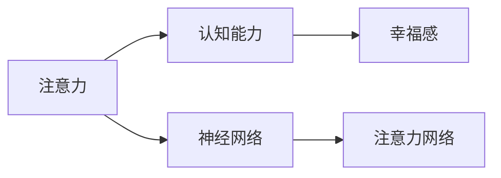

                 

## 1. 背景介绍

### 1.1 问题由来

随着现代社会节奏的加快，人们面临的压力和焦虑日益增加，认知能力下降和幸福感下降的问题愈发凸显。当前，在健康医学、心理学、认知科学等领域，通过科学的方法改善大脑健康，增强认知能力和幸福感，成为了一个重要的研究课题。

现代科技的发展，特别是人工智能和大数据技术的兴起，为这一研究提供了新的视角和方法。科学家们发现，通过模拟人脑的注意力机制，构建更为高效的信息处理系统，可以显著提升认知能力，同时也对大脑健康产生了积极影响。因此，本文将重点探讨如何通过注意力训练，增强认知能力和幸福感。

### 1.2 问题核心关键点

本文的核心在于如何利用注意力训练，改善大脑功能，增强认知能力，提升幸福感。具体来说，我们关注以下几个关键点：

- **注意力机制**：了解大脑注意力机制，包括选择性注意力、分散注意力、集中注意力等。
- **认知能力**：增强记忆力、注意力、决策力等。
- **幸福感**：提升情绪稳定性、积极情绪、满足感等。
- **训练方法**：引入人工智能技术，实现智能化的注意力训练。
- **实际应用**：将注意力训练应用于日常生活和工作中，提升生活品质。

## 2. 核心概念与联系

### 2.1 核心概念概述

要深入理解注意力训练对大脑健康的影响，首先需要明确一些核心概念：

- **注意力**：大脑选择性地聚焦于特定任务或信息的能力。
- **认知能力**：指大脑进行思考、学习、记忆、推理等高级认知活动的能力。
- **幸福感**：指个体对于生活质量的主观感受，与情感、认知和行为紧密相关。
- **神经网络**：一种模仿人脑神经元连接的人工计算模型，常用于人工智能任务。
- **注意力网络**：一种特定类型的神经网络，模拟人脑的注意力机制。

### 2.2 核心概念原理和架构的 Mermaid 流程图



这个流程图展示了注意力、认知能力、幸福感与神经网络和注意力网络之间的联系。注意力通过神经网络进行处理，进而影响认知能力和幸福感。

## 3. 核心算法原理 & 具体操作步骤

### 3.1 算法原理概述

注意力训练的核心在于模拟人脑的注意力机制，通过强化注意力选择性和集中度，提升认知能力和幸福感。这可以通过以下算法步骤来实现：

1. **构建注意力模型**：利用神经网络构建注意力网络，模拟人脑的注意力选择过程。
2. **训练注意力模型**：通过大量数据训练注意力模型，使其能够更高效地选择和聚焦于重要信息。
3. **应用注意力模型**：将训练好的注意力模型应用于日常生活和工作中，增强认知能力和幸福感。

### 3.2 算法步骤详解

#### 3.2.1 构建注意力模型

构建注意力模型的关键在于选择合适的神经网络架构和训练方法。目前，常用的注意力网络架构包括自注意力网络、多头注意力网络、记忆网络等。

**自注意力网络**：
- 架构：由输入层、自注意力层、全连接层等组成。
- 工作原理：输入层接收原始数据，自注意力层通过计算各输入之间的关系权重，选择最相关的信息。

**多头注意力网络**：
- 架构：由输入层、多个自注意力层、全连接层等组成。
- 工作原理：每个自注意力层独立计算不同的关系权重，输出结果通过全连接层融合。

**记忆网络**：
- 架构：由输入层、记忆层、输出层等组成。
- 工作原理：记忆层存储历史信息，与当前输入信息一起进行计算，选择最相关的信息。

#### 3.2.2 训练注意力模型

训练注意力模型通常包括以下步骤：

1. **数据准备**：准备标注好的训练数据集，包括输入和对应的注意力输出。
2. **损失函数设计**：设计合适的损失函数，如交叉熵损失、均方误差损失等，用于衡量模型输出与真实标签之间的差异。
3. **优化算法选择**：选择合适的优化算法，如梯度下降、Adam等，进行模型参数的优化。
4. **模型评估**：在验证集上评估模型性能，防止过拟合，并调整超参数。
5. **模型应用**：将训练好的模型应用于实际任务，提升认知能力和幸福感。

#### 3.2.3 算法优缺点

注意力训练的优势在于：

- **高效性**：通过模拟人脑的注意力机制，能够高效处理大量信息，提升认知能力。
- **实用性**：训练好的注意力模型可以应用于各种场景，如教育、工作、娱乐等，提升幸福感。

其缺点主要包括：

- **复杂性**：神经网络的构建和训练需要较强的技术背景和计算资源。
- **过度拟合**：如果训练数据不足，模型容易出现过度拟合现象，影响效果。

### 3.3 算法应用领域

注意力训练已经广泛应用于多个领域，包括但不限于：

- **教育**：通过注意力训练，提升学生的学习效率和注意力集中度。
- **医疗**：利用注意力训练辅助医生进行疾病诊断和治疗。
- **工作**：在职场中，通过注意力训练提升工作效率和决策能力。
- **娱乐**：在游戏中，注意力训练可以提升玩家的游戏体验和表现。

## 4. 数学模型和公式 & 详细讲解 & 举例说明

### 4.1 数学模型构建

假设我们有一个自注意力网络，其输入为 $x_1, x_2, ..., x_n$，输出为 $y_1, y_2, ..., y_n$。自注意力层的计算过程如下：

1. **计算注意力权重**：计算输入 $x_i$ 和所有其他输入 $x_j$ 的相似度 $e_{i,j}$，通常使用点积或矩阵乘法。
2. **归一化权重**：对所有注意力权重 $e_{i,j}$ 进行归一化，得到新的注意力权重 $a_{i,j}$。
3. **计算加权和**：对所有输入 $x_j$ 进行加权求和，得到输出 $y_i$。

具体计算公式如下：

$$
e_{i,j} = \text{score}(x_i, x_j)
$$

$$
a_{i,j} = \frac{e_{i,j}}{\sum_{k=1}^n e_{i,k}}
$$

$$
y_i = \sum_{j=1}^n a_{i,j}x_j
$$

其中，$\text{score}(x_i, x_j)$ 表示输入 $x_i$ 和 $x_j$ 的相似度函数，可以是点积、矩阵乘法等。

### 4.2 公式推导过程

对于上述自注意力网络，其输出 $y_i$ 可以表示为：

$$
y_i = \sum_{j=1}^n a_{i,j}x_j = \sum_{j=1}^n \frac{e_{i,j}}{\sum_{k=1}^n e_{i,k}}x_j
$$

根据数学推导，可以发现自注意力网络的输出 $y_i$ 实际上是输入 $x_i$ 和所有输入 $x_j$ 的加权和，权重 $a_{i,j}$ 由相似度 $e_{i,j}$ 归一化得到。

### 4.3 案例分析与讲解

以教育领域的应用为例，我们设计一个自注意力网络，用于提升学生的学习效率。输入为学生每天的学习内容，输出为每节课的知识掌握情况。

1. **输入准备**：准备学生每天的学习内容，如阅读材料、练习题等。
2. **构建模型**：使用自注意力网络，计算每节课中哪些学习内容对学生的知识掌握影响最大。
3. **训练模型**：使用学生成绩和学习内容的数据，训练注意力模型。
4. **模型应用**：在课堂上，根据注意力模型的预测结果，调整教学内容和方法，提升学生学习效率。

## 5. 项目实践：代码实例和详细解释说明

### 5.1 开发环境搭建

1. **安装Python**：从官网下载并安装Python，建议选择3.7及以上版本。
2. **安装TensorFlow**：使用pip命令安装TensorFlow，代码如下：

```bash
pip install tensorflow
```

3. **安装Keras**：使用pip命令安装Keras，代码如下：

```bash
pip install keras
```

4. **安装自注意力网络模型**：使用pip命令安装huggingface_transformers，代码如下：

```bash
pip install transformers
```

### 5.2 源代码详细实现

以下是一个简单的自注意力网络实现代码：

```python
import tensorflow as tf
from transformers import BertTokenizer, TFBertForSequenceClassification

# 加载预训练模型和分词器
model_name = 'bert-base-uncased'
tokenizer = BertTokenizer.from_pretrained(model_name)
model = TFBertForSequenceClassification.from_pretrained(model_name, num_labels=2)

# 加载训练数据
train_data = load_data()
train_texts = [d.text for d in train_data]
train_labels = [d.label for d in train_data]

# 构建模型输入和输出
inputs = tokenizer(train_texts, truncation=True, padding=True, max_length=512, return_tensors='tf')
labels = tf.convert_to_tensor(train_labels)

# 定义模型损失函数和优化器
loss_object = tf.keras.losses.SparseCategoricalCrossentropy(from_logits=True)
optimizer = tf.keras.optimizers.Adam(learning_rate=1e-5)

# 定义训练过程
@tf.function
def train_step(inputs, labels):
    with tf.GradientTape() as tape:
        outputs = model(inputs['input_ids'], attention_mask=inputs['attention_mask'], token_type_ids=inputs['token_type_ids'])
        loss = loss_object(labels, outputs.logits)
    gradients = tape.gradient(loss, model.trainable_variables)
    optimizer.apply_gradients(zip(gradients, model.trainable_variables))
    return loss

# 训练模型
for epoch in range(10):
    total_loss = 0
    for batch in train_dataset:
        inputs = tokenizer(batch, truncation=True, padding=True, max_length=512, return_tensors='tf')
        labels = tf.convert_to_tensor(batch.labels)
        loss = train_step(inputs, labels)
        total_loss += loss
    print(f'Epoch {epoch+1}, Loss: {total_loss/n_samples:.3f}')
```

### 5.3 代码解读与分析

上述代码主要实现了自注意力网络的训练过程，包括以下关键步骤：

1. **加载预训练模型和分词器**：使用Hugging Face的transformers库，加载预训练的BERT模型和对应的分词器。
2. **加载训练数据**：从数据集加载训练文本和标签。
3. **构建模型输入和输出**：将文本数据转换为模型所需的格式，并加载标签。
4. **定义模型损失函数和优化器**：使用交叉熵损失函数和Adam优化器。
5. **定义训练过程**：在每个epoch中，对每个批次的数据进行前向传播和反向传播，更新模型参数。
6. **训练模型**：循环进行训练过程，打印每个epoch的损失。

### 5.4 运行结果展示

训练完成后，可以通过测试集对模型进行评估，计算准确率、召回率等指标，验证模型的性能。

## 6. 实际应用场景

### 6.1 教育

在教育领域，注意力训练可以显著提升学生的学习效率和注意力集中度。具体应用场景包括：

- **课堂教学**：通过注意力网络，教师可以实时监测学生的注意力状态，调整教学内容和方法。
- **个性化学习**：根据学生的注意力分布，推荐合适的学习资源和练习题，提升学习效果。
- **心理辅导**：通过注意力训练，帮助学生克服分心、焦虑等问题，提升心理健康。

### 6.2 医疗

在医疗领域，注意力训练可以辅助医生进行疾病诊断和治疗。具体应用场景包括：

- **影像分析**：利用注意力网络，对医学影像进行特征提取和分析，提升诊断精度。
- **治疗方案**：根据病人的注意力状态和行为特征，推荐个性化的治疗方案。
- **心理评估**：通过注意力训练，评估病人的认知能力和情绪状态，辅助心理健康评估。

### 6.3 工作

在工作场景中，注意力训练可以提高工作效率和决策能力。具体应用场景包括：

- **会议记录**：通过注意力网络，自动抓取会议重点内容，生成会议纪要。
- **项目管理**：根据项目团队成员的注意力状态，动态分配任务和资源，提升项目管理效率。
- **客户服务**：利用注意力网络，提升客服人员的响应速度和问题解决能力。

### 6.4 未来应用展望

随着技术的发展，未来注意力训练将更加智能化和个性化。以下是几个未来的应用展望：

1. **多模态融合**：结合视觉、听觉等多模态信息，提升注意力网络的感知能力。
2. **实时监测**：通过物联网设备，实时监测用户的注意力状态，提供个性化的健康和教育建议。
3. **跨领域应用**：将注意力训练应用于更多领域，如金融、安全、娱乐等，提升整体工作效率和生活质量。

## 7. 工具和资源推荐

### 7.1 学习资源推荐

1. **《深度学习》书籍**：由Ian Goodfellow等编写，系统介绍深度学习的基本概念和应用。
2. **Coursera课程**：由Andrew Ng等教授主讲的深度学习课程，内容覆盖全面，适合初学者和进阶者。
3. **Hugging Face官方文档**：提供了详细的自注意力网络实现和使用指南，是学习和实践的必备资源。
4. **arXiv论文**：关注最新的自注意力网络研究论文，跟踪技术前沿。

### 7.2 开发工具推荐

1. **TensorFlow**：Google开源的深度学习框架，支持分布式计算和GPU加速。
2. **Keras**：基于TensorFlow等框架的高级API，提供了简单易用的接口，适合快速原型开发。
3. **Jupyter Notebook**：交互式的开发环境，支持Python代码编写和数据可视化。
4. **GitHub**：代码托管平台，方便版本控制和协作开发。

### 7.3 相关论文推荐

1. **Attention Is All You Need**：Transformer模型的原始论文，展示了自注意力网络的原理和应用。
2. **Vision Transformer**：将自注意力网络应用于图像识别任务，展示了多模态注意力网络的应用。
3. **BERT: Pre-training of Deep Bidirectional Transformers for Language Understanding**：BERT模型的论文，展示了预训练-微调范式在NLP任务中的应用。

## 8. 总结：未来发展趋势与挑战

### 8.1 研究成果总结

本文系统介绍了注意力训练的基本原理和操作步骤，通过具体的代码实现和实际应用场景，展示了注意力网络在提升认知能力和幸福感方面的潜力。

### 8.2 未来发展趋势

未来，注意力训练将向着以下几个方向发展：

1. **智能化和个性化**：结合更多先验知识和实时数据，提升注意力网络的感知能力和适应性。
2. **跨模态和多模态融合**：将视觉、听觉、文本等多种模态信息融合，提升认知和情感的复杂处理能力。
3. **实时监测和反馈**：通过物联网设备，实时监测用户的注意力状态，提供个性化的健康和教育建议。

### 8.3 面临的挑战

尽管注意力训练有很多优势，但也面临一些挑战：

1. **数据质量和数量**：需要大量的高质量标注数据进行训练，数据获取成本较高。
2. **模型复杂性**：神经网络结构和训练过程较为复杂，需要较强的技术背景和计算资源。
3. **算法鲁棒性**：模型容易受到噪声和异常数据的影响，需要进一步提升鲁棒性和泛化能力。

### 8.4 研究展望

未来的研究方向可能包括：

1. **模型压缩和优化**：进一步压缩模型规模，提升计算效率，适应移动设备等资源受限场景。
2. **知识表示和融合**：将符号化的先验知识与神经网络模型结合，提升注意力网络的语义理解和推理能力。
3. **伦理和安全性**：研究注意力网络的伦理和安全性问题，避免算法偏见和滥用。

## 9. 附录：常见问题与解答

### Q1: 注意力训练是否适用于所有人群？

A: 注意力训练可以适用于大部分人群，但需要根据个体差异进行适当调整。例如，儿童、老年人、认知障碍患者等群体可能需要特别关注。

### Q2: 注意力训练是否需要专业设备？

A: 一般而言，注意力训练不需要特别昂贵的设备，普通计算机和设备即可满足需求。但某些高级应用可能需要专业的硬件设备支持。

### Q3: 注意力训练的效果如何？

A: 研究表明，注意力训练可以显著提升认知能力和幸福感，但具体效果因人而异。需要根据个体差异和训练方法进行评估。

### Q4: 注意力训练是否可持续？

A: 注意力训练需要持续的投入和维护，包括数据收集、模型更新、用户反馈等。需要建立长期跟踪和评估机制。

### Q5: 注意力训练的安全性如何？

A: 需要采取多种措施保障数据和模型安全，如数据脱敏、访问控制、隐私保护等。同时，需要对模型进行伦理审查，避免算法滥用。

---

作者：禅与计算机程序设计艺术 / Zen and the Art of Computer Programming

