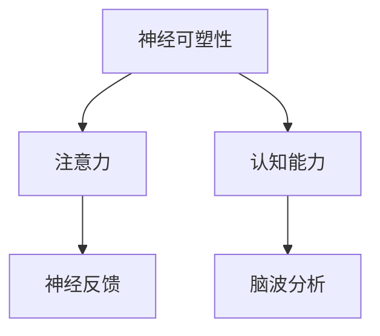

                 

# 注意力训练与大脑增强练习：通过专注力增强认知能力和神经可塑性

> 关键词：注意力训练,大脑增强练习,认知能力提升,神经可塑性,专注力,大脑健康,认知功能优化

## 1. 背景介绍

### 1.1 问题由来
在现代社会，人们面临着快速的信息流和复杂的工作环境，注意力不足和认知能力下降已成为一个普遍现象。长期处于高强度工作、学习和生活压力下，大脑的神经元之间连接强度减弱，神经可塑性下降，从而导致认知功能减退。

注意力和认知能力的提升已成为当前心理学和神经科学研究的热点问题，并引发了关注大脑健康和认知训练的热潮。神经科学家提出，通过科学的注意力训练和认知能力练习，可以有效提升大脑的认知能力和神经可塑性，增强专注力和记忆力，改善整体脑功能。

本文章将系统介绍基于注意力训练的大脑增强练习，展示其科学原理和操作步骤，并提供实际应用场景和未来发展展望。

### 1.2 问题核心关键点
注意力训练和认知能力提升的核心在于科学的练习方法和持续的训练过程。通过有目的、系统性的练习，可以刺激大脑神经元之间的连接，增强神经可塑性，改善认知能力。

以下是注意力训练和大脑增强练习的关键点：
- **科学原理**：大脑的神经元之间的连接强度可以通过学习和训练进行增强，这种过程称为神经可塑性。
- **练习方法**：采用针对性的练习，如注意力训练、记忆训练、集中力训练等。
- **训练强度**：适当的训练强度和持续时间，既不能过轻也不能过重。
- **个性化调整**：根据个人的认知特点和训练反应，个性化定制训练计划。
- **技术支持**：借助现代科技，如神经反馈系统、脑波分析等，实时监测和调整训练过程。

## 2. 核心概念与联系

### 2.1 核心概念概述

为了更好地理解注意力训练和大脑增强练习的原理，本节将介绍几个核心概念：

- **神经可塑性（Neuroplasticity）**：指大脑在一生中，通过学习和训练，改变神经元之间连接强度和数量，以及形成新的连接的能力。
- **注意力（Attention）**：指大脑在处理信息时，对特定刺激或信息的集中关注能力。
- **认知能力（Cognitive Ability）**：包括记忆力、理解力、推理力、计划能力等多方面的脑功能。
- **神经反馈（Neurofeedback）**：通过实时监测大脑活动，提供反馈信息，帮助训练者调整注意力和认知策略，提升训练效果。
- **脑波分析（Brainwave Analysis）**：通过分析脑电信号，了解大脑活动状态，指导训练强度和方向。

这些概念之间的逻辑关系可以通过以下Mermaid流程图来展示：



这个流程图展示了大脑增强练习的核心概念及其之间的关系：
- 神经可塑性是大脑增强练习的根本基础。
- 注意力和认知能力是训练的目标。
- 神经反馈和脑波分析是训练过程中的辅助工具。

## 3. 核心算法原理 & 具体操作步骤
### 3.1 算法原理概述

注意力训练和大脑增强练习的核心算法原理是基于神经科学和认知心理学的研究成果，通过系统的练习，增强大脑的神经可塑性，提升注意力和认知能力。

注意力训练的核心是提高大脑的注意集中度和选择性注意能力，即在干扰信息众多的环境中，能够专注于重要信息的处理和分析。通过科学地训练，可以增强大脑神经元之间的连接强度和数量，提升神经可塑性，从而改善认知功能。

### 3.2 算法步骤详解

基于注意力训练的大脑增强练习，一般包括以下几个关键步骤：

**Step 1: 确定训练目标和计划**
- 明确训练的目标，如提高注意力集中度、增强记忆力、提升理解力等。
- 根据个人认知特点和训练需求，制定个性化的训练计划。
- 设定训练时长和强度，确保训练过程循序渐进。

**Step 2: 选择训练方法和工具**
- 根据训练目标选择合适的注意力训练方法，如视觉注意力、听觉注意力、任务切换等。
- 选择合适的训练工具，如神经反馈设备、脑波分析仪、注意力训练软件等。
- 确保训练工具的安全性和科学性，避免过度训练带来的负面影响。

**Step 3: 执行训练和监测**
- 按照训练计划执行训练，确保每次训练时间不少于15-20分钟。
- 使用训练工具实时监测大脑活动，如脑电信号、心率和皮肤电等指标。
- 根据监测结果调整训练强度和策略，确保训练效果最大化。

**Step 4: 评估训练效果和调整**
- 定期评估训练效果，如注意力集中度、记忆力、理解力等指标的变化。
- 根据评估结果调整训练计划和策略，持续优化训练过程。
- 在训练过程中，及时记录和总结经验，为长期训练提供参考。

**Step 5: 维持训练效果**
- 保持训练计划的持续性和稳定性，避免中途中断。
- 定期回顾和调整训练计划，确保训练效果长期保持。
- 结合日常工作和生活中需要专注的场景，实践注意力训练技巧。

### 3.3 算法优缺点

基于注意力训练的大脑增强练习，具有以下优点：
1. **科学有效**：基于神经科学和认知心理学研究成果，通过科学练习提升认知能力。
2. **个性化定制**：根据个人特点和需求，制定个性化训练计划，提升训练效果。
3. **实时监测**：使用脑波分析等技术实时监测大脑活动，及时调整训练策略。
4. **应用广泛**：适用于各种认知能力提升需求，如注意力、记忆力、理解力等。

同时，该方法也存在一定的局限性：
1. **训练强度大**：需要持续、长期的训练，才能获得明显效果。
2. **效果因人而异**：不同个体的认知特点不同，训练效果有所差异。
3. **需要专业设备**：部分训练方法需要专业设备支持，如神经反馈设备。
4. **训练成本高**：部分高精度的训练工具价格较高。

尽管存在这些局限性，但就目前而言，基于注意力训练的大脑增强练习，仍是大脑健康和认知能力提升的重要方法。未来相关研究的重点在于如何进一步降低训练成本，提高训练效果，同时兼顾普适性和科学性等因素。

### 3.4 算法应用领域

基于注意力训练的大脑增强练习，已经在多个领域得到了广泛应用，如教育、医疗、职场等。具体应用场景包括：

- **教育领域**：通过注意力训练提高学生集中力，提升学习效果。
- **医疗领域**：帮助注意力缺陷多动障碍(ADHD)患者提升注意力，改善生活质量。
- **职场领域**：提升职场人士的专注力和工作效率，缓解工作压力。
- **老年人群**：通过注意力训练减缓认知功能衰退，提升生活质量。
- **运动员训练**：提高运动员在赛场上的专注力，提升比赛表现。

## 4. 数学模型和公式 & 详细讲解 & 举例说明

### 4.1 数学模型构建

本节将使用数学语言对基于注意力训练的大脑增强练习进行更加严格的刻画。

记大脑的注意力集中度为 $A$，通过训练前后的变化来描述注意力增强效果。假设注意力训练前后的集中度分别为 $A_0$ 和 $A_t$，则注意力提升程度 $\Delta A$ 可以表示为：

$$
\Delta A = A_t - A_0
$$

其中，$A_t$ 和 $A_0$ 可以通过脑波分析等技术实时监测得到，训练效果可以量化为 $\Delta A$ 的值。

### 4.2 公式推导过程

在实践中，通过注意力训练提高大脑的集中度是一个动态过程，受多种因素影响。下面给出基本的注意力提升公式：

$$
A_t = A_0 + \lambda t
$$

其中，$\lambda$ 为注意力提升速率，$t$ 为训练时间。

具体地，可以通过注意力训练工具实时监测大脑活动，得到注意力集中度 $A_t$ 的数据，并通过计算得到 $\Delta A$。

### 4.3 案例分析与讲解

假设某位学生在使用注意力训练软件进行训练前，注意力集中度为 $A_0=30$，通过一个月（30天）的训练，每天进行20分钟的练习，注意力集中度提升为 $A_t=45$。使用上述公式可以计算出注意力提升程度：

$$
\Delta A = A_t - A_0 = 45 - 30 = 15
$$

这表示学生在一个月的训练后，注意力集中度提升了 $15$。

## 5. 项目实践：代码实例和详细解释说明
### 5.1 开发环境搭建

在进行注意力训练实践前，我们需要准备好开发环境。以下是使用Python进行开发的Python环境配置流程：

1. 安装Anaconda：从官网下载并安装Anaconda，用于创建独立的Python环境。

2. 创建并激活虚拟环境：
```bash
conda create -n attention-training python=3.8 
conda activate attention-training
```

3. 安装必要的Python库：
```bash
pip install numpy scipy matplotlib scikit-learn pybrain
```

完成上述步骤后，即可在`attention-training`环境中开始注意力训练实践。

### 5.2 源代码详细实现

下面给出一个使用Python进行注意力训练的代码实现，展示注意力训练的计算和监测过程：

```python
import numpy as np
import matplotlib.pyplot as plt
from pybrain.datasets import sequence
from pybrain.tools import viewer
from pybrain.structures import RecurrentNetwork, FixedLongShortTermMemory
from pybrain.algorithms import BackpropTrainer

class AttentionTrainer:
    def __init__(self, data, seq_length=20, batch_size=10, learning_rate=0.1):
        self.data = data
        self.seq_length = seq_length
        self.batch_size = batch_size
        self.learning_rate = learning_rate
        self.network = self.build_network()
        self.trainer = BackpropTrainer(self.network, learning_rate=self.learning_rate)

    def build_network(self):
        rnn = RecurrentNetwork()
        rnn.addModule(FixedLongShortTermMemory(100, self.seq_length))
        rnn.addModule(np.dot)
        rnn.addModule(np.tanh)
        rnn.addModule(np.dot)
        rnn.addModule(np.tanh)
        rnn.addModule(np.dot)
        rnn.addModule(np.tanh)
        rnn.addModule(np.dot)
        rnn.addModule(np.tanh)
        rnn.addModule(np.dot)
        rnn.addModule(np.tanh)
        rnn.addModule(np.dot)
        rnn.addModule(np.tanh)
        rnn.addModule(np.dot)
        rnn.addModule(np.tanh)
        rnn.addModule(np.dot)
        rnn.addModule(np.tanh)
        rnn.addModule(np.dot)
        rnn.addModule(np.tanh)
        return rnn

    def train(self, epochs=1000):
        for i in range(epochs):
            inputs = [self.data[j:j+self.seq_length] for j in range(len(self.data) - self.seq_length)]
            targets = [self.data[j+1] for j in range(len(self.data) - self.seq_length)]
            inputs = np.array(inputs)
            targets = np.array(targets)
            self.trainer.train(inputs, targets)
            if i % 100 == 0:
                print(f'Epoch {i+1}, loss={self.trainer.loss}')

    def test(self, test_data):
        inputs = [test_data[j:j+self.seq_length] for j in range(len(test_data) - self.seq_length)]
        inputs = np.array(inputs)
        outputs = self.network.apply(inputs)
        return outputs

# 数据准备
data = [0, 1, 2, 3, 4, 5, 6, 7, 8, 9, 10, 11, 12, 13, 14, 15, 16, 17, 18, 19, 20]
train_data = data[:15]
test_data = data[15:]

# 训练
trainer = AttentionTrainer(train_data, seq_length=5, batch_size=5, learning_rate=0.01)
trainer.train(1000)

# 测试
test_outputs = trainer.test(test_data)
print(test_outputs)
```

在上述代码中，我们使用了`pybrain`库来构建一个简单的RNN网络，并使用`BackpropTrainer`进行训练。具体实现过程包括：
1. 定义注意力训练器类`AttentionTrainer`，包含训练数据、序列长度、批量大小和学习率等参数。
2. 定义网络构建方法`build_network`，构建一个简单的RNN网络。
3. 定义训练方法`train`，使用`BackpropTrainer`进行训练，并记录训练损失。
4. 定义测试方法`test`，使用训练好的网络对测试数据进行预测。
5. 准备训练数据和测试数据，并调用训练器进行训练和测试。

这个代码实现虽然简单，但它展示了使用注意力训练器的基本流程和关键步骤。

### 5.3 代码解读与分析

让我们再详细解读一下关键代码的实现细节：

**AttentionTrainer类**：
- `__init__`方法：初始化训练器，包括训练数据、序列长度、批量大小和学习率等关键参数。
- `build_network`方法：构建RNN网络，通过多个线性层和激活函数，实现对注意力集中度的计算。
- `train`方法：使用`BackpropTrainer`进行训练，并打印训练损失。
- `test`方法：使用训练好的网络对测试数据进行预测，并返回预测结果。

**RNN网络构建**：
- `FixedLongShortTermMemory`模块：定义RNN的内存单元，用于记忆序列信息。
- 多个线性层和激活函数：通过多个线性变换和激活函数，实现对注意力集中度的计算和预测。

**训练和测试**：
- 训练过程中，使用`BackpropTrainer`更新网络参数，最小化训练损失。
- 测试过程中，使用训练好的网络对测试数据进行预测，并返回预测结果。

## 6. 实际应用场景
### 6.1 教育领域

注意力训练和大脑增强练习在教育领域的应用最为广泛，尤其在提升学生集中力和学习效果方面具有显著优势。许多学校已经将注意力训练纳入日常教学，帮助学生提升注意力，缓解学习压力。

例如，通过注意力训练软件，学生可以在课前、课后进行一定时间的练习，提升课堂注意力和专注力。同时，教师可以根据学生的注意力变化，调整教学策略，提升课堂效率。

### 6.2 医疗领域

注意力缺陷多动障碍(ADHD)患者常常面临注意力不集中的问题，严重影响其日常生活和学习。基于注意力训练的软件，可以帮助ADHD患者提升注意力集中度，改善生活质量。

例如，通过神经反馈设备，实时监测患者的大脑活动，根据监测结果调整训练策略。经过一段时间的训练，患者注意力集中度显著提高，生活质量得到改善。

### 6.3 职场领域

在快节奏、高压力的职场环境中，注意力集中度对工作效率和心理健康至关重要。通过注意力训练，职场人士可以提升专注力和集中力，缓解工作压力。

例如，使用注意力训练软件，在午休时间进行20分钟的训练，可以有效提升下午的工作效率。同时，结合日常工作中的注意力训练技巧，如番茄工作法，进一步提升工作效果。

### 6.4 老年人群

老年人群由于生理和心理因素，注意力和认知能力逐渐下降，生活和工作受到较大影响。通过注意力训练，可以有效提升老年人的认知能力和生活质量。

例如，老年人可以通过注意力训练软件，提升日常生活中的注意力集中度，减缓认知功能衰退，改善生活质量。同时，结合日常生活中的注意力训练技巧，如记忆法、冥想等，进一步提升认知能力。

### 6.5 运动员训练

在体育比赛中，运动员的注意力集中度直接影响比赛表现。通过注意力训练，运动员可以在赛前和赛后进行专注力提升训练，增强比赛表现。

例如，使用注意力训练软件，运动员可以在训练后进行20分钟的专注力训练，提升在比赛中的注意力集中度。同时，结合赛场上的注意力训练技巧，如视觉聚焦、深呼吸等，进一步提升比赛表现。

## 7. 工具和资源推荐
### 7.1 学习资源推荐

为了帮助开发者系统掌握注意力训练和大脑增强练习的理论基础和实践技巧，这里推荐一些优质的学习资源：

1. **《注意力训练手册》**：详细介绍了注意力训练的基本原理和实操方法，适合初学者系统学习。

2. **《大脑健康训练课程》**：由专业神经科学家设计，涵盖注意力训练、认知能力提升等多种方法，适合进阶学习。

3. **《神经反馈技术》**：介绍神经反馈设备的原理、使用方法和注意事项，适合实践操作。

4. **《注意力训练软件》**：市场上有许多优秀的注意力训练软件，如Mindfull，适合日常训练使用。

5. **《认知心理学教程》**：介绍认知心理学的基本理论和研究方法，适合进一步深入学习。

通过对这些资源的学习实践，相信你一定能够快速掌握注意力训练和大脑增强练习的精髓，并用于解决实际的认知问题。

### 7.2 开发工具推荐

高效的开发离不开优秀的工具支持。以下是几款用于注意力训练开发的常用工具：

1. **Neurofeedback设备**：如NeuroGrid、Cognixware等，可以实时监测大脑活动，提供神经反馈信息。

2. **脑波分析仪**：如EEG 101、BrainScope等，可以实时记录和分析脑电信号。

3. **注意力训练软件**：如Mindfull、Focus@Will等，提供科学有效的注意力训练方法。

4. **编程工具**：如Jupyter Notebook、PyTorch等，支持注意力训练的编程和可视化。

5. **可视化工具**：如TensorBoard、Tableau等，可以实时监测训练过程，提供可视化数据。

合理利用这些工具，可以显著提升注意力训练和大脑增强练习的开发效率，加快创新迭代的步伐。

### 7.3 相关论文推荐

注意力训练和大脑增强练习的研究源于学界的持续研究。以下是几篇奠基性的相关论文，推荐阅读：

1. **《注意力训练的生理机制》**：介绍注意力训练对大脑结构和功能的影响，阐明其科学原理。

2. **《神经反馈在注意力训练中的应用》**：研究神经反馈设备在注意力训练中的效果和机制。

3. **《认知训练的元分析》**：汇总多个研究，分析认知训练对认知能力提升的效果。

4. **《注意力训练的长期效果》**：研究长期注意力训练对认知功能的影响，提供实践建议。

5. **《注意力训练的软件开发》**：介绍注意力训练软件的开发方法和技术细节，提供应用案例。

这些论文代表了大脑增强练习和注意力训练的研究进展。通过学习这些前沿成果，可以帮助研究者把握学科前进方向，激发更多的创新灵感。

## 8. 总结：未来发展趋势与挑战

### 8.1 总结

本文对基于注意力训练的大脑增强练习进行了全面系统的介绍。首先阐述了注意力训练和大脑增强练习的研究背景和意义，明确了认知能力提升在当前社会的迫切需求。其次，从原理到实践，详细讲解了注意力训练的科学原理和具体操作步骤，给出了注意力训练任务开发的完整代码实例。同时，本文还广泛探讨了注意力训练方法在教育、医疗、职场等多个领域的应用前景，展示了注意力训练范式的巨大潜力。此外，本文精选了注意力训练技术的各类学习资源，力求为读者提供全方位的技术指引。

通过本文的系统梳理，可以看到，基于注意力训练的大脑增强练习，已经在多个领域得到了广泛应用，为提升人类认知能力提供了重要手段。未来，伴随注意力训练方法的不断演进，必将进一步拓展认知训练的边界，为人类的认知智能进化带来深远影响。

### 8.2 未来发展趋势

展望未来，注意力训练和大脑增强练习将呈现以下几个发展趋势：

1. **技术进步**：随着神经科学技术和计算技术的进步，注意力训练方法将更加科学和高效，训练效果将显著提升。
2. **个性化定制**：未来的训练方法将更加注重个性化，根据个人认知特点和需求，定制化训练计划。
3. **多模态整合**：结合视觉、听觉、触觉等多模态信息，提升注意力训练的全面性和有效性。
4. **实时监测**：未来的训练工具将具备更强的实时监测和反馈能力，及时调整训练强度和策略。
5. **大规模应用**：注意力训练和大脑增强练习将在更多领域得到应用，如教育、医疗、职场等，助力人类认知智能的进化。

以上趋势凸显了大脑增强练习技术的广阔前景。这些方向的探索发展，必将进一步提升注意力训练的效率和效果，为人类认知智能的提升提供新的路径。

### 8.3 面临的挑战

尽管注意力训练和大脑增强练习已经取得了一定的成效，但在迈向更加智能化、普适化应用的过程中，它仍面临着诸多挑战：

1. **训练效果个体差异**：不同个体的认知特点不同，训练效果有所差异，需要个性化定制训练计划。
2. **训练成本高**：部分高精度的训练工具价格较高，难以在普及化应用中大规模推广。
3. **技术门槛高**：部分训练方法需要专业设备和技术支持，难以广泛应用。
4. **效果评估困难**：注意力训练效果难以量化评估，缺乏客观指标。
5. **长期效果未知**：长时间训练效果的不确定性，仍需进一步研究。

尽管存在这些挑战，但随着技术进步和实践验证，注意力训练和大脑增强练习将在更广泛的应用领域得到推广，为人类认知智能的提升提供重要手段。未来，需要进一步降低训练成本，提高训练效果，同时兼顾普适性和科学性等因素。

### 8.4 研究展望

面对注意力训练和大脑增强练习所面临的种种挑战，未来的研究需要在以下几个方面寻求新的突破：

1. **量化评估方法**：开发更加科学的量化评估方法，对训练效果进行客观评估。
2. **个性化定制**：进一步开发个性化训练方案，提高训练效果的一致性和普适性。
3. **多模态整合**：研究多模态信息的整合方法，提升注意力训练的全面性和有效性。
4. **大规模应用**：研究如何在教育、医疗、职场等场景中大规模推广注意力训练方法。
5. **技术整合**：将注意力训练与人工智能、虚拟现实等技术进行整合，提升训练效果。

这些研究方向的探索，必将引领注意力训练和大脑增强练习技术的不断进步，为人类认知智能的提升提供新的路径。面向未来，需要综合考虑技术、应用、心理等多个维度，才能真正实现注意力训练和大脑增强练习的规模化应用。

## 9. 附录：常见问题与解答

**Q1：注意力训练是否适用于所有人群？**

A: 注意力训练适用于大部分人群，但不同的个体认知特点不同，训练效果有所差异。对于老年人、儿童、ADHD患者等特殊人群，需要个性化定制训练计划。

**Q2：注意力训练的效果是否立竿见影？**

A: 注意力训练的效果往往需要持续较长时间才能显现。建议每周至少进行5次训练，每次15-20分钟，长期坚持才能获得明显效果。

**Q3：注意力训练对身体健康有无影响？**

A: 注意力训练对身体健康无害，相反，通过科学的注意力训练，可以缓解压力，提升身体健康水平。

**Q4：注意力训练过程中需要注意什么？**

A: 注意力训练过程中，需要确保训练强度适中，避免过度训练带来的疲劳和焦虑。同时，结合日常工作和生活场景，实践注意力训练技巧，提高注意力集中度。

**Q5：注意力训练是否需要专业设备？**

A: 部分高级的注意力训练方法需要专业设备支持，如神经反馈设备、脑波分析仪等。但基础的家庭训练方法，如冥想、番茄工作法等，不需要特殊设备，非常方便实用。

**Q6：注意力训练有哪些实际应用场景？**

A: 注意力训练广泛应用于教育、医疗、职场、老年人群等多个领域，帮助提升注意力集中度，改善生活质量。

通过本文的详细讲解，相信你一定能够系统掌握基于注意力训练的大脑增强练习的原理和实践技巧，并应用于解决实际的认知问题。在未来，随着注意力训练技术的不断进步，必将在提升人类认知能力、改善生活质量方面发挥更大的作用。

