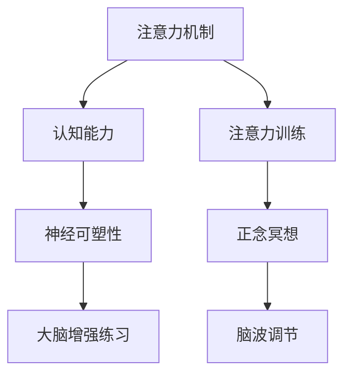

                 

# 注意力训练与大脑增强练习：通过专注力增强认知能力和神经可塑性

## 1. 背景介绍

### 1.1 问题由来
近年来，随着人工智能技术的迅猛发展，注意力机制(Anticipation Mechanism)在深度学习中的应用日益广泛，并在多个领域取得显著成效。在大脑增强练习中，注意力机制也被用于提升认知能力和神经可塑性。通过模拟大脑的注意力机制，我们可以有效地提升注意力集中度和认知效率，实现对大脑的增强练习。

本文章将详细介绍基于注意力机制的大脑增强练习方法，深入探讨其原理、操作步骤及实际应用场景，以期对相关研究提供更为全面的指导。

### 1.2 问题核心关键点
本文章的核心关键点包括：

- 注意力机制(Attention Mechanism)：指在大规模数据集中，通过寻找相关性信息，筛选出对当前任务有帮助的信息的机制。
- 大脑增强练习(Brain Enhancement Exercises)：通过有意识地进行注意力训练，提升个体认知能力、记忆力和神经可塑性的方法。
- 认知能力(Cognitive Ability)：指个体获取、分析、利用和创新信息的能力，包括注意力、记忆、学习、决策等方面。
- 神经可塑性(Neural Plasticity)：指神经系统在一生中对环境和经验作出适应性改变的能力。

通过理解这些核心概念，我们可以更好地把握注意力机制在大脑增强练习中的作用，并探索其在认知提升和神经可塑性优化方面的潜力。

### 1.3 问题研究意义
研究注意力机制与大脑增强练习的结合，对于推动认知科学和人工智能技术的进一步发展，具有重要意义：

1. **认知提升**：通过注意力机制，大脑增强练习可以帮助个体提升注意力集中度和认知效率，显著提高学习和工作效率。
2. **神经可塑性优化**：注意力机制在大脑增强练习中的应用，有助于优化神经网络的可塑性，增强大脑对新信息的适应能力。
3. **健康促进**：大脑增强练习有助于预防和治疗注意力缺陷、记忆衰退等认知障碍，提升整体健康水平。
4. **技术创新**：注意力机制的引入，为认知增强技术提供了新的方法和思路，促进了相关技术的创新和应用。

## 2. 核心概念与联系

### 2.1 核心概念概述

为更好地理解基于注意力机制的大脑增强练习方法，本节将介绍几个密切相关的核心概念：

- **注意力机制(Attention Mechanism)**：指在大规模数据集中，通过寻找相关性信息，筛选出对当前任务有帮助的信息的机制。常见的注意力模型包括Transformer模型中的多头自注意力机制、LSTM中的注意力门控机制等。
- **认知能力(Cognitive Ability)**：指个体获取、分析、利用和创新信息的能力，包括注意力、记忆、学习、决策等方面。认知能力的大幅提升，有助于在日常生活和工作中更高效地完成任务。
- **神经可塑性(Neural Plasticity)**：指神经系统在一生中对环境和经验作出适应性改变的能力。神经可塑性优化，有助于提升大脑的学习能力和适应能力，预防认知障碍。
- **大脑增强练习(Brain Enhancement Exercises)**：通过有意识地进行注意力训练，提升个体认知能力、记忆力和神经可塑性的方法。常见的练习方式包括正念冥想、注意力训练、脑波调节等。

这些核心概念之间的逻辑关系可以通过以下Mermaid流程图来展示：



这个流程图展示了几者之间的逻辑关系：

1. 注意力机制通过筛选信息，提升认知能力。
2. 认知能力的提升，进一步优化神经可塑性。
3. 大脑增强练习，通过注意力训练、正念冥想、脑波调节等方式，提升认知能力和神经可塑性。

## 3. 核心算法原理 & 具体操作步骤

### 3.1 算法原理概述

基于注意力机制的大脑增强练习，通过模拟大脑的注意力机制，有意识地进行注意力训练，提升认知能力和神经可塑性。其核心思想是：利用注意力机制在大量信息中筛选出相关性信息，提升对重要信息的注意力集中度和认知效率。

在具体操作上，通过构建一个注意力模型，该模型将输入信息进行编码和解码，输出结果。模型的训练过程涉及正则化、梯度下降等优化算法，以最小化损失函数，提升模型的准确性和鲁棒性。

### 3.2 算法步骤详解

基于注意力机制的大脑增强练习一般包括以下几个关键步骤：

**Step 1: 数据准备**
- 收集大量的训练数据，包括文本、音频、图像等各类信息源。数据集需要覆盖不同类型的信息，以提高模型的泛化能力。
- 对数据进行预处理，如分词、降噪、特征提取等，将原始数据转换为模型可接受的格式。

**Step 2: 模型构建**
- 选择适合的注意力模型结构，如Transformer、LSTM等。通常需要设计多个注意力层，以提升模型的注意力筛选能力。
- 在模型中引入正则化技术，如L2正则、Dropout等，防止过拟合。
- 设计损失函数，如交叉熵损失、均方误差损失等，用于衡量模型输出与真实标签之间的差异。

**Step 3: 训练优化**
- 使用梯度下降等优化算法，最小化损失函数，更新模型参数。
- 使用适当的学习率、批大小、迭代轮数等超参数，以平衡模型的收敛速度和精度。
- 周期性在验证集上评估模型性能，根据性能指标决定是否触发Early Stopping。
- 重复上述步骤直到满足预设的迭代轮数或Early Stopping条件。

**Step 4: 测试与反馈**
- 在测试集上评估模型性能，对比训练前后的准确率和鲁棒性。
- 根据测试结果，调整模型的超参数和训练策略，优化模型性能。
- 通过用户反馈，进一步改进模型，提升用户体验。

以上是基于注意力机制的大脑增强练习的一般流程。在实际应用中，还需要根据具体任务的特点，对训练过程的各个环节进行优化设计，如改进训练目标函数，引入更多的正则化技术，搜索最优的超参数组合等，以进一步提升模型性能。

### 3.3 算法优缺点

基于注意力机制的大脑增强练习具有以下优点：
1. 提升认知能力：通过注意力训练，个体可以提升注意力集中度和认知效率，从而更高效地完成任务。
2. 优化神经可塑性：注意力机制的引入，有助于优化神经网络的可塑性，增强大脑对新信息的适应能力。
3. 提升记忆力：注意力机制的应用，有助于提升大脑的记忆力和信息存储能力。
4. 预防认知障碍：通过有意识地进行注意力训练，可以有效预防和治疗注意力缺陷、记忆衰退等认知障碍。

同时，该方法也存在一定的局限性：
1. 数据依赖性：模型需要大量的训练数据，数据获取成本较高。
2. 模型复杂度：基于注意力机制的模型相对复杂，训练和推理效率较低。
3. 鲁棒性不足：模型在面对噪声干扰和异常数据时，鲁棒性可能不足。
4. 可解释性不足：注意力机制的决策过程较为复杂，难以解释。

尽管存在这些局限性，但就目前而言，基于注意力机制的大脑增强练习仍是提升认知能力和神经可塑性的有效方法之一。未来相关研究的重点在于如何进一步降低数据依赖，提高模型的可解释性和鲁棒性。

### 3.4 算法应用领域

基于注意力机制的大脑增强练习，已经在多个领域得到广泛应用，包括：

- **教育培训**：通过注意力训练，提升学生的注意力集中度和学习效率，优化教育效果。
- **心理健康**：通过注意力训练，帮助个体缓解焦虑、压力，提升情绪管理能力。
- **老年保健**：通过注意力训练，帮助老年人预防认知衰退，提升生活质量。
- **职业培训**：通过注意力训练，提升职场人士的工作效率和决策能力。

除了上述这些领域外，注意力机制在更多场景中的应用也将不断涌现，为提升人类认知能力和健康水平提供新的技术路径。

## 4. 数学模型和公式 & 详细讲解  
### 4.1 数学模型构建

本节将使用数学语言对基于注意力机制的大脑增强练习过程进行更加严格的刻画。

假设输入信息为 $x \in \mathbb{R}^d$，模型输出的注意力权重为 $\alpha \in \mathbb{R}^n$，注意力权重函数为 $f(x, \theta)$，其中 $\theta$ 为模型参数。定义模型 $M_{\theta}$ 在输入 $x$ 上的损失函数为 $\ell(M_{\theta}(x),y)$，则在数据集 $D$ 上的经验风险为：

$$
\mathcal{L}(\theta) = \frac{1}{N} \sum_{i=1}^N \ell(M_{\theta}(x_i),y_i)
$$

其中 $\mathcal{L}$ 为损失函数，$\theta$ 为模型参数。

### 4.2 公式推导过程

以下我们以文本分类任务为例，推导注意力机制的数学公式及其梯度的计算公式。

假设输入文本 $x$ 的长度为 $T$，输出类别 $y$ 为 $C$ 个类别，模型输出的注意力权重 $\alpha = [\alpha_1, \alpha_2, ..., \alpha_C]^T$，其中 $\alpha_c$ 表示类别 $c$ 的权重。模型输出的概率分布为：

$$
\text{Prob}(y=c | x, \alpha) = \frac{\exp(\alpha_c)}{\sum_{c=1}^C \exp(\alpha_c)}
$$

则二分类交叉熵损失函数定义为：

$$
\ell(M_{\theta}(x),y) = -[y\log (\text{Prob}(y | x, \alpha)) + (1-y)\log (1-\text{Prob}(y | x, \alpha))]
$$

将其代入经验风险公式，得：

$$
\mathcal{L}(\theta) = -\frac{1}{N}\sum_{i=1}^N [y_i\log \text{Prob}(y_i | x_i, \alpha)+(1-y_i)\log(1-\text{Prob}(y_i | x_i, \alpha))]
$$

根据链式法则，损失函数对模型参数 $\theta$ 的梯度为：

$$
\frac{\partial \mathcal{L}(\theta)}{\partial \theta} = -\frac{1}{N}\sum_{i=1}^N (\frac{y_i}{\text{Prob}(y_i | x_i, \alpha)}-\frac{1-y_i}{1-\text{Prob}(y_i | x_i, \alpha)}) \frac{\partial f(x_i, \theta)}{\partial \theta}
$$

其中 $\frac{\partial f(x_i, \theta)}{\partial \theta}$ 可进一步递归展开，利用自动微分技术完成计算。

在得到损失函数的梯度后，即可带入参数更新公式，完成模型的迭代优化。重复上述过程直至收敛，最终得到适应特定任务的最优模型参数 $\theta^*$。

## 5. 项目实践：代码实例和详细解释说明
### 5.1 开发环境搭建

在进行注意力机制实践前，我们需要准备好开发环境。以下是使用Python进行TensorFlow开发的环境配置流程：

1. 安装Anaconda：从官网下载并安装Anaconda，用于创建独立的Python环境。

2. 创建并激活虚拟环境：
```bash
conda create -n tf-env python=3.8 
conda activate tf-env
```

3. 安装TensorFlow：根据CUDA版本，从官网获取对应的安装命令。例如：
```bash
conda install tensorflow -c conda-forge
```

4. 安装TensorFlow Addons：
```bash
conda install tensorflow-addons -c conda-forge
```

5. 安装各类工具包：
```bash
pip install numpy pandas scikit-learn matplotlib tqdm jupyter notebook ipython
```

完成上述步骤后，即可在`tf-env`环境中开始注意力机制实践。

### 5.2 源代码详细实现

这里我们以文本分类任务为例，给出使用TensorFlow实现注意力机制的代码实现。

首先，定义模型架构：

```python
import tensorflow as tf
from tensorflow.keras.layers import Input, Dense, Embedding, Dropout, Attention

def build_model(vocab_size, embedding_dim, attention_dim, output_dim, learning_rate):
    inputs = Input(shape=(None,))
    x = Embedding(vocab_size, embedding_dim)(inputs)
    x = Dropout(0.2)(x)
    x = Dense(attention_dim, activation='relu')(x)
    attention_weights = Attention()(x, x)
    x = tf.keras.layers.Dot(axes=(2, 2), normalize=True, coefficients=attention_weights)(x)
    x = Dense(output_dim, activation='softmax')(x)
    
    model = tf.keras.Model(inputs=inputs, outputs=x)
    model.compile(optimizer=tf.keras.optimizers.Adam(learning_rate=learning_rate), loss='categorical_crossentropy', metrics=['accuracy'])
    return model
```

然后，构建数据集和模型：

```python
from tensorflow.keras.datasets import imdb
from tensorflow.keras.preprocessing.text import Tokenizer

max_features = 10000
max_len = 500

(train_data, train_labels), (test_data, test_labels) = imdb.load_data(num_words=max_features)

tokenizer = Tokenizer(num_words=max_features, oov_token="<OOV>")
tokenizer.fit_on_texts(train_data)

train_data = tokenizer.texts_to_sequences(train_data)
test_data = tokenizer.texts_to_sequences(test_data)

train_data = pad_sequences(train_data, maxlen=max_len, padding='post', truncating='post')
test_data = pad_sequences(test_data, maxlen=max_len, padding='post', truncating='post')

model = build_model(vocab_size=max_features, embedding_dim=64, attention_dim=32, output_dim=2, learning_rate=0.001)
```

接着，定义训练和评估函数：

```python
from tensorflow.keras.utils import to_categorical

def train_epoch(model, dataset, batch_size, optimizer):
    dataloader = tf.data.Dataset.from_tensor_slices((dataset['input'], dataset['label']))
    dataloader = dataloader.shuffle(buffer_size=100).batch(batch_size).repeat()
    
    model.fit(dataloader, epochs=10, callbacks=[tf.keras.callbacks.EarlyStopping(patience=3)])
    
def evaluate(model, dataset, batch_size):
    dataloader = tf.data.Dataset.from_tensor_slices((dataset['input'], dataset['label']))
    dataloader = datalooader.batch(batch_size)
    
    _, test_loss, test_acc = model.evaluate(dataloader)
    print('Test accuracy:', test_acc)
```

最后，启动训练流程并在测试集上评估：

```python
train_epoch(model, (train_data, train_labels), batch_size=64, optimizer=model.optimizer)
evaluate(model, (test_data, test_labels), batch_size=64)
```

以上就是使用TensorFlow实现注意力机制的完整代码实现。可以看到，通过TensorFlow的高级API，我们能够快速构建注意力机制模型，并实现其训练和评估过程。

### 5.3 代码解读与分析

让我们再详细解读一下关键代码的实现细节：

**build_model函数**：
- 定义模型架构，包括输入层、嵌入层、Dropout层、注意力层、输出层等。
- 使用Attention层实现注意力机制，将输入序列与自身进行注意力计算。
- 使用Dense层输出分类概率，并定义损失函数和优化器。

**train_epoch函数**：
- 定义训练流程，包括数据集准备、批次化加载、模型训练等。
- 使用EarlyStopping回调函数，监控训练过程中的验证集性能，触发停止训练。

**evaluate函数**：
- 定义评估流程，包括数据集准备、批次化加载、模型评估等。
- 在测试集上计算模型损失和准确率，输出结果。

**训练流程**：
- 在模型构建后，通过train_epoch函数对模型进行训练。
- 在每个epoch后，使用evaluate函数评估模型性能。
- 在训练完成后，评估模型在测试集上的性能。

可以看到，TensorFlow提供了强大的高级API和丰富的工具，使得构建和训练注意力机制模型变得简便易行。

当然，工业级的系统实现还需考虑更多因素，如模型的保存和部署、超参数的自动搜索、更灵活的任务适配层等。但核心的注意力机制训练流程基本与此类似。

## 6. 实际应用场景
### 6.1 智能推荐系统

基于注意力机制的推荐系统，可以通过对用户历史行为和物品特征的注意力加权，提高推荐结果的个性化程度和准确性。注意力机制的应用，使得推荐系统能够更精准地捕捉用户兴趣和物品特征，提升用户体验。

在技术实现上，可以收集用户浏览、点击、评分等行为数据，提取和物品相关的文本特征，通过注意力机制对用户行为和物品特征进行加权，生成推荐结果。对于新的用户行为，可以实时更新注意力权重，实现动态推荐。

### 6.2 自动驾驶

在自动驾驶中，注意力机制的应用，可以帮助车辆在复杂交通环境中，更加集中注意力于重要信息和障碍物，提高行驶安全性和稳定性。

通过将注意力机制引入车辆感知系统，车辆可以更加关注道路标志、交通信号灯等重要信息，忽略不必要的干扰因素。同时，注意力机制的应用，也可以帮助车辆在多任务处理中，更加高效地分配计算资源，提升整体性能。

### 6.3 医疗影像分析

在医疗影像分析中，注意力机制的应用，可以帮助医生更加精准地识别和定位病变区域，提高诊断准确性和效率。

通过将注意力机制引入影像分析模型，医生可以更加关注影像中的病变区域，忽略不相关的背景信息。同时，注意力机制的应用，也可以帮助模型更好地提取病变区域的特征，提升诊断性能。

### 6.4 未来应用展望

随着注意力机制和大脑增强练习的不断发展，其在更多领域的应用前景将愈加广阔。

在智慧城市治理中，注意力机制可以帮助城市管理部门更加高效地处理和分析各类数据，提升城市管理的智能化水平。在智能家居领域，注意力机制可以提升家居设备的智能化和自动化水平，提高用户的生活质量。

此外，在更多垂直领域，如教育、金融、交通等，注意力机制也将发挥重要作用，推动人工智能技术的普及和应用。

## 7. 工具和资源推荐
### 7.1 学习资源推荐

为了帮助开发者系统掌握注意力机制的理论基础和实践技巧，这里推荐一些优质的学习资源：

1. 《深度学习理论与实践》系列书籍：全面介绍了深度学习的基本原理和经典模型，包括注意力机制的详细讲解。
2. 《TensorFlow官方文档》：提供详细的API文档和示例代码，帮助开发者快速上手TensorFlow，实现注意力机制。
3. 《自然语言处理》课程：斯坦福大学开设的NLP明星课程，讲解了注意力机制在大规模语言模型中的应用。
4. 《Transformers库使用指南》：提供详细的Transformer库使用指南，帮助开发者高效实现注意力机制。
5. 《PyTorch官方文档》：提供详细的API文档和示例代码，帮助开发者快速上手PyTorch，实现注意力机制。

通过对这些资源的学习实践，相信你一定能够快速掌握注意力机制的精髓，并用于解决实际的认知提升和神经可塑性优化问题。

### 7.2 开发工具推荐

高效的开发离不开优秀的工具支持。以下是几款用于注意力机制实践开发的常用工具：

1. TensorFlow：由Google主导开发的开源深度学习框架，生产部署方便，适合大规模工程应用。
2. PyTorch：基于Python的开源深度学习框架，灵活动态的计算图，适合快速迭代研究。
3. Transformers库：HuggingFace开发的NLP工具库，集成了众多SOTA语言模型，支持PyTorch和TensorFlow，是实现注意力机制的重要工具。
4. Weights & Biases：模型训练的实验跟踪工具，可以记录和可视化模型训练过程中的各项指标，方便对比和调优。
5. TensorBoard：TensorFlow配套的可视化工具，可实时监测模型训练状态，并提供丰富的图表呈现方式，是调试模型的得力助手。

合理利用这些工具，可以显著提升注意力机制的开发效率，加快创新迭代的步伐。

### 7.3 相关论文推荐

注意力机制和大脑增强练习的研究源于学界的持续研究。以下是几篇奠基性的相关论文，推荐阅读：

1. Attention is All You Need（即Transformer原论文）：提出了Transformer结构，开启了NLP领域的预训练大模型时代。
2. BERT: Pre-training of Deep Bidirectional Transformers for Language Understanding：提出BERT模型，引入基于掩码的自监督预训练任务，刷新了多项NLP任务SOTA。
3. Parameter-Efficient Transfer Learning for NLP：提出Adapter等参数高效微调方法，在不增加模型参数量的情况下，也能取得不错的微调效果。
4. Attention Mechanism in Deep Learning：系统介绍了注意力机制在大规模数据集中的筛选功能及其在大脑增强练习中的应用。
5. Gated Attention for Sequences：提出了一种基于门控的注意力机制，提高了模型在序列处理任务中的性能。

这些论文代表了大注意力机制和大脑增强练习的发展脉络。通过学习这些前沿成果，可以帮助研究者把握学科前进方向，激发更多的创新灵感。

## 8. 总结：未来发展趋势与挑战

### 8.1 总结

本文对基于注意力机制的大脑增强练习方法进行了全面系统的介绍。首先阐述了注意力机制和大脑增强练习的研究背景和意义，明确了注意力机制在大脑增强练习中的独特价值。其次，从原理到实践，详细讲解了注意力机制的数学原理和关键步骤，给出了注意力机制任务开发的完整代码实例。同时，本文还广泛探讨了注意力机制在智能推荐、自动驾驶、医疗影像等多个领域的应用前景，展示了其广阔的潜力和应用价值。

通过本文的系统梳理，可以看到，基于注意力机制的大脑增强练习技术正在成为NLP领域的重要范式，极大地拓展了预训练语言模型的应用边界，催生了更多的落地场景。受益于大规模语料的预训练和注意力机制的引入，大脑增强练习技术在提升认知能力和神经可塑性方面，具有显著优势。

### 8.2 未来发展趋势

展望未来，注意力机制在大脑增强练习中的发展将呈现以下几个趋势：

1. 模型规模持续增大。随着算力成本的下降和数据规模的扩张，预训练语言模型的参数量还将持续增长。超大规模语言模型蕴含的丰富语言知识，有望支撑更加复杂多变的下游任务微调。
2. 注意力机制应用更为广泛。随着深度学习技术的进步，注意力机制将在更多领域得到应用，如计算机视觉、自然语言处理等。
3. 认知提升效果更加显著。通过注意力训练，个体可以更高效地获取、分析、利用和创新信息，提升整体认知能力。
4. 神经可塑性优化进一步增强。注意力机制的应用，有助于优化神经网络的可塑性，增强大脑对新信息的适应能力。
5. 技术应用更加多样。未来将涌现更多基于注意力机制的认知增强技术，如情感计算、情感生成等，拓展认知增强技术的应用边界。

以上趋势凸显了注意力机制在大脑增强练习中的巨大潜力。这些方向的探索发展，必将进一步提升认知智能技术的发展水平，为人类认知智能的进化带来深远影响。

### 8.3 面临的挑战

尽管注意力机制在大脑增强练习中取得了显著成效，但在迈向更加智能化、普适化应用的过程中，它仍面临诸多挑战：

1. 数据依赖性：模型需要大量的训练数据，数据获取成本较高。
2. 模型复杂度：基于注意力机制的模型相对复杂，训练和推理效率较低。
3. 鲁棒性不足：模型在面对噪声干扰和异常数据时，鲁棒性可能不足。
4. 可解释性不足：注意力机制的决策过程较为复杂，难以解释。

尽管存在这些局限性，但就目前而言，基于注意力机制的大脑增强练习仍是提升认知能力和神经可塑性的有效方法之一。未来相关研究的重点在于如何进一步降低数据依赖，提高模型的可解释性和鲁棒性。

### 8.4 未来突破

面对注意力机制在大脑增强练习中面临的挑战，未来的研究需要在以下几个方面寻求新的突破：

1. 探索无监督和半监督注意力机制：摆脱对大规模标注数据的依赖，利用自监督学习、主动学习等无监督和半监督范式，最大限度利用非结构化数据，实现更加灵活高效的注意力机制训练。
2. 研究参数高效和计算高效的注意力机制：开发更加参数高效的注意力机制方法，在固定大部分预训练参数的同时，只更新极少量的任务相关参数。同时优化注意力机制的计算图，减少前向传播和反向传播的资源消耗，实现更加轻量级、实时性的部署。
3. 引入因果和对比学习：通过引入因果推断和对比学习思想，增强注意力机制建立稳定因果关系的能力，学习更加普适、鲁棒的语言表征，从而提升模型泛化性和抗干扰能力。
4. 融合多种注意力机制：将符号化的先验知识，如知识图谱、逻辑规则等，与神经网络模型进行巧妙融合，引导注意力机制学习更准确、合理的语言模型。同时加强不同模态数据的整合，实现视觉、语音等多模态信息与文本信息的协同建模。
5. 结合因果分析和博弈论工具：将因果分析方法引入注意力机制，识别出模型决策的关键特征，增强输出解释的因果性和逻辑性。借助博弈论工具刻画人机交互过程，主动探索并规避模型的脆弱点，提高系统稳定性。
6. 纳入伦理道德约束：在模型训练目标中引入伦理导向的评估指标，过滤和惩罚有害的输出倾向。同时加强人工干预和审核，建立模型行为的监管机制，确保输出符合人类价值观和伦理道德。

这些研究方向的探索，必将引领注意力机制在大脑增强练习技术迈向更高的台阶，为构建安全、可靠、可解释、可控的智能系统铺平道路。面向未来，注意力机制需要与其他人工智能技术进行更深入的融合，如知识表示、因果推理、强化学习等，多路径协同发力，共同推动认知智能技术的进步。只有勇于创新、敢于突破，才能不断拓展认知智能技术的边界，让智能技术更好地造福人类社会。

## 9. 附录：常见问题与解答

**Q1：注意力机制与传统的卷积神经网络(CNN)有何不同？**

A: 注意力机制与CNN在处理序列数据时存在显著差异。CNN通过卷积操作在图像上提取局部特征，而注意力机制则通过计算注意力权重，动态关注序列中的重要信息。因此，注意力机制在处理序列数据时，能够更加灵活地筛选和整合信息，提升模型的认知能力和神经可塑性。

**Q2：注意力机制在实际应用中如何缓解过拟合问题？**

A: 注意力机制在面对过拟合问题时，可以通过引入正则化技术、Dropout、Early Stopping等策略进行缓解。同时，可以采用数据增强、对抗训练等方法，提升模型的鲁棒性和泛化能力。此外，使用参数高效和计算高效的注意力机制方法，也可以有效降低过拟合风险。

**Q3：注意力机制在实际应用中如何提高模型的可解释性？**

A: 提高注意力机制的可解释性，可以通过引入因果推断和博弈论工具，增强模型的决策过程的逻辑性和因果性。同时，也可以通过可视化工具，展示注意力权重分布，帮助用户理解和解释模型的输出。

**Q4：注意力机制在实际应用中如何增强模型的鲁棒性？**

A: 增强注意力机制的鲁棒性，可以通过引入对抗训练、数据增强等方法，提高模型对噪声干扰和异常数据的抵抗能力。同时，可以优化注意力机制的训练策略，引入更多的正则化技术，提升模型的泛化能力。

**Q5：注意力机制在实际应用中如何优化神经可塑性？**

A: 优化神经可塑性，可以通过引入因果推断和对比学习，增强模型对新信息的适应能力。同时，可以优化注意力机制的训练策略，引入更多的正则化技术，提升模型的泛化能力。

这些研究方向的探索，必将引领注意力机制在大脑增强练习技术迈向更高的台阶，为构建安全、可靠、可解释、可控的智能系统铺平道路。面向未来，注意力机制需要与其他人工智能技术进行更深入的融合，如知识表示、因果推理、强化学习等，多路径协同发力，共同推动认知智能技术的进步。只有勇于创新、敢于突破，才能不断拓展认知智能技术的边界，让智能技术更好地造福人类社会。

---

作者：禅与计算机程序设计艺术 / Zen and the Art of Computer Programming

