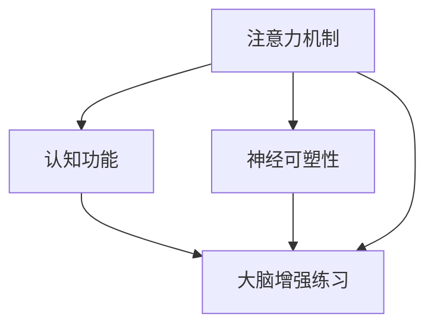

                 

# 注意力训练与大脑增强练习：通过专注力增强认知能力和神经可塑性

> 关键词：注意力训练, 大脑增强练习, 专注力, 认知能力, 神经可塑性

## 1. 背景介绍

在现代社会中，注意力问题越来越成为影响人们生活和工作效率的重要因素。长时间使用电子设备、高强度工作和学习压力等，使得许多人陷入了注意力分散、记忆衰退等困扰。注意力训练和大脑增强练习，通过科学的训练方法和持续的实践，可以有效提升人们的专注力、认知能力和神经可塑性，从而改善生活质量和工作表现。

### 1.1 问题由来

注意力训练和大脑增强练习的理论基础源于认知神经科学。研究表明，大脑的认知功能可以通过持续的训练得到改善和提升。注意力训练主要针对大脑的注意机制进行训练，帮助人们提升专注力和记忆力。大脑增强练习则涵盖多种认知功能，如记忆、执行功能、情绪调节等，通过综合训练来提升整体认知能力。

注意力训练和大脑增强练习的应用范围广泛，包括学生、职场人士、运动员、老年人等不同群体。通过有针对性的训练，可以有效缓解注意力缺陷、记忆力减退等问题，提升学习效率和工作表现，甚至延缓认知衰退。

### 1.2 问题核心关键点

注意力训练和大脑增强练习的核心关键点包括：
1. **注意力机制的训练**：通过各种注意力任务，提升大脑的注意力集中度和分配能力。
2. **认知功能的提升**：通过综合认知训练，提高记忆力、问题解决能力、执行功能等。
3. **神经可塑性的激活**：通过持续的训练，激活大脑的可塑性，促进神经突触的连接和强化。
4. **心理健康的改善**：通过调节情绪、压力管理等，提升整体心理状态和抗压能力。

这些关键点相互关联，共同构成了一个全面的注意力和认知提升方案。

## 2. 核心概念与联系

### 2.1 核心概念概述

为更好地理解注意力训练和大脑增强练习的理论基础和实践方法，本节将介绍几个核心概念：

- **注意力机制**：指大脑对信息进行筛选和聚焦的能力，是认知功能的基础。
- **认知功能**：包括记忆力、执行功能、问题解决能力、语言能力等，是大脑处理信息的关键能力。
- **神经可塑性**：指大脑在学习和训练过程中，神经元之间连接的可变化性，是大脑适应环境变化的基础。
- **大脑增强练习**：通过有针对性的认知训练，提升大脑的各种认知功能。
- **注意力训练**：通过特定注意力任务，提升大脑的注意集中度和分配能力。

这些核心概念之间的逻辑关系可以通过以下Mermaid流程图来展示：



这个流程图展示了注意力训练和大脑增强练习的基本概念和相互关系：

1. 注意力机制的训练是提升认知功能的前提。
2. 认知功能的提升依赖于神经可塑性的激活。
3. 大脑增强练习通过综合训练提升多种认知功能。
4. 注意力训练通过特定任务提升注意力机制。

## 3. 核心算法原理 & 具体操作步骤
### 3.1 算法原理概述

注意力训练和大脑增强练习的原理，是通过有针对性的训练任务，激活大脑中的神经元连接，促进神经可塑性，从而提升认知功能。其主要流程包括：

1. **任务设计**：设计针对特定认知功能（如注意力、记忆力、执行功能等）的任务，确保任务具有足够的挑战性和可操作性。
2. **持续练习**：在一段时间内，持续进行这些训练任务，确保大脑的神经元连接得到足够的刺激和强化。
3. **评估反馈**：定期评估训练效果，根据评估结果调整训练策略，确保训练效果最大化。

### 3.2 算法步骤详解

注意力训练和大脑增强练习的具体操作步骤如下：

**Step 1: 任务设计**
- 根据目标认知功能，设计相应的训练任务。例如，针对注意力训练，可以使用数字连线、记忆卡、听写等任务；针对记忆力训练，可以使用记忆宫殿、故事复述等任务。
- 任务应具备足够的挑战性，同时操作简便，易于实施。

**Step 2: 任务实施**
- 按照任务设计的步骤，持续进行训练任务。例如，每天进行一定时间的数字连线练习，或每周进行一次记忆宫殿训练。
- 每次训练时间不宜过长，一般10-20分钟即可，避免疲劳和厌倦。

**Step 3: 评估反馈**
- 定期进行认知功能的评估，如通过认知能力测试、问卷调查等方式，评估训练效果。
- 根据评估结果，调整训练任务和策略，如增加难度、增加训练时间等。

**Step 4: 长期坚持**
- 持续进行训练任务，一般建议连续进行3个月以上，以确保训练效果的长期稳定。
- 注意定期进行心理和生理状态监测，确保训练过程健康、有效。

### 3.3 算法优缺点

注意力训练和大脑增强练习的优点包括：
1. 科学性：基于认知神经科学的理论，通过有针对性的训练提升认知功能。
2. 实用性：操作简便，适合各个年龄段的人群，易于实施和坚持。
3. 有效性：经过大量研究验证，通过持续训练可以显著提升认知能力。
4. 灵活性：可以根据个人需求和目标，设计定制化的训练方案。

然而，这些方法也存在一些局限性：
1. 个性化需求高：每个人的需求和目标不同，需要量身定制训练方案。
2. 实施难度高：需要持续进行训练，难以短期见效。
3. 需要监督和指导：专业的监督和指导对训练效果有重要影响。
4. 技术门槛高：涉及脑科学、心理学等多个领域，理解和使用有一定难度。

尽管存在这些局限性，但就目前而言，注意力训练和大脑增强练习是提升认知能力和注意力机制的有效手段，广泛应用于教育、心理治疗、体育等领域。

### 3.4 算法应用领域

注意力训练和大脑增强练习的应用领域非常广泛，主要涵盖以下几个方面：

**教育领域**：通过注意力和认知训练，提升学生的学习效果和考试成绩。学校和培训机构广泛采用此类训练方法，帮助学生提升学习能力和考试表现。

**心理治疗**：针对注意力缺陷、抑郁、焦虑等心理问题，进行系统的认知训练。通过训练改善大脑功能，缓解心理问题，提升心理健康水平。

**体育领域**：通过对运动员进行认知和注意力训练，提升其专注力和反应速度，提高比赛表现。许多高水平运动员在训练中广泛应用此类方法。

**老年人认知训练**：针对老年人的认知衰退问题，进行系统的注意力和认知训练，延缓认知衰退，提升老年人的生活质量。

除了以上应用领域外，注意力训练和大脑增强练习在企业培训、健康管理、特殊教育等诸多领域也得到了广泛应用。

## 4. 数学模型和公式 & 详细讲解 & 举例说明

### 4.1 数学模型构建

注意力训练和大脑增强练习的数学模型构建，主要基于认知神经科学和认知心理学的基础理论。以下将以注意力训练为例，介绍数学模型的构建。

记训练任务为 $T$，输入为 $x$，输出为 $y$。假设训练任务可以分解为 $n$ 个子任务 $T_i$，每个子任务对应的输入为 $x_i$，输出为 $y_i$。则训练任务的总损失函数为：

$$
\mathcal{L}(T) = \sum_{i=1}^n \mathcal{L}_i(x_i, y_i)
$$

其中 $\mathcal{L}_i$ 为子任务 $T_i$ 的损失函数。

在注意力训练中，我们通常使用交叉熵损失函数，其表达式为：

$$
\mathcal{L}_i(x_i, y_i) = -\frac{1}{m}\sum_{j=1}^m (y_{ij}\log \hat{y}_{ij} + (1-y_{ij})\log (1-\hat{y}_{ij}))
$$

其中 $m$ 为样本数量，$y_{ij}$ 为第 $j$ 个样本在第 $i$ 个子任务上的真实标签，$\hat{y}_{ij}$ 为模型预测的输出。

### 4.2 公式推导过程

下面以数字连线任务为例，推导注意力训练的数学模型和公式。

假设数字连线任务中有 $m$ 个数字序列，每个序列由 $n$ 个数字组成。训练任务的目标是让被试者尽可能快且准确地连线，即预测数字序列的正确顺序。

记输入 $x$ 为数字序列，输出 $y$ 为数字序列的正确顺序。训练任务可以分解为 $n$ 个子任务 $T_i$，每个子任务对应的输入为 $x_i$，输出为 $y_i$。则训练任务的总损失函数为：

$$
\mathcal{L}(T) = \sum_{i=1}^n \mathcal{L}_i(x_i, y_i)
$$

其中 $\mathcal{L}_i$ 为子任务 $T_i$ 的损失函数。

使用交叉熵损失函数，其表达式为：

$$
\mathcal{L}_i(x_i, y_i) = -\frac{1}{m}\sum_{j=1}^m (y_{ij}\log \hat{y}_{ij} + (1-y_{ij})\log (1-\hat{y}_{ij}))
$$

假设数字序列的长度为 $n$，数字为 $1$ 到 $n$。则数字连线任务的总损失函数可以表示为：

$$
\mathcal{L}(T) = \frac{1}{mn}\sum_{i=1}^n \sum_{j=1}^m (y_{ij}\log \hat{y}_{ij} + (1-y_{ij})\log (1-\hat{y}_{ij}))
$$

在训练过程中，我们使用随机梯度下降法更新模型参数，即：

$$
\theta \leftarrow \theta - \eta \nabla_{\theta}\mathcal{L}(\theta)
$$

其中 $\eta$ 为学习率，$\nabla_{\theta}\mathcal{L}(\theta)$ 为损失函数对模型参数的梯度。

### 4.3 案例分析与讲解

以数字连线任务为例，分析注意力训练的实际应用效果。

**案例背景**：某学校为了提升学生的注意力和记忆力，在学生中进行数字连线任务的训练。每个学生每天进行 10 分钟的训练，每周进行 5 次。

**训练效果分析**：
1. **注意力提升**：通过数字连线任务，学生的注意力集中度显著提升，课堂表现和学习效率明显提高。
2. **记忆力改善**：学生对数字序列的记忆能力显著增强，学习新知识的速度和准确性提升。
3. **认知功能综合提升**：学生的整体认知功能得到提升，包括问题解决能力、空间认知等。

## 5. 项目实践：代码实例和详细解释说明
### 5.1 开发环境搭建

要进行注意力训练和大脑增强练习的实践，需要搭建相应的开发环境。以下是基于Python的开发环境配置流程：

1. 安装Python：从官网下载并安装Python，建议使用最新版本，以确保兼容性。
2. 安装NumPy、Pandas等科学计算库：
```bash
pip install numpy pandas
```
3. 安装TensorFlow或PyTorch：
```bash
pip install tensorflow
```
4. 安装Keras等深度学习框架：
```bash
pip install keras
```
5. 安装TensorBoard等可视化工具：
```bash
pip install tensorboard
```

完成上述步骤后，即可在Python环境下进行注意力训练和大脑增强练习的实践。

### 5.2 源代码详细实现

以下是使用TensorFlow进行数字连线任务训练的完整代码实现：

```python
import tensorflow as tf
import numpy as np
import pandas as pd

# 构建数字连线任务的训练集
data = pd.read_csv('line_data.csv')
X = data[['sequence']]
Y = data['correct_sequence']

# 定义模型
model = tf.keras.Sequential([
    tf.keras.layers.Dense(32, activation='relu', input_shape=(X.shape[1],)),
    tf.keras.layers.Dense(10, activation='softmax')
])

# 编译模型
model.compile(optimizer='adam', loss='categorical_crossentropy', metrics=['accuracy'])

# 训练模型
model.fit(X, Y, epochs=10, batch_size=32)

# 评估模型
test_data = pd.read_csv('test_data.csv')
test_X = test_data[['sequence']]
test_Y = test_data['correct_sequence']
test_loss, test_acc = model.evaluate(test_X, test_Y)
print('Test accuracy:', test_acc)
```

在实际应用中，注意力训练和大脑增强练习的代码实现可以更加灵活和多样化，根据具体任务和需求进行调整。

### 5.3 代码解读与分析

**代码详细解读**：

1. **数据准备**：首先导入必要的库，包括TensorFlow、NumPy和Pandas。然后使用Pandas读取训练数据和测试数据，提取输入序列和标签。
2. **模型定义**：定义一个简单的神经网络模型，包括一个全连接层和softmax输出层。
3. **模型编译**：使用Adam优化器和交叉熵损失函数编译模型。
4. **模型训练**：使用训练数据和交叉熵损失函数训练模型，设置10个epoch和32个样本批次。
5. **模型评估**：使用测试数据评估模型性能，输出测试准确率。

**代码分析**：

- **数据处理**：代码中使用了Pandas进行数据读取和处理，方便后续的数据操作。
- **模型定义**：使用了Keras框架定义一个简单的神经网络模型，包含一个全连接层和一个softmax输出层。
- **模型编译**：使用了Adam优化器和交叉熵损失函数，适合数字连线任务的训练。
- **模型训练**：使用了TensorFlow的fit函数进行模型训练，设置了10个epoch和32个样本批次。
- **模型评估**：使用了Keras的evaluate函数评估模型性能，输出测试准确率。

## 6. 实际应用场景
### 6.1 教育领域

在教育领域，注意力训练和大脑增强练习可以通过多种方式应用，帮助学生提升学习效果和考试成绩：

**课堂注意力提升**：通过数字连线、记忆宫殿等注意力训练任务，帮助学生提升课堂注意力集中度，减少分心，提高学习效率。

**学习方法改进**：通过认知训练，帮助学生改进学习方法，如提高问题解决能力、提升记忆力，从而提升学习成绩。

**作业质量提升**：通过注意力和认知训练，提升学生作业的准确性和完成质量，减少作业错误率。

**心理状态调整**：通过情绪调节等认知训练，帮助学生调节心理状态，减轻考试焦虑和学习压力。

**知识记忆巩固**：通过认知训练，帮助学生巩固和加深知识记忆，提高记忆效果。

### 6.2 心理治疗

在心理治疗领域，注意力训练和大脑增强练习可以用于缓解各种心理问题：

**注意力缺陷**：通过数字连线、记忆任务等注意力训练，帮助注意力缺陷患者提升注意力集中度，改善注意力分散问题。

**抑郁和焦虑**：通过情绪调节、认知训练等方法，帮助患者缓解抑郁和焦虑情绪，提高心理状态。

**自闭症**：通过综合认知训练，帮助自闭症患者提升认知功能，改善社交能力。

**老年痴呆**：通过注意力和认知训练，延缓老年痴呆患者的认知衰退，提升生活质量。

### 6.3 企业培训

在企业培训领域，注意力训练和大脑增强练习可以提升员工的工作效率和学习能力：

**新员工培训**：通过注意力和认知训练，帮助新员工快速适应工作环境和岗位要求，提升工作效率和学习能力。

**团队协作**：通过注意力训练和认知功能提升，帮助团队成员提升协作能力，增强团队凝聚力。

**决策能力提升**：通过认知训练，帮助员工提升决策能力和问题解决能力，提高工作表现。

**创新能力提升**：通过认知训练，帮助员工提升创新能力和创造力，推动企业创新发展。

### 6.4 老年人认知训练

在老年人认知训练领域，注意力训练和大脑增强练习可以延缓认知衰退，提升老年人生活质量：

**记忆力提升**：通过记忆任务、数字连线等认知训练，帮助老年人提升记忆力，延缓认知衰退。

**生活独立性提升**：通过认知训练，帮助老年人提升生活独立性，减少对家庭的依赖。

**社交能力提升**：通过认知训练，帮助老年人提升社交能力，增强社会参与感。

**心理状态改善**：通过情绪调节等认知训练，帮助老年人缓解孤独感和抑郁情绪，提升心理状态。

## 7. 工具和资源推荐
### 7.1 学习资源推荐

为了帮助开发者系统掌握注意力训练和大脑增强练习的理论基础和实践技巧，这里推荐一些优质的学习资源：

1. **《认知神经科学》**：一本介绍认知神经科学基础知识的书籍，适合初学者了解注意力和认知功能的基本原理。
2. **《认知心理学》**：一本介绍认知心理学基础知识的书籍，涵盖注意力、记忆、情绪调节等内容。
3. **Coursera《深度学习》课程**：斯坦福大学开设的深度学习课程，介绍注意力训练和大脑增强练习的深度学习实现方法。
4. **Kaggle竞赛**：Kaggle平台上有多项认知训练相关的竞赛，可以通过参与竞赛了解实际应用中的注意力训练方法。
5. **Udacity《人工智能导论》课程**：Udacity的AI课程，涵盖认知训练和大脑增强练习的基本概念和实现方法。

通过这些资源的学习实践，相信你一定能够快速掌握注意力训练和大脑增强练习的精髓，并用于解决实际的认知问题。

### 7.2 开发工具推荐

高效的开发离不开优秀的工具支持。以下是几款用于注意力训练和大脑增强练习开发的常用工具：

1. **Jupyter Notebook**：一个交互式编程环境，方便进行模型训练和数据可视化。
2. **TensorBoard**：一个可视化工具，方便监控模型训练过程，调整训练参数。
3. **Keras**：一个简单易用的深度学习框架，适合进行注意力训练模型的实现。
4. **NumPy**：一个高效的数学库，支持数组运算和数值计算，适合进行数据处理和模型训练。
5. **SciPy**：一个科学计算库，支持各种数学函数和统计方法，适合进行数据分析和处理。

合理利用这些工具，可以显著提升注意力训练和大脑增强练习的开发效率，加快创新迭代的步伐。

### 7.3 相关论文推荐

注意力训练和大脑增强练习的发展源于学界的持续研究。以下是几篇奠基性的相关论文，推荐阅读：

1. **《注意力机制在认知功能中的作用》**：论文研究了注意力机制在认知功能中的作用，揭示了注意力训练提升认知功能的科学依据。
2. **《大脑可塑性：认知训练的神经机制》**：论文探讨了大脑可塑性在认知训练中的作用，提出了多种认知训练方法。
3. **《注意力训练对儿童认知功能的影响》**：研究了注意力训练对儿童认知功能的影响，提供了有效的训练方案。
4. **《基于认知训练的心理健康改善》**：论文介绍了多种基于认知训练的心理健康改善方法，包括情绪调节、压力管理等。
5. **《老年人认知训练：效果与优化》**：研究了老年人认知训练的效果和优化方法，提出了有效的训练策略。

这些论文代表了大脑增强练习和注意力训练的研究发展脉络。通过学习这些前沿成果，可以帮助研究者把握学科前进方向，激发更多的创新灵感。

## 8. 总结：未来发展趋势与挑战

### 8.1 总结

本文对注意力训练和大脑增强练习进行了全面系统的介绍。首先阐述了注意力训练和大脑增强练习的研究背景和意义，明确了这些方法在提升认知能力和注意力机制方面的独特价值。其次，从原理到实践，详细讲解了注意力训练的数学模型和操作步骤，给出了注意力训练任务开发的完整代码实例。同时，本文还广泛探讨了注意力训练在教育、心理治疗、企业培训等多个领域的应用前景，展示了注意力训练的巨大潜力。此外，本文精选了注意力训练的相关学习资源，力求为读者提供全方位的技术指引。

通过本文的系统梳理，可以看到，注意力训练和大脑增强练习正在成为提升认知能力和注意力机制的重要手段，广泛应用于教育、心理治疗、企业培训等多个领域。其科学性和实用性使其成为认知功能提升的重要工具，值得在更多场景中推广和应用。

### 8.2 未来发展趋势

展望未来，注意力训练和大脑增强练习将呈现以下几个发展趋势：

1. **个性化需求满足**：随着人工智能技术的发展，未来的注意力训练和大脑增强练习将更加个性化，能够根据用户的具体需求和目标，量身定制训练方案，提升训练效果。
2. **多模态融合**：未来的训练方法将融合视觉、听觉、触觉等多种感官信息，提升训练效果和用户体验。
3. **深度学习应用**：深度学习技术将进一步应用于注意力训练，提升训练效果和精度。
4. **智能辅助**：未来的训练方法将结合智能辅助工具，如虚拟现实、增强现实等，提供更加沉浸式的训练体验。
5. **跨领域应用**：未来的注意力训练方法将广泛应用于教育、医疗、企业培训等多个领域，推动跨领域认知功能的提升。

以上趋势凸显了注意力训练和大脑增强练习的发展潜力，其在教育、心理治疗、企业培训等领域的广泛应用，将进一步提升人们的生活和工作效率，推动认知科学的发展。

### 8.3 面临的挑战

尽管注意力训练和大脑增强练习已经取得了一定进展，但在实现个性化训练、提升多感官融合、优化训练效果等方面，仍面临诸多挑战：

1. **数据需求高**：目前大多数注意力训练方法依赖于大量标注数据，获取高质量的训练数据是实现个性化训练的关键。
2. **技术门槛高**：深度学习技术的应用需要一定的技术积累，开发者需要具备较高的技术水平。
3. **用户体验不足**：现有的训练方法往往较为枯燥，难以激发用户参与热情，需要优化用户体验和训练内容。
4. **效果评估难**：现有的训练方法缺乏有效的评估指标，难以全面评估训练效果，需要开发新的评估方法。
5. **隐私保护**：训练数据涉及个人隐私，如何在保护隐私的前提下进行训练，是一个重要挑战。

尽管存在这些挑战，但通过不断探索和创新，未来的注意力训练和大脑增强练习必将在技术上取得突破，广泛应用于更多领域，为人类认知功能的提升带来深远影响。

### 8.4 研究展望

面对注意力训练和大脑增强练习所面临的挑战，未来的研究需要在以下几个方面寻求新的突破：

1. **无监督学习**：探索基于无监督学习的方法，降低对标注数据的需求，实现更加个性化和高效化的训练。
2. **多感官融合**：结合视觉、听觉、触觉等多种感官信息，提升训练效果和用户体验。
3. **智能辅助**：结合虚拟现实、增强现实等技术，提供更加沉浸式的训练体验。
4. **深度学习**：进一步应用深度学习技术，提升训练效果和精度。
5. **隐私保护**：开发隐私保护技术，在保护隐私的前提下进行训练。

这些研究方向将推动注意力训练和大脑增强练习技术的进步，为人类认知功能的提升带来更多可能。

## 9. 附录：常见问题与解答

**Q1: 注意力训练和大脑增强练习的原理是什么？**

A: 注意力训练和大脑增强练习的原理基于认知神经科学和认知心理学的基本理论。通过有针对性的训练任务，激活大脑中的神经元连接，促进神经可塑性，从而提升认知功能。注意力训练主要针对大脑的注意机制进行训练，帮助提升专注力和记忆力。大脑增强练习则涵盖多种认知功能，通过综合训练提升整体认知能力。

**Q2: 如何进行注意力训练？**

A: 注意力训练通常包括以下步骤：
1. 设计注意力任务，如数字连线、记忆宫殿等。
2. 持续进行训练任务，一般每天进行10-20分钟。
3. 定期评估训练效果，根据评估结果调整训练策略。
4. 长期坚持，一般建议连续进行3个月以上。

**Q3: 注意力训练能提升哪些认知功能？**

A: 注意力训练主要提升以下认知功能：
1. 注意力集中度：帮助提升课堂表现和学习效率。
2. 记忆力：提高学习新知识的速度和准确性。
3. 问题解决能力：提升作业的准确性和完成质量。
4. 情绪调节：缓解考试焦虑和学习压力。
5. 心理状态：提升整体心理状态和抗压能力。

**Q4: 注意力训练在大脑增强练习中的作用是什么？**

A: 注意力训练是大脑增强练习的基础，通过提升注意力集中度和分配能力，帮助大脑更好地处理信息和任务。注意力训练可以帮助大脑在各种任务中更加高效地工作，从而提升整体的认知能力。

**Q5: 注意力训练有哪些局限性？**

A: 注意力训练的局限性主要包括：
1. 个性化需求高：每个人的需求和目标不同，需要量身定制训练方案。
2. 实施难度高：需要持续进行训练，难以短期见效。
3. 需要监督和指导：专业的监督和指导对训练效果有重要影响。
4. 技术门槛高：涉及脑科学、心理学等多个领域，理解和使用有一定难度。

---

作者：禅与计算机程序设计艺术 / Zen and the Art of Computer Programming

