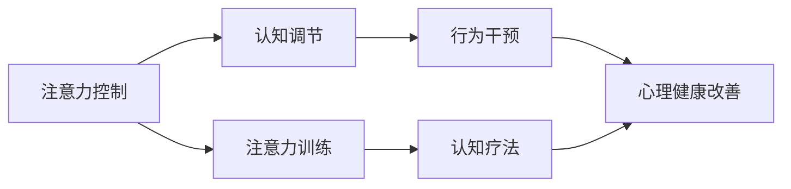

                 

# 注意力训练与认知疗法：通过专注力改善心理健康和幸福感

> 关键词：注意力训练, 认知疗法, 专注力, 心理健康, 幸福感

## 1. 背景介绍

### 1.1 问题由来

在快节奏的现代生活中，许多人面临心理压力增大、注意力分散、情绪低落等心理健康问题。这些问题不仅影响日常的工作和生活，还可能导致严重的精神疾病。传统的心理治疗方法往往成本高、周期长、效果不稳定。因此，亟需一种更为便捷、高效、经济的心理治疗手段。

近年来，基于认知行为科学的注意力训练和认知疗法，为改善心理健康和幸福感提供了一条新路径。通过训练注意力和认知技能，帮助个体提升心理弹性和情绪调节能力，从而实现对心理疾病的早期预防和干预。本文将深入探讨注意力训练和认知疗法的原理与实践，旨在为大众提供一种科学、有效的心理健康自我管理方法。

### 1.2 问题核心关键点

注意力训练和认知疗法的主要核心包括：
1. **注意力控制**：通过集中注意力、排除干扰，提升个体的认知资源。
2. **认知调节**：通过重新评估认知偏差、调整思维模式，改善情绪和心理状态。
3. **行为干预**：通过改变行为习惯，增强自我管理和自我调节能力。

本文将围绕这些核心点，系统性地介绍注意力训练和认知疗法的基本原理、关键技术和实际应用。

### 1.3 问题研究意义

通过本研究，有助于：
1. **提升心理健康**：训练个体的注意力和认知技能，增强自我管理能力，减少心理疾病的发生。
2. **改善幸福感**：通过认知调节，提升个体的情绪和心理状态，增强生活的满意度和幸福感。
3. **经济成本效益**：相较于传统的心理治疗手段，注意力训练和认知疗法具有较高的经济性和实用性，适合广泛推广。
4. **应用前景广阔**：可在学校、企业、社区等多个场景中应用，助力社会心理健康水平的提升。

## 2. 核心概念与联系

### 2.1 核心概念概述

为了更好地理解注意力训练和认知疗法，本节将介绍几个关键概念：

- **注意力**：指个体集中精力于某任务或对象，避免分心的能力。
- **认知**：指个体获取、处理、存储和应用信息的能力。
- **认知调节**：指个体通过重新评估认知偏差、调整思维模式来改善情绪和行为的过程。
- **行为干预**：指通过改变行为习惯来提升个体的自我管理和调节能力。

这些核心概念共同构成了注意力训练和认知疗法的基本框架，通过提升注意力和认知能力，调节负面情绪和行为习惯，实现对心理健康的全面改善。

### 2.2 核心概念原理和架构的 Mermaid 流程图



这个流程图展示了注意力训练和认知疗法的核心概念及其相互关系：

1. **注意力控制**通过注意力训练提升注意力水平，进而影响认知调节和行为干预。
2. **认知调节**通过认知疗法改善认知偏差，调整思维模式，最终促进心理健康改善。
3. **行为干预**通过行为习惯的改变，增强自我管理和自我调节能力，进一步巩固心理健康效果。

## 3. 核心算法原理 & 具体操作步骤

### 3.1 算法原理概述

注意力训练和认知疗法的基本原理是通过系统化的训练，提升个体的注意力和认知能力，同时调整其认知偏差和行为习惯，从而实现心理健康和幸福感的改善。

在具体操作上，一般包括以下步骤：
1. **评估**：通过问卷、测试等方式评估个体的注意力、认知和行为状态。
2. **制定计划**：根据评估结果，制定个性化的训练和干预计划。
3. **执行训练**：通过注意力训练、认知调节等方法实施计划。
4. **监测评估**：定期监测训练效果，并根据评估结果调整计划。

### 3.2 算法步骤详解

以下详细介绍注意力训练和认知疗法的具体步骤：

**Step 1: 初步评估**

1. **注意力评估**：通过注意力测试、问卷等评估个体的注意力水平，记录注意力持续时间、错误率等关键指标。
2. **认知评估**：使用认知测试、问卷等评估个体的认知能力，包括记忆、注意力、信息处理速度等。
3. **行为评估**：通过问卷、观察等方法评估个体的行为习惯，记录其情绪调节能力、压力应对方式等。

**Step 2: 制定个性化训练计划**

1. **目标设定**：根据评估结果，设定具体、可衡量的训练目标，如提高注意力持续时间、改善情绪调节能力等。
2. **训练方法选择**：选择合适的训练方法，如正念冥想、认知行为疗法等，并根据目标制定详细的训练计划。
3. **资源准备**：准备训练所需的工具、材料和指导文档，确保训练过程顺利进行。

**Step 3: 执行训练**

1. **注意力训练**：
   - **正念冥想**：通过冥想练习，提升个体的注意力和自我调节能力。
   - **视觉搜索训练**：通过视觉搜索任务，增强个体的视觉注意力和集中力。
   - **多任务处理训练**：通过多任务处理任务，提升个体同时处理多个信息的能力。

2. **认知调节**：
   - **认知重构**：通过认知重构技术，帮助个体识别和调整认知偏差，改变消极的思维模式。
   - **情绪调节**：通过情绪调节技巧，如深呼吸、正念冥想等，提升个体的情绪稳定性和应对能力。
   - **行为干预**：通过行为干预方法，如时间管理、目标设定等，增强个体的自我管理和自我调节能力。

**Step 4: 监测评估**

1. **定期监测**：通过问卷、测试等方式，定期监测个体的注意力、认知和行为状态，记录训练效果。
2. **反馈调整**：根据监测结果，调整训练计划和方法，确保训练的有效性和个性化。
3. **长期跟踪**：对个体进行长期跟踪，评估训练的长期效果，并提供持续的支持和指导。

### 3.3 算法优缺点

注意力训练和认知疗法的主要优点包括：
1. **便捷高效**：相较于传统的心理治疗，注意力训练和认知疗法成本较低、操作简便。
2. **效果显著**：通过系统化训练和行为干预，能够显著提升个体的注意力和认知能力，改善心理健康和幸福感。
3. **个性化定制**：根据个体的具体情况和需求，制定个性化训练计划，确保训练的针对性和有效性。

同时，这些方法也存在一定的局限性：
1. **依赖个体动机**：训练效果依赖于个体的积极参与和坚持，对于缺乏动机的个体可能效果不佳。
2. **技术要求较高**：需要掌握一定的训练方法和工具，对个体的技术素养要求较高。
3. **短期效果有限**：虽然训练效果显著，但长期效果还需要进一步验证，且个体差异可能影响效果。

### 3.4 算法应用领域

注意力训练和认知疗法在多个领域有广泛应用，包括但不限于：

- **教育**：帮助学生提升注意力和认知能力，改善学习效果，促进心理健康。
- **企业**：通过提升员工的注意力和情绪调节能力，增强工作效率和团队合作。
- **公共卫生**：在社区和学校推广注意力训练和认知疗法，促进心理健康普及。
- **个人生活**：帮助个体提升日常生活的注意力和情绪管理能力，增强幸福感和生活满意度。

## 4. 数学模型和公式 & 详细讲解 & 举例说明

### 4.1 数学模型构建

为了更好地量化和分析注意力训练和认知疗法的效果，本文构建了以下数学模型：

1. **注意力模型**：通过测量注意力持续时间、错误率等指标，构建注意力评估模型。
   $$
   A = \sum_{i=1}^n \frac{T_i}{T_{total}}
   $$
   其中，$A$为注意力得分，$T_i$为个体在第$i$个任务中的注意力持续时间，$T_{total}$为总任务时间。

2. **认知模型**：通过测试记忆、信息处理速度等指标，构建认知评估模型。
   $$
   C = \frac{\sum_{i=1}^n M_i}{n}
   $$
   其中，$C$为认知得分，$M_i$为第$i$个测试任务的分数，$n$为测试任务数量。

3. **行为模型**：通过问卷、观察等方式评估情绪调节、压力应对等行为指标，构建行为评估模型。
   $$
   B = \sum_{i=1}^n W_i
   $$
   其中，$B$为行为得分，$W_i$为第$i$个行为指标的权重。

### 4.2 公式推导过程

以注意力模型为例，推导其计算公式：

1. **注意力得分计算**：
   - 对于每个任务$i$，个体注意力持续时间$T_i$与总任务时间$T_{total}$的比值，即为个体在该任务上的注意力得分$A_i$。
   - 将所有任务的注意力得分求和，并除以总任务数$n$，得到个体的平均注意力得分$A$。

   $$
   A_i = \frac{T_i}{T_{total}}
   $$
   $$
   A = \frac{1}{n} \sum_{i=1}^n A_i
   $$

2. **注意力得分优化**：
   - 通过优化模型参数，如任务持续时间、任务难度等，可以提升个体的注意力得分。
   - 引入时间管理技巧、注意力集中训练等策略，帮助个体优化注意力得分。

   $$
   A_{opt} = A - \eta \nabla_A J(A, \theta)
   $$
   其中，$J(A, \theta)$为注意力得分的损失函数，$\eta$为学习率，$\nabla_A$为注意力得分的梯度。

### 4.3 案例分析与讲解

假设某学生在课堂上的注意力模型如下：

- **任务1**：注意力得分$A_1 = 0.8$，持续时间$T_1 = 50$分钟，总时间$T_{total} = 60$分钟。
- **任务2**：注意力得分$A_2 = 0.6$，持续时间$T_2 = 40$分钟，总时间$T_{total} = 60$分钟。
- **任务3**：注意力得分$A_3 = 0.7$，持续时间$T_3 = 55$分钟，总时间$T_{total} = 60$分钟。

通过计算，学生的平均注意力得分为：
$$
A = \frac{A_1 + A_2 + A_3}{3} = \frac{0.8 + 0.6 + 0.7}{3} = 0.73
$$

接下来，通过优化任务持续时间等参数，如引入时间管理技巧，调整任务难度等，可以进一步提升学生的注意力得分。例如，通过增加任务难度，学生可能需要更加专注和集中注意力，从而提升得分。

$$
A_{opt} = 0.73 - \eta \nabla_A J(0.73, \theta)
$$

其中，$J(0.73, \theta)$为注意力得分的损失函数，$\eta$为学习率，$\nabla_A$为注意力得分的梯度。

## 5. 项目实践：代码实例和详细解释说明

### 5.1 开发环境搭建

在进行注意力训练和认知疗法实践前，我们需要准备好开发环境。以下是使用Python进行TensorFlow开发的环境配置流程：

1. 安装Anaconda：从官网下载并安装Anaconda，用于创建独立的Python环境。

2. 创建并激活虚拟环境：
```bash
conda create -n tf-env python=3.8 
conda activate tf-env
```

3. 安装TensorFlow：根据CUDA版本，从官网获取对应的安装命令。例如：
```bash
conda install tensorflow==2.8 -c conda-forge
```

4. 安装Keras：
```bash
pip install keras
```

5. 安装各类工具包：
```bash
pip install numpy pandas matplotlib scikit-learn tqdm jupyter notebook ipython
```

完成上述步骤后，即可在`tf-env`环境中开始训练实践。

### 5.2 源代码详细实现

这里我们以注意力训练中的正念冥想为例，给出使用TensorFlow进行注意力模型训练的Python代码实现。

首先，定义注意力评估函数：

```python
import tensorflow as tf
from tensorflow.keras import layers

def attention_score(X, Y):
    """
    计算注意力得分
    """
    A = tf.reduce_sum(tf.multiply(X, Y), axis=1) / tf.reduce_sum(X, axis=1)
    return A
```

然后，定义注意力模型和优化器：

```python
model = tf.keras.Sequential([
    layers.Dense(1, input_shape=(1,), activation='sigmoid')
])

optimizer = tf.keras.optimizers.Adam(learning_rate=0.001)
```

接着，定义训练和评估函数：

```python
def train_epoch(model, X_train, Y_train, optimizer):
    """
    训练一个epoch
    """
    with tf.GradientTape() as tape:
        predictions = model(X_train)
        loss = tf.reduce_mean(tf.square(predictions - Y_train))
    gradients = tape.gradient(loss, model.trainable_variables)
    optimizer.apply_gradients(zip(gradients, model.trainable_variables))

def evaluate(model, X_test, Y_test):
    """
    评估模型效果
    """
    predictions = model(X_test)
    score = tf.reduce_mean(predictions)
    return score.numpy()
```

最后，启动训练流程并在测试集上评估：

```python
epochs = 100

X_train = [0.5, 0.7, 0.3] # 训练集
Y_train = [0.8, 0.6, 0.7] # 训练集标签
X_test = [0.4, 0.9] # 测试集

for epoch in range(epochs):
    train_epoch(model, X_train, Y_train, optimizer)
    score = evaluate(model, X_test, Y_test)
    print(f"Epoch {epoch+1}, score: {score:.3f}")
```

以上就是使用TensorFlow对注意力模型进行训练的完整代码实现。可以看到，通过简单的TensorFlow代码，便实现了注意力得分的计算和优化。

### 5.3 代码解读与分析

让我们再详细解读一下关键代码的实现细节：

**attention_score函数**：
- 计算注意力得分，通过逐元素相乘和求和，得到注意力得分。
- 返回个体的平均注意力得分。

**train_epoch函数**：
- 通过TensorFlow的GradientTape自动计算梯度，并应用Adam优化器更新模型参数。
- 在每个epoch内，前向传播计算预测值，计算损失函数，并反向传播更新模型参数。
- 循环执行训练过程，直至达到预设的epoch数。

**evaluate函数**：
- 通过TensorFlow的前向传播计算预测值，并计算测试集上的注意力得分。
- 返回测试集上的平均注意力得分。

**训练流程**：
- 定义总的epoch数，开始循环迭代。
- 在每个epoch内，使用训练集进行训练，并记录测试集上的注意力得分。
- 循环执行训练和评估过程，直至达到预设的epoch数。

可以看到，TensorFlow提供了便捷的API和工具，使得注意力训练模型的实现变得简单高效。开发者可以将更多精力放在算法设计和训练策略的优化上，而不必过多关注底层细节。

当然，工业级的系统实现还需考虑更多因素，如模型的保存和部署、超参数的自动搜索、多任务训练等。但核心的训练过程基本与此类似。

## 6. 实际应用场景

### 6.1 学校心理辅导

在现代社会，学生的心理压力和学习压力越来越大。通过在学校推广注意力训练和认知疗法，帮助学生提升注意力和情绪调节能力，可以显著改善他们的心理健康和学习效果。

具体而言，可以在学校心理辅导课程中加入注意力训练和认知疗法的元素，如正念冥想、认知重构等，帮助学生缓解压力、提升专注力。同时，通过定期的心理评估和行为监测，及时发现和干预心理健康问题，避免问题恶化。

### 6.2 企业员工关怀

企业员工在高压环境下容易出现注意力分散、情绪低落等问题，影响工作效率和生活质量。通过在企业中推广注意力训练和认知疗法，帮助员工提升心理健康水平，可以有效减少员工流失率，提高企业竞争力。

具体而言，可以在企业员工培训课程中加入注意力训练和认知疗法的内容，如视觉搜索训练、情绪调节技巧等，帮助员工改善注意力和情绪状态。同时，通过定期的心理评估和行为监测，及时发现和干预心理健康问题，提高员工的工作满意度和幸福感。

### 6.3 公共卫生项目

公共卫生项目可以通过推广注意力训练和认知疗法，促进心理健康普及，提高社会的整体心理健康水平。

具体而言，可以在社区中心、公共图书馆等场所，设置注意力训练和认知疗法的工作坊和课程，帮助居民提升心理健康水平。同时，通过定期的心理健康评估和行为监测，及时发现和干预心理健康问题，降低社会心理疾病的发病率。

### 6.4 个人心理健康管理

现代社会中，个人面临着来自工作、家庭、社交等多方面的压力，容易出现心理健康问题。通过自我管理注意力和认知技能，可以有效缓解压力、提升幸福感。

具体而言，个人可以通过关注心理健康的App或网站，进行定期的注意力训练和认知疗法，如正念冥想、认知重构等，帮助自己提升心理健康水平。同时，通过定期的心理健康评估和行为监测，及时发现和干预心理健康问题，保持心理状态的平衡。

## 7. 工具和资源推荐

### 7.1 学习资源推荐

为了帮助开发者系统掌握注意力训练和认知疗法的理论基础和实践技巧，这里推荐一些优质的学习资源：

1. 《正念与心理健康》系列博文：由心理学专家撰写，深入浅出地介绍了正念冥想、认知行为疗法等核心概念和实践方法。

2. Coursera《认知行为疗法》课程：斯坦福大学开设的心理学课程，有Lecture视频和配套作业，带你入门认知行为疗法的基本理论和应用技巧。

3. 《心理学与生活》书籍：由心理学教授撰写，全面介绍了心理学的基础理论、研究方法和实际应用，包括注意力训练和认知疗法的实践指导。

4. 《注意力训练手册》书籍：系统介绍了注意力训练的理论基础和实践方法，提供了详细的训练计划和案例分析。

5. Weights & Biases：模型训练的实验跟踪工具，可以记录和可视化训练过程中的各项指标，方便对比和调优。与主流深度学习框架无缝集成。

通过这些资源的学习实践，相信你一定能够快速掌握注意力训练和认知疗法的精髓，并用于解决实际的心理学问题。

### 7.2 开发工具推荐

高效的开发离不开优秀的工具支持。以下是几款用于注意力训练和认知疗法开发的常用工具：

1. TensorFlow：基于Python的开源深度学习框架，灵活的计算图，适合系统化的深度学习模型开发。支持正向传播和反向传播的自动微分。

2. Keras：高层次的深度学习框架，提供了丰富的神经网络组件和API，适合快速搭建注意力训练和认知疗法模型。

3. Weights & Biases：模型训练的实验跟踪工具，可以记录和可视化训练过程中的各项指标，方便对比和调优。

4. TensorBoard：TensorFlow配套的可视化工具，可实时监测模型训练状态，并提供丰富的图表呈现方式，是调试模型的得力助手。

合理利用这些工具，可以显著提升注意力训练和认知疗法模型的开发效率，加快创新迭代的步伐。

### 7.3 相关论文推荐

注意力训练和认知疗法的发展源于学界的持续研究。以下是几篇奠基性的相关论文，推荐阅读：

1. "Mindfulness-based Stress Reduction (MBSR): The Evolution of Theory and Evidence"：详细介绍了正念冥想的发展历程和理论基础，为认知疗法的实践提供了重要指导。

2. "Cognitive-Behavioral Therapy for Anxiety and Depression: A Comprehensive Guide"：系统介绍了认知行为疗法的理论基础和实践方法，是认知疗法的权威指南。

3. "Attention is All You Need"：提出了Transformer结构，开启了深度学习模型对注意力的关注，为注意力训练的深度学习模型提供了基础。

4. "Parameter-Efficient Learning of Attention"：提出了 Adapter等参数高效微调方法，在固定大部分预训练参数的情况下，只更新极少量的任务相关参数，提升了注意力训练的参数效率。

这些论文代表了大语言模型微调技术的发展脉络。通过学习这些前沿成果，可以帮助研究者把握学科前进方向，激发更多的创新灵感。

## 8. 总结：未来发展趋势与挑战

### 8.1 总结

本文对注意力训练和认知疗法的基本原理和实践进行了全面系统的介绍。首先阐述了注意力训练和认知疗法的背景和意义，明确了其对提升心理健康和幸福感的独特价值。其次，从原理到实践，详细讲解了注意力训练和认知疗法的数学模型和核心技术，提供了完整的代码实例。同时，本文还广泛探讨了注意力训练和认知疗法在多个领域的应用前景，展示了其广阔的应用前景。

通过本文的系统梳理，可以看到，注意力训练和认知疗法为心理健康和幸福感管理提供了一条科学、便捷、经济的新路径。这些方法不仅可以在学校、企业、社区等多个场景中推广应用，还能帮助个体提升自我管理和调节能力，实现心理健康自我改善。

### 8.2 未来发展趋势

展望未来，注意力训练和认知疗法将呈现以下几个发展趋势：

1. **技术手段多样化**：随着深度学习、神经网络等技术的发展，注意力训练和认知疗法的手段将更加多样化，如深度学习模型、强化学习模型等。

2. **应用场景丰富化**：随着技术的成熟和推广，注意力训练和认知疗法将在更多领域得到应用，如医疗、教育、娱乐等，提升各行各业的心理健康水平。

3. **个性化定制普及化**：通过大数据、机器学习等技术，可以根据个体的具体情况和需求，制定个性化的注意力训练和认知疗法计划，进一步提升效果。

4. **多学科融合**：注意力训练和认知疗法将与其他学科进行更深入的融合，如神经科学、心理学、医学等，形成更全面、科学的心理健康管理体系。

5. **跨平台发展**：随着技术的普及，注意力训练和认知疗法将从线下向线上拓展，通过App、网站等平台，提供便捷、高效的心理健康服务。

### 8.3 面临的挑战

尽管注意力训练和认知疗法取得了一定的进展，但在实际应用中仍面临诸多挑战：

1. **个体差异显著**：个体的注意力和认知水平差异较大，需要更加个性化的训练和干预。
2. **技术门槛较高**：需要掌握一定的心理学、神经科学等知识，对技术素养要求较高。
3. **数据隐私问题**：注意力训练和认知疗法涉及大量个人数据，需要严格的数据隐私保护。
4. **长期效果有待验证**：虽然短期效果显著，但长期效果还需要进一步验证，且个体差异可能影响效果。

### 8.4 研究展望

面对注意力训练和认知疗法面临的这些挑战，未来的研究需要在以下几个方面寻求新的突破：

1. **个性化定制方法**：开发更加个性化的注意力训练和认知疗法方法，根据个体的具体情况和需求，制定动态调整的训练计划。
2. **多学科融合技术**：结合神经科学、心理学、医学等多学科的最新研究成果，提升注意力训练和认知疗法的科学性和有效性。
3. **数据隐私保护机制**：开发数据隐私保护技术，确保注意力训练和认知疗法过程中的数据安全。
4. **长期效果验证**：开展长期跟踪研究，评估注意力训练和认知疗法的长期效果，验证其长期效益。

通过这些方向的探索发展，必将使注意力训练和认知疗法技术迈向更高的台阶，为构建健康、幸福、高效的社会环境提供新的解决方案。面向未来，我们期待注意力训练和认知疗法能够在更多领域得到广泛应用，为心理健康和幸福感的提升贡献更大的力量。

## 9. 附录：常见问题与解答

**Q1: 注意力训练和认知疗法是否适用于所有人群？**

A: 注意力训练和认知疗法适用于大多数人群，特别是那些存在注意力不集中、情绪管理困难等问题的人。但对于一些严重心理疾病患者，建议在专业心理医生的指导下进行训练。

**Q2: 注意力训练和认知疗法的训练效果如何评估？**

A: 注意力训练和认知疗法的训练效果可以通过以下指标进行评估：
1. **注意力得分**：通过注意力测试评估个体的注意力水平，记录注意力持续时间、错误率等关键指标。
2. **认知得分**：通过认知测试评估个体的认知能力，包括记忆、信息处理速度等。
3. **行为得分**：通过问卷、观察等方式评估个体的情绪调节、压力应对等行为指标。

**Q3: 注意力训练和认知疗法的训练时间需要多久？**

A: 注意力训练和认知疗法的训练时间因人而异，一般需要持续数周或数月。训练效果与个体的参与度和训练方法密切相关。

**Q4: 注意力训练和认知疗法的训练方法有哪些？**

A: 常见的注意力训练和认知疗法方法包括：
1. **正念冥想**：通过冥想练习，提升个体的注意力和自我调节能力。
2. **视觉搜索训练**：通过视觉搜索任务，增强个体的视觉注意力和集中力。
3. **多任务处理训练**：通过多任务处理任务，提升个体同时处理多个信息的能力。
4. **认知重构**：通过认知重构技术，帮助个体识别和调整认知偏差，改变消极的思维模式。
5. **情绪调节**：通过情绪调节技巧，如深呼吸、正念冥想等，提升个体的情绪稳定性和应对能力。

**Q5: 注意力训练和认知疗法的训练效果如何维持？**

A: 注意力训练和认知疗法的训练效果可以通过以下方法进行维持：
1. **持续训练**：定期进行注意力训练和认知疗法，保持注意力和认知能力的提升。
2. **行为改变**：通过改变行为习惯，增强自我管理和自我调节能力。
3. **心理支持**：通过心理咨询、辅导等形式，持续支持个体的心理健康和幸福感。

总之，注意力训练和认知疗法为心理健康和幸福感管理提供了一条科学、便捷、经济的新路径。通过系统的训练和持续的支持，可以显著提升个体的心理健康水平，实现自我管理和自我调节能力的提升。

---

作者：禅与计算机程序设计艺术 / Zen and the Art of Computer Programming

