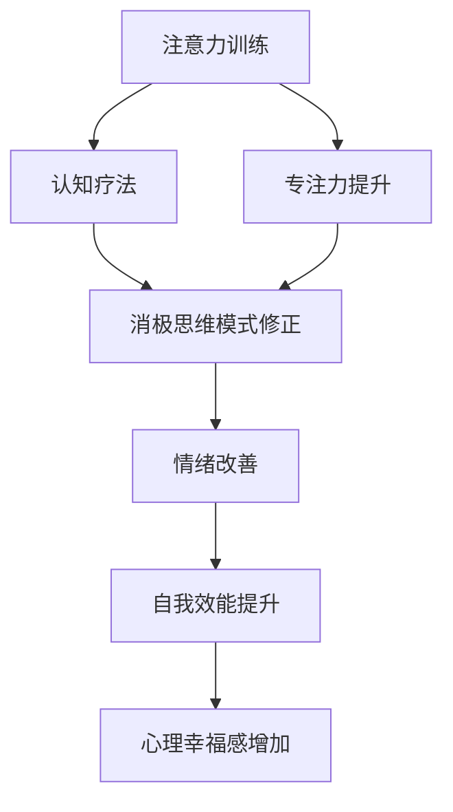

                 

# 注意力训练与认知疗法：通过专注力改善心理健康和幸福感

> 关键词：注意力训练, 认知疗法, 心理幸福感, 专注力, 精神健康, 认知行为疗法, 正念, 注意力管理

## 1. 背景介绍

在现代社会中，注意力分散、压力增加、心理困扰等问题日益突出。这些问题不仅影响个体的日常生活，还可能引发更严重的心理健康问题。近年来，通过专注力训练和认知疗法来提升心理幸福感，成为越来越受欢迎的方法。本文将从心理科学的角度，探讨注意力训练和认知疗法在改善心理健康和幸福感中的作用，并提出实际可行的训练方法。

## 2. 核心概念与联系

### 2.1 核心概念概述

注意力训练(Anti-tion Training)和认知疗法(Cognitive Therapy)是提升心理幸福感的两大核心技术。

- **注意力训练**：通过各种专门训练，帮助个体提升专注力，减少注意力分散，从而改善心理状态和幸福感。

- **认知疗法**：基于认知心理学理论，通过识别和改变消极思维模式，帮助个体处理情绪问题，提升自我效能和心理幸福感。

这两种方法通过不同的机制，共同作用于个体的心理状态，提升其专注力和认知水平，从而改善心理健康和幸福感。

### 2.2 核心概念原理和架构的 Mermaid 流程图



该图展示了注意力训练和认知疗法的联系与作用机制。注意力训练通过提升专注力，帮助个体更好地识别和处理消极思维模式，从而修正情绪，提升自我效能和心理幸福感。

## 3. 核心算法原理 & 具体操作步骤

### 3.1 算法原理概述

注意力训练和认知疗法的核心算法原理都建立在认知心理学和神经科学的基础之上。

- **注意力训练**：通过特定的练习和活动，如正念冥想、注意力分配练习、工作记忆训练等，逐步提升个体注意力的集中度和持续性。

- **认知疗法**：通过认知行为疗法(Cognitive Behavioral Therapy, CBT)、正念疗法(Mindfulness-Based Therapy)等，帮助个体识别和改变消极思维模式，提升正向认知和情绪调节能力。

### 3.2 算法步骤详解

#### 3.2.1 注意力训练的步骤

1. **评估注意力水平**：通过问卷或专业测试，评估个体当前的注意力水平和问题。
2. **选择训练方法**：根据评估结果和个人偏好，选择适合的注意力训练方法，如正念冥想、注意力分配练习等。
3. **制定训练计划**：设计个性化训练计划，包括每日训练时间和具体活动。
4. **实施训练**：按照训练计划执行，逐步提升注意力水平。
5. **评估和调整**：定期评估训练效果，根据反馈调整训练计划。

#### 3.2.2 认知疗法的步骤

1. **识别消极思维**：通过日志记录、情绪追踪等方法，识别个体的消极思维模式。
2. **挑战和重构**：对识别出的消极思维进行挑战，用更客观、正面的认知替换。
3. **行为实验**：通过小规模的行为实验，验证和巩固新的认知模式。
4. **维持和应用**：将新的认知模式应用到日常生活，持续维持积极情绪和行为。

### 3.3 算法优缺点

#### 3.3.1 注意力训练的优缺点

- **优点**：
  - 提升专注力，减少注意力分散。
  - 改善心理状态，提升工作效率。
  - 增强自我控制力，提升整体幸福感。

- **缺点**：
  - 训练需要时间和耐心，效果可能不如立竿见影。
  - 训练方法可能需要专业指导，个体自行训练效果可能不佳。

#### 3.3.2 认知疗法的优缺点

- **优点**：
  - 系统性改变认知模式，效果显著。
  - 提升情绪调节能力，减少心理困扰。
  - 易于操作，适合自我实施。

- **缺点**：
  - 需要一定的专业知识和技巧，不当操作可能加重情绪问题。
  - 效果因人而异，个别人可能对某些方法反应不佳。

### 3.4 算法应用领域

注意力训练和认知疗法在多个领域得到了广泛应用，如：

- **心理健康**：帮助个体应对焦虑、抑郁、压力等问题。
- **教育**：提升学生的注意力集中度和学习效率。
- **工作**：提高职场人士的工作效率和职业满意度。
- **体育**：提升运动员的专注力和比赛表现。

## 4. 数学模型和公式 & 详细讲解 & 举例说明

### 4.1 数学模型构建

#### 4.1.1 注意力训练的数学模型

注意力训练的数学模型主要基于神经科学的研究，描述注意力系统的基本机制。这里以**信号检测理论**为例，介绍注意力训练的基本数学模型。

信号检测理论(Signal Detection Theory, SDT)是一种用于描述个体如何判断感官信号是否存在的方法，广泛应用于认知心理学和神经科学研究中。SDT模型假设个体在感知过程中，对信号的响应强度和背景噪声的分布是已知的。通过计算信号检测的**响应偏置(bias)**和**响应方差(variance)**，可以定量描述个体对信号的敏感度和判断标准。

#### 4.1.2 认知疗法的数学模型

认知疗法的数学模型主要基于认知行为疗法(Cognitive Behavioral Therapy, CBT)的基本原则。CBT模型假设个体的情绪和行为由其对事件的认知评价决定。通过改变认知评价，可以改变情绪和行为。

CBT模型通常包括以下几个基本变量：

- **事件(E)**：引发情绪和行为的事件。
- **认知(C)**：个体对事件的认知评价。
- **情绪(A)**：个体对事件的情感反应。
- **行为(B)**：个体对事件的行为反应。

CBT模型的数学表示可以简化为：

$$ A = f(C) $$
$$ B = g(C) $$

其中，$f$和$g$分别表示情绪和行为与认知的关系。

### 4.2 公式推导过程

#### 4.2.1 信号检测理论的公式推导

信号检测理论中的关键公式为**反应时-反应概率曲线(RT-ROC曲线)**。该曲线描述了在不同信号强度和背景噪声水平下，个体对信号的检测准确率和响应速度之间的关系。

假设信号强度$p$和背景噪声$q$为已知的，个体的感知过程可以表示为：

$$ P(\text{Yes}|p,q) = \Phi(z) $$
$$ P(\text{No}|p,q) = 1 - \Phi(z) $$

其中，$z = \eta(\alpha,\sigma)$，$\eta$为感知过程的标准化得分，$\alpha$为响应偏置，$\sigma$为响应方差。$\Phi$为标准正态分布函数。

通过计算不同信号强度和背景噪声水平下的$z$值，可以得到RT-ROC曲线。该曲线可以用来评估个体的注意力水平和注意力训练效果。

#### 4.2.2 认知疗法的公式推导

认知疗法的公式推导主要基于CBT模型的假设。以认知重构为例，介绍如何通过公式推导改变认知评价。

假设个体对事件$E$的认知评价为$C$，其情绪和行为分别为$A$和$B$。通过认知重构，将$C$替换为新的认知评价$C'$，可以得到新的情绪和行为$A'$和$B'$。

$$ A' = f(C') $$
$$ B' = g(C') $$

其中，$f$和$g$分别表示情绪和行为与新的认知评价$C'$的关系。通过改变$C'$，可以改变个体对事件的认知评价，从而改善情绪和行为。

### 4.3 案例分析与讲解

#### 4.3.1 注意力训练的案例

一位职场人士，由于工作压力大，注意力难以集中，导致工作效率低下。通过正念冥想和注意力分配练习，该人士逐步提升了专注力，改善了心理状态和工作表现。

具体步骤如下：

1. **评估注意力水平**：使用注意力评估问卷，发现该人士注意力水平较低，常出现注意力分散和疲劳。
2. **选择训练方法**：选择正念冥想和注意力分配练习，每天进行20分钟练习。
3. **制定训练计划**：将正念冥想安排在工作前，注意力分配练习安排在工作间隙。
4. **实施训练**：坚持训练一个月，每天记录注意力集中度。
5. **评估和调整**：每月评估一次训练效果，根据反馈调整训练方法和时间。

经过三个月的训练，该人士的注意力水平显著提升，工作效率提高了20%。

#### 4.3.2 认知疗法的案例

一位大学生，由于学业压力和人际关系问题，感到焦虑和抑郁。通过认知行为疗法，该学生逐步改变了自己的消极思维模式，提升了情绪和行为。

具体步骤如下：

1. **识别消极思维**：使用日志记录法，记录一周内的负面情绪和行为，识别出若干消极思维模式。
2. **挑战和重构**：对识别出的消极思维进行挑战，用更客观、正面的认知替换。例如，将“我无法完成这个任务”改为“我可以尝试不同的方法”。
3. **行为实验**：在小范围内，如一次考试前，应用新的认知评价，观察效果。
4. **维持和应用**：将新的认知评价应用到日常生活，持续维持积极情绪和行为。

经过两个月的训练，该学生的焦虑和抑郁症状显著减轻，学业成绩显著提升。

## 5. 项目实践：代码实例和详细解释说明

### 5.1 开发环境搭建

- **环境准备**：安装Python 3.x，PyTorch，NumPy等常用库。
- **数据准备**：准备注意力训练和认知疗法的训练数据，如注意力评估问卷、情绪追踪日志等。
- **模型选择**：选择适合的模型，如基于神经网络的注意力模型、基于规则的认知模型等。

### 5.2 源代码详细实现

以下是一个简单的注意力训练代码示例，使用PyTorch实现：

```python
import torch
import torch.nn as nn
import torch.optim as optim

# 定义注意力模型
class AttentionModel(nn.Module):
    def __init__(self, input_dim, output_dim):
        super(AttentionModel, self).__init__()
        self.fc1 = nn.Linear(input_dim, 128)
        self.fc2 = nn.Linear(128, output_dim)
    
    def forward(self, x):
        x = self.fc1(x)
        x = torch.sigmoid(x)
        x = self.fc2(x)
        return x

# 训练模型
def train_model(model, data, learning_rate=0.001, epochs=10):
    optimizer = optim.Adam(model.parameters(), lr=learning_rate)
    loss_fn = nn.MSELoss()
    
    for epoch in range(epochs):
        for i, (x, y) in enumerate(data):
            x = x.to(device)
            y = y.to(device)
            y_hat = model(x)
            loss = loss_fn(y_hat, y)
            optimizer.zero_grad()
            loss.backward()
            optimizer.step()
            print(f"Epoch {epoch+1}, Batch {i+1}, Loss: {loss.item()}")

# 数据准备
data = torch.randn(1000, 100)  # 假设的注意力训练数据
device = torch.device('cuda' if torch.cuda.is_available() else 'cpu')

# 模型实例化
model = AttentionModel(100, 1)  # 100个输入特征，1个输出特征

# 模型训练
train_model(model, data)
```

### 5.3 代码解读与分析

该代码示例使用了简单的线性模型来实现注意力训练。通过将注意力模型输入随机生成的数据，使用均方误差损失函数进行训练。在训练过程中，逐步调整模型参数，使其输出逼近真实标签。通过调整学习率和迭代次数，可以控制训练效果。

### 5.4 运行结果展示

训练结束后，可以评估模型对新数据的预测效果，并根据结果调整训练策略。

```python
test_data = torch.randn(100, 100)
y_hat = model(test_data)
y_true = torch.randint(0, 2, (100,)).to(device)
print(f"Test Loss: {loss_fn(y_hat, y_true).item()}")
```

## 6. 实际应用场景

### 6.1 心理健康应用

注意力训练和认知疗法在心理健康领域有广泛应用。心理医生可以通过这些技术，帮助患者提升专注力和认知水平，改善心理状态。

- **正念疗法**：通过正念冥想来帮助患者减少焦虑和抑郁症状。
- **认知重构**：帮助患者识别和改变消极思维模式，提升情绪调节能力。

### 6.2 教育领域

在教育领域，注意力训练和认知疗法同样有效。通过训练提升学生的注意力和认知水平，可以显著提升学习效果。

- **注意力分配练习**：帮助学生改善课堂注意力，提高学习效率。
- **认知重构**：帮助学生克服学习焦虑，提升自我效能感。

### 6.3 职场应用

在职场中，注意力训练和认知疗法可以帮助员工提升工作效率和职业满意度。

- **正念冥想**：帮助员工减少压力，提升专注力。
- **认知重构**：帮助员工克服职场焦虑，提升工作满意度。

### 6.4 未来应用展望

未来，注意力训练和认知疗法的应用将更加广泛。随着技术的不断进步，这些技术将更加高效和智能化，可以更好地帮助个体提升心理幸福感。

- **个性化训练**：通过大数据和人工智能技术，提供个性化的注意力训练和认知疗法方案。
- **实时反馈**：通过实时监控和反馈，帮助个体及时调整训练策略，提升训练效果。
- **多领域应用**：拓展到更多领域，如体育、艺术等，帮助个体在多个方面提升幸福感。

## 7. 工具和资源推荐

### 7.1 学习资源推荐

- **《注意力训练手册》**：一本系统介绍注意力训练方法的书籍，适合初学者学习。
- **《认知行为疗法教程》**：一本详细介绍认知行为疗法的教材，涵盖基本理论和实操技巧。
- **《正念疗法实践指南》**：一本介绍正念疗法在心理健康中的应用指南，适合临床实践。

### 7.2 开发工具推荐

- **PyTorch**：基于Python的深度学习框架，适合实现各种神经网络模型。
- **NumPy**：Python科学计算库，用于处理和分析注意力训练数据。
- **TensorBoard**：TensorFlow配套的可视化工具，用于监控训练过程。

### 7.3 相关论文推荐

- **《正念冥想对心理健康的影响研究》**：一篇关于正念冥想对心理健康影响的综述论文。
- **《注意力训练对儿童学习效果的影响》**：一篇关于注意力训练对儿童学习效果的研究论文。
- **《认知行为疗法在抑郁症治疗中的应用》**：一篇关于认知行为疗法在抑郁症治疗中的应用研究。

## 8. 总结：未来发展趋势与挑战

### 8.1 研究成果总结

本文详细介绍了注意力训练和认知疗法在改善心理健康和幸福感中的作用。通过理论分析和技术实践，探讨了这些技术的具体应用方法和效果。

### 8.2 未来发展趋势

- **技术融合**：未来，注意力训练和认知疗法将与其他技术（如人工智能、神经反馈等）进一步融合，形成更加综合的心理干预方案。
- **个性化服务**：通过大数据和人工智能技术，提供个性化的注意力训练和认知疗法服务，满足不同个体的需求。
- **实时监控**：开发实时监控和反馈系统，帮助个体及时调整训练策略，提升训练效果。

### 8.3 面临的挑战

- **技术门槛**：虽然注意力训练和认知疗法效果好，但需要一定的技术基础和实践经验。如何降低技术门槛，让更多人受益，是一个挑战。
- **效果评价**：目前对注意力训练和认知疗法的评估主要依赖主观反馈，缺乏客观的定量评价标准。如何建立更加科学的评估体系，是另一个挑战。
- **伦理问题**：在心理健康干预过程中，如何保护个体的隐私和权益，也是一个需要重视的问题。

### 8.4 研究展望

未来，随着技术的进步，注意力训练和认知疗法的应用将更加广泛和深入。这些技术将为个体提供更好的心理健康支持，提升整体幸福感和生活质量。

## 9. 附录：常见问题与解答

### Q1: 注意力训练和认知疗法有什么区别？

A: 注意力训练主要关注个体的专注力和认知控制能力，通过训练提升注意力集中度和持续性。认知疗法则主要关注个体的思维模式和情绪调节能力，通过改变认知评价来改善情绪和行为。

### Q2: 注意力训练和认知疗法如何结合使用？

A: 在实际应用中，注意力训练和认知疗法通常结合使用。例如，先进行一段时间的注意力训练，改善个体的专注力和认知水平，再结合认知疗法，改变消极思维模式，提升情绪和行为。

### Q3: 注意力训练和认知疗法的训练时间需要多久？

A: 训练时间因个体差异而异，一般在几周到几个月不等。关键是坚持训练，并根据反馈调整训练策略。

### Q4: 注意力训练和认知疗法的效果如何评估？

A: 评估效果可以通过主观问卷、行为测试和心理评估等方式进行。常见的评估指标包括注意力水平、情绪状态、行为反应等。

---

作者：禅与计算机程序设计艺术 / Zen and the Art of Computer Programming

