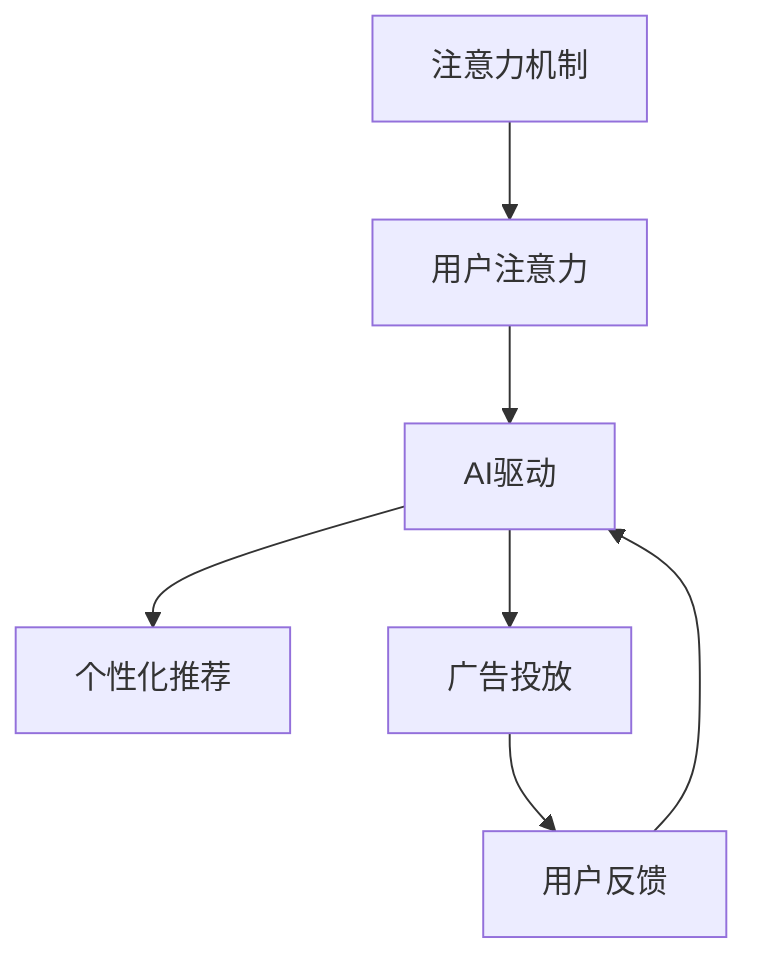

                 

# 注意力货币化策略：AI驱动的关注度经济模型

> 关键词：注意力机制, 关注度经济, AI驱动, 货币化策略, 实时分析, 推荐系统, 广告投放, 数据挖掘

## 1. 背景介绍

在数字时代，注意力（Attention）已经成为了连接用户与信息的重要纽带。无论是搜索引擎、社交媒体还是在线广告，注意力机制都在其中起到了核心作用。然而，如何高效利用注意力资源，最大化其商业价值，是一个亟待解决的问题。随着人工智能（AI）和大数据分析技术的不断进步，AI驱动的关注度经济（Attention Economy）正在成为一种新的商业模式。本文将深入探讨AI如何通过注意力货币化策略，驱动关注度经济的发展。

### 1.1 问题由来

数字技术的发展改变了人们获取信息和内容的传统方式，注意力也随之分散。过去，用户获取信息主要依赖于电视、报纸等传统媒体，注意力相对集中。如今，互联网的普及使得信息源更加多样，用户注意力被各个平台分割，如何吸引并保持用户的关注成为企业关注的焦点。

广告和推荐系统是典型的基于注意力的商业模式。广告主希望通过吸引用户注意力来推销产品，而推荐系统则希望根据用户的注意力偏好，为其推荐合适的信息。这些系统依赖于AI和大数据技术，通过分析用户行为数据，预测用户需求，从而实现对注意力的精准调控。

然而，传统的方法如通过用户点击次数、停留时间等指标进行广告投放和内容推荐，存在着精确度低、用户隐私保护问题等局限性。这些问题需要通过新的算法和策略来解决。

### 1.2 问题核心关键点

AI驱动的关注度经济模型旨在通过注意力机制，构建用户和信息之间的精准连接。其主要核心在于：

- 用户注意力分析：通过对用户在线行为的数据挖掘，分析用户的注意力分布和变化趋势。
- 个性化推荐：利用AI技术为用户生成个性化推荐内容，提升用户满意度和粘性。
- 广告投放优化：通过优化广告的投放策略和时机，实现广告效果的最大化。
- 用户反馈闭环：利用用户反馈数据进行模型优化，形成闭环调整机制。

## 2. 核心概念与联系

### 2.1 核心概念概述

为更好地理解AI驱动的关注度经济模型，本节将介绍几个密切相关的核心概念：

- 注意力机制（Attention Mechanism）：指在处理序列数据时，根据不同数据的重要程度，分配不同的注意力权重。注意力机制被广泛应用于机器翻译、语音识别、自然语言处理等领域。

- 用户注意力（User Attention）：指用户在特定时间点上对某个信息源的关注度。通过追踪用户的行为数据，可以评估其注意力水平，实现精准的广告和推荐。

- AI驱动（AI-Driven）：指利用AI技术，特别是深度学习、强化学习等，对大量数据进行分析和建模，实现自动化决策和预测。

- 关注度经济（Attention Economy）：指通过高效利用用户的注意力资源，驱动商业价值和用户满意度的提升。注意力经济与传统基于内容的商业模式不同，其核心在于用户的行为数据和AI分析。

这些核心概念之间的逻辑关系可以通过以下Mermaid流程图来展示：



这个流程图展示了几者之间的联系：

1. 注意力机制是用户注意力分析的基础，通过注意力权重分配，反映用户对不同信息的关注程度。
2. AI驱动则是分析用户注意力数据的核心，通过机器学习算法挖掘出用户行为规律，实现个性化推荐和广告投放。
3. 个性化推荐和广告投放是关注度经济的直接体现，通过精准匹配用户需求，提升用户满意度。
4. 用户反馈则是关注度经济模型的闭环，通过对用户反馈数据的分析，优化模型性能，形成良性循环。

## 3. 核心算法原理 & 具体操作步骤
### 3.1 算法原理概述

AI驱动的关注度经济模型基于注意力机制和深度学习技术，其核心算法原理包括：

- 用户注意力分析：通过用户行为数据，构建用户注意力模型，预测用户在不同时间点的注意力分布。
- 个性化推荐：利用深度学习模型，根据用户注意力模型，为用户生成个性化的内容推荐。
- 广告投放优化：通过优化算法，确定广告的投放时机和策略，最大化广告效果。
- 用户反馈闭环：收集用户反馈数据，对模型进行优化，确保推荐和广告的精准度。

### 3.2 算法步骤详解

AI驱动的关注度经济模型主要包括以下几个关键步骤：

**Step 1: 数据收集与预处理**
- 收集用户行为数据，如浏览记录、点击数据、停留时间等。
- 清洗和预处理数据，去除噪声和缺失值。
- 划分数据集，包括训练集、验证集和测试集。

**Step 2: 用户注意力分析**
- 构建用户注意力模型，如用户兴趣模型、用户注意力时间序列模型等。
- 使用深度学习算法，如长短时记忆网络（LSTM）、卷积神经网络（CNN）等，对用户注意力进行建模。
- 使用注意力机制，预测用户在不同时间点的注意力分布。

**Step 3: 个性化推荐**
- 根据用户注意力模型，构建个性化推荐模型。
- 使用深度学习模型，如序列生成模型、注意力增强的推荐模型等，为每个用户生成个性化的内容推荐。
- 在推荐过程中，引入上下文信息，提升推荐效果。

**Step 4: 广告投放优化**
- 收集广告点击数据，分析广告效果。
- 使用优化算法，如梯度下降、遗传算法等，优化广告投放策略和时机。
- 引入多目标优化算法，平衡广告效果和投放成本。

**Step 5: 用户反馈闭环**
- 收集用户反馈数据，如点击率、停留时间、投诉率等。
- 使用反馈数据，对推荐和广告模型进行优化。
- 形成反馈闭环机制，持续提升模型效果。

以上是AI驱动的关注度经济模型的主要步骤。在实际应用中，还需要根据具体任务和数据特点，对各个环节进行优化设计，如改进注意力模型、优化推荐算法、引入更多上下文信息等，以进一步提升模型性能。

### 3.3 算法优缺点

AI驱动的关注度经济模型具有以下优点：
1. 高效利用用户注意力：通过注意力机制和深度学习技术，高效利用用户注意力资源，提升商业价值。
2. 精准匹配用户需求：通过个性化推荐和广告投放，精准匹配用户需求，提升用户满意度和粘性。
3. 自动化决策：利用AI技术进行自动化决策，减少人工干预，提高效率和精确度。
4. 动态调整：通过用户反馈数据，动态调整模型参数，提升模型性能。

同时，该模型也存在一定的局限性：
1. 数据依赖性强：模型效果依赖于高质量的数据，数据缺失或不准确会影响模型性能。
2. 模型复杂度高：深度学习模型参数量庞大，需要高性能计算资源。
3. 用户隐私问题：用户行为数据可能涉及隐私信息，数据收集和处理需遵守隐私法规。
4. 反馈闭环复杂：用户反馈数据的收集和分析需考虑多维度因素，形成闭环机制复杂。

尽管存在这些局限性，但就目前而言，AI驱动的关注度经济模型仍是最前沿的商业模式，广泛应用于广告、推荐系统、智能客服等领域，驱动了数字经济的发展。未来相关研究的重点在于如何进一步降低数据依赖，提高模型效率，解决用户隐私问题，优化反馈闭环机制，使模型更加适应多样化的应用场景。

### 3.4 算法应用领域

AI驱动的关注度经济模型在多个领域得到了广泛应用，例如：

- 搜索引擎推荐：通过用户搜索行为分析，为用户推荐相关内容，提升搜索体验。
- 在线广告投放：通过分析用户行为数据，优化广告投放策略，提高广告效果。
- 智能客服系统：利用用户互动数据，提升智能客服的响应速度和准确性。
- 内容推荐平台：如Netflix、Amazon等，通过用户观看、购买数据，为用户推荐电影、商品等内容。
- 社交媒体推荐：如Twitter、Facebook等，通过用户互动数据，为用户推荐感兴趣的内容。

除了上述这些经典应用外，AI驱动的关注度经济模型也被创新性地应用到更多场景中，如游戏推荐、实时监控、个性化广告等，为数字经济带来了新的增长点。随着AI技术的不断进步，AI驱动的关注度经济模型将在更多领域得到应用，驱动数字经济的持续发展。

## 4. 数学模型和公式 & 详细讲解 & 举例说明
### 4.1 数学模型构建

本节将使用数学语言对AI驱动的关注度经济模型进行更加严格的刻画。

记用户注意力模型为 $A_{u,t}$，其中 $u$ 表示用户，$t$ 表示时间。注意力模型可以表示为用户在不同时间点上对不同信息的关注度。在实际应用中，可以使用长短时记忆网络（LSTM）等模型来构建用户注意力模型。

记个性化推荐模型为 $R_{u,t}$，其中 $u$ 表示用户，$t$ 表示时间。推荐模型可以根据用户注意力模型，预测用户对不同内容的兴趣度，并生成推荐结果。

记广告投放策略为 $S_t$，其中 $t$ 表示时间。广告投放策略需要考虑用户注意力、内容相关性等因素，优化广告的投放时机和策略。

记用户反馈模型为 $F_{u,t}$，其中 $u$ 表示用户，$t$ 表示时间。反馈模型可以根据用户反馈数据，对推荐和广告模型进行优化。

### 4.2 公式推导过程

以下我们以推荐系统为例，推导基于用户注意力模型的推荐公式及其梯度计算。

假设推荐系统接收到的用户行为数据为 $\{x_{u,t}\}_{t=1}^T$，其中 $x_{u,t}$ 表示用户在时间 $t$ 的行为数据，如浏览记录、点击数据等。

推荐系统的目标是为用户 $u$ 生成个性化推荐结果 $r_{u,t}$，使得 $r_{u,t}$ 尽可能接近用户对内容的兴趣度 $A_{u,t}$。根据最小均方误差（MSE）损失函数，推荐模型的优化目标为：

$$
\min_{\theta} \frac{1}{T}\sum_{t=1}^T \left( r_{u,t} - A_{u,t} \right)^2
$$

其中 $\theta$ 为推荐模型的参数。

将 $A_{u,t}$ 和 $r_{u,t}$ 分别代入上述公式，得：

$$
\min_{\theta} \frac{1}{T}\sum_{t=1}^T \left( f_{u,t}(x_{u,t}; \theta) - A_{u,t} \right)^2
$$

其中 $f_{u,t}(x_{u,t}; \theta)$ 为推荐模型在时间 $t$ 对用户 $u$ 的推荐结果。

根据链式法则，推荐模型的梯度为：

$$
\frac{\partial \mathcal{L}(\theta)}{\partial \theta} = \frac{1}{T}\sum_{t=1}^T \left( 2 \left( f_{u,t}(x_{u,t}; \theta) - A_{u,t} \right) \frac{\partial f_{u,t}(x_{u,t}; \theta)}{\partial \theta} \right)
$$

在得到推荐模型的梯度后，即可带入参数更新公式，完成模型的迭代优化。重复上述过程直至收敛，最终得到适应用户注意力模型 $A_{u,t}$ 的推荐模型 $f_{u,t}$。

## 5. 项目实践：代码实例和详细解释说明
### 5.1 开发环境搭建

在进行项目实践前，我们需要准备好开发环境。以下是使用Python进行PyTorch开发的环境配置流程：

1. 安装Anaconda：从官网下载并安装Anaconda，用于创建独立的Python环境。

2. 创建并激活虚拟环境：
```bash
conda create -n pytorch-env python=3.8 
conda activate pytorch-env
```

3. 安装PyTorch：根据CUDA版本，从官网获取对应的安装命令。例如：
```bash
conda install pytorch torchvision torchaudio cudatoolkit=11.1 -c pytorch -c conda-forge
```

4. 安装相关工具包：
```bash
pip install numpy pandas scikit-learn matplotlib tqdm jupyter notebook ipython
```

完成上述步骤后，即可在`pytorch-env`环境中开始项目实践。

### 5.2 源代码详细实现

下面以推荐系统为例，给出使用PyTorch对用户注意力模型和推荐模型进行训练的完整代码实现。

首先，定义用户注意力模型和推荐模型的数据处理函数：

```python
from torch.utils.data import Dataset, DataLoader
import torch
import numpy as np

class UserBehaviorDataset(Dataset):
    def __init__(self, behaviors, attention_data, labels, tokenizer):
        self.behaviors = behaviors
        self.attention_data = attention_data
        self.labels = labels
        self.tokenizer = tokenizer
        
    def __len__(self):
        return len(self.behaviors)
    
    def __getitem__(self, item):
        behavior = self.behaviors[item]
        attention_data = self.attention_data[item]
        label = self.labels[item]
        
        # 将行为数据转换为数值型特征
        num_behaviors = self.tokenizer(behavior, return_tensors='pt')['input_ids']
        
        # 将注意力数据转换为数值型特征
        num_attention_data = np.array(attention_data)
        
        return {'num_behaviors': num_behaviors, 
                'num_attention_data': torch.tensor(num_attention_data, dtype=torch.float32),
                'labels': torch.tensor(label, dtype=torch.long)}
```

然后，定义模型和优化器：

```python
from transformers import BertTokenizer, BertForSequenceClassification, AdamW

tokenizer = BertTokenizer.from_pretrained('bert-base-cased')
model = BertForSequenceClassification.from_pretrained('bert-base-cased', num_labels=1)

optimizer = AdamW(model.parameters(), lr=2e-5)
```

接着，定义训练和评估函数：

```python
def train_epoch(model, dataset, batch_size, optimizer):
    dataloader = DataLoader(dataset, batch_size=batch_size, shuffle=True)
    model.train()
    epoch_loss = 0
    for batch in dataloader:
        num_behaviors = batch['num_behaviors'].to(device)
        num_attention_data = batch['num_attention_data'].to(device)
        labels = batch['labels'].to(device)
        model.zero_grad()
        outputs = model(num_behaviors, attention_mask=num_attention_data, labels=labels)
        loss = outputs.loss
        epoch_loss += loss.item()
        loss.backward()
        optimizer.step()
    return epoch_loss / len(dataloader)

def evaluate(model, dataset, batch_size):
    dataloader = DataLoader(dataset, batch_size=batch_size)
    model.eval()
    preds, labels = [], []
    with torch.no_grad():
        for batch in dataloader:
            num_behaviors = batch['num_behaviors'].to(device)
            num_attention_data = batch['num_attention_data'].to(device)
            batch_labels = batch['labels']
            outputs = model(num_behaviors, attention_mask=num_attention_data)
            batch_preds = outputs.logits.argmax(dim=1).to('cpu').tolist()
            batch_labels = batch_labels.to('cpu').tolist()
            for pred, label in zip(batch_preds, batch_labels):
                preds.append(pred)
                labels.append(label)
                
    print(classification_report(labels, preds))
```

最后，启动训练流程并在测试集上评估：

```python
epochs = 5
batch_size = 16

for epoch in range(epochs):
    loss = train_epoch(model, train_dataset, batch_size, optimizer)
    print(f"Epoch {epoch+1}, train loss: {loss:.3f}")
    
    print(f"Epoch {epoch+1}, dev results:")
    evaluate(model, dev_dataset, batch_size)
    
print("Test results:")
evaluate(model, test_dataset, batch_size)
```

以上就是使用PyTorch对用户注意力模型和推荐模型进行训练的完整代码实现。可以看到，通过使用Bert等预训练模型，并结合PyTorch的深度学习框架，我们能够相对简洁地实现用户注意力模型和推荐模型的训练。

### 5.3 代码解读与分析

让我们再详细解读一下关键代码的实现细节：

**UserBehaviorDataset类**：
- `__init__`方法：初始化行为数据、注意力数据、标签等关键组件，并定义分词器。
- `__len__`方法：返回数据集的样本数量。
- `__getitem__`方法：对单个样本进行处理，将行为数据输入编码，注意力数据转换为数值型特征，并将标签转换为数值型标签。

**模型和优化器**：
- 使用BertTokenizer对行为数据进行分词，并将其转换为数值型特征。
- 定义BertForSequenceClassification模型，用于推荐生成。
- 使用AdamW优化器，进行参数更新。

**训练和评估函数**：
- 使用PyTorch的DataLoader对数据集进行批次化加载，供模型训练和推理使用。
- 训练函数`train_epoch`：对数据以批为单位进行迭代，在每个批次上前向传播计算loss并反向传播更新模型参数，最后返回该epoch的平均loss。
- 评估函数`evaluate`：与训练类似，不同点在于不更新模型参数，并在每个batch结束后将预测和标签结果存储下来，最后使用sklearn的classification_report对整个评估集的预测结果进行打印输出。

**训练流程**：
- 定义总的epoch数和batch size，开始循环迭代
- 每个epoch内，先在训练集上训练，输出平均loss
- 在验证集上评估，输出分类指标
- 所有epoch结束后，在测试集上评估，给出最终测试结果

可以看到，PyTorch配合Bert等预训练模型使得推荐系统的代码实现变得简洁高效。开发者可以将更多精力放在数据处理、模型改进等高层逻辑上，而不必过多关注底层的实现细节。

当然，工业级的系统实现还需考虑更多因素，如模型的保存和部署、超参数的自动搜索、更灵活的任务适配层等。但核心的训练范式基本与此类似。

## 6. 实际应用场景
### 6.1 智能客服系统

基于AI驱动的关注度经济模型的智能客服系统，可以极大地提升客服效率和服务质量。传统的客服系统依赖于人工客服，响应时间长，覆盖范围有限。而使用AI驱动的智能客服，可以全天候在线服务，快速响应用户咨询，解决其各种问题。

在技术实现上，可以收集企业的客户服务数据，包括用户提出的问题、客服的回答等。将这些数据输入用户注意力模型和推荐模型进行训练，生成智能客服的问答策略和回复模板。当用户提出新问题时，智能客服能够根据用户行为数据，识别用户意图，匹配最合适的回答模板进行回复。对于复杂的查询，智能客服还可以接入知识库进行实时搜索，动态生成答案。如此构建的智能客服系统，能显著提升客服响应速度和准确性，降低人力成本。

### 6.2 在线广告投放

在线广告投放是AI驱动的关注度经济模型的典型应用之一。传统广告投放依赖于用户点击率等指标，往往难以准确预测广告效果。而使用AI技术，可以更精确地分析用户行为数据，预测广告的点击率、转化率等关键指标，优化广告投放策略。

具体而言，广告投放系统可以收集用户的浏览、点击、互动等数据，输入到用户注意力模型中，预测用户对广告的兴趣度。通过优化算法，确定广告的投放时机和策略，最大化广告效果。同时，系统还可以实时监控广告效果，根据用户反馈数据动态调整广告投放策略，确保广告投放的高效性和精准性。

### 6.3 内容推荐平台

内容推荐平台如Netflix、Amazon等，已经广泛应用AI驱动的关注度经济模型。这些平台通过分析用户的观看、购买行为数据，为用户推荐电影、商品等内容。推荐系统能够根据用户注意力模型，生成个性化的推荐内容，提升用户满意度和粘性。

在技术实现上，推荐系统收集用户的浏览记录、点击数据等行为数据，输入到用户注意力模型中进行分析。基于注意力模型，推荐系统生成个性化推荐结果，并通过上下文信息，如用户当前浏览的网页、已购买商品等，提升推荐效果。同时，系统还可以引入多目标优化算法，平衡推荐效果和用户满意度，提升用户体验。

### 6.4 未来应用展望

随着AI技术的不断进步，AI驱动的关注度经济模型将在更多领域得到应用，为数字经济带来新的增长点。

在智慧医疗领域，基于AI驱动的关注度经济模型，可以实现智能诊疗、健康管理等功能。医疗平台可以收集用户的健康数据、病历信息等，输入到用户注意力模型中进行分析，生成个性化的健康建议和诊疗方案。智能诊疗系统能够根据用户注意力模型，推荐最适合的医生和诊疗方案，提升医疗服务的智能化水平，加速新药研发进程。

在智能教育领域，基于AI驱动的关注度经济模型，可以实现智能课程推荐、个性化学习方案等功能。教育平台可以收集学生的学习数据、行为记录等，输入到用户注意力模型中进行分析，生成个性化的学习建议和课程推荐。智能教育系统能够根据用户注意力模型，推荐最适合的学习内容和方案，提升教育公平性和教学质量。

在智慧城市治理中，基于AI驱动的关注度经济模型，可以实现智能交通、城市事件监测等功能。城市管理平台可以收集市民的出行数据、反馈信息等，输入到用户注意力模型中进行分析，生成智能交通规划和城市事件预警。智能交通系统能够根据用户注意力模型，优化交通流量，提升城市交通效率。智能城市管理系统能够根据用户注意力模型，预测城市事件风险，提前采取预防措施，提高城市管理的自动化和智能化水平。

此外，在企业生产、社会治理、文娱传媒等众多领域，基于AI驱动的关注度经济模型也将不断涌现，为数字经济带来新的应用场景。相信随着技术的日益成熟，AI驱动的关注度经济模型将成为数字经济的基石，推动经济的持续增长和社会的进步。

## 7. 工具和资源推荐
### 7.1 学习资源推荐

为了帮助开发者系统掌握AI驱动的关注度经济模型的理论基础和实践技巧，这里推荐一些优质的学习资源：

1. 《深度学习理论与实践》系列博文：由大模型技术专家撰写，深入浅出地介绍了深度学习的基本原理和实际应用，包括注意力机制的原理和实现。

2. 《Attention Is All You Need》论文：Transformer原论文，详细介绍了注意力机制的原理和应用，是理解深度学习中注意力机制的关键文献。

3. 《Deep Learning for Natural Language Processing》课程：斯坦福大学开设的NLP课程，涵盖深度学习在自然语言处理中的应用，包括推荐系统和广告投放。

4. 《Deep Learning Specialization》系列课程：由Coursera提供，由深度学习专家Andrew Ng主讲，系统介绍了深度学习的各个方面，包括神经网络、优化算法、注意力机制等。

5. 《Python深度学习》书籍：知名深度学习专家Francois Chollet所著，详细介绍了深度学习在Python中的实现，包括TensorFlow、PyTorch等框架的使用。

通过对这些资源的学习实践，相信你一定能够快速掌握AI驱动的关注度经济模型的精髓，并用于解决实际的NLP问题。
### 7.2 开发工具推荐

高效的开发离不开优秀的工具支持。以下是几款用于AI驱动的关注度经济模型开发的常用工具：

1. PyTorch：基于Python的开源深度学习框架，灵活动态的计算图，适合快速迭代研究。大部分深度学习模型都有PyTorch版本的实现。

2. TensorFlow：由Google主导开发的开源深度学习框架，生产部署方便，适合大规模工程应用。同样有丰富的深度学习模型资源。

3. Transformers库：HuggingFace开发的NLP工具库，集成了众多SOTA语言模型，支持PyTorch和TensorFlow，是进行AI驱动的关注度经济模型开发的利器。

4. Weights & Biases：模型训练的实验跟踪工具，可以记录和可视化模型训练过程中的各项指标，方便对比和调优。与主流深度学习框架无缝集成。

5. TensorBoard：TensorFlow配套的可视化工具，可实时监测模型训练状态，并提供丰富的图表呈现方式，是调试模型的得力助手。

6. Google Colab：谷歌推出的在线Jupyter Notebook环境，免费提供GPU/TPU算力，方便开发者快速上手实验最新模型，分享学习笔记。

合理利用这些工具，可以显著提升AI驱动的关注度经济模型的开发效率，加快创新迭代的步伐。

### 7.3 相关论文推荐

AI驱动的关注度经济模型的发展源于学界的持续研究。以下是几篇奠基性的相关论文，推荐阅读：

1. Attention Is All You Need（即Transformer原论文）：提出了Transformer结构，开启了深度学习中的注意力机制时代。

2. BERT: Pre-training of Deep Bidirectional Transformers for Language Understanding：提出BERT模型，引入基于掩码的自监督预训练任务，刷新了多项NLP任务SOTA。

3. Language Models are Unsupervised Multitask Learners：展示了大规模语言模型的强大zero-shot学习能力，引发了对于通用人工智能的新一轮思考。

4. Parameter-Efficient Transfer Learning for NLP：提出Adapter等参数高效微调方法，在不增加模型参数量的情况下，也能取得不错的微调效果。

5. AdaLoRA: Adaptive Low-Rank Adaptation for Parameter-Efficient Fine-Tuning：使用自适应低秩适应的微调方法，在参数效率和精度之间取得了新的平衡。

这些论文代表了大语言模型微调技术的发展脉络。通过学习这些前沿成果，可以帮助研究者把握学科前进方向，激发更多的创新灵感。

## 8. 总结：未来发展趋势与挑战

### 8.1 总结

本文对AI驱动的关注度经济模型进行了全面系统的介绍。首先阐述了AI驱动的关注度经济模型的研究背景和意义，明确了注意力机制在构建关注度经济中的核心作用。其次，从原理到实践，详细讲解了模型的数学原理和关键步骤，给出了模型开发的完整代码实例。同时，本文还广泛探讨了模型在智能客服、在线广告、内容推荐等多个领域的应用前景，展示了模型巨大的商业潜力。此外，本文精选了模型的学习资源，力求为读者提供全方位的技术指引。

通过本文的系统梳理，可以看到，AI驱动的关注度经济模型正在成为AI技术应用的重要范式，高效利用注意力机制，驱动了关注度经济的发展。AI驱动的关注度经济模型已经在广告、推荐系统、智能客服等领域取得了显著的成果，推动了数字经济的发展。未来相关研究的重点在于如何进一步降低模型对标注数据的依赖，提高模型效率，解决用户隐私问题，优化反馈闭环机制，使模型更加适应多样化的应用场景。

### 8.2 未来发展趋势

展望未来，AI驱动的关注度经济模型将呈现以下几个发展趋势：

1. 模型规模持续增大。随着算力成本的下降和数据规模的扩张，AI驱动的关注度经济模型的参数量还将持续增长。超大规模模型蕴含的丰富用户注意力信息，有望支撑更加复杂多变的推荐和广告任务。

2. 注意力机制日趋多样化。未来将出现更多形式的注意力机制，如双向注意力、自适应注意力等，提升模型的表达能力和泛化能力。

3. 实时分析成为常态。随着实时计算技术的发展，AI驱动的关注度经济模型将更加注重实时分析和动态调整，提升用户满意度和广告投放效果。

4. 多模态融合增强。AI驱动的关注度经济模型将更加注重多模态数据的融合，如视觉、语音、文本等多种形式的信息，提升推荐和广告的精准度。

5. 用户隐私保护加强。随着隐私保护法规的完善，AI驱动的关注度经济模型将更加注重用户隐私保护，避免数据泄露和滥用。

6. 系统安全性提升。AI驱动的关注度经济模型将更加注重系统安全性，防止恶意攻击和数据篡改，确保系统的稳定运行。

以上趋势凸显了AI驱动的关注度经济模型的广阔前景。这些方向的探索发展，必将进一步提升模型的性能和应用范围，为数字经济带来新的增长点。

### 8.3 面临的挑战

尽管AI驱动的关注度经济模型已经取得了瞩目成就，但在迈向更加智能化、普适化应用的过程中，它仍面临着诸多挑战：

1. 数据依赖性强。模型的效果依赖于高质量的数据，数据缺失或不准确会影响模型性能。如何进一步降低数据依赖，提高数据获取的自动化和效率，是一个重要研究方向。

2. 模型复杂度高。深度学习模型参数量庞大，需要高性能计算资源。如何在保证模型性能的同时，优化模型结构，减少计算资源消耗，是一个技术难题。

3. 用户隐私问题。用户行为数据可能涉及隐私信息，数据收集和处理需遵守隐私法规。如何设计合理的隐私保护机制，保护用户隐私，是一个亟待解决的法律和伦理问题。

4. 反馈闭环复杂。用户反馈数据的收集和分析需考虑多维度因素，形成闭环机制复杂。如何简化反馈闭环机制，提升用户反馈的有效性，是一个关键挑战。

5. 系统安全性。AI驱动的关注度经济模型可能面临恶意攻击和数据篡改的风险。如何设计安全的系统架构，提升系统安全性，是一个重要的研究方向。

6. 模型公平性。AI驱动的关注度经济模型可能学习到有偏见的数据，产生歧视性的输出。如何消除模型偏见，提升模型的公平性，是一个重要的研究课题。

7. 计算资源消耗大。超大规模模型的训练和推理消耗大量的计算资源。如何优化计算资源利用，提高系统的资源利用效率，是一个重要的研究方向。

这些挑战凸显了AI驱动的关注度经济模型在应用过程中需面临的复杂问题。解决这些问题，需要从技术、法律、伦理等多个方面进行综合考虑，才能实现AI驱动的关注度经济模型的广泛应用。

### 8.4 研究展望

面向未来，AI驱动的关注度经济模型需要在以下几个方面寻求新的突破：

1. 无监督和半监督学习。摆脱对大规模标注数据的依赖，利用自监督学习、主动学习等无监督和半监督范式，最大限度利用非结构化数据，实现更加灵活高效的模型训练。

2. 实时优化算法。引入实时优化算法，如增量学习、在线学习等，实现动态调整和优化，提升系统的实时性和适应性。

3. 多模态信息融合。将视觉、语音、文本等多种形式的信息进行融合，提升推荐和广告的精准度，扩展模型的应用场景。

4. 用户隐私保护。设计合理的隐私保护机制，如差分隐私、联邦学习等，保护用户隐私，确保数据安全。

5. 模型公平性。引入公平性约束，避免模型偏见和歧视性输出，提升模型的公平性。

6. 系统安全性。设计安全的系统架构，引入安全验证和攻击防御技术，确保系统的稳定性和安全性。

7. 计算资源优化。优化计算资源利用，引入并行计算、分布式计算等技术，提升系统的资源利用效率。

这些研究方向将为AI驱动的关注度经济模型的应用提供新的可能性，推动其向更加智能化、普适化方向发展。相信随着学界和产业界的共同努力，这些挑战终将一一被克服，AI驱动的关注度经济模型必将在构建智能社会中扮演越来越重要的角色。

## 9. 附录：常见问题与解答

**Q1：AI驱动的关注度经济模型是否适用于所有NLP任务？**

A: AI驱动的关注度经济模型在大多数NLP任务上都能取得不错的效果，特别是对于数据量较小的任务。但对于一些特定领域的任务，如医学、法律等，仅仅依靠通用语料预训练的模型可能难以很好地适应。此时需要在特定领域语料上进一步预训练，再进行微调，才能获得理想效果。此外，对于一些需要时效性、个性化很强的任务，如对话、推荐等，微调方法也需要针对性的改进优化。

**Q2：模型复杂度高，计算资源消耗大，如何解决？**

A: 模型复杂度高和计算资源消耗大是AI驱动的关注度经济模型面临的重大挑战。为了解决这个问题，可以从以下几个方面进行优化：

1. 模型压缩：使用模型压缩技术，如剪枝、量化、蒸馏等，减少模型参数量，降低计算资源消耗。

2. 分布式计算：引入分布式计算技术，如Spark、Hadoop等，提升计算效率，降低计算成本。

3. 硬件加速：使用硬件加速技术，如GPU、TPU等，提升计算速度，降低计算成本。

4. 模型优化：使用模型优化技术，如混合精度训练、模型并行等，提升模型训练和推理效率。

5. 数据分批：将数据分批处理，减少单次计算资源消耗，提升整体计算效率。

这些优化方法可以有效地降低模型复杂度和计算资源消耗，提升AI驱动的关注度经济模型的性能和应用效率。

**Q3：如何实现实时广告投放？**

A: 实现实时广告投放的关键在于实时分析和优化广告投放策略。具体而言，可以采取以下措施：

1. 实时数据收集：通过实时数据收集技术，如Flume、Kafka等，及时获取用户的浏览、点击等行为数据。

2. 实时分析：使用实时分析工具，如Storm、Spark Streaming等，对用户行为数据进行实时分析，预测用户的注意力分布。

3. 实时优化：引入实时优化算法，如增量学习、在线学习等，根据实时数据动态调整广告投放策略，最大化广告效果。

4. 实时反馈：实时收集用户反馈数据，如点击率、停留时间等，进行模型优化，形成闭环调整机制。

通过实时分析和优化，AI驱动的关注度经济模型可以实现实时广告投放，提升广告投放的精准度和效果。

**Q4：如何设计用户隐私保护机制？**

A: 用户隐私保护是AI驱动的关注度经济模型面临的重要问题。以下是一些设计用户隐私保护机制的方法：

1. 差分隐私：使用差分隐私技术，在数据处理过程中加入噪声，保护用户隐私。

2. 联邦学习：使用联邦学习技术，在分布式环境中训练模型，避免数据集中存储和传输。

3. 匿名化处理：对用户数据进行匿名化处理，如数据加密、数据脱敏等，保护用户隐私。

4. 访问控制：设计合理的访问控制机制，限制数据访问权限，保护用户隐私。

5. 安全计算：使用安全计算技术，如多方安全计算、同态加密等，保护用户隐私。

通过设计合理的用户隐私保护机制，AI驱动的关注度经济模型可以更好地保护用户隐私，提升用户信任度，实现可持续的商业发展。

**Q5：如何提升系统的公平性？**

A: 提升系统的公平性是一个重要的研究方向。以下是一些提升系统公平性的方法：

1. 公平性约束：在模型训练过程中引入公平性约束，如平衡损失、公平损失等，避免模型偏见和歧视性输出。

2. 数据平衡：确保训练数据集的平衡性，避免数据偏见影响模型训练。

3. 用户反馈：收集用户反馈数据，识别模型偏见，进行模型优化。

4. 多样化训练：使用多样化数据集训练模型，避免模型对特定数据集的依赖，提升模型的泛化能力。

5. 公平性指标：设计公平性指标，如均等性、多样性等，评估和优化模型性能。

通过设计合理的公平性机制，AI驱动的关注度经济模型可以更好地应对公平性问题，提升模型的公平性和用户满意度。

---

作者：禅与计算机程序设计艺术 / Zen and the Art of Computer Programming

