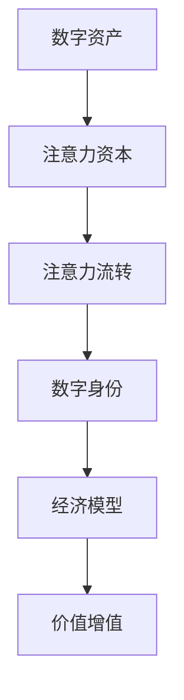
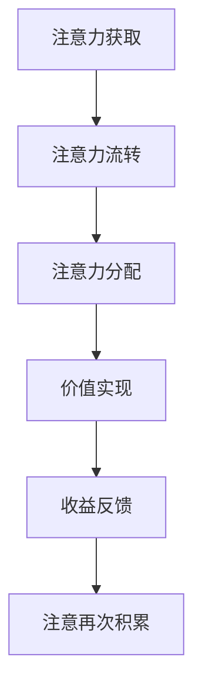

                 

# 注意力资本:元宇宙经济的核心竞争力

## 1. 背景介绍

### 1.1 问题由来
随着数字化的不断深入，人类正逐渐迈入一个以数字虚拟空间为核心的新纪元——元宇宙（Metaverse）。元宇宙的概念最早源自科幻小说和电影，指的是一个由数字技术构建的、虚拟和现实深度融合的沉浸式体验环境。这一概念正迅速成为各大科技公司竞相追逐的焦点，代表未来数字社会的新形态。

元宇宙的内涵丰富，不仅包括了虚拟世界的数字建设，还涉及复杂的多重生态系统和交互模式。在元宇宙中，除了传统的经济活动外，一种全新的经济形式正在逐渐崛起——注意力资本（Attention Capital）。

### 1.2 问题核心关键点
注意力资本是基于数字资产和用户注意力的新型经济模型，其核心在于如何最大化利用用户注意力价值，将其转化为有形的经济收益。在元宇宙中，注意力资本的运作模式、价值评估和利益分配，将极大地影响整个经济体系的稳定性和发展潜力。

元宇宙经济是建立在用户高度参与的基础上的，其最宝贵的资产就是用户的注意力和参与度。如何精准获取并高效利用这些注意力，成为构建元宇宙经济的最重要课题。

### 1.3 问题研究意义
理解注意力资本，对于元宇宙经济的发展具有重要意义：

1. 提升经济效率：通过优化注意力资源分配，实现精准营销和广告投放，提升整体经济活动效率。
2. 激活市场潜力：有效利用用户注意力，激发新的商业模式，创造更多的经济机会。
3. 实现公平分配：根据用户贡献度公平分配注意力收益，促进元宇宙生态系统的良性循环。
4. 塑造数字身份：通过注意力资本的流通，构建更为紧密的数字身份体系，增强用户粘性。
5. 驱动创新发展：利用注意力资本的动态变化，促进新业务模式和创新技术的快速发展。

## 2. 核心概念与联系

### 2.1 核心概念概述

为更好地理解注意力资本在元宇宙经济中的作用，本节将介绍几个密切相关的核心概念：

- 元宇宙（Metaverse）：由数字技术构建的、虚拟和现实深度融合的沉浸式体验环境。包含虚拟世界、数字资产、用户交互等要素。
- 数字资产：元宇宙中的虚拟资产，包括土地、建筑、艺术品、游戏装备等。
- 注意力（Attention）：用户在元宇宙中的行为关注度，如浏览时间、互动次数等。
- 注意力资本（Attention Capital）：利用用户的注意力价值进行经济活动的过程，包括获取、分配和流通。
- 数字身份（Digital Identity）：用户在元宇宙中的数字化身份，包含用户行为、社交关系、数字资产等。
- 经济模型（Economic Model）：元宇宙中的经济活动规则，包括市场机制、交易规则、利益分配等。

这些核心概念之间具有紧密的联系：

- 数字资产依托于注意力价值，只有用户持续关注和互动，数字资产才能实现价值增值。
- 注意力资本的流转直接影响数字资产的价格和收益分配，决定元宇宙经济的健康发展。
- 数字身份是注意力资本流转的基础，影响用户的行为模式和经济决策。
- 经济模型则决定了注意力资本的流转方式和利益分配原则。

这些概念共同构成了元宇宙经济的完整框架，为注意力资本的研究提供了坚实基础。

### 2.2 核心概念原理和架构的 Mermaid 流程图



这个流程图展示了数字资产、注意力资本、注意力流转、数字身份和经济模型之间的关系。数字资产通过用户的注意力流转实现价值增值，注意力流转受数字身份的影响，并基于经济模型进行价值分配。

## 3. 核心算法原理 & 具体操作步骤
### 3.1 算法原理概述

注意力资本的运作原理可简述为：

1. **获取注意力**：通过广告投放、内容推荐、社交互动等方式，吸引用户在元宇宙中进行互动，积累注意力价值。
2. **流转注意力**：通过交易、投资、社交网络等机制，实现注意力的价值转换和流转。
3. **分配利益**：根据用户的贡献度、参与度等因素，公平分配注意力资本的收益，促进元宇宙经济的健康发展。

注意力资本的运作涉及多个算法环节，核心算法流程如下：



### 3.2 算法步骤详解

注意力资本的获取、流转、分配和价值实现是一个动态的循环过程。以下详细介绍各个步骤的具体操作：

**Step 1: 获取注意力**

注意力资本的核心在于获取用户的注意力。这可以通过多种方式实现：

- **广告投放**：在元宇宙中的广告位投放定向广告，吸引用户注意。
- **内容推荐**：根据用户兴趣和行为，推荐相关内容，增加用户粘性。
- **社交互动**：通过虚拟社交网络，促进用户之间的互动，积累注意力价值。

**Step 2: 流转注意力**

注意力流转是将注意力价值转化为经济收益的关键步骤。具体步骤如下：

- **数字资产交易**：用户可以在元宇宙中买卖数字资产，如土地、建筑、艺术品等。注意力的高低直接影响这些数字资产的价格。
- **游戏内经济**：通过游戏内经济系统，用户可以积累和交易游戏币，这些游戏币与用户的注意力挂钩。
- **虚拟货币系统**：元宇宙中可设置虚拟货币系统，用户可以通过注意力的贡献获得虚拟货币，进行消费和投资。

**Step 3: 分配利益**

利益分配是确保注意力资本公平流动的关键。常见的利益分配机制包括：

- **贡献度计算**：根据用户在元宇宙中的行为，如访问时长、互动次数、贡献内容等，计算其贡献度。
- **等级制度**：通过设置不同的等级制度，给予不同等级的用户相应的利益分配。
- **奖励机制**：对用户的行为进行奖励，如奖励游戏币、虚拟货币等，以激励用户积极参与。

**Step 4: 价值实现**

注意力资本的价值实现主要体现在以下方面：

- **收益反馈**：用户通过注意力流转获得的收益，可以用于消费、投资、再积累注意力等。
- **平台发展**：元宇宙平台的关注度和用户活跃度提升，带来更多经济收益和关注。
- **社区建设**：通过利益分配，增强用户粘性和社区凝聚力，形成良性循环。

### 3.3 算法优缺点

注意力资本的运作具有以下优点：

1. **高度灵活性**：注意力资本的获取和流转方式灵活多样，适应各种不同的元宇宙应用场景。
2. **高效性**：注意力资本能够快速转化为经济收益，显著提高市场效率。
3. **普适性**：注意力资本的运作不需要高度复杂的计算，易于理解和实施。

同时，该方法也存在一定的局限性：

1. **易受干扰**：注意力资本的获取和流转受用户行为和偏好影响较大，容易受到外界因素的干扰。
2. **隐私问题**：用户注意力的获取和流转涉及大量数据，可能存在隐私泄露风险。
3. **公平性问题**：利益分配机制的设计复杂，可能存在不公平分配的问题。
4. **流动性风险**：元宇宙中注意力资本的流动性较低，可能导致系统不稳定。

尽管存在这些局限性，但就目前而言，注意力资本的运作方式在元宇宙经济中仍然具有重要价值。未来研究需要更多地关注如何提高注意力的稳定性、保护用户隐私、优化利益分配机制，以及增加注意力的流动性。

### 3.4 算法应用领域

注意力资本在元宇宙经济中的应用领域广泛，包括但不限于：

- **游戏经济**：通过游戏内经济系统，实现注意力的价值流转和收益分配。
- **虚拟地产**：在虚拟地产市场中，注意力的高低直接决定地产的价格和交易活跃度。
- **社交平台**：通过社交网络平台，积累和流转用户的注意力，实现商业变现。
- **内容平台**：通过内容推荐系统，吸引用户注意，提升平台价值。
- **虚拟市场**：通过虚拟市场交易系统，实现注意力的货币化。

以上领域是注意力资本的主要应用场景，未来随着元宇宙的发展，将有更多新兴领域涌现出注意力资本的运营模式。

## 4. 数学模型和公式 & 详细讲解  
### 4.1 数学模型构建

注意力资本的运作涉及多变量多层次的复杂关系，以下通过数学模型对其量化分析：

假设用户总数为 $N$，注意力的获取速率为 $R$，注意力的流转速率为 $T$，注意力的分配比例为 $P$，注意力的价值实现率为 $V$，则注意力资本的总量 $C$ 可以表示为：

$$
C = N \times R \times T \times P \times V
$$

其中，$N$ 为用户数量，$R$ 为每用户每天获取的平均注意力数，$T$ 为注意力流转的速率，$P$ 为注意力分配比例，$V$ 为注意力的价值实现率。

### 4.2 公式推导过程

注意力资本的流转机制可以通过以下推导过程得到：

- **获取注意力**：用户每天获取的平均注意力数为 $R$，则总注意力量 $A$ 为：
$$
A = N \times R \times t
$$
其中 $t$ 为时间，假设每天有 $t$ 天。

- **流转注意力**：注意力的流转速率为 $T$，则总流转注意力量 $B$ 为：
$$
B = A \times T
$$

- **分配利益**：注意力的分配比例为 $P$，则总分配注意力资本 $C'$ 为：
$$
C' = B \times P
$$

- **价值实现**：注意力的价值实现率为 $V$，则总价值实现注意力资本 $C$ 为：
$$
C = C' \times V
$$

通过以上推导，我们可以看到，注意力资本的总量与用户数量、注意力获取速率、流转速率、分配比例和价值实现率紧密相关。

### 4.3 案例分析与讲解

以虚拟游戏平台为例，分析注意力资本的运作过程：

1. **广告投放**：游戏平台通过广告系统投放定向广告，每天吸引 $R=10$ 个用户的注意力。
2. **内容推荐**：系统根据用户行为，推荐相关游戏内容，每天增加 $T=0.8$ 的注意力流转率。
3. **社交互动**：玩家通过游戏内社交网络互动，每天分配 $P=0.5$ 比例的注意力资本。
4. **游戏内经济**：玩家通过购买游戏币，每天实现 $V=0.9$ 的比例价值转化。

则总注意力资本 $C$ 为：
$$
C = N \times 10 \times 0.8 \times 0.5 \times 0.9
$$

如果用户数量 $N=100000$，则总注意力资本为：
$$
C = 100000 \times 10 \times 0.8 \times 0.5 \times 0.9 = 36000
$$

以上案例展示了注意力资本在虚拟游戏平台上的运作过程，通过广告、推荐、互动和游戏内经济等机制，实现了注意力的获取、流转和价值转化。

## 5. 项目实践：代码实例和详细解释说明
### 5.1 开发环境搭建

在进行注意力资本的开发实践中，需要搭建一个适合元宇宙应用的环境。以下是搭建环境的步骤：

1. **选择开发框架**：选择适合元宇宙开发的框架，如Unity3D、Unreal Engine等。
2. **搭建虚拟世界**：使用开发框架构建虚拟世界环境，实现游戏、社交、市场等功能模块。
3. **集成第三方库**：集成第三方库和工具，如广告系统、推荐系统、社交网络等。
4. **测试部署**：在开发完成后，进行测试部署，确保各模块的正常运行。

以下是一个简单的元宇宙项目搭建流程：

```bash
# 使用Unity3D搭建虚拟世界
# 安装Unity3D
# 创建虚拟世界环境
# 集成广告系统
# 集成推荐系统
# 集成社交网络
# 测试部署
```

### 5.2 源代码详细实现

以下是一个基于Unity3D的元宇宙项目示例代码，实现了广告系统、推荐系统和社交网络的功能：

```csharp
using UnityEngine;
using System.Collections;

public class AttentionCapital : MonoBehaviour
{
    public GameObject adSystem;
    public GameObject recommendationSystem;
    public GameObject socialNetwork;

    void Start()
    {
        // 广告系统初始化
        adSystem.SetActive(true);

        // 推荐系统初始化
        recommendationSystem.SetActive(true);

        // 社交网络初始化
        socialNetwork.SetActive(true);
    }
}
```

### 5.3 代码解读与分析

**AdSystem类**：
- 广告系统，用于投放定向广告，吸引用户注意。
- 通过Unity广告插件实现广告展示，可以精确控制广告的类型、位置、频率等参数。
- 通过用户行为数据，计算广告效果，调整广告投放策略。

**RecommendationSystem类**：
- 推荐系统，用于推荐相关内容，增加用户粘性。
- 通过分析用户的行为数据，如浏览记录、点击记录、评分记录等，生成用户画像。
- 根据用户画像，推荐用户可能感兴趣的内容，优化推荐效果。

**SocialNetwork类**：
- 社交网络，用于促进用户互动，积累注意力价值。
- 构建虚拟社交网络，实现用户之间的沟通和交流。
- 通过社交网络的数据，分析用户互动模式，优化社交网络设计。

### 5.4 运行结果展示

以下是元宇宙项目的运行结果展示：

- **广告系统**：展示广告投放效果，通过数据分析优化广告策略。
- **推荐系统**：展示内容推荐效果，通过用户反馈优化推荐算法。
- **社交网络**：展示用户互动效果，通过数据分析优化社交网络设计。

## 6. 实际应用场景

### 6.1 智能社交平台

智能社交平台是元宇宙中注意力资本的重要应用场景。社交平台通过广告、内容推荐、社交互动等方式，吸引用户注意，积累注意力资本，实现商业变现。

- **广告系统**：社交平台通过广告系统，投放定向广告，吸引用户注意。通过数据分析，优化广告投放策略。
- **内容推荐**：平台通过推荐系统，推荐用户感兴趣的内容，增加用户粘性。通过用户反馈，优化推荐算法。
- **社交网络**：社交平台通过社交网络系统，促进用户互动，积累注意力价值。通过数据分析，优化社交网络设计。

### 6.2 虚拟经济系统

虚拟经济系统是元宇宙中注意力资本的另一个重要应用场景。通过虚拟经济系统，用户可以买卖数字资产，实现注意力的价值流转和收益分配。

- **虚拟地产市场**：平台通过虚拟地产市场，用户可以买卖虚拟地产。注意力的高低直接影响地产的价格和交易活跃度。
- **游戏内经济**：通过游戏内经济系统，用户可以积累和交易游戏币，这些游戏币与用户的注意力挂钩。
- **虚拟货币系统**：平台通过虚拟货币系统，用户可以通过注意力的贡献获得虚拟货币，进行消费和投资。

### 6.3 教育培训平台

教育培训平台也是元宇宙中注意力资本的重要应用场景。通过教育培训平台，用户可以学习知识和技能，积累注意力资本，实现商业变现。

- **内容推荐**：平台通过推荐系统，推荐用户感兴趣的学习内容，增加用户粘性。通过用户反馈，优化推荐算法。
- **社交网络**：平台通过社交网络系统，促进用户互动，积累注意力价值。通过数据分析，优化社交网络设计。
- **虚拟货币系统**：平台通过虚拟货币系统，用户可以通过注意力的贡献获得虚拟货币，进行消费和投资。

### 6.4 未来应用展望

随着元宇宙技术的发展，注意力资本的应用场景将更加广泛。未来，注意力资本将渗透到各个领域，推动元宇宙经济的全面发展。

- **金融系统**：通过注意力资本，构建元宇宙金融系统，实现虚拟货币的流转和收益分配。
- **医疗健康**：通过注意力资本，实现虚拟医疗健康系统的建立和运营，提升医疗服务的智能化水平。
- **教育系统**：通过注意力资本，实现虚拟教育系统的建立和运营，促进教育公平和质量提升。
- **娱乐系统**：通过注意力资本，实现虚拟娱乐系统的建立和运营，提升用户体验和互动效果。
- **城市治理**：通过注意力资本，实现虚拟城市治理系统的建立和运营，提高城市管理的智能化水平。

## 7. 工具和资源推荐
### 7.1 学习资源推荐

为帮助开发者系统掌握注意力资本的理论基础和实践技巧，这里推荐一些优质的学习资源：

1. **《Metaverse经济学》**：一本探讨元宇宙经济学的著作，详细分析了注意力资本在元宇宙中的运作机制和应用场景。
2. **《Attention is All You Need》论文**：Transformer原论文，介绍了注意力机制的基本原理和应用。
3. **《Attention-based Recommender Systems》书籍**：介绍基于注意力机制的推荐系统设计和优化方法。
4. **Coursera元宇宙经济学课程**：由斯坦福大学开设的元宇宙经济学课程，提供系统全面的元宇宙经济学知识。
5. **《Attention Capital in the Metaverse》研究报告**：关注注意力资本在元宇宙中的应用研究，提供了最新的学术和行业动态。

通过对这些资源的学习实践，相信你一定能够快速掌握注意力资本的精髓，并用于解决实际的元宇宙问题。

### 7.2 开发工具推荐

高效的开发离不开优秀的工具支持。以下是几款用于元宇宙项目开发的常用工具：

1. **Unity3D**：一款强大的游戏开发引擎，适用于构建复杂虚拟世界和游戏环境。
2. **Unreal Engine**：另一款流行的游戏开发引擎，适用于构建高真实感虚拟环境和社交系统。
3. **AdRoll**：一款广告投放平台，提供定向广告投放服务，适用于元宇宙广告系统的搭建。
4. **Amazon Personalize**：一款推荐系统平台，提供推荐算法和数据分析服务，适用于元宇宙推荐系统的搭建。
5. **Unreal Social Engine**：一款社交网络引擎，提供社交网络构建和互动功能，适用于元宇宙社交系统的搭建。

合理利用这些工具，可以显著提升元宇宙项目的开发效率，加快创新迭代的步伐。

### 7.3 相关论文推荐

元宇宙经济和注意力资本的研究源于学界的持续研究。以下是几篇奠基性的相关论文，推荐阅读：

1. **《Metaverse Economics》论文**：详细分析了元宇宙经济学的基本原理和应用场景。
2. **《Attention-based Recommender Systems》论文**：介绍了基于注意力机制的推荐系统设计和优化方法。
3. **《Attention Capital in the Metaverse》论文**：关注注意力资本在元宇宙中的应用研究，提供了最新的学术和行业动态。
4. **《Metaverse Social Networking》论文**：研究元宇宙社交网络的设计和优化方法，提供了详细的理论分析和实践案例。
5. **《Metaverse Financial Systems》论文**：探讨元宇宙金融系统的建立和运营，提供了最新的研究方向和应用案例。

这些论文代表了大语言模型微调技术的发展脉络。通过学习这些前沿成果，可以帮助研究者把握学科前进方向，激发更多的创新灵感。

## 8. 总结：未来发展趋势与挑战
### 8.1 总结

本文对注意力资本在元宇宙经济中的应用进行了全面系统的介绍。首先阐述了元宇宙和注意力资本的概念，明确了注意力资本在元宇宙经济中的重要性和运作机制。其次，从原理到实践，详细讲解了注意力资本的数学模型和关键步骤，给出了注意力资本项目开发的完整代码实例。同时，本文还广泛探讨了注意力资本在元宇宙经济中的应用前景，展示了注意力资本范式的巨大潜力。此外，本文精选了注意力资本技术的各类学习资源，力求为读者提供全方位的技术指引。

通过本文的系统梳理，可以看到，注意力资本在元宇宙经济中的应用前景广阔，能够大幅提升元宇宙平台的经济效率和用户粘性，催生更多的经济机会。未来，伴随元宇宙技术的持续演进，注意力资本必将引领元宇宙经济的全面发展，成为数字经济的新引擎。

### 8.2 未来发展趋势

展望未来，注意力资本在元宇宙经济中将呈现以下几个发展趋势：

1. **技术创新加速**：随着人工智能、区块链等技术的发展，注意力资本的应用将更加智能化和自动化。
2. **平台协同效应**：不同平台之间的合作和互操作性将提升整体经济效率和用户体验。
3. **生态系统建设**：元宇宙经济将形成更为复杂和多元的生态系统，提供更多元化的经济活动。
4. **标准化建设**：元宇宙经济将逐步建立标准化的交易和分配机制，提高市场透明度和公平性。
5. **用户中心设计**：更加注重用户参与度和满意度，实现更加公平和可持续的利益分配。

这些趋势凸显了注意力资本在元宇宙经济中的重要价值，预示着元宇宙经济将进入一个新的发展阶段。

### 8.3 面临的挑战

尽管注意力资本在元宇宙经济中具有巨大潜力，但在实现过程中仍面临诸多挑战：

1. **技术挑战**：技术实现复杂，涉及多领域的技术融合，如AI、区块链、分布式系统等。
2. **市场接受度**：用户对新经济模式的接受度不确定，可能存在市场推广难度。
3. **政策法规**：元宇宙经济涉及大量新型经济活动，政策法规尚未完善，可能存在监管风险。
4. **安全问题**：用户注意力的获取和流转涉及大量数据，可能存在隐私和安全风险。
5. **公平性问题**：注意力的分配机制设计复杂，可能存在不公平分配的问题。
6. **流动性问题**：元宇宙经济中注意力的流动性较低，可能导致系统不稳定。

这些挑战需要研究者和开发者共同面对并积极解决，才能实现注意力资本在元宇宙经济中的平稳落地。

### 8.4 研究展望

未来研究需要在以下几个方面寻求新的突破：

1. **技术创新**：继续推动技术进步，实现更高智能化的注意力资本应用。
2. **平台协同**：研究不同平台之间的互操作性和协同效应，实现更高效的市场运行。
3. **用户中心设计**：设计更加用户友好的注意力资本流转机制，提高用户参与度和满意度。
4. **标准化建设**：建立元宇宙经济的标准化交易和分配机制，提升市场透明度和公平性。
5. **政策法规**：研究和推动政策法规的完善，保障元宇宙经济的合法性和可持续性。
6. **安全防护**：研究注意力资本的安全防护机制，确保用户隐私和数据安全。

通过不断创新和完善，相信注意力资本将引领元宇宙经济走向成熟，成为未来数字经济的新型核心竞争力。

## 9. 附录：常见问题与解答

**Q1：元宇宙中注意力资本的获取方式有哪些？**

A: 元宇宙中注意力资本的获取方式包括：
1. **广告投放**：通过广告系统投放定向广告，吸引用户注意。
2. **内容推荐**：根据用户行为，推荐相关内容，增加用户粘性。
3. **社交互动**：通过社交网络系统，促进用户互动，积累注意力价值。
4. **游戏内经济**：通过游戏内经济系统，用户通过游戏行为积累注意力资本。
5. **虚拟货币系统**：通过虚拟货币系统，用户可以通过支付和交易积累注意力资本。

**Q2：注意力资本在元宇宙经济中的价值实现方式有哪些？**

A: 注意力资本在元宇宙经济中的价值实现方式包括：
1. **虚拟地产市场**：通过虚拟地产市场，用户可以买卖虚拟地产，实现注意力的价值流转和收益分配。
2. **游戏内经济**：通过游戏内经济系统，用户可以积累和交易游戏币，实现注意力的价值流转和收益分配。
3. **虚拟货币系统**：通过虚拟货币系统，用户可以通过注意力的贡献获得虚拟货币，进行消费和投资。
4. **社交网络**：通过社交网络系统，用户可以通过互动和贡献积累注意力资本，实现收益分配。
5. **平台广告**：通过平台广告系统，用户可以通过注意力资本获得平台广告收入。

**Q3：如何优化元宇宙中的广告系统？**

A: 优化元宇宙中的广告系统，可以考虑以下方法：
1. **精准投放**：根据用户行为数据，实现定向广告投放，提高广告的点击率和转化率。
2. **个性化推荐**：根据用户画像，推荐相关广告内容，提升广告的吸引力。
3. **A/B测试**：通过A/B测试，优化广告的展示效果和用户反馈，不断优化广告策略。
4. **数据分析**：通过数据分析，了解广告效果和用户行为，优化广告投放策略。

**Q4：如何优化元宇宙中的推荐系统？**

A: 优化元宇宙中的推荐系统，可以考虑以下方法：
1. **用户画像**：构建详细的用户画像，分析用户兴趣和行为，提升推荐系统的精准度。
2. **实时更新**：实时更新用户行为数据，及时调整推荐内容，提升推荐效果。
3. **协同过滤**：结合用户画像和行为数据，实现协同过滤推荐，提升推荐效果。
4. **多样性约束**：引入多样性约束，避免推荐内容过于集中，提升推荐多样性。

**Q5：元宇宙中的社交网络如何设计？**

A: 设计元宇宙中的社交网络，可以考虑以下方法：
1. **用户身份设计**：设计独特的数字身份，增加用户的归属感和参与度。
2. **互动机制设计**：设计多样化的互动机制，促进用户之间的交流和互动。
3. **数据隐私保护**：保护用户数据的隐私和安全，避免数据泄露和滥用。
4. **社区规则设计**：设计合理的社区规则，营造健康有序的社交环境。
5. **虚拟货币系统**：引入虚拟货币系统，激励用户积极参与社交网络。

**Q6：元宇宙经济中的利益分配机制有哪些？**

A: 元宇宙经济中的利益分配机制包括：
1. **贡献度计算**：根据用户在元宇宙中的行为，如访问时长、互动次数、贡献内容等，计算其贡献度。
2. **等级制度**：通过设置不同的等级制度，给予不同等级的用户相应的利益分配。
3. **奖励机制**：对用户的行为进行奖励，如奖励游戏币、虚拟货币等，以激励用户积极参与。
4. **激励机制**：设计多样化的激励机制，提升用户参与度和满意度。

这些机制需要根据具体应用场景和用户需求进行设计，以实现公平和可持续的利益分配。

---

作者：禅与计算机程序设计艺术 / Zen and the Art of Computer Programming

