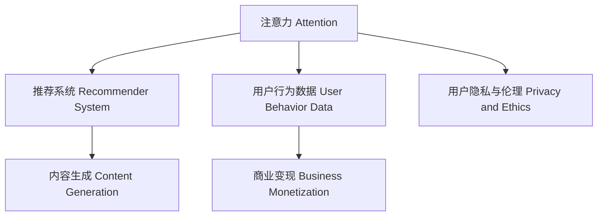

                 

# 注意力资本主义：AI时代的新经济模式

## 1. 背景介绍

### 1.1 问题由来

随着人工智能（AI）技术的不断成熟和普及，其在经济社会中的影响力逐渐凸显。AI不仅在生产制造、交通运输、金融保险等传统行业带来颠覆性变革，也在文化娱乐、教育培训、医疗健康等领域催生新的商业模式。其中，AI注意力资本主义作为AI时代的新经济模式，正在重新定义人类社会的工作、生活、消费方式。

注意力资本主义（Attention Capitalism）这一概念最早由经济学家约书亚·米切尔（Joshua Mitchell）提出，用来描述互联网时代消费者注意力资源被商业平台（如Google、Facebook、YouTube等）所争夺和利用的现象。这些平台通过算法推荐，精准捕获用户的注意力，并转化为商业价值。

而随着AI技术的进一步应用，注意力资本主义的范畴得以进一步扩展。基于深度学习等AI技术的推荐系统、内容生成、数据分析等应用，使得平台能够更智能、更个性化地引导用户注意力，从而实现更高效的商业变现。这种由AI驱动的注意力管理方式，不仅改变了消费者与产品的交互方式，也重塑了经济运行的规则。

### 1.2 问题核心关键点

注意力资本主义的核心在于如何利用AI技术，高效、精准地捕获和利用消费者的注意力资源，实现商业价值的最大化。主要包括以下几个关键点：

- **用户注意力资源的获取**：通过算法推荐、内容生成等手段，精准定位用户兴趣，提高用户参与度。
- **用户行为数据的分析与优化**：利用AI对用户行为数据进行深度分析，优化推荐算法和内容生成策略。
- **商业变现模式的创新**：通过精准定位和个性化推荐，实现更高效的广告投放、用户订阅、增值服务等商业变现模式。
- **数据隐私与伦理问题**：在捕获和利用用户注意力时，如何保护用户隐私，避免数据滥用和伦理风险。

本文将从理论到实践，深入探讨注意力资本主义的原理、算法和应用，帮助读者全面理解AI在经济中的应用，以及其带来的机遇与挑战。

## 2. 核心概念与联系

### 2.1 核心概念概述

为了深入理解注意力资本主义，我们先介绍几个核心概念：

- **注意力（Attention）**：在AI中，注意力是指模型在进行信息处理时，选择关注哪些输入的重要性。例如，Transformer模型中，注意力机制使得模型能够同时关注输入序列的各个部分，从而提升模型对长序列的建模能力。

- **推荐系统（Recommender System）**：推荐系统是一种基于用户行为数据和历史偏好，推荐物品或内容的系统。AI技术，特别是深度学习、自然语言处理等，使得推荐系统能够更加精准地预测用户偏好，提升推荐效果。

- **内容生成（Content Generation）**：内容生成是指利用AI技术自动生成文本、图像、视频等内容。AI模型，如GPT-3、DALL-E等，可以在短时间内生成高质量、多样化的内容，大大降低了内容生产的成本。

- **注意力资本主义**：指利用AI技术，通过精准捕获和利用消费者的注意力，实现商业价值最大化。例如，通过个性化推荐、内容生成等手段，提升用户参与度和留存率，从而增加广告收入、用户订阅等。

这些概念之间的联系可以通过以下Mermaid流程图来展示：



这个流程图展示了几组概念之间的关系：

1. 注意力机制是推荐系统和内容生成的基础，使得模型能够更加精准地关注和理解用户需求。
2. 用户行为数据是模型训练和优化推荐算法的重要依据。
3. 通过精准的推荐和内容生成，能够提升用户参与度和留存率，从而实现商业变现。
4. 在捕获和利用用户注意力时，需要考虑数据隐私和伦理问题，确保用户权益不被侵犯。

## 3. 核心算法原理 & 具体操作步骤

### 3.1 算法原理概述

注意力资本主义的核心算法原理主要围绕以下几个方面展开：

- **自监督学习（Self-supervised Learning）**：利用无标签数据进行模型训练，如使用掩码语言模型（Masked Language Modeling, MLM）等自监督任务，训练出高质量的预训练模型。
- **推荐系统算法**：基于协同过滤、矩阵分解、深度学习等技术，构建个性化推荐模型，实现精准推荐。
- **内容生成算法**：如Transformer、GPT等模型，通过文本生成、图像生成等任务，自动生成高质量内容。

这些算法共同构成了注意力资本主义的计算基础，使得平台能够高效、精准地捕获和利用用户注意力。

### 3.2 算法步骤详解

以下我们将详细介绍注意力资本主义的算法步骤：

**Step 1: 数据预处理**

数据预处理是注意力资本主义算法的第一步，主要包括以下步骤：

1. 数据收集：收集用户的历史行为数据，包括浏览记录、购买记录、评分数据等。
2. 数据清洗：清洗噪声数据、缺失数据，确保数据质量。
3. 数据增强：通过数据扩充、回译等技术，提高数据多样性和丰富度。

**Step 2: 模型训练与优化**

在数据预处理后，需要构建和训练推荐系统和内容生成模型，具体步骤如下：

1. 选择合适的模型架构，如基于深度学习的神经网络模型。
2. 设置训练参数，包括学习率、批大小、迭代次数等。
3. 利用预处理后的数据进行模型训练，优化模型参数。
4. 采用正则化、Dropout等技术，避免过拟合。
5. 在验证集上进行模型评估，选择合适的超参数组合。

**Step 3: 注意力捕获与利用**

在模型训练完成后，需要利用模型捕获和利用用户的注意力，实现商业变现。主要步骤如下：

1. 利用模型进行推荐，如在电商平台上推荐商品，或在新闻平台上推荐新闻。
2. 利用模型生成内容，如自动生成新闻、广告文案等。
3. 通过广告投放、用户订阅等形式，将注意力转化为商业价值。
4. 实时监控模型性能，根据用户反馈进行调整和优化。

### 3.3 算法优缺点

注意力资本主义算法具有以下优点：

- **精准度提升**：通过深度学习等技术，能够更加精准地捕获用户需求，提高推荐效果和内容生成质量。
- **自动化程度高**：自动化的算法和模型训练流程，大大降低了人工成本和错误率。
- **个性化推荐**：基于用户历史行为和兴趣偏好，提供个性化的推荐和内容，提升用户体验。

但同时，注意力资本主义也存在一些缺点：

- **数据隐私问题**：用户数据的收集和利用可能带来隐私泄露和数据滥用的风险。
- **算法偏见**：模型训练数据和算法本身可能存在偏见，导致不公平的推荐和内容生成。
- **广告滥用**：过度依赖广告变现，可能带来消费者反感和市场饱和问题。

### 3.4 算法应用领域

注意力资本主义算法广泛应用于以下几个领域：

- **电商推荐**：如亚马逊、淘宝等电商平台，通过推荐系统推荐商品，提升用户购买率。
- **内容分发**：如Netflix、YouTube等平台，通过内容推荐和生成，提升用户留存率和满意度。
- **广告投放**：如Google、Facebook等平台，通过精准定位和推荐，实现高效的广告变现。
- **金融风控**：通过风险评估和信用评分模型，防范金融风险。
- **智能客服**：通过聊天机器人，提供个性化咨询服务。

## 4. 数学模型和公式 & 详细讲解 & 举例说明

### 4.1 数学模型构建

注意力资本主义的核心数学模型包括推荐系统模型和内容生成模型。以下是两个典型模型的构建方法：

**推荐系统模型**：

假设用户与物品的关系可以用矩阵 $U \in \mathbb{R}^{N \times D}$ 和 $V \in \mathbb{R}^{D \times M}$ 表示，其中 $N$ 是用户数，$M$ 是物品数，$D$ 是用户-物品表示的维度。推荐系统模型的目标是最小化损失函数：

$$
\min_{U,V} \frac{1}{2} \sum_{i=1}^N \sum_{j=1}^M (y_{ij} - \hat{y}_{ij})^2 + \lambda \|U\|_F^2 + \gamma \|V\|_F^2
$$

其中 $y_{ij}$ 是用户 $i$ 对物品 $j$ 的真实评分，$\hat{y}_{ij}$ 是模型预测的评分，$\lambda$ 和 $\gamma$ 是正则化参数。

**内容生成模型**：

以Transformer模型为例，生成文本的数学模型可以表示为：

$$
p(x_t|x_{<t}, y) = \text{softmax}(e^{W_h \cdot h_{t-1} + b_h + W_c \cdot c_{t-1} + b_c})
$$

其中 $x_t$ 是时间步 $t$ 的输出符号，$h_{t-1}$ 是时间步 $t-1$ 的隐藏状态，$c_{t-1}$ 是时间步 $t-1$ 的上下文向量，$W_h$ 和 $b_h$ 是编码器中的参数，$W_c$ 和 $b_c$ 是解码器中的参数。

### 4.2 公式推导过程

以下是两个模型的公式推导过程：

**推荐系统模型公式推导**：

假设用户 $i$ 对物品 $j$ 的真实评分为 $y_{ij}$，模型的预测评分为 $\hat{y}_{ij}$，则推荐系统的损失函数为：

$$
\mathcal{L} = \frac{1}{2} \sum_{i=1}^N \sum_{j=1}^M (y_{ij} - \hat{y}_{ij})^2
$$

利用梯度下降法优化模型，得到模型参数更新公式：

$$
U_{new} = U - \eta \nabla_U \mathcal{L}
$$
$$
V_{new} = V - \eta \nabla_V \mathcal{L}
$$

其中 $\eta$ 是学习率，$\nabla_U \mathcal{L}$ 和 $\nabla_V \mathcal{L}$ 是损失函数对 $U$ 和 $V$ 的梯度。

**内容生成模型公式推导**：

以Transformer模型为例，生成文本的推导过程如下：

1. 编码器输出：

$$
h_t = \text{softmax}(e^{W_h \cdot h_{t-1} + b_h + W_c \cdot c_{t-1} + b_c) \cdot V
$$

2. 解码器输出：

$$
p(x_t|x_{<t}, y) = \text{softmax}(e^{W_h \cdot h_{t-1} + b_h + W_c \cdot c_{t-1} + b_c})
$$

3. 预测下一个符号：

$$
\hat{x}_t = \arg\max_x p(x_t|x_{<t}, y)
$$

4. 模型预测：

$$
x_t = \hat{x}_t
$$

### 4.3 案例分析与讲解

**电商推荐系统案例**：

假设某电商网站收集了用户的历史行为数据，包括浏览记录、购买记录、评分数据等。通过深度学习算法构建推荐模型，用户 $i$ 对物品 $j$ 的真实评分为 $y_{ij}$，模型的预测评分为 $\hat{y}_{ij}$，则推荐系统的损失函数为：

$$
\mathcal{L} = \frac{1}{2} \sum_{i=1}^N \sum_{j=1}^M (y_{ij} - \hat{y}_{ij})^2
$$

利用梯度下降法优化模型，得到模型参数更新公式：

$$
U_{new} = U - \eta \nabla_U \mathcal{L}
$$
$$
V_{new} = V - \eta \nabla_V \mathcal{L}
$$

其中 $\eta$ 是学习率，$\nabla_U \mathcal{L}$ 和 $\nabla_V \mathcal{L}$ 是损失函数对 $U$ 和 $V$ 的梯度。

**内容生成系统案例**：

假设某内容生成系统使用Transformer模型生成新闻。输入为时间步 $t-1$ 的隐藏状态 $h_{t-1}$ 和上下文向量 $c_{t-1}$，输出为时间步 $t$ 的下一个符号 $x_t$。模型的目标是最小化生成文本的交叉熵损失：

$$
\mathcal{L} = -\sum_{i=1}^N \sum_{j=1}^M y_{ij} \log p(x_t|x_{<t}, y)
$$

利用梯度下降法优化模型，得到模型参数更新公式：

$$
h_{new} = h - \eta \nabla_h \mathcal{L}
$$
$$
c_{new} = c - \eta \nabla_c \mathcal{L}
$$

其中 $\eta$ 是学习率，$\nabla_h \mathcal{L}$ 和 $\nabla_c \mathcal{L}$ 是损失函数对 $h$ 和 $c$ 的梯度。

## 5. 项目实践：代码实例和详细解释说明

### 5.1 开发环境搭建

在进行注意力资本主义项目实践前，我们需要准备好开发环境。以下是使用Python进行TensorFlow开发的环境配置流程：

1. 安装Anaconda：从官网下载并安装Anaconda，用于创建独立的Python环境。

2. 创建并激活虚拟环境：
```bash
conda create -n attention_capitalism python=3.8 
conda activate attention_capitalism
```

3. 安装TensorFlow：根据CUDA版本，从官网获取对应的安装命令。例如：
```bash
conda install tensorflow==2.7
```

4. 安装Keras：
```bash
pip install keras
```

5. 安装各类工具包：
```bash
pip install numpy pandas scikit-learn matplotlib tqdm jupyter notebook ipython
```

完成上述步骤后，即可在`attention_capitalism`环境中开始项目实践。

### 5.2 源代码详细实现

下面我们以电商推荐系统为例，给出使用TensorFlow和Keras进行推荐系统开发的PyTorch代码实现。

首先，定义推荐系统的数据处理函数：

```python
import tensorflow as tf
from tensorflow.keras.layers import Input, Embedding, Dense, Flatten, Dot, Dropout, Concatenate, Model
from tensorflow.keras.optimizers import Adam

class RecommenderSystem(tf.keras.Model):
    def __init__(self, N, M, D):
        super(RecommenderSystem, self).__init__()
        self.U = Embedding(N, D, input_length=1)
        self.V = Embedding(M, D, input_length=1)
        self.dot = Dot(axes=[2, 2])
        self.dropout = Dropout(0.2)
        self.flatten = Flatten()
        self.dense = Dense(1, activation='linear')

    def call(self, user, item):
        u = self.U(user)
        v = self.V(item)
        dot = self.dot([u, v])
        x = self.dropout(dot)
        x = self.flatten(x)
        x = self.dense(x)
        return x

# 定义损失函数和优化器
def loss_function(y_true, y_pred):
    return tf.keras.losses.mean_squared_error(y_true, y_pred)

def optimizer():
    return Adam(learning_rate=0.001)
```

然后，定义模型和训练函数：

```python
# 创建数据集
user_data = np.random.randint(1, N+1, size=(N, 1))
item_data = np.random.randint(1, M+1, size=(M, 1))
y_data = np.random.randint(1, 5, size=(N, M))

# 创建模型
model = RecommenderSystem(N, M, D)

# 定义训练函数
@tf.function
def train_step(user, item, y_true):
    with tf.GradientTape() as tape:
        y_pred = model(user, item)
        loss = loss_function(y_true, y_pred)
    grads = tape.gradient(loss, model.trainable_variables)
    optimizer.apply_gradients(zip(grads, model.trainable_variables))
    return loss

# 训练模型
epochs = 50
batch_size = 128

for epoch in range(epochs):
    for i in range(0, len(y_data), batch_size):
        batch_user = user_data[i:i+batch_size]
        batch_item = item_data[i:i+batch_size]
        batch_y = y_data[i:i+batch_size]
        loss = train_step(batch_user, batch_item, batch_y)
        print("Epoch {} Batch {} Loss {}".format(epoch+1, i, loss))
```

最后，评估模型：

```python
# 测试数据集
test_user = np.random.randint(1, N+1, size=(N_test, 1))
test_item = np.random.randint(1, M+1, size=(M_test, 1))
test_y = np.random.randint(1, 5, size=(N_test, M_test))

# 评估模型
y_pred = model(test_user, test_item)
print("Test Loss: ", loss_function(test_y, y_pred))
```

以上就是使用TensorFlow和Keras构建电商推荐系统的完整代码实现。可以看到，TensorFlow和Keras使得模型构建和训练的代码实现变得简洁高效。开发者可以将更多精力放在数据处理、模型改进等高层逻辑上，而不必过多关注底层的实现细节。

### 5.3 代码解读与分析

让我们再详细解读一下关键代码的实现细节：

**RecommenderSystem类**：
- `__init__`方法：初始化用户-物品嵌入层、点积层、dropout层、Flatten层和Dense层等关键组件。
- `call`方法：定义模型前向传播的过程。首先通过用户和物品的嵌入层生成表示向量，然后进行点积运算、dropout、Flatten和Dense层处理，最终输出预测结果。

**loss_function函数**：
- 定义均方误差损失函数，用于评估模型的预测精度。

**optimizer函数**：
- 定义Adam优化器，用于最小化损失函数。

**训练函数train_step**：
- 定义一个函数，用于在每个批次上计算损失函数、求梯度和更新模型参数。

**训练流程**：
- 定义总的epoch数和batch size，开始循环迭代。
- 在每个epoch内，对每个批次进行训练，输出损失值。

可以看到，TensorFlow和Keras使得注意力资本主义项目实践变得简洁高效。开发者可以更加专注于模型的设计、训练和优化，而不必过多关注底层实现细节。

当然，工业级的系统实现还需考虑更多因素，如模型的保存和部署、超参数的自动搜索、更灵活的任务适配层等。但核心的微调范式基本与此类似。

## 6. 实际应用场景

### 6.1 智能推荐系统

智能推荐系统是注意力资本主义的重要应用场景之一。通过推荐系统，电商平台可以精准推荐用户感兴趣的商品，提高用户购买率和留存率。具体应用如下：

1. **个性化推荐**：收集用户的历史浏览记录、购买记录和评分数据，利用推荐系统模型进行推荐，提升用户满意度。
2. **广告投放优化**：利用推荐系统对用户进行精准定位，提高广告投放的转化率和ROI。
3. **库存管理**：通过推荐系统的预测结果，优化库存管理和补货策略，减少库存积压和缺货。

### 6.2 内容分发平台

内容分发平台如Netflix、YouTube等，通过推荐系统和内容生成技术，提升用户观看和留存率。具体应用如下：

1. **内容推荐**：根据用户的观看历史和评分数据，推荐用户可能感兴趣的内容，提升用户粘性。
2. **个性化视频生成**：利用内容生成技术，生成高质量的视频内容，提升用户体验。
3. **用户行为分析**：通过内容推荐和观看数据，分析用户偏好和需求，优化内容策略和推荐算法。

### 6.3 金融风险管理

金融行业通过注意力资本主义技术，提升风险评估和信用评分模型的精度，降低金融风险。具体应用如下：

1. **信用评分模型**：通过深度学习算法，构建信用评分模型，精准评估用户的信用风险。
2. **风险预测**：利用推荐系统模型，预测用户的违约概率，优化贷款审批和风险控制策略。
3. **智能投顾**：通过推荐系统，为用户提供个性化的投资建议，提升资产管理效果。

### 6.4 未来应用展望

随着AI技术的进一步发展，注意力资本主义将广泛应用于更多领域，带来新的变革和机遇。

在智慧城市治理中，通过推荐系统和内容生成技术，提升城市管理和服务水平，实现智能化、精细化治理。

在医疗健康领域，利用推荐系统和内容生成技术，提升医疗咨询和诊断效果，优化医疗资源配置。

在教育培训领域，通过推荐系统和内容生成技术，提供个性化的学习资源和教学建议，提升教育效果和公平性。

未来，随着AI技术在更多领域的应用，注意力资本主义将带来更深远的影响，推动经济社会向智能化、普惠化方向发展。

## 7. 工具和资源推荐

### 7.1 学习资源推荐

为了帮助开发者系统掌握注意力资本主义的理论基础和实践技巧，这里推荐一些优质的学习资源：

1. 《深度学习》系列博文：由深度学习专家撰写，深入浅出地介绍了深度学习的基本概念和前沿技术。

2. 《推荐系统》课程：斯坦福大学开设的推荐系统课程，讲解了推荐系统算法、模型评估等核心内容。

3. 《内容生成与自然语言处理》书籍：全面介绍了基于深度学习的自然语言处理技术和内容生成方法。

4. 《Attention is All You Need》论文：Transformer模型的原始论文，详细介绍了Transformer的结构和注意力机制。

5. HuggingFace官方文档：Transformer库的官方文档，提供了丰富的预训练模型和微调样例代码。

通过对这些资源的学习实践，相信你一定能够全面理解注意力资本主义的核心原理和算法，掌握其实际应用技巧。

### 7.2 开发工具推荐

高效的开发离不开优秀的工具支持。以下是几款用于注意力资本主义开发的常用工具：

1. TensorFlow：基于Python的开源深度学习框架，支持分布式训练和高效计算，适合大规模工程应用。

2. PyTorch：基于Python的开源深度学习框架，动态计算图，适合快速迭代研究。

3. Keras：基于TensorFlow和Theano的高级神经网络API，提供简单易用的模型构建和训练接口。

4. Weights & Biases：模型训练的实验跟踪工具，记录和可视化模型训练过程中的各项指标，方便对比和调优。

5. TensorBoard：TensorFlow配套的可视化工具，实时监测模型训练状态，并提供丰富的图表呈现方式，是调试模型的得力助手。

6. Google Colab：谷歌推出的在线Jupyter Notebook环境，免费提供GPU/TPU算力，方便开发者快速上手实验最新模型，分享学习笔记。

合理利用这些工具，可以显著提升注意力资本主义项目的开发效率，加快创新迭代的步伐。

### 7.3 相关论文推荐

注意力资本主义的发展离不开学界的持续研究。以下是几篇奠基性的相关论文，推荐阅读：

1. Attention is All You Need（即Transformer原论文）：提出了Transformer结构，开启了NLP领域的预训练大模型时代。

2. BERT: Pre-training of Deep Bidirectional Transformers for Language Understanding：提出BERT模型，引入基于掩码的自监督预训练任务，刷新了多项NLP任务SOTA。

3. Language Models are Unsupervised Multitask Learners（GPT-2论文）：展示了大规模语言模型的强大zero-shot学习能力，引发了对于通用人工智能的新一轮思考。

4. Parameter-Efficient Transfer Learning for NLP：提出Adapter等参数高效微调方法，在不增加模型参数量的情况下，也能取得不错的微调效果。

5. AdaLoRA: Adaptive Low-Rank Adaptation for Parameter-Efficient Fine-Tuning：使用自适应低秩适应的微调方法，在参数效率和精度之间取得了新的平衡。

这些论文代表了大语言模型微调技术的发展脉络。通过学习这些前沿成果，可以帮助研究者把握学科前进方向，激发更多的创新灵感。

## 8. 总结：未来发展趋势与挑战

### 8.1 总结

本文对注意力资本主义进行了全面系统的介绍。首先阐述了注意力资本主义的背景和意义，明确了AI在经济中的应用场景和潜力。其次，从理论到实践，详细讲解了注意力资本主义的算法原理和操作步骤，帮助读者理解其核心思想和实现方法。最后，我们展望了注意力资本主义的发展趋势和面临的挑战，提出了未来研究方向和突破点。

通过本文的系统梳理，可以看到，注意力资本主义作为AI时代的新经济模式，正在重塑经济运行规则，推动社会进步。AI技术通过精准捕获和利用用户注意力，提升商业变现效率，带来巨大的经济效益和社会价值。未来，随着AI技术的进一步发展，注意力资本主义将更加深入地融入经济社会的各个角落，带来更多的机遇和挑战。

### 8.2 未来发展趋势

展望未来，注意力资本主义将呈现以下几个发展趋势：

1. **深度学习算法的进步**：深度学习算法的不断进步，使得推荐系统、内容生成等技术更加精准和高效。未来的注意力资本主义将更多地依赖于深度学习技术，提升用户体验和商业价值。

2. **跨领域应用的拓展**：注意力资本主义不仅在电商、内容分发、金融等领域发挥作用，还将在智慧城市、医疗健康、教育培训等领域广泛应用，推动更多行业实现智能化转型。

3. **数据隐私和安全**：随着用户对数据隐私的关注度提升，未来的注意力资本主义将更加重视数据隐私保护和安全性，确保用户权益不被侵犯。

4. **多模态数据的融合**：未来的注意力资本主义将更多地融合图像、语音、视频等多模态数据，提升推荐和内容生成的多样性和精准度。

5. **模型透明性和可解释性**：未来的模型将更加透明和可解释，帮助用户理解其决策过程，增强用户信任和接受度。

6. **个性化推荐算法**：未来的个性化推荐算法将更加智能和精细，能够更好地预测用户需求，提升推荐效果。

7. **实时性和低延迟**：未来的注意力资本主义将更加注重实时性和低延迟，满足用户即时性需求。

### 8.3 面临的挑战

尽管注意力资本主义在经济和社会中展现了巨大的潜力，但在其发展过程中，仍面临一些挑战：

1. **数据隐私和伦理问题**：用户在享受个性化推荐和内容生成带来的便利时，数据隐私和伦理问题不容忽视。如何平衡数据利用和隐私保护，是一个亟待解决的难题。

2. **算力和计算成本**：深度学习和多模态数据的处理需要大量计算资源，算力和计算成本问题亟待解决。

3. **模型公平性和公正性**：模型训练数据和算法本身可能存在偏见，导致不公平的推荐和内容生成。如何消除模型偏见，提升公平性，是一个重要的研究方向。

4. **过度依赖技术**：过度依赖技术可能导致用户过度依赖自动化推荐，减少人类判断和决策的机会。如何在技术与人性之间找到平衡，是一个值得探讨的问题。

5. **模型复杂性和维护成本**：深度学习模型的复杂性增加，模型维护和调优成本上升。如何简化模型结构，提高模型可维护性，是一个重要的研究方向。

6. **社会接受度**：用户对AI技术的接受度和信任度仍需提升，如何提升社会接受度，是一个重要的挑战。

### 8.4 研究展望

未来的研究需要在以下几个方面寻求新的突破：

1. **无监督和半监督学习**：探索无监督和半监督学习范式，减少对大规模标注数据的依赖，提高数据利用效率。

2. **自适应学习**：引入自适应学习机制，使得模型能够不断从新数据中学习，保持性能和适应性。

3. **多模态数据融合**：研究多模态数据的融合技术，提升推荐和内容生成的多样性和精准度。

4. **深度学习和跨领域知识结合**：将深度学习和跨领域知识结合，提升模型的泛化能力和知识迁移能力。

5. **模型透明性和可解释性**：研究模型的透明性和可解释性，提升用户信任和接受度。

6. **隐私保护和伦理约束**：研究隐私保护和伦理约束机制，确保用户权益不被侵犯。

通过在这些方向上的研究，相信未来注意力资本主义将更加高效、精准、透明和公平，为经济社会带来更大的价值。

## 9. 附录：常见问题与解答

**Q1：注意力资本主义如何与用户隐私保护结合？**

A: 在捕获和利用用户注意力时，可以采用以下措施保护用户隐私：

1. 数据匿名化：在数据预处理阶段，对用户数据进行匿名化处理，保护用户隐私。
2. 差分隐私：在推荐系统训练阶段，采用差分隐私技术，保证用户隐私不被泄露。
3. 用户同意机制：在数据收集和使用阶段，获得用户的明确同意，确保用户知晓并同意数据的使用。

这些措施可以在一定程度上保护用户隐私，但需要注意，在数据利用和隐私保护之间找到平衡点。

**Q2：注意力资本主义是否存在算法偏见？**

A: 是的，注意力资本主义算法可能存在偏见，主要原因包括：

1. 训练数据偏见：如果训练数据本身存在偏见，模型将学习到这种偏见，导致推荐和内容生成的不公平。
2. 模型设计偏见：模型的设计可能存在缺陷，导致某些用户群体被忽略或边缘化。

为了解决算法偏见问题，可以采取以下措施：

1. 数据多样性：确保训练数据的多样性，涵盖不同用户群体。
2. 算法公平性：研究公平性算法，确保模型对所有用户群体公平对待。
3. 人工干预：引入人工干预和审核机制，及时发现和纠正算法偏见。

这些措施可以在一定程度上减少算法偏见，但需要持续监测和优化。

**Q3：注意力资本主义如何提升用户体验？**

A: 通过个性化推荐和内容生成，可以提升用户体验：

1. 精准推荐：利用深度学习算法，精准预测用户需求，推荐用户可能感兴趣的商品、内容等。
2. 优质内容：利用内容生成技术，生成高质量、多样化的内容，提升用户体验。
3. 实时互动：通过实时互动技术，提升用户参与度和满意度。

这些措施可以在一定程度上提升用户体验，但需要注意，在技术和用户体验之间找到平衡点。

**Q4：注意力资本主义如何应对数据过载问题？**

A: 在面对数据过载问题时，可以采用以下措施：

1. 数据去重：在数据预处理阶段，去除重复和冗余数据，提高数据质量。
2. 数据压缩：利用数据压缩技术，减小数据存储和传输成本。
3. 数据分片：在数据存储和处理阶段，采用数据分片技术，提高数据处理效率。

这些措施可以在一定程度上应对数据过载问题，但需要注意，在数据处理和性能提升之间找到平衡点。

**Q5：注意力资本主义如何避免过度依赖技术？**

A: 为了避免过度依赖技术，可以采取以下措施：

1. 多维度融合：在推荐和内容生成中，引入多维度信息融合，提升推荐效果。
2. 人工干预：在技术应用中，引入人工干预和审核机制，提升技术应用的效果和可信度。
3. 用户参与：在技术应用中，引入用户参与和反馈机制，提升用户参与度和满意度。

这些措施可以在一定程度上避免过度依赖技术，但需要注意，在技术应用和用户参与之间找到平衡点。

总之，注意力资本主义作为AI时代的新经济模式，具有巨大的潜力和应用价值。未来，随着AI技术的进一步发展，注意力资本主义将更加深入地融入经济社会的各个角落，推动社会进步。但同时也需要关注数据隐私、算法偏见、技术依赖等挑战，确保技术的健康发展和应用效果。

