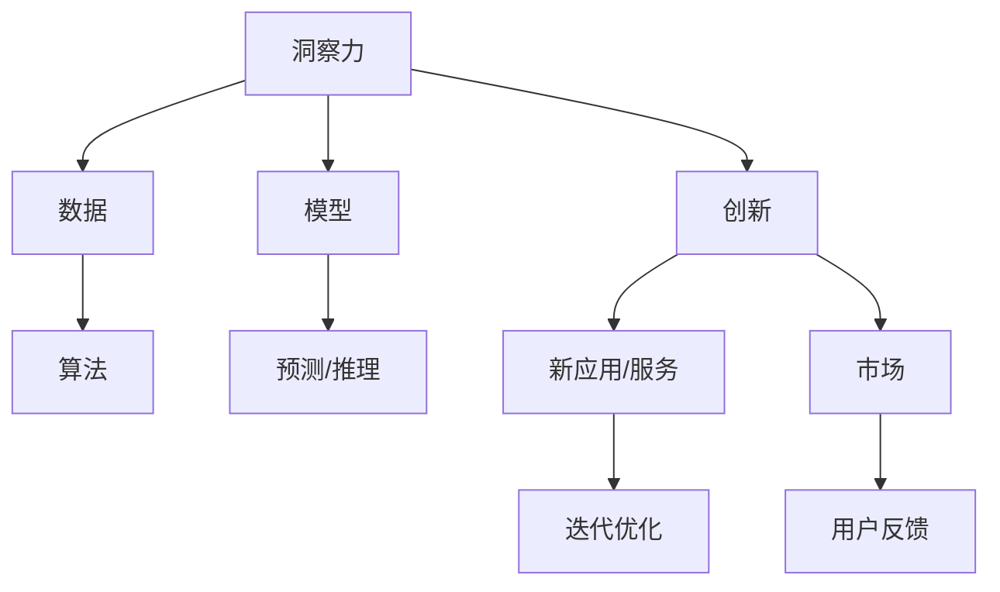

                 

# 洞察力与创新：颠覆性思维的诞生

> 关键词：洞察力，创新，颠覆性思维，技术革新，人工智能，数据科学，算法优化，机器学习

## 1. 背景介绍

### 1.1 问题由来

在过去的几十年里，科技领域的飞速进步极大地改变了我们的生活和工作方式。从计算机算力的指数级提升到互联网的广泛普及，从大数据到人工智能的飞速发展，科技的进步正在以一种前所未有的速度重塑着我们的世界。然而，在享受科技进步带来的便利的同时，我们也不得不面对一些新的问题：如何在技术变革的浪潮中保持创新，如何在海量数据和复杂系统中挖掘出真正的洞察力，如何让技术更好地服务于人类社会。

### 1.2 问题核心关键点

洞察力与创新是技术进步的核心推动力，但它们的产生并非偶然。要想在技术变革中保持领先地位，我们必须深刻理解它们背后的原理，并且掌握如何在实际应用中运用它们。以下列举了一些关键点，旨在帮助我们更好地理解和应用洞察力与创新：

- **洞察力**：指在复杂系统中发现和理解深层次模式和关系的能力。洞察力不仅依赖于数据的丰富性和质量，还依赖于算法的智能性和模型的深度性。
- **创新**：指基于洞察力发现新方法、新工具和新应用的能力。创新依赖于跨学科知识的整合、团队协作和持续探索的精神。
- **颠覆性思维**：指敢于打破常规，重新定义问题和技术，找到根本解决方案的思维方式。它要求我们具备开放的心态和创新的勇气。

## 2. 核心概念与联系

### 2.1 核心概念概述

为了深入理解洞察力与创新的本质，我们需要对这些核心概念有清晰的认识：

- **洞察力**：在大数据和复杂系统中，洞察力是指通过数据分析和模型训练，揭示出深层次的模式和关系，为决策提供依据的能力。洞察力通常源自对数据的深入理解和算法的高效应用。
- **创新**：创新是在洞察力的基础上，通过新的算法、模型和应用，创造出具有市场潜力和社会价值的新产品和服务的过程。创新不仅需要技术上的突破，还需要对用户需求的敏锐洞察和对市场动态的敏锐观察。
- **颠覆性思维**：颠覆性思维是指从不同的视角出发，对现有问题和现有技术进行重新审视，寻找全新的解决方案的思维方式。它要求我们敢于挑战现状，具备开放、探索和创新的精神。

### 2.2 核心概念原理和架构的 Mermaid 流程图



这个流程图展示了洞察力与创新的基本架构：数据、算法、模型和创新之间相互关联，形成了一个循环反馈系统。通过数据驱动和算法优化，洞察力得以产生，而基于洞察力的创新又能反过来提升数据和算法的质量，形成良性循环。

## 3. 核心算法原理 & 具体操作步骤

### 3.1 算法原理概述

洞察力与创新的核心在于算法的有效应用。算法的优劣直接决定了从数据中挖掘出的洞察力的质量和创新的潜力。下面将介绍几种核心的算法原理和操作步骤：

- **回归分析**：通过分析数据集中的变量关系，揭示出趋势和模式。常用的回归算法包括线性回归、多项式回归、岭回归等。
- **聚类分析**：将数据集中的样本分成若干组，使得同一组内的样本相似度较高，不同组之间的样本差异较大。常用的聚类算法包括K-means、层次聚类等。
- **分类算法**：通过训练模型，将数据集中的样本分类到不同的类别中。常用的分类算法包括决策树、支持向量机、神经网络等。
- **深度学习算法**：通过多层神经网络，自动学习数据集中的复杂模式和关系。常用的深度学习算法包括卷积神经网络（CNN）、循环神经网络（RNN）、变换器（Transformer）等。

### 3.2 算法步骤详解

以下是几个核心算法的详细步骤详解：

#### 3.2.1 回归分析

1. **数据准备**：收集和清洗数据，确保数据质量和完整性。
2. **特征工程**：提取和选择最相关的特征，减少数据的维度，提高模型的泛化能力。
3. **模型训练**：选择适合的回归算法，通过交叉验证等技术优化模型参数。
4. **模型评估**：使用测试集评估模型的预测性能，调整模型结构或参数以提高准确度。

#### 3.2.2 聚类分析

1. **数据准备**：收集和清洗数据，确保数据质量和完整性。
2. **特征选择**：提取最相关的特征，减少数据的维度，提高模型的泛化能力。
3. **模型训练**：选择适合的聚类算法，通过迭代优化算法参数。
4. **模型评估**：使用评估指标（如轮廓系数）评估模型的聚类效果，调整模型参数以提高准确度。

#### 3.2.3 分类算法

1. **数据准备**：收集和清洗数据，确保数据质量和完整性。
2. **特征工程**：提取和选择最相关的特征，减少数据的维度，提高模型的泛化能力。
3. **模型训练**：选择适合的分类算法，通过交叉验证等技术优化模型参数。
4. **模型评估**：使用测试集评估模型的分类性能，调整模型结构或参数以提高准确度。

#### 3.2.4 深度学习算法

1. **数据准备**：收集和清洗数据，确保数据质量和完整性。
2. **特征工程**：提取和选择最相关的特征，减少数据的维度，提高模型的泛化能力。
3. **模型设计**：设计多层神经网络，选择合适的层数、节点数、激活函数等参数。
4. **模型训练**：使用梯度下降等优化算法训练模型，通过迭代优化模型参数。
5. **模型评估**：使用测试集评估模型的预测性能，调整模型结构或参数以提高准确度。

### 3.3 算法优缺点

不同的算法适用于不同的场景，它们的优缺点如下：

- **回归分析**：优点是简单易懂，容易实现。缺点是对于非线性关系和大规模数据处理能力较弱。
- **聚类分析**：优点是能够自动发现数据中的自然分组，适用于无监督学习。缺点是结果难以解释，对于噪声数据敏感。
- **分类算法**：优点是模型具有较好的解释性，适用于监督学习。缺点是对于高维数据的处理能力较弱。
- **深度学习算法**：优点是能够自动学习复杂模式，适用于大规模数据和复杂问题。缺点是模型训练复杂，计算资源需求高。

### 3.4 算法应用领域

算法在各个领域的应用非常广泛，以下是一些典型的应用领域：

- **金融领域**：通过回归分析预测股票价格，通过聚类分析进行风险评估，通过分类算法识别欺诈行为。
- **医疗领域**：通过回归分析预测疾病风险，通过聚类分析进行患者分群，通过分类算法识别疾病类型。
- **零售领域**：通过回归分析预测销售趋势，通过聚类分析进行市场细分，通过分类算法推荐商品。
- **自然语言处理领域**：通过分类算法进行文本分类，通过聚类分析进行主题分析，通过回归分析进行情感分析。

## 4. 数学模型和公式 & 详细讲解 & 举例说明

### 4.1 数学模型构建

在实际应用中，通常使用以下数学模型来构建算法：

- **线性回归模型**：$y = \beta_0 + \beta_1 x_1 + \beta_2 x_2 + ... + \beta_n x_n + \epsilon$，其中 $y$ 是因变量，$x_i$ 是自变量，$\beta_i$ 是回归系数，$\epsilon$ 是误差项。
- **K-means聚类模型**：将数据点 $x_i$ 分配到最近的聚类中心 $c_j$，使得每个数据点 $x_i$ 与分配到的聚类中心 $c_j$ 的距离最小化。
- **决策树分类模型**：通过构建树形结构，对数据进行分层分类。每个节点代表一个特征，每个分支代表一个分类结果。
- **深度学习模型**：通过多层神经网络，自动学习数据的复杂模式。常用的深度学习模型包括卷积神经网络（CNN）和循环神经网络（RNN）。

### 4.2 公式推导过程

以下是几个核心算法的公式推导过程：

#### 4.2.1 线性回归公式推导

线性回归模型通过最小二乘法进行参数估计：

$$
\hat{\beta} = (X^TX)^{-1}X^Ty
$$

其中，$X$ 是自变量的矩阵，$y$ 是因变量的向量。通过最小化残差平方和（RSS）来求解最优参数 $\hat{\beta}$。

#### 4.2.2 K-means聚类公式推导

K-means聚类模型通过迭代更新聚类中心和数据点分配：

$$
c_j = \arg\min_{c_j} \sum_{i=1}^N ||x_i - c_j||^2
$$

其中，$N$ 是数据点的数量，$x_i$ 是第 $i$ 个数据点，$c_j$ 是第 $j$ 个聚类中心。通过迭代更新聚类中心和数据点分配，直到收敛。

#### 4.2.3 决策树公式推导

决策树分类模型通过信息增益或基尼指数等指标选择最佳特征进行分裂：

$$
Gain(D, A) = H(D) - H(D|A)
$$

其中，$D$ 是样本集合，$A$ 是特征，$H$ 是信息熵。通过最大化信息增益或最小化基尼指数，选择最佳特征进行分裂。

#### 4.2.4 深度学习模型公式推导

深度学习模型通过反向传播算法进行参数更新：

$$
\theta \leftarrow \theta - \eta \frac{\partial L}{\partial \theta}
$$

其中，$\theta$ 是模型参数，$\eta$ 是学习率，$L$ 是损失函数。通过反向传播算法计算梯度，并使用梯度下降等优化算法更新参数。

### 4.3 案例分析与讲解

以下通过几个具体案例来分析算法的应用：

#### 4.3.1 金融领域

假设我们有一份股票历史价格数据，目标是预测未来股价。

1. **数据准备**：收集过去一年的股票价格数据，包括每日开盘价、收盘价、最高价、最低价等。
2. **特征工程**：选择与股价相关的特征，如成交量、市场情绪指标等。
3. **模型训练**：使用线性回归模型，通过最小二乘法估计模型参数。
4. **模型评估**：使用测试集评估模型的预测性能，调整模型参数以提高准确度。

#### 4.3.2 医疗领域

假设我们有一份患者的病历数据，目标是预测患者是否会患上某种疾病。

1. **数据准备**：收集患者的病历数据，包括年龄、性别、家族病史、生活习惯等。
2. **特征工程**：选择与疾病相关的特征，如年龄、性别、生活习惯等。
3. **模型训练**：使用决策树模型，通过信息增益选择最佳特征进行分裂。
4. **模型评估**：使用测试集评估模型的分类性能，调整模型参数以提高准确度。

#### 4.3.3 零售领域

假设我们有一份电商平台的销售数据，目标是预测某种商品在未来一段时间内的销售量。

1. **数据准备**：收集商品的历史销售数据，包括价格、促销活动、用户评价等。
2. **特征工程**：选择与销售量相关的特征，如价格、促销活动、用户评价等。
3. **模型训练**：使用回归分析模型，通过最小二乘法估计模型参数。
4. **模型评估**：使用测试集评估模型的预测性能，调整模型参数以提高准确度。

## 5. 项目实践：代码实例和详细解释说明

### 5.1 开发环境搭建

在进行算法实践前，我们需要准备好开发环境。以下是使用Python进行PyTorch开发的环境配置流程：

1. 安装Anaconda：从官网下载并安装Anaconda，用于创建独立的Python环境。

2. 创建并激活虚拟环境：
```bash
conda create -n pytorch-env python=3.8 
conda activate pytorch-env
```

3. 安装PyTorch：根据CUDA版本，从官网获取对应的安装命令。例如：
```bash
conda install pytorch torchvision torchaudio cudatoolkit=11.1 -c pytorch -c conda-forge
```

4. 安装Transformers库：
```bash
pip install transformers
```

5. 安装各类工具包：
```bash
pip install numpy pandas scikit-learn matplotlib tqdm jupyter notebook ipython
```

完成上述步骤后，即可在`pytorch-env`环境中开始算法实践。

### 5.2 源代码详细实现

这里我们以线性回归模型为例，给出使用PyTorch进行数据集构建、模型训练和评估的完整代码实现。

```python
import torch
import torch.nn as nn
import torch.optim as optim
import torch.utils.data as data
from sklearn.datasets import load_boston
from sklearn.model_selection import train_test_split
from sklearn.preprocessing import StandardScaler

# 加载波士顿房价数据集
boston = load_boston()
X = boston.data
y = boston.target

# 标准化数据
scaler = StandardScaler()
X = scaler.fit_transform(X)

# 划分训练集和测试集
X_train, X_test, y_train, y_test = train_test_split(X, y, test_size=0.2, random_state=42)

# 定义模型
class LinearRegression(nn.Module):
    def __init__(self, input_dim, output_dim):
        super(LinearRegression, self).__init__()
        self.linear = nn.Linear(input_dim, output_dim)

    def forward(self, x):
        out = self.linear(x)
        return out

# 构建数据集
class BostonData(data.Dataset):
    def __init__(self, X, y):
        self.X = X
        self.y = y

    def __len__(self):
        return len(self.X)

    def __getitem__(self, index):
        x = self.X[index]
        y = self.y[index]
        return x, y

train_data = BostonData(X_train, y_train)
test_data = BostonData(X_test, y_test)

# 定义模型、优化器和损失函数
model = LinearRegression(X_train.shape[1], 1)
criterion = nn.MSELoss()
optimizer = optim.SGD(model.parameters(), lr=0.01)

# 训练模型
for epoch in range(1000):
    for X, y in train_data:
        optimizer.zero_grad()
        y_pred = model(X)
        loss = criterion(y_pred, y)
        loss.backward()
        optimizer.step()
    if epoch % 100 == 0:
        print(f"Epoch {epoch}, loss: {loss.item()}")

# 评估模型
model.eval()
with torch.no_grad():
    y_pred = model(X_test)
    mse = criterion(y_pred, y_test)
    rmse = torch.sqrt(mse)
    print(f"RMSE: {rmse.item()}")
```

### 5.3 代码解读与分析

让我们再详细解读一下关键代码的实现细节：

**BostonData类**：
- `__init__`方法：初始化训练数据集和测试数据集。
- `__len__`方法：返回数据集的样本数量。
- `__getitem__`方法：对单个样本进行处理，返回模型所需的输入和输出。

**LinearRegression类**：
- `__init__`方法：定义线性回归模型，包含一个线性层。
- `forward`方法：定义模型的前向传播过程。

**模型训练和评估**：
- 使用PyTorch的DataLoader对数据集进行批次化加载，供模型训练和推理使用。
- 训练函数中，每个epoch内对训练集数据进行迭代，使用梯度下降等优化算法更新模型参数。
- 在每个epoch结束后，计算损失函数并打印输出。
- 在评估函数中，模型不更新参数，直接计算测试集的预测结果和损失函数，并打印输出。

**代码执行结果**：
- 在训练过程中，随着epoch的增加，损失函数逐渐减小，模型逐渐收敛。
- 在测试过程中，使用均方误差（MSE）和均方根误差（RMSE）评估模型性能，RMSE越小，模型预测的准确度越高。

通过上述代码实例，我们可以看到，在PyTorch中使用深度学习算法进行数据分析和模型训练的便捷性。算法实践的代码编写和执行过程，能够帮助开发者更好地理解算法原理和应用技巧。

## 6. 实际应用场景

### 6.1 金融领域

在金融领域，洞察力与创新具有重要意义。通过数据分析和机器学习算法，金融机构可以预测市场走势、识别欺诈行为、优化投资组合等。

**案例**：股票价格预测

假设我们有一份股票的历史价格数据，目标是预测未来股价。通过收集和清洗数据，选择与股价相关的特征，使用线性回归模型进行预测。模型的预测结果可以为投资决策提供重要参考，从而提高投资收益。

### 6.2 医疗领域

在医疗领域，洞察力与创新同样不可或缺。通过数据分析和机器学习算法，医疗机构可以预测疾病风险、优化诊疗方案、提高医疗服务质量等。

**案例**：疾病预测

假设我们有一份患者的病历数据，目标是预测患者是否会患上某种疾病。通过收集和清洗数据，选择与疾病相关的特征，使用决策树模型进行分类。模型的预测结果可以为医生提供诊断建议，从而提高诊断准确度。

### 6.3 零售领域

在零售领域，洞察力与创新是提升用户体验和销售收益的关键。通过数据分析和机器学习算法，零售企业可以优化库存管理、提高营销效果、提升客户满意度等。

**案例**：商品销售预测

假设我们有一份电商平台的销售数据，目标是预测某种商品在未来一段时间内的销售量。通过收集和清洗数据，选择与销售量相关的特征，使用回归分析模型进行预测。模型的预测结果可以为库存管理和营销策略提供重要参考，从而提高销售收益。

### 6.4 未来应用展望

随着数据量的不断增长和算法的不断进步，洞察力与创新的应用领域将更加广泛。以下列举一些未来应用展望：

1. **智慧城市**：通过数据分析和机器学习算法，智慧城市可以优化交通流量、提高能源利用率、提升公共安全等。
2. **智能制造**：通过数据分析和机器学习算法，智能制造可以提高生产效率、降低生产成本、提升产品质量等。
3. **金融科技**：通过数据分析和机器学习算法，金融科技可以提高风险控制、优化投资决策、提升客户体验等。
4. **医疗健康**：通过数据分析和机器学习算法，医疗健康可以提高疾病预测准确度、优化诊疗方案、提高医疗服务质量等。
5. **教育培训**：通过数据分析和机器学习算法，教育培训可以提高教学效果、个性化推荐课程、提升学习体验等。

## 7. 工具和资源推荐

### 7.1 学习资源推荐

为了帮助开发者系统掌握洞察力与创新的理论基础和实践技巧，这里推荐一些优质的学习资源：

1. **《深度学习》课程**：由斯坦福大学开设的深度学习课程，内容全面深入，适合初学者和进阶者。
2. **《机器学习实战》书籍**：详细介绍了机器学习算法的实现和应用，适合动手实践。
3. **Kaggle竞赛平台**：提供大量数据集和竞赛任务，可以帮助开发者在实战中提升算法技能。
4. **GitHub开源项目**：GitHub上有大量开源项目和代码示例，可以帮助开发者学习和借鉴优秀的算法实践。
5. **在线学习平台**：如Coursera、Udacity等平台提供的数据科学和机器学习课程，涵盖从入门到高级的多个层次。

### 7.2 开发工具推荐

高效的开发离不开优秀的工具支持。以下是几款用于洞察力与创新开发常用的工具：

1. **Jupyter Notebook**：交互式开发环境，支持多种编程语言，非常适合数据科学和机器学习项目。
2. **TensorFlow**：谷歌开源的深度学习框架，支持分布式计算和模型部署。
3. **PyTorch**：Facebook开源的深度学习框架，支持动态计算图和模型优化。
4. **Scikit-learn**：开源机器学习库，提供多种常见的机器学习算法实现。
5. **Pandas**：开源数据处理库，支持数据清洗、转换和分析。

### 7.3 相关论文推荐

洞察力与创新的发展离不开学界的持续研究。以下是几篇奠基性的相关论文，推荐阅读：

1. **《机器学习》书籍**：Tom Mitchell著，全面介绍了机器学习的基本概念和算法。
2. **《深度学习》书籍**：Ian Goodfellow、Yoshua Bengio和Aaron Courville著，深入介绍了深度学习的基本原理和应用。
3. **《大数据技术》书籍**：Typhoon E heritage著，介绍了大数据处理和分析的基本技术。
4. **《算法导论》书籍**：Thomas H. Cormen、Charles E. Leiserson、Ronald L. Rivest和Clifford Stein著，介绍了经典的算法设计和分析方法。

## 8. 总结：未来发展趋势与挑战

### 8.1 研究成果总结

通过以上系统梳理，可以看到，洞察力与创新是推动技术进步的核心动力，而算法和大数据则是实现洞察力的关键工具。随着数据量的不断增长和算法的不断进步，洞察力与创新的应用领域将更加广泛，为各个行业带来革命性的变化。

### 8.2 未来发展趋势

展望未来，洞察力与创新将继续引领技术进步，其发展趋势包括：

1. **算法优化**：随着算法的不断进步，新的高效算法将被不断发现和应用，提升洞察力的挖掘能力和创新的潜力。
2. **数据整合**：跨领域、跨模态的数据整合将成为趋势，帮助揭示更深层次的模式和关系。
3. **人工智能融合**：深度学习、自然语言处理、计算机视觉等人工智能技术的融合，将进一步提升洞察力和创新的应用能力。
4. **自动化**：自动化算法设计和数据处理将成为趋势，降低人工干预，提高工作效率和精度。
5. **伦理与安全**：随着算法的广泛应用，算法的伦理和安全问题也将成为重要的研究方向，确保算法的公平、透明和可解释性。

### 8.3 面临的挑战

尽管洞察力与创新在各个领域展现了巨大的潜力，但在实际应用中仍然面临诸多挑战：

1. **数据隐私**：大规模数据集的应用可能涉及数据隐私问题，如何在保护隐私的同时进行数据处理和分析，是一个重要挑战。
2. **算法偏见**：算法可能存在偏见，导致决策不公平。如何检测和消除算法偏见，是实现公正算法的重要课题。
3. **计算资源**：大规模数据集和复杂算法对计算资源的需求极高，如何降低计算成本，是实现高效算法的重要课题。
4. **模型解释**：算法的复杂性和黑盒特性，使得模型的解释性不足。如何提高模型的可解释性，是确保算法公正透明的重要课题。
5. **技术普及**：洞察力与创新的应用需要跨学科的合作和技术普及，如何降低技术门槛，普及先进算法，是实现广泛应用的重要课题。

### 8.4 研究展望

为了应对以上挑战，未来的研究需要在以下几个方面寻求新的突破：

1. **隐私保护**：研究如何保护数据隐私，同时实现高效的数据处理和分析。
2. **算法公正**：研究如何检测和消除算法偏见，确保算法的公正透明。
3. **高效算法**：研究如何降低计算成本，实现高效的数据处理和分析。
4. **模型解释**：研究如何提高模型的可解释性，确保算法的公正透明。
5. **技术普及**：研究如何降低技术门槛，普及先进算法，推动算法的广泛应用。

通过不断探索和创新，我们相信洞察力与创新将在未来的技术变革中发挥更加重要的作用，为各个领域带来更多的机遇和挑战。

## 9. 附录：常见问题与解答

**Q1：如何提高数据处理和分析的效率？**

A: 提高数据处理和分析的效率，需要从多个方面入手：

1. **数据预处理**：进行数据清洗、去重、转换等操作，减少数据的维度，提高数据质量。
2. **算法优化**：选择高效的算法，优化模型结构和参数，减少计算复杂度。
3. **分布式计算**：利用分布式计算框架，如Hadoop、Spark等，提高数据处理效率。
4. **数据存储**：使用高效的存储格式，如Parquet、ORC等，减少数据读取和写入时间。
5. **自动化工具**：使用自动化数据处理工具，如ETL工具、数据可视化工具等，提高数据处理效率。

**Q2：如何提高算法的解释性和透明度？**

A: 提高算法的解释性和透明度，需要从多个方面入手：

1. **模型简化**：选择简单的模型，减少模型的复杂度，提高可解释性。
2. **特征解释**：解释模型的特征选择和权重，理解模型的决策依据。
3. **可视化工具**：使用可视化工具，如图表、热力图等，直观展示模型的决策过程。
4. **可解释性算法**：使用可解释性算法，如LIME、SHAP等，解释模型的决策过程。
5. **模型监控**：实时监控模型的运行情况，及时发现和修复模型缺陷。

**Q3：如何处理大规模数据集？**

A: 处理大规模数据集，需要从多个方面入手：

1. **数据分区**：将数据集分成多个分区，并行处理每个分区，提高处理效率。
2. **数据压缩**：对数据进行压缩，减少存储和传输成本。
3. **数据采样**：使用随机采样或分层采样等技术，减少数据量，提高处理效率。
4. **分布式计算**：利用分布式计算框架，如Hadoop、Spark等，并行处理大规模数据集。
5. **流式计算**：使用流式计算技术，实时处理数据流，提高处理效率。

通过以上措施，可以有效提高数据处理和分析的效率，提升洞察力与创新的应用能力。

---

作者：禅与计算机程序设计艺术 / Zen and the Art of Computer Programming

