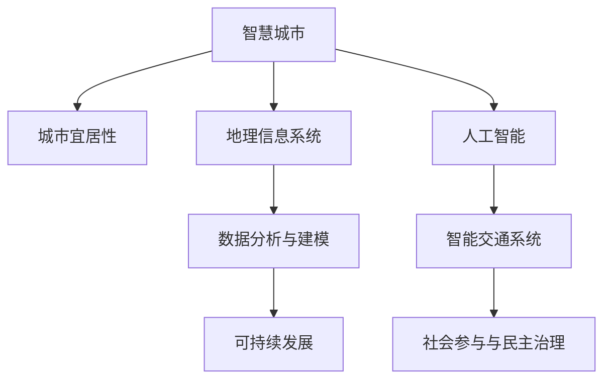

                 

# 洞察力与城市规划：宜居城市的设计智慧

> 关键词：
> - 城市规划
> - 宜居性
> - 数据分析
> - 地理信息系统(GIS)
> - 人工智能(AI)
> - 可持续发展
> - 智能交通系统
> - 社会参与

## 1. 背景介绍

### 1.1 问题由来
随着城市化进程的加速，全球城市面临诸多挑战，如人口增长、环境污染、交通拥堵等。如何规划建设宜居城市，提高居民生活质量，成为亟待解决的问题。传统城市规划方法主要依赖专家经验，数据驱动的智慧城市规划逐渐兴起。城市规划的核心任务在于利用数据洞察城市发展趋势，科学决策，促进城市可持续发展。

### 1.2 问题核心关键点
城市规划问题的核心在于如何利用数据和技术手段，优化城市资源配置，提升居民生活质量。具体包括以下几个关键点：

1. **数据分析与建模**：通过收集和分析各类城市数据，发现城市的运行规律和潜在问题。
2. **地理信息系统(GIS)**：利用GIS技术，可视化展示城市数据，辅助决策分析。
3. **人工智能(AI)**：应用AI技术，预测城市发展趋势，优化城市资源配置。
4. **可持续发展的理念**：遵循绿色环保的原则，平衡经济发展与环境保护。
5. **社会参与与民主治理**：充分听取市民意见，提高城市规划的公众参与度和透明度。

本文将围绕这些关键点，探讨利用人工智能和大数据技术，进行智慧城市规划的原理、方法和实践。

## 2. 核心概念与联系

### 2.1 核心概念概述

为更好地理解智慧城市规划的技术框架，本节将介绍几个密切相关的核心概念：

- **智慧城市(Wisdom City)**：利用信息和通信技术(ICT)，优化城市资源配置，提高城市治理效率和管理水平，提升居民生活质量。
- **城市宜居性(Livability of Cities)**：衡量城市生活质量的标准，包括住房、交通、医疗、教育等方面的综合评价。
- **地理信息系统(GIS)**：用于对地理空间数据进行采集、存储、管理、分析和展示的技术系统。
- **数据分析与建模**：利用统计学、机器学习等方法，对城市数据进行建模，提取规律和预测趋势。
- **人工智能(AI)**：通过模拟人类智能行为，使机器能够理解、学习、推理和决策，应用于城市规划和治理。
- **可持续发展(Sustainable Development)**：强调经济、社会、环境三方面的协调发展，促进城市长期健康稳定发展。
- **智能交通系统(ITS)**：利用AI和物联网技术，优化交通管理和调度，减少交通拥堵，提升出行效率。
- **社会参与与民主治理(Civic Participation and Democratic Governance)**：通过公众参与和透明治理，提升城市规划的公正性和民主性。

这些概念之间的逻辑关系可以通过以下Mermaid流程图来展示：



这个流程图展示了智慧城市规划的关键环节：

1. 智慧城市作为整体概念，通过地理信息系统、数据分析与建模、人工智能等技术手段，提升城市宜居性。
2. 智能交通系统是智慧城市的重要组成部分，通过AI技术优化交通管理。
3. 社会参与与民主治理是智慧城市规划的民主基础，确保规划决策的公平性和透明性。

## 3. 核心算法原理 & 具体操作步骤
### 3.1 算法原理概述

智慧城市规划的核心算法原理主要包括以下几个方面：

1. **城市数据的采集与处理**：利用传感器、问卷调查、政府数据等手段，收集城市各类数据，并进行清洗和预处理。
2. **数据分析与建模**：利用统计学和机器学习方法，对城市数据进行建模和分析，提取规律和预测趋势。
3. **地理信息系统(GIS)应用**：利用GIS技术，对城市数据进行可视化展示，辅助决策分析。
4. **人工智能(AI)应用**：利用AI技术，提升城市管理的智能化水平，优化资源配置。
5. **可持续发展模型**：建立经济、社会、环境三方面的可持续发展模型，指导城市规划和建设。

### 3.2 算法步骤详解

智慧城市规划的一般步骤如下：

1. **数据收集与清洗**：收集城市各类数据，包括人口、交通、环境、经济、社会等，并进行数据清洗和预处理。
2. **数据分析与建模**：利用统计学和机器学习模型，对城市数据进行建模和分析，提取规律和预测趋势。
3. **GIS应用与可视化**：利用GIS技术，将城市数据进行可视化展示，辅助决策分析。
4. **AI应用与决策支持**：利用AI技术，优化城市资源配置，提升城市治理效率。
5. **可持续发展模型构建**：建立经济、社会、环境三方面的可持续发展模型，指导城市规划和建设。
6. **公众参与与民主治理**：通过公众参与和透明治理，提高城市规划的公平性和透明性。

### 3.3 算法优缺点

智慧城市规划的算法具有以下优点：

1. **数据驱动**：利用大数据技术，提供科学的决策依据，避免依赖专家经验。
2. **智能决策**：应用AI技术，提高城市管理的智能化水平，优化资源配置。
3. **公众参与**：通过公众参与和透明治理，提高城市规划的公平性和透明性。

但同时，该算法也存在一些局限性：

1. **数据质量依赖**：依赖高质量的城市数据，如果数据采集和处理不准确，会影响分析结果。
2. **算法复杂度高**：需要复杂的数据分析和建模，对技术要求较高。
3. **成本较高**：需要投入大量的资源进行数据收集、处理和建模。
4. **技术门槛高**：需要专业技术人员进行数据处理和算法实现。
5. **政策与实施难度**：即使技术方案可行，也需要政策支持和实际实施。

### 3.4 算法应用领域

智慧城市规划的算法在多个领域都有应用，例如：

- **城市宜居性评估**：利用数据分析和建模，评估城市的宜居性，发现问题并进行改进。
- **交通管理与优化**：通过AI技术，优化交通信号、路网设计，减少交通拥堵。
- **公共服务优化**：利用AI和大数据分析，优化公共服务资源配置，提高服务效率。
- **环境保护**：通过数据分析和建模，评估环境质量，提出改善建议。
- **灾害预警与应急管理**：利用AI和大数据技术，预测和预警自然灾害，优化应急响应。
- **社会参与与透明治理**：通过公众参与和透明治理，提高城市规划的公正性和透明性。

## 4. 数学模型和公式 & 详细讲解  
### 4.1 数学模型构建

智慧城市规划涉及多个学科领域的数学模型，本文重点介绍基于数据分析与建模的宜居性评估模型。

假设城市有 $n$ 个社区，每个社区有 $m$ 个特征，记为 $x_{ij}$，其中 $i$ 表示社区编号，$j$ 表示特征编号。设 $y_i$ 表示第 $i$ 个社区的宜居性评分，模型为 $y_i=f(x_{i1},x_{i2},...,x_{im})$。

常见的宜居性评估模型包括线性回归模型、逻辑回归模型、决策树模型、支持向量机模型等。这里以线性回归模型为例，构建数学模型：

$$
y_i = \beta_0 + \beta_1 x_{i1} + \beta_2 x_{i2} + ... + \beta_m x_{im} + \epsilon_i
$$

其中，$\beta_0, \beta_1, ..., \beta_m$ 为模型参数，$\epsilon_i$ 为误差项。

### 4.2 公式推导过程

线性回归模型的最小二乘估计参数公式为：

$$
\hat{\beta} = (X^TX)^{-1}X^Ty
$$

其中 $X$ 为设计矩阵，$y$ 为响应变量向量。最小二乘估计的目标是最小化残差平方和：

$$
\sum_{i=1}^n (y_i - f(X_i \hat{\beta}))^2
$$

通过对数据进行最小二乘估计，可得到社区宜居性评分的预测值 $\hat{y}_i = f(X_i \hat{\beta})$。

### 4.3 案例分析与讲解

以某城市宜居性评估为例，分析模型构建和参数估计的过程：

1. **数据收集与处理**：收集城市人口、交通、环境、经济、社会等数据，并进行数据清洗和预处理。
2. **模型构建**：选择线性回归模型，将城市数据与宜居性评分建立关联。
3. **参数估计**：利用最小二乘估计方法，求解模型参数 $\hat{\beta}$。
4. **模型验证**：在验证集上评估模型性能，选择合适的正则化参数。
5. **结果解释**：分析模型系数，理解各个特征对宜居性评分的影响。

## 5. 项目实践：代码实例和详细解释说明
### 5.1 开发环境搭建

在进行智慧城市规划的实践前，我们需要准备好开发环境。以下是使用Python进行PyTorch和Pandas开发的Python环境配置流程：

1. 安装Anaconda：从官网下载并安装Anaconda，用于创建独立的Python环境。

2. 创建并激活虚拟环境：
```bash
conda create -n pytorch-env python=3.8 
conda activate pytorch-env
```

3. 安装PyTorch：根据CUDA版本，从官网获取对应的安装命令。例如：
```bash
conda install pytorch torchvision torchaudio cudatoolkit=11.1 -c pytorch -c conda-forge
```

4. 安装Pandas：
```bash
pip install pandas
```

5. 安装GIS库：例如GeoPandas和Fiona，用于处理地理空间数据。
```bash
pip install geopandas fiona
```

完成上述步骤后，即可在`pytorch-env`环境中开始智慧城市规划的实践。

### 5.2 源代码详细实现

这里我们以城市交通管理为例，给出使用Pandas进行数据分析和建模的Python代码实现。

首先，定义数据处理函数：

```python
import pandas as pd
import numpy as np

def preprocess_data(data):
    # 数据清洗和预处理
    data.dropna(inplace=True)
    data['交通拥堵'] = data['交通拥堵'].fillna(data['交通拥堵'].mean())
    data['空气质量'] = data['空气质量'].fillna(data['空气质量'].mean())
    data['人均收入'] = data['人均收入'].fillna(data['人均收入'].mean())
    return data
```

然后，定义模型训练函数：

```python
from sklearn.linear_model import LinearRegression
from sklearn.model_selection import train_test_split

def train_model(data, features, target):
    # 数据分割
    X_train, X_test, y_train, y_test = train_test_split(data[features], data[target], test_size=0.2)
    # 模型训练
    model = LinearRegression()
    model.fit(X_train, y_train)
    return model
```

最后，启动数据处理和模型训练流程：

```python
# 加载数据
data = pd.read_csv('city_data.csv')

# 数据预处理
data = preprocess_data(data)

# 选择特征和目标变量
features = ['交通拥堵', '空气质量', '人均收入']
target = '宜居性评分'

# 模型训练
model = train_model(data, features, target)

# 模型评估
score = model.score(X_test, y_test)
print(f'模型评估得分: {score:.3f}')
```

以上就是使用Pandas进行智慧城市规划的数据分析和建模的完整代码实现。可以看到，利用Pandas和Scikit-Learn库，我们可以便捷地完成数据处理和模型训练，为智慧城市规划提供数据支持。

### 5.3 代码解读与分析

让我们再详细解读一下关键代码的实现细节：

**preprocess_data函数**：
- `dropna`方法：删除缺失值。
- `fillna`方法：填充缺失值。
- 选择均值进行填充，确保数据的一致性。

**train_model函数**：
- `train_test_split`方法：将数据集分为训练集和测试集。
- `LinearRegression`模型：使用线性回归模型进行训练。
- 返回训练好的模型。

**训练流程**：
- 加载数据
- 数据预处理
- 选择特征和目标变量
- 模型训练
- 模型评估

可以看到，Pandas和Scikit-Learn库使得智慧城市规划的数据分析和建模变得简洁高效。开发者可以将更多精力放在数据处理、模型改进等高层逻辑上，而不必过多关注底层的实现细节。

当然，工业级的系统实现还需考虑更多因素，如模型的保存和部署、超参数的自动搜索、更灵活的任务适配层等。但核心的智慧城市规划方法基本与此类似。

## 6. 实际应用场景
### 6.1 智能交通系统

智慧城市规划的核心应用之一是智能交通系统。传统的交通管理方式往往依赖于人工调度，难以实时响应交通变化，导致交通拥堵和事故频发。利用数据分析和AI技术，可以构建高效的智能交通系统，提升交通管理效率和安全性。

具体而言，可以收集交通流量、速度、事故等数据，利用数据建模和预测技术，优化交通信号控制、路网设计，实现交通流量预测和动态调整。例如，利用AI技术，实时监控交通流量，预测拥堵热点，提前调整信号灯周期，减少交通拥堵。

### 6.2 城市宜居性评估

智慧城市规划的另一个重要应用是城市宜居性评估。通过对城市数据进行分析，可以客观评估城市宜居性，发现问题并进行改进。

例如，利用宜居性评估模型，可以评估城市社区的居住环境、交通便捷性、公共服务水平等，得出综合评分。根据评分结果，城市管理部门可以制定相应政策，优化资源配置，提升宜居性。

### 6.3 公共服务优化

智慧城市规划还可以应用于公共服务优化，通过数据分析和AI技术，优化公共服务资源配置，提高服务效率。

例如，利用AI技术，实时监控公共服务使用情况，预测需求变化，动态调整服务资源。例如，通过数据分析，发现某些时间段或地点的公共服务需求较高，提前增加服务资源，避免服务不足或浪费。

### 6.4 环境保护

智慧城市规划的另一重要应用是环境保护。通过数据分析和AI技术，可以评估环境质量，提出改善建议，推动绿色发展。

例如，利用AI技术，实时监控环境质量数据，预测污染趋势，优化污染治理措施。例如，通过数据分析，发现某些区域的环境污染较严重，及时采取治理措施，减少环境污染。

## 7. 工具和资源推荐
### 7.1 学习资源推荐

为了帮助开发者系统掌握智慧城市规划的理论基础和实践技巧，这里推荐一些优质的学习资源：

1. 《智慧城市理论与实践》系列博文：由智慧城市专家撰写，深入浅出地介绍了智慧城市规划的原理、方法和实践。

2. 《城市数据科学与分析》课程：从城市数据收集、处理、分析到应用，涵盖智慧城市规划的全面内容。

3. 《城市宜居性评估与管理》书籍：全面介绍了城市宜居性评估的理论与实践，提供大量案例分析。

4. 《地理信息系统(GIS)基础与高级应用》书籍：详细讲解了GIS技术的应用，包括数据处理、空间分析等。

5. 《智慧城市AI应用》课程：讲解智慧城市规划中的AI应用，涵盖数据分析、模型构建、算法实现等。

通过对这些资源的学习实践，相信你一定能够快速掌握智慧城市规划的精髓，并用于解决实际的智慧城市问题。

### 7.2 开发工具推荐

高效的开发离不开优秀的工具支持。以下是几款用于智慧城市规划开发的常用工具：

1. Python：作为数据科学和机器学习的主流语言，Python提供了丰富的数据分析和建模库，如Pandas、NumPy、Scikit-Learn等。

2. GIS软件：如ArcGIS、QGIS等，用于地理空间数据的处理和可视化。

3. 数据可视化工具：如Tableau、Power BI等，用于数据可视化和决策支持。

4. 大数据平台：如Apache Hadoop、Apache Spark等，用于大规模数据处理和分析。

5. AI平台：如TensorFlow、PyTorch等，用于AI模型训练和部署。

合理利用这些工具，可以显著提升智慧城市规划的开发效率，加快创新迭代的步伐。

### 7.3 相关论文推荐

智慧城市规划的研究源于学界的持续研究。以下是几篇奠基性的相关论文，推荐阅读：

1. "A Survey on Urban Data Mining and Statistical Learning in Smart Cities"：回顾了智慧城市规划中的数据挖掘和机器学习研究。

2. "Big Data Analytics for Smart Cities: A Survey"：介绍了智慧城市规划中的大数据分析技术。

3. "Hierarchical Clustering of Urban Features for Smart City Management"：提出了基于层次聚类的城市特征分类方法。

4. "A Survey on AI for Smart City Management"：综述了智慧城市规划中的AI应用。

5. "Urban Development in the Age of Big Data and AI: Challenges and Opportunities"：探讨了大数据和AI在智慧城市规划中的挑战和机遇。

这些论文代表了大数据和智慧城市规划的研究进展。通过学习这些前沿成果，可以帮助研究者把握学科前进方向，激发更多的创新灵感。

## 8. 总结：未来发展趋势与挑战
### 8.1 总结

本文对智慧城市规划的原理、方法和实践进行了全面系统的介绍。首先阐述了智慧城市规划的背景和意义，明确了数据驱动、智能决策、公众参与的智慧城市规划核心思想。其次，从原理到实践，详细讲解了智慧城市规划的数学模型和核心算法，提供了完整的代码实例和分析。同时，本文还广泛探讨了智慧城市规划在智能交通、城市宜居性评估、公共服务优化、环境保护等多个领域的应用前景，展示了智慧城市规划的广阔潜力。最后，本文精选了智慧城市规划的学习资源、开发工具和相关论文，力求为读者提供全方位的技术指引。

通过本文的系统梳理，可以看到，智慧城市规划利用大数据和AI技术，为城市资源配置和治理提供了科学依据，大幅提升了城市管理的智能化水平。未来，智慧城市规划将进一步融合智能技术，推动城市治理体系和治理能力现代化，为实现城市可持续发展提供坚实保障。

### 8.2 未来发展趋势

展望未来，智慧城市规划技术将呈现以下几个发展趋势：

1. **数据驱动**：智慧城市规划将更加依赖于大数据技术，通过全面、准确的数据采集和分析，提供科学的决策依据。

2. **智能决策**：智慧城市规划将更广泛地应用AI技术，提升城市治理的智能化水平，优化资源配置。

3. **公众参与**：智慧城市规划将加强公众参与和透明治理，提高城市规划的公平性和透明性。

4. **多模态融合**：智慧城市规划将融合多种数据源，包括物联网、传感器、卫星数据等，实现多模态信息融合，提升决策精度。

5. **自适应优化**：智慧城市规划将引入自适应优化算法，动态调整策略，应对复杂多变的城市环境。

6. **跨学科融合**：智慧城市规划将融合城市规划、数据科学、人工智能、社会学等多个学科，形成跨学科的综合解决方案。

以上趋势凸显了智慧城市规划技术的广阔前景。这些方向的探索发展，必将进一步提升城市管理的智能化水平，为城市可持续发展提供有力支撑。

### 8.3 面临的挑战

尽管智慧城市规划技术已经取得了瞩目成就，但在迈向更加智能化、普适化应用的过程中，仍面临诸多挑战：

1. **数据质量问题**：数据采集和处理过程中可能存在缺失、噪声等问题，影响数据分析结果。

2. **技术门槛高**：智慧城市规划需要跨学科的复合型人才，对技术要求较高，人才储备不足。

3. **隐私与安全**：智慧城市规划中涉及大量敏感数据，数据隐私和安全保护问题需高度重视。

4. **成本高昂**：智慧城市规划需要大量资金投入，包括设备采购、系统集成等。

5. **政策与实施难度**：智慧城市规划需要政策支持和实际实施，政策落实和落地难度较大。

6. **社会适应性**：智慧城市规划需关注公众适应性，避免过度依赖技术，忽视人文关怀。

正视智慧城市规划面临的这些挑战，积极应对并寻求突破，将是大规模智慧城市建设的重要保障。相信随着技术的不断进步和政策的持续推动，智慧城市规划必将在全球范围内加速落地，为城市可持续发展提供有力支持。

### 8.4 研究展望

面对智慧城市规划所面临的诸多挑战，未来的研究需要在以下几个方面寻求新的突破：

1. **数据质量提升**：提高数据采集和处理的精度，确保数据的一致性和可靠性。

2. **技术标准化**：制定智慧城市规划的技术标准和规范，推动技术应用的标准化、规范化。

3. **隐私保护**：引入隐私保护技术，保障城市数据的隐私和安全。

4. **成本控制**：寻找高效、低成本的智慧城市规划方案，降低建设与运行成本。

5. **政策与法规**：加强政策支持与法规建设，确保智慧城市规划的健康发展。

6. **社会参与**：引入公众参与机制，增强城市规划的透明性和公平性。

这些研究方向的探索，将为智慧城市规划技术的持续发展提供新的动力，推动城市治理体系和治理能力现代化，构建更加宜居、智慧、可持续的城市。

## 9. 附录：常见问题与解答

**Q1：智慧城市规划需要哪些数据？**

A: 智慧城市规划需要收集和处理多种数据，包括但不限于：

- 人口数据：人口数量、分布、年龄结构等。
- 交通数据：交通流量、速度、事故等。
- 环境数据：空气质量、水质、噪音等。
- 经济数据：人均收入、消费水平、就业率等。
- 社会数据：教育、医疗、公共服务水平等。

通过综合分析这些数据，可以全面评估城市运行状况，制定科学的城市规划方案。

**Q2：智慧城市规划中的数据质量问题如何应对？**

A: 数据质量问题在智慧城市规划中非常关键。主要应对方法包括：

1. 数据清洗：删除或修正缺失值、异常值等。
2. 数据校验：使用数据校验算法，确保数据的一致性和可靠性。
3. 数据融合：将不同来源的数据进行融合，提高数据的综合利用率。

通过多方面措施，可以提升数据质量，确保智慧城市规划的准确性和可靠性。

**Q3：智慧城市规划中的隐私保护如何实现？**

A: 智慧城市规划中涉及大量敏感数据，隐私保护尤为重要。主要实现方法包括：

1. 数据匿名化：对敏感数据进行匿名化处理，保护个人隐私。
2. 访问控制：对数据访问进行严格的权限控制，确保数据安全。
3. 加密技术：使用数据加密技术，防止数据泄露。

通过综合使用这些技术手段，可以保障智慧城市规划中的数据隐私和安全。

**Q4：智慧城市规划中的成本控制如何实施？**

A: 智慧城市规划需要大量资金投入，成本控制尤为重要。主要实施方法包括：

1. 合理规划：科学规划智慧城市建设方案，避免盲目投入。
2. 技术优化：通过技术创新和优化，降低建设与运行成本。
3. 资源共享：与政府、企业等合作，共享资源，降低成本。

通过多方面措施，可以降低智慧城市规划的成本，确保项目的可持续性。

**Q5：智慧城市规划中的政策与法规如何制定与实施？**

A: 智慧城市规划中的政策与法规制定与实施尤为重要，主要方法包括：

1. 政策调研：进行广泛的政策调研，收集各方意见和建议。
2. 法规制定：根据实际情况，制定相应的法律法规，确保智慧城市规划的合法性。
3. 政策执行：加强政策执行力度，确保智慧城市规划的顺利实施。

通过综合使用这些方法，可以制定科学合理的政策与法规，推动智慧城市规划的健康发展。

总之，智慧城市规划需要从数据、技术、政策等多个方面协同发力，才能真正实现城市治理的智能化和可持续发展。通过本文的系统梳理，相信你一定能够快速掌握智慧城市规划的精髓，并用于解决实际的智慧城市问题。

---

作者：禅与计算机程序设计艺术 / Zen and the Art of Computer Programming

