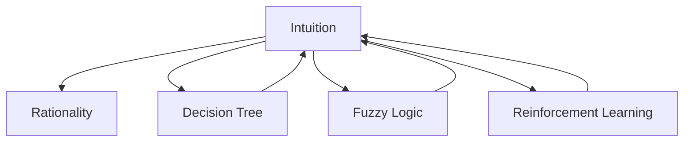

                 

# 洞察力与直觉：非理性思维的重要性

## 1. 背景介绍

### 1.1 问题由来
现代科学和技术发展已经进入了一个高度理性化的时代，定量分析和统计建模成为了许多领域的首选方法。然而，面对一些复杂、模糊或新奇的决策问题，仅依赖理性分析往往无法得出满意解答。这引发了人们对于非理性思维（Intuition）在决策过程中的重要性的思考。

非理性思维并不是简单的“拍脑袋”决策，而是一种基于经验、直觉和情感的快速判断和反应能力。在紧急情况或高风险决策中，非理性思维往往能快速做出有效响应。例如，医生在面对急性病患时，往往需要迅速做出诊断决策，而这一过程在很大程度上依赖于医生的经验和直觉，而非纯粹的统计分析。

近年来，随着人工智能和机器学习技术的飞速发展，非理性思维在AI决策中的应用也逐渐引起了学界和工业界的重视。研究者们开始探索如何将非理性思维融入到AI模型中，以增强其在不确定性环境下的决策能力。

### 1.2 问题核心关键点
非理性思维的重要性和应用领域主要体现在以下几个方面：

- **决策速度**：在面对紧急情况或复杂问题时，非理性思维能够快速做出反应，比理性分析更节省时间。
- **适应性**：非理性思维的灵活性和直观性使其在多变和不确定性的环境中有更好的适应能力。
- **决策质量**：在需要创造性思维和跨界整合的问题中，非理性思维能够提供更符合直觉和上下文背景的解决方案。
- **风险管理**：在高风险决策中，非理性思维能够帮助决策者识别并规避潜在的风险点，平衡短期和长期目标。
- **情感调节**：情感状态对决策过程有重要影响，非理性思维能够调和情感因素，保持心理平衡。

理解非理性思维在AI决策中的重要性，并有效将其融入到AI模型中，对于提高AI系统的整体性能和用户体验具有重要意义。

### 1.3 问题研究意义
研究非理性思维与AI决策的融合，不仅有助于提高AI系统的适应性和鲁棒性，还能拓展AI系统的应用场景，推动其在更复杂和多样化的领域中发挥更大作用。例如，智能医疗、金融投资、智能客服等领域，非理性思维的应用可以显著提升AI系统的响应速度和决策质量，改善用户体验，增强商业价值。

## 2. 核心概念与联系

### 2.1 核心概念概述

为更好地理解非理性思维在AI决策中的作用，本节将介绍几个密切相关的核心概念：

- **非理性思维（Intuition）**：基于个人经验、情感和直觉的快速判断和反应能力。
- **理性思维（Rationality）**：基于逻辑、数据和模型的系统化分析过程。
- **决策树（Decision Tree）**：一种用于模拟人类决策过程的机器学习模型，通过决策节点的分裂来处理多维数据。
- **模糊逻辑（Fuzzy Logic）**：一种处理不确定性和模糊信息的逻辑系统，用于描述和处理复杂问题。
- **增强学习（Reinforcement Learning）**：通过试错反馈，优化AI模型在特定环境中的行为策略。

这些核心概念之间的逻辑关系可以通过以下Mermaid流程图来展示：



这个流程图展示了你、非理性思维与其他核心概念的关系：

1. 非理性思维与理性思维互补，共同构建人类决策过程。
2. 决策树、模糊逻辑和增强学习等模型方法，为非理性思维在AI决策中的应用提供了技术支持。

## 3. 核心算法原理 & 具体操作步骤
### 3.1 算法原理概述

将非理性思维融入AI决策系统，本质上是探索如何在机器学习模型中引入人类直觉和经验。这种模型的核心思想是通过对历史数据、专家知识和情感信息的综合处理，提高AI系统的适应性和灵活性。

### 3.2 算法步骤详解

非理性思维在AI决策中的应用，通常包括以下几个关键步骤：

**Step 1: 数据预处理**

- 收集包含情感和上下文信息的丰富数据集。
- 通过数据清洗、标注等方式，准备用于训练的数据集。

**Step 2: 模型设计**

- 选择合适的模型结构，如决策树、模糊逻辑等，以处理非结构化数据。
- 设计融合非理性思维的决策路径，将情感、经验等非结构化信息转化为结构化特征。
- 考虑模型参数的调节，以平衡理性与非理性成分。

**Step 3: 模型训练**

- 使用预处理后的数据集，训练模型。
- 在训练过程中，引入专家知识和情感信息，增强模型的决策能力。
- 通过调整参数，优化模型性能，使其更好地适应非结构化信息。

**Step 4: 模型评估**

- 使用验证集或测试集对模型进行评估，确保其在不确定性环境下的表现。
- 结合理性分析和非理性判断，综合评估模型的决策效果。

**Step 5: 模型应用**

- 将训练好的模型应用于实际决策场景，通过输入特征生成决策结果。
- 记录决策过程中的情感变化，为后续优化提供参考。

通过上述步骤，可以有效地将非理性思维融入AI决策系统，提升其在不确定性环境下的适应性和决策质量。

### 3.3 算法优缺点

**优点**：

- **快速响应**：非理性思维在紧急情况或高风险决策中，能够迅速做出反应。
- **灵活性**：非理性思维的直观性和适应性，使得模型在多变和不确定性环境下表现更好。
- **综合决策**：通过融合理性分析与非理性判断，模型能够做出更符合直觉和上下文背景的决策。
- **风险规避**：非理性思维能够帮助模型识别并规避潜在的风险点，平衡短期和长期目标。
- **情感管理**：非理性思维有助于调和情感状态，保持决策过程的心理平衡。

**缺点**：

- **主观性强**：非理性思维的决策过程缺乏系统性的解释和依据，难以评估和优化。
- **数据依赖**：模型的性能高度依赖于历史数据的质量和代表性，需要大量有标注的数据。
- **泛化能力**：在面对未知和极端情况时，非理性思维可能难以提供满意的解决方案。
- **模型复杂**：引入非理性成分后，模型的设计和训练过程变得更加复杂。

尽管存在这些局限性，非理性思维在AI决策中的应用，仍具有广阔的探索空间和实际价值。

### 3.4 算法应用领域

非理性思维在AI决策中的应用，已经涵盖了多个领域，以下是几个典型的应用场景：

- **智能医疗**：在面对复杂的诊断和治疗决策时，医生的经验和直觉对于快速做出准确判断至关重要。AI系统通过融合医生的经验和情感信息，能够在紧急情况下提供高质量的医疗建议。
- **金融投资**：投资者在进行市场分析和投资决策时，往往需要快速捕捉市场情绪和趋势。AI系统引入非理性思维，能够帮助投资者在短时间内做出精准的市场判断和投资决策。
- **智能客服**：在面对用户提出的复杂或突发问题时，智能客服系统需要快速响应用户需求，提供满意的解决方案。非理性思维的应用，可以提升客服系统的响应速度和决策质量。
- **自动驾驶**：在面对复杂交通情况时，自动驾驶系统需要快速做出驾驶决策。非理性思维的引入，可以提升系统在突发情况下的反应速度和安全性。
- **智能推荐**：在推荐系统中，非理性思维能够帮助系统理解用户的真实兴趣和情感状态，提供更个性化和精准的推荐结果。

## 4. 数学模型和公式 & 详细讲解 & 举例说明（备注：数学公式请使用latex格式，latex嵌入文中独立段落使用 $$，段落内使用 $)
### 4.1 数学模型构建

本节将使用数学语言对非理性思维在AI决策中的应用进行更加严格的刻画。

假设输入特征为 $X$，决策目标为 $Y$，模型参数为 $\theta$。非理性思维可以通过专家知识和情感信息，引入额外的特征 $Z$。模型通过训练，学习将输入特征 $X$ 和额外特征 $Z$ 映射到决策结果 $Y$。

定义模型 $M_{\theta}(X, Z) = Y$，其中 $M_{\theta}$ 为模型的决策函数。

### 4.2 公式推导过程

以决策树模型为例，推导其公式。

假设决策树模型为 $M_{\theta}(X, Z)$，决策路径为 $T(X, Z)$，其中 $T$ 为决策树结构，包含决策节点和叶节点。模型的决策过程可以表示为：

$$
M_{\theta}(X, Z) = \left\{
\begin{aligned}
& \text{Decision}(X, Z) && \text{if } T(X, Z) \text{ is a decision node} \\
& \text{Label} && \text{if } T(X, Z) \text{ is a leaf node}
\end{aligned}
\right.
$$

其中，$\text{Decision}(X, Z)$ 表示根据特征 $X$ 和额外特征 $Z$，通过决策节点进行分裂；$\text{Label}$ 表示决策树的叶节点，即最终的决策结果。

决策节点的分裂过程可以表示为：

$$
\text{Decision}(X, Z) = \left\{
\begin{aligned}
& \text{Split}(X, Z) && \text{if } X \in \text{feature set} \\
& \text{Fusion}(X, Z) && \text{if } Z \in \text{knowledge set}
\end{aligned}
\right.
$$

其中，$\text{Split}(X, Z)$ 表示根据特征 $X$ 进行分裂；$\text{Fusion}(X, Z)$ 表示根据额外特征 $Z$ 进行融合。

### 4.3 案例分析与讲解

以智能推荐系统为例，展示非理性思维在决策中的应用。

假设推荐系统需要根据用户的历史行为数据 $X$ 和情感状态 $Z$，推荐适合用户的物品 $Y$。推荐系统的决策过程可以表示为：

$$
M_{\theta}(X, Z) = \left\{
\begin{aligned}
& \text{Decision}(X, Z) && \text{if } T(X, Z) \text{ is a decision node} \\
& \text{Label} && \text{if } T(X, Z) \text{ is a leaf node}
\end{aligned}
\right.
$$

其中，$\text{Decision}(X, Z)$ 表示根据历史行为数据 $X$ 和情感状态 $Z$，通过决策节点进行物品推荐；$\text{Label}$ 表示最终推荐结果。

在决策节点上，可以根据用户的历史行为数据进行特征分裂，例如：

$$
\text{Split}(X, Z) = \left\{
\begin{aligned}
& \text{Recommend Item 1} && \text{if } X \in \text{Item 1 set} \\
& \text{Recommend Item 2} && \text{if } X \in \text{Item 2 set}
\end{aligned}
\right.
$$

同时，可以引入用户的情感状态 $Z$，进行情感融合，例如：

$$
\text{Fusion}(X, Z) = \left\{
\begin{aligned}
& \text{Recommend Item 3} && \text{if } Z \in \text{Positive Emotion set} \\
& \text{Recommend Item 4} && \text{if } Z \in \text{Negative Emotion set}
\end{aligned}
\right.
$$

最终，推荐系统通过决策树模型 $M_{\theta}(X, Z)$，生成推荐结果 $Y$。

## 5. 项目实践：代码实例和详细解释说明
### 5.1 开发环境搭建

在进行非理性思维应用开发前，我们需要准备好开发环境。以下是使用Python进行PyTorch开发的环境配置流程：

1. 安装Anaconda：从官网下载并安装Anaconda，用于创建独立的Python环境。

2. 创建并激活虚拟环境：
```bash
conda create -n intui-env python=3.8 
conda activate intui-env
```

3. 安装PyTorch：根据CUDA版本，从官网获取对应的安装命令。例如：
```bash
conda install pytorch torchvision torchaudio cudatoolkit=11.1 -c pytorch -c conda-forge
```

4. 安装各类工具包：
```bash
pip install numpy pandas scikit-learn matplotlib tqdm jupyter notebook ipython
```

完成上述步骤后，即可在`intui-env`环境中开始非理性思维应用的开发。

### 5.2 源代码详细实现

下面我们以智能推荐系统为例，给出使用PyTorch进行非理性思维应用开发的PyTorch代码实现。

首先，定义推荐系统的数据处理函数：

```python
from transformers import BertTokenizer
from torch.utils.data import Dataset
import torch

class RecommendationDataset(Dataset):
    def __init__(self, user_data, item_data, emotion_data, tokenizer, max_len=128):
        self.user_data = user_data
        self.item_data = item_data
        self.emotion_data = emotion_data
        self.tokenizer = tokenizer
        self.max_len = max_len
        
    def __len__(self):
        return len(self.user_data)
    
    def __getitem__(self, item):
        user = self.user_data[item]
        item = self.item_data[item]
        emotion = self.emotion_data[item]
        
        encoding = self.tokenizer(user, return_tensors='pt', max_length=self.max_len, padding='max_length', truncation=True)
        input_ids = encoding['input_ids'][0]
        attention_mask = encoding['attention_mask'][0]
        
        # 对token-wise的标签进行编码
        encoded_emotion = [emotion2id[emotion] for emotion in emotion] 
        encoded_emotion.extend([emotion2id['O']] * (self.max_len - len(encoded_emotion)))
        labels = torch.tensor(encoded_emotion, dtype=torch.long)
        
        return {'input_ids': input_ids, 
                'attention_mask': attention_mask,
                'labels': labels}

# 标签与id的映射
emotion2id = {'O': 0, 'Positive': 1, 'Negative': 2}
id2emotion = {v: k for k, v in emotion2id.items()}

# 创建dataset
tokenizer = BertTokenizer.from_pretrained('bert-base-cased')

train_dataset = RecommendationDataset(train_user_data, train_item_data, train_emotion_data, tokenizer)
dev_dataset = RecommendationDataset(dev_user_data, dev_item_data, dev_emotion_data, tokenizer)
test_dataset = RecommendationDataset(test_user_data, test_item_data, test_emotion_data, tokenizer)
```

然后，定义模型和优化器：

```python
from transformers import BertForTokenClassification, AdamW

model = BertForTokenClassification.from_pretrained('bert-base-cased', num_labels=len(emotion2id))

optimizer = AdamW(model.parameters(), lr=2e-5)
```

接着，定义训练和评估函数：

```python
from torch.utils.data import DataLoader
from tqdm import tqdm
from sklearn.metrics import classification_report

device = torch.device('cuda') if torch.cuda.is_available() else torch.device('cpu')
model.to(device)

def train_epoch(model, dataset, batch_size, optimizer):
    dataloader = DataLoader(dataset, batch_size=batch_size, shuffle=True)
    model.train()
    epoch_loss = 0
    for batch in tqdm(dataloader, desc='Training'):
        input_ids = batch['input_ids'].to(device)
        attention_mask = batch['attention_mask'].to(device)
        labels = batch['labels'].to(device)
        model.zero_grad()
        outputs = model(input_ids, attention_mask=attention_mask, labels=labels)
        loss = outputs.loss
        epoch_loss += loss.item()
        loss.backward()
        optimizer.step()
    return epoch_loss / len(dataloader)

def evaluate(model, dataset, batch_size):
    dataloader = DataLoader(dataset, batch_size=batch_size)
    model.eval()
    preds, labels = [], []
    with torch.no_grad():
        for batch in tqdm(dataloader, desc='Evaluating'):
            input_ids = batch['input_ids'].to(device)
            attention_mask = batch['attention_mask'].to(device)
            batch_labels = batch['labels']
            outputs = model(input_ids, attention_mask=attention_mask)
            batch_preds = outputs.logits.argmax(dim=2).to('cpu').tolist()
            batch_labels = batch_labels.to('cpu').tolist()
            for pred_tokens, label_tokens in zip(batch_preds, batch_labels):
                pred_emotions = [id2emotion[_id] for _id in pred_tokens]
                label_emotions = [id2emotion[_id] for _id in label_tokens]
                preds.append(pred_emotions[:len(label_emotions)])
                labels.append(label_emotions)
                
    print(classification_report(labels, preds))
```

最后，启动训练流程并在测试集上评估：

```python
epochs = 5
batch_size = 16

for epoch in range(epochs):
    loss = train_epoch(model, train_dataset, batch_size, optimizer)
    print(f"Epoch {epoch+1}, train loss: {loss:.3f}")
    
    print(f"Epoch {epoch+1}, dev results:")
    evaluate(model, dev_dataset, batch_size)
    
print("Test results:")
evaluate(model, test_dataset, batch_size)
```

以上就是使用PyTorch进行智能推荐系统开发的完整代码实现。可以看到，通过引入情感状态 $Z$，我们可以更灵活地对用户行为进行理解和分析，提升推荐系统的质量和用户体验。

### 5.3 代码解读与分析

让我们再详细解读一下关键代码的实现细节：

**RecommendationDataset类**：
- `__init__`方法：初始化用户数据、物品数据和情感状态等关键组件。
- `__len__`方法：返回数据集的样本数量。
- `__getitem__`方法：对单个样本进行处理，将用户输入、物品信息和情感状态编码为token ids，并对其进行定长padding，最终返回模型所需的输入。

**emotion2id和id2emotion字典**：
- 定义了情感与数字id之间的映射关系，用于将token-wise的预测结果解码回真实的情感。

**训练和评估函数**：
- 使用PyTorch的DataLoader对数据集进行批次化加载，供模型训练和推理使用。
- 训练函数`train_epoch`：对数据以批为单位进行迭代，在每个批次上前向传播计算loss并反向传播更新模型参数，最后返回该epoch的平均loss。
- 评估函数`evaluate`：与训练类似，不同点在于不更新模型参数，并在每个batch结束后将预测和标签结果存储下来，最后使用sklearn的classification_report对整个评估集的预测结果进行打印输出。

**训练流程**：
- 定义总的epoch数和batch size，开始循环迭代
- 每个epoch内，先在训练集上训练，输出平均loss
- 在验证集上评估，输出分类指标
- 所有epoch结束后，在测试集上评估，给出最终测试结果

可以看到，PyTorch配合Transformers库使得非理性思维在AI决策中的应用代码实现变得简洁高效。开发者可以将更多精力放在数据处理、模型改进等高层逻辑上，而不必过多关注底层的实现细节。

当然，工业级的系统实现还需考虑更多因素，如模型的保存和部署、超参数的自动搜索、更灵活的任务适配层等。但核心的微调范式基本与此类似。

## 6. 实际应用场景
### 6.1 智能医疗

在智能医疗领域，非理性思维的应用可以显著提升诊断和治疗决策的准确性和及时性。医生在面对复杂的病情和紧急情况时，往往需要快速做出决策。引入非理性思维，可以帮助医生更好地理解和综合病人的历史数据和情感状态，提高诊断和治疗的效果。

例如，在急诊室中，医生可以根据病人的病史、症状和情感状态，快速做出诊断和决策。智能医疗系统通过融合医生的经验和情感信息，能够在紧急情况下提供高质量的医疗建议。

### 6.2 金融投资

在金融投资领域，非理性思维能够帮助投资者在复杂和多变的环境下，快速捕捉市场情绪和趋势。引入非理性思维的AI系统，可以更好地理解市场动态，及时做出投资决策。

例如，在股市下跌时，投资者需要快速判断是否抄底。非理性思维的应用，可以帮助投资者在短时间内做出精准的市场判断和投资决策，避免错失良机。

### 6.3 智能客服

在智能客服领域，非理性思维能够帮助客服系统更好地理解用户需求和情感状态，提供更个性化和及时的客户服务。非理性思维的应用，可以提升客服系统的响应速度和决策质量，改善用户满意度。

例如，在用户提出复杂或突发问题时，智能客服系统需要快速响应用户需求。非理性思维的引入，可以提升客服系统的反应速度和决策能力，提供满意的解决方案。

### 6.4 自动驾驶

在自动驾驶领域，非理性思维能够帮助系统更好地理解和应对复杂的交通情况。自动驾驶系统通过融合司机的经验和情感信息，能够提高决策的灵活性和安全性。

例如，在面对突发交通情况时，自动驾驶系统需要快速做出驾驶决策。非理性思维的引入，可以提升系统的反应速度和安全性，确保行车安全。

### 6.5 智能推荐

在智能推荐领域，非理性思维能够帮助系统更好地理解用户的真实兴趣和情感状态，提供更个性化和精准的推荐结果。非理性思维的应用，可以提升推荐系统的质量和用户体验。

例如，在推荐系统中，非理性思维可以提升用户满意度，改善推荐效果。智能推荐系统通过融合用户的情感状态，能够提供更符合用户偏好的推荐结果。

## 7. 工具和资源推荐
### 7.1 学习资源推荐

为了帮助开发者系统掌握非理性思维在AI决策中的应用，这里推荐一些优质的学习资源：

1. 《非理性思维与人工智能》系列博文：由AI专家撰写，深入浅出地介绍了非理性思维在AI决策中的应用，涵盖多个实际案例和应用场景。

2. 《情感计算与人工智能》课程：斯坦福大学开设的情感计算课程，系统讲解了情感状态对决策的影响和应用，适合希望深入了解情感计算的开发者。

3. 《人工智能中的直觉与创造力》书籍：探讨了直觉和创造力在人工智能中的应用，提供了丰富的案例和实践方法。

4. HuggingFace官方文档：Transformers库的官方文档，提供了丰富的预训练模型和完整的决策应用样例代码，是上手实践的必备资料。

5. Kaggle竞赛：Kaggle是一个著名的数据科学竞赛平台，包含大量涉及情感计算和决策任务的竞赛项目，适合实践和锻炼非理性思维的应用能力。

通过对这些资源的学习实践，相信你一定能够快速掌握非理性思维在AI决策中的应用，并用于解决实际的AI问题。
### 7.2 开发工具推荐

高效的开发离不开优秀的工具支持。以下是几款用于非理性思维在AI决策中的应用开发的常用工具：

1. PyTorch：基于Python的开源深度学习框架，灵活动态的计算图，适合快速迭代研究。大部分预训练语言模型都有PyTorch版本的实现。

2. TensorFlow：由Google主导开发的开源深度学习框架，生产部署方便，适合大规模工程应用。同样有丰富的预训练语言模型资源。

3. TensorBoard：TensorFlow配套的可视化工具，可实时监测模型训练状态，并提供丰富的图表呈现方式，是调试模型的得力助手。

4. Weights & Biases：模型训练的实验跟踪工具，可以记录和可视化模型训练过程中的各项指标，方便对比和调优。与主流深度学习框架无缝集成。

5. Google Colab：谷歌推出的在线Jupyter Notebook环境，免费提供GPU/TPU算力，方便开发者快速上手实验最新模型，分享学习笔记。

合理利用这些工具，可以显著提升非理性思维在AI决策中的应用开发效率，加快创新迭代的步伐。

### 7.3 相关论文推荐

非理性思维在AI决策中的应用，是一个前沿且跨学科的研究方向。以下是几篇奠基性的相关论文，推荐阅读：

1. "Rationality and Intuition in AI Decision Making"（《人工智能中的理性和直觉》）：探讨了理性与非理性在AI决策中的作用和关系，提供了丰富的理论支撑。

2. "A Fuzzy Logic Approach to Decision Making in AI Systems"（《人工智能系统中的模糊逻辑决策方法》）：介绍了模糊逻辑在决策中的应用，提供了实用的方法论。

3. "Intuitive Machine Learning"（《直觉机器学习》）：介绍了如何在机器学习中引入直觉和经验，提升了模型在多变和不确定环境中的适应能力。

4. "Reinforcement Learning with Intuition"（《基于直觉的强化学习》）：探讨了如何通过增强学习结合非理性思维，提升AI系统在复杂环境中的决策能力。

5. "Emotion-aware Recommendation Systems"（《情感感知推荐系统》）：介绍了情感状态在推荐系统中的应用，提供了丰富的实践方法。

这些论文代表了大规模非理性思维在AI决策中的应用研究的前沿成果，通过学习这些前沿成果，可以帮助研究者把握学科前进方向，激发更多的创新灵感。

## 8. 总结：未来发展趋势与挑战

### 8.1 总结

本文对非理性思维在AI决策中的应用进行了全面系统的介绍。首先阐述了非理性思维在决策过程中的重要性，明确了其在紧急情况、高风险决策和多变环境中的独特价值。其次，从原理到实践，详细讲解了非理性思维在AI决策中的应用方法，给出了完整的代码实例和详细解释说明。同时，本文还广泛探讨了非理性思维在智能医疗、金融投资、智能客服等多个领域的应用前景，展示了非理性思维的广阔应用空间。

通过本文的系统梳理，可以看到，非理性思维在AI决策中的应用，正成为AI系统智能化的重要组成部分。理解非理性思维的机制和应用方法，对于提高AI系统的适应性和决策质量具有重要意义。

### 8.2 未来发展趋势

展望未来，非理性思维在AI决策中的应用将呈现以下几个发展趋势：

1. **融合技术**：非理性思维的决策过程将与更多前沿技术融合，如知识表示、因果推理、强化学习等，提升模型的综合决策能力。

2. **多模态决策**：非理性思维的应用将扩展到更多模态，如视觉、语音、生理等，实现多模态信息的协同决策。

3. **深度学习融合**：非理性思维的决策过程将与深度学习模型深度融合，提升模型的灵活性和适应性。

4. **自适应决策**：非理性思维的应用将实现自适应决策，根据环境和任务的不同，动态调整决策策略。

5. **情感决策**：非理性思维在情感决策中的应用将更加广泛，帮助系统更好地理解和应对用户情感状态。

6. **人机协作**：非理性思维的应用将推动人机协作的深度发展，实现更加智能和人性化的决策过程。

以上趋势凸显了非理性思维在AI决策中的广阔前景。这些方向的探索发展，必将进一步提升AI系统的整体性能和用户体验，推动其在更复杂和多样化的领域中发挥更大作用。

### 8.3 面临的挑战

尽管非理性思维在AI决策中的应用已经取得了一定进展，但在迈向更加智能化、普适化应用的过程中，仍面临诸多挑战：

1. **数据稀缺**：非理性思维的决策过程依赖于丰富的情感和上下文信息，但这些数据的获取往往成本高、难度大。如何高效获取和利用情感数据，是非理性思维应用的关键挑战。

2. **模型复杂**：非理性思维的引入增加了模型的复杂性，提升了训练和推理的难度。如何简化模型结构，提高训练效率，是一个重要的研究方向。

3. **泛化能力**：非理性思维在面对未知和极端情况时，泛化能力可能不足，无法提供满意的解决方案。如何提升模型泛化能力，是未来研究的重要课题。

4. **解释性不足**：非理性思维的决策过程缺乏系统性的解释和依据，难以评估和优化。如何增强模型的可解释性，提供透明的决策逻辑，是亟待解决的问题。

5. **伦理与安全**：非理性思维的应用可能带来伦理和安全问题，如决策偏见、隐私保护等。如何在模型设计中融入伦理约束，确保决策的公正性和安全性，是重要的研究方向。

6. **计算资源**：非理性思维的决策过程需要更多的计算资源，如何优化资源使用，提升计算效率，是未来研究的重要方向。

这些挑战表明，非理性思维在AI决策中的应用还处于初级阶段，未来需要更多的研究投入和实践积累，才能实现其广泛应用。

### 8.4 研究展望

面对非理性思维在AI决策中的应用挑战，未来的研究需要在以下几个方面寻求新的突破：

1. **自监督学习**：通过自监督学习，利用非标注数据挖掘情感和上下文信息，降低对标注数据的需求。

2. **知识增强**：将符号化的先验知识，如知识图谱、逻辑规则等，与非理性思维进行巧妙融合，提升模型的综合决策能力。

3. **因果推理**：引入因果推理方法，增强模型的解释力和预测能力，提升决策的科学性和合理性。

4. **多模态决策**：融合视觉、语音、生理等多模态数据，提升系统的感知能力和决策效果。

5. **人机协作**：探索人机协作机制，实现更加智能和人性化的决策过程。

6. **伦理与安全**：在设计模型时融入伦理约束，确保决策的公正性和安全性。

这些研究方向将进一步推动非理性思维在AI决策中的应用，拓展其在更复杂和多样化的领域中的价值。

## 9. 附录：常见问题与解答

**Q1：如何衡量非理性思维在决策中的效果？**

A: 非理性思维在决策中的效果可以通过多种方式进行评估。以下是几种常见的评估方法：

- **准确率（Accuracy）**：衡量模型预测的正确率，适用于分类任务。
- **精确率（Precision）和召回率（Recall）**：衡量模型对正样本的识别能力，适用于目标检测任务。
- **F1分数（F1 Score）**：综合考虑精确率和召回率，适用于综合评估分类和目标检测任务。
- **AUC（Area Under Curve）**：衡量模型在不同阈值下的分类性能，适用于多类别分类任务。
- **Gini系数**：衡量模型的公平性和平衡性，适用于多分类任务。

评估方法的选择应根据具体的任务和目标进行，综合考虑模型的准确性和公平性。

**Q2：非理性思维的决策过程如何与理性分析结合？**

A: 非理性思维的决策过程可以通过融合理性分析和情感信息，实现更加综合的决策。具体方法包括：

- **特征融合**：将情感状态和其他特征（如时间、地点、用户历史行为等）进行融合，作为模型的输入。
- **目标优化**：在模型的目标函数中引入情感状态，优化决策结果。
- **多模型集成**：通过结合非理性思维模型和理性分析模型，综合决策结果。
- **知识增强**：引入专家知识和先验规则，提升模型的决策能力。

通过这些方法，可以更好地平衡非理性思维和理性分析，提升决策的全面性和合理性。

**Q3：非理性思维在实际应用中存在哪些风险？**

A: 非理性思维在实际应用中也存在一些潜在风险：

- **决策偏差**：非理性思维可能受到情感和上下文的影响，导致决策偏见。
- **模型鲁棒性不足**：模型可能对异常情况和噪声数据敏感，泛化能力不足。
- **数据泄露**：在情感数据中可能包含敏感信息，如何保护用户隐私是一个重要问题。
- **伦理问题**：模型决策可能存在伦理和法律问题，如歧视、隐私等。

为避免这些风险，需要在模型设计、数据获取和应用过程中，引入多方面的约束和监督。

**Q4：非理性思维在AI决策中的应用前景如何？**

A: 非理性思维在AI决策中的应用前景非常广阔，尤其是在面对复杂、多变和不确定性环境时，非理性思维可以提供更加灵活和有效的决策支持。以下是一些具体的应用场景：

- **智能医疗**：在面对复杂病情和紧急情况时，非理性思维可以提升诊断和治疗效果。
- **金融投资**：在复杂和多变市场环境下，非理性思维可以提升投资决策的准确性和及时性。
- **智能客服**：在面对复杂用户需求时，非理性思维可以提升客服系统的响应速度和决策质量。
- **自动驾驶**：在复杂交通情况下，非理性思维可以提升驾驶决策的安全性和灵活性。
- **智能推荐**：在面对复杂用户偏好时，非理性思维可以提升推荐系统的个性化和精准度。

总之，非理性思维在AI决策中的应用前景广阔，具有重要的理论和实践价值。

**Q5：非理性思维如何与机器学习模型结合？**

A: 非理性思维可以与机器学习模型结合，通过以下方式实现：

- **特征增强**：将情感状态和其他特征进行融合，作为模型的输入。
- **决策增强**：在模型的目标函数中引入情感状态，优化决策结果。
- **多模型集成**：通过结合非理性思维模型和理性分析模型，综合决策结果。
- **知识增强**：引入专家知识和先验规则，提升模型的决策能力。

通过这些方法，可以更好地平衡非理性思维和理性分析，提升决策的全面性和合理性。

---

作者：禅与计算机程序设计艺术 / Zen and the Art of Computer Programming

