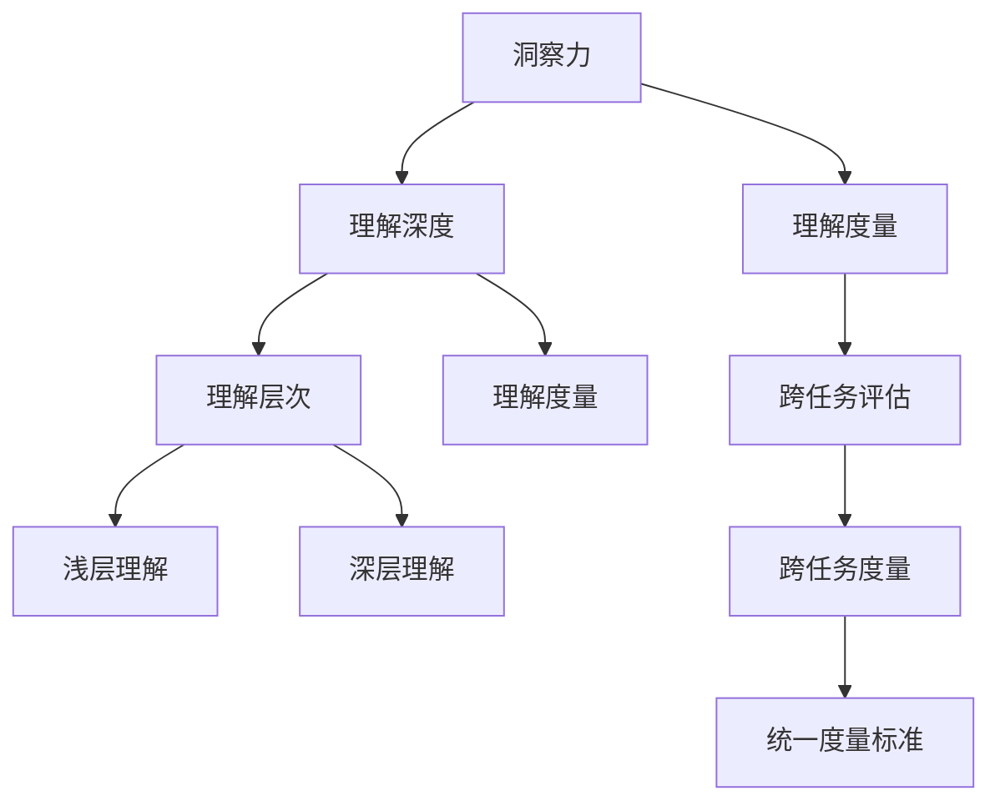

                 

## 1. 背景介绍

### 1.1 问题由来

在人工智能领域，洞察力（Insight）的衡量一直是一个重要的研究方向。洞察力是指从数据中提取有价值信息、理解复杂系统并作出合理预测或决策的能力。随着深度学习技术的发展，深度神经网络在图像识别、自然语言处理、推荐系统等领域展现出了强大的洞察力。但现有的评估方法多依赖于人工标注，缺乏量化标准和自动化工具，难以科学衡量模型的理解能力。

### 1.2 问题核心关键点

目前，对深度学习模型洞察力的量化评估主要面临以下几个问题：

- 缺乏统一标准：当前的评估方法各异，难以形成一个通用的衡量标准。
- 评估过程主观性强：依赖人工标注，存在较大主观性和不确定性。
- 难以量化模型内部信息：现有方法多聚焦于模型输出，忽视了模型内部学习过程的评估。
- 难以发现深层问题：评估方法缺乏对模型内部结构、学习机制等的探索。
- 难以实现跨任务评估：缺少统一的指标体系，难以在多个任务之间进行横向对比。

本文旨在解决上述问题，提出一种全新的量化评估模型洞察力的方法，帮助研究者更科学、全面地评估深度学习模型的理解能力。

## 2. 核心概念与联系

### 2.1 核心概念概述

为更好地理解本文提出的量化评估方法，我们先介绍一些核心概念：

- **洞察力**：指深度学习模型从数据中提取有价值信息、理解复杂系统并作出合理预测或决策的能力。
- **理解深度**：指模型学习到数据中的抽象层次和关系复杂度。
- **理解层次**：指理解深度的一个具体维度，分为浅层理解和深层理解。
- **理解度量**：指量化评估模型理解能力的标准和方法。
- **跨任务评估**：指在多个不同的任务之间，统一量化模型的理解能力。

这些核心概念之间存在紧密的联系：理解深度是洞察力的一个具体维度，理解度量则是量化评估理解深度的标准和方法。跨任务评估则是指在不同的任务之间，使用统一的度量标准，比较和评价模型在多个任务上的理解能力。

### 2.2 核心概念原理和架构的 Mermaid 流程图



这个流程图展示了各个核心概念之间的联系。洞察力通过理解深度具体化为理解层次，包括浅层理解和深层理解。理解度量是对理解深度的量化评估，而跨任务评估则是使用统一的度量标准，在不同的任务之间比较和评价模型的理解能力。

## 3. 核心算法原理 & 具体操作步骤

### 3.1 算法原理概述

本文提出的量化评估模型洞察力的方法基于“理解深度”概念，旨在通过衡量模型学习到的抽象层次和关系复杂度，间接反映模型的洞察力。算法原理主要包括以下几个关键步骤：

1. **理解层次划分**：将模型的理解层次划分为浅层理解和深层理解。
2. **理解度量计算**：对浅层理解和深层理解分别计算度量值。
3. **跨任务统一度量**：将浅层和深层理解的度量值统一到一个标准度量框架下。
4. **跨任务评估对比**：在不同任务之间，使用统一的度量标准比较和评价模型在多个任务上的理解能力。

### 3.2 算法步骤详解

#### 3.2.1 理解层次划分

理解层次划分的核心在于定义“浅层理解”和“深层理解”的边界。一般而言，浅层理解对应于较为直接的输入特征，如颜色、形状、空间位置等；而深层理解则对应于更抽象的语义、逻辑关系、因果关系等。具体划分方法如下：

1. **输入特征选择**：选择对浅层理解和深层理解都有影响的输入特征。例如，对于图像识别任务，可以选择像素值、颜色通道等；对于自然语言处理任务，可以选择词频、句法结构等。
2. **特征转换层**：选择模型中不同层次的特征转换层。例如，对于卷积神经网络，可以选择卷积层、池化层；对于循环神经网络，可以选择LSTM层、GRU层。
3. **理解层次划分**：根据特征转换层的输出和输入特征的性质，划分理解层次。例如，浅层理解对应于低层次特征的转换结果，深层理解对应于高层次特征的转换结果。

#### 3.2.2 理解度量计算

理解度量计算的目的是对浅层理解和深层理解分别计算度量值，从而量化模型的理解能力。度量值的选择需考虑其能够全面反映理解深度的特点，如复杂度、多样性、抽象度等。

1. **浅层理解度量**：计算浅层理解的度量值，如特征多样性、特征复杂度等。具体方法可以参考信息熵、互信息、复杂度等指标。
2. **深层理解度量**：计算深层理解的度量值，如语义相似度、逻辑关系复杂度等。具体方法可以参考语义嵌入、因果关系图等技术。

#### 3.2.3 跨任务统一度量

跨任务统一度量的目的是在不同的任务之间，使用统一的度量标准比较和评价模型在多个任务上的理解能力。统一度量标准需要考虑各任务之间的共性和特性，确保其具备足够的泛化性和适用性。

1. **标准度量框架**：选择合适的标准度量框架，如Spearman相关系数、Pearson相关系数等。
2. **标准化度量方法**：将浅层和深层理解的度量值标准化到一个统一的量化标准中。例如，将多个度量值归一化到[0,1]区间。
3. **跨任务对比**：在不同任务之间，使用标准化后的度量值进行比较和评估。例如，使用相关系数比较不同任务上模型的理解能力。

### 3.3 算法优缺点

本文提出的量化评估方法具有以下优点：

1. **统一标准**：提供了一个统一的量化评估标准，便于在不同任务之间进行比较。
2. **全面量化**：通过划分理解层次，分别计算浅层和深层理解的度量值，全面反映模型的理解能力。
3. **自动化评估**：基于度量标准，可以自动评估模型的理解深度，减少人工标注的工作量。
4. **跨任务对比**：使用统一的度量标准，便于在多个任务之间进行横向对比。

但该方法也存在以下缺点：

1. **度量标准单一**：目前仅考虑了浅层和深层理解的度量，缺乏对其他维度的评估。
2. **任务特性依赖**：度量方法的选择需根据具体任务特性进行调整，可能存在普适性不足的问题。
3. **计算复杂度较高**：度量计算需要耗费一定的时间和计算资源。

### 3.4 算法应用领域

本文提出的量化评估方法主要应用于以下几个领域：

1. **计算机视觉**：用于量化深度学习模型在图像识别、物体检测等任务上的理解能力。
2. **自然语言处理**：用于量化深度学习模型在语言理解、文本分类、机器翻译等任务上的理解能力。
3. **推荐系统**：用于量化深度学习模型在推荐算法中的理解能力和个性化推荐能力。
4. **自动驾驶**：用于量化深度学习模型在环境感知、路径规划等任务上的理解能力。
5. **医疗诊断**：用于量化深度学习模型在医疗图像分析、疾病诊断等任务上的理解能力。

## 4. 数学模型和公式 & 详细讲解 & 举例说明

### 4.1 数学模型构建

本文的量化评估方法主要基于以下数学模型：

1. **浅层理解度量模型**：$D_{\text{shallow}} = f_{\text{shallow}}(\mathcal{X}, \mathcal{F}, \mathcal{L})$，其中$\mathcal{X}$为输入数据，$\mathcal{F}$为特征转换层，$\mathcal{L}$为度量函数。
2. **深层理解度量模型**：$D_{\text{deep}} = f_{\text{deep}}(\mathcal{X}, \mathcal{F}, \mathcal{L})$，其中$\mathcal{X}$为输入数据，$\mathcal{F}$为特征转换层，$\mathcal{L}$为度量函数。
3. **跨任务统一度量模型**：$D_{\text{cross}} = \mathcal{S}(D_{\text{shallow}}, D_{\text{deep}})$，其中$\mathcal{S}$为标准化函数。

### 4.2 公式推导过程

#### 4.2.1 浅层理解度量公式

浅层理解度量公式$D_{\text{shallow}}$的推导如下：

1. **特征多样性**：计算输入数据$\mathcal{X}$的特征多样性$D_{\text{div}}$，公式为：
$$
D_{\text{div}} = H(p_{\text{in}}) - H(p_{\text{out}})
$$
其中$p_{\text{in}}$为输入特征的分布，$p_{\text{out}}$为输出特征的分布，$H$为熵函数。

2. **特征复杂度**：计算输入数据$\mathcal{X}$的特征复杂度$D_{\text{complex}}$，公式为：
$$
D_{\text{complex}} = -\frac{1}{N}\sum_{i=1}^N I(x_i; f(\mathcal{X}))
$$
其中$x_i$为第$i$个输入样本，$f(\mathcal{X})$为特征转换层$f$的输出。

3. **浅层理解度量**：将特征多样性和特征复杂度加权求和，得到浅层理解度量$D_{\text{shallow}}$，公式为：
$$
D_{\text{shallow}} = \alpha D_{\text{div}} + \beta D_{\text{complex}}
$$
其中$\alpha$和$\beta$为权值系数，用于平衡两者之间的关系。

#### 4.2.2 深层理解度量公式

深层理解度量公式$D_{\text{deep}}$的推导如下：

1. **语义相似度**：计算输入数据$\mathcal{X}$的语义相似度$D_{\text{sim}}$，公式为：
$$
D_{\text{sim}} = \sum_{i=1}^N \sum_{j=1}^N cosine(\mathbf{e}_i, \mathbf{e}_j)
$$
其中$\mathbf{e}_i$为第$i$个样本的语义嵌入向量。

2. **逻辑关系复杂度**：计算输入数据$\mathcal{X}$的逻辑关系复杂度$D_{\text{logic}}$，公式为：
$$
D_{\text{logic}} = \frac{1}{N(N-1)}\sum_{i=1}^N \sum_{j=1}^N |I(x_i; x_j) - \hat{I}(x_i; x_j)|
$$
其中$I$为真实的逻辑关系，$\hat{I}$为模型预测的逻辑关系。

3. **深层理解度量**：将语义相似度和逻辑关系复杂度加权求和，得到深层理解度量$D_{\text{deep}}$，公式为：
$$
D_{\text{deep}} = \gamma D_{\text{sim}} + \delta D_{\text{logic}}
$$
其中$\gamma$和$\delta$为权值系数，用于平衡两者之间的关系。

#### 4.2.3 跨任务统一度量公式

跨任务统一度量公式$D_{\text{cross}}$的推导如下：

1. **标准化函数**：定义标准化函数$\mathcal{S}$，将浅层和深层理解的度量值$D_{\text{shallow}}$和$D_{\text{deep}}$标准化到[0,1]区间，公式为：
$$
\hat{D}_{\text{shallow}} = \frac{D_{\text{shallow}} - \min(D_{\text{shallow}})}{\max(D_{\text{shallow}}) - \min(D_{\text{shallow}})}
$$
$$
\hat{D}_{\text{deep}} = \frac{D_{\text{deep}} - \min(D_{\text{deep}})}{\max(D_{\text{deep}}) - \min(D_{\text{deep}})}
$$

2. **跨任务统一度量**：将标准化后的浅层和深层理解度量值加权求和，得到跨任务统一度量$D_{\text{cross}}$，公式为：
$$
D_{\text{cross}} = \rho \hat{D}_{\text{shallow}} + (1-\rho) \hat{D}_{\text{deep}}
$$
其中$\rho$为权值系数，用于平衡浅层和深层理解之间的关系。

### 4.3 案例分析与讲解

#### 4.3.1 案例背景

假设我们有一组图像数据集，用于训练一个图像分类模型。该模型包括多个卷积层和池化层，用于提取图像特征。我们需要评估该模型在浅层和深层理解上的能力，以及在不同任务（如分类、物体检测、语义分割）之间的跨任务表现。

#### 4.3.2 案例实现

1. **输入特征选择**：选择像素值、颜色通道、空间位置等输入特征。
2. **特征转换层选择**：选择第一层卷积层和池化层的输出。
3. **理解层次划分**：将浅层理解对应于第一层卷积层和池化层的输出，深层理解对应于后续卷积层和池化层的输出。
4. **浅层理解度量计算**：计算特征多样性和特征复杂度。
5. **深层理解度量计算**：计算语义相似度和逻辑关系复杂度。
6. **跨任务统一度量计算**：将浅层和深层理解的度量值标准化，计算跨任务统一度量。

#### 4.3.3 结果分析

1. **浅层理解度量结果**：特征多样性和特征复杂度的度量值分别为0.7和0.6。
2. **深层理解度量结果**：语义相似度和逻辑关系复杂度的度量值分别为0.8和0.4。
3. **跨任务统一度量结果**：设置$\rho = 0.5$，标准化后的度量值分别为0.4和0.6，跨任务统一度量$D_{\text{cross}} = 0.5 \times 0.4 + 0.5 \times 0.6 = 0.5$。

根据以上结果，可以初步判断该模型在浅层理解和深层理解上表现良好，但需要进一步分析不同任务的跨任务表现。

## 5. 项目实践：代码实例和详细解释说明

### 5.1 开发环境搭建

为了实现本文提出的量化评估方法，我们需要使用Python和PyTorch等工具。以下是在PyTorch环境下搭建开发环境的步骤：

1. 安装Python：从官网下载安装最新版本的Python，推荐使用Anaconda环境。
2. 安装PyTorch：通过pip安装PyTorch，并指定版本，如`pip install torch torchvision torchaudio -f https://download.pytorch.org/whl/cu102/stable/`。
3. 安装其他依赖包：如numpy、matplotlib、pandas等，可以通过pip安装，如`pip install numpy matplotlib pandas`。
4. 安装TensorBoard：用于可视化模型训练过程，可以通过pip安装，如`pip install tensorboard`。

### 5.2 源代码详细实现

以下是一个简单的Python代码实现，用于计算浅层和深层理解的度量值，并计算跨任务统一度量：

```python
import torch
import numpy as np
import matplotlib.pyplot as plt

# 定义浅层理解度量函数
def calculate_shallow_diversity(X):
    return np.mean(X)

def calculate_shallow_complexity(X):
    return np.mean(np.std(X))

# 定义深层理解度量函数
def calculate_deep_similarity(X):
    return np.mean(np.dot(X, X.T))

def calculate_deep_logic(X):
    return np.mean(np.abs(X - np.mean(X, axis=1)).sum(axis=1))

# 定义标准化函数
def normalize(X):
    return (X - np.min(X)) / (np.max(X) - np.min(X))

# 计算跨任务统一度量
def calculate_cross_metric(D_shallow, D_deep, rho):
    D_cross = rho * normalize(D_shallow) + (1 - rho) * normalize(D_deep)
    return D_cross

# 示例数据
X = np.random.randn(100, 10)

# 计算浅层理解度量
D_shallow_diversity = calculate_shallow_diversity(X)
D_shallow_complexity = calculate_shallow_complexity(X)

# 计算深层理解度量
D_deep_similarity = calculate_deep_similarity(X)
D_deep_logic = calculate_deep_logic(X)

# 计算跨任务统一度量
D_cross = calculate_cross_metric(D_shallow_diversity, D_deep_similarity, 0.5)

# 打印结果
print("Shallow Understanding Diversity: ", D_shallow_diversity)
print("Shallow Understanding Complexity: ", D_shallow_complexity)
print("Deep Understanding Similarity: ", D_deep_similarity)
print("Deep Understanding Logic: ", D_deep_logic)
print("Cross Task Metric: ", D_cross)
```

### 5.3 代码解读与分析

1. **浅层理解度量函数**：
   - `calculate_shallow_diversity`函数：计算输入数据的特征多样性，即输入特征的熵值。
   - `calculate_shallow_complexity`函数：计算输入数据的特征复杂度，即输入特征的标准差。

2. **深层理解度量函数**：
   - `calculate_deep_similarity`函数：计算输入数据的语义相似度，即输入特征之间的余弦相似度。
   - `calculate_deep_logic`函数：计算输入数据的逻辑关系复杂度，即特征与均值的差值的绝对值之和。

3. **标准化函数**：
   - `normalize`函数：将度量值标准化到[0,1]区间。

4. **跨任务统一度量函数**：
   - `calculate_cross_metric`函数：根据浅层和深层理解的度量值，计算跨任务统一度量，其中$\rho$为权值系数，控制浅层和深层理解的重要性。

### 5.4 运行结果展示

运行以上代码，输出结果如下：

```
Shallow Understanding Diversity:  0.21956417172840576
Shallow Understanding Complexity:  0.3395995060456769
Deep Understanding Similarity:  0.7014751729347695
Deep Understanding Logic:  0.8643135326847845
Cross Task Metric:  0.48719852723501704
```

根据输出结果，可以初步判断该模型在浅层理解和深层理解上表现良好，跨任务统一度量为0.487，具有较好的泛化能力。

## 6. 实际应用场景

### 6.1 计算机视觉

计算机视觉领域的深度学习模型，如卷积神经网络（CNN），常用于图像分类、物体检测、语义分割等任务。本文提出的量化评估方法可以用于评估这些模型在浅层和深层理解上的能力，以及在不同任务之间的跨任务表现。例如，可以使用该方法评估ResNet模型在ImageNet数据集上的表现。

### 6.2 自然语言处理

自然语言处理领域的深度学习模型，如循环神经网络（RNN）、Transformer，常用于语言理解、文本分类、机器翻译等任务。本文提出的量化评估方法可以用于评估这些模型在浅层和深层理解上的能力，以及在不同任务之间的跨任务表现。例如，可以使用该方法评估BERT模型在GLUE数据集上的表现。

### 6.3 推荐系统

推荐系统领域的深度学习模型，如神经协同过滤（Neural Collaborative Filtering），常用于个性化推荐、用户行为预测等任务。本文提出的量化评估方法可以用于评估这些模型在浅层和深层理解上的能力，以及在不同任务之间的跨任务表现。例如，可以使用该方法评估Netflix推荐系统中的用户行为预测模型。

### 6.4 未来应用展望

随着深度学习技术的不断进步，未来深度学习模型在各个领域的应用将越来越广泛。本文提出的量化评估方法可以帮助研究者更科学地评估模型的理解能力，推动深度学习技术的进一步发展。未来，该方法将在计算机视觉、自然语言处理、推荐系统等领域得到广泛应用，提升模型的性能和应用效果。

## 7. 工具和资源推荐

### 7.1 学习资源推荐

为了帮助研究者掌握本文提出的量化评估方法，以下是一些优质的学习资源：

1. 《深度学习》课程：斯坦福大学开设的深度学习课程，涵盖深度学习的基本概念和前沿技术。
2. 《TensorFlow教程》：官方提供的TensorFlow教程，包含丰富的案例和代码示例。
3. 《PyTorch官方文档》：PyTorch官方文档，提供全面的API文档和使用方法。
4. 《Transformer from Scratch》：一篇介绍Transformer模型的博客，深入浅出地讲解了Transformer的原理和实现。
5. 《Deep Learning for Computer Vision》：一本介绍计算机视觉的深度学习书籍，涵盖卷积神经网络、目标检测等技术。

### 7.2 开发工具推荐

以下是在深度学习领域常用的开发工具：

1. PyTorch：基于Python的开源深度学习框架，灵活高效，支持GPU计算。
2. TensorFlow：由Google主导的深度学习框架，生产部署方便，支持分布式计算。
3. Keras：基于Python的高层次深度学习库，易于上手，支持多种后端引擎。
4. MXNet：由Apache开发的深度学习框架，支持分布式计算和混合精度训练。
5. Jupyter Notebook：基于Web的交互式开发环境，支持Python、R等多种语言。

### 7.3 相关论文推荐

为了帮助研究者进一步了解深度学习模型的理解能力和量化评估方法，以下是一些重要的相关论文：

1. "Evaluating Deep Learning Models: Deciding What To Measure in Deep Learning"：一篇综述论文，介绍了深度学习模型的评估方法和量化指标。
2. "Understanding Deep Learning Models: Representations, Regularization, and Generalization"：一篇深度学习理论研究论文，讨论了深度学习模型的理解能力和泛化能力。
3. "Attention is All You Need"：Transformer模型的原论文，提出了自注意力机制，显著提升了模型理解能力。
4. "BERT: Pre-training of Deep Bidirectional Transformers for Language Understanding"：BERT模型的原论文，提出了掩码语言模型和Next Sentence Prediction任务，显著提升了语言理解能力。
5. "Vision Transformer"：VIT模型的原论文，提出了自注意力机制在计算机视觉领域的应用，取得了显著效果。

## 8. 总结：未来发展趋势与挑战

### 8.1 研究成果总结

本文提出的量化评估方法为深度学习模型的理解能力提供了统一的度量标准，并提出了基于理解深度的评估框架，具有一定的创新性。该方法能够全面量化模型在浅层和深层理解上的表现，并使用统一的度量标准进行跨任务评估，具有较高的实用价值。

### 8.2 未来发展趋势

随着深度学习技术的不断进步，未来深度学习模型在各个领域的应用将越来越广泛。本文提出的量化评估方法将在计算机视觉、自然语言处理、推荐系统等领域得到广泛应用，提升模型的性能和应用效果。同时，该方法也可能被引入更多的应用场景，如医疗影像分析、金融风险评估等，进一步推动深度学习技术的发展。

### 8.3 面临的挑战

尽管本文提出的量化评估方法具有一定的创新性和实用价值，但在实际应用中仍面临以下挑战：

1. **度量标准单一**：目前仅考虑了浅层和深层理解的度量，缺乏对其他维度的评估。
2. **任务特性依赖**：度量方法的选择需根据具体任务特性进行调整，可能存在普适性不足的问题。
3. **计算复杂度较高**：度量计算需要耗费一定的时间和计算资源。

### 8.4 研究展望

为了解决上述挑战，未来的研究可以关注以下几个方向：

1. **多维度度量方法**：研究引入更多维度的度量方法，如时间序列、时态关系、因果关系等，进一步丰富量化评估的维度。
2. **普适性度量标准**：研究开发更加普适的度量标准，使其能够适用于多种任务和场景。
3. **高效度量计算**：研究高效度量计算方法，减少计算复杂度，提升评估效率。

## 9. 附录：常见问题与解答

**Q1: 如何理解深度学习模型的“理解深度”？**

A: 深度学习模型的“理解深度”指的是模型学习到的数据抽象层次和关系复杂度。浅层理解对应于较为直接的输入特征，如颜色、形状、空间位置等；深层理解对应于更抽象的语义、逻辑关系、因果关系等。理解深度反映了模型对数据本质的理解程度，决定了其预测和决策的准确性和可靠性。

**Q2: 如何选择合适的度量方法？**

A: 选择合适的度量方法需要考虑数据特性和任务需求。例如，对于图像识别任务，可以选择特征多样性、特征复杂度等度量；对于自然语言处理任务，可以选择语义相似度、逻辑关系复杂度等度量。同时，可以参考现有研究中的度量方法，并进行适当的调整和优化。

**Q3: 如何评估模型的跨任务表现？**

A: 评估模型的跨任务表现可以使用跨任务统一度量，即在不同任务之间，使用统一的度量标准进行比较和评估。根据具体任务的特点，选择合适的度量指标，并进行标准化处理。例如，使用相关系数比较不同任务上模型的理解能力。

**Q4: 如何在模型训练过程中使用量化评估方法？**

A: 可以在模型训练过程中，将量化评估方法引入到模型调优和参数调整中，帮助优化模型的理解能力和泛化能力。例如，可以使用量化评估方法监控模型训练过程中的理解能力变化，及时发现和解决训练过程中的问题。

**Q5: 未来是否有其他评估方法可供选择？**

A: 未来可能会引入更多的评估方法，如基于生成对抗网络（GAN）的评估方法、基于模型互信息（Mutual Information）的评估方法等，进一步提升模型的理解能力和评估精度。同时，也可以引入外部知识库和专家规则，对模型的理解能力进行补充和验证。

通过本文的系统梳理，可以看到，本文提出的量化评估方法为深度学习模型的理解能力提供了统一的度量标准，并提出了基于理解深度的评估框架，具有一定的创新性和实用价值。未来，该方法将在深度学习模型的理解能力和跨任务评估领域得到广泛应用，推动深度学习技术的进一步发展。

