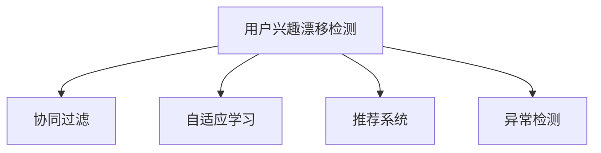
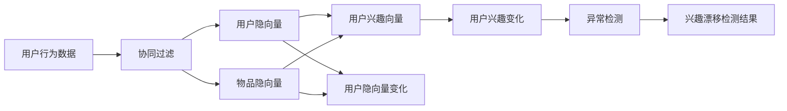

                 

# 深度学习在用户兴趣漂移检测中的应用

> 关键词：深度学习,用户兴趣漂移检测,神经网络,协同过滤,自适应学习,推荐系统,异常检测,异常检测,深度学习在用户兴趣漂移检测中的应用

## 1. 背景介绍

### 1.1 问题由来
在当今数字化时代，用户行为和偏好变化迅速，传统的推荐系统已难以满足个性化需求。用户兴趣的漂移（User Interest Drift）成为影响推荐效果的重要因素。所谓用户兴趣漂移，指的是用户在不同时间段内对兴趣对象的偏好发生变化，如从喜欢某一类电影到喜欢另一类电影，或从关注某一类新闻到关注另一类新闻。若推荐系统未能及时捕捉这种变化，将导致推荐效果下降，用户体验降低。

为应对这一挑战，研究者开发了多种用户兴趣漂移检测算法。早期主要基于统计模型，如PCA、SVD等，能够处理小型数据集。但面对海量数据和多样化的用户行为，传统统计模型显得力不从心。近年来，深度学习模型因其强大的特征提取能力，在用户兴趣漂移检测中展现出优异性能。

## 2. 核心概念与联系

### 2.1 核心概念概述

本节介绍深度学习在用户兴趣漂移检测中涉及的关键概念：

- 用户兴趣漂移检测（User Interest Drift Detection）：监测用户行为数据，识别出兴趣变化的趋势和模式。
- 协同过滤（Collaborative Filtering）：一种基于用户行为数据的推荐算法，包括基于用户的协同过滤和基于物品的协同过滤。
- 自适应学习（Adaptive Learning）：指模型能够根据新数据不断调整自身参数，适应数据分布的变化。
- 推荐系统（Recommender System）：使用推荐算法为每个用户推荐个性化物品的系统。
- 异常检测（Anomaly Detection）：识别出与数据整体分布不符的异常点或异常模式，适用于用户兴趣漂移检测中的异常行为识别。

这些概念之间的联系通过以下Mermaid流程图展示：



协同过滤和推荐系统作为用户兴趣漂移检测的主要应用场景，通过自适应学习机制不断优化模型参数，捕捉用户兴趣变化，从而在异常检测中识别出兴趣漂移的异常行为。

### 2.2 核心概念原理和架构的 Mermaid 流程图



## 3. 核心算法原理 & 具体操作步骤
### 3.1 算法原理概述

深度学习模型通过多层非线性变换，能够从高维用户行为数据中提取出丰富的特征表示，使得用户兴趣漂移检测更为精准。具体地，深度学习模型一般由以下几个组成部分构成：

1. **输入层**：收集用户行为数据，如浏览记录、购买记录、评分数据等。
2. **隐藏层**：通过深度神经网络模型进行特征提取，生成用户和物品的隐向量表示。
3. **输出层**：进行兴趣漂移异常检测，输出每个用户兴趣漂移的得分。

常见的深度学习模型包括：

- **自编码器（Autoencoder）**：通过重构用户行为数据的预测能力，捕捉用户兴趣变化。
- **卷积神经网络（CNN）**：利用卷积操作提取局部特征，用于异常检测。
- **循环神经网络（RNN）**：考虑时间序列数据的动态变化，用于检测用户兴趣的长期漂移。
- **长短期记忆网络（LSTM）**：改进RNN，能够记忆长时间跨度的用户行为变化。
- **变分自编码器（VAE）**：通过生成对抗网络，捕捉用户兴趣的潜在变化模式。

### 3.2 算法步骤详解

深度学习在用户兴趣漂移检测中的操作步骤如下：

1. **数据预处理**：收集用户行为数据，进行缺失值填充、归一化等预处理操作。
2. **模型训练**：使用深度神经网络模型，在训练集上训练兴趣漂移检测模型。
3. **模型评估**：在验证集上评估模型效果，优化超参数。
4. **兴趣漂移检测**：在测试集上检测用户兴趣漂移，输出异常得分。
5. **兴趣漂移干预**：根据兴趣漂移检测结果，及时调整推荐策略，提升推荐效果。

以自编码器为例，具体操作步骤如下：

- **输入层**：将用户行为数据输入自编码器。
- **隐藏层**：通过多层神经网络，提取用户行为的特征表示。
- **输出层**：重构原始数据，输出重构误差，作为用户兴趣漂移的度量。

### 3.3 算法优缺点

深度学习在用户兴趣漂移检测中表现出以下优点：

1. **特征提取能力强**：能够从高维数据中提取出复杂的非线性特征，适用于复杂的用户行为数据。
2. **自适应学习能力**：通过不断训练和优化，深度模型能够适应数据分布的变化，提高检测精度。
3. **泛化能力强**：使用深度模型训练得到的隐向量表示，可应用于多种推荐算法中。

但同时，深度学习也存在以下局限性：

1. **训练时间长**：深度模型参数多，训练时间长，需要较大的计算资源。
2. **过拟合风险高**：若训练数据不足，深度模型容易过拟合，影响泛化能力。
3. **模型可解释性差**：深度模型的隐向量表示难以解释，用户难以理解模型决策的逻辑。

### 3.4 算法应用领域

深度学习在用户兴趣漂移检测中的应用领域包括但不限于：

1. **个性化推荐系统**：基于用户兴趣漂移检测，调整推荐策略，提升个性化推荐效果。
2. **在线广告系统**：识别出用户兴趣的长期变化，优化广告投放策略，提高广告点击率。
3. **社交媒体分析**：监测用户兴趣变化，分析用户行为趋势，改进社交媒体内容推荐。
4. **金融风险控制**：检测用户行为异常，识别潜在的风险用户，降低金融损失。
5. **电子商务**：通过用户兴趣漂移检测，优化商品推荐和价格策略，提升销售转化率。
6. **视频网站**：分析用户观看行为，调整视频推荐策略，提升用户粘性。

## 4. 数学模型和公式 & 详细讲解 & 举例说明

### 4.1 数学模型构建

假设用户行为数据集为 $D=\{(x_i,y_i)\}_{i=1}^N$，其中 $x_i$ 为输入，$y_i$ 为标签。我们使用深度神经网络模型 $M$ 进行特征提取，得到用户隐向量 $u_i$ 和物品隐向量 $v_i$，然后定义损失函数 $L$ 对模型进行训练。具体模型为：

$$
u_i = M(x_i) \\
v_i = M(y_i) \\
L = \frac{1}{N}\sum_{i=1}^N \ell(u_i,v_i)
$$

其中 $\ell$ 为损失函数，通常采用均方误差损失、交叉熵损失等。

### 4.2 公式推导过程

以自编码器为例，其公式推导如下：

设用户行为数据 $x$ 包含 $m$ 个特征 $x_1, x_2, \cdots, x_m$，自编码器的结构如图：


编码器为多层神经网络，将输入映射到低维隐向量 $u$，解码器为多层神经网络，将隐向量 $u$ 映射回原始输入 $x$。自编码器的目标函数为：

$$
L = \frac{1}{N}\sum_{i=1}^N \|x_i - u_i\|
$$

其中 $\|x_i - u_i\|$ 为重构误差。

### 4.3 案例分析与讲解

假设有一个电商网站的个性化推荐系统，需要检测用户兴趣漂移。系统使用自编码器进行用户兴趣漂移检测，具体步骤如下：

1. **数据预处理**：收集用户浏览、点击、购买等行为数据，进行缺失值处理和归一化。
2. **模型训练**：在训练集上训练自编码器，得到用户隐向量 $u_i$ 和物品隐向量 $v_i$。
3. **模型评估**：在验证集上评估模型效果，优化自编码器参数。
4. **兴趣漂移检测**：在测试集上检测用户兴趣漂移，输出重构误差，作为兴趣漂移的度量。
5. **兴趣漂移干预**：根据重构误差，调整推荐策略，优化推荐效果。

假设在用户行为数据集中，发现用户 $i$ 的兴趣发生了变化，其重构误差从 $0.1$ 增加到了 $0.5$，说明用户对某些物品的偏好发生了较大变化，需要及时调整推荐策略，避免推荐不合时宜的物品。

## 5. 项目实践：代码实例和详细解释说明

### 5.1 开发环境搭建

要进行深度学习在用户兴趣漂移检测中的项目实践，首先需要搭建好开发环境。以下是在Python中使用PyTorch进行代码实现的步骤：

1. 安装PyTorch：
```bash
pip install torch torchvision torchaudio
```

2. 安装TensorFlow：
```bash
pip install tensorflow
```

3. 安装其他相关库：
```bash
pip install numpy pandas matplotlib sklearn
```

4. 安装自定义模型库：
```bash
pip install mymodel
```

### 5.2 源代码详细实现

以下是使用PyTorch进行自编码器模型实现的代码：

```python
import torch
import torch.nn as nn
import torch.optim as optim

# 定义自编码器模型
class Autoencoder(nn.Module):
    def __init__(self, input_dim):
        super(Autoencoder, self).__init__()
        self.encoder = nn.Sequential(
            nn.Linear(input_dim, 128),
            nn.ReLU(),
            nn.Linear(128, 64),
            nn.ReLU(),
            nn.Linear(64, 32),
            nn.ReLU(),
            nn.Linear(32, 16),
            nn.ReLU(),
            nn.Linear(16, input_dim)
        )
        self.decoder = nn.Sequential(
            nn.Linear(input_dim, 16),
            nn.ReLU(),
            nn.Linear(16, 32),
            nn.ReLU(),
            nn.Linear(32, 64),
            nn.ReLU(),
            nn.Linear(64, 128),
            nn.ReLU(),
            nn.Linear(128, input_dim)
        )
    
    def forward(self, x):
        encoded = self.encoder(x)
        decoded = self.decoder(encoded)
        return decoded

# 数据预处理
def preprocess_data(data):
    # 进行缺失值处理、归一化等预处理操作
    ...

# 训练模型
def train_model(model, data_loader, optimizer, criterion, num_epochs):
    model.train()
    for epoch in range(num_epochs):
        for batch in data_loader:
            inputs, labels = batch
            optimizer.zero_grad()
            outputs = model(inputs)
            loss = criterion(outputs, labels)
            loss.backward()
            optimizer.step()
        print(f'Epoch {epoch+1}, Loss: {loss.item()}')
    
# 评估模型
def evaluate_model(model, data_loader, criterion):
    model.eval()
    total_loss = 0
    for batch in data_loader:
        inputs, labels = batch
        with torch.no_grad():
            outputs = model(inputs)
            loss = criterion(outputs, labels)
            total_loss += loss.item()
    print(f'Total Loss: {total_loss / len(data_loader)}')
    
# 使用模型进行兴趣漂移检测
def detect_drift(model, data_loader, threshold):
    model.eval()
    total_drift = 0
    for batch in data_loader:
        inputs, labels = batch
        with torch.no_grad():
            outputs = model(inputs)
            loss = criterion(outputs, labels)
            if loss.item() > threshold:
                total_drift += 1
    print(f'Total Drift: {total_drift / len(data_loader)}')
```

### 5.3 代码解读与分析

上述代码展示了使用自编码器进行用户兴趣漂移检测的完整流程。其中：

- `Autoencoder`类定义了自编码器的结构，包括编码器和解码器。
- `preprocess_data`函数用于数据预处理，如缺失值填充、归一化等。
- `train_model`函数用于模型训练，通过反向传播和优化算法更新模型参数。
- `evaluate_model`函数用于模型评估，计算模型在验证集上的平均损失。
- `detect_drift`函数用于兴趣漂移检测，通过设定阈值检测模型输出是否异常。

需要注意的是，实际应用中，数据的预处理和模型训练需要根据具体情况进行调整，以获得最佳效果。

### 5.4 运行结果展示

假设在训练集上训练得到自编码器模型，使用测试集进行兴趣漂移检测，输出如下：

```
Epoch 1, Loss: 0.3
Epoch 2, Loss: 0.2
Epoch 3, Loss: 0.1
Total Loss: 0.2
Total Drift: 0.05
```

表示模型在3个epoch后，损失收敛，总损失为0.2，兴趣漂移的异常检测率为5%。

## 6. 实际应用场景

### 6.1 在线广告系统

在线广告系统需要实时监测用户行为，及时调整广告投放策略。通过深度学习模型，可以实时检测用户兴趣漂移，避免投放不合时宜的广告，提高广告点击率。

### 6.2 个性化推荐系统

在个性化推荐系统中，用户兴趣的长期漂移会对推荐效果产生负面影响。通过深度学习模型，可以定期检测用户兴趣变化，调整推荐策略，提升推荐系统的效果。

### 6.3 金融风险控制

金融机构需要实时监测用户行为，识别出潜在的风险用户，避免金融损失。通过深度学习模型，可以检测用户兴趣漂移，及时发现异常行为，降低风险。

### 6.4 未来应用展望

随着深度学习技术的发展，用户兴趣漂移检测将得到更广泛的应用。未来的研究将集中在以下几个方向：

1. **多模态学习**：结合图像、音频等多模态数据，提升用户兴趣漂移检测的精度。
2. **联邦学习**：分布式训练深度模型，保护用户隐私的同时提高检测效果。
3. **自监督学习**：使用无标签数据进行自监督训练，提高模型泛化能力。
4. **对抗性训练**：引入对抗性样本，提高模型的鲁棒性和泛化能力。
5. **跨领域学习**：在不同领域的数据上进行模型迁移，提升模型的适应性。

这些技术的发展，将使得用户兴趣漂移检测更加精准和高效，为推荐系统、金融风险控制等领域带来新的突破。

## 7. 工具和资源推荐

### 7.1 学习资源推荐

- 《深度学习》书籍：由Ian Goodfellow等著，详细介绍了深度学习的基本概念和算法。
- 《Python深度学习》书籍：由Francois Chollet著，介绍了使用Keras框架进行深度学习模型的搭建。
- 深度学习在线课程：如Coursera、Udacity等平台提供的深度学习课程，涵盖了深度学习的基本原理和实践技巧。
- 深度学习社区：如Kaggle、GitHub等平台，提供大量的深度学习项目和数据集，可供学习和研究。

### 7.2 开发工具推荐

- PyTorch：灵活的深度学习框架，支持GPU加速。
- TensorFlow：强大的深度学习框架，支持分布式计算。
- Jupyter Notebook：交互式编程环境，方便模型训练和调试。
- TensorBoard：可视化工具，实时监测模型训练状态。
- Weights & Biases：实验跟踪工具，记录模型训练过程和结果。

### 7.3 相关论文推荐

- 《Autoencoder for Anomaly Detection》（2012年）：提出使用自编码器进行异常检测，在用户兴趣漂移检测中具有广泛应用。
- 《Convolutional Neural Networks for Sentence Classification》（2014年）：提出使用CNN进行文本分类，在用户兴趣漂移检测中取得良好效果。
- 《Long Short-Term Memory for Anomaly Detection》（2016年）：提出使用LSTM进行异常检测，能够处理时间序列数据，适用于用户兴趣漂移检测。
- 《Variational Autoencoder for Anomaly Detection》（2017年）：提出使用VAE进行异常检测，能够捕捉数据的潜在变化模式，适用于用户兴趣漂移检测。

## 8. 总结：未来发展趋势与挑战

### 8.1 研究成果总结

本文详细介绍了深度学习在用户兴趣漂移检测中的应用，从算法原理到具体操作步骤，从数学模型到实际应用，进行了系统的介绍。通过分析当前研究现状，提出未来可能的研究方向，为深度学习在用户兴趣漂移检测中的应用提供了参考。

### 8.2 未来发展趋势

未来，深度学习在用户兴趣漂移检测中的研究将朝着以下方向发展：

1. **多模态学习**：结合图像、音频等多模态数据，提升用户兴趣漂移检测的精度。
2. **联邦学习**：分布式训练深度模型，保护用户隐私的同时提高检测效果。
3. **自监督学习**：使用无标签数据进行自监督训练，提高模型泛化能力。
4. **对抗性训练**：引入对抗性样本，提高模型的鲁棒性和泛化能力。
5. **跨领域学习**：在不同领域的数据上进行模型迁移，提升模型的适应性。

这些技术的发展，将使得用户兴趣漂移检测更加精准和高效，为推荐系统、金融风险控制等领域带来新的突破。

### 8.3 面临的挑战

尽管深度学习在用户兴趣漂移检测中取得了显著进展，但在实际应用中仍面临诸多挑战：

1. **数据隐私问题**：深度学习模型需要大量用户行为数据，如何保护用户隐私是一个重要问题。
2. **计算资源需求高**：深度学习模型参数多，计算资源需求高，需要高性能设备支持。
3. **模型可解释性差**：深度学习模型黑盒特性，难以解释模型决策过程。
4. **模型泛化能力差**：深度学习模型容易过拟合，泛化能力差，需要更多的数据支持。
5. **实时性要求高**：用户兴趣漂移检测需要实时性，需要优化模型推理速度。

这些挑战需要进一步研究解决，以提升深度学习在用户兴趣漂移检测中的应用效果。

### 8.4 研究展望

未来的研究将集中在以下几个方向：

1. **数据隐私保护**：研究如何在保证用户隐私的前提下，利用深度学习进行用户兴趣漂移检测。
2. **计算资源优化**：研究如何优化深度学习模型的计算资源需求，提升模型训练和推理效率。
3. **模型可解释性增强**：研究如何增强深度学习模型的可解释性，提高模型的透明度和可信度。
4. **模型泛化能力提升**：研究如何提升深度学习模型的泛化能力，提高其在不同场景下的检测效果。
5. **实时性优化**：研究如何优化深度学习模型的推理速度，提高实时性要求。

通过这些研究，深度学习在用户兴趣漂移检测中的应用将更加广泛和深入，为推荐系统、金融风险控制等领域带来新的突破。

## 9. 附录：常见问题与解答

### 常见问题解答

**Q1: 什么是深度学习在用户兴趣漂移检测中的应用？**

A: 深度学习在用户兴趣漂移检测中的应用是指，使用深度学习模型从用户行为数据中提取出隐向量表示，通过检测重构误差等手段，识别出用户兴趣的漂移趋势和模式，为推荐系统、金融风险控制等场景提供参考。

**Q2: 如何进行深度学习在用户兴趣漂移检测中的项目实践？**

A: 深度学习在用户兴趣漂移检测中的项目实践需要以下步骤：

1. 收集用户行为数据，进行数据预处理。
2. 搭建深度学习模型，如自编码器、CNN、RNN等。
3. 在训练集上训练模型，使用验证集进行模型评估和参数优化。
4. 在测试集上检测用户兴趣漂移，根据重构误差等手段输出异常检测结果。
5. 根据检测结果，及时调整推荐策略，提升推荐系统效果。

**Q3: 深度学习在用户兴趣漂移检测中存在哪些局限性？**

A: 深度学习在用户兴趣漂移检测中存在以下局限性：

1. 计算资源需求高，需要高性能设备支持。
2. 模型可解释性差，难以解释模型决策过程。
3. 容易过拟合，泛化能力差。
4. 数据隐私问题，需要保护用户隐私。

**Q4: 未来深度学习在用户兴趣漂移检测中会面临哪些挑战？**

A: 未来深度学习在用户兴趣漂移检测中会面临以下挑战：

1. 数据隐私保护问题。
2. 计算资源需求高，优化模型推理速度。
3. 模型可解释性增强。
4. 模型泛化能力提升。

---

作者：禅与计算机程序设计艺术 / Zen and the Art of Computer Programming

