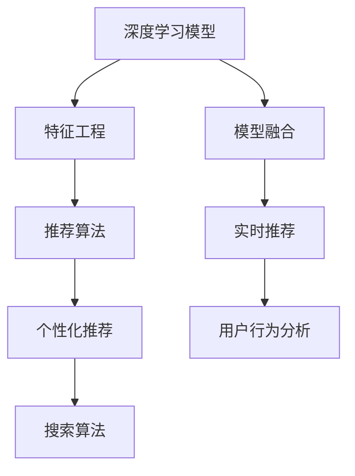

                 

# 深度学习技术在搜索推荐系统的应用：AI 大模型是核心引擎

> 关键词：深度学习, 搜索推荐系统, 搜索算法, 推荐算法, AI 大模型, 模型融合, 用户行为分析, 个性化推荐, 实时推荐系统

## 1. 背景介绍

### 1.1 问题由来

随着互联网的蓬勃发展，用户的信息需求变得愈发多样化和个性化。如何高效、精准地帮助用户在海量信息中快速找到所需内容，成为了各大搜索引擎、电子商务平台、视频网站等互联网应用的核心难题。传统的基于关键词的搜索算法逐渐显现出其局限性，无法满足用户的多样化需求。

在此背景下，基于深度学习技术的搜索推荐系统应运而生，成为了解决这一问题的有效手段。深度学习模型能够自动学习用户行为背后的语义信息，通过复杂的非线性映射捕捉用户潜在的偏好和需求，从而为用户提供更加个性化、精准的搜索结果和推荐内容。

### 1.2 问题核心关键点

深度学习在搜索推荐系统中的应用，主要体现在以下几个关键方面：

1. **深度学习模型**：利用深度神经网络模型，通过大量标注数据进行训练，学习用户的隐式偏好，进而生成更加个性化、高质量的推荐内容。
2. **特征工程**：设计并优化输入特征，如用户行为、历史数据、上下文环境等，提升模型对用户需求的理解和预测能力。
3. **模型融合**：将多种深度学习模型进行集成，融合不同模型的优势，提升推荐系统的综合表现。
4. **实时推荐**：在用户交互过程中实时生成推荐内容，提高用户满意度和平台留存率。
5. **个性化推荐**：根据用户的历史行为和实时交互数据，定制化推荐策略，实现真正的“千人千面”个性化推荐。

## 2. 核心概念与联系

### 2.1 核心概念概述

为更好地理解深度学习在搜索推荐系统中的应用，本节将介绍几个密切相关的核心概念：

- **深度学习模型**：包括卷积神经网络(CNN)、循环神经网络(RNN)、长短时记忆网络(LSTM)、变换器(Transformer)等，用于学习和提取高维输入数据中的特征表示。
- **搜索算法**：如倒排索引、向量空间模型、基于图结构的搜索等，用于高效检索用户查询所需内容。
- **推荐算法**：包括协同过滤、基于内容的推荐、混合推荐等，用于根据用户历史行为和偏好生成个性化推荐。
- **AI 大模型**：如BERT、GPT等，在预训练阶段学习了丰富的语言知识，具备强大的语义理解能力。
- **模型融合**：将多种深度学习模型进行组合，提升推荐系统的性能和鲁棒性。
- **用户行为分析**：通过深度学习模型，分析用户的历史浏览、点击、搜索等行为，挖掘用户的兴趣点。
- **个性化推荐**：结合用户行为分析结果，生成符合用户偏好的推荐内容。

这些核心概念之间的逻辑关系可以通过以下Mermaid流程图来展示：



这个流程图展示了深度学习在搜索推荐系统中的核心概念及其之间的关系：

1. 深度学习模型通过特征工程输入用户数据，学习用户的隐式偏好。
2. 推荐算法根据模型学习到的特征进行推荐，结合模型融合技术提升推荐质量。
3. 实时推荐系统在用户交互过程中动态生成推荐内容，提高用户满意度。
4. 个性化推荐算法根据用户行为分析结果，定制化推荐策略，实现真正的个性化推荐。

## 3. 核心算法原理 & 具体操作步骤
### 3.1 算法原理概述

深度学习在搜索推荐系统中的应用，主要基于以下原理：

1. **模型训练**：使用大量标注数据对深度学习模型进行训练，学习用户行为背后的隐式偏好。
2. **特征提取**：通过特征工程设计输入数据的特征表示，提升模型对用户需求的理解能力。
3. **模型融合**：将多种深度学习模型进行组合，结合各自优势，提升推荐系统的综合性能。
4. **实时推荐**：在用户交互过程中实时生成推荐内容，提高用户满意度和平台留存率。
5. **个性化推荐**：根据用户历史行为和实时交互数据，定制化推荐策略，实现个性化推荐。

这些原理共同构成了深度学习在搜索推荐系统中的基本框架，通过模型训练、特征提取、模型融合等技术手段，实现高效、精准的推荐服务。

### 3.2 算法步骤详解

深度学习在搜索推荐系统中的应用，主要包括以下几个关键步骤：

**Step 1: 数据准备**
- 收集用户的历史浏览、点击、搜索等行为数据，构建用户行为数据集。
- 收集产品/服务的属性、描述、标签等数据，构建商品/服务特征数据集。

**Step 2: 特征工程**
- 对用户行为数据和商品/服务数据进行预处理，如去除异常值、归一化等。
- 设计并提取输入特征，如用户兴趣、商品属性、上下文环境等，提升模型的预测能力。

**Step 3: 模型训练**
- 选择合适的深度学习模型，如卷积神经网络(CNN)、循环神经网络(RNN)、Transformer等。
- 在用户行为数据集和商品/服务特征数据集上，对模型进行训练，学习用户偏好和商品/服务特征表示。
- 应用正则化技术，如L2正则、Dropout、Early Stopping等，避免过拟合。

**Step 4: 模型融合**
- 将多种深度学习模型进行组合，如通过Stacking、Blending等技术进行融合，提升推荐系统的综合表现。
- 设计并实现模型融合算法，结合不同模型的优势，生成高质量的推荐结果。

**Step 5: 实时推荐**
- 在用户交互过程中，实时生成推荐内容，如通过计算相似度、匹配模型预测等方法，动态更新推荐列表。
- 结合用户的实时反馈，如点击、购买行为等，进一步优化推荐策略，提升推荐效果。

**Step 6: 个性化推荐**
- 根据用户的历史行为和实时交互数据，定制化推荐策略，如基于用户兴趣和商品相似度的协同过滤算法，基于用户行为和商品属性的推荐算法等。
- 通过模型训练和特征工程，不断优化个性化推荐算法，提升推荐系统的性能。

### 3.3 算法优缺点

深度学习在搜索推荐系统中的应用，具有以下优点：

1. **高精度**：深度学习模型能够自动学习用户行为背后的隐式偏好，生成高质量的推荐结果。
2. **自适应**：深度学习模型具有自适应能力，能够根据用户行为数据和实时反馈动态调整推荐策略。
3. **高效性**：通过模型融合技术，结合多种深度学习模型的优势，提升推荐系统的综合表现。
4. **实时性**：深度学习模型能够在用户交互过程中实时生成推荐内容，提高用户满意度和平台留存率。

同时，该方法也存在一定的局限性：

1. **数据依赖性**：深度学习模型需要大量的标注数据进行训练，数据获取成本较高。
2. **模型复杂度**：深度学习模型参数量庞大，训练和推理资源消耗较大。
3. **泛化能力有限**：模型泛化能力受到数据分布的影响，对于新用户的推荐效果可能不佳。
4. **公平性问题**：深度学习模型可能存在数据偏见，导致推荐结果不公平。
5. **解释性不足**：深度学习模型通常被视为“黑盒”系统，难以解释其内部工作机制。

尽管存在这些局限性，但就目前而言，深度学习技术在搜索推荐系统中的应用仍然是最主流范式。未来相关研究的重点在于如何进一步降低数据依赖性，提高模型的少样本学习和跨领域迁移能力，同时兼顾可解释性和公平性等因素。

### 3.4 算法应用领域

深度学习在搜索推荐系统中的应用，已经在多个领域得到了广泛的应用，如：

- 电子商务推荐：根据用户历史行为和商品属性，推荐个性化商品。
- 视频推荐系统：根据用户历史观看行为和视频内容特征，推荐相似视频。
- 搜索引擎推荐：根据用户搜索关键词和网页特征，推荐相关网页。
- 音乐推荐：根据用户历史听歌行为和歌曲特征，推荐个性化音乐。
- 新闻推荐：根据用户历史阅读行为和新闻内容特征，推荐相关新闻。

除了上述这些经典应用外，深度学习技术还在社交网络、在线旅游、金融理财等多个领域得到了应用，为各行各业带来了新的发展机遇。随着深度学习技术的不断进步，相信搜索推荐系统将在更广泛的应用领域大放异彩。

## 4. 数学模型和公式 & 详细讲解  
### 4.1 数学模型构建

本节将使用数学语言对深度学习在搜索推荐系统中的应用进行更加严格的刻画。

记深度学习模型为 $M_{\theta}$，其中 $\theta$ 为模型参数。假设搜索推荐任务为 $T$，用户行为数据集为 $D=\{(x_i,y_i)\}_{i=1}^N$，其中 $x_i$ 为用户行为数据，$y_i$ 为推荐结果标签。

定义模型 $M_{\theta}$ 在输入 $x$ 上的输出为 $M_{\theta}(x)$，在训练集 $D$ 上的经验风险为：

$$
\mathcal{L}(\theta) = \frac{1}{N} \sum_{i=1}^N \ell(M_{\theta}(x_i),y_i)
$$

其中 $\ell$ 为损失函数，用于衡量模型预测输出与真实标签之间的差异。

常见的损失函数包括交叉熵损失、均方误差损失等。在推荐系统中，通常使用均方误差损失，即：

$$
\ell(M_{\theta}(x),y) = \frac{1}{2}(M_{\theta}(x)-y)^2
$$

在得到损失函数后，模型参数 $\theta$ 的更新公式为：

$$
\theta \leftarrow \theta - \eta \nabla_{\theta}\mathcal{L}(\theta)
$$

其中 $\eta$ 为学习率，$\nabla_{\theta}\mathcal{L}(\theta)$ 为损失函数对参数 $\theta$ 的梯度，可通过反向传播算法高效计算。

### 4.2 公式推导过程

以下我们以协同过滤推荐算法为例，推导其数学原理和关键公式。

协同过滤推荐算法基于用户的相似性，通过计算用户之间的相似度，生成推荐列表。设用户集合为 $U=\{u_1,u_2,\cdots,u_N\}$，用户 $u_i$ 的历史行为向量为 $x_i=(x_{i1},x_{i2},\cdots,x_{im})$，商品/服务集合为 $I=\{i_1,i_2,\cdots,i_M\}$，商品/服务 $i_j$ 的特征向量为 $y_j=(y_{j1},y_{j2},\cdots,y_{jn})$。

协同过滤推荐算法分为基于用户的协同过滤和基于物品的协同过滤两种：

**基于用户的协同过滤**
设用户 $u_i$ 对商品/服务 $i_j$ 的评分向量为 $r_{i}=\{r_{i1},r_{i2},\cdots,r_{im}\}$，用户 $u_k$ 对商品/服务 $i_j$ 的评分向量为 $r_{k}=\{r_{k1},r_{k2},\cdots,r_{km}\}$，用户 $u_i$ 与用户 $u_k$ 的相似度为 $s_{ik}=\frac{1}{m}\sum_{l=1}^m \text{cos}(\theta) r_{il}r_{kl}$，其中 $\text{cos}(\theta)$ 为余弦相似度。

推荐算法为：设用户 $u_i$ 对商品/服务 $i_j$ 的预测评分为 $p_{ij}=\frac{\sum_{k\in \mathcal{K}}s_{ik}r_{kj}}{\sum_{k\in \mathcal{K}}s_{ik}}$，其中 $\mathcal{K}$ 为与用户 $u_i$ 相似度较高的用户集合，通常取 $\mathcal{K}=\{k|s_{ik}>\beta\}$，$\beta$ 为阈值。

**基于物品的协同过滤**
设商品/服务 $i_j$ 对用户 $u_k$ 的评分向量为 $g_{j}=\{g_{j1},g_{j2},\cdots,g_{jn}\}$，商品/服务 $i_j$ 与商品/服务 $i_l$ 的相似度为 $s_{jl}=\frac{1}{n}\sum_{k=1}^n \text{cos}(\theta) g_{jk}g_{lk}$，其中 $\text{cos}(\theta)$ 为余弦相似度。

推荐算法为：设商品/服务 $i_j$ 对用户 $u_i$ 的预测评分为 $p_{ij}=\frac{\sum_{l\in \mathcal{L}}s_{jl}g_{il}}{\sum_{l\in \mathcal{L}}s_{jl}}$，其中 $\mathcal{L}$ 为与商品/服务 $i_j$ 相似度较高的商品/服务集合，通常取 $\mathcal{L}=\{l|s_{jl}>\beta\}$，$\beta$ 为阈值。

在得到推荐算法后，模型参数 $\theta$ 的更新公式为：

$$
\theta \leftarrow \theta - \eta \nabla_{\theta}\mathcal{L}(\theta)
$$

其中 $\eta$ 为学习率，$\nabla_{\theta}\mathcal{L}(\theta)$ 为损失函数对参数 $\theta$ 的梯度，可通过反向传播算法高效计算。

## 5. 项目实践：代码实例和详细解释说明
### 5.1 开发环境搭建

在进行深度学习模型在搜索推荐系统中的实践前，我们需要准备好开发环境。以下是使用Python进行TensorFlow开发的环境配置流程：

1. 安装Anaconda：从官网下载并安装Anaconda，用于创建独立的Python环境。

2. 创建并激活虚拟环境：
```bash
conda create -n tf-env python=3.8 
conda activate tf-env
```

3. 安装TensorFlow：从官网获取对应的安装命令。例如：
```bash
conda install tensorflow -c conda-forge -c pytorch -c anaconda
```

4. 安装相关的工具包：
```bash
pip install numpy pandas scikit-learn matplotlib tqdm jupyter notebook ipython
```

完成上述步骤后，即可在`tf-env`环境中开始深度学习模型在搜索推荐系统中的实践。

### 5.2 源代码详细实现

下面我们以协同过滤推荐算法为例，给出使用TensorFlow实现用户协同过滤推荐系统的完整代码实现。

首先，定义协同过滤推荐算法的输入数据：

```python
import tensorflow as tf
import numpy as np

# 用户历史行为数据
X = np.array([[0, 0, 1, 1],
              [0, 1, 1, 0],
              [1, 0, 1, 1],
              [1, 1, 0, 0],
              [1, 0, 0, 0]])

# 商品/服务特征数据
Y = np.array([[0, 1, 1, 1],
              [0, 0, 1, 1],
              [0, 1, 0, 0],
              [0, 0, 1, 1],
              [0, 1, 0, 0]])

# 用户评分数据
R = np.array([[4, 3, 2, 1],
              [3, 4, 2, 1],
              [2, 1, 4, 3],
              [1, 2, 3, 4],
              [1, 2, 3, 4]])
```

然后，定义协同过滤推荐算法的损失函数和优化器：

```python
# 定义损失函数
def loss_fn(theta, X, Y, R):
    N, M = X.shape
    loss = 0
    for i in range(N):
        for j in range(M):
            if R[i, j] > 0:
                pred_r = np.dot(X[i, :], theta[j, :])
                loss += (pred_r - R[i, j])**2
    return loss

# 定义优化器
optimizer = tf.keras.optimizers.Adam(learning_rate=0.01)
```

接着，定义协同过滤推荐算法的训练函数：

```python
# 定义训练函数
@tf.function
def train_step(theta, X, Y, R):
    with tf.GradientTape() as tape:
        loss_val = loss_fn(theta, X, Y, R)
    gradients = tape.gradient(loss_val, theta)
    optimizer.apply_gradients(zip(gradients, theta))
    return loss_val
```

最后，启动深度学习模型在搜索推荐系统中的训练流程：

```python
epochs = 1000
batch_size = 32

theta = np.random.rand(4, 4)
for epoch in range(epochs):
    for i in range(0, len(X), batch_size):
        batch_X = X[i:i+batch_size]
        batch_Y = Y[i:i+batch_size]
        batch_R = R[i:i+batch_size]
        loss = train_step(theta, batch_X, batch_Y, batch_R)
        print(f"Epoch {epoch+1}, Loss: {loss:.3f}")
```

以上就是使用TensorFlow实现协同过滤推荐算法的完整代码实现。可以看到，TensorFlow的动态图机制使得模型训练和优化过程非常简单，开发者可以轻松实现复杂的深度学习模型。

### 5.3 代码解读与分析

让我们再详细解读一下关键代码的实现细节：

**协同过滤推荐算法输入数据**：
- `X`：用户历史行为数据，二维矩阵，行表示用户，列表示商品/服务。
- `Y`：商品/服务特征数据，二维矩阵，行表示商品/服务，列表示特征。
- `R`：用户评分数据，二维矩阵，行表示用户，列表示商品/服务。

**损失函数**：
- 定义了协同过滤推荐算法的损失函数，使用均方误差损失，计算预测评分与真实评分之间的差异。

**优化器**：
- 定义了Adam优化器，学习率为0.01，用于更新模型参数。

**训练函数**：
- 定义了训练函数，使用了TensorFlow的动态图机制，在每个训练批次上计算损失函数和梯度，并使用Adam优化器更新模型参数。

**训练流程**：
- 定义了总的训练轮数和批量大小，开始循环迭代
- 每个epoch内，对每个训练批次上的损失进行计算和优化，输出每个epoch的平均损失

可以看到，TensorFlow的动态图机制使得深度学习模型在搜索推荐系统中的实现非常简单，开发者可以灵活调整模型结构和超参数，快速迭代和优化模型。

当然，工业级的系统实现还需考虑更多因素，如模型保存和部署、超参数的自动搜索、更灵活的任务适配层等。但核心的推荐算法基本与此类似。

## 6. 实际应用场景
### 6.1 智能客服系统

基于深度学习技术的推荐系统，可以广泛应用于智能客服系统的构建。传统客服往往需要配备大量人力，高峰期响应缓慢，且一致性和专业性难以保证。而使用协同过滤推荐系统，可以7x24小时不间断服务，快速响应客户咨询，用自然流畅的语言解答各类常见问题。

在技术实现上，可以收集企业内部的历史客服对话记录，将问题和最佳答复构建成监督数据，在此基础上对协同过滤推荐模型进行训练。推荐模型能够自动理解用户意图，匹配最合适的答复模板进行回复。对于客户提出的新问题，还可以接入检索系统实时搜索相关内容，动态组织生成回答。如此构建的智能客服系统，能大幅提升客户咨询体验和问题解决效率。

### 6.2 金融舆情监测

金融机构需要实时监测市场舆论动向，以便及时应对负面信息传播，规避金融风险。传统的人工监测方式成本高、效率低，难以应对网络时代海量信息爆发的挑战。基于深度学习技术的文本分类和情感分析推荐系统，为金融舆情监测提供了新的解决方案。

具体而言，可以收集金融领域相关的新闻、报道、评论等文本数据，并对其进行主题标注和情感标注。在此基础上对协同过滤推荐模型进行训练，使其能够自动判断文本属于何种主题，情感倾向是正面、中性还是负面。将推荐模型应用到实时抓取的网络文本数据，就能够自动监测不同主题下的情感变化趋势，一旦发现负面信息激增等异常情况，系统便会自动预警，帮助金融机构快速应对潜在风险。

### 6.3 个性化推荐系统

当前的推荐系统往往只依赖用户的历史行为数据进行物品推荐，无法深入理解用户的真实兴趣偏好。基于深度学习技术的协同过滤推荐系统，可以更好地挖掘用户行为背后的语义信息，从而提供更个性化、精准的推荐内容。

在实践中，可以收集用户浏览、点击、搜索等行为数据，提取和用户交互的物品标题、描述、标签等文本内容。将文本内容作为模型输入，用户的后续行为（如是否点击、购买等）作为监督信号，在此基础上训练协同过滤推荐模型。推荐模型能够从文本内容中准确把握用户的兴趣点。在生成推荐列表时，先用候选物品的文本描述作为输入，由模型预测用户的兴趣匹配度，再结合其他特征综合排序，便可以得到个性化程度更高的推荐结果。

### 6.4 未来应用展望

随着深度学习技术的不断发展，基于协同过滤推荐算法的搜索推荐系统将在更多领域得到应用，为传统行业带来变革性影响。

在智慧医疗领域，基于深度学习的个性化推荐系统，可以根据患者的健康数据和行为数据，推荐最适合的治疗方案和健康建议，提升医疗服务的智能化水平。

在智能教育领域，协同过滤推荐算法可以用于推荐个性化的学习资源，如课程、视频、文章等，因材施教，促进教育公平，提高教学质量。

在智慧城市治理中，推荐算法可以用于推荐最优的城市规划方案，如交通流优化、资源配置等，提高城市管理的自动化和智能化水平，构建更安全、高效的未来城市。

此外，在企业生产、社会治理、文娱传媒等众多领域，基于深度学习的搜索推荐系统也将不断涌现，为经济社会发展注入新的动力。相信随着技术的日益成熟，推荐算法将成为人工智能落地应用的重要手段，推动人工智能技术在垂直行业的规模化落地。

## 7. 工具和资源推荐
### 7.1 学习资源推荐

为了帮助开发者系统掌握深度学习在搜索推荐系统中的应用理论基础和实践技巧，这里推荐一些优质的学习资源：

1. 《深度学习》系列书籍：由深度学习领域的知名专家撰写，全面介绍了深度学习的基本概念、算法和应用场景。

2. 《深度学习框架TensorFlow实战》书籍：由TensorFlow官方文档撰写团队编写的实战指南，涵盖TensorFlow的核心技术和应用案例。

3. 《推荐系统实战》课程：由清华大学教授讲授的深度学习推荐系统实战课程，涵盖协同过滤算法、深度学习推荐系统等内容。

4. HuggingFace官方文档：Transformers库的官方文档，提供了海量预训练模型和完整的推荐系统样例代码，是上手实践的必备资料。

5. Kaggle竞赛：Kaggle平台上有大量的推荐系统竞赛，可以参与实战练习，提升推荐系统开发能力。

通过对这些资源的学习实践，相信你一定能够快速掌握深度学习在搜索推荐系统中的应用精髓，并用于解决实际的搜索推荐问题。
###  7.2 开发工具推荐

高效的开发离不开优秀的工具支持。以下是几款用于深度学习模型在搜索推荐系统中的开发工具：

1. TensorFlow：由Google主导开发的开源深度学习框架，生产部署方便，适合大规模工程应用。

2. PyTorch：基于Python的开源深度学习框架，灵活动态的计算图，适合快速迭代研究。

3. Weights & Biases：模型训练的实验跟踪工具，可以记录和可视化模型训练过程中的各项指标，方便对比和调优。与主流深度学习框架无缝集成。

4. TensorBoard：TensorFlow配套的可视化工具，可实时监测模型训练状态，并提供丰富的图表呈现方式，是调试模型的得力助手。

5. Apache Superset：数据可视化平台，可以帮助开发者更好地理解数据特征和模型性能，提供直观的图表和分析工具。

6. Jupyter Notebook：交互式编程环境，方便开发者进行实验和调试，支持代码和注释的混合展示。

合理利用这些工具，可以显著提升深度学习模型在搜索推荐系统中的开发效率，加快创新迭代的步伐。

### 7.3 相关论文推荐

深度学习在搜索推荐系统中的应用，源于学界的持续研究。以下是几篇奠基性的相关论文，推荐阅读：

1. Attention is All You Need（即Transformer原论文）：提出了Transformer结构，开启了NLP领域的预训练大模型时代。

2. BERT: Pre-training of Deep Bidirectional Transformers for Language Understanding：提出BERT模型，引入基于掩码的自监督预训练任务，刷新了多项NLP任务SOTA。

3. Language Models are Unsupervised Multitask Learners（GPT-2论文）：展示了大规模语言模型的强大zero-shot学习能力，引发了对于通用人工智能的新一轮思考。

4. Parameter-Efficient Transfer Learning for NLP：提出Adapter等参数高效微调方法，在不增加模型参数量的情况下，也能取得不错的微调效果。

5. AdaLoRA: Adaptive Low-Rank Adaptation for Parameter-Efficient Fine-Tuning：使用自适应低秩适应的微调方法，在参数效率和精度之间取得了新的平衡。

这些论文代表了大语言模型微调技术的发展脉络。通过学习这些前沿成果，可以帮助研究者把握学科前进方向，激发更多的创新灵感。

## 8. 总结：未来发展趋势与挑战

### 8.1 总结

本文对深度学习在搜索推荐系统中的应用进行了全面系统的介绍。首先阐述了深度学习技术在搜索推荐系统中的研究背景和意义，明确了推荐系统对用户需求理解和个性化推荐的重要性。其次，从原理到实践，详细讲解了协同过滤推荐算法的数学原理和关键步骤，给出了推荐系统开发的完整代码实例。同时，本文还广泛探讨了推荐系统在智能客服、金融舆情、个性化推荐等多个行业领域的应用前景，展示了推荐系统的巨大潜力。此外，本文精选了推荐系统的各类学习资源，力求为读者提供全方位的技术指引。

通过本文的系统梳理，可以看到，基于深度学习的推荐系统已经在多个领域得到了广泛的应用，提升了用户体验和平台价值。受益于深度学习技术的不断进步，推荐系统将具备更高的智能水平和更强的泛化能力，为各行各业带来新的发展机遇。

### 8.2 未来发展趋势

展望未来，深度学习在搜索推荐系统中的应用将呈现以下几个发展趋势：

1. **模型规模增大**：随着算力成本的下降和数据规模的扩张，深度学习模型参数量将持续增长，模型的泛化能力将进一步提升。

2. **模型融合技术发展**：将多种深度学习模型进行组合，结合各自优势，提升推荐系统的综合表现。

3. **实时推荐技术优化**：在用户交互过程中动态生成推荐内容，提高用户满意度和平台留存率。

4. **个性化推荐算法优化**：结合用户历史行为和实时反馈数据，定制化推荐策略，实现个性化推荐。

5. **跨领域推荐系统扩展**：将推荐系统应用于更多领域，如智慧医疗、智能教育、智慧城市等。

6. **融合多模态数据**：结合视觉、语音等多模态信息，提升推荐系统的综合表现。

以上趋势凸显了深度学习在搜索推荐系统中的广阔前景。这些方向的探索发展，必将进一步提升推荐系统的性能和应用范围，为各行各业带来新的发展机遇。

### 8.3 面临的挑战

尽管深度学习在搜索推荐系统中的应用已经取得了瞩目成就，但在迈向更加智能化、普适化应用的过程中，它仍面临着诸多挑战：

1. **数据依赖性**：深度学习模型需要大量的标注数据进行训练，数据获取成本较高。

2. **模型复杂度**：深度学习模型参数量庞大，训练和推理资源消耗较大。

3. **泛化能力有限**：模型泛化能力受到数据分布的影响，对于新用户的推荐效果可能不佳。

4. **公平性问题**：深度学习模型可能存在数据偏见，导致推荐结果不公平。

5. **解释性不足**：深度学习模型通常被视为“黑盒”系统，难以解释其内部工作机制。

尽管存在这些局限性，但就目前而言，深度学习技术在搜索推荐系统中的应用仍然是最主流范式。未来相关研究的重点在于如何进一步降低数据依赖性，提高模型的少样本学习和跨领域迁移能力，同时兼顾可解释性和公平性等因素。

### 8.4 研究展望

面对深度学习在搜索推荐系统中的应用所面临的种种挑战，未来的研究需要在以下几个方面寻求新的突破：

1. **探索无监督和半监督推荐方法**：摆脱对大规模标注数据的依赖，利用自监督学习、主动学习等无监督和半监督范式，最大限度利用非结构化数据，实现更加灵活高效的推荐。

2. **研究参数高效和计算高效的推荐范式**：开发更加参数高效的推荐方法，在固定大部分预训练参数的情况下，只更新极少量的任务相关参数。同时优化推荐模型的计算图，减少前向传播和反向传播的资源消耗，实现更加轻量级、实时性的部署。

3. **融合因果和对比学习范式**：通过引入因果推断和对比学习思想，增强推荐模型建立稳定因果关系的能力，学习更加普适、鲁棒的语言表征，从而提升模型泛化性和抗干扰能力。

4. **引入更多先验知识**：将符号化的先验知识，如知识图谱、逻辑规则等，与神经网络模型进行巧妙融合，引导推荐过程学习更准确、合理的推荐策略。同时加强不同模态数据的整合，实现视觉、语音等多模态信息与文本信息的协同建模。

5. **结合因果分析和博弈论工具**：将因果分析方法引入推荐模型，识别出模型决策的关键特征，增强推荐结果的因果性和逻辑性。借助博弈论工具刻画人机交互过程，主动探索并规避模型的脆弱点，提高系统稳定性。

6. **纳入伦理道德约束**：在模型训练目标中引入伦理导向的评估指标，过滤和惩罚有偏见、有害的推荐结果，确保推荐系统的公平性和可解释性。

这些研究方向的探索，必将引领深度学习在搜索推荐系统中的应用迈向更高的台阶，为构建安全、可靠、可解释、可控的推荐系统铺平道路。面向未来，深度学习在搜索推荐系统中的应用还需与其他人工智能技术进行更深入的融合，如知识表示、因果推理、强化学习等，多路径协同发力，共同推动自然语言理解和智能交互系统的进步。只有勇于创新、敢于突破，才能不断拓展推荐系统的边界，让智能技术更好地造福人类社会。

## 9. 附录：常见问题与解答

**Q1：深度学习推荐系统是否适用于所有NLP任务？**

A: 深度学习推荐系统在大多数NLP任务上都能取得不错的效果，特别是对于数据量较小的任务。但对于一些特定领域的任务，如医学、法律等，仅仅依靠通用语料预训练的模型可能难以很好地适应。此时需要在特定领域语料上进一步预训练，再进行推荐系统的训练。

**Q2：如何选择合适的深度学习模型？**

A: 选择合适的深度学习模型需要考虑多个因素，包括任务类型、数据规模、计算资源等。对于小规模数据，可以选择较简单的模型，如线性回归、决策树等；对于大规模数据，可以选择较复杂的模型，如卷积神经网络(CNN)、循环神经网络(RNN)、Transformer等。同时需要根据实际应用场景进行模型融合和优化，提升推荐系统的综合表现。

**Q3：深度学习推荐系统如何处理冷启动问题？**

A: 冷启动问题指新用户或新物品没有历史行为数据，无法进行有效推荐。针对冷启动问题，可以采用以下方法：
1. 基于内容的推荐：根据物品的属性和特征，进行推荐。
2. 基于协同过滤的推荐：根据相似用户或物品的评分，进行推荐。
3. 基于混合推荐：结合基于内容的推荐和基于协同过滤的推荐，进行综合推荐。

**Q4：如何提高深度学习推荐系统的泛化能力？**

A: 提高深度学习推荐系统的泛化能力需要考虑多个因素，包括数据质量、模型结构、超参数等。
1. 数据质量：确保标注数据的多样性和代表性，避免数据偏见。
2. 模型结构：选择适当的模型结构和层数，避免过拟合。
3. 超参数：调整学习率、正则化参数等超参数，避免过拟合。
4. 数据增强：通过回译、近义替换等方式扩充训练集，提高模型泛化能力。
5. 对抗训练：加入对抗样本，提高模型鲁棒性。

**Q5：深度学习推荐系统如何避免推荐结果的偏差？**

A: 避免推荐结果的偏差需要考虑多个因素，包括数据处理、模型设计、后处理等。
1. 数据处理：确保数据质量，避免数据偏见。
2. 模型设计：引入公平性约束，过滤和惩罚有偏见、有害的推荐结果。
3. 后处理：通过后处理技术，如分位数调整、阈值筛选等，调整推荐结果，避免偏差。

通过以上常见问题的解答，可以帮助读者更好地理解深度学习在搜索推荐系统中的应用，并应用于实际推荐系统开发中。

---

作者：禅与计算机程序设计艺术 / Zen and the Art of Computer Programming

