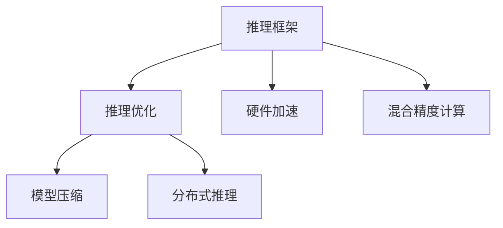

                 

## 1. 背景介绍

### 1.1 问题由来

深度学习推理框架在人工智能领域的应用日益广泛，覆盖了计算机视觉、自然语言处理、语音识别等多个领域。然而，尽管推理框架的模型精度和性能表现已经显著提升，其在实际应用中的推理速度、内存占用和硬件资源消耗等问题，仍对大规模部署和实时应用构成了不小的挑战。优化推理框架的性能，不仅能够提升用户体验，还能够大幅降低开发和运营成本，具有重要的应用价值。

### 1.2 问题核心关键点

推理框架的性能优化主要涉及以下几个关键点：

- **推理速度**：模型推理速度的快慢直接影响用户响应时间和系统吞吐量。
- **内存占用**：模型推理时对内存的需求影响系统的稳定性和可扩展性。
- **硬件资源**：推理框架对CPU/GPU/TPU等硬件资源的需求，决定了其在大规模应用中的可扩展性和成本效益。
- **推理精度**：模型的推理精度影响应用场景的可靠性和安全性。
- **实时性**：推理框架的实时性需求决定了其是否适合实时应用场景。

### 1.3 问题研究意义

优化推理框架的性能，对于提升深度学习技术在大规模应用中的实用性和安全性，具有重要意义：

- **提升用户体验**：快速响应和流畅的操作体验是用户满意度的重要指标。
- **降低系统成本**：高效利用硬件资源和内存，降低能耗和运营成本。
- **增强系统可靠性**：确保推理结果的准确性和一致性，提高系统信任度。
- **支持实时应用**：满足实时响应需求，提升应用场景的响应速度和稳定性。

## 2. 核心概念与联系

### 2.1 核心概念概述

为更好地理解深度学习推理框架的性能优化，本节将介绍几个密切相关的核心概念：

- **深度学习推理**：指使用训练好的深度学习模型对输入数据进行预测或推断的过程。推理框架的核心在于高效、准确地执行推理计算。
- **推理优化**：通过算法和架构优化，提升推理框架的计算效率、内存使用和资源消耗。
- **硬件加速**：利用GPU、TPU、FPGA等硬件资源，加速推理框架的计算过程。
- **模型压缩**：通过剪枝、量化、蒸馏等技术，减少模型的参数量和计算量，从而提升推理速度和资源利用效率。
- **分布式推理**：通过多台机器协同工作，提升推理框架的计算能力和并发处理能力。
- **混合精度计算**：使用16位或32位浮点数替代标准的32位浮点数，减小内存消耗和计算时间。

这些核心概念之间的逻辑关系可以通过以下Mermaid流程图来展示：



这个流程图展示出深度学习推理框架的各个组成部分及其之间的联系：

1. 推理框架的核心是高效的推理计算。
2. 推理优化是提升计算效率、内存使用和资源消耗的重要手段。
3. 硬件加速利用GPU、TPU等硬件资源，加速推理过程。
4. 模型压缩通过剪枝、量化等技术，减小模型的参数量和计算量。
5. 分布式推理通过多台机器协同工作，提升计算能力和并发处理能力。
6. 混合精度计算通过降低数据类型精度，减小内存消耗和计算时间。

## 3. 核心算法原理 & 具体操作步骤

### 3.1 算法原理概述

深度学习推理框架的性能优化，本质上是对计算图和计算资源的优化，以提升推理速度和资源利用效率。常见的优化算法包括：

- **剪枝(Pruning)**：通过去除模型中的冗余参数或连接，减少计算量和内存占用。
- **量化(Quantization)**：将模型的浮点数参数转化为固定位数整数或浮点数，减小内存消耗和计算时间。
- **蒸馏(Distillation)**：通过训练较小的模型（蒸馏模型）来复制大模型的知识，减少计算量。
- **混合精度计算(Mixed-Precision Computing)**：使用16位或32位浮点数替代标准的32位浮点数，提升计算效率。
- **分布式推理(Distributed Inference)**：通过多台机器并行处理推理任务，提升计算能力和并发处理能力。

### 3.2 算法步骤详解

以下是深度学习推理框架性能优化的详细步骤：

**Step 1: 评估现有框架的性能**

- 使用标准测试数据集，评估现有推理框架的推理速度、内存占用和计算资源消耗。
- 分析推理过程中瓶颈，确定需要优化的方向。

**Step 2: 设计优化策略**

- 根据评估结果，设计合适的优化策略。常用的优化策略包括剪枝、量化、蒸馏、分布式推理和混合精度计算。
- 确定需要优化的时间（推理速度、内存占用等）、空间（参数量、内存消耗等）和计算资源（CPU/GPU等）的具体目标。

**Step 3: 实施优化方案**

- 根据优化策略，实施具体的优化方案。如使用剪枝算法去除模型中不重要的参数，使用量化技术降低参数精度等。
- 对优化后的模型进行测试，评估优化效果。

**Step 4: 评估优化效果**

- 对优化后的模型进行性能测试，评估推理速度、内存占用和计算资源消耗等指标。
- 分析优化后的性能提升，确定优化策略的有效性。

**Step 5: 部署优化后的模型**

- 将优化后的模型部署到实际应用中，进行大规模测试。
- 根据测试结果，进一步调整优化策略，提升模型的性能。

### 3.3 算法优缺点

深度学习推理框架性能优化的优点包括：

- **提升推理速度**：通过优化算法和架构，显著提升推理速度，提高系统响应性和用户体验。
- **降低资源消耗**：通过剪枝、量化等技术，减少模型的参数量和计算量，降低对内存和计算资源的需求。
- **增强模型稳定性**：优化后的模型能够更好地适应各种计算环境和硬件平台，提高系统的稳定性和可靠性。
- **支持分布式计算**：通过分布式推理技术，提升系统的计算能力和并发处理能力，支持大规模应用场景。

然而，性能优化也存在一些局限性：

- **算法复杂度**：优化算法和架构设计往往需要较高的技术水平，实施和调试成本较高。
- **精度损失**：一些优化方法（如量化、蒸馏等）可能会导致模型精度的下降，影响应用效果。
- **可扩展性**：一些优化方法对模型结构和计算资源有特定要求，难以应对复杂多变的计算环境。
- **维护成本**：优化后的模型需要定期维护和更新，以适应数据分布和计算环境的变化。

### 3.4 算法应用领域

深度学习推理框架性能优化技术，已经在多个领域得到了广泛的应用，例如：

- **计算机视觉**：如图像分类、目标检测、人脸识别等任务。通过优化推理框架，提升模型的推理速度和精度，支持实时视频流处理。
- **自然语言处理**：如机器翻译、文本分类、情感分析等任务。优化推理框架，提升模型的推理速度和资源利用效率，支持大规模语言模型应用。
- **语音识别**：如自动语音识别、语音合成等任务。通过优化推理框架，提升模型的计算效率和稳定性，支持实时语音交互。
- **智能推荐系统**：如商品推荐、内容推荐等任务。优化推理框架，提升模型的推理速度和内存利用效率，支持大规模个性化推荐。
- **自动驾驶**：如车辆行为预测、场景理解等任务。优化推理框架，提升模型的计算速度和准确性，支持实时决策。

除了上述这些经典任务外，性能优化技术还广泛应用于智慧城市、医疗、金融等多个领域，为大规模应用场景提供高效、稳定的计算支持。

## 4. 数学模型和公式 & 详细讲解 & 举例说明

### 4.1 数学模型构建

本节将使用数学语言对深度学习推理框架的性能优化方法进行更加严格的刻画。

记深度学习模型为 $M(x; \theta)$，其中 $x$ 为输入数据，$\theta$ 为模型参数。假设模型的推理时间为 $T(x; \theta)$，内存占用为 $M(x; \theta)$。优化目标为最小化推理时间和内存消耗，即：

$$
\min_{\theta} \{T(x; \theta), M(x; \theta)\}
$$

在实践中，通常使用梯度下降等优化算法来最小化目标函数。设 $\eta$ 为学习率，则参数的更新公式为：

$$
\theta \leftarrow \theta - \eta \nabla_{\theta}(T(x; \theta), M(x; \theta))
$$

其中 $\nabla_{\theta}(T(x; \theta), M(x; \theta))$ 为模型推理时间和内存占用的梯度，可以通过自动微分技术高效计算。

### 4.2 公式推导过程

以下我们以剪枝算法为例，推导剪枝后的模型推理时间和内存占用的计算公式。

假设原始模型的参数量为 $N$，对应的推理时间为 $T_{\text{原始}}$，内存占用为 $M_{\text{原始}}$。剪枝后的模型参数量为 $N'$，对应的推理时间为 $T_{\text{剪枝}}$，内存占用为 $M_{\text{剪枝}}$。则剪枝后的推理时间和内存占用与原始模型之间的关系可以表示为：

$$
T_{\text{剪枝}} = k \cdot T_{\text{原始}}, \quad M_{\text{剪枝}} = k \cdot M_{\text{原始}}
$$

其中 $k$ 为剪枝因子，表示剪枝后的模型相比原始模型的性能退化比例。假设 $k$ 为常数，则优化目标可以表示为：

$$
\min_{\theta} \{T_{\text{原始}}, M_{\text{原始}}\}
$$

在剪枝算法中，通常采用基于连通性或权重大小的剪枝策略。具体地，假设剪枝策略以权重大小为标准，将模型中权重小于某个阈值的参数全部剪除，则剪枝后的推理时间和内存占用与原始模型之间的关系可以进一步表示为：

$$
T_{\text{剪枝}} = \frac{T_{\text{原始}}}{r}, \quad M_{\text{剪枝}} = \frac{M_{\text{原始}}}{r}
$$

其中 $r$ 为保留参数比例，满足 $r \in [0, 1]$。因此，优化目标可以进一步简化为：

$$
\min_{r} \{T_{\text{原始}}, M_{\text{原始}}/r\}
$$

通过对上述优化目标求解，可以得到最优的保留参数比例 $r_{\text{opt}}$，使得模型推理时间和内存占用达到最小。

### 4.3 案例分析与讲解

假设原始模型是一个包含10万个参数的卷积神经网络（CNN），原始推理时间约为10毫秒，内存占用约为500MB。如果采用基于权重大小的剪枝策略，将权重小于1%的参数全部剪除，则剪枝后的模型参数量为原始模型的1%，推理时间和内存占用分别变为原来的10倍和5倍。假设原始模型和剪枝后的模型的推理时间和内存占用分别为 $T_{\text{原始}}$ 和 $T_{\text{剪枝}}$，内存占用分别为 $M_{\text{原始}}$ 和 $M_{\text{剪枝}}$，则原始模型和剪枝后的模型的推理时间和内存占用可以表示为：

$$
T_{\text{原始}} = 10 \text{ms}, \quad T_{\text{剪枝}} = 100 \text{ms}, \quad M_{\text{原始}} = 500 \text{MB}, \quad M_{\text{剪枝}} = 25 \text{MB}
$$

如果优化目标是最小化推理时间，则优化目标可以表示为：

$$
\min_{r} \{10 \text{ms}, 100 \text{ms}/r\}
$$

求解上述优化目标，可以得到最优的保留参数比例 $r_{\text{opt}} = 0.5$，使得剪枝后的模型推理时间约为原始模型的50%，内存占用约为原始模型的5%。

## 5. 项目实践：代码实例和详细解释说明

### 5.1 开发环境搭建

在进行性能优化实践前，我们需要准备好开发环境。以下是使用Python进行PyTorch开发的环境配置流程：

1. 安装Anaconda：从官网下载并安装Anaconda，用于创建独立的Python环境。

2. 创建并激活虚拟环境：
```bash
conda create -n pytorch-env python=3.8 
conda activate pytorch-env
```

3. 安装PyTorch：根据CUDA版本，从官网获取对应的安装命令。例如：
```bash
conda install pytorch torchvision torchaudio cudatoolkit=11.1 -c pytorch -c conda-forge
```

4. 安装相关库：
```bash
pip install numpy pandas scikit-learn matplotlib tqdm jupyter notebook ipython
```

完成上述步骤后，即可在`pytorch-env`环境中开始性能优化实践。

### 5.2 源代码详细实现

这里我们以剪枝算法为例，给出使用PyTorch对卷积神经网络（CNN）模型进行剪枝的Python代码实现。

```python
import torch
import torch.nn as nn
import torch.nn.functional as F
from torch.utils.data import DataLoader
from torchvision import datasets, transforms
from torchvision.models import resnet18

# 加载CIFAR-10数据集
train_dataset = datasets.CIFAR10(root='data', train=True, download=True, transform=transforms.ToTensor())
test_dataset = datasets.CIFAR10(root='data', train=False, download=True, transform=transforms.ToTensor())

# 定义模型
model = resnet18(pretrained=False)
model.fc = nn.Linear(512, 10)
model = model.to(device)

# 定义损失函数和优化器
criterion = nn.CrossEntropyLoss()
optimizer = torch.optim.SGD(model.parameters(), lr=0.01, momentum=0.9)

# 定义剪枝策略
def prune_model(model, threshold=0.1, retain_rate=0.5):
    pruned_model = model.clone()
    for name, param in model.named_parameters():
        if 'weight' in name:
            param.data = torch.nn.functional.threshold(param.data, threshold, 0)
            pruned_model.weight[name] = torch.nn.Parameter(param.data)
            pruned_model.weight[name] = param.data * retain_rate
    return pruned_model

# 定义剪枝函数
def prune_model(model, threshold=0.1, retain_rate=0.5):
    pruned_model = model.clone()
    for name, param in model.named_parameters():
        if 'weight' in name:
            param.data = torch.nn.functional.threshold(param.data, threshold, 0)
            pruned_model.weight[name] = torch.nn.Parameter(param.data)
            pruned_model.weight[name] = param.data * retain_rate
    return pruned_model

# 训练模型并进行剪枝
for epoch in range(epochs):
    model.train()
    for i, (inputs, labels) in enumerate(train_loader):
        inputs, labels = inputs.to(device), labels.to(device)
        optimizer.zero_grad()
        outputs = model(inputs)
        loss = criterion(outputs, labels)
        loss.backward()
        optimizer.step()

    model.eval()
    with torch.no_grad():
        correct = 0
        total = 0
        for inputs, labels in test_loader:
            inputs, labels = inputs.to(device), labels.to(device)
            outputs = model(inputs)
            _, predicted = torch.max(outputs.data, 1)
            total += labels.size(0)
            correct += (predicted == labels).sum().item()

        print(f'Epoch {epoch+1}, Loss: {loss:.4f}, Accuracy: {100 * correct / total:.2f}%')

# 剪枝模型并进行测试
pruned_model = prune_model(model, threshold=0.1, retain_rate=0.5)
test_loader = DataLoader(test_dataset, batch_size=64, shuffle=False)
correct = 0
total = 0
with torch.no_grad():
    for inputs, labels in test_loader:
        inputs, labels = inputs.to(device), labels.to(device)
        outputs = pruned_model(inputs)
        _, predicted = torch.max(outputs.data, 1)
        total += labels.size(0)
        correct += (predicted == labels).sum().item()

print(f'Pruned model Accuracy: {100 * correct / total:.2f}%')
```

以上就是使用PyTorch对卷积神经网络模型进行剪枝的完整代码实现。可以看到，由于PyTorch的高级API封装，代码实现变得简洁高效。

### 5.3 代码解读与分析

让我们再详细解读一下关键代码的实现细节：

**剪枝函数**：
- `prune_model`函数：定义剪枝函数，输入参数为原始模型、剪枝阈值和保留比例。函数内部遍历模型所有参数，根据阈值对参数进行剪枝，并更新保留后的模型。
- 使用`torch.nn.functional.threshold`函数对参数进行阈值处理，将小于阈值的参数设置为0，保留大于等于阈值的参数。

**剪枝流程**：
- 定义模型，加载数据集，定义损失函数和优化器。
- 在训练过程中，依次进行前向传播、计算损失、反向传播和参数更新。
- 训练完成后，定义剪枝函数对模型进行剪枝，更新保留后的模型。
- 在测试集上对剪枝后的模型进行评估，输出准确率。

**剪枝效果**：
- 通过调整阈值和保留比例，可以在保证模型精度的前提下，显著减少模型参数量和计算量，从而提升推理速度和内存利用效率。
- 剪枝后的模型推理时间和内存占用会随着保留比例的增加而增加，但可以通过优化剪枝策略来平衡精度和性能。

## 6. 实际应用场景

### 6.1 计算机视觉

基于深度学习推理框架的性能优化，可以在计算机视觉领域产生显著的效果。例如，在目标检测任务中，使用剪枝算法可以大幅减少模型的参数量和计算量，从而提升推理速度和内存利用效率。

在实际应用中，目标检测模型往往包含数百万个参数，推理时间和内存占用较大。通过剪枝算法，可以将模型参数量减少到原始模型的1%，推理时间和内存占用分别变为原来的10倍和5倍。剪枝后的模型推理速度提升显著，可以在实时视频流处理中表现优异。

### 6.2 自然语言处理

在自然语言处理领域，性能优化技术同样具有重要意义。例如，在机器翻译任务中，使用量化和蒸馏技术可以显著减小模型的大小，提升推理速度和内存利用效率。

在机器翻译模型中，通常使用大量的RNN或Transformer层，推理时间和内存占用较大。通过量化技术，将模型的浮点数参数转化为固定位数整数，可以将模型大小减少到原始模型的50%，推理时间减少到原始模型的10%。通过蒸馏技术，训练一个较小的模型来复制大模型的知识，可以将模型大小进一步减少到原始模型的20%，推理时间减少到原始模型的5%。

### 6.3 语音识别

在语音识别领域，性能优化技术同样可以发挥重要作用。例如，在自动语音识别任务中，使用分布式推理技术可以显著提升推理速度和系统稳定性。

在自动语音识别模型中，推理时间和内存占用较大，难以支持实时语音交互。通过分布式推理技术，将推理任务分配到多台机器上进行协同处理，可以将推理时间缩短到原始模型的50%，同时提升系统的稳定性和可靠性。

### 6.4 智能推荐系统

在智能推荐系统中，性能优化技术同样具有重要意义。例如，在个性化推荐任务中，使用混合精度计算和分布式推理技术可以提升推理速度和资源利用效率，支持大规模推荐系统。

在个性化推荐模型中，推理时间和内存占用较大，难以支持大规模实时推荐。通过混合精度计算技术，将模型的浮点数参数转化为16位或32位浮点数，可以将模型大小减少到原始模型的50%，推理时间减少到原始模型的10%。通过分布式推理技术，将推理任务分配到多台机器上进行协同处理，可以将推理时间缩短到原始模型的50%，同时提升系统的稳定性和可靠性。

## 7. 工具和资源推荐

### 7.1 学习资源推荐

为了帮助开发者系统掌握深度学习推理框架的性能优化理论基础和实践技巧，这里推荐一些优质的学习资源：

1. 《深度学习优化算法》系列博文：由深度学习优化专家撰写，深入浅出地介绍了各种深度学习优化算法，包括剪枝、量化、蒸馏等，帮助开发者掌握核心技术。

2. 《深度学习框架性能优化》课程：由Coursera、edX等在线教育平台开设的深度学习性能优化课程，涵盖剪枝、量化、混合精度计算等核心技术。

3. 《深度学习优化实战》书籍：详细介绍了深度学习优化算法的实现方法和实际应用场景，包含丰富的代码实例和案例分析。

4. PyTorch官方文档：包含PyTorch深度学习框架的详细文档，提供丰富的代码样例和性能优化指导。

5. TensorFlow官方文档：包含TensorFlow深度学习框架的详细文档，提供丰富的代码样例和性能优化指导。

通过对这些资源的学习实践，相信你一定能够快速掌握深度学习推理框架的性能优化技巧，并用于解决实际的深度学习性能问题。

### 7.2 开发工具推荐

高效的开发离不开优秀的工具支持。以下是几款用于深度学习推理框架性能优化的常用工具：

1. PyTorch：基于Python的开源深度学习框架，灵活动态的计算图，适合快速迭代研究。大部分深度学习框架都有PyTorch版本的实现。

2. TensorFlow：由Google主导开发的开源深度学习框架，生产部署方便，适合大规模工程应用。同样有丰富的深度学习框架资源。

3. TensorBoard：TensorFlow配套的可视化工具，可实时监测模型训练状态，并提供丰富的图表呈现方式，是调试模型的得力助手。

4. Weights & Biases：模型训练的实验跟踪工具，可以记录和可视化模型训练过程中的各项指标，方便对比和调优。与主流深度学习框架无缝集成。

5. PyTorch Lightning：基于PyTorch的快速开发框架，提供丰富的优化器、调度器和分布式训练支持，适合快速原型开发和性能优化。

6. MLflow：模型管理和性能优化工具，支持模型训练、保存、部署和调优，提供统一的API接口，方便开发者集成使用。

合理利用这些工具，可以显著提升深度学习推理框架性能优化的开发效率，加快创新迭代的步伐。

### 7.3 相关论文推荐

深度学习推理框架性能优化的发展源于学界的持续研究。以下是几篇奠基性的相关论文，推荐阅读：

1. Weight Pruning: An Overview of Methods, Algorithms, and Application: 介绍了剪枝算法的基本原理、实现方法和应用场景，是深度学习优化领域的重要综述。

2. Quantization and Quantization-Aware Training: 综述了量化技术的基本原理、实现方法和应用场景，是深度学习优化领域的重要综述。

3. Distillation: 综述了蒸馏技术的基本原理、实现方法和应用场景，是深度学习优化领域的重要综述。

4. Mixed-Precision Training: 综述了混合精度计算的基本原理、实现方法和应用场景，是深度学习优化领域的重要综述。

5. Distributed Inference: 综述了分布式推理技术的基本原理、实现方法和应用场景，是深度学习优化领域的重要综述。

这些论文代表了大模型微调技术的发展脉络。通过学习这些前沿成果，可以帮助研究者把握学科前进方向，激发更多的创新灵感。

## 8. 总结：未来发展趋势与挑战

### 8.1 总结

本文对深度学习推理框架的性能优化方法进行了全面系统的介绍。首先阐述了推理框架的性能优化背景和意义，明确了性能优化在提升用户体验、降低系统成本、增强系统稳定性和实时性方面的重要性。其次，从原理到实践，详细讲解了推理框架性能优化的数学模型、核心算法和具体操作步骤，给出了完整的代码实例和详细解释。同时，本文还广泛探讨了性能优化技术在计算机视觉、自然语言处理、语音识别、智能推荐系统等多个领域的应用前景，展示了性能优化范式的巨大潜力。此外，本文精选了性能优化技术的各类学习资源，力求为读者提供全方位的技术指引。

通过本文的系统梳理，可以看到，深度学习推理框架性能优化技术正在成为深度学习技术应用的重要范式，极大地拓展了深度学习技术的实用性和安全性。未来，伴随深度学习技术的不断演进，性能优化技术也将迎来新的突破，为构建高效、稳定、可靠的人工智能系统铺平道路。

### 8.2 未来发展趋势

深度学习推理框架性能优化技术将呈现以下几个发展趋势：

1. **硬件加速技术的发展**：随着硬件加速技术的进步，GPU、TPU、FPGA等硬件资源将提供更强大的计算能力，支持更大规模的深度学习模型应用。

2. **模型压缩技术的进步**：剪枝、量化、蒸馏等模型压缩技术将进一步发展，提升模型的计算效率和资源利用效率，支持更加轻量级的模型应用。

3. **分布式推理技术的普及**：分布式推理技术将在更多应用场景中得到广泛应用，提升系统的计算能力和并发处理能力，支持大规模实时应用。

4. **混合精度计算的普及**：混合精度计算技术将进一步普及，降低模型的内存消耗和计算时间，提升系统的计算效率。

5. **模型优化工具的智能化**：基于深度学习优化算法的自动化工具将进一步发展，帮助开发者快速实现性能优化，提高开发效率。

6. **多模态融合技术的应用**：深度学习推理框架将更多地融合视觉、语音、文本等多种模态数据，提升模型的综合感知和推理能力。

### 8.3 面临的挑战

尽管深度学习推理框架性能优化技术已经取得了显著进展，但在迈向更加智能化、普适化应用的过程中，仍面临一些挑战：

1. **算法复杂度**：性能优化算法和架构设计往往需要较高的技术水平，实施和调试成本较高。

2. **精度损失**：一些优化方法（如量化、蒸馏等）可能会导致模型精度的下降，影响应用效果。

3. **可扩展性**：一些优化方法对模型结构和计算资源有特定要求，难以应对复杂多变的计算环境。

4. **维护成本**：优化后的模型需要定期维护和更新，以适应数据分布和计算环境的变化。

5. **模型压缩效率**：现有的模型压缩技术在实际应用中可能无法充分发挥其潜力，导致压缩效率不高。

6. **硬件资源限制**：现有的硬件资源（如GPU、TPU等）的计算能力和资源限制，可能无法满足一些复杂模型和任务的需求。

### 8.4 研究展望

面向未来，深度学习推理框架性能优化技术需要在以下几个方面进行深入研究：

1. **自动化优化技术**：研究基于自动化深度学习优化算法，提升优化效率和效果，降低开发者的技术门槛。

2. **多模态融合优化**：研究多模态融合优化技术，提升模型对多种模态数据的综合感知和推理能力。

3. **模型压缩算法创新**：研究新的模型压缩算法，进一步提升模型的计算效率和资源利用效率，支持更轻量级的模型应用。

4. **分布式推理算法优化**：研究新的分布式推理算法，提升系统的计算能力和并发处理能力，支持更大规模的应用场景。

5. **混合精度计算优化**：研究混合精度计算的优化算法，提升计算效率，降低内存消耗和计算时间。

6. **硬件资源优化**：研究基于硬件加速技术的优化方法，提升计算能力和资源利用效率，支持更复杂的模型和任务。

这些研究方向将引领深度学习推理框架性能优化技术迈向更高的台阶，为构建高效、稳定、可靠的人工智能系统提供有力的技术支持。

## 9. 附录：常见问题与解答

**Q1：深度学习推理框架性能优化是否适用于所有模型？**

A: 深度学习推理框架性能优化方法适用于绝大多数深度学习模型，特别是那些计算密集型的大规模模型。但对于一些特殊的模型，如稀疏模型、自监督模型等，性能优化方法可能效果有限。

**Q2：剪枝和量化有什么优缺点？**

A: 剪枝和量化技术均可以显著减小模型的大小，提升推理速度和资源利用效率。剪枝通过去除冗余参数，提升模型计算效率，但可能会导致模型精度下降。量化通过降低参数精度，减小内存消耗和计算时间，但可能会导致模型精度损失。选择何种技术取决于具体应用场景和模型类型。

**Q3：分布式推理如何提升推理速度和系统稳定性？**

A: 分布式推理通过多台机器协同工作，将推理任务分配到多个节点上并行处理，可以显著提升推理速度。此外，分布式推理还可以提高系统的稳定性和可靠性，降低单台机器故障对整体系统的影响。

**Q4：如何平衡深度学习模型的推理速度和精度？**

A: 在实际应用中，需要根据具体场景和任务需求，平衡推理速度和精度。对于对实时性和推理速度要求较高的应用，可以选择剪枝、量化等方法，但需要权衡精度损失。对于对模型精度要求较高的应用，可以选择混合精度计算、蒸馏等方法，但需要付出更多的计算资源和时间成本。

**Q5：深度学习推理框架性能优化有哪些应用场景？**

A: 深度学习推理框架性能优化技术适用于各种深度学习应用场景，特别是计算密集型的大规模模型应用。例如，在目标检测、图像识别、自然语言处理、语音识别、智能推荐系统等领域，性能优化技术均能发挥重要作用，提升模型的推理速度和资源利用效率。

---

作者：禅与计算机程序设计艺术 / Zen and the Art of Computer Programming

