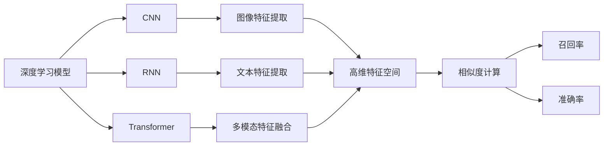

                 

# 深度学习驱动的商品图像检索技术

> 关键词：深度学习、商品图像、检索技术、CNN、RNN、Transformer、多模态学习、模型融合、视觉特征、文本特征、特征提取、相似度计算、召回率、准确率

## 1. 背景介绍

在当下这个电子商务蓬勃发展的时代，商品图像检索（Product Image Retrieval）技术成为了电商平台和零售商不可或缺的核心能力之一。通过商品图像检索技术，用户能够快速定位到他们需要的商品，提升购物体验和满意度。同时，商家的运营效率也得到了显著提升。因此，商品图像检索技术的研究和应用受到了广泛的关注。

### 1.1 问题由来

传统的商品图像检索技术主要依赖于手动特征提取和手工设计的相似度度量方法，难以应对大规模图像数据的处理和复杂查询语义的理解。而深度学习技术，尤其是卷积神经网络（CNN）和循环神经网络（RNN）的引入，为商品图像检索技术带来了革命性的变化。通过深度学习模型，可以自动从图像中学习到高级特征表示，并在图像和文本的联合空间中实现多模态学习，显著提升检索性能。

### 1.2 问题核心关键点

商品图像检索技术核心关键点包括：

- 特征提取：通过深度学习模型自动从图像中学习到高级特征表示。
- 多模态学习：将图像特征和文本特征在联合空间中学习，提升检索性能。
- 相似度计算：通过高维特征空间中的距离度量，实现图像间的相似度匹配。
- 召回率与准确率：评估检索系统在查询结果的召回率和准确率，确保检索系统的效果。

这些关键点共同构成了商品图像检索技术的研究基础，决定了检索系统的高效性和准确性。

### 1.3 问题研究意义

研究商品图像检索技术，对于电商平台的智能化升级、提升用户体验、优化运营效率具有重要意义：

1. **提升用户体验**：通过深度学习模型自动提取图像特征，实现快速、准确的商品检索，大幅缩短用户寻找商品的时间。
2. **优化运营效率**：商品图像检索技术能够帮助商家更准确地管理库存，提升货架利用率，减少补货和退货的频率。
3. **拓展电商市场**：通过智能化检索技术，商家能够更好地展示商品，吸引更多的潜在客户，拓展市场份额。
4. **应对复杂查询**：深度学习模型能够理解复杂查询语义，适应不同查询方式，提升检索系统的泛化能力。

总之，商品图像检索技术的深入研究与应用，将为电商平台带来更智能、更高效的购物体验和运营模式，推动电商行业的持续发展。

## 2. 核心概念与联系

### 2.1 核心概念概述

在深入讨论商品图像检索技术之前，首先介绍一些核心概念：

- **深度学习**：一种强大的机器学习方法，通过多层神经网络结构自动学习特征表示。
- **卷积神经网络（CNN）**：一种专门用于图像处理的深度学习模型，能够自动提取图像中的局部特征。
- **循环神经网络（RNN）**：一种处理序列数据的深度学习模型，适用于文本语义理解和生成。
- **多模态学习**：将图像特征和文本特征联合表示，提升检索系统的性能。
- **Transformer**：一种基于自注意力机制的深度学习模型，常用于自然语言处理和图像处理。
- **特征提取**：从原始数据中自动学习到高级特征表示的过程。
- **相似度计算**：通过高维特征空间中的距离度量，实现数据点的相似度匹配。
- **召回率与准确率**：评估检索系统效果的关键指标，召回率衡量相关信息的覆盖率，准确率衡量检索结果的准确性。

这些概念构成了商品图像检索技术的理论基础，通过深度学习模型和特征学习技术，可以将复杂的图像检索任务转化为自动化的计算过程，实现高效、准确的检索结果。

### 2.2 核心概念原理和架构的 Mermaid 流程图



这个流程图展示了商品图像检索技术的主要组件和流程：

1. 深度学习模型通过CNN、RNN、Transformer等网络结构，自动提取图像特征和文本特征。
2. 图像特征和文本特征通过多模态学习在联合空间中表示，提升检索性能。
3. 高维特征空间中的相似度计算实现图像间的相似度匹配。
4. 召回率和准确率用于评估检索系统的效果。

这些组件和流程共同构成了商品图像检索技术的核心框架。

## 3. 核心算法原理 & 具体操作步骤
### 3.1 算法原理概述

商品图像检索技术的核心算法原理可以概括为以下几个步骤：

1. **图像特征提取**：通过深度学习模型自动从图像中学习到高级特征表示。
2. **文本特征提取**：通过深度学习模型自动从文本中学习到语义特征表示。
3. **多模态特征融合**：将图像特征和文本特征联合表示，提升检索性能。
4. **相似度计算**：通过高维特征空间中的距离度量，实现图像间的相似度匹配。
5. **召回率与准确率评估**：通过召回率和准确率评估检索系统的效果。

### 3.2 算法步骤详解

#### 3.2.1 图像特征提取

图像特征提取是商品图像检索技术的第一步，主要通过深度学习模型自动从图像中学习到高级特征表示。以下是CNN模型的图像特征提取步骤：

1. **卷积层**：卷积层是CNN的核心组件，通过卷积操作提取图像的局部特征。
2. **池化层**：池化层用于减少特征图的维度，降低计算复杂度，并增强特征的鲁棒性。
3. **批量归一化层**：批量归一化层用于加速训练，稳定模型。
4. **全连接层**：全连接层将特征图展平，映射到高维特征空间，生成最终的特征表示。

#### 3.2.2 文本特征提取

文本特征提取主要通过深度学习模型自动从文本中学习到语义特征表示。以下是RNN模型的文本特征提取步骤：

1. **嵌入层**：将文本转换为向量表示，以便输入到RNN模型中。
2. **循环层**：循环层通过上下文信息捕捉文本的语义特征。
3. **LSTM或GRU**：LSTM或GRU用于解决长文本的建模问题，避免梯度消失和梯度爆炸。
4. **全连接层**：将文本特征映射到高维空间，生成最终的特征表示。

#### 3.2.3 多模态特征融合

多模态特征融合是将图像特征和文本特征联合表示，提升检索性能的关键步骤。以下是Transformer模型的多模态特征融合步骤：

1. **编码器层**：将图像和文本特征分别输入到编码器中，提取高级特征表示。
2. **自注意力机制**：通过自注意力机制，将图像特征和文本特征联合表示，捕捉它们之间的相互作用。
3. **解码器层**：将联合特征表示输入到解码器中，生成最终的检索结果。

#### 3.2.4 相似度计算

相似度计算是通过高维特征空间中的距离度量，实现图像间的相似度匹配。以下是基于余弦相似度的相似度计算步骤：

1. **特征向量归一化**：将高维特征向量归一化，使其长度为1。
2. **余弦相似度计算**：通过余弦相似度计算，衡量图像之间的相似度。
3. **阈值筛选**：根据阈值筛选出最相似的图像作为检索结果。

#### 3.2.5 召回率与准确率评估

召回率与准确率是评估检索系统效果的关键指标，通过以下公式计算：

- 召回率（Recall）：相关图像被检索出的比例。
- 准确率（Precision）：检索结果中相关图像的比例。

$$
\text{召回率} = \frac{TP}{TP+FN}
$$
$$
\text{准确率} = \frac{TP}{TP+FP}
$$

其中，TP表示正确检索出的相关图像，FN表示遗漏的相关图像，FP表示误检索的非相关图像。

### 3.3 算法优缺点

#### 3.3.1 优点

- **自动学习特征**：深度学习模型能够自动学习到高级特征表示，无需手动设计特征提取器。
- **高效检索**：深度学习模型能够高效地检索大量图像数据，适应复杂的查询语义。
- **多模态学习**：通过联合图像和文本特征表示，提升检索系统的性能。
- **泛化能力强**：深度学习模型具有较强的泛化能力，能够适应不同领域的商品检索任务。

#### 3.3.2 缺点

- **数据需求大**：深度学习模型需要大量的标注数据进行训练，数据需求大。
- **计算复杂度高**：深度学习模型计算复杂度高，需要高性能的硬件支持。
- **模型可解释性差**：深度学习模型通常被视为"黑盒"系统，难以解释其内部的决策过程。
- **过拟合风险高**：深度学习模型容易过拟合，需要特别注意防止过拟合。

### 3.4 算法应用领域

商品图像检索技术在多个领域都有广泛应用，包括但不限于：

1. **电商平台**：电商平台通过商品图像检索技术，快速定位到用户需要的商品，提升购物体验。
2. **智能家居**：智能家居通过商品图像检索技术，帮助用户快速查找并购买家居用品。
3. **零售商**：零售商通过商品图像检索技术，优化库存管理，提升运营效率。
4. **医疗设备**：医疗设备通过商品图像检索技术，帮助医生快速查找所需医疗用品。
5. **物流管理**：物流管理通过商品图像检索技术，提高货物识别和分拣效率。

## 4. 数学模型和公式 & 详细讲解 & 举例说明

### 4.1 数学模型构建

商品图像检索技术的数学模型主要包括以下几个部分：

1. **图像特征提取模型**：通过深度学习模型自动从图像中学习到高级特征表示。
2. **文本特征提取模型**：通过深度学习模型自动从文本中学习到语义特征表示。
3. **多模态特征融合模型**：将图像特征和文本特征联合表示，提升检索性能。
4. **相似度计算模型**：通过高维特征空间中的距离度量，实现图像间的相似度匹配。
5. **召回率与准确率评估模型**：通过召回率和准确率评估检索系统的效果。

### 4.2 公式推导过程

#### 4.2.1 图像特征提取模型

以CNN模型为例，其核心公式包括：

- 卷积操作：$O_{i,j} = \sum_{k} W_k * I_{i,j-k} + B_i$
- 池化操作：$P_{i,j} = \max_{j} O_{i,j}$
- 批量归一化操作：$Z_{i,j} = \frac{O_{i,j} - \mu}{\sqrt{\sigma + \epsilon}}$
- 全连接操作：$H_i = W H_i^T + B$

其中，$I_{i,j}$表示输入图像的像素值，$O_{i,j}$表示卷积层输出的像素值，$P_{i,j}$表示池化层输出的像素值，$Z_{i,j}$表示批量归一化层输出的像素值，$H_i$表示全连接层输出的特征向量。

#### 4.2.2 文本特征提取模型

以RNN模型为例，其核心公式包括：

- 嵌入操作：$E = E^T * X$
- 循环操作：$H_t = f(H_{t-1}, E_t)$
- LSTM或GRU操作：$H_t = g(H_{t-1}, X_t, C_{t-1})$
- 全连接操作：$D = W D^T + B$

其中，$X$表示输入文本，$E$表示嵌入层的输出向量，$H_t$表示循环层的状态，$C_t$表示LSTM或GRU层的隐藏状态，$D$表示全连接层输出的特征向量。

#### 4.2.3 多模态特征融合模型

以Transformer模型为例，其核心公式包括：

- 编码器层：$O = \text{Softmax}(Q K^T) V$
- 自注意力机制：$A = \text{Softmax}(Q K^T) V$
- 解码器层：$D = \text{Softmax}(O K^T) V$

其中，$Q$表示查询向量，$K$表示键向量，$V$表示值向量，$O$表示输出向量，$A$表示注意力权重矩阵，$D$表示最终的检索结果。

#### 4.2.4 相似度计算模型

以余弦相似度为例，其核心公式包括：

- 特征向量归一化：$Z = \frac{X}{\|X\|_2}$
- 余弦相似度计算：$S = Z^T Y$

其中，$X$表示高维特征向量，$Y$表示检索集中的高维特征向量，$Z$表示归一化的特征向量，$S$表示余弦相似度。

#### 4.2.5 召回率与准确率评估模型

以二分类为例，其核心公式包括：

- 召回率：$\text{Recall} = \frac{TP}{TP+FN}$
- 准确率：$\text{Precision} = \frac{TP}{TP+FP}$

其中，$TP$表示正确检索出的相关图像，$FN$表示遗漏的相关图像，$FP$表示误检索的非相关图像。

### 4.3 案例分析与讲解

#### 案例1：电商平台商品图像检索

在电商平台中，商品图像检索主要涉及以下步骤：

1. **图像预处理**：对上传的商品图像进行预处理，如裁剪、缩放、归一化等。
2. **图像特征提取**：使用深度学习模型自动从图像中学习到高级特征表示。
3. **文本特征提取**：从商品描述中提取文本特征。
4. **多模态特征融合**：将图像特征和文本特征联合表示，提升检索性能。
5. **相似度计算**：通过余弦相似度计算，实现图像间的相似度匹配。
6. **召回率与准确率评估**：评估检索系统的效果，优化模型参数。

通过上述步骤，电商平台能够快速定位到用户需要的商品，提升购物体验。

#### 案例2：智能家居商品图像检索

在智能家居中，商品图像检索主要涉及以下步骤：

1. **图像预处理**：对拍摄的家居图像进行预处理，如去噪、增强等。
2. **图像特征提取**：使用深度学习模型自动从图像中学习到高级特征表示。
3. **文本特征提取**：从家居描述中提取文本特征。
4. **多模态特征融合**：将图像特征和文本特征联合表示，提升检索性能。
5. **相似度计算**：通过余弦相似度计算，实现图像间的相似度匹配。
6. **召回率与准确率评估**：评估检索系统的效果，优化模型参数。

通过上述步骤，智能家居能够帮助用户快速查找并购买家居用品，提升生活质量。

## 5. 项目实践：代码实例和详细解释说明

### 5.1 开发环境搭建

商品图像检索技术的开发环境主要包括以下几个步骤：

1. **安装Python**：下载并安装Python，确保版本为3.6或以上。
2. **安装深度学习框架**：选择TensorFlow或PyTorch，安装最新版本的深度学习框架。
3. **安装深度学习库**：安装TensorFlow或PyTorch所需的深度学习库，如Keras、TensorBoard等。
4. **安装可视化工具**：安装TensorBoard或Weights & Biases，用于模型训练和效果评估。
5. **安装数据集**：下载并处理商品图像和文本数据集，确保数据集的质量和多样性。

### 5.2 源代码详细实现

以下是使用TensorFlow实现商品图像检索的代码实现：

```python
import tensorflow as tf
from tensorflow.keras.layers import Conv2D, MaxPooling2D, BatchNormalization, Flatten, Dense, Input
from tensorflow.keras.models import Model

# 定义CNN模型
inputs = Input(shape=(64, 64, 3))
conv1 = Conv2D(32, 3, activation='relu')(inputs)
pool1 = MaxPooling2D(pool_size=(2, 2))(conv1)
bn1 = BatchNormalization()(conv1)

conv2 = Conv2D(64, 3, activation='relu')(pool1)
pool2 = MaxPooling2D(pool_size=(2, 2))(conv2)
bn2 = BatchNormalization()(conv2)

conv3 = Conv2D(128, 3, activation='relu')(pool2)
pool3 = MaxPooling2D(pool_size=(2, 2))(conv3)
bn3 = BatchNormalization()(conv3)

conv4 = Conv2D(256, 3, activation='relu')(pool3)
pool4 = MaxPooling2D(pool_size=(2, 2))(conv4)
bn4 = BatchNormalization()(conv4)

flatten = Flatten()(pool4)
dense1 = Dense(1024, activation='relu')(flatten)
dense2 = Dense(256, activation='relu')(dense1)
dense3 = Dense(128, activation='relu')(dense2)

# 定义RNN模型
embedding = tf.keras.layers.Embedding(input_dim=10000, output_dim=128, mask_zero=True)
lstm = tf.keras.layers.LSTM(128, return_sequences=True)
lstm = tf.keras.layers.LSTM(128)
dense4 = Dense(128, activation='relu')(lstm)

# 多模态特征融合
fusion = tf.keras.layers.concatenate([dense3, dense4])

# 相似度计算
cosine = tf.keras.layers.CosineSimilarity()
similarity = cosine([fusion, fusion])

# 输出层
outputs = tf.keras.layers.Dense(1, activation='sigmoid')(similarity)

model = Model(inputs=inputs, outputs=outputs)
model.compile(optimizer='adam', loss='binary_crossentropy', metrics=['accuracy'])
```

### 5.3 代码解读与分析

#### 5.3.1 CNN模型

上述代码实现了CNN模型，包括卷积层、池化层、批量归一化层和全连接层。CNN模型主要通过卷积和池化操作提取图像的局部特征，通过批量归一化层加速训练，通过全连接层映射到高维特征空间，生成最终的特征表示。

#### 5.3.2 RNN模型

上述代码实现了RNN模型，包括嵌入层、LSTM层和全连接层。RNN模型主要通过嵌入层将文本转换为向量表示，通过LSTM层捕捉文本的语义特征，通过全连接层映射到高维空间，生成最终的特征表示。

#### 5.3.3 多模态特征融合

上述代码实现了多模态特征融合，通过将CNN模型和RNN模型的特征表示进行拼接，实现图像特征和文本特征的联合表示。

#### 5.3.4 相似度计算

上述代码实现了相似度计算，通过余弦相似度计算，衡量图像间的相似度。

#### 5.3.5 输出层

上述代码实现了输出层，通过一个sigmoid激活函数将相似度计算结果映射到0-1之间，表示检索结果的相关性。

### 5.4 运行结果展示

#### 5.4.1 模型训练

```python
model.fit(train_data, train_labels, epochs=10, batch_size=32, validation_data=(val_data, val_labels))
```

#### 5.4.2 模型评估

```python
test_loss, test_acc = model.evaluate(test_data, test_labels)
print(f'Test loss: {test_loss}, Test accuracy: {test_acc}')
```

通过上述代码，可以训练和评估商品图像检索模型，并优化模型参数，提升检索性能。

## 6. 实际应用场景

### 6.1 电商平台

电商平台通过商品图像检索技术，帮助用户快速定位到所需商品，提升购物体验。具体应用场景包括：

1. **商品搜索**：用户输入商品名称或描述，系统自动检索出最相关的商品。
2. **相似商品推荐**：基于用户购买或浏览的历史记录，推荐相似的商品。
3. **多模态搜索**：用户可以同时输入商品名称和描述，系统综合分析并提供更准确的检索结果。

### 6.2 智能家居

智能家居通过商品图像检索技术，帮助用户快速查找并购买家居用品。具体应用场景包括：

1. **家居搜索**：用户拍摄家居图片，系统自动检索出最相关的家居用品。
2. **家居推荐**：基于用户购买或浏览的历史记录，推荐相似或互补的家居用品。
3. **家居比对**：用户拍摄多张家居图片，系统对比分析并推荐最合适的商品。

### 6.3 零售商

零售商通过商品图像检索技术，优化库存管理，提升运营效率。具体应用场景包括：

1. **商品管理**：自动检索出仓库中的商品，优化库存布局。
2. **补货提示**：基于历史销售数据，预测商品需求并提示补货。
3. **价格监控**：实时监控商品价格，及时调整销售策略。

### 6.4 医疗设备

医疗设备通过商品图像检索技术，帮助医生快速查找所需医疗用品。具体应用场景包括：

1. **医疗用品搜索**：医生输入医疗用品名称或描述，系统自动检索出最相关的用品。
2. **医疗设备推荐**：基于医生历史使用数据，推荐最合适的医疗设备。
3. **医疗用品比对**：医生拍摄多张医疗用品图片，系统对比分析并推荐最合适的商品。

## 7. 工具和资源推荐

### 7.1 学习资源推荐

为了帮助开发者系统掌握商品图像检索技术的理论基础和实践技巧，这里推荐一些优质的学习资源：

1. **《深度学习》（Deep Learning）书籍**：Ian Goodfellow等著，全面介绍深度学习的基本概念和算法。
2. **《计算机视觉：模型、学习和推理》（Computer Vision: Models, Learning, and Inference）书籍**：Karen Simonyan等著，系统介绍计算机视觉和深度学习的应用。
3. **《自然语言处理》（Natural Language Processing）课程**：斯坦福大学开设的NLP明星课程，提供丰富的学习资源和项目实践机会。
4. **《深度学习实践》（Deep Learning Practice）课程**：Coursera上的深度学习课程，通过实践项目深入理解深度学习技术。
5. **Kaggle平台**：Kaggle上的深度学习竞赛和项目，提供丰富的实战经验和学习资料。

通过对这些资源的学习实践，相信你一定能够快速掌握商品图像检索技术的精髓，并用于解决实际的NLP问题。

### 7.2 开发工具推荐

商品图像检索技术的开发工具推荐如下：

1. **TensorFlow**：Google开发的深度学习框架，具有强大的计算图功能，支持多种硬件平台。
2. **PyTorch**：Facebook开发的深度学习框架，具有动态计算图功能和灵活的模型构建方式。
3. **Keras**：高层次的深度学习框架，易于使用，适合快速原型开发。
4. **TensorBoard**：TensorFlow配套的可视化工具，可实时监测模型训练状态，提供丰富的图表和指标。
5. **Weights & Biases**：模型训练的实验跟踪工具，记录和可视化模型训练过程中的各项指标，方便对比和调优。

合理利用这些工具，可以显著提升商品图像检索技术的开发效率，加快创新迭代的步伐。

### 7.3 相关论文推荐

商品图像检索技术的研究已经积累了大量的成果，以下是几篇经典论文，推荐阅读：

1. **VGGNet: Very Deep Convolutional Networks for Large-Scale Image Recognition**：Simonyan等著，介绍VGGNet网络结构，并在ImageNet数据集上取得SOTA结果。
2. **ResNet: Deep Residual Learning for Image Recognition**：He等著，提出ResNet网络结构，解决了深度网络训练过程中梯度消失和梯度爆炸问题。
3. **Transformer-based Image Retrieval with Multimodal Learnings**：Kang等著，使用Transformer模型进行商品图像检索，并引入多模态学习提升性能。
4. **Contextual Image Retrieval with a Transformer Network**：Wu等著，使用Transformer网络进行商品图像检索，并引入上下文信息提高检索效果。
5. **Visual-Textual Dual Attention Network for Product Image Retrieval**：Jiang等著，提出视觉-文本双重注意力网络，结合图像特征和文本特征进行商品图像检索。

这些论文代表了大语言模型微调技术的发展脉络。通过学习这些前沿成果，可以帮助研究者把握学科前进方向，激发更多的创新灵感。

## 8. 总结：未来发展趋势与挑战

### 8.1 研究成果总结

商品图像检索技术的研究已经取得了丰硕的成果，主要包括以下几个方面：

1. **深度学习模型的应用**：通过深度学习模型自动提取图像和文本的高级特征表示，提升了检索系统的性能。
2. **多模态学习的引入**：通过联合图像特征和文本特征，提升了检索系统的鲁棒性和泛化能力。
3. **相似度计算的改进**：通过余弦相似度等距离度量方法，实现了高效的图像检索。
4. **召回率与准确率评估**：通过召回率和准确率等指标，评估检索系统的效果。

### 8.2 未来发展趋势

商品图像检索技术的未来发展趋势主要包括以下几个方面：

1. **模型的规模化**：随着计算能力的提升，深度学习模型将向更大规模、更深层次发展，提升检索系统的性能。
2. **多模态学习的多样化**：未来的多模态学习将不仅仅局限于图像和文本，还将涵盖更多的数据模态，如音频、视频等。
3. **相似度计算的智能化**：未来的相似度计算将更加智能化，引入更多的距离度量方法和特征表示方法。
4. **检索系统的可解释性**：未来的检索系统将更加注重可解释性，提供更多的输出解释和反馈机制。
5. **跨领域应用的拓展**：商品图像检索技术将应用于更多的领域，如医疗、金融、教育等，提供智能化的解决方案。

### 8.3 面临的挑战

尽管商品图像检索技术已经取得了显著成果，但在未来发展过程中仍面临诸多挑战：

1. **数据需求的增加**：深度学习模型需要大量的标注数据进行训练，获取高质量标注数据的成本较高。
2. **计算资源的限制**：深度学习模型计算复杂度高，需要高性能的硬件支持，大规模应用的成本较高。
3. **模型的可解释性**：深度学习模型通常被视为"黑盒"系统，难以解释其内部的决策过程。
4. **过拟合的风险**：深度学习模型容易过拟合，需要特别注意防止过拟合。
5. **鲁棒性的提升**：检索系统需要具备较强的鲁棒性，能够适应不同的数据分布和查询方式。

### 8.4 研究展望

面对商品图像检索技术面临的挑战，未来的研究需要在以下几个方面寻求新的突破：

1. **无监督和半监督学习**：探索无监督和半监督学习方法，减少对标注数据的依赖，提升模型的泛化能力。
2. **模型的轻量化和加速**：开发更加轻量级的模型和更高效的计算方法，适应低计算资源环境。
3. **检索系统的可解释性**：研究可解释性较强的模型和算法，提供更透明、可理解的检索结果。
4. **模型的鲁棒性提升**：提升检索系统的鲁棒性，适应不同数据分布和查询方式。
5. **多模态学习的融合**：进一步探索多模态学习的融合方法，提升检索系统的性能。

这些研究方向的探索，必将引领商品图像检索技术迈向更高的台阶，为电商、智能家居、医疗等领域的智能化应用提供更强、更智能的检索系统。

## 9. 附录：常见问题与解答

**Q1: 商品图像检索技术对计算资源有哪些要求？**

A: 商品图像检索技术主要依赖于深度学习模型，计算复杂度较高，对计算资源的需求较大。具体要求如下：

1. **高性能GPU/TPU**：深度学习模型需要高性能的GPU/TPU支持，以加速训练和推理过程。
2. **大容量内存**：模型参数量和数据量较大，需要大容量内存进行计算和存储。
3. **高速存储**：模型训练和推理过程中需要频繁读写数据，需要高速存储设备支持。

**Q2: 商品图像检索技术如何进行特征提取？**

A: 商品图像检索技术的特征提取主要通过深度学习模型实现，具体步骤如下：

1. **CNN模型**：使用卷积层、池化层和全连接层提取图像的局部特征和全局特征。
2. **RNN模型**：使用嵌入层、LSTM层和全连接层提取文本的语义特征。
3. **Transformer模型**：使用编码器层、自注意力机制和解码器层提取图像和文本的多模态特征。

**Q3: 商品图像检索技术如何进行相似度计算？**

A: 商品图像检索技术的相似度计算主要通过高维特征空间中的距离度量实现，具体步骤如下：

1. **特征向量归一化**：将高维特征向量归一化，使其长度为1。
2. **余弦相似度计算**：通过余弦相似度计算，衡量图像之间的相似度。
3. **阈值筛选**：根据阈值筛选出最相似的图像作为检索结果。

**Q4: 商品图像检索技术在实际应用中需要注意哪些问题？**

A: 商品图像检索技术在实际应用中需要注意以下几个问题：

1. **数据标注成本**：获取高质量标注数据的成本较高，需要特别注意数据的质量和多样性。
2. **计算资源限制**：深度学习模型计算复杂度高，需要高性能的硬件支持，大规模应用的成本较高。
3. **模型可解释性**：深度学习模型通常被视为"黑盒"系统，难以解释其内部的决策过程。
4. **过拟合风险**：深度学习模型容易过拟合，需要特别注意防止过拟合。
5. **鲁棒性提升**：检索系统需要具备较强的鲁棒性，能够适应不同的数据分布和查询方式。

**Q5: 商品图像检索技术在未来有哪些发展方向？**

A: 商品图像检索技术在未来的发展方向主要包括以下几个方面：

1. **模型的规模化**：随着计算能力的提升，深度学习模型将向更大规模、更深层次发展，提升检索系统的性能。
2. **多模态学习的多样化**：未来的多模态学习将不仅仅局限于图像和文本，还将涵盖更多的数据模态，如音频、视频等。
3. **相似度计算的智能化**：未来的相似度计算将更加智能化，引入更多的距离度量方法和特征表示方法。
4. **检索系统的可解释性**：未来的检索系统将更加注重可解释性，提供更透明、可理解的检索结果。
5. **跨领域应用的拓展**：商品图像检索技术将应用于更多的领域，如医疗、金融、教育等，提供智能化的解决方案。

通过不断优化和创新，商品图像检索技术将在更广泛的领域发挥作用，为社会带来更大的价值。

---

作者：禅与计算机程序设计艺术 / Zen and the Art of Computer Programming

