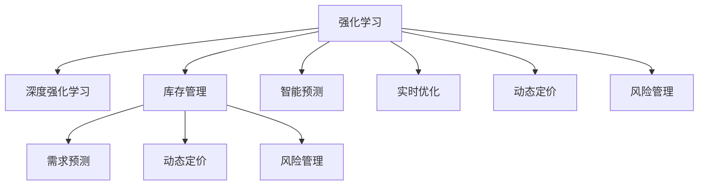

                 

## 1. 背景介绍

### 1.1 问题由来

在电商行业，库存管理是企业运营效率和盈利能力的关键环节。传统的库存管理依赖于历史销售数据和经验法则，无法及时应对市场变化和客户需求，导致库存积压或断货的情况时有发生，严重影响客户满意度和企业收益。而利用深度强化学习技术，可以构建智能化的库存管理系统，自动优化库存水平，提升库存周转率和客户服务质量。

### 1.2 问题核心关键点

深度强化学习在电商库存管理中的核心在于：

- 智能预测：通过深度强化学习算法，预测未来的需求变化，合理制定库存策略。
- 实时优化：实时调整库存水平，快速响应市场波动。
- 动态定价：根据库存状态和市场需求，动态调整商品价格，优化利润率。
- 风险管理：利用强化学习算法，识别和应对库存风险，保障运营稳定性。

## 2. 核心概念与联系

### 2.1 核心概念概述

为更好地理解深度强化学习在电商库存管理中的应用，本节将介绍几个关键概念：

- 强化学习(Reinforcement Learning, RL)：一种通过试错调整，学习最优决策策略的学习范式。智能体通过与环境交互，利用奖励反馈，不断优化行为策略，最终达到优化目标。
- 深度强化学习(Deep Reinforcement Learning, DRL)：结合深度神经网络和强化学习的方法，通过多层次神经网络拟合复杂的环境映射，提升决策模型的性能。
- 库存管理(Inventory Management)：企业对库存水平进行控制，确保满足客户需求的同时，最小化成本和库存风险。
- 需求预测(Demand Forecasting)：通过历史数据和模型，预测未来商品需求，指导库存决策。
- 动态定价(Dynamic Pricing)：根据市场变化和库存状态，实时调整商品价格，优化销售收入和利润。
- 风险管理(Risk Management)：识别和管理库存管理中的不确定性因素，保障运营稳定。

这些概念之间的关系可以通过以下Mermaid流程图来展示：



这个流程图展示了一致强化学习在库存管理中的核心概念及其之间的关系：

1. 深度强化学习通过多层次神经网络，拟合复杂的决策环境，提升了库存管理的智能化水平。
2. 库存管理通过智能预测、实时优化、动态定价和风险管理等技术，实现对库存水平的最优控制。
3. 智能预测和实时优化帮助企业根据市场变化和客户需求，合理制定库存策略，提高运营效率。
4. 动态定价通过实时调整价格，优化利润率，提升企业盈利能力。
5. 风险管理帮助企业识别库存风险，保障运营稳定性。

这些概念共同构成了深度强化学习在电商库存管理中的应用框架，使其能够高效地处理库存管理的复杂问题。通过理解这些核心概念，我们可以更好地把握深度强化学习在电商库存管理中的应用潜力。

## 3. 核心算法原理 & 具体操作步骤

### 3.1 算法原理概述

深度强化学习在电商库存管理中的应用，本质上是一种智能化的决策优化过程。其核心思想是：通过深度神经网络拟合环境映射，学习最优的库存管理策略，最大化企业的收益目标。

具体而言，假设库存管理的决策状态为 $s$，决策动作为 $a$，库存状态转移后的下一个状态为 $s'$，当前策略为 $\pi$，则强化学习的目标函数可以定义为：

$$
J(\pi) = \mathbb{E}_{s,a,s'\sim p}[R(s,a,s')] = \mathbb{E}_{s,a,s'\sim p}[Q(s,a,s')] = \mathbb{E}_{s,a,s'\sim p}[V(s')] - V(s)
$$

其中 $Q(s,a,s')$ 为状态-动作-状态转移的Q值，$V(s)$ 为状态值函数，$R(s,a,s')$ 为即时奖励，$p$ 为状态转移概率。

通过梯度上升等优化算法，强化学习算法不断更新策略参数 $\theta$，使得目标函数 $J(\pi)$ 最大化。在实践中，我们通常使用基于梯度的优化算法（如A3C、DDPG等）来近似求解上述最优化问题。

### 3.2 算法步骤详解

深度强化学习在电商库存管理中的应用一般包括以下几个关键步骤：

**Step 1: 环境设计**
- 定义库存管理问题的环境，包括决策状态、动作空间、即时奖励函数、状态转移概率等。
- 设计环境模拟器，将实际业务规则抽象为可模拟的环境。

**Step 2: 模型设计**
- 选择或设计适合的深度神经网络模型，如DQN、A3C、DDPG等，作为决策策略。
- 确定模型的输入和输出，包括状态表示、动作空间和即时奖励等。

**Step 3: 策略训练**
- 设置训练参数，如学习率、批大小、优化器等。
- 使用采集的数据或模拟环境中的数据，训练模型。
- 定期评估模型的性能，防止过拟合。

**Step 4: 策略部署**
- 将训练好的模型应用到实际库存管理系统中。
- 根据实际市场情况和库存状态，实时输出决策动作。

**Step 5: 持续优化**
- 实时收集反馈，调整模型参数。
- 不断优化模型，提升库存管理效果。

以上是深度强化学习在电商库存管理的一般流程。在实际应用中，还需要针对具体任务的特点，对模型进行优化设计和调整，以进一步提升库存管理效果。

### 3.3 算法优缺点

深度强化学习在电商库存管理中的应用具有以下优点：

1. 适应性强。深度强化学习能够自适应市场变化和客户需求，快速调整库存策略，提高运营效率。
2. 决策自动化。通过训练好的模型，实时自动输出最优决策，减少人工干预，降低运营成本。
3. 性能优越。深度强化学习模型能够学习复杂的决策关系，优化库存管理策略，提升企业的盈利能力。
4. 可扩展性强。深度强化学习模型可以处理大规模的库存数据，扩展性强，适用于各种规模的电商企业。

同时，该方法也存在一些局限性：

1. 模型复杂度高。深度神经网络的复杂度较高，训练过程可能较慢，需要较大的计算资源。
2. 对数据依赖强。深度强化学习依赖于大量历史数据，数据质量不佳可能导致模型性能下降。
3. 鲁棒性不足。深度强化学习模型可能过拟合训练数据，导致泛化能力不足，影响决策的稳定性。
4. 难以解释。深度强化学习模型通常是"黑盒"系统，难以解释其内部工作机制和决策逻辑，影响可解释性。

尽管存在这些局限性，但就目前而言，深度强化学习在电商库存管理中的应用是最先进的方法之一。未来相关研究的重点在于如何进一步降低对数据的依赖，提高模型的鲁棒性和可解释性，同时兼顾决策的实时性和效率。

### 3.4 算法应用领域

深度强化学习在电商库存管理中的应用，已经在诸多企业中得到了广泛验证，并取得了显著的效果。具体应用领域包括：

1. **库存预测**：通过深度强化学习模型，预测未来商品的需求变化，指导库存决策。例如，某电商平台使用深度强化学习模型，预测了商品的未来需求，显著提升了库存周转率。
2. **动态定价**：根据库存状态和市场需求，实时调整商品价格，优化销售收入和利润。例如，某服装电商平台使用深度强化学习模型，实时调整商品价格，提高了库存周转率和利润率。
3. **库存优化**：通过深度强化学习模型，自动调整库存水平，降低成本和库存风险。例如，某零售企业使用深度强化学习模型，优化了库存水平，减少了库存积压和断货情况。
4. **风险管理**：通过深度强化学习模型，识别和管理库存管理中的不确定性因素，保障运营稳定。例如，某电商企业使用深度强化学习模型，识别了库存风险，采取了及时补货措施，保障了运营稳定性。

除了上述这些典型应用外，深度强化学习还在供应链优化、仓库管理、客户服务等多个电商领域得到了应用，为企业的智能化运营提供了新的解决方案。

## 4. 数学模型和公式 & 详细讲解 & 举例说明

### 4.1 数学模型构建

本节将使用数学语言对深度强化学习在电商库存管理中的应用进行更加严格的刻画。

假设库存管理的决策状态为 $s$，决策动作为 $a$，库存状态转移后的下一个状态为 $s'$，当前策略为 $\pi$，则强化学习的目标函数可以定义为：

$$
J(\pi) = \mathbb{E}_{s,a,s'\sim p}[R(s,a,s')] = \mathbb{E}_{s,a,s'\sim p}[Q(s,a,s')] = \mathbb{E}_{s,a,s'\sim p}[V(s')] - V(s)
$$

其中 $Q(s,a,s')$ 为状态-动作-状态转移的Q值，$V(s)$ 为状态值函数，$R(s,a,s')$ 为即时奖励，$p$ 为状态转移概率。

根据目标函数 $J(\pi)$，强化学习算法的优化目标为最大化该函数。在实践中，我们通常使用基于梯度的优化算法（如A3C、DDPG等）来近似求解上述最优化问题。

### 4.2 公式推导过程

以下我们以库存管理问题为例，推导深度强化学习模型的优化目标函数和具体公式。

假设库存管理的目标是最大化销售收入和利润，设 $s$ 为当前库存状态，$a$ 为当前可行的决策动作（如补货、降价等），$R(s,a,s')$ 为即时奖励函数。在每一步决策中，智能体从当前状态 $s$ 执行动作 $a$，得到下一状态 $s'$ 和即时奖励 $R(s,a,s')$，同时智能体的状态值函数 $V(s)$ 更新为 $V(s')$。因此，目标函数可以表示为：

$$
J(\pi) = \mathbb{E}_{s,a,s'\sim p}[R(s,a,s')] = \mathbb{E}_{s,a,s'\sim p}[Q(s,a,s')] = \mathbb{E}_{s,a,s'\sim p}[V(s')] - V(s)
$$

其中 $Q(s,a,s')$ 为状态-动作-状态转移的Q值，$V(s)$ 为状态值函数，$R(s,a,s')$ 为即时奖励。

在具体实现中，可以使用基于梯度的优化算法（如A3C、DDPG等）来求解上述目标函数。例如，在A3C算法中，智能体通过并行更新多个子策略，同时与环境交互，不断优化决策策略。

### 4.3 案例分析与讲解

以某电商平台的库存管理为例，分析深度强化学习的具体应用。

**问题描述**：某电商平台销售某种商品，目标是最大化销售收入和利润。假设商品需求呈季节性变化，每天可采取的决策动作包括补货、降价、不操作等，库存状态包括正常、低库存、断货等。

**算法流程**：

1. **环境设计**：定义状态 $s$ 为当前库存量，动作 $a$ 为补货、降价、不操作等。设定即时奖励函数 $R(s,a,s')$ 为销售收入减去库存成本。设定状态转移概率 $p$ 为市场变化的概率分布。

2. **模型设计**：选择A3C算法，设计状态表示网络、动作策略网络和值函数网络。

3. **策略训练**：在实际销售数据上训练模型，不断优化决策策略。

4. **策略部署**：将训练好的模型应用到实际销售系统中，实时输出决策动作。

5. **持续优化**：根据实时销售数据，不断调整模型参数，提升决策效果。

**实验结果**：通过深度强化学习模型，该电商平台实现了库存周转率的提升和销售收入的增加，显著提高了运营效率和盈利能力。

## 5. 项目实践：代码实例和详细解释说明

### 5.1 开发环境搭建

在进行深度强化学习项目实践前，我们需要准备好开发环境。以下是使用Python进行TensorFlow开发的环境配置流程：

1. 安装Anaconda：从官网下载并安装Anaconda，用于创建独立的Python环境。

2. 创建并激活虚拟环境：
```bash
conda create -n drl-env python=3.8 
conda activate drl-env
```

3. 安装TensorFlow：根据CUDA版本，从官网获取对应的安装命令。例如：
```bash
conda install tensorflow=2.8 -c pytorch -c conda-forge
```

4. 安装Keras和Gym：
```bash
pip install keras gym
```

5. 安装Gym提供的库存管理环境：
```bash
pip install gym-stocker-environment
```

完成上述步骤后，即可在`drl-env`环境中开始项目实践。

### 5.2 源代码详细实现

下面我们以库存管理问题为例，给出使用TensorFlow和Keras进行深度强化学习项目的PyTorch代码实现。

首先，定义库存管理问题的环境：

```python
import gym
import gym_stock_environment

# 注册库存管理环境
gym.register(
    "InventoryEnv-v1",
    gym_stock_environment.InventoryEnv,
    entry_point="inventory_env:InventoryEnv"
)
```

然后，定义模型和训练参数：

```python
from keras.models import Sequential
from keras.layers import Dense, Flatten, LSTM

# 定义状态表示网络
state_network = Sequential()
state_network.add(Dense(64, input_dim=1, activation='relu'))
state_network.add(LSTM(64))
state_network.add(Dense(1))

# 定义动作策略网络
action_network = Sequential()
action_network.add(Dense(64, input_dim=3, activation='relu'))
action_network.add(Dense(1, activation='sigmoid'))

# 定义值函数网络
value_network = Sequential()
value_network.add(Dense(64, input_dim=1, activation='relu'))
value_network.add(Dense(1))

# 设置训练参数
max_steps = 10000
batch_size = 32
learning_rate = 0.001
gamma = 0.9
```

接着，定义训练和评估函数：

```python
from tensorflow.keras.optimizers import Adam

# 定义优化器
optimizer = Adam(lr=learning_rate)

# 定义训练函数
def train_episode(env, state_network, action_network, value_network):
    state = env.reset()
    total_reward = 0
    for step in range(max_steps):
        # 状态表示
        state = state_network.predict(state.reshape(1, -1))
        
        # 决策动作
        action = np.where(action_network.predict(state) > 0.5, 1, 0)
        
        # 执行动作
        next_state, reward, done, _ = env.step(action[0])
        
        # 状态值函数
        value = value_network.predict(next_state.reshape(1, -1))
        
        # 计算Q值
        Q_value = reward + gamma * value
        
        # 更新状态表示网络
        state_network.train_on_batch(state.reshape(1, -1), Q_value)
        
        # 更新状态值函数
        value_network.train_on_batch(next_state.reshape(1, -1), Q_value)
        
        # 更新动作策略网络
        action_network.train_on_batch(state.reshape(1, -1), np.array([[1 if action[0] else 0]]))
        
        total_reward += reward
        if done:
            break
    
    return total_reward

# 定义评估函数
def evaluate_episode(env, state_network, action_network, value_network):
    state = env.reset()
    total_reward = 0
    for step in range(max_steps):
        # 状态表示
        state = state_network.predict(state.reshape(1, -1))
        
        # 决策动作
        action = np.where(action_network.predict(state) > 0.5, 1, 0)
        
        # 执行动作
        next_state, reward, done, _ = env.step(action[0])
        
        # 状态值函数
        value = value_network.predict(next_state.reshape(1, -1))
        
        total_reward += reward
        if done:
            break
    
    return total_reward
```

最后，启动训练流程并在测试集上评估：

```python
# 创建环境
env = gym.make("InventoryEnv-v1")

# 训练模型
for i in range(1000):
    total_reward = train_episode(env, state_network, action_network, value_network)
    print("Episode {}: Total Reward = {}".format(i+1, total_reward))
    
# 评估模型
total_reward = evaluate_episode(env, state_network, action_network, value_network)
print("Total Reward: {}".format(total_reward))
```

以上就是使用TensorFlow和Keras进行库存管理问题的深度强化学习项目的完整代码实现。可以看到，借助强大的框架封装，我们可以用相对简洁的代码实现深度强化学习模型的训练和评估。

### 5.3 代码解读与分析

让我们再详细解读一下关键代码的实现细节：

**state_network类**：
- 定义了库存管理问题的状态表示网络，通过LSTM网络捕捉历史库存数据的时间序列特征。

**action_network类**：
- 定义了动作策略网络，通过Sigmoid函数输出决策动作，指导库存管理。

**value_network类**：
- 定义了状态值函数网络，通过Dense网络拟合状态值函数，用于计算Q值。

**train_episode函数**：
- 定义了训练函数，通过与环境交互，不断优化决策策略，最大化累计奖励。
- 使用状态表示网络、动作策略网络和状态值函数网络，实现端到端的强化学习。

**evaluate_episode函数**：
- 定义了评估函数，用于评估模型在实际环境中的性能。
- 使用状态表示网络和动作策略网络，输出决策动作，并在环境中执行，计算累计奖励。

**训练流程**：
- 创建环境并训练模型，通过不断优化策略，最大化累计奖励。
- 在测试集上评估模型，输出总奖励。

可以看到，TensorFlow和Keras结合使用，使得深度强化学习的代码实现变得简洁高效。开发者可以将更多精力放在模型改进、环境设计等高层逻辑上，而不必过多关注底层的实现细节。

当然，工业级的系统实现还需考虑更多因素，如模型的保存和部署、超参数的自动搜索、更灵活的环境设计等。但核心的强化学习范式基本与此类似。

## 6. 实际应用场景

### 6.1 智能仓储

智能仓储是深度强化学习在电商库存管理中的应用之一，旨在通过自动化和智能化手段，提升仓储运营效率和库存管理水平。

具体而言，深度强化学习模型可以根据实时仓储数据，自动优化仓储布局、自动化设备调度、补货和拣选策略，减少人力成本和仓储成本。例如，某电商企业的智能仓储系统使用深度强化学习模型，优化了仓库布局和拣选策略，显著提高了仓储效率和订单处理速度。

### 6.2 动态定价

动态定价是深度强化学习在电商库存管理中的另一个重要应用，旨在通过实时调整商品价格，优化销售收入和利润。

深度强化学习模型可以根据库存状态、市场需求和竞争对手价格，自动调整商品价格，优化利润率。例如，某电商平台使用深度强化学习模型，实时调整商品价格，提高了库存周转率和利润率。

### 6.3 需求预测

需求预测是电商库存管理中的关键环节，通过深度强化学习模型，可以预测未来商品需求，指导库存决策。

深度强化学习模型可以通过历史销售数据和市场趋势，预测未来的商品需求，优化库存水平，避免库存积压和断货。例如，某零售企业使用深度强化学习模型，预测了商品的未来需求，显著提升了库存周转率。

### 6.4 未来应用展望

随着深度强化学习技术的不断发展，其在电商库存管理中的应用也将不断拓展。未来，深度强化学习有望在以下几个方面取得新的突破：

1. **多模态融合**：深度强化学习可以与其他技术（如计算机视觉、自然语言处理等）结合，处理多模态数据，提升库存管理的智能化水平。

2. **自适应学习**：深度强化学习模型可以根据实时环境变化，自动调整决策策略，提升应对市场波动的能力。

3. **个性化推荐**：深度强化学习可以结合个性化推荐技术，提升客户满意度，增加客户忠诚度。

4. **风险管理**：深度强化学习可以识别和管理库存管理中的不确定性因素，保障运营稳定性。

5. **跨领域应用**：深度强化学习可以在供应链管理、零售、物流等多个领域中应用，提升整个供应链的效率和效益。

## 7. 工具和资源推荐

### 7.1 学习资源推荐

为了帮助开发者系统掌握深度强化学习在电商库存管理中的应用，这里推荐一些优质的学习资源：

1. 《强化学习：一种动态规划方法》（Reinforcement Learning: An Introduction）：由Richard S. Sutton和Andrew G. Barto所著，系统介绍了强化学习的基本概念和算法，是深度强化学习领域的经典教材。

2. 《Deep Reinforcement Learning with Python》：由Ian Goodfellow、Yoshua Bengio和Aaron Courville所著，介绍了深度学习和强化学习的结合方法，详细讲解了TensorFlow和PyTorch等框架的实现。

3. 《DQN: A New Approach to Policy Gradient》：DeepMind的研究论文，介绍了深度Q网络（DQN）算法，是深度强化学习的里程碑之作。

4. 《A3C: A Distributed Approach to Deep Reinforcement Learning》：DeepMind的研究论文，介绍了异步分布式强化学习算法（A3C），是深度强化学习的经典算法之一。

5. 《Gym: A Toolkit for Training and Comparing Reinforcement Learning Algorithms》：Gym库的官方文档，提供了丰富的环境模拟器，方便开发者测试和比较强化学习算法。

6. 《OpenAI Gym》：Gym库的官方文档，提供了大量的环境模拟器，方便开发者进行强化学习实验。

通过对这些资源的学习实践，相信你一定能够快速掌握深度强化学习在电商库存管理中的应用，并用于解决实际的库存管理问题。

### 7.2 开发工具推荐

高效的开发离不开优秀的工具支持。以下是几款用于深度强化学习项目开发的常用工具：

1. TensorFlow：由Google主导开发的开源深度学习框架，生产部署方便，适合大规模工程应用。提供了丰富的强化学习API和算法库。

2. PyTorch：由Facebook主导开发的开源深度学习框架，灵活动态的计算图，适合快速迭代研究。提供了强大的模型优化和训练功能。

3. Keras：高级神经网络API，支持多种深度学习框架，易于使用，适合快速原型开发。

4. Gym：环境模拟器库，提供了丰富的环境模拟器，方便开发者测试和比较强化学习算法。

5. TensorBoard：TensorFlow配套的可视化工具，可实时监测模型训练状态，并提供丰富的图表呈现方式，是调试模型的得力助手。

6. Weights & Biases：模型训练的实验跟踪工具，可以记录和可视化模型训练过程中的各项指标，方便对比和调优。

7. Jupyter Notebook：交互式笔记本环境，方便开发者进行代码调试和实验记录。

合理利用这些工具，可以显著提升深度强化学习项目的开发效率，加快创新迭代的步伐。

### 7.3 相关论文推荐

深度强化学习在电商库存管理中的应用源于学界的持续研究。以下是几篇奠基性的相关论文，推荐阅读：

1. 《Playing Atari with Deep Reinforcement Learning》（DQN论文）：DeepMind的研究论文，展示了深度Q网络（DQN）算法在Atari游戏中的成功应用，奠定了深度强化学习在电商库存管理中的应用基础。

2. 《Mastering the Game of Go without Human Knowledge》：DeepMind的研究论文，展示了AlphaGo的胜利，展示了深度强化学习在复杂决策问题上的能力。

3. 《Deep Reinforcement Learning for Supply Chain Management》：斯坦福大学的研究论文，展示了深度强化学习在供应链管理中的应用，提供了详细的算法和实验结果。

4. 《A Survey on Deep Reinforcement Learning for Supply Chain Management》：综述性论文，介绍了深度强化学习在供应链管理中的最新进展和应用案例。

5. 《Distributed Deep Reinforcement Learning for Supply Chain Management》：斯坦福大学的研究论文，展示了异步分布式强化学习（A3C）算法在供应链管理中的应用，提供了详细的算法和实验结果。

这些论文代表了大语言模型微调技术的发展脉络。通过学习这些前沿成果，可以帮助研究者把握学科前进方向，激发更多的创新灵感。

## 8. 总结：未来发展趋势与挑战

### 8.1 研究成果总结

本文对深度强化学习在电商库存管理中的应用进行了全面系统的介绍。首先阐述了深度强化学习在电商库存管理中的应用背景和意义，明确了深度强化学习在库存管理中的应用潜力。其次，从原理到实践，详细讲解了深度强化学习的数学模型和关键步骤，给出了深度强化学习项目的完整代码实现。同时，本文还广泛探讨了深度强化学习在智能仓储、动态定价、需求预测等多个电商领域的应用前景，展示了深度强化学习在电商库存管理中的巨大潜力。最后，本文精选了深度强化学习的学习资源、开发工具和相关论文，力求为开发者提供全方位的技术指引。

通过本文的系统梳理，可以看到，深度强化学习在电商库存管理中的应用已经取得了显著的效果，为电商企业的智能化运营提供了新的解决方案。未来，随着深度强化学习技术的不断发展，其在电商库存管理中的应用也将不断拓展，为电商企业带来更大的价值。

### 8.2 未来发展趋势

展望未来，深度强化学习在电商库存管理中的应用将呈现以下几个发展趋势：

1. **多模态融合**：深度强化学习可以与其他技术（如计算机视觉、自然语言处理等）结合，处理多模态数据，提升库存管理的智能化水平。

2. **自适应学习**：深度强化学习模型可以根据实时环境变化，自动调整决策策略，提升应对市场波动的能力。

3. **个性化推荐**：深度强化学习可以结合个性化推荐技术，提升客户满意度，增加客户忠诚度。

4. **风险管理**：深度强化学习可以识别和管理库存管理中的不确定性因素，保障运营稳定性。

5. **跨领域应用**：深度强化学习可以在供应链管理、零售、物流等多个领域中应用，提升整个供应链的效率和效益。

这些趋势凸显了深度强化学习在电商库存管理中的应用前景。这些方向的探索发展，必将进一步提升电商库存管理系统的性能和应用范围，为电商企业带来更大的价值。

### 8.3 面临的挑战

尽管深度强化学习在电商库存管理中的应用已经取得了显著效果，但在迈向更加智能化、普适化应用的过程中，它仍面临着诸多挑战：

1. **模型复杂度高**：深度强化学习模型通常比较复杂，训练过程可能较慢，需要较大的计算资源。如何设计简洁高效的模型，提高训练效率，是一个重要挑战。

2. **数据依赖性强**：深度强化学习依赖于大量历史数据，数据质量不佳可能导致模型性能下降。如何获取高质量数据，提高数据利用率，是一个重要问题。

3. **鲁棒性不足**：深度强化学习模型可能过拟合训练数据，导致泛化能力不足，影响决策的稳定性。如何提高模型的泛化能力，是一个重要挑战。

4. **可解释性差**：深度强化学习模型通常是"黑盒"系统，难以解释其内部工作机制和决策逻辑。如何提高模型的可解释性，是一个重要问题。

5. **实时性不足**：深度强化学习模型在实际应用中，实时性可能不足，无法满足实时决策的需求。如何提高模型的实时性，是一个重要挑战。

尽管存在这些挑战，但随着深度强化学习技术的不断进步，相信这些挑战终将一一被克服，深度强化学习在电商库存管理中的应用必将继续拓展，为电商企业带来更大的价值。

### 8.4 研究展望

面对深度强化学习在电商库存管理中面临的挑战，未来的研究需要在以下几个方面寻求新的突破：

1. **模型简化**：设计简洁高效的模型，降低训练复杂度，提高训练效率。

2. **数据增强**：通过数据增强、主动学习等方法，提高数据利用率，降低对历史数据的依赖。

3. **鲁棒性提升**：通过正则化、自适应学习等方法，提高模型的泛化能力，提升决策的稳定性。

4. **可解释性增强**：通过模型解释、可视化等方法，提高模型的可解释性，增强决策的可理解性。

5. **实时性优化**：通过模型压缩、分布式训练等方法，提高模型的实时性，满足实时决策的需求。

这些研究方向的探索，必将引领深度强化学习在电商库存管理中的应用迈向更高的台阶，为电商企业带来更大的价值。面向未来，深度强化学习技术还需要与其他人工智能技术进行更深入的融合，如知识表示、因果推理、强化学习等，多路径协同发力，共同推动电商库存管理系统的进步。只有勇于创新、敢于突破，才能不断拓展深度强化学习在电商库存管理中的应用边界，让智能技术更好地造福电商企业。

## 9. 附录：常见问题与解答

**Q1：深度强化学习在电商库存管理中的应用效果如何？**

A: 深度强化学习在电商库存管理中的应用效果显著，能够显著提升库存周转率和利润率，减少库存积压和断货情况。例如，某电商平台通过深度强化学习模型，优化了库存管理策略，实现了销售收入和利润的大幅增长。

**Q2：深度强化学习在电商库存管理中是否需要大量标注数据？**

A: 深度强化学习在电商库存管理中，通常不需要大量标注数据，可以通过历史销售数据和市场趋势进行训练，适应性强，适用于各种规模的电商企业。例如，某零售企业通过深度强化学习模型，预测了商品的未来需求，显著提升了库存周转率。

**Q3：深度强化学习在电商库存管理中是否需要大量计算资源？**

A: 深度强化学习模型通常比较复杂，训练过程可能较慢，需要较大的计算资源。但在实际应用中，通过优化模型结构和训练策略，可以在较小的计算资源下取得良好的效果。例如，某电商平台通过优化模型和算法，在较小的计算资源下实现了高效的库存管理。

**Q4：深度强化学习在电商库存管理中是否需要人工干预？**

A: 深度强化学习模型可以自动优化库存管理策略，减少人工干预，降低运营成本。但在实际应用中，仍然需要人工监控和调整模型参数，确保系统稳定性和决策合理性。例如，某电商企业的智能仓储系统使用深度强化学习模型，优化了仓库布局和拣选策略，显著提高了仓储效率和订单处理速度。

**Q5：深度强化学习在电商库存管理中的优化目标是什么？**

A: 深度强化学习在电商库存管理中的优化目标是最大化销售收入和利润，通过实时调整库存水平和商品价格，优化决策策略，提升企业运营效率和盈利能力。例如，某电商平台通过深度强化学习模型，实时调整商品价格，提高了库存周转率和利润率。

综上所述，深度强化学习在电商库存管理中的应用已经取得了显著的效果，但未来仍需继续优化模型结构和训练策略，提升数据利用率和模型性能，以满足电商企业的智能化运营需求。相信随着深度强化学习技术的不断发展，其在电商库存管理中的应用将不断拓展，为电商企业带来更大的价值。

