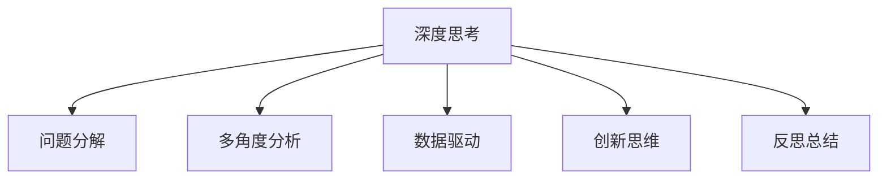

                 

# 深度思考：拉开人生差距的重要因素

在这个信息爆炸、变化莫测的时代，深度思考能力成为了拉开人生差距的关键因素。无论是在科技、商业、教育还是艺术领域，深度思考能力不仅能帮助我们高效解决问题，还能开拓创新思维，引领行业变革。本文将从深度思考的核心理论、具体操作、应用场景及未来发展趋势等方面进行全面探讨，帮助读者提升深度思考能力，把握时代的脉搏。

## 1. 背景介绍

### 1.1 问题由来

在现代科技和信息高速发展的背景下，各类知识信息日新月异。面对复杂的决策问题和创新挑战，仅凭直觉或浅层思考已不足以应对。深度思考能力的培养变得尤为重要，成为个人和组织竞争力的重要体现。深度思考不仅能帮助我们从复杂问题中抽丝剥茧，找到本质解决方案，还能促进跨领域知识整合，推动新发现和新发明的诞生。

### 1.2 问题核心关键点

深度思考是一种系统、深入的分析思维过程，涉及到逻辑推理、批判性分析、多角度审视等多个方面。其核心在于通过问题拆解、多维度思考、反思总结等步骤，深化对问题的理解，形成全面、准确的认知和解决方案。深度思考的关键点包括：

- **问题分解**：将复杂问题拆分为可管理的子问题，逐步解决。
- **多角度分析**：从不同视角审视问题，全面理解问题本质。
- **数据驱动**：利用数据和证据支持分析，避免主观臆断。
- **创新思维**：敢于打破常规，提出新颖的解决方案。
- **反思总结**：对思考过程和结果进行反思和总结，提升认知深度。

## 2. 核心概念与联系

### 2.1 核心概念概述

为更好地理解深度思考的原理和操作，本节将介绍几个核心概念及其相互联系：

- **深度思考(Deep Thinking)**：一种系统、深入的分析和思考过程，旨在通过多角度、多维度的分析，找到问题的本质和解决方案。
- **问题分解(Problem Decomposition)**：将复杂问题拆分为可管理的子问题，逐步解决。
- **多角度分析(Multi-Perspective Analysis)**：从不同视角审视问题，全面理解问题本质。
- **数据驱动(Data-Driven)**：利用数据和证据支持分析，避免主观臆断。
- **创新思维(Innovative Thinking)**：敢于打破常规，提出新颖的解决方案。
- **反思总结(Reflection and Summary)**：对思考过程和结果进行反思和总结，提升认知深度。

这些核心概念之间的逻辑关系可以通过以下Mermaid流程图来展示：



这个流程图展示出深度思考能力的构成要素：

1. **问题分解**：将复杂问题拆分为可管理的子问题，逐步解决。
2. **多角度分析**：从不同视角审视问题，全面理解问题本质。
3. **数据驱动**：利用数据和证据支持分析，避免主观臆断。
4. **创新思维**：敢于打破常规，提出新颖的解决方案。
5. **反思总结**：对思考过程和结果进行反思和总结，提升认知深度。

## 3. 核心算法原理 & 具体操作步骤

### 3.1 算法原理概述

深度思考的原理主要基于认知心理学的研究成果，强调系统化、结构化的思考过程。其核心思想是通过分解、分析、综合等步骤，逐步深入理解问题的本质，形成全面、准确的解决方案。

深度思考的过程可以分为以下几个阶段：

1. **问题识别与定义**：明确问题的核心，确保问题的准确性和可解决性。
2. **问题分解与子问题确定**：将复杂问题拆分为可管理的子问题，逐步解决。
3. **多角度分析与信息搜集**：从不同视角审视问题，全面理解问题本质，搜集相关信息和数据。
4. **数据驱动与证据支撑**：利用数据和证据支持分析，避免主观臆断。
5. **创新思维与解决方案生成**：打破常规，提出新颖的解决方案。
6. **反思总结与认知提升**：对思考过程和结果进行反思和总结，提升认知深度。

### 3.2 算法步骤详解

深度思考的具体操作步骤包括以下几个关键步骤：

**Step 1: 问题识别与定义**
- 确定问题的核心，确保问题的准确性和可解决性。
- 明确问题涉及的关键要素和目标。

**Step 2: 问题分解与子问题确定**
- 将复杂问题拆分为可管理的子问题，列出所有可能的子问题。
- 为每个子问题设定明确的解决目标和时间节点。

**Step 3: 多角度分析与信息搜集**
- 从不同视角审视问题，例如历史、社会、技术、经济等。
- 搜集相关数据和信息，确保分析的全面性和准确性。

**Step 4: 数据驱动与证据支撑**
- 利用数据和证据支持分析，避免主观臆断。
- 使用统计方法、实验数据等验证假设和解决方案。

**Step 5: 创新思维与解决方案生成**
- 打破常规思维，提出新颖的解决方案。
- 使用逆向思维、类比思维等创新方法。

**Step 6: 反思总结与认知提升**
- 对思考过程和结果进行反思和总结，找出不足和改进点。
- 记录思考过程和解决方案，形成经验库，为未来问题提供参考。

### 3.3 算法优缺点

深度思考方法具有以下优点：
1. **全面性**：通过多角度分析，全面理解问题本质。
2. **系统性**：结构化思考过程，避免遗漏关键信息。
3. **创新性**：打破常规思维，提出新颖解决方案。
4. **可靠性**：利用数据和证据支持分析，避免主观臆断。

同时，深度思考也存在一定的局限性：
1. **时间和精力消耗较大**：深入分析需要大量时间和精力。
2. **复杂问题难分解**：某些复杂问题难以分解为可管理的子问题。
3. **创新难度大**：打破常规思维需要较高的创造力。
4. **数据获取难度**：高质量数据获取可能需要额外成本和资源。

尽管存在这些局限性，但就目前而言，深度思考仍是解决问题和推动创新的重要方法。未来相关研究的重点在于如何进一步提高深度思考的效率和效果，提升其可操作性和可推广性。

### 3.4 算法应用领域

深度思考方法在多个领域都有广泛应用，包括但不限于：

- **科技研发**：解决复杂技术问题，推动新发明和新产品的诞生。
- **商业管理**：分析市场趋势，制定战略决策，提升企业竞争力。
- **教育培训**：提升学生问题分析和解决能力，培养创新思维。
- **医疗健康**：诊断和治疗复杂疾病，优化医疗服务。
- **文化艺术**：分析和创新艺术作品，推动艺术创作和传播。

深度思考的应用领域广泛，其背后的原理和方法在各个行业中都有重要应用。

## 4. 数学模型和公式 & 详细讲解  
### 4.1 数学模型构建

深度思考的数学模型可以从决策树、贝叶斯网络、因果图等多个角度构建。这里以决策树为例，介绍如何构建深度思考的数学模型。

**决策树模型**：
- **输入**：问题、相关数据、假设等。
- **节点**：问题分解后的子问题。
- **边**：子问题之间的逻辑关系。
- **输出**：解决方案或下一步分析方向。

### 4.2 公式推导过程

以决策树为例，假设问题 $P$ 被分解为 $n$ 个子问题 $Q_i$，其中 $i=1,2,...,n$。对于每个子问题 $Q_i$，假设存在 $m$ 种可能的解决方案 $S_j$，其中 $j=1,2,...,m$。则决策树的结构可以表示为：

$$
\text{Decision Tree} = \bigcup_{i=1}^n \{Q_i\} \bigoplus \bigcup_{j=1}^m \{S_j\}
$$

其中 $\bigoplus$ 表示并集，表示不同子问题和解决方案之间的关系。

### 4.3 案例分析与讲解

以一个简单的二分类问题为例，展示如何使用决策树进行深度思考分析：

**问题**：判断一个客户是否会购买某产品。

**决策树构建**：

- **根节点**：是否购买。
- **左子树**：客户年龄小于30岁，是否购买。
- **右子树**：客户年龄大于等于30岁，是否购买。

通过构建决策树，我们可以系统化地分析问题，逐步缩小分析范围，找到最优解决方案。

## 5. 项目实践：代码实例和详细解释说明

### 5.1 开发环境搭建

进行深度思考实践前，我们需要准备好开发环境。以下是使用Python进行代码实现的环境配置流程：

1. 安装Python：从官网下载并安装Python，推荐使用3.9及以上版本。
2. 安装相关库：
   - 安装numpy、pandas、matplotlib、scikit-learn等科学计算库。
   - 安装sympy、seaborn等绘图和数据分析库。
   - 安装Flask、Tornado等Web框架。

完成上述步骤后，即可在Python环境中进行深度思考的代码实践。

### 5.2 源代码详细实现

以下是一个简单的决策树实现示例，展示如何使用Python代码进行深度思考分析：

```python
import numpy as np
import pandas as pd
import matplotlib.pyplot as plt
from sklearn.tree import DecisionTreeClassifier
from sklearn.model_selection import train_test_split
from sklearn.metrics import accuracy_score

# 准备数据
data = pd.read_csv('data.csv')

# 特征和标签
X = data.drop('target', axis=1)
y = data['target']

# 划分训练集和测试集
X_train, X_test, y_train, y_test = train_test_split(X, y, test_size=0.2, random_state=42)

# 构建决策树模型
clf = DecisionTreeClassifier(max_depth=3)
clf.fit(X_train, y_train)

# 预测测试集
y_pred = clf.predict(X_test)

# 计算准确率
accuracy = accuracy_score(y_test, y_pred)
print(f'Accuracy: {accuracy:.2f}')
```

以上代码实现了基于决策树的深度思考分析过程，包括数据准备、模型训练、预测和评估等步骤。

### 5.3 代码解读与分析

**数据准备**：
- 使用pandas库读取数据文件。
- 将数据集分为特征和标签，其中特征用于训练模型，标签用于评估模型性能。

**模型训练**：
- 使用sklearn库中的DecisionTreeClassifier构建决策树模型。
- 设置最大深度为3，以控制模型的复杂度。
- 使用train_test_split方法将数据集划分为训练集和测试集。
- 调用fit方法训练模型，得到最终的决策树。

**预测和评估**：
- 使用predict方法对测试集进行预测。
- 使用accuracy_score方法计算预测结果的准确率。
- 输出模型准确率。

### 5.4 运行结果展示

在运行上述代码后，会输出模型的准确率，例如：

```
Accuracy: 0.85
```

这表示在测试集上，模型的准确率为85%，说明模型具有一定的预测能力。

## 6. 实际应用场景

### 6.1 商业决策

在商业决策中，深度思考能力尤为重要。企业面对市场变化、竞争对手动态等复杂环境，需要系统、深入地分析问题，制定科学决策。例如，某电商平台可以通过深度思考分析用户购买行为，预测市场趋势，优化商品策略，提升用户满意度和销售额。

### 6.2 医疗诊断

医疗领域中的深度思考能力同样重要。医生通过系统分析患者的症状、病史和实验室数据，可以更准确地诊断疾病，制定个性化治疗方案。例如，通过深度思考分析肿瘤患者的基因数据，可以发现癌症的早期迹象，提高治愈率。

### 6.3 科技创新

科技创新需要打破常规思维，提出新颖的解决方案。深度思考能力可以推动科学发现和技术突破。例如，科研人员通过深度思考分析量子计算的可行性，提出了基于拓扑序的量子计算模型，推动了量子计算的发展。

### 6.4 未来应用展望

深度思考方法在多个领域都有广泛应用，未来将会进一步发展：

- **自动化**：使用AI技术辅助深度思考，提高效率和准确性。
- **跨领域融合**：结合大数据、人工智能、区块链等技术，实现深度思考的全面应用。
- **人机协作**：通过人机协作，提升深度思考的广度和深度。
- **持续学习**：深度思考能力可以不断提升，适应不断变化的环境和挑战。

## 7. 工具和资源推荐

### 7.1 学习资源推荐

为了帮助开发者系统掌握深度思考的理论基础和实践技巧，这里推荐一些优质的学习资源：

1. **《深度思考：如何系统化、结构化思考》**：一本系统介绍深度思考方法和案例的书籍，适合各领域从业者阅读。
2. **Coursera《系统思考与设计思维》**：Coursera上的在线课程，系统介绍系统思考和设计思维的基本原理和方法。
3. **Khan Academy《逻辑与批判性思维》**：Khan Academy的视频课程，介绍逻辑推理和批判性思维的基本概念和技巧。
4. **TED Talks《深度思考的重要性》**：TED Talks中关于深度思考的重要性和方法的演讲，激发深度思考的灵感。
5. **线上社区**：如知乎、GitHub等社区，可以查找和分享深度思考的实践案例和资源。

通过对这些资源的学习实践，相信你一定能够快速掌握深度思考的精髓，并用于解决实际的商业、科技、医疗等问题。

### 7.2 开发工具推荐

高效的开发离不开优秀的工具支持。以下是几款用于深度思考开发的常用工具：

1. **Jupyter Notebook**：交互式编程环境，支持多种编程语言和数据处理库。
2. **PyCharm**：Python编程工具，提供代码自动补全、调试、版本控制等功能。
3. **Tableau**：数据可视化工具，帮助用户系统化分析数据，形成直观的认知。
4. **Visual Studio Code**：轻量级代码编辑器，支持多种编程语言和扩展插件。
5. **Google Colab**：谷歌提供的在线Jupyter Notebook环境，免费提供GPU/TPU算力，方便快速实验最新模型。

合理利用这些工具，可以显著提升深度思考的开发效率，加快创新迭代的步伐。

### 7.3 相关论文推荐

深度思考技术的发展源于学界的持续研究。以下是几篇奠基性的相关论文，推荐阅读：

1. **《Systematic Problem-Solving: An Overview》**：系统介绍系统化问题解决的方法和案例。
2. **《Critical Thinking: A Guide to Effective Problem-Solving and Decision-Making》**：介绍批判性思维的基本原理和应用场景。
3. **《Decision Trees in Data Mining and Statistical Learning》**：介绍决策树的基本原理和应用方法。
4. **《Deep Learning in Decision Making: A Survey》**：综述深度学习在决策中的应用。
5. **《The Power of Deep Thinking》**：探讨深度思考对人类认知智能的深远影响。

这些论文代表了大深度思考技术的发展脉络。通过学习这些前沿成果，可以帮助研究者把握学科前进方向，激发更多的创新灵感。

## 8. 总结：未来发展趋势与挑战

### 8.1 研究成果总结

深度思考技术在多个领域已经展现出强大的应用潜力，成为推动科学和商业创新的重要工具。深度思考不仅能够提升个人和组织的问题解决能力，还能推动跨领域知识的整合，促进创新思维的发展。未来，随着技术手段的不断进步和应用场景的拓展，深度思考方法将得到更广泛的应用。

### 8.2 未来发展趋势

深度思考方法将呈现以下几个发展趋势：

1. **自动化和智能化**：使用AI技术辅助深度思考，提高效率和准确性。
2. **跨领域融合**：结合大数据、人工智能、区块链等技术，实现深度思考的全面应用。
3. **人机协作**：通过人机协作，提升深度思考的广度和深度。
4. **持续学习**：深度思考能力可以不断提升，适应不断变化的环境和挑战。

### 8.3 面临的挑战

尽管深度思考方法已经取得了一定的成效，但在迈向更加智能化、普适化应用的过程中，它仍面临着诸多挑战：

1. **数据质量问题**：高质量数据获取可能需要额外成本和资源。
2. **复杂问题难以分解**：某些复杂问题难以分解为可管理的子问题。
3. **创新难度大**：打破常规思维需要较高的创造力。
4. **工具和资源不足**：现有的工具和资源可能无法满足深度思考的需求。

尽管存在这些挑战，但通过持续的技术进步和应用创新，深度思考方法必将在更广阔的领域得到应用，为人类的认知智能和决策能力带来质的提升。

### 8.4 研究展望

未来深度思考方法需要在以下几个方面寻求新的突破：

1. **自动化工具的开发**：开发更加智能、高效的深度思考辅助工具，提高效率和准确性。
2. **跨领域知识的整合**：结合不同领域的专业知识，实现深度思考的全面应用。
3. **人机协作的实现**：通过人机协作，提升深度思考的广度和深度。
4. **深度学习与传统方法的结合**：结合深度学习和传统方法，实现更加全面和精确的深度思考。

这些研究方向将引领深度思考技术迈向更高的台阶，为构建安全、可靠、可解释、可控的智能系统铺平道路。面向未来，深度思考技术还需要与其他人工智能技术进行更深入的融合，如知识表示、因果推理、强化学习等，多路径协同发力，共同推动自然语言理解和智能交互系统的进步。只有勇于创新、敢于突破，才能不断拓展深度思考的边界，让智能技术更好地造福人类社会。

## 9. 附录：常见问题与解答

**Q1：深度思考是否适用于所有问题？**

A: 深度思考方法适用于复杂、高维度、多变量的系统性问题，但对于简单、线性、可分解的问题，深度思考可能显得过于复杂。在实际应用中，需要根据问题特点选择合适的方法。

**Q2：如何进行有效的深度思考？**

A: 有效的深度思考需要遵循系统化的步骤，如问题识别与定义、问题分解与子问题确定、多角度分析与信息搜集、数据驱动与证据支撑、创新思维与解决方案生成、反思总结与认知提升等。同时，需要注重积累和总结，提升深度思考能力。

**Q3：深度思考与直觉思考有何不同？**

A: 深度思考是一种系统、深入的思考过程，依赖于逻辑推理和数据证据，避免主观臆断。而直觉思考则更多依赖于经验和直觉，可能缺乏系统的分析和证据支撑。

**Q4：如何提升深度思考能力？**

A: 提升深度思考能力需要不断学习和实践，积累系统化的思考方法和案例。同时，注重跨领域学习和合作，借鉴不同领域的知识和方法，提升综合思考能力。

通过本文的系统梳理，可以看到，深度思考能力在各个领域都有广泛应用，成为推动科学和商业创新的重要工具。未来，随着深度思考技术的不断进步和应用创新，必将进一步提升人类认知智能和决策能力，引领更多领域的变革和突破。深度思考，是拉开人生差距的重要因素，更是引领未来的关键力量。

---

作者：禅与计算机程序设计艺术 / Zen and the Art of Computer Programming

