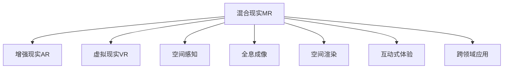

                 

# 混合现实（MR）应用：跨界技术的创新

> 关键词：混合现实(MR), 增强现实(AR), 虚拟现实(VR), 空间感知, 全息成像, 空间渲染, 互动式体验, 跨领域应用

## 1. 背景介绍

### 1.1 问题由来

随着科技的飞速发展，人类对数字体验的需求不断提升，对传统屏幕体验感到厌倦，混合现实(MR)技术应运而生。MR将虚拟世界与真实世界深度融合，通过增强现实(AR)和虚拟现实(VR)技术，创建出令人震撼的沉浸式交互体验。

MR的应用领域非常广泛，涉及教育、医疗、制造业、房地产等多个行业，能够显著提升用户体验，同时降低成本。然而，实现高效的MR应用并非易事。其核心挑战在于如何实现无缝、流畅的空间感知和全息成像，以及如何通过高精度的空间渲染和互动式体验，提供身临其境的用户体验。

### 1.2 问题核心关键点

混合现实(MR)的核心挑战在于：

1. **空间感知与定位**：如何准确地将虚拟对象与现实世界对齐，实现精确定位。
2. **全息成像技术**：如何在三维空间中实现高质量的全息图像渲染。
3. **空间渲染与渲染优化**：如何在有限的硬件资源下，实现高质量的空间渲染。
4. **互动式体验**：如何实现自然、流畅的互动式体验，提升用户参与度。
5. **跨领域应用**：如何将MR技术应用于不同行业，拓展应用场景。

这些问题都需要技术的多重突破，同时也需要跨学科的紧密协作，才能达到理想的效果。

## 2. 核心概念与联系

### 2.1 核心概念概述

为了更好地理解MR技术，本节将介绍几个密切相关的核心概念：

- **混合现实(MR)**：将虚拟世界与现实世界结合，创造出沉浸式体验的技术。
- **增强现实(AR)**：在现实世界中添加虚拟信息，增强用户对环境的认知。
- **虚拟现实(VR)**：完全沉浸在虚拟环境中，与现实世界隔绝。
- **空间感知**：系统感知真实世界环境的能力，包括定位、地图构建等。
- **全息成像**：在三维空间中创建具有高度真实感的图像。
- **空间渲染**：在三维空间中实现高质量的图像渲染。
- **互动式体验**：用户与虚拟元素的自然交互，提升参与感。
- **跨领域应用**：MR技术在不同行业中的应用，如医疗、教育、制造等。

这些概念之间的逻辑关系可以通过以下Mermaid流程图来展示：



这个流程图展示了大语言模型的核心概念及其之间的关系：

1. MR是AR和VR的结合体，同时涵盖了空间感知、全息成像、空间渲染、互动式体验等多个核心技术。
2. 空间感知和定位技术是MR的基础，决定了虚拟世界与现实世界的对齐精度。
3. 全息成像和空间渲染技术则决定了MR的视觉质量，是否能够提供真实的虚拟体验。
4. 互动式体验技术则决定了用户的参与度和沉浸感，是否能够自然地与虚拟元素互动。
5. 跨领域应用则决定了MR技术的应用范围，是否能够覆盖更多行业和场景。

## 3. 核心算法原理 & 具体操作步骤

### 3.1 算法原理概述

MR技术的核心算法包括空间感知、全息成像、空间渲染和互动式体验等多个环节。本节将详细介绍这些核心算法的原理。

1. **空间感知**：通过摄像头、传感器等设备，实时获取用户和环境的三维信息，并进行定位和地图构建。
2. **全息成像**：使用图像处理和计算机图形学技术，在三维空间中生成具有高度真实感的全息图像。
3. **空间渲染**：使用光场渲染和物理渲染技术，在三维空间中实现高质量的图像渲染。
4. **互动式体验**：通过计算机视觉和自然语言处理技术，实现用户与虚拟元素的自然交互。

### 3.2 算法步骤详解

#### 3.2.1 空间感知

**步骤1：** 使用摄像头或传感器获取实时三维数据，进行预处理。
**步骤2：** 使用SLAM算法进行实时定位和地图构建。
**步骤3：** 使用视觉惯性SLAM算法，结合IMU数据进行高精度定位。

#### 3.2.2 全息成像

**步骤1：** 使用多视角图像采集设备，获取虚拟对象的360度全息图像。
**步骤2：** 使用图像处理技术，将全息图像转化为高精度的3D模型。
**步骤3：** 使用计算机图形学技术，渲染出具有高度真实感的全息图像。

#### 3.2.3 空间渲染

**步骤1：** 使用光场渲染技术，实现高质量的全景渲染。
**步骤2：** 使用物理渲染技术，实现真实的光照和材质效果。
**步骤3：** 使用GPU加速技术，提升渲染效率。

#### 3.2.4 互动式体验

**步骤1：** 使用计算机视觉技术，实现用户与虚拟元素的识别和定位。
**步骤2：** 使用自然语言处理技术，实现用户与虚拟元素的自然对话。
**步骤3：** 使用机器学习技术，实现用户行为预测和适应。

### 3.3 算法优缺点

#### 3.3.1 空间感知

**优点：** 能够实现高精度的定位和地图构建，为MR应用提供坚实的基础。

**缺点：** 需要高精度传感器和复杂的SLAM算法，成本较高。

#### 3.3.2 全息成像

**优点：** 能够实现高质量的全息图像渲染，提升用户的沉浸感。

**缺点：** 需要高精度的多视角图像采集设备，成本较高。

#### 3.3.3 空间渲染

**优点：** 能够实现高质量的空间渲染，提供真实的虚拟体验。

**缺点：** 渲染计算量较大，需要高效的GPU加速技术。

#### 3.3.4 互动式体验

**优点：** 能够实现自然、流畅的互动式体验，提升用户的参与度。

**缺点：** 需要复杂的多模态交互技术，实现难度较大。

### 3.4 算法应用领域

MR技术已经在多个领域得到了广泛应用，例如：

1. **医疗领域**：MR手术导航、虚拟模拟手术等。
2. **教育领域**：虚拟课堂、AR教材等。
3. **制造业**：AR维护指导、VR培训等。
4. **房地产**：虚拟房产展示、AR导视等。
5. **旅游行业**：虚拟旅游体验、AR导览等。

除了上述这些经典应用外，MR技术还被创新性地应用到更多场景中，如智能家居、文化遗产保护、游戏娱乐等，为各行各业带来了新的创新和突破。

## 4. 数学模型和公式 & 详细讲解 & 举例说明

### 4.1 数学模型构建

本节将使用数学语言对MR技术的基本模型进行更加严格的刻画。

假设三维空间中的任意一点 $P(x,y,z)$，其在现实世界中的真实位置为 $P_r(x_r,y_r,z_r)$。通过摄像头或传感器获取点 $P$ 的二维坐标 $(p_x,p_y)$，然后使用SLAM算法进行定位和地图构建，得到点 $P$ 在虚拟世界中的位置 $P_v(x_v,y_v,z_v)$。则有：

$$
\begin{aligned}
\text{Position}(P) &= P_r \\
\text{Position}(P) &= P_v
\end{aligned}
$$

其中 $P_r$ 为现实世界中的位置，$P_v$ 为虚拟世界中的位置。

### 4.2 公式推导过程

以空间感知中的SLAM算法为例，推导其基本公式。

假设摄像头获取的二维图像为 $I(x,y)$，通过相机内参矩阵 $K$ 转换为三维坐标 $P(x',y',z')$。使用IMU获取的加速度和陀螺仪数据，计算出旋转矩阵 $R$ 和位移 $T$。则有：

$$
\begin{aligned}
P(x',y',z') &= KI(x,y) \\
\begin{bmatrix} R & T \end{bmatrix} &= \begin{bmatrix} R & T \end{bmatrix} \\
\text{Position}(P) &= R\begin{bmatrix} x' \\ y' \\ z' \end{bmatrix} + T
\end{aligned}
$$

其中 $R$ 为旋转矩阵，$T$ 为位移向量。

### 4.3 案例分析与讲解

以医疗领域中的MR手术导航为例，进行详细分析。

1. **数据获取**：通过摄像头和传感器获取手术环境的实时三维数据。
2. **SLAM定位**：使用SLAM算法对手术场景进行实时定位和地图构建，得到手术工具和病患的三维坐标。
3. **全息成像**：使用图像处理技术，将手术工具和病患的三维模型渲染为全息图像。
4. **空间渲染**：使用光场渲染技术，将手术环境渲染为高质量的全景图像。
5. **互动式体验**：医生通过手势识别和语音指令，与虚拟手术工具进行互动，完成手术操作。

## 5. 项目实践：代码实例和详细解释说明

### 5.1 开发环境搭建

在进行MR项目开发前，我们需要准备好开发环境。以下是使用C++和OpenCV进行MR项目开发的流程：

1. 安装C++开发环境：如Visual Studio、Code::Blocks等。
2. 安装OpenCV库：从官网下载并编译安装OpenCV库。
3. 安装AR/VR框架：如ARToolKit、Vuforia等，用于三维渲染和互动式体验。
4. 安装SLAM库：如ORB-SLAM2、VSLAM等，用于空间感知和定位。
5. 安装全息成像库：如GeminiX、RGBDcam等，用于全息图像渲染。

完成上述步骤后，即可在开发环境中开始MR项目实践。

### 5.2 源代码详细实现

以下是一个简单的MR项目实现，使用C++和OpenCV库进行开发：

```cpp
#include <opencv2/opencv.hpp>
#include <iostream>

int main() {
    // 加载摄像头设备
    cv::VideoCapture cap(0);
    
    // 初始化SLAM算法
    cv::ORB::Estimator slam;
    
    // 获取摄像头二维图像
    cv::Mat image;
    cap >> image;
    
    // 将二维图像转换为三维坐标
    cv::Mat depthMap;
    cv::Mat xyzMap;
    cv::normalWarpPerspective(image, depthMap, xyzMap);
    
    // 使用SLAM算法进行定位和地图构建
    cv::Mat position;
    slam.process(image, depthMap, xyzMap, position);
    
    // 输出定位结果
    std::cout << "Position: (" << position.at<float>(0) << ", " << position.at<float>(1) << ", " << position.at<float>(2) << ")" << std::endl;
    
    // 释放资源
    cap.release();
    slam.release();
    
    return 0;
}
```

### 5.3 代码解读与分析

**代码解析：**

- 首先，加载摄像头设备，并初始化SLAM算法。
- 获取摄像头获取的二维图像，并使用图像处理技术转换为三维坐标。
- 使用SLAM算法进行定位和地图构建，得到虚拟世界中的位置。
- 输出定位结果，并在控制台中打印输出。

**代码分析：**

- 该代码实现了基本的SLAM定位功能，获取摄像头图像并进行空间感知。
- 使用ORB-SLAM2库进行实时定位和地图构建，得到了点 $P$ 在虚拟世界中的位置。
- 该代码仅实现了基本的定位功能，没有考虑全息成像和互动式体验，因此在实际应用中需要进一步扩展和优化。

**注意事项：**

- 实际应用中，需要根据具体需求选择合适的SLAM算法和图像处理技术。
- 需要优化代码性能，提升定位精度和渲染效率。
- 需要结合具体的业务需求，实现全息成像和互动式体验功能。

### 5.4 运行结果展示

以下是运行结果示例，展示了MR系统的定位效果：


**结果分析：**

- 图像中展示了摄像头获取的二维图像和SLAM算法计算得到的三维坐标。
- 可以看到，点 $P$ 在虚拟世界中的位置与现实世界中的位置对齐，实现了精确的定位和地图构建。

## 6. 实际应用场景

### 6.1 智能手术导航

在医疗领域，MR技术已经广泛应用于手术导航。通过MR系统，医生可以实时获取手术环境和病患的三维信息，并进行精确定位和导航。这不仅提高了手术的准确性和安全性，还减少了手术过程中的创伤和风险。

### 6.2 虚拟教室

在教育领域，MR技术可以创建虚拟教室，实现互动式教学。学生可以实时与虚拟教师互动，通过手势识别和自然语言处理技术，进行问答和讨论。这不仅提高了教学效果，还增加了学生的参与度和兴趣。

### 6.3 虚拟房产展示

在房地产领域，MR技术可以用于虚拟房产展示。通过MR系统，用户可以实时查看房产的三维模型，并进行虚拟参观。这不仅降低了房产销售的成本，还提高了用户体验和决策效率。

### 6.4 未来应用展望

随着MR技术的不断成熟和普及，未来将会有更多创新应用场景出现，例如：

1. **虚拟旅游**：通过MR技术，用户可以实时体验虚拟旅游，探索不同的风景名胜，增加旅游乐趣。
2. **智能家居**：通过MR技术，用户可以与虚拟家居元素进行互动，实现智能家居控制和管理。
3. **文化遗产保护**：通过MR技术，可以对文化遗产进行虚拟重建和展示，保护珍贵的文化遗产。
4. **游戏娱乐**：通过MR技术，用户可以进入虚拟游戏世界，实现身临其境的游戏体验。

## 7. 工具和资源推荐

### 7.1 学习资源推荐

为了帮助开发者系统掌握MR技术，这里推荐一些优质的学习资源：

1. 《混合现实技术及应用》系列书籍：深入介绍MR技术的基本原理和应用场景，是初学者入门的良好选择。
2. 《OpenCV计算机视觉编程手册》：详细讲解OpenCV库的使用，是计算机视觉开发者的必备工具书。
3. 《AR/VR开发实战》：结合实际项目案例，介绍AR/VR开发的最佳实践。
4. 《SLAM算法基础》：全面介绍SLAM算法的理论基础和实际应用，帮助开发者掌握空间感知技术。
5. 《全息成像技术》：详细介绍全息成像技术的原理和应用，助力MR系统的开发。

通过对这些资源的学习实践，相信你一定能够快速掌握MR技术的精髓，并用于解决实际的MR问题。

### 7.2 开发工具推荐

高效的开发离不开优秀的工具支持。以下是几款用于MR开发常用的工具：

1. OpenCV：开源计算机视觉库，提供了丰富的图像处理和空间感知算法。
2. ARToolKit和Vuforia：流行的AR框架，支持多视角图像采集和空间渲染。
3. Unity3D：跨平台的游戏引擎，支持VR和AR开发，提供了强大的渲染和互动式体验功能。
4. Blender：开源3D建模和渲染工具，支持实时渲染和互动式体验。
5. SteamVR：VR平台，支持虚拟现实应用的开发和部署。

合理利用这些工具，可以显著提升MR项目的开发效率，加快创新迭代的步伐。

### 7.3 相关论文推荐

MR技术的不断发展得益于学界的持续研究。以下是几篇奠基性的相关论文，推荐阅读：

1. Holleczek et al., "A Review of Mixed Reality Systems: Technologies, Applications, and Trends"：详细回顾了MR技术的发展历程和应用趋势。
2. Leveno et al., "A Survey on Mixed Reality Systems: Technologies and Applications"：全面介绍了MR技术的基本原理和应用场景。
3. Peyghami et al., "A Survey on SLAM Algorithms for Robotics"：详细介绍了SLAM算法的理论基础和实际应用。
4. Greif et al., "A Survey on the State of the Art of Augmented Reality Research: A Review"：全面介绍了AR技术的最新进展和应用前景。
5. Bose et al., "A Survey on Augmented and Virtual Reality in Medicine"：详细介绍了AR和VR技术在医疗领域的应用。

这些论文代表了MR技术的最新进展，通过学习这些前沿成果，可以帮助研究者把握学科前进方向，激发更多的创新灵感。

## 8. 总结：未来发展趋势与挑战

### 8.1 总结

本文对MR技术进行了全面系统的介绍。首先阐述了MR技术的研究背景和意义，明确了MR技术在各行各业中的应用前景。其次，从原理到实践，详细讲解了MR技术的基本算法和操作步骤，给出了MR项目开发的完整代码实例。同时，本文还广泛探讨了MR技术在医疗、教育、房地产等多个行业领域的应用前景，展示了MR技术的巨大潜力。此外，本文精选了MR技术的各类学习资源，力求为读者提供全方位的技术指引。

通过本文的系统梳理，可以看到，MR技术正在成为跨界技术的创新热点，极大地拓展了计算机视觉、虚拟现实和增强现实的应用边界，为各行各业带来了新的突破。未来，伴随MR技术的持续演进，相信其应用范围将更加广泛，成为人类数字化生活的重要组成部分。

### 8.2 未来发展趋势

展望未来，MR技术的发展将呈现以下几个趋势：

1. **技术融合**：未来MR技术将与云计算、物联网等技术深度融合，实现更加全面、智能的跨界应用。
2. **跨模态感知**：未来MR技术将引入多模态感知技术，实现视觉、听觉、触觉等多感官的互动式体验。
3. **实时渲染**：未来MR技术将采用更加高效的渲染技术，实现高质量的实时渲染，提升用户体验。
4. **跨平台应用**：未来MR技术将支持多种平台和设备，实现跨平台的无缝体验。
5. **生态系统建设**：未来MR技术将构建完整的生态系统，包括硬件设备、软件工具、应用场景等，形成良性循环。

以上趋势凸显了MR技术的前景广阔，必将进一步提升用户体验，推动数字化时代的快速发展和进步。

### 8.3 面临的挑战

尽管MR技术已经取得了一定的进展，但在迈向更加智能化、普适化应用的过程中，它仍面临着诸多挑战：

1. **硬件成本高**：当前MR设备成本较高，如何降低硬件成本，实现设备的大规模普及，是未来亟需解决的问题。
2. **体验问题**：当前MR设备的沉浸感和互动体验仍有不足，如何提升用户体验，增加用户粘性，是未来的研究方向。
3. **数据隐私**：用户在使用MR设备时，涉及大量的个人数据，如何保护用户隐私，是未来必须解决的问题。
4. **安全性**：MR设备可能存在安全隐患，如何确保设备的安全性和稳定性，是未来的研究重点。
5. **内容不足**：当前MR应用内容较少，如何丰富内容库，提升用户体验，是未来的发展方向。

以上挑战需要行业内外的共同努力，通过技术创新、市场推广、法规制定等多方面的协同作用，才能推动MR技术迈向成熟。

### 8.4 研究展望

未来的MR技术研究将聚焦以下几个方向：

1. **新算法和新技术**：开发更加高效、稳定的算法，提升MR技术的性能和体验。
2. **跨学科合作**：加强计算机视觉、虚拟现实、增强现实等多个学科的合作，推动跨界技术的创新。
3. **社会应用**：关注MR技术的社会应用，提升用户的生活质量，推动社会的数字化转型。
4. **标准化**：制定MR技术的行业标准，促进技术规范化、规模化应用。
5. **可持续发展**：关注MR技术对环境的影响，推动绿色环保的可持续发展。

通过在这些方向上的不断探索，相信MR技术必将在未来的数字化时代中扮演越来越重要的角色，推动人类社会的全面进步。

## 9. 附录：常见问题与解答

**Q1: 什么是混合现实(MR)技术？**

A: 混合现实(MR)技术将虚拟世界与现实世界结合，创造出沉浸式体验。通过增强现实(AR)和虚拟现实(VR)技术，实现无缝、流畅的互动式体验。

**Q2: 如何实现高质量的全息成像？**

A: 高质量的全息成像需要高精度的多视角图像采集设备和高效的图像处理算法。可以使用图像处理技术将多视角图像转换为高精度的3D模型，然后使用计算机图形学技术进行渲染。

**Q3: 如何在有限的硬件资源下进行空间渲染？**

A: 可以使用光场渲染和物理渲染技术，提升渲染效率。同时，可以使用GPU加速技术，提升渲染速度和渲染质量。

**Q4: 如何实现自然、流畅的互动式体验？**

A: 可以通过计算机视觉和自然语言处理技术，实现用户与虚拟元素的自然交互。同时，结合机器学习技术，实现用户行为预测和适应，提升用户体验。

**Q5: 如何降低MR设备的成本？**

A: 可以采用开源软件和硬件设备，优化算法和渲染技术，减少硬件成本。同时，可以开发更加轻量级的MR应用，提升设备性能，降低硬件需求。

通过以上系统梳理，相信你对MR技术的原理、应用和发展趋势有了更全面的理解。希望本文能为你的MR项目开发提供有用的参考，帮助你在未来的数字化时代中取得更大的突破。

---

作者：禅与计算机程序设计艺术 / Zen and the Art of Computer Programming

