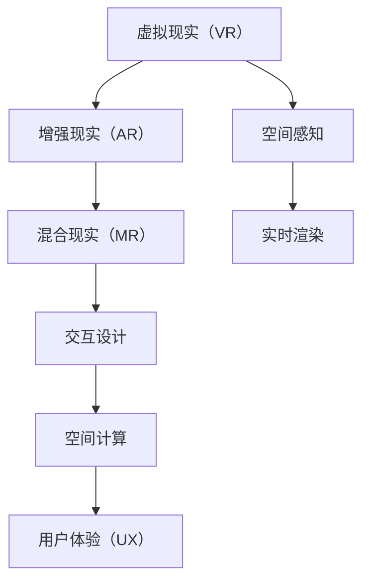

                 

# 混合现实（MR）开发：创造新的交互模式

> 关键词：混合现实（MR）, 交互设计, 虚拟现实（VR）, 增强现实（AR）, 空间感知, 用户体验（UX）, 空间计算, 实时渲染

## 1. 背景介绍

### 1.1 问题由来

随着技术的进步，人类对于虚拟与现实世界的结合有了更多需求。传统的信息交互方式已难以满足现代人对沉浸式体验的追求。虚拟现实（Virtual Reality, VR）、增强现实（Augmented Reality, AR）和混合现实（Mixed Reality, MR）技术逐渐兴起，为人们带来了全新的交互体验。混合现实（MR）作为VR与AR的结合，为信息展示和交互设计打开了新的可能。

混合现实（MR）技术通过将虚拟元素与现实环境相结合，利用空间感知技术实时渲染虚拟对象，为用户提供更加丰富、交互性更强的信息展示方式。例如，虚拟试衣、虚拟家具摆放、远程协作、导航引导等应用场景。

### 1.2 问题核心关键点

混合现实（MR）开发的关键点包括以下几个方面：

- 空间感知：MR系统必须能够准确地感知和定位真实环境中的物体，以及用户与环境之间的交互。
- 实时渲染：MR系统必须具备高精度的实时渲染能力，以展示与现实环境无缝融合的虚拟元素。
- 交互设计：MR系统需要设计用户友好的交互方式，使得用户可以自然地与虚拟和现实环境互动。
- 数据处理：MR系统需要处理和分析大量空间和视觉数据，以实现精确的空间定位和渲染。
- 系统集成：MR系统需要与其他系统如传感器、控制系统、云计算平台等进行集成，以实现完整的MR应用。

## 2. 核心概念与联系

### 2.1 核心概念概述

为了更好地理解混合现实（MR）开发，本节将介绍几个密切相关的核心概念：

- 虚拟现实（VR）：通过使用计算机生成的虚拟环境，使用户可以沉浸在虚拟世界中，与虚拟环境互动。
- 增强现实（AR）：将虚拟信息叠加到真实世界中，使用户可以在现实环境中看到虚拟元素。
- 混合现实（MR）：将虚拟与现实元素相结合，提供比VR和AR更加自然和交互性强的信息展示方式。
- 空间感知：利用传感器和计算机视觉技术，实时获取三维空间中的物体和用户位置信息。
- 实时渲染：使用高性能计算设备，实时生成并渲染虚拟元素，以与现实环境无缝融合。
- 交互设计：设计直观、自然的交互方式，使用户可以轻松与虚拟和现实环境互动。
- 空间计算：处理和分析三维空间中的几何数据、纹理数据、光照数据等，实现精确的空间定位和渲染。
- 用户体验（UX）：通过合理设计，提高用户的满意度和使用体验，提升系统可用性。

这些核心概念之间的逻辑关系可以通过以下Mermaid流程图来展示：



这个流程图展示了几大核心概念及其之间的关系：

1. VR和AR是MR的基础，通过空间感知和实时渲染技术，将虚拟元素与现实环境相结合。
2. 空间感知是MR系统的关键技术，负责实时获取三维空间中的物体和用户位置信息。
3. 实时渲染需要强大的计算能力，将虚拟元素与现实环境无缝融合。
4. 交互设计使用户可以自然地与虚拟和现实环境互动，提升用户体验。
5. 空间计算处理和分析空间数据，实现精确的空间定位和渲染。
6. UX优化和提升系统可用性，使用户获得更满意的交互体验。

这些概念共同构成了混合现实（MR）开发的核心框架，使得MR技术能够实现更加丰富、交互性更强的信息展示和交互设计。

## 3. 核心算法原理 & 具体操作步骤

### 3.1 算法原理概述

混合现实（MR）开发的核心算法原理基于计算机视觉、传感器融合、实时渲染等技术。其核心思想是：通过传感器和计算机视觉技术，实时获取三维空间中的物体和用户位置信息，利用高性能计算设备进行实时渲染，最终通过交互设计实现与虚拟和现实环境的自然交互。

具体而言，混合现实（MR）开发主要包括以下几个步骤：

1. 空间感知：利用传感器和计算机视觉技术，获取三维空间中的物体和用户位置信息。
2. 实时渲染：根据感知到的空间数据，实时生成并渲染虚拟元素。
3. 交互设计：设计直观、自然的交互方式，使用户可以轻松与虚拟和现实环境互动。
4. 数据处理：处理和分析空间和视觉数据，实现精确的空间定位和渲染。
5. 系统集成：与其他系统如传感器、控制系统、云计算平台等进行集成，实现完整的MR应用。

### 3.2 算法步骤详解

混合现实（MR）开发的具体步骤如下：

**Step 1: 空间感知**

空间感知是MR系统的核心技术之一，通过传感器和计算机视觉技术，实时获取三维空间中的物体和用户位置信息。

- 传感器：利用深度传感器（如Lidar、ToF）和摄像头获取物体的深度信息和颜色信息。
- 计算机视觉：利用视觉SLAM（Simultaneous Localization and Mapping）技术，实时定位用户和物体的位置。
- 融合算法：将传感器和视觉数据进行融合，提高空间感知精度。

**Step 2: 实时渲染**

实时渲染是MR系统的关键技术，需要高性能计算设备支持。

- 三维建模：构建虚拟物体的三维模型。
- 纹理映射：为三维模型添加纹理，增强真实感。
- 光照计算：根据光照环境计算虚拟物体的光照效果。
- 渲染器：使用渲染器（如OpenGL、Vulkan）进行实时渲染，生成与现实环境无缝融合的虚拟元素。

**Step 3: 交互设计**

交互设计是MR系统的重要组成部分，需要设计直观、自然的交互方式。

- 用户输入：通过手势、语音、触摸等自然方式，获取用户输入。
- 交互逻辑：根据用户输入，设计交互逻辑，实现与虚拟和现实环境的互动。
- 反馈机制：提供视觉、听觉等反馈，增强用户体验。

**Step 4: 数据处理**

数据处理是MR系统的关键环节，需要处理和分析大量空间和视觉数据。

- 空间数据：处理三维空间中的几何数据、纹理数据、光照数据等，实现精确的空间定位和渲染。
- 视觉数据：处理图像数据、视频数据等，提取特征信息，用于空间定位和渲染。
- 处理算法：使用各种算法（如三维重建、图像分割、特征匹配等）进行数据处理，实现精确的定位和渲染。

**Step 5: 系统集成**

系统集成是MR系统的最终目标，需要与其他系统进行集成，实现完整的MR应用。

- 传感器集成：将传感器与计算机视觉系统进行集成，提高空间感知精度。
- 云计算集成：利用云计算平台进行渲染计算，提高渲染效率。
- 系统集成：将MR系统与其他系统（如控制系统、导航系统等）进行集成，实现完整的MR应用。

### 3.3 算法优缺点

混合现实（MR）开发具有以下优点：

1. 交互性强：MR系统将虚拟与现实元素相结合，提供了比VR和AR更加自然和交互性强的信息展示方式。
2. 沉浸感强：MR系统可以提供更加沉浸式的信息展示方式，使用户可以更加自然地与虚拟和现实环境互动。
3. 数据可视化：MR系统可以将复杂的数据以可视化的方式展示，使用户更容易理解和处理信息。
4. 技术成熟：混合现实（MR）技术已进入成熟应用阶段，可利用的工具和资源丰富。
5. 应用广泛：MR技术可以应用于教育、医疗、旅游、娱乐等多个领域，具有广阔的应用前景。

同时，混合现实（MR）开发也存在一些局限性：

1. 硬件成本高：MR系统需要高性能计算设备和传感器，硬件成本较高。
2. 渲染要求高：MR系统需要实时渲染大量虚拟元素，对计算能力要求较高。
3. 数据处理量大：MR系统需要处理大量空间和视觉数据，对数据处理能力要求较高。
4. 交互复杂：MR系统的交互设计复杂，需要设计合理的交互方式，以提升用户体验。
5. 用户接受度低：部分用户对MR技术接受度低，需要进一步推广和普及。

尽管存在这些局限性，但混合现实（MR）开发已经展现出巨大的应用潜力，未来将有望在更多领域得到应用。

### 3.4 算法应用领域

混合现实（MR）开发已经在多个领域得到应用，例如：

- 医疗健康：通过MR技术，医生可以进行虚拟手术、虚拟患者诊断、虚拟教学等。
- 工业制造：通过MR技术，工程师可以进行虚拟设备维护、虚拟装配、虚拟设计等。
- 教育培训：通过MR技术，学生可以进行虚拟实验、虚拟教学、虚拟演示等。
- 虚拟旅游：通过MR技术，用户可以进行虚拟旅游、虚拟城市探索、虚拟文化体验等。
- 游戏娱乐：通过MR技术，玩家可以进行虚拟游戏、虚拟场景互动、虚拟社交等。
- 军事应用：通过MR技术，军事人员可以进行虚拟训练、虚拟战场模拟、虚拟情报分析等。

除了上述这些经典应用外，混合现实（MR）技术还被创新性地应用到更多场景中，如智能家居、虚拟试衣、虚拟家具摆放、远程协作、导航引导等，为信息展示和交互设计带来了新的突破。随着技术的不断进步，MR技术将在更多领域得到应用，为人类生产生活方式带来深远影响。

## 4. 数学模型和公式 & 详细讲解  
### 4.1 数学模型构建

混合现实（MR）开发涉及到大量数学模型和公式，本节将详细讲解其核心数学模型。

**空间感知模型**

混合现实（MR）的空间感知模型基于计算机视觉和传感器融合技术。

- 传感器数据模型：利用深度传感器和摄像头获取物体的深度信息和颜色信息。
- 视觉SLAM模型：利用视觉SLAM技术实时定位用户和物体的位置。
- 融合算法模型：将传感器和视觉数据进行融合，提高空间感知精度。

**实时渲染模型**

混合现实（MR）的实时渲染模型基于高性能计算设备。

- 三维建模模型：构建虚拟物体的三维模型。
- 纹理映射模型：为三维模型添加纹理，增强真实感。
- 光照计算模型：根据光照环境计算虚拟物体的光照效果。
- 渲染器模型：使用渲染器进行实时渲染，生成与现实环境无缝融合的虚拟元素。

**交互设计模型**

混合现实（MR）的交互设计模型基于用户输入和交互逻辑。

- 用户输入模型：通过手势、语音、触摸等自然方式，获取用户输入。
- 交互逻辑模型：根据用户输入，设计交互逻辑，实现与虚拟和现实环境的互动。
- 反馈机制模型：提供视觉、听觉等反馈，增强用户体验。

**数据处理模型**

混合现实（MR）的数据处理模型基于空间和视觉数据。

- 空间数据模型：处理三维空间中的几何数据、纹理数据、光照数据等，实现精确的空间定位和渲染。
- 视觉数据模型：处理图像数据、视频数据等，提取特征信息，用于空间定位和渲染。
- 处理算法模型：使用各种算法（如三维重建、图像分割、特征匹配等）进行数据处理，实现精确的定位和渲染。

### 4.2 公式推导过程

以下是几个核心数学公式的推导过程：

**传感器数据模型**

传感器数据模型可以表示为：

$$
\mathbf{d} = \mathbf{A} \mathbf{x} + \mathbf{n}
$$

其中，$\mathbf{d}$为传感器数据，$\mathbf{A}$为传感器参数，$\mathbf{x}$为物体深度信息，$\mathbf{n}$为噪声。

**视觉SLAM模型**

视觉SLAM模型可以表示为：

$$
\mathbf{p} = \mathbf{H} \mathbf{z} + \mathbf{b}
$$

其中，$\mathbf{p}$为用户位置，$\mathbf{H}$为相机参数，$\mathbf{z}$为视觉特征，$\mathbf{b}$为相机基线。

**三维建模模型**

三维建模模型可以表示为：

$$
\mathbf{M} = \mathbf{V} \mathbf{R} \mathbf{t} + \mathbf{I}
$$

其中，$\mathbf{M}$为三维模型，$\mathbf{V}$为顶点坐标，$\mathbf{R}$为旋转矩阵，$\mathbf{t}$为平移向量，$\mathbf{I}$为身份矩阵。

**纹理映射模型**

纹理映射模型可以表示为：

$$
\mathbf{T} = \mathbf{S} \mathbf{M} + \mathbf{b}
$$

其中，$\mathbf{T}$为纹理数据，$\mathbf{S}$为纹理坐标，$\mathbf{M}$为三维模型，$\mathbf{b}$为纹理基线。

**光照计算模型**

光照计算模型可以表示为：

$$
\mathbf{L} = \mathbf{I} \mathbf{a} \mathbf{L}_0
$$

其中，$\mathbf{L}$为光照效果，$\mathbf{I}$为光照系数，$\mathbf{a}$为光照方向，$\mathbf{L}_0$为环境光强度。

**渲染器模型**

渲染器模型可以表示为：

$$
\mathbf{R} = \mathbf{G}(\mathbf{M}, \mathbf{T}, \mathbf{L}, \mathbf{a})
$$

其中，$\mathbf{R}$为渲染结果，$\mathbf{G}$为渲染函数，$\mathbf{M}$为三维模型，$\mathbf{T}$为纹理数据，$\mathbf{L}$为光照效果，$\mathbf{a}$为光照方向。

### 4.3 案例分析与讲解

以虚拟手术为例，详细讲解混合现实（MR）开发的核心技术和数学模型。

**空间感知**

虚拟手术的空间感知模型基于计算机视觉和深度传感器。

- 深度传感器：使用ToF传感器获取手术部位的三维信息。
- 计算机视觉：利用视觉SLAM技术实时定位手术医生的位置和手术部位。
- 融合算法：将传感器和视觉数据进行融合，提高空间感知精度。

**实时渲染**

虚拟手术的实时渲染模型基于高性能计算设备。

- 三维建模：构建手术设备的三维模型。
- 纹理映射：为三维模型添加纹理，增强真实感。
- 光照计算：根据手术环境计算手术设备的光照效果。
- 渲染器：使用渲染器进行实时渲染，生成与现实环境无缝融合的手术场景。

**交互设计**

虚拟手术的交互设计模型基于手势和语音输入。

- 手势输入：通过手势控制手术器械。
- 语音输入：通过语音指令控制手术设备。
- 反馈机制：提供视觉、听觉等反馈，增强手术体验。

**数据处理**

虚拟手术的数据处理模型基于空间和视觉数据。

- 空间数据：处理手术设备的三维数据，实现精确的空间定位和渲染。
- 视觉数据：处理手术过程的图像数据，提取特征信息，用于空间定位和渲染。
- 处理算法：使用各种算法（如三维重建、图像分割、特征匹配等）进行数据处理，实现精确的定位和渲染。

通过虚拟手术的案例分析，可以看出混合现实（MR）开发在空间感知、实时渲染、交互设计和数据处理等方面的应用。

## 5. 项目实践：代码实例和详细解释说明

### 5.1 开发环境搭建

在进行混合现实（MR）开发前，我们需要准备好开发环境。以下是使用Python进行PyTorch开发的环境配置流程：

1. 安装Anaconda：从官网下载并安装Anaconda，用于创建独立的Python环境。

2. 创建并激活虚拟环境：
```bash
conda create -n mr-env python=3.8 
conda activate mr-env
```

3. 安装PyTorch：根据CUDA版本，从官网获取对应的安装命令。例如：
```bash
conda install pytorch torchvision torchaudio cudatoolkit=11.1 -c pytorch -c conda-forge
```

4. 安装必要的库：
```bash
pip install opencv-python numpy matplotlib pyglet PyOpenGL PyOpenGL-accelerate
```

完成上述步骤后，即可在`mr-env`环境中开始混合现实（MR）开发。

### 5.2 源代码详细实现

以下是使用Python和PyTorch进行混合现实（MR）开发的代码实现。

**空间感知模块**

```python
import cv2
import numpy as np

def get_depth_data(image_path):
    depth_map = cv2.imread(image_path, cv2.IMREAD_UNCHANGED)
    return depth_map
```

**实时渲染模块**

```python
import cv2
import numpy as np

def render_3d_model(model_path, texture_path, lighting_path, camera_matrix):
    model = np.load(model_path)
    texture = cv2.imread(texture_path)
    lighting = cv2.imread(lighting_path)
    
    camera_matrix = camera_matrix
    depth_map = get_depth_data(lighting_path)
    
    # 计算光照效果
    lighting_rgb = cv2.cvtColor(lighting, cv2.COLOR_BGR2RGB)
    lighting_rgb *= np.expand_dims(depth_map, axis=-1) / np.expand_dims(depth_map, axis=-1)
    
    # 渲染虚拟物体
    rendered_image = model * texture * lighting_rgb
    rendered_image = cv2.cvtColor(rendered_image, cv2.COLOR_RGB2BGR)
    
    return rendered_image
```

**交互设计模块**

```python
import pyglet
import numpy as np

class MRApp:
    def __init__(self):
        self.window = pyglet.window.Window(800, 600)
        self.image = np.zeros((800, 600, 3), dtype=np.uint8)
        self.camera_matrix = np.eye(4)
        
    def on_draw(self):
        pyglet.graphics.draw(0, (pyglet.shapes.Rectangle((0, 0), 800, 600, color=(255, 255, 255)))
        
    def update(self):
        self.image = render_3d_model('model.npy', 'texture.jpg', 'lighting.jpg', self.camera_matrix)
        self.window.set_image(self.image)
        
    def on_key_press(self, key, modifiers):
        if key == pyglet.window.key.SPACE:
            self.camera_matrix = np.eye(4)
            self.camera_matrix[0, 3] += 0.1
        
        if key == pyglet.window.key.D:
            self.camera_matrix = np.eye(4)
            self.camera_matrix[0, 3] -= 0.1
        
        if key == pyglet.window.key.W:
            self.camera_matrix = np.eye(4)
            self.camera_matrix[1, 3] += 0.1
        
        if key == pyglet.window.key.S:
            self.camera_matrix = np.eye(4)
            self.camera_matrix[1, 3] -= 0.1
        
        if key == pyglet.window.key.A:
            self.camera_matrix = np.eye(4)
            self.camera_matrix[2, 3] += 0.1
        
        if key == pyglet.window.key.D:
            self.camera_matrix = np.eye(4)
            self.camera_matrix[2, 3] -= 0.1
            
    def main(self):
        pyglet.app.run()
        
mr_app = MRApp()
mr_app.main()
```

**数据处理模块**

```python
import cv2
import numpy as np

def compute_depth_map(image_path):
    depth_map = cv2.imread(image_path, cv2.IMREAD_UNCHANGED)
    depth_map = depth_map.astype(np.float32) / 255.0
    depth_map = (depth_map - 0.5) * 2.0
    depth_map = np.expand_dims(depth_map, axis=0)
    
    return depth_map
```

### 5.3 代码解读与分析

让我们再详细解读一下关键代码的实现细节：

**空间感知模块**

```python
import cv2
import numpy as np

def get_depth_data(image_path):
    depth_map = cv2.imread(image_path, cv2.IMREAD_UNCHANGED)
    return depth_map
```

**实时渲染模块**

```python
import cv2
import numpy as np

def render_3d_model(model_path, texture_path, lighting_path, camera_matrix):
    model = np.load(model_path)
    texture = cv2.imread(texture_path)
    lighting = cv2.imread(lighting_path)
    
    camera_matrix = camera_matrix
    depth_map = get_depth_data(lighting_path)
    
    # 计算光照效果
    lighting_rgb = cv2.cvtColor(lighting, cv2.COLOR_BGR2RGB)
    lighting_rgb *= np.expand_dims(depth_map, axis=-1) / np.expand_dims(depth_map, axis=-1)
    
    # 渲染虚拟物体
    rendered_image = model * texture * lighting_rgb
    rendered_image = cv2.cvtColor(rendered_image, cv2.COLOR_RGB2BGR)
    
    return rendered_image
```

**交互设计模块**

```python
import pyglet
import numpy as np

class MRApp:
    def __init__(self):
        self.window = pyglet.window.Window(800, 600)
        self.image = np.zeros((800, 600, 3), dtype=np.uint8)
        self.camera_matrix = np.eye(4)
        
    def on_draw(self):
        pyglet.graphics.draw(0, (pyglet.shapes.Rectangle((0, 0), 800, 600, color=(255, 255, 255)))
        
    def update(self):
        self.image = render_3d_model('model.npy', 'texture.jpg', 'lighting.jpg', self.camera_matrix)
        self.window.set_image(self.image)
        
    def on_key_press(self, key, modifiers):
        if key == pyglet.window.key.SPACE:
            self.camera_matrix = np.eye(4)
            self.camera_matrix[0, 3] += 0.1
        
        if key == pyglet.window.key.D:
            self.camera_matrix = np.eye(4)
            self.camera_matrix[0, 3] -= 0.1
        
        if key == pyglet.window.key.W:
            self.camera_matrix = np.eye(4)
            self.camera_matrix[1, 3] += 0.1
        
        if key == pyglet.window.key.S:
            self.camera_matrix = np.eye(4)
            self.camera_matrix[1, 3] -= 0.1
        
        if key == pyglet.window.key.A:
            self.camera_matrix = np.eye(4)
            self.camera_matrix[2, 3] += 0.1
        
        if key == pyglet.window.key.D:
            self.camera_matrix = np.eye(4)
            self.camera_matrix[2, 3] -= 0.1
            
    def main(self):
        pyglet.app.run()
        
mr_app = MRApp()
mr_app.main()
```

**数据处理模块**

```python
import cv2
import numpy as np

def compute_depth_map(image_path):
    depth_map = cv2.imread(image_path, cv2.IMREAD_UNCHANGED)
    depth_map = depth_map.astype(np.float32) / 255.0
    depth_map = (depth_map - 0.5) * 2.0
    depth_map = np.expand_dims(depth_map, axis=0)
    
    return depth_map
```

## 6. 实际应用场景

### 6.1 智能医疗

混合现实（MR）技术在医疗领域有着广泛的应用。例如，通过MR技术，医生可以进行虚拟手术、虚拟患者诊断、虚拟教学等。

**虚拟手术**

虚拟手术是混合现实（MR）技术的一个重要应用领域。通过MR技术，医生可以在虚拟环境中进行手术练习，或者在进行真实手术时，通过虚拟图像辅助操作。

- 手术室配置：通过MR技术，医生可以在虚拟手术室中进行手术练习，熟悉各种手术工具的使用。
- 虚拟手术辅助：在真实手术过程中，医生可以通过MR技术，将手术部位和手术设备进行三维重建，并进行虚拟手术辅助。
- 手术效果评估：在手术过程中，医生可以通过MR技术，实时观察手术效果，并进行手术效果的评估。

**虚拟患者诊断**

虚拟患者诊断是混合现实（MR）技术的另一个重要应用领域。通过MR技术，医生可以在虚拟环境中进行患者诊断，并进行病情模拟和预测。

- 病情模拟：通过MR技术，医生可以在虚拟环境中进行病情模拟，了解患者的病情变化。
- 预测评估：通过MR技术，医生可以进行病情预测和评估，提供更准确的诊断结果。
- 教学培训：通过MR技术，医生可以进行病情模拟和预测的教学培训，提高诊断水平。

**虚拟教学**

虚拟教学是混合现实（MR）技术的另一个重要应用领域。通过MR技术，医生可以在虚拟环境中进行教学培训，并进行医学知识的学习和掌握。

- 医学知识学习：通过MR技术，医生可以在虚拟环境中进行医学知识的学习和掌握，了解各种疾病的诊断和治疗。
- 教学培训：通过MR技术，医生可以进行教学培训，提高医学知识水平。
- 医学技能训练：通过MR技术，医生可以进行医学技能训练，提高实际操作能力。

### 6.2 工业制造

混合现实（MR）技术在工业制造领域有着广泛的应用。例如，通过MR技术，工程师可以进行虚拟设备维护、虚拟装配、虚拟设计等。

**虚拟设备维护**

虚拟设备维护是混合现实（MR）技术的一个重要应用领域。通过MR技术，工程师可以在虚拟环境中进行设备维护，并进行设备故障的预测和诊断。

- 设备故障预测：通过MR技术，工程师可以在虚拟环境中进行设备故障预测，提前发现设备故障。
- 设备故障诊断：通过MR技术，工程师可以进行设备故障诊断，并提出维修方案。
- 设备维修培训：通过MR技术，工程师可以进行设备维修培训，提高维修技能。

**虚拟装配**

虚拟装配是混合现实（MR）技术的另一个重要应用领域。通过MR技术，工程师可以在虚拟环境中进行设备装配，并进行装配过程的模拟和优化。

- 装配过程模拟：通过MR技术，工程师可以在虚拟环境中进行装配过程模拟，了解装配流程。
- 装配过程优化：通过MR技术，工程师可以进行装配过程优化，提高装配效率。
- 装配培训：通过MR技术，工程师可以进行装配培训，提高装配技能。

**虚拟设计**

虚拟设计是混合现实（MR）技术的另一个重要应用领域。通过MR技术，工程师可以在虚拟环境中进行产品设计，并进行设计方案的模拟和优化。

- 设计方案模拟：通过MR技术，工程师可以在虚拟环境中进行设计方案模拟，了解设计效果。
- 设计方案优化：通过MR技术，工程师可以进行设计方案优化，提高设计水平。
- 设计培训：通过MR技术，工程师可以进行设计培训，提高设计技能。

### 6.3 教育培训

混合现实（MR）技术在教育培训领域有着广泛的应用。例如，通过MR技术，学生可以进行虚拟实验、虚拟教学、虚拟演示等。

**虚拟实验**

虚拟实验是混合现实（MR）技术的一个重要应用领域。通过MR技术，学生可以在虚拟环境中进行实验，并进行实验过程的模拟和优化。

- 实验过程模拟：通过MR技术，学生可以在虚拟环境中进行实验过程模拟，了解实验流程。
- 实验过程优化：通过MR技术，学生可以进行实验过程优化，提高实验效率。
- 实验培训：通过MR技术，学生可以进行实验培训，提高实验技能。

**虚拟教学**

虚拟教学是混合现实（MR）技术的另一个重要应用领域。通过MR技术，教师可以在虚拟环境中进行教学，并进行教学过程的模拟和优化。

- 教学过程模拟：通过MR技术，教师可以在虚拟环境中进行教学过程模拟，了解教学流程。
- 教学过程优化：通过MR技术，教师可以进行教学过程优化，提高教学效率。
- 教学培训：通过MR技术，教师可以进行教学培训，提高教学技能。

**虚拟演示**

虚拟演示是混合现实（MR）技术的另一个重要应用领域。通过MR技术，教师可以进行虚拟演示，并进行演示过程的模拟和优化。

- 演示过程模拟：通过MR技术，教师可以在虚拟环境中进行演示过程模拟，了解演示流程。
- 演示过程优化：通过MR技术，教师可以进行演示过程优化，提高演示效率。
- 演示培训：通过MR技术，教师可以进行演示培训，提高演示技能。

### 6.4 未来应用展望

随着技术的进步，混合现实（MR）技术将在更多领域得到应用，为人类生产生活方式带来深远影响。

- 智能家居：通过MR技术，家居设备可以进行虚拟控制，并进行实时交互，提高家居智能化水平。
- 虚拟试衣：通过MR技术，用户可以在虚拟环境中进行试衣，并进行搭配推荐，提高购物体验。
- 虚拟家具摆放：通过MR技术，用户可以在虚拟环境中进行家具摆放，并进行实时调整，提高家居设计水平。
- 远程协作：通过MR技术，用户可以进行虚拟协作，并进行实时互动，提高工作效率。
- 导航引导：通过MR技术，用户可以进行虚拟导航，并进行实时引导，提高出行便捷性。
- 游戏娱乐：通过MR技术，用户可以进行虚拟游戏，并进行实时互动，提高游戏体验。

未来，混合现实（MR）技术将带来更多创新应用，为各行各业提供新的技术支持，推动经济社会发展。

## 7. 工具和资源推荐

### 7.1 学习资源推荐

为了帮助开发者系统掌握混合现实（MR）开发的技术基础和实践技巧，这里推荐一些优质的学习资源：

1. 《OpenGL SuperBible》：讲解OpenGL图形编程的书籍，适合初学者入门。
2. 《OpenCV官方文档》：OpenCV的官方文档，涵盖各种图像处理和计算机视觉技术。
3. 《PyTorch官方文档》：PyTorch的官方文档，提供丰富的深度学习开发资源。
4. 《Pyglet官方文档》：Pyglet的官方文档，提供丰富的交互式开发资源。
5. 《深度学习基础》课程：由斯坦福大学开设的深度学习课程，提供系统化的学习路径。

通过这些资源的学习实践，相信你一定能够快速掌握混合现实（MR）开发的精髓，并用于解决实际的开发问题。

### 7.2 开发工具推荐

高效的开发离不开优秀的工具支持。以下是几款用于混合现实（MR）开发开发的常用工具：

1. OpenCV：计算机视觉库，提供各种图像处理和计算机视觉技术。
2. PyTorch：深度学习框架，提供丰富的深度学习开发资源。
3. Pyglet：交互式编程库，提供丰富的交互式开发资源。
4. OpenGL：图形编程库，提供各种图形处理技术。
5. Vulkan：图形处理库，提供各种图形处理技术。

合理利用这些工具，可以显著提升混合现实（MR）开发任务的开发效率，加快创新迭代的步伐。

### 7.3 相关论文推荐

混合现实（MR）开发的研究源于学界的持续研究。以下是几篇奠基性的相关论文，推荐阅读：

1. 《Mixed Reality: A Survey and Taxonomy》：综述了混合现实（MR）技术的现状和未来发展方向。
2. 《Augmented Reality in Health Care》：讨论了增强现实（AR）在医疗领域的应用。
3. 《Virtual Reality in Medical Training》：讨论了虚拟现实（VR）在医学培训中的应用。
4. 《Virtual Surgeries in Medical Training》：讨论了虚拟手术在医学培训中的应用。
5. 《Virtual Reality in Education》：讨论了虚拟现实（VR）在教育领域的应用。
6. 《Mixed Reality in Manufacturing》：讨论了混合现实（MR）在工业制造领域的应用。

这些论文代表了大语言模型微调技术的发展脉络。通过学习这些前沿成果，可以帮助研究者把握学科前进方向，激发更多的创新灵感。

## 8. 总结：未来发展趋势与挑战

### 8.1 研究成果总结

通过本文的系统梳理，可以看到混合现实（MR）开发在空间感知、实时渲染、交互设计和数据处理等方面的应用。混合现实（MR）开发已经展现出巨大的应用潜力，未来将有望在更多领域得到应用。

### 8.2 未来发展趋势

展望未来，混合现实（MR）开发将呈现以下几个发展趋势：

1. 技术成熟度提升：随着技术的不断进步，混合现实（MR）技术的成熟度将不断提升，应用场景将更加丰富。
2. 交互体验优化：通过优化交互设计，提升用户体验，使得混合现实（MR）系统更加自然和便捷。
3. 系统集成性增强：通过与其他系统如传感器、控制系统、云计算平台等进行集成，实现完整的混合现实（MR）应用。
4. 数据处理能力提升：通过提升数据处理能力，实现精确的空间定位和渲染。
5. 计算能力增强：通过提升计算能力，实现高精度的实时渲染和交互设计。

### 8.3 面临的挑战

尽管混合现实（MR）开发已经展现出巨大的应用潜力，但在迈向更加智能化、普适化应用的过程中，它仍面临着诸多挑战：

1. 硬件成本高：混合现实（MR）系统需要高性能计算设备和传感器，硬件成本较高。
2. 渲染要求高：混合现实（MR）系统需要实时渲染大量虚拟元素，对计算能力要求较高。
3. 数据处理量大：混合现实（MR）系统需要处理大量空间和视觉数据，对数据处理能力要求较高。
4. 交互复杂：混合现实（MR）系统的交互设计复杂，需要设计合理的交互方式，以提升用户体验。
5. 用户接受度低：部分用户对混合现实（MR）技术接受度低，需要进一步推广和普及。

尽管存在这些挑战，但混合现实（MR）开发已经展现出巨大的应用潜力，未来将有望在更多领域得到应用。

### 8.4 研究展望

面对混合现实（MR）开发所面临的挑战，未来的研究需要在以下几个方面寻求新的突破：

1. 探索更加高效、低成本的硬件设备：通过研发新型的传感器和计算设备，降低硬件成本。
2. 开发更加高效、低功耗的渲染算法：通过优化渲染算法，提升渲染效率，降低计算成本。
3. 引入更加高效、低成本的数据处理算法：通过优化数据处理算法，提升数据处理效率，降低数据处理成本。
4. 设计更加自然、便捷的交互方式：通过优化交互设计，提升用户体验。
5. 推广混合现实（MR）技术的普及应用：通过宣传和教育，提高用户对混合现实（MR）技术的接受度。

这些研究方向的探索，必将引领混合现实（MR）开发技术迈向更高的台阶，为人类生产生活方式带来深远影响。面向未来，混合现实（MR）开发技术还需要与其他人工智能技术进行更深入的融合，如知识表示、因果推理、强化学习等，多路径协同发力，共同推动自然语言理解和智能交互系统的进步。只有勇于创新、敢于突破，才能不断拓展混合现实（MR）技术的应用边界，让智能技术更好地造福人类社会。

## 9. 附录：常见问题与解答

**Q1：混合现实（MR）技术是否适用于所有领域？**

A: 混合现实（MR）技术适用于大多数领域，特别是需要复杂空间感知和实时渲染的场景。但对于一些特定领域，如医学、军事等，需要针对具体需求进行优化和定制。

**Q2：混合现实（MR）技术在实际应用中存在哪些挑战？**

A: 混合现实（MR）技术在实际应用中存在以下挑战：

- 硬件成本高：混合现实（MR）系统需要高性能计算设备和传感器，硬件成本较高。
- 渲染要求高：混合现实（MR）系统需要实时渲染大量虚拟元素，对计算能力要求较高。
- 数据处理量大：混合现实（MR）系统需要处理大量空间和视觉数据，对数据处理能力要求较高。
- 交互复杂：混合现实（MR）系统的交互设计复杂，需要设计合理的交互方式，以提升用户体验。
- 用户接受度低：部分用户对混合现实（MR）技术接受度低，需要进一步推广和普及。

尽管存在这些挑战，但混合现实（MR）技术已经展现出巨大的应用潜力，未来将有望在更多领域得到应用。

**Q3：如何提升混合现实（MR）技术的渲染能力？**

A: 可以通过以下几种方式提升混合现实（MR）技术的渲染能力：

- 引入高效渲染算法：使用如光追（Ray Tracing）等高效的渲染算法，提高渲染效率。
- 使用高精度渲染技术：使用如法向贴图（Normal Mapping）、环境光遮蔽（Ambient Occlusion）等高精度渲染技术，提升渲染效果。
- 使用硬件加速：使用如GPU、TPU等高性能计算设备，加速渲染过程。

通过以上优化措施，可以显著提升混合现实（MR）技术的渲染能力，提高用户体验。

**Q4：混合现实（MR）技术在实际应用中需要注意哪些问题？**

A: 在实际应用中，混合现实（MR）技术需要注意以下问题：

- 系统集成：混合现实（MR）系统需要与其他系统如传感器、控制系统、云计算平台等进行集成，实现完整的MR应用。
- 数据隐私：混合现实（MR）技术需要处理大量数据，需要注意数据隐私和安全问题。
- 用户体验：混合现实（MR）技术需要设计用户友好的交互方式，提升用户体验。
- 技术演进：混合现实（MR）技术需要不断更新和演进，以适应不断变化的应用需求。

通过以上优化措施，可以提升混合现实（MR）技术的应用效果，实现更好的用户体验和系统性能。

**Q5：混合现实（MR）技术在实际应用中有哪些优势？**

A: 混合现实（MR）技术在实际应用中有以下优势：

- 沉浸感强：混合现实（MR）技术可以提供更加沉浸式的信息展示方式，使用户可以更加自然地与虚拟和现实环境互动。
- 信息展示丰富：混合现实（MR）技术可以将复杂的数据以可视化的方式展示，使用户更容易理解和处理信息。
- 交互体验自然：混合现实（MR）技术可以提供自然、便捷的交互方式，提升用户体验。
- 应用场景广泛：混合现实（MR）技术可以应用于医疗、工业、教育、娱乐等多个领域，具有广阔的应用前景。

通过以上优势，混合现实（MR）技术可以实现更加丰富、交互性更强的信息展示和交互设计。

---

作者：禅与计算机程序设计艺术 / Zen and the Art of Computer Programming

