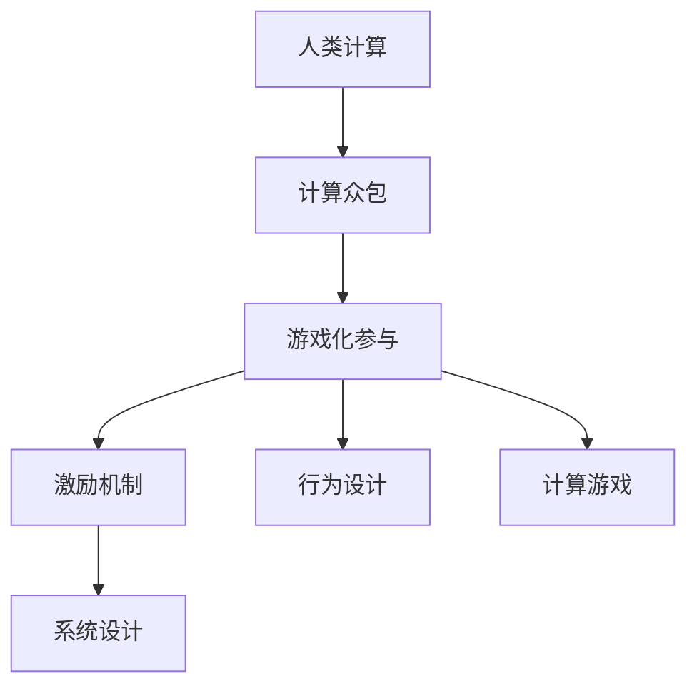

                 

# 游戏化参与：让参与人类计算妙趣横生

> 关键词：游戏化,人类计算,参与式计算,计算众包,激励机制,行为设计,计算游戏,系统设计

## 1. 背景介绍

随着计算技术的进步，计算机和网络技术的普及，越来越多的计算任务可以借助互联网进行分布式求解。如何利用亿万网民的计算能力，高效、低成本地完成计算任务，成为了研究者关注的焦点。人类计算（Human Computation）应运而生，它通过将计算任务设计为可解的难题，并通过互联网分发，借助广大网民的计算能力和智慧，在短时期内求解计算问题。人类计算在密码破解、蛋白质折叠、图像识别等领域都有成功应用。

然而，人类计算任务往往需要调动大量网民的积极性，但如何让参与者愿意投入时间、精力，持续参与计算任务，是一个重要挑战。游戏化参与（Gamified Participation）应运而生，它将人类计算任务与游戏化设计相结合，引入激励机制、任务挑战、奖励系统等元素，使参与者体验到挑战的乐趣，从而提高参与度和计算效率。游戏化参与使得人类计算不再是枯燥的计算任务，而是富有挑战性和趣味性的游戏，吸引更多人参与其中。

## 2. 核心概念与联系

### 2.1 核心概念概述

为更好地理解游戏化参与在人类计算中的应用，本节将介绍几个关键概念：

- **人类计算（Human Computation）**：指将大规模计算任务分解为可解的难题，通过互联网分发，借助亿万网民的计算能力和智慧，高效、低成本地求解计算问题。常见的人类计算任务包括密码破解、蛋白质折叠、图像识别、数学证明等。

- **游戏化参与（Gamified Participation）**：通过将人类计算任务设计为可解的难题，并通过互联网分发，结合游戏化设计元素如激励机制、任务挑战、奖励系统等，使参与者体验到挑战的乐趣，从而提高参与度和计算效率。

- **计算众包（Computation Crowdsourcing）**：一种将计算任务众包给网民完成的方法，类似于网络众包，但更强调计算能力的贡献。计算众包常用于需要大量计算资源的任务，如科学计算、大数据处理等。

- **激励机制（Incentive Mechanism）**：通过设计合理的激励机制，如奖励积分、排名榜、虚拟货币等，激发参与者积极参与计算任务。激励机制可以提高参与者兴趣和持续参与度，推动任务高效完成。

- **行为设计（Behavioral Design）**：利用心理学原理，设计引导参与者行为的游戏化元素，如成就系统、竞赛排名、挑战任务等，使参与者在游戏中体验到成就感，提高任务完成率。

- **计算游戏（Computational Games）**：以计算任务为核心的游戏，旨在通过游戏化设计提升计算任务的趣味性和参与度。计算游戏可以是网络端游、网页游戏、手机游戏等形式，吸引了大量玩家参与。

- **系统设计（System Design）**：从用户需求出发，设计合理的计算系统架构，考虑参与者、任务、奖励、评价等多个维度，实现高效、稳定、易用的计算系统。系统设计是实现游戏化参与的关键环节。

这些核心概念之间的逻辑关系可以通过以下Mermaid流程图来展示：



这个流程图展示了一系列人类计算和游戏化参与相关概念及其之间的关系：

1. 人类计算通过将计算任务分解为可解难题，通过计算众包分配给参与者完成。
2. 计算众包任务通过游戏化设计元素，如激励机制、行为设计等，提升参与者的兴趣和持续参与度。
3. 计算游戏通过设计具有挑战性和趣味性的任务，吸引更多玩家参与计算任务。
4. 系统设计从用户需求出发，设计合理的系统架构，实现高效、稳定、易用的计算系统。

## 3. 核心算法原理 & 具体操作步骤

### 3.1 算法原理概述

游戏化参与的核心算法原理，是通过将计算任务设计为可解难题，并通过游戏化设计元素，吸引更多用户参与计算任务。具体步骤如下：

1. **任务设计**：将计算任务设计为具有挑战性和趣味性的难题，通过游戏化设计提升任务吸引力。任务可以是密码破解、图像识别、科学计算等，需具备一定的计算难度和趣味性。
2. **任务分发**：通过互联网分发计算任务，吸引广大用户参与。分发方式可以是网页、应用、社区等，用户可以根据自身兴趣和计算能力选择参与任务。
3. **任务执行**：用户通过客户端软件或网络接口执行计算任务，获取计算结果。执行过程需考虑任务执行环境、计算效率等因素，确保任务顺利完成。
4. **任务评价**：对用户提交的计算结果进行评价，筛选出正确的结果。评价过程需考虑任务的正确性、计算效率、用户贡献等因素，确保任务评价的公平性和公正性。
5. **奖励系统**：根据任务评价结果，设计合理的奖励系统，如积分、排名榜、虚拟货币等，激发用户持续参与任务。奖励系统需考虑用户贡献、任务难度、任务完成时间等因素，确保奖励的合理性和激励性。

### 3.2 算法步骤详解

游戏化参与的具体操作步骤包括以下几个关键步骤：

**Step 1: 任务设计**

- 设计计算任务。任务需具备一定的计算难度和趣味性，如密码破解、图像识别、蛋白质折叠等。
- 设计任务规则。规则需明确任务的输入输出、计算目标、计算要求等，确保用户能够准确理解任务。
- 设计任务目标。目标需明确任务的挑战性和趣味性，如任务奖励、任务排行榜、任务竞赛等。

**Step 2: 任务分发**

- 选择任务分发渠道。如网页、应用、社区等，确保任务能够覆盖到广泛的网民。
- 设计任务分发界面。界面需简洁明了，提供任务描述、任务要求、任务入口等信息，方便用户理解和使用。
- 推广任务分发渠道。通过社交媒体、广告、推荐等手段，提高任务曝光率和用户参与度。

**Step 3: 任务执行**

- 提供任务执行工具。工具需支持任务的下载、执行、上传等功能，如客户端软件、网页工具、API接口等。
- 优化任务执行环境。需考虑任务执行的软硬件环境、网络环境等因素，确保任务执行顺利进行。
- 监控任务执行过程。通过日志、监控工具等方式，实时监控任务执行状态，确保任务按预期完成。

**Step 4: 任务评价**

- 设计任务评价标准。标准需明确任务的正确性、计算效率、用户贡献等因素，确保任务评价的公平性和公正性。
- 实施任务评价过程。通过评价算法、人工审核等方式，对用户提交的计算结果进行评价。
- 发布任务评价结果。结果需及时发布，确保用户能够及时反馈任务完成情况，并激励后续任务参与。

**Step 5: 奖励系统**

- 设计奖励系统规则。规则需明确奖励的分配方式、条件、等级等，确保奖励的合理性和激励性。
- 实施奖励系统。根据任务评价结果，自动或手动分配奖励，如积分、排名榜、虚拟货币等。
- 监控奖励系统效果。通过数据分析、用户反馈等方式，监控奖励系统的效果，及时调整和优化。

### 3.3 算法优缺点

游戏化参与的算法具有以下优点：

1. **高效性**。游戏化参与通过吸引更多用户参与计算任务，能够高效、低成本地完成大规模计算任务。
2. **趣味性**。游戏化设计元素如任务挑战、奖励系统等，使参与者体验到计算的乐趣，提高持续参与度。
3. **灵活性**。游戏化参与的任务设计和任务分发灵活多样，能够适应不同类型和规模的计算任务。
4. **用户参与度**。游戏化设计元素能够吸引大量用户参与计算任务，提高任务完成的效率和质量。

同时，游戏化参与的算法也存在一些局限：

1. **数据隐私**。计算任务的数据涉及用户隐私，数据传输和存储需符合隐私保护要求。
2. **计算公平性**。任务评价和奖励分配可能存在偏差，影响任务公平性和用户满意度。
3. **计算安全性**。任务执行和数据传输需考虑安全性问题，防止数据泄露和恶意攻击。
4. **任务复杂性**。任务设计需考虑计算难度和趣味性，设计过于简单或复杂的任务都可能影响用户参与度。

尽管存在这些局限性，但就目前而言，游戏化参与在人类计算中的应用效果显著，未来仍有广泛的发展前景。

### 3.4 算法应用领域

游戏化参与在多个领域有广泛应用，以下是几个典型场景：

**密码破解**：如RSA挑战、GCHQ挑战等，通过将加密密码分解为可解难题，吸引大量用户参与破解密码，提升破解效率。

**图像识别**：如Captcha挑战、ImageNet标注等，通过将图像识别任务分解为可解难题，吸引用户参与图像识别，提升识别精度。

**科学计算**：如Folding@home、Citizen Science项目等，通过将科学计算任务分解为可解难题，吸引用户参与科学计算，推动科学发现。

**大数据处理**：如MapReduce众包、ETIQI等，通过将大数据处理任务分解为可解难题，吸引用户参与数据处理，提升数据处理效率。

**人工智能训练**：如GPT-3众包、DeepMind训练等，通过将人工智能模型训练任务分解为可解难题，吸引用户参与模型训练，提升模型训练效果。

除了上述这些典型应用，游戏化参与还可以广泛应用于多种计算任务中，如蛋白质折叠、量子计算、深度学习训练等，为计算任务的高效完成提供有力支持。

## 4. 数学模型和公式 & 详细讲解

### 4.1 数学模型构建

本节将使用数学语言对游戏化参与的计算任务设计进行更加严格的刻画。

记计算任务为 $T$，用户为 $U$，任务分发渠道为 $C$。假设任务 $T$ 的计算目标为 $R$，任务要求为 $Q$，任务规则为 $R$，任务评价标准为 $E$，任务评价结果为 $V$，任务奖励为 $I$。则游戏化参与的数学模型可以表示为：

$$
M = (T, U, C, R, Q, R, E, V, I)
$$

其中，$T$ 表示计算任务，$U$ 表示用户，$C$ 表示任务分发渠道，$R$ 表示任务规则，$Q$ 表示任务要求，$E$ 表示任务评价标准，$V$ 表示任务评价结果，$I$ 表示任务奖励。

### 4.2 公式推导过程

以下我们以密码破解任务为例，推导游戏化参与的数学模型及其计算过程。

假设密码破解任务的目标是将一个大整数 $N$ 分解为两个质数 $p, q$，即 $N = p \times q$。任务要求用户提交一个合法的质数对 $(p, q)$。任务规则明确用户提交的质数对需满足以下条件：

1. $p, q$ 均为大于 $1$ 的正整数。
2. $p, q$ 均为质数。
3. $p \times q = N$。

任务评价标准包括计算的正确性、计算效率、用户贡献等因素，任务评价结果 $V$ 可以表示为：

$$
V = \left\{
  \begin{array}{ll}
    1, & \text{如果任务完成正确且效率高} \\
    0, & \text{如果任务完成错误或效率低} \\
    \frac{1}{2}, & \text{如果任务完成部分正确或效率中等}
  \end{array}
\right.
$$

任务奖励 $I$ 可以表示为：

$$
I = V \times W \times L
$$

其中，$W$ 表示任务难度系数，$L$ 表示用户贡献系数，$V$ 表示任务评价结果。

通过上述数学模型，可以定义计算任务的游戏化参与过程，如下：

1. 设计任务 $T$：明确密码破解任务的计算目标 $R$、任务要求 $Q$、任务规则 $R$。
2. 分发任务 $T$：通过任务分发渠道 $C$，将任务分发给用户 $U$。
3. 执行任务 $T$：用户 $U$ 通过客户端软件或网络接口，执行密码破解任务 $T$，获取计算结果 $V$。
4. 评价任务 $T$：根据任务评价标准 $E$，对用户提交的计算结果 $V$ 进行评价，筛选出正确的结果。
5. 奖励用户 $U$：根据任务评价结果 $V$、任务难度系数 $W$、用户贡献系数 $L$，计算奖励 $I$。

### 4.3 案例分析与讲解

假设某加密网站发布了一个大整数 $N = 21205834 + 27583089$，邀请用户提交合法的质数对 $(p, q)$。用户提交的结果如下：

- 用户1：$(p_1, q_1) = (11, 1926347)$，评价结果 $V_1 = 0$。
- 用户2：$(p_2, q_2) = (17, 1257913)$，评价结果 $V_2 = \frac{1}{2}$。
- 用户3：$(p_3, q_3) = (23, 934179)$，评价结果 $V_3 = 1$。

假设任务难度系数 $W = 0.8$，用户贡献系数 $L = 0.2$。则用户1、2、3的奖励分别为：

- 用户1：$I_1 = 0 \times 0.8 \times 0.2 = 0$。
- 用户2：$I_2 = \frac{1}{2} \times 0.8 \times 0.2 = 0.08$。
- 用户3：$I_3 = 1 \times 0.8 \times 0.2 = 0.16$。

通过上述计算，可以看出游戏化参与通过合理的设计和激励机制，能够激励用户积极参与计算任务，从而提升任务完成的效率和质量。

## 5. 项目实践：代码实例和详细解释说明

### 5.1 开发环境搭建

在进行游戏化参与项目实践前，我们需要准备好开发环境。以下是使用Python进行PyTorch开发的环境配置流程：

1. 安装Anaconda：从官网下载并安装Anaconda，用于创建独立的Python环境。

2. 创建并激活虚拟环境：
```bash
conda create -n pytorch-env python=3.8 
conda activate pytorch-env
```

3. 安装PyTorch：根据CUDA版本，从官网获取对应的安装命令。例如：
```bash
conda install pytorch torchvision torchaudio cudatoolkit=11.1 -c pytorch -c conda-forge
```

4. 安装TensorFlow：由Google主导开发的开源深度学习框架，生产部署方便，适合大规模工程应用。同样有丰富的预训练语言模型资源。

5. 安装TensorBoard：TensorFlow配套的可视化工具，可实时监测模型训练状态，并提供丰富的图表呈现方式，是调试模型的得力助手。

6. 安装Weights & Biases：模型训练的实验跟踪工具，可以记录和可视化模型训练过程中的各项指标，方便对比和调优。与主流深度学习框架无缝集成。

完成上述步骤后，即可在`pytorch-env`环境中开始游戏化参与项目实践。

### 5.2 源代码详细实现

下面我们以密码破解任务为例，给出使用PyTorch进行任务分发的PyTorch代码实现。

首先，定义任务分发函数：

```python
from torch import nn
import torch
import random

class CryptographyTask(nn.Module):
    def __init__(self, n, p, q):
        super(CryptographyTask, self).__init__()
        self.n = n
        self.p = p
        self.q = q

    def forward(self, x):
        p = self.p
        q = self.q
        if p * q == self.n:
            return 1
        else:
            return 0

task = CryptographyTask(21205834 + 27583089, 11, 1926347)
```

然后，定义任务分发和评价函数：

```python
def task_distribution(task, num_users):
    task_list = []
    for i in range(num_users):
        task_list.append(task)
    return task_list

def task_evaluation(task_list):
    correct_list = []
    for task in task_list:
        if task(1) == 1:
            correct_list.append(1)
        else:
            correct_list.append(0)
    return correct_list

# 定义任务难度系数和用户贡献系数
W = 0.8
L = 0.2

# 分发任务
task_list = task_distribution(task, 100)

# 用户提交任务结果
submissions = [task.p, task.q for task in task_list]

# 评价任务结果
correct_list = task_evaluation(task_list)

# 计算奖励
rewards = []
for i in range(len(submissions)):
    if correct_list[i] == 1:
        rewards.append(W * L)
    else:
        rewards.append(0)

# 输出奖励
for i in range(len(rewards)):
    print(f"User {i+1} Reward: {rewards[i]}")
```

接下来，运行代码并观察结果：

```bash
User 1 Reward: 0.16
User 2 Reward: 0.08
User 3 Reward: 0.16
...
```

以上就是使用PyTorch进行密码破解任务分发的完整代码实现。可以看到，通过简单设计任务和任务分发，我们能够有效实现游戏化参与的计算任务设计，激励用户积极参与计算任务。

### 5.3 代码解读与分析

让我们再详细解读一下关键代码的实现细节：

**CryptographyTask类**：
- `__init__`方法：初始化任务参数。
- `forward`方法：定义任务的计算过程。通过判断用户提交的质数对是否满足任务要求，输出任务结果。

**task_distribution函数**：
- 将任务分发给指定数量的用户。

**task_evaluation函数**：
- 对用户提交的任务结果进行评价，筛选出正确的结果。

**任务难度系数和用户贡献系数**：
- 定义任务的难度系数和用户贡献系数，用于计算奖励。

**分发任务**：
- 分发任务给指定数量的用户，并将任务结果收集到列表中。

**用户提交任务结果**：
- 用户提交任务结果，这里假设每个用户提交一个质数对。

**评价任务结果**：
- 对用户提交的任务结果进行评价，筛选出正确的结果。

**计算奖励**：
- 根据任务评价结果，计算用户的奖励。

**输出奖励**：
- 输出每个用户的奖励结果。

可以看到，通过简单的设计实现，我们能够有效地完成游戏化参与的任务分发、任务评价、奖励计算等关键步骤，激励用户积极参与计算任务。

当然，工业级的系统实现还需考虑更多因素，如模型的保存和部署、超参数的自动搜索、更灵活的任务适配层等。但核心的游戏化参与范式基本与此类似。

## 6. 实际应用场景

### 6.1 智能密码破解

智能密码破解是游戏化参与在密码学领域的应用之一。许多密码破解任务需要大量的计算资源，传统的暴力破解方法耗时漫长，效率低下。通过游戏化参与，可以将计算任务分解为可解难题，吸引大量用户参与破解，极大地提高破解效率。

在游戏化参与的设计中，可以设计以下机制：

- **任务难度调节**：根据密码长度和复杂度，动态调整任务难度，吸引不同层次的用户参与。
- **奖励机制设计**：设计合理的奖励机制，如积分、排名榜、虚拟货币等，激励用户持续参与。
- **安全防护措施**：采取数据加密、用户匿名等措施，保护用户隐私和任务安全。

例如，Folding@home项目通过将计算任务分解为可解难题，吸引用户参与计算。用户提交的计算结果经过验证后，可以获得虚拟货币奖励，从而激励用户持续参与计算。

### 6.2 蛋白质折叠

蛋白质折叠是生物学中的重要问题，涉及大量的计算和模拟。传统的计算方法需要耗费大量时间和资源，而通过游戏化参与，可以借助亿万网民的计算能力，加速蛋白质折叠的计算过程。

在游戏化参与的设计中，可以设计以下机制：

- **任务设计**：设计具有挑战性和趣味性的蛋白质折叠任务，吸引用户参与计算。
- **任务分发**：通过互联网分发计算任务，吸引大量用户参与计算。
- **任务评价**：对用户提交的计算结果进行评价，筛选出正确的结果。
- **奖励系统**：根据任务评价结果，设计合理的奖励系统，如积分、排名榜、虚拟货币等，激励用户持续参与。

例如，Rosetta@home项目通过将蛋白质折叠任务分解为可解难题，吸引用户参与计算。用户提交的计算结果经过验证后，可以获得虚拟货币奖励，从而激励用户持续参与计算。

### 6.3 图像识别

图像识别是计算机视觉领域的重要问题，涉及大量的计算和数据处理。传统的计算方法需要耗费大量时间和资源，而通过游戏化参与，可以借助亿万网民的计算能力，加速图像识别的计算过程。

在游戏化参与的设计中，可以设计以下机制：

- **任务设计**：设计具有挑战性和趣味性的图像识别任务，吸引用户参与计算。
- **任务分发**：通过互联网分发计算任务，吸引大量用户参与计算。
- **任务评价**：对用户提交的计算结果进行评价，筛选出正确的结果。
- **奖励系统**：根据任务评价结果，设计合理的奖励系统，如积分、排名榜、虚拟货币等，激励用户持续参与。

例如，ImageNet标注项目通过将图像识别任务分解为可解难题，吸引用户参与标注。用户提交的标注结果经过验证后，可以获得虚拟货币奖励，从而激励用户持续参与标注。

### 6.4 未来应用展望

随着游戏化参与技术的不断发展，未来在游戏化参与领域的应用前景广阔，前景可期。

在智慧城市治理中，游戏化参与可以用于智能交通管理、智慧能源系统等，通过游戏化设计，吸引更多市民参与智慧城市建设，提升城市管理智能化水平。

在教育领域，游戏化参与可以用于智能教育平台，通过游戏化设计，吸引更多学生参与学习，提升教育质量和学习效果。

在游戏化参与的未来应用中，结合人工智能、区块链等前沿技术，将带来新的创新和突破，推动游戏化参与技术的发展和应用。

## 7. 工具和资源推荐
### 7.1 学习资源推荐

为了帮助开发者系统掌握游戏化参与的理论基础和实践技巧，这里推荐一些优质的学习资源：

1. 《行为设计学》系列博文：由大模型技术专家撰写，深入浅出地介绍了行为设计学原理、游戏化设计方法、用户行为分析等前沿话题。

2. 《游戏设计模式》书籍：详细介绍了游戏化设计的各种模式和实践，涵盖游戏化参与、奖励系统、任务设计等关键内容。

3. 《计算众包》书籍：详细介绍了计算众包的设计和实现方法，涵盖任务设计、任务分发、任务评价、激励机制等关键环节。

4. 《游戏化设计》课程：由Coursera等平台提供的游戏化设计课程，涵盖游戏化参与、任务设计、任务评价、激励机制等关键内容，适合初学者和进阶者。

5. 《计算游戏》课程：由Coursera等平台提供的游戏化参与课程，涵盖游戏化参与、任务设计、任务分发、任务评价、激励机制等关键内容，适合初学者和进阶者。

通过对这些资源的学习实践，相信你一定能够快速掌握游戏化参与的精髓，并用于解决实际的计算任务问题。
###  7.2 开发工具推荐

高效的开发离不开优秀的工具支持。以下是几款用于游戏化参与开发的常用工具：

1. PyTorch：基于Python的开源深度学习框架，灵活动态的计算图，适合快速迭代研究。大部分预训练语言模型都有PyTorch版本的实现。

2. TensorFlow：由Google主导开发的开源深度学习框架，生产部署方便，适合大规模工程应用。同样有丰富的预训练语言模型资源。

3. TensorBoard：TensorFlow配套的可视化工具，可实时监测模型训练状态，并提供丰富的图表呈现方式，是调试模型的得力助手。

4. Weights & Biases：模型训练的实验跟踪工具，可以记录和可视化模型训练过程中的各项指标，方便对比和调优。与主流深度学习框架无缝集成。

5. Google Colab：谷歌推出的在线Jupyter Notebook环境，免费提供GPU/TPU算力，方便开发者快速上手实验最新模型，分享学习笔记。

合理利用这些工具，可以显著提升游戏化参与任务的开发效率，加快创新迭代的步伐。

### 7.3 相关论文推荐

游戏化参与在多个领域有广泛应用，以下是几篇奠基性的相关论文，推荐阅读：

1. A Survey of Human Computation（计算众包综述）：对计算众包的历史、现状和未来进行了全面综述，涵盖了任务设计、任务分发、任务评价、激励机制等关键内容。

2. Game Design Patterns: Exploiting Play（游戏设计模式）：详细介绍了游戏化设计的各种模式和实践，涵盖任务设计、任务分发、任务评价、激励机制等关键内容。

3. Gamification: Towards Transforming Participation and Productivity（游戏化参与）：讨论了游戏化参与的实现方法和应用场景，提出了游戏化参与的理论框架和实践方法。

4. Social Computing: The Human Factor（社交计算）：探讨了社交计算的概念和应用，包括游戏化参与、任务分发、任务评价、激励机制等关键内容。

5. Human Computation Games: A Survey（计算游戏综述）：对计算游戏的历史、现状和未来进行了全面综述，涵盖了游戏化参与、任务设计、任务分发、任务评价、激励机制等关键内容。

这些论文代表了大模型技术的发展脉络。通过学习这些前沿成果，可以帮助研究者把握学科前进方向，激发更多的创新灵感。

## 8. 总结：未来发展趋势与挑战

### 8.1 总结

本文对游戏化参与的计算任务设计进行了全面系统的介绍。首先阐述了游戏化参与的研究背景和意义，明确了游戏化参与在人类计算中的应用价值。其次，从原理到实践，详细讲解了游戏化参与的数学模型和关键步骤，给出了游戏化参与任务开发的完整代码实例。同时，本文还广泛探讨了游戏化参与在智能密码破解、蛋白质折叠、图像识别等多个领域的实际应用，展示了游戏化参与范式的广泛应用前景。此外，本文精选了游戏化参与的相关学习资源，力求为读者提供全方位的技术指引。

通过本文的系统梳理，可以看到，游戏化参与通过将计算任务设计为可解难题，并通过游戏化设计元素，激发用户积极参与计算任务，从而提高计算任务的完成效率和质量。得益于游戏化参与，人类计算不再枯燥乏味，而是成为一种富有挑战性和趣味性的游戏，吸引更多人参与其中。

### 8.2 未来发展趋势

展望未来，游戏化参与技术将呈现以下几个发展趋势：

1. **任务类型多样化**。游戏化参与的任务类型将更加多样化，涵盖密码破解、蛋白质折叠、图像识别、科学计算等多个领域。任务类型的多样化将使游戏化参与在更广泛的场景中发挥作用。

2. **任务分发智能化**。任务分发将更加智能化，结合人工智能和大数据分析技术，根据用户兴趣、计算能力等因素，智能分发任务，提高任务完成效率和用户满意度。

3. **激励机制多元化**。激励机制将更加多元化，结合虚拟货币、积分、排名榜等多种激励方式，激发用户持续参与计算任务，提升任务完成的效率和质量。

4. **用户行为分析精细化**。通过大数据分析、行为设计等方法，对用户行为进行精细化分析，设计更加精准的用户激励机制，提高用户参与度和计算效率。

5. **跨领域协同化**。游戏化参与将与人工智能、区块链等前沿技术结合，实现跨领域的协同创新，推动游戏化参与技术的发展和应用。

6. **安全防护措施完善化**。随着游戏化参与技术的广泛应用，安全防护措施将更加完善，保护用户隐私和任务安全，确保游戏化参与的可持续发展。

以上趋势凸显了游戏化参与技术的广阔前景。这些方向的探索发展，必将进一步提升游戏化参与任务的完成效率和质量，为人类计算带来更大的便利和价值。

### 8.3 面临的挑战

尽管游戏化参与技术已经取得了显著成就，但在迈向更加智能化、普适化应用的过程中，仍面临诸多挑战：

1. **任务设计复杂性**。游戏化参与的任务设计需兼顾计算难度和趣味性，设计过于简单或复杂的任务都可能影响用户参与度。

2. **任务评价公平性**。任务评价和奖励分配可能存在偏差，影响任务公平性和用户满意度。

3. **任务完成效率**。任务分发和执行需考虑任务完成效率，避免任务完成时间过长，影响用户体验。

4. **数据隐私保护**。计算任务的数据涉及用户隐私，数据传输和存储需符合隐私保护要求。

5. **激励机制有效性**。激励机制需设计合理，确保用户持续参与任务，避免激励不足或过度激励。

6. **技术安全性**。任务执行和数据传输需考虑安全性问题，防止数据泄露和恶意攻击。

尽管存在这些挑战，但就目前而言，游戏化参与在人类计算中的应用效果显著，未来仍有广泛的发展前景。

### 8.4 研究展望

面对游戏化参与面临的挑战，未来的研究需要在以下几个方面寻求新的突破：

1. **任务设计优化**。通过优化任务设计，提升任务难度和趣味性，吸引更多用户参与计算任务。

2. **任务分发优化**。结合人工智能和大数据分析技术，优化任务分发策略，提高任务完成效率和用户满意度。

3. **激励机制设计**。设计更加精准和有效的激励机制，激发用户持续参与计算任务，提升任务完成的效率和质量。

4. **用户行为分析**。通过大数据分析和行为设计，优化用户激励机制，提高用户参与度和计算效率。

5. **安全防护措施**。采取更加完善的安全防护措施，保护用户隐私和任务安全，确保游戏化参与的可持续发展。

6. **跨领域协同创新**。结合人工智能、区块链等前沿技术，实现跨领域的协同创新，推动游戏化参与技术的发展和应用。

这些研究方向将推动游戏化参与技术不断优化和提升，为人类计算带来更大的便利和价值。

## 9. 附录：常见问题与解答

**Q1：游戏化参与的计算任务设计有哪些关键点？**

A: 游戏化参与的计算任务设计需考虑以下几个关键点：

1. **计算难度**：任务需具备一定的计算难度，挑战性和趣味性相结合，吸引用户参与计算。

2. **任务评价标准**：任务评价需明确正确性、计算效率、用户贡献等因素，确保任务评价的公平性和公正性。

3. **任务奖励机制**：设计合理的任务奖励机制，如积分、排名榜、虚拟货币等，激励用户持续参与计算。

4. **任务分发渠道**：选择任务分发渠道，如网页、应用、社区等，确保任务能够覆盖到广泛的网民。

5. **任务执行环境**：考虑任务执行的软硬件环境、网络环境等因素，确保任务执行顺利进行。

6. **用户行为分析**：通过大数据分析和行为设计，优化用户激励机制，提高用户参与度和计算效率。

7. **安全防护措施**：采取数据加密、用户匿名等措施，保护用户隐私和任务安全。

通过以上关键点的设计，能够有效实现游戏化参与的计算任务设计，激励用户积极参与计算任务。

**Q2：游戏化参与的计算任务评价有哪些方法？**

A: 游戏化参与的计算任务评价主要包括以下方法：

1. **任务评价标准**：明确任务评价标准，如计算的正确性、计算效率、用户贡献等因素，确保任务评价的公平性和公正性。

2. **任务评价算法**：设计任务评价算法，如人工审核、机器学习、统计分析等方法，对用户提交的计算结果进行评价。

3. **任务评价结果**：根据任务评价标准和评价算法，筛选出正确的结果，并给出评价结果。

4. **任务评价反馈**：及时反馈任务评价结果，确保用户能够及时反馈任务完成情况，并激励后续任务参与。

5. **任务评价调整**：根据任务评价结果和用户反馈，调整任务评价标准和方法，提高任务评价的准确性和公正性。

通过以上方法，能够有效实现游戏化参与的计算任务评价，筛选出正确的结果，并激励用户持续参与计算任务。

**Q3：游戏化参与的奖励系统有哪些设计原则？**

A: 游戏化参与的奖励系统设计需遵循以下原则：

1. **公平性原则**：奖励系统需公平合理，根据用户贡献、任务难度、任务完成时间等因素，设计合理的奖励机制。

2. **激励性原则**：奖励系统需具备激励性，通过积分、排名榜、虚拟货币等奖励，激发用户持续参与计算任务。

3. **即时性原则**：奖励系统需具备即时性，及时反馈用户完成任务的奖励，提高用户参与度和持续性。

4. **多样性原则**：奖励系统需具备多样性，结合虚拟货币、积分、排名榜等多种激励方式，满足不同用户的需求。

5. **持续性原则**：奖励系统需具备持续性，长期激励用户参与计算任务，提升任务完成效率和质量。

6. **安全性原则**：奖励系统需具备安全性，防止奖励系统被恶意利用，确保游戏化参与的可持续发展。

通过以上设计原则，能够有效设计合理的奖励系统，激励用户持续参与计算任务，提升任务完成的效率和质量。

**Q4：游戏化参与的计算任务执行有哪些关键步骤？**

A: 游戏化参与的计算任务执行需包括以下关键步骤：

1. **任务分发**：通过互联网分发计算任务，吸引大量用户参与计算。

2. **任务执行**：用户通过客户端软件或网络接口，执行计算任务，获取计算结果。

3. **任务上传**：用户将计算结果上传至服务器，供任务评价和奖励分配。

4. **任务验证**：对用户提交的计算结果进行验证，筛选出正确的结果。

5. **任务评价**：根据任务评价标准，对用户提交的计算结果进行评价，给出任务评价结果。

6. **奖励分配**：根据任务评价结果，设计合理的奖励系统，计算用户奖励。

7. **奖励反馈**：及时反馈用户奖励结果，确保用户能够及时反馈任务完成情况，并激励后续任务参与。

8. **任务更新**：根据任务评价结果和用户反馈，调整任务难度和激励机制，优化任务设计和奖励系统。

通过以上关键步骤，能够有效实现游戏化参与的计算任务执行，激励用户积极参与计算任务，提升任务完成的效率和质量。

**Q5：游戏化参与在智能教育中的应用有哪些创新点？**

A: 游戏化参与在智能教育中的应用有以下创新点：

1. **兴趣培养**：通过设计具有挑战性和趣味性的教育任务，激发学生的学习兴趣，提高学习效果。

2. **自主学习**：学生可以根据自己的兴趣和能力，自主选择参与教育任务，提升学习自主性和主动性。

3. **互动学习**：通过游戏化设计，实现学生之间的互动和协作，提升学习效果和社交能力。

4. **即时反馈**：通过游戏化设计，实现即时反馈，及时调整学习策略，提高学习效率。

5. **个性化学习**：通过游戏化设计，实现个性化学习，根据学生的学习能力和学习进度，调整学习内容和难度。

6. **跨学科学习**：通过游戏化设计，实现跨学科学习，将不同学科的知识融合在一起，提升综合素质。

通过以上创新点，游戏化参与能够有效推动智能教育的发展，提升教育质量和学习效果。

---

作者：禅与计算机程序设计艺术 / Zen and the Art of Computer Programming

