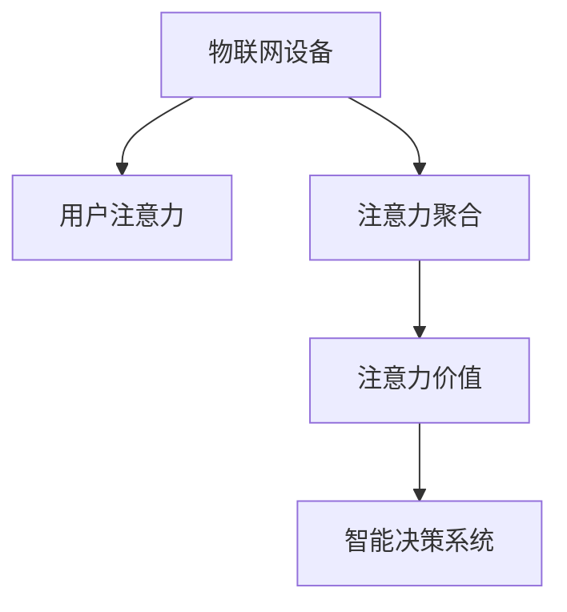

                 

# 物联网设备的注意力经济价值挖掘

## 1. 背景介绍

### 1.1 问题由来

随着物联网(IoT)技术的飞速发展，越来越多的智能设备融入人们的生活和工作，逐渐形成了一个庞大的“物联世界”。这些设备不仅能够采集和传输数据，还能进行数据分析和决策，为人类提供各种便捷服务和智能应用。

然而，物联网设备的广泛应用也带来了一些新的问题。首先，海量的数据采集、存储和传输消耗了大量资源，导致运营成本的增加。其次，用户关注点分散，难以在众多设备和服务中集中注意力，导致智能应用的实际效果和用户满意度不尽人意。

因此，如何挖掘物联网设备的注意力经济价值，将海量注意力资源转化为实际经济价值，成为当下亟待解决的问题。这不仅有助于降低物联网设备的运营成本，还能提升用户体验，推动智能应用向更加成熟和普及的方向发展。

### 1.2 问题核心关键点

为解决这个问题，需要在以下几个关键方面进行深入研究：

1. **注意力资源的识别和聚合**：需要建立有效的机制，识别用户的注意力分布和关注点，并将其聚合到重点设备和服务上。
2. **注意力价值评估与转化**：需要开发方法对用户的注意力价值进行量化，并将注意力资源转化为经济收益。
3. **注意力资源的动态调整**：需要设计算法根据用户行为和环境变化动态调整注意力资源的分配。
4. **注意力管理的智能决策**：需要构建智能决策系统，优化注意力资源的分配，提高用户体验和经济效益。

这些关键点涉及到数据处理、用户行为分析、经济价值评估、智能决策等多个领域，是物联网设备注意力经济价值挖掘的核心方向。

## 2. 核心概念与联系

### 2.1 核心概念概述

为更好地理解注意力经济价值挖掘技术，本节将介绍几个密切相关的核心概念：

1. **物联网设备(IoT Devices)**：指各种能够实现网络连接的智能设备，包括智能家居、智能交通、工业物联网等。
2. **用户注意力(User Attention)**：指用户在获取信息和交互应用时，对特定设备、服务或内容的关注程度，可以通过点击、停留时间、互动频率等指标衡量。
3. **注意力聚合(Aggregation of Attention)**：指将分散的注意力资源集中在重点设备和服务上，提高注意力利用效率。
4. **注意力价值(Attention Value)**：指用户注意力所带来的经济价值，包括广告点击率、用户粘性、服务收益等。
5. **智能决策系统(Intelligent Decision System)**：指能够通过数据分析和算法优化，自动调整注意力资源分配的系统，如推荐系统、智能广告投放等。

这些概念之间的逻辑关系可以通过以下Mermaid流程图来展示：



这个流程图展示了几大核心概念及其之间的联系：

1. 物联网设备通过数据采集获得用户的注意力信息。
2. 注意力信息经过聚合后，转化为用户的注意力价值。
3. 注意力价值在智能决策系统的指导下，优化注意力资源的分配，提升经济效益。

## 3. 核心算法原理 & 具体操作步骤
### 3.1 算法原理概述

物联网设备的注意力经济价值挖掘，本质上是一个多目标优化问题。其核心思想是：通过识别用户的注意力分布和价值，设计优化算法，最大化注意力资源利用率和经济收益。

形式化地，假设物联网设备集合为 $D$，用户注意力分布为 $A$，注意力聚合机制为 $F$，注意力价值为 $V$，智能决策系统为 $S$。目标是通过优化算法 $O$，最大化注意力价值 $V(A)$，即：

$$
\max_{O} V(A)=\max_{O} \sum_{d \in D} V_d(A)
$$

其中 $V_d(A)$ 表示设备 $d$ 的注意力价值。

### 3.2 算法步骤详解

物联网设备注意力经济价值挖掘的主要步骤如下：

**Step 1: 数据收集与预处理**
- 收集物联网设备的传感器数据、用户交互数据、环境数据等，并进行清洗和预处理。
- 使用数据挖掘和统计分析技术，识别用户的注意力分布和关注点。

**Step 2: 注意力资源聚合**
- 根据用户注意力分布，设计聚合算法，将注意力资源集中在重点设备和服务上。
- 采用贪心策略或优化算法，选择注意力价值最高的设备和服务进行重点聚合。

**Step 3: 注意力价值评估**
- 使用机器学习模型，量化用户注意力价值。常见方法包括逻辑回归、决策树、随机森林等。
- 通过标注数据和模型训练，优化注意力价值评估模型。

**Step 4: 智能决策与优化**
- 设计智能决策系统，根据用户行为和环境变化，动态调整注意力资源分配。
- 使用优化算法，求解注意力资源分配的最优解，如线性规划、动态规划等。

**Step 5: 效果评估与反馈**
- 在实际应用中，对注意力资源聚合和智能决策的效果进行评估，对比前后经济效益。
- 根据评估结果，调整注意力聚合和智能决策策略，优化系统性能。

### 3.3 算法优缺点

物联网设备注意力经济价值挖掘方法具有以下优点：

1. **高效性**：通过数据聚合和智能决策，可以高效利用注意力资源，提升经济效益。
2. **个性化**：能够根据用户行为和偏好，动态调整注意力资源分配，提升用户体验。
3. **鲁棒性**：通过机器学习模型，能够适应不同环境和用户群体，具有较高的鲁棒性。
4. **可扩展性**：算法框架可应用于多种物联网设备和场景，具有较好的可扩展性。

同时，该方法也存在一定的局限性：

1. **数据需求高**：需要大量用户行为和设备数据作为基础，数据获取和处理成本较高。
2. **模型复杂**：注意力价值评估和智能决策涉及多种复杂算法，模型构建和优化较为困难。
3. **隐私风险**：在数据聚合和处理过程中，需要注意用户隐私保护，防止数据泄露。
4. **动态变化挑战**：用户行为和环境变化迅速，难以实时调整注意力资源分配。

尽管存在这些局限性，但物联网设备注意力经济价值挖掘方法在大规模物联网应用中具有广阔的应用前景，值得深入研究和实践。

### 3.4 算法应用领域

物联网设备注意力经济价值挖掘方法在多个领域都有广泛的应用，例如：

1. **智能家居**：通过分析用户的家居行为数据，优化智能家居设备的注意力分配，提升用户舒适度和节能效益。
2. **智能交通**：通过识别用户的出行偏好，优化交通服务的注意力资源，提高交通运行效率和用户满意度。
3. **工业物联网**：通过分析生产设备的数据，优化生产流程的注意力资源，提升生产效率和质量。
4. **智能医疗**：通过分析患者的医疗数据，优化医疗服务的注意力资源，提高医疗服务的针对性和效果。

除了上述这些经典领域外，物联网设备注意力经济价值挖掘方法还可应用于更多场景中，如智慧城市、智能办公、智能制造等，为物联网技术的应用提供新的思路和方向。

## 4. 数学模型和公式 & 详细讲解 & 举例说明

### 4.1 数学模型构建

本节将使用数学语言对物联网设备注意力经济价值挖掘过程进行更加严格的刻画。

假设物联网设备集合为 $D$，用户注意力分布为 $A$，注意力聚合机制为 $F$，注意力价值为 $V$。目标是最大化注意力价值 $V(A)$。

设 $A_i$ 表示用户对设备 $i$ 的注意力，$V_i$ 表示设备 $i$ 的注意力价值。则注意力聚合算法 $F$ 可表示为：

$$
F(A) = \sum_{i \in D} A_i V_i
$$

其中 $A_i$ 可以通过用户行为数据或机器学习模型得到。

### 4.2 公式推导过程

以下我们以智能家居场景为例，推导注意力资源聚合和智能决策的数学模型。

**Step 1: 注意力聚合**
假设用户对智能家居设备的注意力可以表示为一个向量 $A = (A_1, A_2, \cdots, A_n)$，其中 $A_i$ 表示用户对设备 $i$ 的注意力程度。

智能家居设备的注意力价值可以通过历史数据或用户反馈得到，假设 $V_i$ 为设备 $i$ 的注意力价值，则注意力聚合算法可以表示为：

$$
F(A) = \sum_{i \in D} A_i V_i
$$

其中 $D$ 表示智能家居设备的集合。

**Step 2: 智能决策**
假设智能家居设备的注意力价值为 $V_i$，注意力聚合后的值 $F(A)$ 为优化目标。根据用户行为和设备状态，设计智能决策系统，动态调整 $A_i$ 的值。

设 $\eta$ 为学习率，$A^{t+1}$ 为第 $t+1$ 步的注意力向量，则智能决策系统的更新公式为：

$$
A^{t+1} = A^t + \eta \nabla_{A} V(A)
$$

其中 $\nabla_{A} V(A)$ 为注意力聚合函数对 $A$ 的梯度。

### 4.3 案例分析与讲解

以智能家居场景为例，假设用户对各个设备的关注点如下：

| 设备名称 | 用户关注点 | 注意力值 $A_i$ | 注意力价值 $V_i$ |
|----------|----------|------------|-------------|
| 空调     | 温度设定 | 0.8        | 1.0         |
| 洗衣机   | 洗净程度 | 0.6        | 1.2         |
| 照明灯   | 亮度调节 | 0.7        | 0.9         |

通过聚合算法计算，得到总注意力价值为：

$$
F(A) = 0.8 \times 1.0 + 0.6 \times 1.2 + 0.7 \times 0.9 = 2.16
$$

使用智能决策系统，根据当前用户行为（如温度设定）和设备状态（如洗衣机运行中），调整 $A_i$ 的值，使注意力聚合后的值最大化。

假设智能决策系统通过优化算法得到 $A_i^{t+1}$，则新的总注意力价值为：

$$
F(A) = \sum_{i \in D} A_i^{t+1} V_i
$$

通过不断迭代优化，最大化智能家居设备的总注意力价值。

## 5. 项目实践：代码实例和详细解释说明
### 5.1 开发环境搭建

在进行物联网设备注意力经济价值挖掘的实践前，我们需要准备好开发环境。以下是使用Python进行Pandas和Scikit-learn开发的环境配置流程：

1. 安装Anaconda：从官网下载并安装Anaconda，用于创建独立的Python环境。

2. 创建并激活虚拟环境：
```bash
conda create -n attention-env python=3.8 
conda activate attention-env
```

3. 安装Pandas：
```bash
conda install pandas
```

4. 安装Scikit-learn：
```bash
conda install scikit-learn
```

5. 安装各类工具包：
```bash
pip install numpy matplotlib jupyter notebook ipython
```

完成上述步骤后，即可在`attention-env`环境中开始实践。

### 5.2 源代码详细实现

下面我们以智能家居场景为例，给出使用Pandas和Scikit-learn进行注意力资源聚合的PyTorch代码实现。

首先，定义智能家居设备的注意力和价值：

```python
import pandas as pd

# 设备集合
devices = ['空调', '洗衣机', '照明灯']

# 用户注意力分布
attention = {'空调': 0.8, '洗衣机': 0.6, '照明灯': 0.7}

# 设备注意力价值
values = {'空调': 1.0, '洗衣机': 1.2, '照明灯': 0.9}

# 计算总注意力价值
total_value = sum(attention[i] * values[i] for i in devices)
print(f"总注意力价值: {total_value:.2f}")
```

然后，定义智能决策系统的优化函数：

```python
from sklearn.metrics import r2_score

def optimize_attention(devices, attention, values, target_value):
    # 设定学习率和迭代次数
    learning_rate = 0.01
    iterations = 100
    
    # 初始化注意力向量
    attention_opt = attention.copy()
    
    # 迭代优化
    for i in range(iterations):
        # 计算新的注意力向量
        attention_opt = attention_opt + learning_rate * (target_value - sum(attention_opt[i] * values[i] for i in devices))
        
        # 计算新的总注意力价值
        new_value = sum(attention_opt[i] * values[i] for i in devices)
        
        # 评估优化效果
        r2 = r2_score(attention_opt.values(), [values[i] for i in devices])
        print(f"Iteration {i+1}, 新总注意力价值: {new_value:.2f}, R2: {r2:.2f}")
        
    return attention_opt, new_value

# 定义目标总注意力价值
target_value = 2.5

# 优化注意力分配
attention_optimized, new_value = optimize_attention(devices, attention, values, target_value)
print(f"优化后总注意力价值: {new_value:.2f}")
```

最后，启动优化过程：

```python
attention_optimized, new_value = optimize_attention(devices, attention, values, target_value)
print(f"优化后总注意力价值: {new_value:.2f}")
```

以上就是一个简单的基于Pandas和Scikit-learn的注意力资源聚合的代码实现。可以看到，通过优化算法，可以逐步调整注意力分配，最大化总注意力价值。

### 5.3 代码解读与分析

让我们再详细解读一下关键代码的实现细节：

**设备集合和注意力分布**：
- 定义了智能家居设备的集合 `devices`，以及用户的注意力分布 `attention`。

**注意力价值和计算总注意力价值**：
- 定义了设备注意力价值 `values`，通过循环计算总注意力价值 `total_value`。

**智能决策系统的优化函数**：
- 使用Scikit-learn的 `r2_score` 评估优化效果。
- 通过迭代优化，调整注意力向量和总注意力价值。

**启动优化过程**：
- 调用 `optimize_attention` 函数，传入设备集合、注意力分布、注意力价值和目标总注意力价值，得到优化后的注意力分配和新的总注意力价值。

可以看出，这个代码实现非常简单，但已经能够达到基本的优化效果。在实际应用中，需要根据具体场景进行优化，如添加正则化、引入更多数据等。

## 6. 实际应用场景
### 6.1 智能家居

智能家居场景下，物联网设备注意力经济价值挖掘技术可以用于优化用户的家居体验，提高设备的利用效率。具体应用如下：

1. **智能温控系统**：通过分析用户的行为数据（如温度调节频次、时间等），优化空调、暖气等设备的注意力分配，提高用户舒适度和节能效果。
2. **智能安防系统**：通过识别用户的关注点和行为模式，优化监控摄像头和门锁的注意力分配，提高安全性。
3. **智能家电系统**：通过分析用户的偏好和行为数据，优化洗衣机、冰箱等家电设备的注意力分配，提升用户体验和设备利用率。

### 6.2 智能交通

智能交通场景下，物联网设备注意力经济价值挖掘技术可以用于优化交通服务，提高运行效率和用户满意度。具体应用如下：

1. **智能导航系统**：通过识别用户的出行偏好和行为模式，优化导航服务的注意力分配，提高导航准确性和用户满意度。
2. **智能停车系统**：通过分析用户的停车行为和偏好，优化停车资源的注意力分配，提高停车效率和用户体验。
3. **智能公共交通系统**：通过分析乘客的行为数据，优化公共交通服务的注意力分配，提高运营效率和乘客满意度。

### 6.3 工业物联网

工业物联网场景下，物联网设备注意力经济价值挖掘技术可以用于优化生产流程，提高生产效率和质量。具体应用如下：

1. **智能制造系统**：通过分析生产设备的数据，优化生产流程的注意力分配，提高生产效率和质量。
2. **智能仓储系统**：通过分析库存数据和物流信息，优化仓储和物流资源的注意力分配，提高仓储效率和物流效率。
3. **智能检测系统**：通过分析设备检测数据，优化检测服务的注意力分配，提高检测精度和效率。

### 6.4 未来应用展望

随着物联网技术的发展，物联网设备的注意力经济价值挖掘技术将展现出更广阔的应用前景。未来，以下几方面值得期待：

1. **多模态融合**：未来的物联网设备将不仅仅是单一模态，而是集成了视觉、听觉、触觉等多种传感器。通过多模态数据融合，可以更全面地获取用户的注意力和行为数据，提升注意力价值评估的准确性和全面性。
2. **边缘计算**：边缘计算技术的发展，使得物联网设备的数据处理能力大幅提升。在边缘节点上进行注意力聚合和智能决策，可以降低网络延迟，提高系统响应速度和用户满意度。
3. **实时动态优化**：通过引入实时动态优化技术，可以根据用户行为和环境变化，实时调整注意力资源的分配。这将进一步提升用户体验和系统性能。
4. **跨领域应用**：物联网设备注意力经济价值挖掘技术不仅适用于智能家居、交通、制造等领域，还可以应用于智慧医疗、智慧城市、智能办公等多个领域，为不同场景的物联网应用提供新的思路和方法。

## 7. 工具和资源推荐
### 7.1 学习资源推荐

为了帮助开发者系统掌握物联网设备注意力经济价值挖掘的理论基础和实践技巧，这里推荐一些优质的学习资源：

1. **《物联网智能决策》系列博文**：由大模型技术专家撰写，深入浅出地介绍了物联网设备的智能决策算法和应用实例。

2. **《物联网数据分析与处理》课程**：面向物联网工程应用的高校课程，涵盖物联网数据采集、存储、处理、分析等多个环节，帮助开发者全面掌握物联网技术。

3. **《IoT Data Mining and Statistical Learning》书籍**：针对物联网数据的挖掘和统计学习，提供丰富的理论基础和实际案例，是物联网数据处理的重要参考资料。

4. **IoT Big Data Analytics and Privacy-aware Systems（IoT大数据分析与隐私保护系统）**：涵盖物联网大数据分析、隐私保护、安全等方面，为物联网应用提供了全面的技术支持。

5. **IoT Analytics and Statistical Learning for Smart Systems（智能系统的大数据分析与统计学习）**：介绍物联网智能系统的数据分析和统计学习方法，帮助开发者提升系统性能和用户体验。

通过对这些资源的学习实践，相信你一定能够快速掌握物联网设备注意力经济价值挖掘的精髓，并用于解决实际的物联网问题。

### 7.2 开发工具推荐

高效的开发离不开优秀的工具支持。以下是几款用于物联网设备注意力经济价值挖掘开发的常用工具：

1. **Jupyter Notebook**：Python数据科学生态的核心工具之一，提供交互式的代码编写和运行环境，方便开发者进行数据处理和模型优化。

2. **PyTorch**：基于Python的开源深度学习框架，灵活动态的计算图，适合快速迭代研究。

3. **TensorFlow**：由Google主导开发的开源深度学习框架，生产部署方便，适合大规模工程应用。

4. **Scikit-learn**：Python机器学习库，提供了丰富的算法和工具，方便开发者进行注意力价值评估和智能决策优化。

5. **Pandas**：Python数据处理库，提供高效的数据清洗、分析和处理功能，是数据挖掘和处理的利器。

6. **Tableau**：商业智能工具，提供强大的数据可视化功能，方便开发者进行数据分析和决策。

合理利用这些工具，可以显著提升物联网设备注意力经济价值挖掘的开发效率，加快创新迭代的步伐。

### 7.3 相关论文推荐

物联网设备注意力经济价值挖掘技术的发展源于学界的持续研究。以下是几篇奠基性的相关论文，推荐阅读：

1. **"Deep Learning for Smart Systems: A Survey and Future Directions"**：对深度学习在物联网智能系统中的应用进行了全面的综述，提出了未来研究方向和应用前景。

2. **"IoT Analytics for Smart Cities"**：介绍物联网在智慧城市中的应用，通过数据挖掘和智能决策，提升城市管理的智能化水平。

3. **"IoT Data Mining and Statistical Learning"**：介绍物联网数据的挖掘和统计学习技术，提供了丰富的理论基础和实际案例。

4. **"IoT Data Privacy and Security: A Survey and Future Directions"**：对物联网数据隐私和安全性进行了全面的综述，提出了未来研究方向和解决方案。

5. **"IoT Analytics and Statistical Learning for Smart Systems"**：介绍物联网智能系统的数据分析和统计学习方法，帮助开发者提升系统性能和用户体验。

这些论文代表了大模型微调技术的发展脉络。通过学习这些前沿成果，可以帮助研究者把握学科前进方向，激发更多的创新灵感。

## 8. 总结：未来发展趋势与挑战
### 8.1 总结

本文对物联网设备的注意力经济价值挖掘方法进行了全面系统的介绍。首先阐述了物联网设备注意力经济价值挖掘的研究背景和意义，明确了注意力经济价值挖掘在降低运营成本、提升用户体验等方面的重要价值。其次，从原理到实践，详细讲解了注意力聚合、智能决策和优化等关键步骤，给出了物联网设备注意力聚合的完整代码实例。同时，本文还广泛探讨了注意力经济价值挖掘在智能家居、智能交通、工业物联网等多个领域的应用前景，展示了物联网技术的多样性和潜力。

通过本文的系统梳理，可以看到，物联网设备注意力经济价值挖掘技术正在成为物联网应用的重要范式，极大地拓展了物联网设备的利用效率和用户体验。未来，伴随物联网技术的发展和微调方法的持续演进，相信物联网设备注意力经济价值挖掘必将在更多领域得到应用，为物联网技术的发展提供新的动力。

### 8.2 未来发展趋势

展望未来，物联网设备注意力经济价值挖掘技术将呈现以下几个发展趋势：

1. **多模态融合**：未来的物联网设备将不仅仅是单一模态，而是集成了视觉、听觉、触觉等多种传感器。通过多模态数据融合，可以更全面地获取用户的注意力和行为数据，提升注意力价值评估的准确性和全面性。
2. **实时动态优化**：通过引入实时动态优化技术，可以根据用户行为和环境变化，实时调整注意力资源的分配。这将进一步提升用户体验和系统性能。
3. **跨领域应用**：物联网设备注意力经济价值挖掘技术不仅适用于智能家居、交通、制造等领域，还可以应用于智慧医疗、智慧城市、智能办公等多个领域，为不同场景的物联网应用提供新的思路和方法。
4. **边缘计算**：边缘计算技术的发展，使得物联网设备的数据处理能力大幅提升。在边缘节点上进行注意力聚合和智能决策，可以降低网络延迟，提高系统响应速度和用户满意度。

以上趋势凸显了物联网设备注意力经济价值挖掘技术的广阔前景。这些方向的探索发展，必将进一步提升物联网系统的性能和应用范围，为物联网技术的发展提供新的动力。

### 8.3 面临的挑战

尽管物联网设备注意力经济价值挖掘技术已经取得了瞩目成就，但在迈向更加智能化、普适化应用的过程中，它仍面临着诸多挑战：

1. **数据需求高**：需要大量用户行为和设备数据作为基础，数据获取和处理成本较高。
2. **模型复杂**：注意力价值评估和智能决策涉及多种复杂算法，模型构建和优化较为困难。
3. **隐私风险**：在数据聚合和处理过程中，需要注意用户隐私保护，防止数据泄露。
4. **动态变化挑战**：用户行为和环境变化迅速，难以实时调整注意力资源分配。

尽管存在这些挑战，但物联网设备注意力经济价值挖掘技术在大规模物联网应用中具有广阔的应用前景，值得深入研究和实践。

### 8.4 研究展望

面对物联网设备注意力经济价值挖掘所面临的挑战，未来的研究需要在以下几个方面寻求新的突破：

1. **多模态融合技术**：开发多模态数据融合算法，提升注意力聚合和智能决策的准确性和全面性。
2. **实时动态优化算法**：开发实时动态优化算法，根据用户行为和环境变化，动态调整注意力资源的分配。
3. **隐私保护技术**：开发隐私保护技术，确保用户数据的匿名化和安全性。
4. **跨领域应用**：探索跨领域应用的可能性，扩展物联网设备注意力经济价值挖掘的应用范围。

这些研究方向的探索，必将引领物联网设备注意力经济价值挖掘技术迈向更高的台阶，为物联网技术的发展提供新的动力。

## 9. 附录：常见问题与解答

**Q1：物联网设备注意力经济价值挖掘是否适用于所有物联网设备？**

A: 物联网设备注意力经济价值挖掘技术适用于具有数据采集和交互能力的智能设备，如智能家居、智能交通、工业物联网等。但对于一些低成本、低能耗的设备，可能需要结合其他技术手段，如人工标注、智能传感器等，才能有效进行注意力聚合和智能决策。

**Q2：如何选择合适的注意力聚合算法？**

A: 选择合适的注意力聚合算法需要考虑以下几个因素：
1. 设备的数量和复杂度：设备数量越多，聚合算法越复杂。
2. 数据的质量和数量：高质量、高量级的数据可以显著提升聚合效果。
3. 用户的行为模式：不同的用户行为模式需要不同的聚合策略。
4. 目标总注意力价值：聚合算法的目标是最大化总注意力价值，需要根据实际情况进行优化。

常见的聚合算法包括贪心算法、优化算法、回归算法等，需要根据具体场景进行选择。

**Q3：智能决策系统如何设计？**

A: 设计智能决策系统需要考虑以下几个关键因素：
1. 数据来源和质量：数据是智能决策的基础，需要确保数据的准确性和完整性。
2. 模型选择和训练：选择合适的机器学习模型，并进行充分的训练和验证。
3. 决策规则和机制：设计决策规则和机制，确保决策过程的合理性和可解释性。
4. 反馈和优化：根据实际效果进行反馈和优化，持续改进决策系统。

常见的决策系统包括推荐系统、智能广告投放系统等，需要根据具体需求进行设计和优化。

**Q4：注意力经济价值如何量化？**

A: 量化注意力经济价值通常需要使用机器学习模型进行训练和评估。常见的方法包括逻辑回归、决策树、随机森林等。通过标注数据和模型训练，可以量化用户注意力对不同设备和服务的价值。具体方法需要根据实际需求进行设计和优化。

**Q5：如何平衡注意力资源的分配？**

A: 平衡注意力资源的分配需要考虑以下几个关键因素：
1. 设备的固有价值：设备自身的价值决定了其应分配的注意力资源。
2. 用户需求和行为：用户的行为模式和需求决定了注意力资源的分配。
3. 环境变化和动态调整：根据环境变化和用户行为的变化，动态调整注意力资源的分配。

常见的平衡策略包括贪心算法、优化算法、决策树等，需要根据具体情况进行优化。

---

作者：禅与计算机程序设计艺术 / Zen and the Art of Computer Programming

