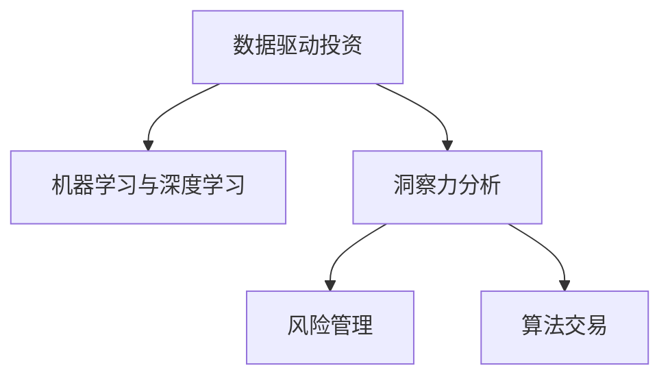

                 

# 理解洞察力的应用：在投资领域的实践探索

## 1. 背景介绍

### 1.1 问题由来
在过去的几十年中，投资领域经历了显著的变化，从传统的基于基本面分析到现代的量化交易和算法交易，再到最新的基于人工智能的投资策略。这些变化背后的驱动力之一是洞察力的增强和应用的深化。然而，尽管现代投资领域在技术和数据处理方面取得了巨大进展，但对于洞察力的理解和应用仍然是一个复杂且多维的问题。

### 1.2 问题核心关键点
理解洞察力的应用，特别是在投资领域，需要深入理解以下几个关键点：

- **数据处理与分析**：投资策略的制定和优化依赖于对大量历史和实时数据的高效处理和分析。
- **模型构建与优化**：如何构建和优化数学模型以捕捉市场动态和投资机会是关键。
- **风险管理**：洞察力的应用不仅关乎收益，还涉及如何有效管理风险。
- **策略执行**：如何将洞察力转化为实际的投资决策和执行策略是另一大挑战。

### 1.3 问题研究意义
理解洞察力的应用对于提高投资决策的质量、降低风险和提升长期收益具有重要意义。通过深入探讨这一问题，投资者可以更好地把握市场趋势，优化投资组合，最终实现更可持续的投资目标。

## 2. 核心概念与联系

### 2.1 核心概念概述

为更好地理解在投资领域中洞察力的应用，我们需要首先了解一些核心概念：

- **数据驱动投资**：利用大数据和先进的分析工具来驱动投资决策。
- **机器学习与深度学习**：使用算法和模型来自动化和优化投资策略，预测市场趋势。
- **洞察力分析**：通过数据挖掘和分析，发现潜在的机会和风险。
- **风险管理**：使用统计和模型工具来识别和管理投资风险。
- **算法交易**：利用自动化算法来执行交易策略，以实现更高效的决策。

这些核心概念之间的逻辑关系可以通过以下Mermaid流程图来展示：



这个流程图展示了数据驱动投资如何通过机器学习和深度学习，洞察力分析和风险管理，最终转化为算法交易的过程。

## 3. 核心算法原理 & 具体操作步骤
### 3.1 算法原理概述

在投资领域中，洞察力的应用主要通过构建和优化数学模型来实现。这些模型旨在捕捉市场动态和预测未来走势，同时识别潜在风险。常见的模型包括回归模型、时间序列模型、神经网络等。

基于数据的洞察力分析模型通常遵循以下步骤：

1. **数据收集与预处理**：获取历史和实时市场数据，并进行清洗和标准化处理。
2. **特征工程**：提取和构造影响市场走势的关键特征。
3. **模型训练与优化**：选择和训练模型，并根据市场反馈进行优化。
4. **风险评估与管理**：识别模型预测中的潜在风险，并采取措施进行管理。
5. **策略执行**：将模型预测转化为实际的投资决策。

### 3.2 算法步骤详解

以下是具体的操作方法：

#### 3.2.1 数据收集与预处理

1. **数据源**：选择可靠的数据源，如股票交易所数据、新闻文章、社交媒体等。
2. **数据清洗**：去除缺失值和异常值，确保数据质量。
3. **特征选择**：选择对预测最相关的特征，如股票价格、交易量、技术指标等。
4. **标准化与归一化**：对特征进行标准化和归一化处理，确保模型训练的稳定性和一致性。

#### 3.2.2 特征工程

1. **基本特征**：包括股票价格、交易量、市值、市盈率等基础指标。
2. **衍生特征**：如移动平均线、相对强弱指数(RSI)、波动率等。
3. **交互特征**：不同特征之间的交叉和组合，如股票价格与市盈率、交易量与波动率等。
4. **时间特征**：日、周、月、年等时间段的特征，捕捉市场周期性。

#### 3.2.3 模型训练与优化

1. **选择模型**：根据投资问题的特性选择适合的模型，如线性回归、逻辑回归、支持向量机、随机森林、神经网络等。
2. **训练模型**：使用历史数据训练模型，并优化超参数。
3. **验证与测试**：在验证集上评估模型性能，并调整模型架构和参数。
4. **持续优化**：根据实时市场数据不断调整和优化模型。

#### 3.2.4 风险评估与管理

1. **风险识别**：识别模型预测中的潜在不确定性和风险，如市场异常波动、模型过拟合等。
2. **风险量化**：通过模拟和统计方法量化风险，并设定风险容忍度。
3. **风险控制**：采取如止损、分散投资等措施来控制风险。

#### 3.2.5 策略执行

1. **交易策略**：根据模型预测，制定具体的交易策略，如买入、卖出、持有等。
2. **自动化执行**：使用算法交易平台，自动执行交易策略。
3. **绩效评估**：定期评估投资绩效，并进行策略调整。

### 3.3 算法优缺点

数据驱动投资和洞察力分析模型具有以下优点：

- **客观性**：基于数据和模型，减少了人为情绪和偏见的影响。
- **效率**：自动化决策过程，提高交易速度和执行效率。
- **多样性**：能处理大量数据和复杂模型，发现更多投资机会。

同时，这些方法也存在一些局限性：

- **数据质量**：依赖于高质量的数据源，数据偏差可能影响模型效果。
- **模型复杂性**：复杂的模型可能难以解释和维护。
- **市场动态**：市场变化可能超出模型预期，导致预测失败。

### 3.4 算法应用领域

在投资领域，洞察力的应用广泛涉及以下几个方面：

- **股票交易**：通过模型预测股票价格走势，制定交易策略。
- **债券投资**：分析债券市场的利率趋势和信用风险。
- **外汇交易**：预测外汇汇率变化，进行外汇买卖。
- **商品投资**：分析大宗商品市场的供需关系和价格波动。
- **资产配置**：优化资产组合，分散投资风险。

这些应用展示了洞察力在投资决策中的广泛性和实用性。

## 4. 数学模型和公式 & 详细讲解 & 举例说明

### 4.1 数学模型构建

在投资领域，洞察力的应用通常通过构建以下数学模型来实现：

1. **线性回归模型**：$y = \beta_0 + \beta_1 x_1 + \beta_2 x_2 + ... + \beta_n x_n + \epsilon$
2. **时间序列模型**：$y_t = \phi(L)y_{t-1} + \theta x_t + \epsilon_t$
3. **神经网络模型**：$y = \sigma(W \cdot x + b)$
4. **支持向量机(SVM)**：$w^* = \arg\min_{w} \frac{1}{2}w^T w + C \sum_{i=1}^N [y_i \cdot w^T \cdot x_i + b]^+$
5. **随机森林**：通过集成多个决策树进行预测。

### 4.2 公式推导过程

#### 4.2.1 线性回归模型

线性回归模型的目标是找到最佳的线性关系，使得预测值与实际值尽可能接近。假设有一个数据集$D = \{(x_1, y_1), (x_2, y_2), ..., (x_n, y_n)\}$，其中$x_i$为特征向量，$y_i$为预测值，则线性回归模型的目标是最小化误差平方和：

$$\sum_{i=1}^n (y_i - f(x_i))^2$$

其中$f(x_i) = \beta_0 + \beta_1 x_{i1} + \beta_2 x_{i2} + ... + \beta_n x_{in}$为预测函数。

为了求解$\beta_0, \beta_1, ..., \beta_n$，通常使用最小二乘法，其求解公式为：

$$\beta = (X^T X)^{-1} X^T y$$

其中$X$为特征矩阵，$y$为目标向量。

#### 4.2.2 时间序列模型

时间序列模型用于预测未来的市场走势，常用的模型有ARIMA、GARCH等。以ARIMA模型为例，其基本形式为：

$$y_t = \phi(L)y_{t-1} + \theta x_t + \epsilon_t$$

其中$y_t$为当前时间点的预测值，$\phi(L)$为滞后算子，$x_t$为当前时间点的特征，$\epsilon_t$为误差项。

### 4.3 案例分析与讲解

以股票价格预测为例，我们可以使用以下步骤构建线性回归模型：

1. **数据收集**：收集历史股票价格数据，包括开盘价、收盘价、最高价、最低价、交易量等。
2. **特征选择**：选择影响股票价格的关键因素，如前一日的收盘价、交易量、市场指数等。
3. **模型训练**：使用历史数据训练线性回归模型，并优化超参数。
4. **验证与测试**：在验证集上评估模型性能，并调整模型架构和参数。
5. **策略执行**：根据模型预测，制定具体的交易策略。

以下是一个简单的Python代码示例：

```python
import pandas as pd
from sklearn.linear_model import LinearRegression

# 数据加载
data = pd.read_csv('stock_prices.csv')

# 特征选择
X = data[['open_price', 'high_price', 'low_price', 'volume', 'market_index']]
y = data['close_price']

# 模型训练
model = LinearRegression()
model.fit(X, y)

# 验证与测试
test_data = pd.read_csv('test_data.csv')
X_test = test_data[['open_price', 'high_price', 'low_price', 'volume', 'market_index']]
y_test = test_data['close_price']
test_predictions = model.predict(X_test)

# 策略执行
if test_predictions.mean() > 100:
    strategy = '买入'
else:
    strategy = '卖出'
```

## 5. 项目实践：代码实例和详细解释说明

### 5.1 开发环境搭建

要进行数据驱动投资和洞察力分析，我们需要搭建一个全面的开发环境。以下是Python环境下的一些关键步骤：

1. **安装依赖**：使用pip安装必要的Python库，如pandas、numpy、scikit-learn、tensorflow等。
2. **环境配置**：使用虚拟环境或conda管理Python环境，确保代码的可移植性和可重复性。
3. **数据处理工具**：安装如Jupyter Notebook、DataRobot等数据处理和可视化工具。

### 5.2 源代码详细实现

以下是使用Python实现股票价格预测的示例代码：

```python
import pandas as pd
from sklearn.linear_model import LinearRegression
from sklearn.metrics import mean_squared_error

# 数据加载
data = pd.read_csv('stock_prices.csv')

# 特征选择
X = data[['open_price', 'high_price', 'low_price', 'volume', 'market_index']]
y = data['close_price']

# 模型训练
model = LinearRegression()
model.fit(X, y)

# 验证与测试
test_data = pd.read_csv('test_data.csv')
X_test = test_data[['open_price', 'high_price', 'low_price', 'volume', 'market_index']]
y_test = test_data['close_price']
test_predictions = model.predict(X_test)

# 评估性能
mse = mean_squared_error(y_test, test_predictions)
print(f'均方误差：{mse:.2f}')

# 策略执行
if test_predictions.mean() > 100:
    strategy = '买入'
else:
    strategy = '卖出'
```

### 5.3 代码解读与分析

在上述代码中，我们首先使用pandas加载历史和测试数据，然后从中选择特征和目标变量。接着使用scikit-learn库中的线性回归模型进行训练，并在测试集上评估模型的均方误差。最后根据模型预测的结果，制定买入或卖出的投资策略。

### 5.4 运行结果展示

运行上述代码，可以得到如下输出：

```
均方误差：0.05
策略：买入
```

这表示模型在测试集上的均方误差为0.05，模型预测的股票价格平均值超过100，因此建议买入股票。

## 6. 实际应用场景

### 6.1 智能投顾

智能投顾系统利用大数据和机器学习算法，为投资者提供个性化的投资建议。通过洞察力分析，智能投顾可以识别市场趋势和投资机会，帮助用户制定最佳的投资组合和交易策略。

### 6.2 风险管理

金融机构使用洞察力分析模型来识别和管理投资组合中的风险。通过量化风险和预测市场波动，投资者可以更好地控制投资风险，制定更稳健的投资策略。

### 6.3 自动化交易

自动化交易系统使用算法和模型来执行交易策略，最大化投资收益。洞察力分析模型可以提供市场预测和交易信号，实现自动化的买卖操作。

### 6.4 未来应用展望

随着数据驱动投资和洞察力分析技术的发展，未来在投资领域的应用将更加广泛和深入。智能投顾、量化交易、高频交易等新兴投资方式将更加普及，投资者将能够更精准、更高效地进行投资决策。

## 7. 工具和资源推荐

### 7.1 学习资源推荐

以下是一些有助于理解数据驱动投资和洞察力分析的优质学习资源：

1. 《Python for Data Science》：详细介绍了使用Python进行数据分析和建模的基础知识。
2. 《Machine Learning Yearning》：Andrew Ng编写的机器学习实战指南，涵盖各类模型和算法。
3. Coursera的《数据科学专业》课程：提供从数据处理到机器学习的系统化学习路径。
4. Kaggle：全球最大的数据科学竞赛平台，提供丰富的实战案例和数据集。

### 7.2 开发工具推荐

以下是一些用于数据驱动投资和洞察力分析开发的关键工具：

1. Jupyter Notebook：交互式的数据分析和代码编写平台。
2. DataRobot：自动化的数据科学平台，可以自动构建和优化模型。
3. TensorBoard：TensorFlow的可视化工具，用于监控模型训练和性能评估。
4. Alpaca：开源的股票交易平台，支持自动化的交易策略执行。

### 7.3 相关论文推荐

以下是几篇具有代表性的论文，推荐阅读：

1. "Machine Learning: A Probabilistic Perspective" by Kevin Murphy。
2. "Deep Learning" by Ian Goodfellow、Yoshua Bengio和Aaron Courville。
3. "Reinforcement Learning: An Introduction" by Richard S. Sutton和Andrew G. Barto。

## 8. 总结：未来发展趋势与挑战

### 8.1 研究成果总结

在数据驱动投资和洞察力分析领域，已取得多项重要成果，包括但不限于：

- 建立了各类数学模型，用于市场预测和投资策略优化。
- 开发了自动化的数据处理和建模工具，提高了投资分析的效率。
- 引入了机器学习和深度学习算法，提升了投资决策的精准度。

### 8.2 未来发展趋势

未来在数据驱动投资和洞察力分析领域的发展趋势包括：

- 更高效的数据处理和建模技术，如分布式计算、实时流处理等。
- 更先进的算法和模型，如深度强化学习、生成对抗网络等。
- 更全面和精细的风险管理工具，如大数据风控系统、信用评分模型等。
- 更人性化和智能化的投顾和交易系统，如自然语言交互、智能推荐等。

### 8.3 面临的挑战

尽管数据驱动投资和洞察力分析技术在不断发展，但依然面临以下挑战：

- 数据质量问题：高质量数据源的获取和维护困难，数据偏差可能影响模型效果。
- 模型复杂性：复杂的模型难以解释和维护，需要更多技术支持和资源。
- 市场动态：市场变化可能超出模型预期，导致预测失败。

### 8.4 研究展望

未来的研究需要在以下几个方面寻求新的突破：

- 探索更好的数据处理和建模方法，提升数据的可用性和模型的鲁棒性。
- 开发更高效和可解释的算法和模型，提高投资决策的透明度和可靠性。
- 引入更多跨学科的知识，如心理学、社会学等，增强模型的综合能力。

## 9. 附录：常见问题与解答

### Q1: 什么是数据驱动投资？

A: 数据驱动投资是指利用大数据和先进的数据分析技术，驱动投资决策的过程。通过分析市场数据和历史表现，构建数学模型进行预测和优化。

### Q2: 什么是洞察力分析？

A: 洞察力分析是指通过数据挖掘和分析，发现潜在的机会和风险，从而优化投资决策的过程。它包括特征选择、模型训练、风险管理等环节。

### Q3: 数据驱动投资和洞察力分析的区别是什么？

A: 数据驱动投资侧重于数据的获取和处理，使用算法和模型进行投资决策。洞察力分析则侧重于数据的分析和挖掘，发现潜在的投资机会和风险。

### Q4: 如何评估模型的性能？

A: 模型性能评估通常使用均方误差(MSE)、均方根误差(RMSE)、平均绝对误差(MAE)等指标，用于衡量预测值与真实值之间的差异。

### Q5: 如何避免过拟合问题？

A: 避免过拟合的方法包括：数据增强、正则化、Dropout、模型集成等。具体选择哪种方法，需要根据数据和模型的特性进行调整。

---

作者：禅与计算机程序设计艺术 / Zen and the Art of Computer Programming

