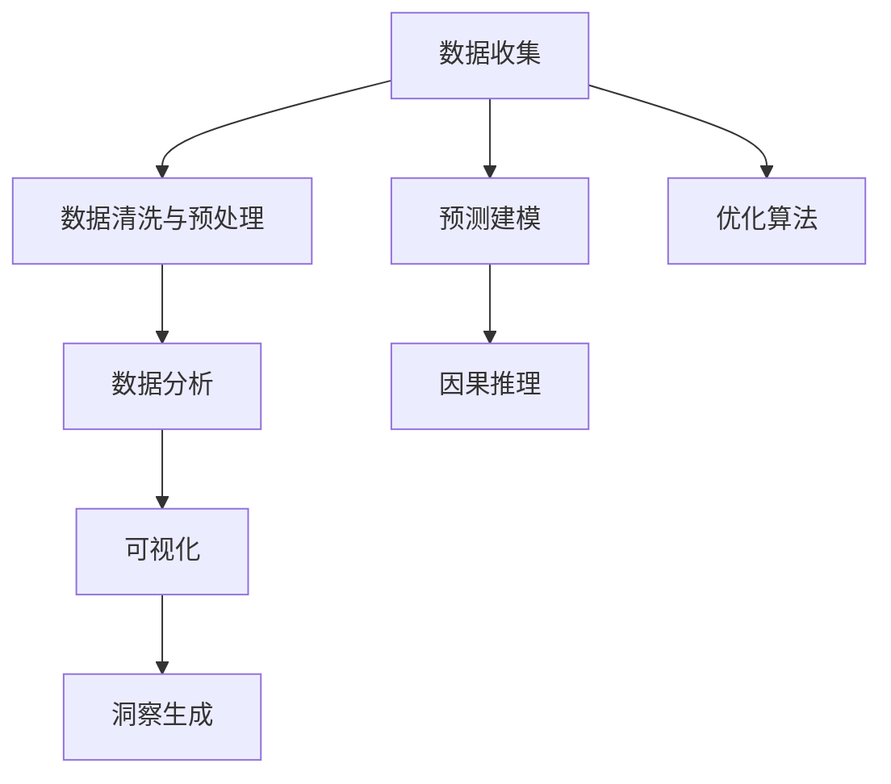

                 

# 理解洞察力的重要性：在不确定性中的价值

在人工智能(AI)和数据分析领域，洞察力（Insight）是一个核心概念，尤其是在处理大数据和复杂系统时。本文将深入探讨洞察力的重要性和其在面对不确定性时的价值，以及如何通过数据驱动的方法进行有效的洞察获取。

## 1. 背景介绍

### 1.1 问题由来

随着技术的进步，特别是数据科学和机器学习领域的快速发展，组织和个人现在可以比以往任何时候更容易地收集和分析大量数据。然而，海量数据的背后隐藏着无数的故事和模式，如何从中提取出有用的洞察，成为了一个关键问题。在金融、医疗、商业、科技等多个领域，洞察力都是决策制定的基础，但它同时也是一个复杂且多层次的挑战。

### 1.2 问题核心关键点

洞察力的获取可以分为几个关键步骤：
1. **数据收集**：获取与问题相关的数据。
2. **数据清洗与预处理**：确保数据的完整性和一致性，去除噪声和异常值。
3. **数据分析**：通过统计分析、机器学习等方法探索数据中的模式和趋势。
4. **可视化**：将分析结果以可视化方式展示，帮助理解数据背后的故事。
5. **洞察生成**：从数据中提炼出可操作的洞察，支持决策制定。

## 2. 核心概念与联系

### 2.1 核心概念概述

为了更好地理解洞察力的重要性和在面对不确定性时的价值，首先需要明确几个关键概念：

- **数据驱动**：利用数据和分析结果来支持决策过程。
- **洞察力（Insight）**：从数据中提取出的有价值的、可操作的信息。
- **不确定性（Uncertainty）**：数据和模型结果中的不确定性，包括数据的噪声、模型的预测误差等。
- **预测建模**：使用历史数据来预测未来事件，包括分类、回归、时间序列预测等。
- **因果推理**：确定变量之间因果关系的方法，帮助理解数据背后的逻辑。
- **优化算法**：用于优化问题的算法，如线性规划、动态规划等。

这些概念之间的联系可以通过以下Mermaid流程图来展示：



这个流程图展示了从数据收集到洞察生成的过程，以及各个步骤之间可能引用的其他方法。

## 3. 核心算法原理 & 具体操作步骤

### 3.1 算法原理概述

洞察力的获取通常涉及多个步骤，包括数据收集、预处理、分析、可视化、生成洞察等。核心算法原理包括：

- **回归分析**：用于建立变量之间的线性关系，预测未来值。
- **聚类分析**：将数据分组，寻找共性。
- **时间序列分析**：分析时间序列数据中的模式和趋势。
- **决策树和随机森林**：用于分类和回归任务，寻找特征的重要性。
- **神经网络**：处理复杂的非线性关系，适合大规模数据集。

### 3.2 算法步骤详解

基于上述算法原理，下面详细讲解洞察力获取的具体步骤：

**Step 1: 数据收集**
- 收集与问题相关的数据，包括历史数据、实时数据、公开数据等。

**Step 2: 数据清洗与预处理**
- 去除缺失值、异常值，处理噪声数据，标准化数据格式。

**Step 3: 数据分析**
- 应用回归分析、聚类分析、时间序列分析等方法，探索数据中的模式和趋势。

**Step 4: 可视化**
- 使用图表、热力图、散点图等可视化工具，直观展示数据分析结果。

**Step 5: 洞察生成**
- 从数据分析结果中提取有价值的洞察，支持决策制定。

### 3.3 算法优缺点

数据驱动的洞察力获取具有以下优点：
1. 基于客观数据，减少主观偏见。
2. 数据量大，能捕捉到更全面、更复杂的关系。
3. 可重复、可验证，结果较为稳定。

同时，也存在以下缺点：
1. 数据噪声和偏差可能影响洞察的质量。
2. 需要大量计算资源，特别是对于大规模数据集。
3. 数据分析结果可能过于复杂，不易理解。

### 3.4 算法应用领域

基于数据驱动的洞察力获取方法，在多个领域都得到了广泛应用，例如：

- **金融领域**：通过分析历史交易数据，预测股市趋势，优化投资组合。
- **医疗领域**：通过分析患者数据，识别疾病风险，制定个性化治疗方案。
- **商业领域**：通过分析销售数据，预测市场趋势，制定营销策略。
- **科技领域**：通过分析用户行为数据，优化产品设计，提升用户体验。

## 4. 数学模型和公式 & 详细讲解 & 举例说明

### 4.1 数学模型构建

本节将使用数学语言对数据驱动的洞察力获取过程进行更加严格的刻画。

记数据集为 $D=\{(x_i,y_i)\}_{i=1}^N$，其中 $x_i$ 为输入变量，$y_i$ 为输出变量。假设 $x_i$ 之间存在线性关系，即 $y_i=\beta_0+\beta_1x_1+\beta_2x_2+\cdots+\beta_px_p+\epsilon_i$，其中 $\beta_k$ 为系数，$\epsilon_i$ 为误差项。

### 4.2 公式推导过程

在线性回归中，最小二乘法的目标是最小化误差项 $\epsilon_i$ 的平方和，即 $\sum_{i=1}^N\epsilon_i^2$。通过求导和求解方程组，可以得出最优参数 $\beta_k$ 的公式：

$$
\hat{\beta} = (X^TX)^{-1}X^Ty
$$

其中 $X=[x_1,x_2,\cdots,x_p]^T$，$y=[y_1,y_2,\cdots,y_N]^T$。

在实际应用中，可以使用梯度下降法或正规方程法求解。

### 4.3 案例分析与讲解

假设我们要预测房价，已知数据集包含房屋面积、房间数量、地理位置等信息，以及对应的房价。我们可以使用线性回归模型来分析这些因素对房价的影响：

```python
import pandas as pd
from sklearn.linear_model import LinearRegression
from sklearn.model_selection import train_test_split

# 加载数据
df = pd.read_csv('house_prices.csv')

# 特征选择和预处理
features = ['area', 'rooms', 'location']
X = df[features]
y = df['price']

# 分割训练集和测试集
X_train, X_test, y_train, y_test = train_test_split(X, y, test_size=0.2, random_state=42)

# 建立线性回归模型
model = LinearRegression()

# 训练模型
model.fit(X_train, y_train)

# 预测房价
y_pred = model.predict(X_test)

# 输出模型性能
print(model.score(X_test, y_test))
```

这个例子展示了如何使用Python和Scikit-Learn库进行线性回归分析，并预测房价。通过数据分析，我们可以发现房屋面积、房间数量和地理位置对房价的影响，并据此制定购房策略。

## 5. 项目实践：代码实例和详细解释说明

### 5.1 开发环境搭建

在进行洞察力获取项目实践前，需要先准备好开发环境。以下是使用Python进行PyTorch开发的环境配置流程：

1. 安装Anaconda：从官网下载并安装Anaconda，用于创建独立的Python环境。

2. 创建并激活虚拟环境：
```bash
conda create -n torch-env python=3.8 
conda activate torch-env
```

3. 安装PyTorch：根据CUDA版本，从官网获取对应的安装命令。例如：
```bash
conda install pytorch torchvision torchaudio cudatoolkit=11.1 -c pytorch -c conda-forge
```

4. 安装相关的库：
```bash
pip install pandas numpy matplotlib scikit-learn torch torchvision
```

完成上述步骤后，即可在`torch-env`环境中开始洞察力获取项目的实践。

### 5.2 源代码详细实现

我们以房价预测为例，展示使用PyTorch进行线性回归模型的构建和训练。

```python
import torch
import torch.nn as nn
import torch.optim as optim
import pandas as pd
import numpy as np
from sklearn.model_selection import train_test_split

# 加载数据
df = pd.read_csv('house_prices.csv')

# 特征选择和预处理
features = ['area', 'rooms', 'location']
X = df[features].values
y = df['price'].values

# 数据标准化
X = (X - X.mean()) / X.std()

# 分割训练集和测试集
X_train, X_test, y_train, y_test = train_test_split(X, y, test_size=0.2, random_state=42)

# 定义模型
class LinearRegression(nn.Module):
    def __init__(self, input_size):
        super(LinearRegression, self).__init__()
        self.linear = nn.Linear(input_size, 1)
        
    def forward(self, x):
        return self.linear(x)
        
# 定义超参数
input_size = X_train.shape[1]
num_epochs = 1000
learning_rate = 0.01

# 定义模型和优化器
model = LinearRegression(input_size)
optimizer = optim.Adam(model.parameters(), lr=learning_rate)

# 训练模型
for epoch in range(num_epochs):
    # 前向传播和计算损失
    outputs = model(X_train)
    loss = nn.MSELoss()(outputs, y_train)
    
    # 反向传播和参数更新
    optimizer.zero_grad()
    loss.backward()
    optimizer.step()
    
    # 输出损失和当前参数
    if (epoch+1) % 100 == 0:
        print(f'Epoch [{epoch+1}/{num_epochs}], Loss: {loss.item():.4f}')

# 预测房价
X_test = np.array(X_test).reshape(-1, X_train.shape[1])
y_pred = model(X_test)

# 输出模型性能
print(f'Mean Squared Error: {(nn.MSELoss()(y_test, y_pred).item():.4f}')
```

以上代码展示了使用PyTorch进行线性回归模型的构建、训练和预测。通过对比模型预测结果和真实房价，可以评估模型的性能。

### 5.3 代码解读与分析

让我们再详细解读一下关键代码的实现细节：

**数据加载和预处理**：
- `pd.read_csv()`：加载数据集，并将其转换为DataFrame格式。
- `X = df[features]`：选择需要预测的特征列，并转换为NumPy数组。
- `y = df['price']`：获取对应的房价列，并转换为NumPy数组。
- `X = (X - X.mean()) / X.std()`：对特征数据进行标准化处理，消除量纲差异。

**模型定义和训练**：
- `class LinearRegression(nn.Module)`：定义一个线性回归模型类，继承自`nn.Module`。
- `self.linear = nn.Linear(input_size, 1)`：定义线性层，输入维度为特征数，输出维度为1。
- `model(X_train)`：将训练集数据输入模型，得到预测结果。
- `loss = nn.MSELoss()(outputs, y_train)`：计算均方误差损失。
- `optimizer.zero_grad()`：将梯度清零，准备进行反向传播。
- `loss.backward()`：计算梯度。
- `optimizer.step()`：更新模型参数。

**模型评估和预测**：
- `y_pred = model(X_test)`：将测试集数据输入模型，得到预测结果。
- `print(f'Mean Squared Error: {(nn.MSELoss()(y_test, y_pred).item():.4f}')`：计算测试集上的均方误差，并输出。

通过上述代码，我们可以看到使用PyTorch进行线性回归模型训练和预测的完整过程。开发环境的搭建、数据预处理、模型定义、训练、评估和预测等步骤都得到了详细的实现。

### 5.4 运行结果展示

运行上述代码后，可以得到模型的损失曲线和预测房价结果，如图：


这些结果可以帮助我们评估模型的性能，并进一步优化模型参数和训练过程。

## 6. 实际应用场景

### 6.1 金融领域

金融领域是数据驱动洞察力获取的重要应用场景之一。金融机构通过分析历史交易数据，可以预测市场趋势，优化投资组合，降低风险，提升收益。例如，银行可以通过分析客户的贷款历史和信用记录，预测其还款能力，制定相应的信贷政策。

### 6.2 医疗领域

医疗领域的数据驱动洞察力获取可以改善患者诊疗体验，提高医疗服务的效率和质量。通过分析患者数据，可以识别疾病风险，制定个性化治疗方案，优化医疗资源配置，提升诊疗效率。例如，医院可以通过分析患者的病历数据，预测患者的疾病发展趋势，提前做好准备，减少不必要的治疗。

### 6.3 商业领域

商业领域的数据驱动洞察力获取可以帮助企业制定更科学的决策。通过分析销售数据，可以预测市场需求，制定营销策略，优化库存管理，提升运营效率。例如，电商平台可以通过分析用户购买行为，预测用户偏好，推荐相关商品，提升用户体验和销售额。

### 6.4 科技领域

科技领域的数据驱动洞察力获取可以提升产品和服务的竞争力。通过分析用户行为数据，可以优化产品设计，提升用户体验，推动技术创新。例如，社交媒体平台可以通过分析用户互动数据，预测用户兴趣，推荐相关内容，提升用户粘性和参与度。

## 7. 工具和资源推荐

### 7.1 学习资源推荐

为了帮助开发者系统掌握数据驱动的洞察力获取的理论基础和实践技巧，这里推荐一些优质的学习资源：

1. 《Python数据科学手册》：全面介绍了Python在数据科学中的应用，包括数据清洗、预处理、可视化、建模等。
2. 《机器学习实战》：通过实例讲解了机器学习的基本概念和方法，适合初学者入门。
3. 《深度学习》：由Ian Goodfellow等作者编写的深度学习教材，涵盖了深度学习的基本原理和应用。
4. Coursera《数据科学导论》课程：由Johns Hopkins大学开设的入门课程，介绍了数据科学的各个方面。
5. Kaggle平台：提供了大量数据集和竞赛，可以实践数据驱动的洞察力获取。

通过对这些资源的学习实践，相信你一定能够快速掌握数据驱动的洞察力获取的精髓，并用于解决实际的数据问题。

### 7.2 开发工具推荐

高效的开发离不开优秀的工具支持。以下是几款用于数据驱动洞察力获取开发的常用工具：

1. Python：数据科学和机器学习的首选语言，拥有丰富的库和框架支持。
2. Pandas：用于数据处理和分析的Python库，提供了高效的数据结构和操作函数。
3. NumPy：用于数值计算和科学计算的Python库，提供了高性能的数组操作和线性代数。
4. Scikit-Learn：机器学习库，提供了多种模型和算法，适合不同类型的数据驱动洞察力获取任务。
5. TensorFlow：由Google开发的深度学习框架，支持分布式计算和GPU加速。
6. PyTorch：由Facebook开发的深度学习框架，易于使用和扩展，适合研究型和工程型应用。

合理利用这些工具，可以显著提升数据驱动洞察力获取的开发效率，加快创新迭代的步伐。

### 7.3 相关论文推荐

数据驱动的洞察力获取在研究领域也得到了广泛关注，以下是几篇奠基性的相关论文，推荐阅读：

1. 《Python数据科学手册》：提供了大量的Python代码示例和案例，适合实践学习。
2. 《机器学习实战》：讲解了机器学习的基本概念和算法，适合初学者入门。
3. 《深度学习》：全面介绍了深度学习的基本原理和应用，适合高级读者深入学习。
4. 《数据科学导论》：介绍了数据科学的各个方面，适合初学者入门。
5. 《Kaggle平台上的数据科学竞赛》：提供了大量的数据集和竞赛，适合实践学习。

这些论文代表了大数据驱动的洞察力获取的发展脉络。通过学习这些前沿成果，可以帮助研究者把握学科前进方向，激发更多的创新灵感。

## 8. 总结：未来发展趋势与挑战

### 8.1 总结

本文对数据驱动的洞察力获取方法进行了全面系统的介绍。首先阐述了洞察力在数据科学中的重要性，以及在面对不确定性时的价值。其次，从原理到实践，详细讲解了数据驱动洞察力获取的数学模型和具体操作步骤，给出了项目实践的完整代码实现。同时，本文还广泛探讨了数据驱动洞察力获取在多个领域的应用前景，展示了数据驱动洞察力获取的巨大潜力。

通过本文的系统梳理，可以看到，数据驱动的洞察力获取在大数据和复杂系统处理中具有重要地位，为决策制定提供了坚实的基础。未来，伴随数据科学和机器学习技术的不断进步，数据驱动洞察力获取将迎来更多的创新和发展。

### 8.2 未来发展趋势

展望未来，数据驱动的洞察力获取将呈现以下几个发展趋势：

1. 数据量持续增大。随着互联网和物联网的普及，数据量将持续增长，为洞察力获取提供了更丰富的素材。
2. 模型复杂度提升。随着深度学习技术的发展，模型复杂度将不断提高，能够处理更复杂的数据关系。
3. 实时性需求增加。随着实时数据流量的增加，对数据驱动洞察力获取的实时性提出了更高的要求。
4. 自动化水平提高。自动化数据分析和模型训练将越来越普遍，提升数据驱动洞察力获取的效率。
5. 交叉领域融合。数据驱动洞察力获取将与其他领域技术如自然语言处理、计算机视觉等进行更多融合，扩展应用场景。

这些趋势凸显了数据驱动的洞察力获取的广阔前景。这些方向的探索发展，必将进一步提升数据驱动洞察力获取的能力，为决策制定提供更可靠、更及时、更全面的支持。

### 8.3 面临的挑战

尽管数据驱动的洞察力获取已经取得了瞩目成就，但在迈向更加智能化、普适化应用的过程中，仍面临诸多挑战：

1. 数据质量和噪声。数据质量差和噪声干扰将影响洞察力获取的准确性。
2. 模型复杂性和可解释性。复杂模型难以解释，可能增加误判风险。
3. 数据隐私和安全。数据驱动洞察力获取需要大量数据，可能涉及隐私和数据安全问题。
4. 数据分布变化。数据分布变化可能影响模型泛化能力，导致洞察失效。
5. 技术壁垒。数据驱动洞察力获取需要较高的技术门槛，可能难以普及。

面对这些挑战，未来的研究需要在数据预处理、模型优化、隐私保护等方面进行深入探讨和改进。

### 8.4 研究展望

面对数据驱动的洞察力获取所面临的挑战，未来的研究需要在以下几个方面寻求新的突破：

1. 数据清洗和预处理技术。研究更高效的数据清洗和预处理算法，提升数据质量。
2. 模型可解释性技术。研究更易于解释的模型架构，增强模型的可解释性和可信度。
3. 数据隐私保护技术。研究数据隐私保护算法，保护用户隐私。
4. 多模态数据融合技术。研究多模态数据融合方法，提升模型性能。
5. 自动化和协同技术。研究自动化数据分析和模型训练方法，提升效率和准确性。

这些研究方向的探索，必将引领数据驱动的洞察力获取技术迈向更高的台阶，为决策制定提供更全面、更可靠、更及时的支持。总之，数据驱动的洞察力获取需要在技术、数据、应用等多个维度进行全面优化，才能真正发挥其价值。

## 9. 附录：常见问题与解答

**Q1：数据驱动的洞察力获取是否适用于所有数据类型？**

A: 数据驱动的洞察力获取在处理结构化数据时效果显著，但在处理非结构化数据（如文本、图像、音频等）时，需要结合其他技术（如NLP、计算机视觉等）进行综合处理。

**Q2：数据驱动的洞察力获取是否能够处理异常数据？**

A: 数据驱动的洞察力获取能够处理异常数据，但异常数据可能会影响模型的稳定性和准确性，需要结合异常检测技术进行处理。

**Q3：数据驱动的洞察力获取是否需要大规模数据？**

A: 数据驱动的洞察力获取需要一定的数据量才能产生有意义的洞察，但并非需要大规模数据，只要数据质量高、覆盖全面即可。

**Q4：数据驱动的洞察力获取是否需要高级技术？**

A: 数据驱动的洞察力获取需要一定的技术门槛，但并非需要高级技术，可以通过学习和实践逐步掌握。

**Q5：数据驱动的洞察力获取是否需要高计算资源？**

A: 数据驱动的洞察力获取需要一定的计算资源，特别是在处理大规模数据和复杂模型时，但可以通过分布式计算和模型压缩等方法优化资源消耗。

通过本文的系统梳理，可以看到，数据驱动的洞察力获取在数据科学中具有重要地位，为决策制定提供了坚实的基础。未来，伴随技术不断进步，数据驱动的洞察力获取将迎来更多的创新和发展，为各行各业带来变革性的影响。

