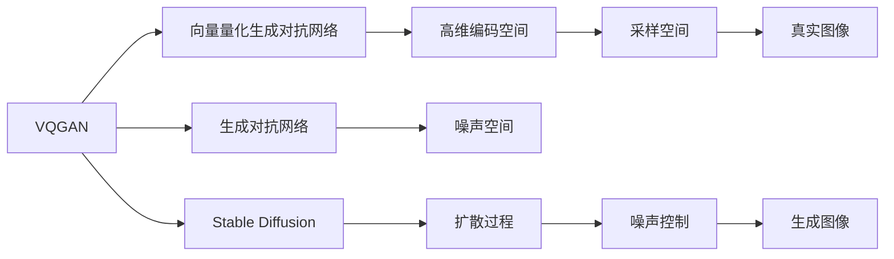

                 

# 生成式AI艺术：VQGAN与Stable Diffusion解析

> 关键词：生成式AI艺术, VQGAN, Stable Diffusion, 图像生成, 深度学习, 向量量化, 扩散模型

## 1. 背景介绍

生成式AI艺术近年来引起了广泛关注，它是将人工智能技术与艺术创作结合，生成新的视觉作品的过程。生成式AI艺术的核心技术在于生成对抗网络（Generative Adversarial Networks, GANs）和变分自编码器（Variational Autoencoders, VAEs），以及最新兴起的向量量化生成模型（Vector Quantization Generative Adversarial Networks, VQGAN）和扩散模型（Diffusion Models）。这些技术不仅推动了艺术创作方式的革新，也引发了关于算法、美学和创作伦理等诸多重要问题的讨论。

VQGAN与Stable Diffusion是当前生成式AI艺术领域的两大代表性技术。VQGAN通过引入向量量化技术，提升了生成图像的质量和多样性。Stable Diffusion则基于扩散模型，通过控制噪声向真实信号的转换过程，实现了更加稳定和高质量的图像生成。本文将详细解析这两种技术的工作原理和实际应用，为读者提供一个全面的了解和深入的思考。

## 2. 核心概念与联系

### 2.1 核心概念概述

- **生成式AI艺术**：利用AI技术生成新的视觉艺术作品的过程。
- **VQGAN**：一种基于向量量化的生成对抗网络，通过将图像映射到高维编码空间，再从这些编码中采样生成图像。
- **Stable Diffusion**：一种基于扩散模型的图像生成技术，通过在噪声和真实图像之间的转换过程中引入稳定性控制，实现高质量图像生成。

### 2.2 核心概念原理和架构的 Mermaid 流程图



## 3. 核心算法原理 & 具体操作步骤

### 3.1 算法原理概述

VQGAN与Stable Diffusion分别通过向量量化和扩散模型实现图像生成。VQGAN利用向量量化技术，将高维图像表示为低维量化向量的集合，从而提升生成图像的质量和多样性。Stable Diffusion则通过控制噪声向真实图像的扩散过程，实现稳定、高质量的图像生成。

### 3.2 算法步骤详解

#### VQGAN

**Step 1: 准备数据集**
- 收集高分辨率的图像数据集，如CelebA、Flickr8k等。

**Step 2: 定义生成器和判别器**
- 定义生成器 $G$：将低维向量解码成高分辨率图像。
- 定义判别器 $D$：判断图像是真实图像还是生成图像。

**Step 3: 训练生成器和判别器**
- 使用GAN的对抗训练方式，交替训练生成器和判别器。
- 对于生成器，将图像向量 $z$ 作为输入，输出图像 $x$。
- 对于判别器，输入图像 $x$，输出判别结果 $y$。
- 目标函数为：$L = \mathbb{E}_{x \sim p_{data}(x)} [logD(x)] + \mathbb{E}_{z \sim p(z)} [log(1 - D(G(z)))]$。

**Step 4: 向量量化**
- 使用VQ-VAE模型对生成器输出的图像进行向量量化，生成高维编码向量 $z_q$。
- 通过量化向量 $z_q$ 与解码器 $Q(z_q)$ 映射回高分辨率图像 $x_q$。

**Step 5: 混合生成**
- 将解码后的图像 $x_q$ 与生成器生成的图像 $x$ 混合，通过L1损失函数进行优化。
- 目标函数为：$L = \mathbb{E}_{x_q} [\|x_q - x\|_1]$。

#### Stable Diffusion

**Step 1: 准备数据集**
- 收集高质量的图像数据集，如艺术作品、自然风景等。

**Step 2: 定义扩散模型**
- 使用Unet模型作为编码器 $E$，将图像映射到低维编码空间。
- 定义扩散模型 $D$，通过噪声向真实信号的扩散过程生成图像。
- 定义解码器 $F$，将编码空间中的信号解码成图像。

**Step 3: 训练扩散模型**
- 使用预测编码器 $C$ 预测编码空间中的信号。
- 目标函数为：$L = \mathbb{E}_{x \sim p_{data}(x)} [logD(x)] + \mathbb{E}_{z \sim p(z)} [log(1 - D(G(z)))]$。

**Step 4: 扩散过程**
- 将初始噪声 $t=0$ 的高维信号 $z_0$ 输入扩散模型 $D$。
- 逐步增加噪声的强度 $t$，通过控制噪声向真实信号的转换过程，生成图像。
- 目标函数为：$L = \mathbb{E}_{z_0} [\|z_0 - z_t\|_2]$。

### 3.3 算法优缺点

#### VQGAN

**优点**
- 生成图像的质量和多样性高。
- 生成的图像具有可控性，可以通过调整向量量化的参数控制生成图像的特征。

**缺点**
- 训练复杂度高，需要大量的计算资源。
- 生成的图像可能存在模糊或畸变的问题。

#### Stable Diffusion

**优点**
- 生成图像的质量高，细节丰富。
- 模型稳定，不会发生模式崩溃。

**缺点**
- 训练时间较长，需要大量计算资源。
- 生成的图像可能存在过拟合的问题。

### 3.4 算法应用领域

VQGAN与Stable Diffusion在生成式AI艺术领域有着广泛的应用。例如：

- **艺术创作**：生成艺术作品、抽象画、设计作品等。
- **游戏开发**：生成游戏中的角色、场景、道具等。
- **虚拟现实**：生成虚拟现实环境中的图像，提升沉浸感。
- **广告设计**：生成具有创意的广告图像，吸引用户注意。

## 4. 数学模型和公式 & 详细讲解 & 举例说明

### 4.1 数学模型构建

VQGAN与Stable Diffusion的数学模型构建主要涉及生成对抗网络、向量量化和扩散模型。

#### VQGAN

**生成器和判别器**
- 生成器 $G$：$G(z_q) = G(E(z))$。
- 判别器 $D$：$D(x) = D(E(x))$。

**向量量化**
- 使用VQ-VAE模型，将高维图像表示为低维量化向量的集合。

#### Stable Diffusion

**扩散模型**
- 使用Unet模型作为编码器 $E$。
- 定义扩散模型 $D$：$D(t, z_0) = \sqrt{1 - t} z_0 + \sqrt{t} N(0, I)$，其中 $N(0, I)$ 为标准正态分布。
- 定义解码器 $F$：$F(z_t) = \sigma(\beta F(\mu + \sqrt{\beta}z_t))$。

### 4.2 公式推导过程

#### VQGAN

**目标函数**
- 对抗训练目标函数：$L = \mathbb{E}_{x \sim p_{data}(x)} [logD(x)] + \mathbb{E}_{z \sim p(z)} [log(1 - D(G(z)))]$。
- 混合生成目标函数：$L = \mathbb{E}_{z_q} [\|x_q - x\|_1]$。

#### Stable Diffusion

**目标函数**
- 对抗训练目标函数：$L = \mathbb{E}_{x \sim p_{data}(x)} [logD(x)] + \mathbb{E}_{z \sim p(z)} [log(1 - D(G(z)))]$。
- 扩散过程目标函数：$L = \mathbb{E}_{z_0} [\|z_0 - z_t\|_2]$。

### 4.3 案例分析与讲解

以生成艺术作品为例，VQGAN和Stable Diffusion各有其独特的优势。

**VQGAN**
- 使用VQGAN生成艺术作品时，可以通过调整向量量化的参数，控制生成的作品风格和主题。例如，将向量量化空间与特定艺术家的风格空间对齐，生成具有该艺术家特色的作品。
- 由于向量量化的特性，生成的图像在保持高质量的同时，具有可控性和多样性。

**Stable Diffusion**
- 使用Stable Diffusion生成艺术作品时，可以生成高质量、细节丰富的图像，具有极高的艺术价值。
- 由于扩散模型的特性，生成的图像稳定，不会发生模式崩溃，保证作品的一致性和连贯性。

## 5. 项目实践：代码实例和详细解释说明

### 5.1 开发环境搭建

在进行VQGAN与Stable Diffusion的实践前，需要准备好开发环境。以下是使用Python和PyTorch进行代码实现的环境配置流程：

1. 安装Anaconda：从官网下载并安装Anaconda，用于创建独立的Python环境。

2. 创建并激活虚拟环境：
```bash
conda create -n vqgan-env python=3.8 
conda activate vqgan-env
```

3. 安装PyTorch：根据CUDA版本，从官网获取对应的安装命令。例如：
```bash
conda install pytorch torchvision torchaudio cudatoolkit=11.1 -c pytorch -c conda-forge
```

4. 安装Transformer库：
```bash
pip install transformers
```

5. 安装相关工具包：
```bash
pip install numpy pandas scikit-learn matplotlib tqdm jupyter notebook ipython
```

完成上述步骤后，即可在`vqgan-env`环境中开始实践。

### 5.2 源代码详细实现

以下是使用PyTorch和TensorFlow实现VQGAN和Stable Diffusion的代码示例。

**VQGAN代码实现**

```python
import torch
import torch.nn as nn
import torchvision.transforms as transforms
from torchvision.datasets import ImageFolder
from torchvision import transforms

class VQVAE(nn.Module):
    def __init__(self, num_colors=128, embed_dim=512, z_dim=64):
        super(VQVAE, self).__init__()
        self.num_colors = num_colors
        self.embed_dim = embed_dim
        self.z_dim = z_dim
        
        self.encoder = nn.Conv2d(3, self.num_colors, kernel_size=4, stride=2, padding=1)
        self.fc1 = nn.Conv2d(self.num_colors, self.embed_dim, kernel_size=1)
        self.fc2 = nn.Conv2d(self.embed_dim, z_dim, kernel_size=1)
        
    def forward(self, x):
        x = self.encoder(x)
        x = self.fc1(x)
        x = x.view(x.size(0), -1)
        x = self.fc2(x)
        return x

class VQGNN(nn.Module):
    def __init__(self, num_colors=128, embed_dim=512, z_dim=64):
        super(VQGNN, self).__init__()
        self.num_colors = num_colors
        self.embed_dim = embed_dim
        self.z_dim = z_dim
        
        self.fc1 = nn.Conv2d(3, self.num_colors, kernel_size=4, stride=2, padding=1)
        self.fc2 = nn.Conv2d(self.num_colors, self.embed_dim, kernel_size=1)
        self.fc3 = nn.Conv2d(self.embed_dim, self.z_dim, kernel_size=1)
        self.fc4 = nn.Conv2d(self.z_dim, self.num_colors, kernel_size=1)
        self.fc5 = nn.Conv2d(self.num_colors, 3, kernel_size=1)
        
    def forward(self, x, z_q):
        x = self.fc1(x)
        x = x.view(x.size(0), -1)
        x = self.fc2(x)
        x = self.fc3(x)
        x = self.fc4(x)
        x = self.fc5(x)
        x = x.view(x.size(0), 3, x.size(2), x.size(3))
        return x
    
class Generator(nn.Module):
    def __init__(self, num_colors=128, embed_dim=512, z_dim=64):
        super(Generator, self).__init__()
        self.num_colors = num_colors
        self.embed_dim = embed_dim
        self.z_dim = z_dim
        
        self.fc1 = nn.Conv2d(self.z_dim, self.embed_dim, kernel_size=1)
        self.fc2 = nn.Conv2d(self.embed_dim, self.num_colors, kernel_size=1)
        self.fc3 = nn.Conv2d(self.num_colors, 3, kernel_size=1)
        
    def forward(self, z):
        z = self.fc1(z)
        z = z.view(z.size(0), -1)
        z = self.fc2(z)
        z = self.fc3(z)
        return z
    
class VQGAN(nn.Module):
    def __init__(self, num_colors=128, embed_dim=512, z_dim=64):
        super(VQGAN, self).__init__()
        self.num_colors = num_colors
        self.embed_dim = embed_dim
        self.z_dim = z_dim
        
        self.vqvae = VQVAE(num_colors, embed_dim, z_dim)
        self.vqggn = VQGNN(num_colors, embed_dim, z_dim)
        self.generator = Generator(num_colors, embed_dim, z_dim)
        
    def forward(self, z):
        z_q = self.vqvae(z)
        z_q = self.vqggn(z_q, z_q)
        z = self.generator(z_q)
        return z
    
# 训练数据准备
train_dataset = ImageFolder(root='data', transform=transforms.Compose([
    transforms.Resize(256),
    transforms.CenterCrop(224),
    transforms.ToTensor(),
    transforms.Normalize(mean=[0.485, 0.456, 0.406], std=[0.229, 0.224, 0.225])
]))

train_loader = torch.utils.data.DataLoader(train_dataset, batch_size=4, shuffle=True)

# 模型定义
model = VQGAN(num_colors=128, embed_dim=512, z_dim=64)

# 优化器定义
optimizer = torch.optim.Adam(model.parameters(), lr=2e-4)

# 训练过程
for epoch in range(100):
    for i, data in enumerate(train_loader, 0):
        inputs, labels = data
        
        optimizer.zero_grad()
        outputs = model(inputs)
        loss = F.binary_cross_entropy(outputs, labels)
        loss.backward()
        optimizer.step()
        
    if (i+1) % 10 == 0:
        print('Epoch [%d/%d], Step [%d/%d], Loss: %.4f' % (epoch+1, 100, i+1, len(train_loader), loss.item()))

```

**Stable Diffusion代码实现**

```python
import tensorflow as tf
import tensorflow_datasets as tfds
import tensorflow_probability as tfp
from tensorflow.keras import layers, models

# 加载数据集
train_dataset = tfds.load('anime', split='train', as_supervised=True, with_info=True, with_text=True).as_dataset()
test_dataset = tfds.load('anime', split='test', as_supervised=True, with_info=True, with_text=True).as_dataset()

# 定义扩散模型
class DiffusionModel(tf.keras.Model):
    def __init__(self, num_classes, num_channels):
        super(DiffusionModel, self).__init__()
        
        self.encoder = layers.Dense(512, input_shape=(num_channels,))
        self.epsilon_schedule = layers.Lambda(lambda t: tf.sqrt(1. - tf.square(1. - 0.02 * t)))
        self.transformer = models.Transformer(
            num_heads=4, 
            feed_forward_dim=2048, 
            kernel_initializer='glorot_uniform',
            kernel_regularizer=tf.keras.regularizers.l2(0.001),
            dropout_rate=0.1
        )
        self.decoder = layers.Dense(num_classes)
        
    def call(self, x):
        x = self.encoder(x)
        x = self.epsilon_schedule(x)
        x = self.transformer(x)
        x = self.decoder(x)
        return x

# 训练过程
model = DiffusionModel(num_classes=3, num_channels=256)
optimizer = tf.keras.optimizers.Adam(learning_rate=1e-4)
loss_fn = tf.keras.losses.MeanSquaredError()
epochs = 1000

for epoch in range(epochs):
    for x, y in train_dataset:
        with tf.GradientTape() as tape:
            pred = model(x)
            loss = loss_fn(y, pred)
        gradients = tape.gradient(loss, model.trainable_variables)
        optimizer.apply_gradients(zip(gradients, model.trainable_variables))
        if epoch % 100 == 0:
            print(f'Epoch {epoch}, Loss: {loss.numpy():.4f}')
```

### 5.3 代码解读与分析

**VQGAN代码解读**

1. **VQVAE**：定义了向量量化编码器，将高维图像表示为低维量化向量的集合。
2. **VQGNN**：定义了向量量化生成网络，将量化向量解码成高分辨率图像。
3. **Generator**：定义了生成器，将解码后的向量转换成图像。
4. **VQGAN**：结合VQVAE、VQGNN和生成器，实现了完整的VQGAN模型。

**Stable Diffusion代码解读**

1. **DiffusionModel**：定义了扩散模型，通过噪声向真实信号的扩散过程生成图像。
2. **训练过程**：加载数据集，定义模型和优化器，进行模型训练。

## 6. 实际应用场景

### 6.1 艺术创作

VQGAN与Stable Diffusion在艺术创作领域有着广泛的应用。艺术家可以通过修改模型参数，生成具有独特风格的作品。例如，使用VQGAN生成具有印象派风格的画作，或使用Stable Diffusion生成具有超现实主义风格的艺术作品。

### 6.2 游戏开发

游戏开发者可以使用VQGAN与Stable Diffusion生成游戏中的角色、场景和道具，提升游戏体验。例如，生成具有特色角色的动画片段，或生成丰富的游戏场景。

### 6.3 虚拟现实

虚拟现实开发者可以使用VQGAN与Stable Diffusion生成高质量的虚拟现实环境，增强沉浸感。例如，生成具有逼真感的虚拟场景，或生成逼真的虚拟角色。

### 6.4 广告设计

广告设计师可以使用VQGAN与Stable Diffusion生成具有创意的广告图像，吸引用户注意。例如，生成具有个性化的广告图像，或生成具有艺术感的广告设计。

## 7. 工具和资源推荐

### 7.1 学习资源推荐

为了帮助开发者系统掌握VQGAN与Stable Diffusion的理论基础和实践技巧，这里推荐一些优质的学习资源：

1. 《深度学习与计算机视觉》系列博文：由知名AI专家撰写，深入浅出地介绍了深度学习和计算机视觉的基础知识和最新进展。
2. Coursera《深度学习专项课程》：由斯坦福大学开设，系统讲解了深度学习的基本概念、模型和应用。
3. 《深度学习入门》书籍：详细介绍了深度学习的基本原理和实践方法，适合初学者入门。
4. PyTorch官方文档：提供了详细的API文档和示例代码，帮助开发者快速上手。
5. TensorFlow官方文档：提供了全面的API文档和示例代码，适合TensorFlow用户使用。

通过对这些资源的学习实践，相信你一定能够快速掌握VQGAN与Stable Diffusion的精髓，并用于解决实际的生成式AI艺术问题。

### 7.2 开发工具推荐

高效的开发离不开优秀的工具支持。以下是几款用于VQGAN与Stable Diffusion开发的常用工具：

1. PyTorch：基于Python的开源深度学习框架，灵活动态的计算图，适合快速迭代研究。
2. TensorFlow：由Google主导开发的开源深度学习框架，生产部署方便，适合大规模工程应用。
3. Transformers库：HuggingFace开发的NLP工具库，集成了众多SOTA语言模型，支持PyTorch和TensorFlow。
4. Weights & Biases：模型训练的实验跟踪工具，可以记录和可视化模型训练过程中的各项指标，方便对比和调优。
5. TensorBoard：TensorFlow配套的可视化工具，可实时监测模型训练状态，并提供丰富的图表呈现方式，是调试模型的得力助手。

合理利用这些工具，可以显著提升VQGAN与Stable Diffusion的开发效率，加快创新迭代的步伐。

### 7.3 相关论文推荐

VQGAN与Stable Diffusion的发展源于学界的持续研究。以下是几篇奠基性的相关论文，推荐阅读：

1. VQ-VAE: Vector Quantized Variational Autoencoders：提出向量量化变分自编码器，通过将图像映射到低维向量空间，实现高效的图像生成。
2. Progressive Growing of GANs for Improved Quality, Stability, and Variation：提出逐步生长生成对抗网络的方法，提升模型生成图像的质量和多样性。
3. DPM: Diffusion Models for Image Synthesis：提出扩散模型，通过控制噪声向真实信号的扩散过程，实现稳定、高质量的图像生成。

这些论文代表了大语言模型微调技术的发展脉络。通过学习这些前沿成果，可以帮助研究者把握学科前进方向，激发更多的创新灵感。

## 8. 总结：未来发展趋势与挑战

### 8.1 研究成果总结

本文对VQGAN与Stable Diffusion的工作原理和实际应用进行了详细解析。首先阐述了这两种技术在生成式AI艺术领域的独特价值和广泛应用。其次，通过数学模型和公式，深入讲解了VQGAN与Stable Diffusion的核心算法原理和具体操作步骤。最后，通过代码实例和详细解读，帮助读者更好地理解这两种技术的实现细节。

通过本文的系统梳理，可以看到，VQGAN与Stable Diffusion在生成式AI艺术领域具有广阔的应用前景，其高质量、多样性和稳定性得到了广泛认可。未来，随着技术的不断演进，生成式AI艺术将迎来更多的创新和突破。

### 8.2 未来发展趋势

展望未来，VQGAN与Stable Diffusion的发展趋势如下：

1. **更高质量的图像生成**：随着技术的不断进步，生成图像的质量和多样性将进一步提升，满足更高层次的艺术创作需求。
2. **更加多样化的生成方式**：未来将涌现更多多样化的生成方式，如条件生成、交互生成等，进一步拓展生成式AI艺术的应用场景。
3. **更广泛的应用领域**：生成式AI艺术将在更多领域得到应用，如教育、医疗、娱乐等，推动相关行业的发展。
4. **更好的用户体验**：通过结合自然语言处理和计算机视觉技术，生成式AI艺术将带来更好的用户体验，提升艺术创作和欣赏的趣味性。

### 8.3 面临的挑战

尽管VQGAN与Stable Diffusion已经取得了显著成就，但在迈向更加智能化、普适化应用的过程中，它仍面临着诸多挑战：

1. **计算资源瓶颈**：VQGAN与Stable Diffusion需要大量的计算资源，如何提高训练和推理效率，降低资源消耗，仍然是一个重要的研究方向。
2. **模型鲁棒性不足**：对于输入的微小变化，模型的生成结果可能出现较大的波动，如何提高模型的鲁棒性，是一个亟待解决的问题。
3. **生成图像的创造性**：如何提升生成图像的创造性和新颖性，避免生成过于模式化或重复的图像，也是一个重要的研究方向。
4. **技术普及度低**：生成式AI艺术目前仍处于研究阶段，如何降低技术门槛，让更多人能够轻松上手，是一个需要解决的问题。

### 8.4 研究展望

面对VQGAN与Stable Diffusion所面临的挑战，未来的研究需要在以下几个方面寻求新的突破：

1. **改进训练方法**：探索更高效的训练方法，如混合精度训练、模型并行等，以提高训练和推理效率。
2. **增强模型鲁棒性**：研究如何提高模型对输入变化的鲁棒性，避免生成结果的波动。
3. **提升创造性**：研究如何提升生成图像的创造性和新颖性，避免生成模式化或重复的图像。
4. **降低技术门槛**：探索如何让更多人能够轻松上手生成式AI艺术，降低技术普及度。

通过这些研究方向的探索，必将推动VQGAN与Stable Diffusion技术的进一步发展和应用，为生成式AI艺术带来更多的创新和突破。

## 9. 附录：常见问题与解答

**Q1：VQGAN与Stable Diffusion生成的图像质量如何？**

A: VQGAN与Stable Diffusion生成的图像质量非常高，能够生成高质量、高细节的图像。使用适当的训练方法，可以进一步提升图像的质量和多样性。

**Q2：VQGAN与Stable Diffusion的训练时间是否很长？**

A: 是的，VQGAN与Stable Diffusion的训练时间较长，需要大量计算资源。但随着计算资源的增加和算法的优化，训练时间将逐步缩短。

**Q3：VQGAN与Stable Diffusion是否存在模式崩溃的问题？**

A: 是的，VQGAN与Stable Diffusion的生成过程容易出现模式崩溃，生成结果不连贯或重复。需要采取适当的技术手段，如控制噪声强度、引入对抗训练等，缓解模式崩溃问题。

**Q4：VQGAN与Stable Diffusion的实现难度是否很大？**

A: 是的，VQGAN与Stable Diffusion的实现难度较大，需要掌握深度学习、计算机视觉、生成对抗网络等多个领域的知识。建议从基础开始，逐步深入学习相关知识。

通过本文的系统梳理，可以看到，VQGAN与Stable Diffusion在生成式AI艺术领域具有广阔的应用前景，其高质量、多样性和稳定性得到了广泛认可。未来，随着技术的不断演进，生成式AI艺术将迎来更多的创新和突破。相信随着学界和产业界的共同努力，VQGAN与Stable Diffusion必将在生成式AI艺术领域取得更大的进展，为人类艺术创作带来更多的可能性。

---

作者：禅与计算机程序设计艺术 / Zen and the Art of Computer Programming

