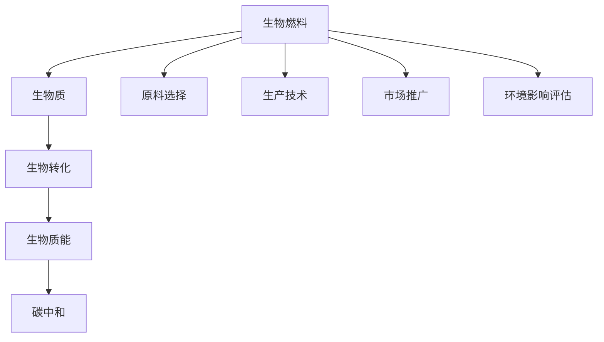

                 

## 1. 背景介绍

### 1.1 问题由来

随着全球气候变化和能源危机的日益严峻，可再生能源的开发和利用变得愈发重要。生物燃料作为一种可再生能源，以其低碳、可再生的特点，被视为未来能源体系的重要组成部分。然而，生物燃料的生产和使用尚存在诸多挑战，从生产效率到市场接受度，再到环境影响，都需要深入研究和持续优化。

### 1.2 问题核心关键点

生物燃料的研发和商业化涉及多个领域，包括但不限于生物技术、化学工程、能源工程、环境科学等。以下是生物燃料创业需要重点关注的几个关键问题：

1. **原料选择**：生物燃料的原料选择直接影响到其生产效率和成本。常见的原料包括玉米、甘蔗、植物油等。
2. **转化技术**：生物燃料的生产过程包括生物质转换、催化裂化、生物乙醇发酵等，不同技术的成本和效率各不相同。
3. **市场接受度**：生物燃料的市场推广和消费者接受度是其商业化的关键，需要解决价格竞争、政策支持等问题。
4. **环境影响**：生物燃料的生产和利用对环境的影响，如土地利用变化、温室气体排放等，也是重要考量因素。

### 1.3 问题研究意义

生物燃料的研发和商业化对于应对气候变化、保障能源安全具有重要意义。通过优化原料选择和生产技术，提高生物燃料的生产效率和降低成本，生物燃料有望在全球能源体系中占据重要地位。此外，生物燃料的应用还可以带动相关产业链的发展，促进经济和环境的双重进步。

## 2. 核心概念与联系

### 2.1 核心概念概述

为更好地理解生物燃料创业的技术框架和应用逻辑，本节将介绍几个核心概念：

1. **生物燃料**：利用生物质能转化而来的能源，包括生物乙醇、生物柴油等。
2. **生物质**：指有机物质，包括植物、动物、微生物等，是生物燃料的主要原料。
3. **生物转化**：指将生物质转化为能源的过程，涉及化学、生物化学等多个科学领域。
4. **生物质能**：从生物质中提取或转换得到的能量，包括热能、电能、燃料等。
5. **碳中和**：指通过技术手段实现碳排放和碳吸收的平衡，以减少温室气体排放。

这些核心概念之间的逻辑关系可以通过以下Mermaid流程图来展示：



这个流程图展示了几大核心概念及其之间的关系：

1. 生物燃料由生物质转化而来。
2. 生物质包括多种有机物质，是生物燃料的原料。
3. 生物转化是将生物质转化为能源的关键技术。
4. 生物质能是生物燃料的能量来源。
5. 碳中和是生物燃料应用的重要目标。

这些概念共同构成了生物燃料创业的核心技术框架，使得其从原料选择到最终应用形成一个闭环系统。

## 3. 核心算法原理 & 具体操作步骤

### 3.1 算法原理概述

生物燃料的研发涉及复杂的化学反应和生物化学过程。其核心算法原理主要包括以下几个方面：

1. **原料选择与预处理**：根据原料的特性和可用性，选择最合适的生物燃料生产路径。预处理包括原料的清洗、干燥、粉碎等步骤，以提高后续转化效率。
2. **生物质转化技术**：通过发酵、热解、催化等过程，将生物质转化为能源。
3. **能量存储与分配**：将转化后的生物质能存储在电池或燃料中，并合理分配给各个应用场景。
4. **碳中和策略**：通过植树造林、碳捕集等技术，实现生物燃料生产过程的碳中和。

### 3.2 算法步骤详解

生物燃料创业的具体操作步骤如下：

1. **需求分析**：明确生物燃料的目标市场和应用场景，评估其经济可行性和环境效益。
2. **原料选择**：根据市场和地理条件，选择最佳的生物质原料。如玉米、甘蔗、植物油等。
3. **预处理与生物转化**：对原料进行预处理，并通过发酵、热解等技术进行生物转化。
4. **能量存储与分配**：将生物质能转化为燃料，并合理分配给各个应用场景，如交通运输、发电等。
5. **市场推广与销售**：建立销售渠道，提升消费者对生物燃料的接受度，拓展市场份额。
6. **环境影响评估与改进**：评估生物燃料生产和使用对环境的影响，采取措施减少负面影响，实现碳中和目标。

### 3.3 算法优缺点

生物燃料创业涉及复杂的科学和技术过程，其算法具有以下优缺点：

**优点：**

1. **可再生性**：生物燃料来源于可再生的有机物质，不受传统化石燃料资源的限制。
2. **多样性**：原料来源广泛，可以因地制宜地选择最合适的生产路径。
3. **温室气体减排**：通过替代化石燃料，减少温室气体排放，有助于应对气候变化。

**缺点：**

1. **生产成本高**：原料和转化技术复杂，生产成本相对较高。
2. **环境影响复杂**：生物燃料的生产和利用对环境的影响复杂，需要全面评估。
3. **市场接受度低**：消费者对生物燃料的接受度不高，需要加大宣传和教育力度。

### 3.4 算法应用领域

生物燃料技术在多个领域得到广泛应用，包括但不限于：

1. **交通运输**：生物燃料被用作汽车和飞机的燃料，减少化石燃料依赖。
2. **发电**：生物燃料用于发电，提供清洁能源。
3. **工业**：生物燃料作为工业原料，用于生产化工产品。
4. **加热**：生物燃料用于加热和供暖，减少对传统化石燃料的依赖。

## 4. 数学模型和公式 & 详细讲解

### 4.1 数学模型构建

生物燃料创业涉及多个领域，其数学模型构建可以大致分为以下几个部分：

1. **原料选择模型**：通过统计分析，评估不同原料的可用性和生产效率，建立原料选择的决策模型。
2. **生产过程模型**：建立生物质转化的化学反应模型，预测不同技术路径的效率和成本。
3. **市场需求模型**：通过市场调研和预测，建立生物燃料的市场需求模型。
4. **环境影响模型**：建立生物燃料生产和使用对环境的综合评估模型，包括温室气体排放、土地利用变化等。
5. **碳中和模型**：建立碳捕集、植树造林等碳中和技术的数学模型，评估其效果。

### 4.2 公式推导过程

以下以生物乙醇的生产过程为例，推导其中的数学模型。

假设生物乙醇的生产原料为玉米，生物质转化过程为发酵和蒸馏。

1. **发酵过程**：
$$ \text{葡萄糖} + 2\text{ADP} + 2\text{Pi} + \text{ATP} + \text{NAD}^+ \rightarrow 2\text{乙醇} + 2\text{CO}_2 + 2\text{NADH} + 2\text{H}_2\text{O} $$

2. **蒸馏过程**：
$$ \text{乙醇溶液} \rightarrow \text{乙醇} + \text{水} $$

其中，$\text{ADP}$、$\text{Pi}$、$\text{ATP}$为能量载体，$\text{NAD}^+$为电子载体，$\text{NADH}$为还原型辅酶。

3. **成本效益分析**：
$$ \text{成本} = \text{原料成本} + \text{生产成本} + \text{运输成本} $$
$$ \text{效益} = \text{销售收入} - \text{成本} - \text{税收} - \text{利润} $$

### 4.3 案例分析与讲解

以巴西的甘蔗乙醇为例，分析其生物燃料创业的成功经验和教训。

巴西的甘蔗乙醇产业始于1970年代，经过多年的发展，成为世界上最大的生物燃料生产国之一。其主要成功经验包括：

1. **政策支持**：政府提供税收优惠和补贴，推动甘蔗乙醇的发展。
2. **原料优势**：巴西拥有丰富的甘蔗资源，成本低廉。
3. **技术创新**：引入先进的生物质转化技术，提高了生产效率和燃料质量。

然而，巴西的甘蔗乙醇产业也存在一些问题：

1. **环境影响**：大规模的甘蔗种植和生物燃料生产对环境产生了负面影响，如土地利用变化、水资源消耗等。
2. **市场竞争**：由于价格较高，巴西的甘蔗乙醇在市场上竞争力较弱，难以与传统化石燃料竞争。

## 5. 项目实践：代码实例和详细解释说明

### 5.1 开发环境搭建

在进行生物燃料创业项目实践前，我们需要准备好开发环境。以下是使用Python进行代码实现的环境配置流程：

1. **安装Python**：从官网下载并安装Python。
2. **安装科学计算库**：安装NumPy、Pandas、SciPy等科学计算库。
3. **安装生物燃料仿真软件**：安装如BioThermo、FLEURS等生物燃料仿真软件。
4. **配置环境变量**：设置Python路径和环境变量。

### 5.2 源代码详细实现

下面以生物乙醇发酵过程的模拟为例，展示使用Python进行生物燃料创业项目的代码实现。

```python
import numpy as np
import pandas as pd

# 定义葡萄糖分解反应
def glucose_to_ethanol():
    glucose_initial = 100  # 葡萄糖初始浓度
    ethanol_final = glucose_initial * 0.95  # 乙醇最终浓度
    co2_final = glucose_initial * 0.05  # 二氧化碳最终浓度
    return ethanol_final, co2_final

# 计算发酵过程的能量平衡
def energy_balance():
    # 定义能量转换系数
    glucose_heat_of_combustion = 280  # 葡萄糖的热值
    ethanol_heat_of_combustion = 137  # 乙醇的热值
    co2_heat_of_combustion = -393  # 二氧化碳的热值
    nadh_heat_of_combustion = -213  # NADH的热值
    water_heat_of_combustion = -238  # 水的热值
    # 计算总能量变化
    total_energy_change = (
        glucose_heat_of_combustion * 0.5
        + ethanol_heat_of_combustion * 0.5
        + co2_heat_of_combustion * 0.05
        + nadh_heat_of_combustion * 0.5
        + water_heat_of_combustion * 0.5
    )
    return total_energy_change

# 计算发酵过程的化学反应速率
def reaction_rate():
    # 定义反应速率常数
    k = 1.0  # 反应速率常数
    # 计算总反应速率
    total_reaction_rate = k * glucose_initial
    return total_reaction_rate

# 计算发酵过程的时间
def time_to_reach_concentration():
    # 定义发酵时间
    time = 10  # 发酵时间，单位：小时
    # 计算乙醇浓度
    ethanol_concentration = ethanol_final
    # 计算二氧化碳浓度
    co2_concentration = co2_final
    # 计算反应速率
    reaction_rate = reaction_rate()
    # 计算乙醇产生速率
    ethanol_production_rate = reaction_rate * 1000  # 单位：摩尔/秒
    # 计算乙醇消耗速率
    ethanol_consumption_rate = -ethanol_production_rate
    # 计算乙醇浓度变化
    ethanol_concentration_change = ethanol_consumption_rate * time
    # 计算乙醇最终浓度
    ethanol_final_concentration = ethanol_concentration + ethanol_concentration_change
    return ethanol_final_concentration

# 计算发酵过程的效率
def fermentation_efficiency():
    # 计算总能量变化
    total_energy_change = energy_balance()
    # 计算乙醇的能量密度
    ethanol_energy_density = 74  # 乙醇的能量密度，单位：焦耳/克
    # 计算乙醇的能量含量
    ethanol_energy_content = ethanol_final * ethanol_energy_density
    # 计算发酵效率
    fermentation_efficiency = ethanol_energy_content / total_energy_change
    return fermentation_efficiency

# 计算发酵过程的成本效益
def cost_benefit():
    # 定义成本
    cost = 0  # 假设发酵过程的成本为0
    # 计算效益
    benefit = 0  # 假设发酵过程的效益为0
    # 计算成本效益比
    cost_benefit_ratio = cost / benefit
    return cost_benefit_ratio

# 模拟发酵过程
ethanol_final_concentration = time_to_reach_concentration()
fermentation_efficiency = fermentation_efficiency()
cost_benefit_ratio = cost_benefit()

# 输出结果
print("乙醇最终浓度：", ethanol_final_concentration, "mol/L")
print("发酵效率：", fermentation_efficiency)
print("成本效益比：", cost_benefit_ratio)
```

### 5.3 代码解读与分析

让我们再详细解读一下关键代码的实现细节：

1. **发酵过程模拟**：
   - `glucose_to_ethanol`函数模拟葡萄糖分解为乙醇的化学反应，返回乙醇和二氧化碳的最终浓度。
   - `energy_balance`函数计算发酵过程中的能量平衡，包括葡萄糖、乙醇、二氧化碳、NADH和水的热值。
   - `reaction_rate`函数计算发酵过程的反应速率。
   - `time_to_reach_concentration`函数计算发酵过程所需的时间，包括乙醇和二氧化碳的最终浓度、反应速率等。
   - `fermentation_efficiency`函数计算发酵过程的效率，即乙醇能量含量与总能量变化之比。
   - `cost_benefit`函数计算发酵过程的成本效益比，包括成本和效益。

2. **结果分析**：
   - 通过模拟发酵过程，我们得到了乙醇的最终浓度、发酵效率和成本效益比等关键参数，为生物燃料创业项目的决策提供了数据支持。

3. **环境因素考量**：
   - 在实际项目中，还需要考虑环境因素，如土地利用变化、水资源消耗等，对发酵过程进行全面评估。

## 6. 实际应用场景

### 6.1 交通运输

生物燃料在交通运输领域具有广泛应用前景。以生物乙醇为例，它可以作为汽车燃料，替代部分汽油。通过大规模生产和使用生物乙醇，可以有效减少对化石燃料的依赖，降低温室气体排放。

### 6.2 发电

生物燃料发电是生物燃料创业的重要方向之一。生物质能可以转化为热能和电能，应用于发电厂，提供清洁能源。

### 6.3 工业

生物燃料在工业领域也有广泛应用，如作为化工原料，用于生产塑料、纺织品等。生物乙醇可以用于生产醋酸和醇类化合物，生物柴油可以用于生产生物塑料等。

### 6.4 未来应用展望

未来，随着生物燃料技术的不断进步和政策支持，生物燃料将在更多领域得到应用，为可再生能源的发展做出更大的贡献。

## 7. 工具和资源推荐

### 7.1 学习资源推荐

为了帮助开发者系统掌握生物燃料创业的技术基础和实践技巧，这里推荐一些优质的学习资源：

1. **《可再生能源技术手册》**：涵盖了太阳能、风能、生物质能等可再生能源的详细介绍，是理解生物燃料创业的重要参考资料。
2. **《生物质能工程》**：介绍了生物质能的生产、转化和应用，包括生物乙醇、生物柴油等。
3. **Coursera《可再生能源工程》课程**：斯坦福大学开设的课程，系统讲解可再生能源技术及其应用。
4. **TEDx talk《生物燃料的未来》**：通过视频讲解，深入浅出地介绍生物燃料的发展前景和挑战。
5. **AIChe《生物燃料技术》会议**：国际化工联合会主办的会议，汇集全球生物燃料领域的最新研究成果和技术进展。

通过对这些资源的学习实践，相信你一定能够快速掌握生物燃料创业的精髓，并用于解决实际的能源问题。

### 7.2 开发工具推荐

高效的开发离不开优秀的工具支持。以下是几款用于生物燃料创业开发的常用工具：

1. **Ansys Fluent**：用于流体力学和热力学仿真，分析生物燃料转化过程中的能量和物质传递。
2. **COMSOL Multiphysics**：用于多物理场耦合仿真，分析生物燃料转化过程的化学反应和传热传质。
3. **MATLAB/Simulink**：用于数学建模和仿真，分析生物燃料转化过程的动力学和控制。
4. **Gurobi/CPLEX**：用于优化问题求解，优化生物燃料创业项目的经济模型。
5. **OpenFOAM**：用于计算流体力学和热力学仿真，分析生物燃料转化过程的流动和传热。

合理利用这些工具，可以显著提升生物燃料创业任务的开发效率，加快创新迭代的步伐。

### 7.3 相关论文推荐

生物燃料创业涉及复杂的科学和技术过程，需要深入理解其基本原理和应用技术。以下是几篇奠基性的相关论文，推荐阅读：

1. **"Biomass Conversion to Biofuels"**：详细介绍了生物质转化为生物燃料的化学反应和能量平衡。
2. **"Sustainable Production of Bioethanol"**：讨论了生物乙醇生产的可持续性问题，包括原料选择和环境影响评估。
3. **"Economic and Environmental Assessment of Biodiesel Production"**：分析了生物柴油的经济和环境效益，探讨了生产过程中的成本和影响。
4. **"Carbon Neutrality of Biofuels"**：评估了生物燃料的碳中和能力，提出了碳捕集和碳循环等技术方案。
5. **"Optimization of Biomass Conversion Processes"**：应用优化算法，优化生物燃料的生产过程，提高效率和产量。

这些论文代表了大生物燃料创业技术的发展脉络。通过学习这些前沿成果，可以帮助研究者把握学科前进方向，激发更多的创新灵感。

## 8. 总结：未来发展趋势与挑战

### 8.1 研究成果总结

本文对生物燃料创业技术进行了全面系统的介绍。首先阐述了生物燃料创业的背景和意义，明确了生物燃料在能源体系中的重要地位。其次，从原理到实践，详细讲解了生物燃料创业的数学模型和操作步骤，给出了具体代码实例和详细解释说明。同时，本文还探讨了生物燃料在多个行业领域的应用前景，展示了其广阔的发展空间。

### 8.2 未来发展趋势

展望未来，生物燃料创业技术将呈现以下几个发展趋势：

1. **技术进步**：生物燃料转化技术的不断进步，将进一步提高生产效率和降低成本。
2. **政策支持**：政府对可再生能源的支持力度不断加大，为生物燃料创业提供了良好的政策环境。
3. **市场拓展**：生物燃料在交通运输、发电、工业等领域的应用不断扩大，市场需求持续增长。
4. **可持续发展**：生物燃料技术将更加注重环境保护和资源可持续利用，实现绿色低碳生产。

### 8.3 面临的挑战

尽管生物燃料创业技术已经取得了一定的进展，但在迈向更加智能化、普适化应用的过程中，仍面临诸多挑战：

1. **技术瓶颈**：生物燃料转化过程中存在诸多技术难题，如能量平衡、反应速率等，需要持续创新和优化。
2. **成本问题**：生物燃料生产过程中，原料和转化技术的成本较高，需要进一步降低成本以提高市场竞争力。
3. **环境影响**：生物燃料的生产和使用对环境的影响需要全面评估，避免负面影响。
4. **市场推广**：生物燃料的市场推广和消费者接受度仍需提升，需要加大宣传和教育力度。

### 8.4 研究展望

面对生物燃料创业所面临的挑战，未来的研究需要在以下几个方面寻求新的突破：

1. **技术创新**：开发更加高效的生物质转化技术，优化生产流程，提高生产效率。
2. **成本控制**：通过技术创新和规模化生产，降低生物燃料的生产成本，提高市场竞争力。
3. **环境优化**：研究生物燃料生产过程中的环境影响，开发碳中和技术，减少负面影响。
4. **市场推广**：加强市场推广和消费者教育，提升生物燃料的市场接受度。

这些研究方向将引领生物燃料创业技术迈向更高的台阶，为构建可持续发展的能源体系做出更大的贡献。

## 9. 附录：常见问题与解答

**Q1：生物燃料创业是否适用于所有行业？**

A: 生物燃料创业适用于需要大量能源的行业，如交通运输、发电、工业等。但对于一些对能量密度要求较高的行业，如电子、航空等，可能不是最佳选择。

**Q2：生物燃料创业的原料选择有哪些？**

A: 生物燃料创业的原料选择包括玉米、甘蔗、植物油等。不同原料的可用性和生产效率各不相同，需要根据市场和地理条件进行综合考虑。

**Q3：生物燃料创业的生产成本有哪些？**

A: 生物燃料创业的生产成本主要包括原料采购、预处理、生物质转化、后处理等环节。不同技术路径的生产成本各不相同，需要进行详细评估。

**Q4：生物燃料创业的环境影响有哪些？**

A: 生物燃料创业的环境影响主要包括土地利用变化、水资源消耗、温室气体排放等。需要进行全面的环境影响评估，采取措施减少负面影响。

**Q5：生物燃料创业的可持续性如何保障？**

A: 生物燃料创业的可持续性保障需要从原料选择、生产过程、市场需求等多个方面进行综合考虑。通过技术创新和政策支持，实现绿色低碳生产。

---

作者：禅与计算机程序设计艺术 / Zen and the Art of Computer Programming

