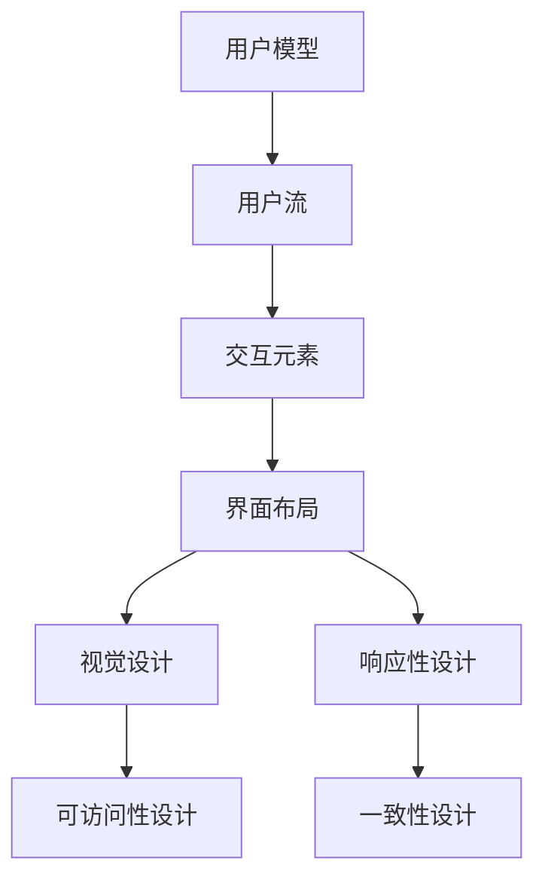

                 

# 用户界面设计：打造友好易用的人机交互

> 关键词：用户界面(UI)设计,易用性,交互设计,人机交互(HCI),UX/UI设计工具,原型制作,用户测试,可访问性,响应性,可扩展性

## 1. 背景介绍

随着技术的进步，用户界面设计(User Interface Design, UI设计)已经成为软件开发不可或缺的一部分。良好的UI设计能够提升用户体验(UX)，增强用户对产品的黏性，从而在激烈的市场竞争中获得优势。然而，随着应用程序功能的增加，界面变得复杂，用户体验往往因此受损。本文将介绍UI设计的核心概念和实践方法，通过系统化的讲解和实例分析，帮助开发者提升UI设计能力，打造友好的用户交互体验。

### 1.1 UI设计概述

用户界面设计指的是设计用户与软件、硬件、服务之间互动的视觉元素和交互过程。其核心目标是创建一个既美观又实用的界面，使用户能够轻松理解和使用产品。一个良好的UI设计应该是直观的、一致的、易用的，并且能够满足用户的需求。

### 1.2 UI设计的重要性

优秀的UI设计能够显著提升用户体验，减少用户学习成本，降低错误率。它还能帮助品牌建立独特的形象，提高用户满意度和忠诚度。对于开发者而言，良好的UI设计不仅能提高软件的市场竞争力，还能帮助产品更快地获得用户反馈，迭代优化产品。

### 1.3 UI设计的发展

UI设计经历了从图形界面(GUI)到扁平化设计、响应式设计、无障碍设计等不同阶段，每一次设计风格的演变，都是为了更好地满足用户需求。未来，随着技术的进步，UI设计还将向着更加个性化、智能化的方向发展。

## 2. 核心概念与联系

### 2.1 核心概念概述

为了更好地理解UI设计的核心概念，我们将介绍几个关键术语：

- **用户模型**：指对用户特点、需求和行为的研究。好的UI设计必须基于对用户的深刻理解。
- **用户流**：用户在产品中完成任务的步骤序列。优化用户流可以减少用户操作步骤，提高效率。
- **交互元素**：如按钮、文本框、菜单等，是用户与产品互动的基本组件。
- **界面布局**：即界面元素的排列和组合方式，好的布局能够引导用户注意力，提高操作效率。
- **视觉设计**：包括颜色、字体、图形等元素的运用，通过视觉设计增强UI的吸引力和易用性。
- **响应性设计**：保证界面在不同设备和屏幕尺寸上都能良好展示和交互。
- **可访问性设计**：确保产品能够被所有用户访问，包括残障人士。
- **一致性设计**：保持界面元素的样式和行为一致，提升用户体验。

这些概念之间的联系可以通过以下Mermaid流程图来展示：

这个流程图展示了UI设计的核心概念及其相互关系：

1. 基于用户模型的研究，设计用户流。
2. 通过用户流，设计交互元素和界面布局。
3. 界面布局和交互元素结合视觉设计，增强用户体验。
4. 通过视觉设计、响应性设计和可访问性设计，提升UI的易用性和普适性。
5. 一致性设计保证不同界面元素风格和行为一致。

## 3. 核心算法原理 & 具体操作步骤

### 3.1 算法原理概述

UI设计的核心算法原理主要围绕用户体验的提升展开。它通过用户模型、用户流、交互元素和视觉设计等关键点，设计出既美观又实用的界面，增强用户对产品的理解和操作。

### 3.2 算法步骤详解

UI设计的步骤大致分为以下几个阶段：

**阶段1：需求分析和用户研究**

- **需求收集**：与用户沟通，收集他们的需求和期望。
- **用户调研**：通过问卷调查、用户访谈等方式，深入了解用户的使用场景和行为。
- **用户画像**：创建用户角色模型，描述目标用户的特点和需求。

**阶段2：界面原型设计**

- **草图绘制**：手绘或使用工具（如Sketch、Adobe XD）绘制初步的界面草图。
- **原型制作**：根据草图制作可交互的原型，使用工具（如Figma、InVision）进行设计。
- **交互设计**：设计用户与界面之间的交互方式，包括点击、滑动、拖拽等操作。

**阶段3：视觉设计**

- **颜色和字体选择**：选择适合品牌和用户群体的颜色和字体。
- **图形设计**：使用图标和图形元素增强界面的视觉吸引力。
- **视觉一致性**：保持界面元素的颜色、字体和样式一致，提升品牌识别度。

**阶段4：测试与反馈**

- **用户测试**：邀请真实用户测试原型，收集使用反馈。
- **数据分析**：分析用户的使用数据，找出存在的问题和改进点。
- **迭代优化**：根据用户反馈，优化界面设计。

### 3.3 算法优缺点

UI设计的优点包括：

- **提升用户体验**：良好的UI设计能够显著提升用户的操作效率和满意度。
- **增强品牌识别度**：一致的视觉设计能够增强品牌形象和识别度。
- **降低开发成本**：良好的UI设计可以减少后期修改和维护的成本。

UI设计的不足之处在于：

- **设计和实现分离**：UI设计往往需要与后端开发分离，导致设计周期较长。
- **需求变化频繁**：产品迭代过程中，UI设计需要频繁调整，增加了开发和测试成本。
- **用户反馈难预测**：用户反馈难以预测，可能出现设计初衷与用户需求不符的情况。

### 3.4 算法应用领域

UI设计广泛应用于各类软件、硬件和服务的开发中。例如：

- **移动应用**：通过UI设计，提升移动应用的易用性和用户粘性。
- **网页设计**：创建易于导航和操作的网页，提升网站的用户体验。
- **桌面应用**：设计直观的操作界面，增强用户的操作体验。
- **游戏设计**：通过UI设计，提升游戏的交互体验和用户沉浸感。
- **智能设备**：设计符合用户习惯的界面，提升设备的用户体验。

## 4. 数学模型和公式 & 详细讲解 & 举例说明

### 4.1 数学模型构建

在UI设计中，我们可以构建一个简单的数学模型来量化用户操作效率。设用户完成某个任务所需的操作步骤数为 $T$，操作步骤平均耗时为 $t$，则用户完成该任务所需的总时间为 $Tt$。我们的目标是最小化 $Tt$ 的值。

### 4.2 公式推导过程

根据上述模型，我们可以通过以下公式推导：

$$
\text{Total Time} = T \times t
$$

为了最小化这个时间，我们需要优化 $T$ 和 $t$。通过用户测试和数据分析，可以找出用户操作的最优路径，进而优化 $T$。同时，通过界面元素和交互设计，可以优化 $t$，提高操作的流畅性和效率。

### 4.3 案例分析与讲解

以登录界面为例，我们可以分析不同设计方案对用户操作效率的影响。通过A/B测试，可以比较不同登录页面的设计，找到最优的交互方式和视觉布局。例如，将用户名和密码输入框设计在同一行，可以减少用户的操作步骤和点击次数。

## 5. 项目实践：代码实例和详细解释说明

### 5.1 开发环境搭建

在进行UI设计实践前，我们需要准备好开发环境。以下是使用Sketch进行原型设计的流程：

1. 安装Sketch：从官网下载并安装Sketch，使用其强大的矢量绘图和原型制作功能。
2. 创建新项目：打开Sketch，创建一个新的项目，命名为“User Interface Design”。
3. 配置设计模板：根据设计需求，选择适合的模板，如移动应用、网页设计等。

### 5.2 源代码详细实现

我们使用Sketch工具进行原型设计。以下是一个简单的登录页面的原型制作步骤：

1. **界面布局**：在Sketch中绘制登录界面的草图，包括用户名和密码输入框、登录按钮和忘记密码链接。
2. **交互设计**：使用Sketch的交互工具，为输入框和按钮添加交互效果，如点击事件、焦点状态等。
3. **视觉设计**：选择合适的颜色和字体，使用Sketch的图形工具添加图标和装饰元素，增强界面的视觉吸引力。

### 5.3 代码解读与分析

Sketch的设计过程主要依赖于设计师的经验和直觉。以下是Sketch原型制作的关键步骤和注意事项：

**界面布局**：
- **对齐**：确保界面元素整齐排列，符合用户的视觉习惯。
- **空间设计**：留出足够的空间，避免元素过于密集。
- **层次结构**：将重要的元素放在显眼位置，使用户一眼就能找到。

**交互设计**：
- **点击区域**：确保点击区域足够大，避免用户误操作。
- **反馈效果**：在用户点击按钮时，添加动画和反馈效果，增强用户互动感。
- **焦点状态**：通过颜色和样式变化，标记当前焦点元素，提高用户操作效率。

**视觉设计**：
- **颜色选择**：选择品牌主色调和辅助色，保持视觉的一致性。
- **字体选择**：选择易读性高的字体，确保文字清晰可读。
- **图标设计**：使用图标增强界面的吸引力，同时确保图标的可用性。

### 5.4 运行结果展示

完成原型制作后，可以通过Sketch导出不同格式的图像和交互原型，供用户测试和反馈。以下是一个登录页面的原型展示：

## 6. 实际应用场景

### 6.1 移动应用设计

移动应用是UI设计的重要应用场景之一。良好的移动应用设计能够提升用户体验，增加用户粘性。例如，社交媒体应用的界面设计需要注重简洁美观，同时提供快捷的操作方式，如滑动、拖拽等。

### 6.2 网页设计

网页设计需要关注用户的浏览路径和操作效率。例如，电商网站的导航栏设计需要易于用户使用，能够快速找到商品和购物车。

### 6.3 桌面应用设计

桌面应用设计需要考虑用户的交互习惯和操作效率。例如，办公软件的界面设计需要注重快捷操作和数据展示，提升用户的工作效率。

### 6.4 游戏设计

游戏设计需要考虑用户体验和游戏沉浸感。例如，角色扮演游戏（RPG）的界面设计需要注重故事情节和任务提示，提升玩家的游戏体验。

## 7. 工具和资源推荐

### 7.1 学习资源推荐

为了帮助开发者提升UI设计能力，以下是一些优质的学习资源：

1. **《Don't Make Me Think》**：这是一本经典的UI设计书籍，介绍了UI设计的核心原则和实践方法。
2. **Nielsen Norman Group**：提供UI设计研究和最佳实践，是UI设计的权威机构之一。
3. **InVision Blog**：InVision的博客，包含丰富的UI设计案例和教程，适合初学者和进阶者。
4. **Figma官方文档**：Figma的官方文档和教程，帮助用户快速上手使用Figma进行原型设计。
5. **Dribbble**：Dribbble是一个UI设计社区，可以浏览和分享大量的UI设计案例。

通过这些资源的学习，可以系统掌握UI设计的理论基础和实践技巧。

### 7.2 开发工具推荐

以下是几款常用的UI设计工具：

1. **Sketch**：业界领先的矢量绘图和原型制作工具，适合Mac平台。
2. **Adobe XD**：Adobe旗下的UI设计工具，支持跨平台设计，适合设计师和开发人员使用。
3. **Figma**：基于Web的设计工具，支持实时协作和版本控制，适合远程团队协作。
4. **InVision**：界面设计原型和交互设计工具，支持动态效果展示和用户测试。
5. **Balsamiq**：低保真原型设计工具，适合快速迭代和用户测试。

合理利用这些工具，可以显著提升UI设计的效率和质量。

### 7.3 相关论文推荐

以下是几篇经典的UI设计论文，推荐阅读：

1. **"Human Factors of Computer Use"**：Jean Dixit的著作，介绍了人机交互的基本原则和实践方法。
2. **"Interaction Design Foundation"**：提供交互设计的研究和案例分析，帮助设计师提升设计能力。
3. **"Interaction Design in Multi-Screen Environments"**：探讨多屏环境下的人机交互设计，提供丰富的设计案例和实践经验。
4. **"Universal Design"**：由乔纳森·伊夫（Jonathan Ive）和伊万·麦克尔（Ivan McElligott）合著，介绍了无障碍设计和普适设计的理念和实践。

这些论文代表了大规模语言模型微调技术的发展脉络。通过学习这些前沿成果，可以帮助研究者把握学科前进方向，激发更多的创新灵感。

## 8. 总结：未来发展趋势与挑战

### 8.1 总结

本文对UI设计的核心概念和实践方法进行了系统介绍。通过系统化的讲解和实例分析，帮助开发者提升UI设计能力，打造友好的用户交互体验。我们介绍了UI设计的核心算法原理和操作步骤，并列举了UI设计在实际应用中的重要性和具体实现方法。

通过本文的系统梳理，可以看到，UI设计在提升用户体验方面具有不可替代的作用。UI设计需要综合考虑用户需求、界面元素、交互方式和视觉设计等多个方面，才能设计出既美观又实用的界面。未来，随着技术的进步，UI设计还将向着更加个性化、智能化的方向发展。

### 8.2 未来发展趋势

展望未来，UI设计将呈现以下几个发展趋势：

1. **个性化设计**：随着大数据和人工智能技术的发展，UI设计将更加注重用户个性化需求，通过数据分析和机器学习技术，提供定制化的设计方案。
2. **交互设计**：交互设计将更加注重用户体验和操作效率，使用自然语言交互、手势操作等方式提升用户互动性。
3. **可访问性设计**：无障碍设计和普适设计将成为主流，确保产品能够被所有用户访问和使用。
4. **响应式设计**：响应式设计将更加普及，确保界面在不同设备和屏幕尺寸上都能良好展示和交互。
5. **智能设计**：UI设计将融合人工智能技术，提升设计的自动化和智能化水平，如智能布局、自动调整等。

### 8.3 面临的挑战

尽管UI设计取得了显著的进展，但在迈向更加智能化、普适化应用的过程中，它仍面临着诸多挑战：

1. **需求多样性**：不同用户的需求和偏好差异较大，UI设计需要兼顾多样性和一致性。
2. **技术迭代快**：UI设计需要紧跟技术发展，不断更新和优化设计方案。
3. **设计周期长**：UI设计周期较长，需要反复迭代和优化，增加了开发成本和时间。
4. **用户体验难量化**：用户对产品的感知难以量化，设计效果需要用户反馈验证。
5. **设计标准化**：UI设计缺乏统一的标准和规范，导致设计质量参差不齐。

### 8.4 研究展望

面对UI设计面临的挑战，未来的研究需要在以下几个方面寻求新的突破：

1. **设计自动化**：通过人工智能和自动化工具，提升UI设计的效率和质量。
2. **用户参与设计**：通过用户反馈和参与设计，提升设计的精准度和用户满意度。
3. **跨学科融合**：UI设计需要跨学科融合，结合心理学、社会学等多学科知识，提升设计的科学性和合理性。
4. **新技术应用**：探索新的技术手段，如虚拟现实、增强现实等，提升用户的沉浸感和交互体验。
5. **普适设计和无障碍设计**：关注普适设计和无障碍设计，确保产品能够被所有用户访问和使用。

这些研究方向的探索，必将引领UI设计技术迈向更高的台阶，为构建安全、可靠、可解释、可控的智能系统铺平道路。面向未来，UI设计还需要与其他人工智能技术进行更深入的融合，如知识表示、因果推理、强化学习等，多路径协同发力，共同推动人机交互系统的进步。只有勇于创新、敢于突破，才能不断拓展UI设计的边界，让智能技术更好地造福人类社会。

## 9. 附录：常见问题与解答

**Q1：UI设计是否需要考虑不同用户群体的需求？**

A: 是的，UI设计需要考虑不同用户群体的需求和特点。良好的UI设计需要兼顾普适性和个性化，确保产品能够被所有用户访问和使用。

**Q2：UI设计是否需要考虑交互效率和用户体验？**

A: 是的，UI设计需要关注用户的操作效率和体验。通过优化用户流和交互元素，减少操作步骤和点击次数，提升用户的满意度和操作效率。

**Q3：UI设计是否需要考虑视觉设计的统一性？**

A: 是的，良好的视觉设计需要保持界面元素的颜色、字体和样式一致，增强品牌的识别度和视觉吸引力。

**Q4：UI设计是否需要考虑响应性设计？**

A: 是的，响应性设计需要确保界面在不同设备和屏幕尺寸上都能良好展示和交互。使用响应式设计，提升产品的可用性和用户满意度。

**Q5：UI设计是否需要考虑用户测试和反馈？**

A: 是的，用户测试和反馈是UI设计的关键环节。通过用户测试，收集用户的意见和反馈，不断优化和改进设计方案。

**Q6：UI设计是否需要考虑无障碍设计？**

A: 是的，无障碍设计需要确保产品能够被所有用户访问和使用，包括残障人士。通过无障碍设计，提升产品的普适性和用户满意度。

通过这些问题的解答，可以看出UI设计需要综合考虑用户需求、界面元素、交互方式和视觉设计等多个方面，才能设计出既美观又实用的界面。未来，随着技术的进步，UI设计还将向着更加个性化、智能化的方向发展，成为构建人机交互系统的关键环节。

