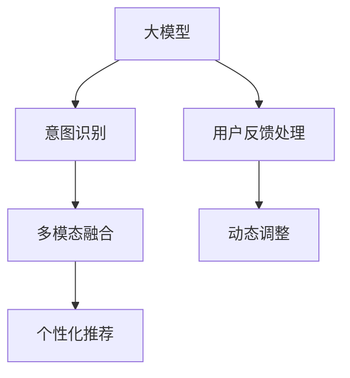

                 

## 1. 背景介绍

### 1.1 问题由来

随着电子商务的快速发展，电商平台越来越注重用户体验和个性化推荐，以提升用户粘度和转化率。传统的电商平台推荐系统主要依赖用户的历史行为数据和基于规则的逻辑推理，难以处理用户的个性化需求和复杂的多属性特征。近年来，基于深度学习的大模型技术为电商平台个性化推荐提供了新的解决方案。

在实际应用中，用户往往需要通过多轮搜索和浏览，才能确定想要购买的商品。平台需要实时捕获用户的搜索意图和浏览行为，并及时调整展示策略。传统的推荐系统无法直接理解用户的语义意图，推荐效果往往不尽人意。而基于大模型的自然语言处理技术，可以实时分析和理解用户的查询和浏览信息，提供更加精准、个性化的导航和推荐服务。

### 1.2 问题核心关键点

基于大模型的用户意图理解，旨在通过自然语言处理技术，解析用户的查询意图和浏览行为，从而在电商平台上提供更加个性化的导航和推荐。核心问题包括：

1. **用户意图识别**：从用户输入的搜索词、评论、问题等文本中，理解用户的查询意图和需求。
2. **意图与商品映射**：将用户的意图映射到最符合的搜索结果和商品推荐上。
3. **多意图融合**：处理用户在同一搜索中可能存在的多个意图，提供综合性的导航和推荐服务。
4. **动态更新**：根据用户互动反馈，不断调整和优化模型，提升意图理解准确率。

## 2. 核心概念与联系

### 2.1 核心概念概述

为更好地理解基于大模型的用户意图理解方法，本节将介绍几个密切相关的核心概念：

- **大模型**：以Transformer为代表的深度学习大模型，如BERT、GPT-3等，具有强大的语义理解和生成能力。
- **意图识别**：通过文本解析技术，理解用户输入的查询意图和需求。
- **多模态融合**：结合文本、图像、视频等多模态数据，提升用户意图识别的准确性。
- **个性化推荐**：根据用户意图和行为特征，实时调整展示策略，推荐最适合的商品。
- **用户反馈处理**：收集用户对推荐结果的反馈，进一步优化意图识别和推荐模型。
- **动态调整**：根据用户交互数据，不断调整和优化模型，提升意图理解和推荐效果。

这些核心概念之间的逻辑关系可以通过以下Mermaid流程图来展示：



这个流程图展示了大模型用户意图理解的核心概念及其之间的关系：

1. 大模型通过预训练获得基础能力。
2. 意图识别从文本中提取用户需求，为多模态融合和个性化推荐提供输入。
3. 多模态融合结合文本、图像、视频等多种数据源，提升意图识别的准确性。
4. 个性化推荐根据意图识别结果，推荐最适合的商品。
5. 用户反馈处理收集用户对推荐结果的反馈，进一步优化意图识别和推荐模型。
6. 动态调整不断更新模型参数，提升意图理解和推荐效果。

这些概念共同构成了电商平台个性化导航的用户意图理解框架，使得电商平台能够实时捕捉用户的查询意图，提供更加精准、个性化的推荐服务。

## 3. 核心算法原理 & 具体操作步骤
### 3.1 算法原理概述

基于大模型的用户意图理解，本质上是一个多模态语义理解和意图识别过程。其核心思想是：将用户输入的文本数据作为输入，通过预训练的大模型进行语义编码，提取用户的查询意图和需求。然后，将意图与商品进行映射，并结合其他模态数据（如图片、视频），提供更加综合和个性化的推荐服务。

形式化地，假设用户的查询输入为 $X$，大模型为 $M$，目标商品为 $Y$，意图映射为 $f$。则意图识别的目标是最小化模型预测的意图与真实意图之间的差距。即：

$$
\hat{Y} = \mathop{\arg\min}_{Y} \mathcal{L}(M(X),Y)
$$

其中 $\mathcal{L}$ 为意图识别的损失函数，可以通过交叉熵损失、余弦相似度等衡量。

### 3.2 算法步骤详解

基于大模型的用户意图理解一般包括以下几个关键步骤：

**Step 1: 收集用户查询数据**

- 收集用户通过搜索、评论、聊天等途径输入的文本数据，并进行预处理。
- 将文本数据分词、标准化，并构建用户查询语料库。

**Step 2: 构建预训练模型**

- 选择合适的预训练语言模型 $M$，如BERT、GPT-3等。
- 加载模型权重，进行预训练和微调，以适应电商平台的特定任务。

**Step 3: 设计意图识别模型**

- 设计意图识别模型，通常使用Transformer等结构，包含输入编码器、意图分类器等组件。
- 根据电商平台的业务需求，设计合适的意图类别和分类器输出格式。

**Step 4: 多模态融合**

- 将用户查询文本与商品图片、视频等多模态数据进行融合，生成更丰富的语义表示。
- 设计合适的融合策略，如特征拼接、注意力机制等。

**Step 5: 意图映射与推荐**

- 将用户意图映射到最符合的商品上，通常使用向量相似度、分类器输出等方式。
- 根据意图和商品映射结果，结合个性化推荐策略，推荐最适合的商品。

**Step 6: 用户反馈处理**

- 收集用户对推荐结果的反馈数据，如点击率、评价等。
- 根据用户反馈数据，更新模型参数，调整意图识别和推荐策略。

**Step 7: 动态调整**

- 根据用户互动数据，不断调整和优化模型，提升意图理解和推荐效果。
- 引入在线学习算法，实时更新模型参数，提高模型性能。

### 3.3 算法优缺点

基于大模型的用户意图理解方法具有以下优点：

1. **高效准确**：大模型具有强大的语义理解能力，能够高效准确地理解用户的查询意图。
2. **多模态融合**：结合文本、图像、视频等多模态数据，提升意图识别的准确性。
3. **个性化推荐**：根据用户意图和行为特征，实时调整展示策略，推荐最适合的商品。
4. **动态更新**：通过用户反馈数据，不断优化模型，提升意图理解和推荐效果。

同时，该方法也存在一些局限性：

1. **资源消耗大**：大模型参数量巨大，对计算资源和存储空间有较高要求。
2. **计算复杂**：多模态融合和意图映射等操作，计算复杂度高，需要高性能设备支持。
3. **数据隐私**：收集用户查询数据，涉及隐私问题，需要严格的数据保护措施。
4. **动态性不足**：模型更新需要较长的时间，难以实时适应用户行为的变化。
5. **鲁棒性有待提升**：面对新领域或新场景，模型的泛化能力有待提升。

尽管存在这些局限性，但就目前而言，基于大模型的用户意图理解方法仍是最主流的解决方案。未来相关研究的重点在于如何进一步降低资源消耗，提高模型的动态性和鲁棒性，同时兼顾用户隐私保护。

### 3.4 算法应用领域

基于大模型的用户意图理解方法在电商平台个性化导航中得到了广泛应用，具体包括：

- **智能搜索**：实时解析用户输入的查询词，提供精准的搜索结果。
- **推荐系统**：根据用户意图和行为特征，推荐最适合的商品。
- **用户反馈分析**：收集用户对推荐结果的反馈，优化推荐策略。
- **内容推荐**：根据用户查询和浏览行为，推荐相关的内容和文章。
- **个性化广告**：根据用户意图，推送最适合的广告内容。

除了电商领域，大模型用户意图理解方法也在社交网络、新闻推荐、在线教育等多个场景中得到了应用。随着大模型技术的发展，未来其在更多领域的应用前景值得期待。

## 4. 数学模型和公式 & 详细讲解 & 举例说明

### 4.1 数学模型构建

本节将使用数学语言对基于大模型的用户意图理解过程进行更加严格的刻画。

假设用户输入的查询文本为 $X = (x_1, x_2, ..., x_n)$，预训练语言模型为 $M_{\theta}$，意图分类器为 $f_{\phi}$。则用户意图识别的目标是最小化模型预测的意图与真实意图之间的差距。数学上，可表示为：

$$
\hat{y} = f_{\phi}(M_{\theta}(X))
$$

其中 $y$ 为真实意图，$\hat{y}$ 为模型预测的意图，$f_{\phi}$ 为意图分类器。

### 4.2 公式推导过程

以下我们以意图分类为例，推导交叉熵损失函数及其梯度的计算公式。

假设用户查询文本 $X$ 的语义表示为 $h = M_{\theta}(X)$，模型对意图 $y$ 的预测概率为 $p(y|\hat{y}) = \frac{e^{h_{y}}}{\sum_{y' \in Y} e^{h_{y'}}}$，其中 $h_{y}$ 为意图 $y$ 的语义表示向量。则交叉熵损失函数为：

$$
\ell(\hat{y},y) = -[y\log p(y|\hat{y}) + (1-y)\log (1-p(y|\hat{y}))]
$$

将上式代入损失函数 $\mathcal{L}$，得到：

$$
\mathcal{L} = -\frac{1}{N}\sum_{i=1}^N \ell(\hat{y},y)
$$

其中 $N$ 为训练样本数，$\hat{y}$ 为模型预测的意图向量，$y$ 为真实意图向量。

根据链式法则，损失函数对参数 $\theta$ 的梯度为：

$$
\frac{\partial \mathcal{L}}{\partial \theta} = -\frac{1}{N}\sum_{i=1}^N \frac{\partial \ell(\hat{y},y)}{\partial h} \frac{\partial h}{\partial \theta}
$$

其中 $\frac{\partial \ell(\hat{y},y)}{\partial h}$ 为交叉熵损失对语义表示向量的梯度，$\frac{\partial h}{\partial \theta}$ 为语义表示向量对模型参数的梯度。

在得到损失函数的梯度后，即可带入参数更新公式，完成模型的迭代优化。重复上述过程直至收敛，最终得到适应电商平台的意图识别最优模型。

### 4.3 案例分析与讲解

以一个简单的电商搜索意图识别为例，假设模型预测的意图为“购买”，真实意图为“查看”。则查询文本 $X = "电子产品"，模型预测向量 $\hat{y} = [0.6, 0.4]$。

首先，将查询文本输入到预训练语言模型中，得到语义表示向量 $h = M_{\theta}(X)$。然后，通过意图分类器 $f_{\phi}$，将 $h$ 映射到意图向量 $\hat{y}$。

假设模型的意图分类器为多类别分类器，输出概率为：

$$
p(y=1|\hat{y}) = \frac{e^{h_1}}{\sum_{j \in Y} e^{h_j}}
$$

其中 $h_1$ 为“购买”类别的语义表示向量。则交叉熵损失为：

$$
\ell(\hat{y},y) = -\log p(y=1|\hat{y}) = -\log \frac{e^{h_1}}{\sum_{j \in Y} e^{h_j}}
$$

最终，通过优化目标函数 $\mathcal{L} = -\frac{1}{N}\sum_{i=1}^N \ell(\hat{y},y)$，更新模型参数 $\theta$，使得模型能够更准确地理解用户意图。

## 5. 项目实践：代码实例和详细解释说明

### 5.1 开发环境搭建

在进行用户意图理解实践前，我们需要准备好开发环境。以下是使用Python进行PyTorch开发的环境配置流程：

1. 安装Anaconda：从官网下载并安装Anaconda，用于创建独立的Python环境。

2. 创建并激活虚拟环境：
```bash
conda create -n pytorch-env python=3.8 
conda activate pytorch-env
```

3. 安装PyTorch：根据CUDA版本，从官网获取对应的安装命令。例如：
```bash
conda install pytorch torchvision torchaudio cudatoolkit=11.1 -c pytorch -c conda-forge
```

4. 安装Transformers库：
```bash
pip install transformers
```

5. 安装各类工具包：
```bash
pip install numpy pandas scikit-learn matplotlib tqdm jupyter notebook ipython
```

完成上述步骤后，即可在`pytorch-env`环境中开始用户意图理解实践。

### 5.2 源代码详细实现

下面我们以用户意图分类为例，给出使用Transformers库对预训练语言模型进行意图分类的PyTorch代码实现。

首先，定义意图分类数据处理函数：

```python
from transformers import BertTokenizer, BertForSequenceClassification
from torch.utils.data import Dataset
import torch

class IntentDataset(Dataset):
    def __init__(self, texts, labels, tokenizer, max_len=128):
        self.texts = texts
        self.labels = labels
        self.tokenizer = tokenizer
        self.max_len = max_len
        
    def __len__(self):
        return len(self.texts)
    
    def __getitem__(self, item):
        text = self.texts[item]
        label = self.labels[item]
        
        encoding = self.tokenizer(text, return_tensors='pt', max_length=self.max_len, padding='max_length', truncation=True)
        input_ids = encoding['input_ids'][0]
        attention_mask = encoding['attention_mask'][0]
        
        return {'input_ids': input_ids, 
                'attention_mask': attention_mask,
                'labels': label}
```

然后，定义模型和优化器：

```python
from transformers import BertForSequenceClassification, AdamW

model = BertForSequenceClassification.from_pretrained('bert-base-cased', num_labels=2)

optimizer = AdamW(model.parameters(), lr=2e-5)
```

接着，定义训练和评估函数：

```python
from torch.utils.data import DataLoader
from tqdm import tqdm
from sklearn.metrics import classification_report

device = torch.device('cuda') if torch.cuda.is_available() else torch.device('cpu')
model.to(device)

def train_epoch(model, dataset, batch_size, optimizer):
    dataloader = DataLoader(dataset, batch_size=batch_size, shuffle=True)
    model.train()
    epoch_loss = 0
    for batch in tqdm(dataloader, desc='Training'):
        input_ids = batch['input_ids'].to(device)
        attention_mask = batch['attention_mask'].to(device)
        labels = batch['labels'].to(device)
        model.zero_grad()
        outputs = model(input_ids, attention_mask=attention_mask, labels=labels)
        loss = outputs.loss
        epoch_loss += loss.item()
        loss.backward()
        optimizer.step()
    return epoch_loss / len(dataloader)

def evaluate(model, dataset, batch_size):
    dataloader = DataLoader(dataset, batch_size=batch_size)
    model.eval()
    preds, labels = [], []
    with torch.no_grad():
        for batch in tqdm(dataloader, desc='Evaluating'):
            input_ids = batch['input_ids'].to(device)
            attention_mask = batch['attention_mask'].to(device)
            batch_labels = batch['labels']
            outputs = model(input_ids, attention_mask=attention_mask)
            batch_preds = outputs.logits.argmax(dim=2).to('cpu').tolist()
            batch_labels = batch_labels.to('cpu').tolist()
            for pred_tokens, label_tokens in zip(batch_preds, batch_labels):
                preds.append(pred_tokens[:len(label_tokens)])
                labels.append(label_tokens)
                
    print(classification_report(labels, preds))
```

最后，启动训练流程并在测试集上评估：

```python
epochs = 5
batch_size = 16

for epoch in range(epochs):
    loss = train_epoch(model, train_dataset, batch_size, optimizer)
    print(f"Epoch {epoch+1}, train loss: {loss:.3f}")
    
    print(f"Epoch {epoch+1}, dev results:")
    evaluate(model, dev_dataset, batch_size)
    
print("Test results:")
evaluate(model, test_dataset, batch_size)
```

以上就是使用PyTorch对预训练语言模型进行意图分类的完整代码实现。可以看到，得益于Transformers库的强大封装，我们可以用相对简洁的代码完成模型加载和训练。

### 5.3 代码解读与分析

让我们再详细解读一下关键代码的实现细节：

**IntentDataset类**：
- `__init__`方法：初始化文本、标签、分词器等关键组件。
- `__len__`方法：返回数据集的样本数量。
- `__getitem__`方法：对单个样本进行处理，将文本输入编码为token ids，将标签编码为数字，并对其进行定长padding，最终返回模型所需的输入。

**模型和优化器定义**：
- 使用BertForSequenceClassification定义意图分类器，并指定分类任务的标签数为2（假设意图分类为“购买”和“查看”）。
- 使用AdamW优化器，设置学习率为2e-5，适用于大规模模型参数的优化。

**训练和评估函数**：
- 使用PyTorch的DataLoader对数据集进行批次化加载，供模型训练和推理使用。
- 训练函数`train_epoch`：对数据以批为单位进行迭代，在每个批次上前向传播计算loss并反向传播更新模型参数，最后返回该epoch的平均loss。
- 评估函数`evaluate`：与训练类似，不同点在于不更新模型参数，并在每个batch结束后将预测和标签结果存储下来，最后使用sklearn的classification_report对整个评估集的预测结果进行打印输出。

**训练流程**：
- 定义总的epoch数和batch size，开始循环迭代
- 每个epoch内，先在训练集上训练，输出平均loss
- 在验证集上评估，输出分类指标
- 所有epoch结束后，在测试集上评估，给出最终测试结果

可以看到，PyTorch配合Transformers库使得意图分类任务的开发变得简洁高效。开发者可以将更多精力放在数据处理、模型改进等高层逻辑上，而不必过多关注底层的实现细节。

当然，工业级的系统实现还需考虑更多因素，如模型的保存和部署、超参数的自动搜索、更灵活的任务适配层等。但核心的意图分类范式基本与此类似。

## 6. 实际应用场景
### 6.1 智能搜索

基于大模型的用户意图理解技术，可以实时解析用户的搜索词，提供精准的搜索结果。智能搜索系统可以根据用户的查询词，动态调整展示策略，推荐最适合的商品。

在实际应用中，用户往往需要多轮搜索才能确定想要购买的商品。智能搜索系统需要实时捕捉用户的查询意图，并提供个性化的搜索结果。例如，用户输入“电子产品”，系统可以通过意图分类模型，判断用户的查询意图为“购买”。然后，系统展示最相关的商品列表，并提供相应的搜索提示，如“您想购买什么类型的电子产品？”用户继续输入“手机”，系统进一步推荐特定的手机品牌和型号，并提供用户评价等信息，帮助用户做出选择。

### 6.2 个性化推荐

结合大模型的用户意图理解技术，电商平台的个性化推荐系统可以实时调整推荐策略，提供更加精准的商品推荐。

个性化推荐系统通常采用协同过滤、基于内容的推荐等方法，难以处理复杂的多属性特征。而通过意图理解，系统可以实时捕捉用户的查询意图和行为特征，提供更加个性化的推荐。例如，用户输入“买一部手机”，系统通过意图分类模型，判断用户的查询意图为“购买”。然后，系统分析用户的浏览和点击行为，识别出用户对某品牌手机感兴趣，并提供该品牌手机的最新促销信息，甚至推荐用户可能感兴趣的其他商品，如手机配件、手机壳等。

### 6.3 用户反馈分析

大模型的用户意图理解技术，还可以用于收集用户对推荐结果的反馈，优化推荐策略。

在推荐系统中，用户反馈数据（如点击率、评价等）对模型训练和优化至关重要。通过收集用户的反馈数据，系统可以调整推荐策略，提升推荐效果。例如，用户点击某商品后，系统记录点击行为，并将该商品推荐给其他用户。同时，系统根据用户反馈数据，调整模型参数，优化意图分类模型，使得推荐更加精准。

### 6.4 未来应用展望

随着大模型技术的发展，基于用户意图理解的方法将不断拓展应用场景，带来新的创新和突破。

在智慧城市治理中，用户意图理解技术可以用于智能客服、智慧交通等领域，提升城市管理的智能化水平。例如，智能客服系统可以通过意图理解，自动解答用户的咨询问题，提高服务效率。智慧交通系统可以实时捕捉用户的查询意图，提供实时的交通状况和导航建议，提高交通管理效率。

在智能制造领域，用户意图理解技术可以用于智能质检、设备维护等领域，提升生产线的智能化水平。例如，智能质检系统可以通过意图理解，实时捕捉用户对产品的反馈意见，优化产品质量和生产流程。设备维护系统可以实时捕捉用户的维修需求，提供智能化的维修建议和指导，提高设备的可靠性和运行效率。

总之，基于大模型的用户意图理解技术将在更多领域得到应用，为各行各业带来新的变革性影响。

## 7. 工具和资源推荐
### 7.1 学习资源推荐

为了帮助开发者系统掌握大模型用户意图理解的技术基础和实践技巧，这里推荐一些优质的学习资源：

1. 《深度学习入门》系列书籍：由李沐教授等著，深入浅出地介绍了深度学习的核心概念和经典算法，适合初学者入门。

2. 《NLP实战》系列课程：由李沐教授主讲，涵盖自然语言处理的基础知识和前沿技术，实战性强。

3. 《自然语言处理综述》论文：论文综述了自然语言处理领域的经典方法和前沿研究，是系统学习的重要参考资料。

4. HuggingFace官方文档：Transformers库的官方文档，提供了海量预训练模型和完整的代码实现，是上手实践的必备资料。

5. 《Deep Learning in NLP》书籍：由Yann LeCun、Yoshua Bengio、Geoffrey Hinton等著名专家合著，全面介绍了深度学习在NLP中的应用，包括意图理解等技术。

通过对这些资源的学习实践，相信你一定能够快速掌握大模型用户意图理解的核心技术和应用方法，并用于解决实际的NLP问题。

### 7.2 开发工具推荐

高效的开发离不开优秀的工具支持。以下是几款用于大模型用户意图理解开发的常用工具：

1. PyTorch：基于Python的开源深度学习框架，灵活动态的计算图，适合快速迭代研究。大部分预训练语言模型都有PyTorch版本的实现。

2. TensorFlow：由Google主导开发的开源深度学习框架，生产部署方便，适合大规模工程应用。同样有丰富的预训练语言模型资源。

3. Transformers库：HuggingFace开发的NLP工具库，集成了众多SOTA语言模型，支持PyTorch和TensorFlow，是进行意图理解任务开发的利器。

4. Weights & Biases：模型训练的实验跟踪工具，可以记录和可视化模型训练过程中的各项指标，方便对比和调优。与主流深度学习框架无缝集成。

5. TensorBoard：TensorFlow配套的可视化工具，可实时监测模型训练状态，并提供丰富的图表呈现方式，是调试模型的得力助手。

6. Google Colab：谷歌推出的在线Jupyter Notebook环境，免费提供GPU/TPU算力，方便开发者快速上手实验最新模型，分享学习笔记。

合理利用这些工具，可以显著提升大模型用户意图理解任务的开发效率，加快创新迭代的步伐。

### 7.3 相关论文推荐

大模型用户意图理解技术的发展源于学界的持续研究。以下是几篇奠基性的相关论文，推荐阅读：

1. Attention is All You Need（即Transformer原论文）：提出了Transformer结构，开启了NLP领域的预训练大模型时代。

2. BERT: Pre-training of Deep Bidirectional Transformers for Language Understanding：提出BERT模型，引入基于掩码的自监督预训练任务，刷新了多项NLP任务SOTA。

3. Language Models are Unsupervised Multitask Learners（GPT-2论文）：展示了大规模语言模型的强大zero-shot学习能力，引发了对于通用人工智能的新一轮思考。

4. Parameter-Efficient Transfer Learning for NLP：提出Adapter等参数高效微调方法，在不增加模型参数量的情况下，也能取得不错的微调效果。

5. Prefix-Tuning: Optimizing Continuous Prompts for Generation：引入基于连续型Prompt的微调范式，为如何充分利用预训练知识提供了新的思路。

6. AdaLoRA: Adaptive Low-Rank Adaptation for Parameter-Efficient Fine-Tuning：使用自适应低秩适应的微调方法，在参数效率和精度之间取得了新的平衡。

这些论文代表了大模型用户意图理解的发展脉络。通过学习这些前沿成果，可以帮助研究者把握学科前进方向，激发更多的创新灵感。

## 8. 总结：未来发展趋势与挑战

### 8.1 总结

本文对基于大模型的用户意图理解方法进行了全面系统的介绍。首先阐述了用户意图理解在大模型技术发展中的重要地位，明确了其对电商平台个性化推荐和导航系统的关键作用。其次，从原理到实践，详细讲解了大模型用户意图识别的数学模型和算法步骤，给出了用户意图分类的完整代码实现。同时，本文还广泛探讨了用户意图理解方法在多个行业领域的应用前景，展示了其巨大的应用潜力。

通过本文的系统梳理，可以看到，基于大模型的用户意图理解技术正在成为电商平台个性化推荐和导航系统的核心引擎，为提升用户购物体验提供了有力的技术支撑。未来，伴随大模型技术的不断进步，基于意图理解的方法将更加高效、准确、智能，为电商平台的智能化转型提供新的驱动力。

### 8.2 未来发展趋势

展望未来，大模型用户意图理解技术将呈现以下几个发展趋势：

1. **多模态融合**：结合文本、图像、视频等多种数据源，提升意图识别的准确性。
2. **上下文理解**：引入上下文信息，提升对用户查询意图的理解和捕捉。
3. **交互式推理**：结合交互式问答系统，提升对复杂查询意图的理解能力。
4. **动态调整**：通过用户互动数据，不断更新模型参数，提升意图理解和推荐效果。
5. **个性化推荐**：根据用户意图和行为特征，实时调整推荐策略，提供更加精准的商品推荐。
6. **鲁棒性和泛化性**：提升模型的鲁棒性和泛化能力，应对复杂多变的业务需求。

以上趋势凸显了大模型用户意图理解技术的广阔前景。这些方向的探索发展，必将进一步提升电商平台的个性化推荐和导航系统的性能，为电商平台带来更高的用户粘度和转化率。

### 8.3 面临的挑战

尽管大模型用户意图理解技术已经取得了一定的进展，但在迈向更加智能化、普适化应用的过程中，它仍面临着诸多挑战：

1. **计算资源需求高**：大模型参数量巨大，对计算资源和存储空间有较高要求。
2. **动态性不足**：模型更新需要较长的时间，难以实时适应用户行为的变化。
3. **隐私保护**：收集用户查询数据，涉及隐私问题，需要严格的数据保护措施。
4. **鲁棒性有待提升**：面对新领域或新场景，模型的泛化能力有待提升。
5. **可解释性不足**：模型的决策过程缺乏可解释性，难以对其推理逻辑进行分析和调试。

尽管存在这些挑战，但就目前而言，大模型用户意图理解方法仍是最主流的解决方案。未来相关研究的重点在于如何进一步降低资源消耗，提高模型的动态性和鲁棒性，同时兼顾用户隐私保护和可解释性。

### 8.4 研究展望

面对大模型用户意图理解所面临的诸多挑战，未来的研究需要在以下几个方面寻求新的突破：

1. **优化计算资源使用**：开发更加参数高效的微调方法，如Prefix-Tuning、LoRA等，在固定大部分预训练参数的情况下，只更新极少量的任务相关参数。同时优化模型的计算图，减少前向传播和反向传播的资源消耗，实现更加轻量级、实时性的部署。

2. **提升动态性和鲁棒性**：引入在线学习算法，实时更新模型参数，提高模型性能。同时，引入因果分析和博弈论工具，增强模型的鲁棒性和泛化能力。

3. **加强隐私保护和可解释性**：在模型训练目标中引入伦理导向的评估指标，过滤和惩罚有偏见、有害的输出倾向。同时加强人工干预和审核，建立模型行为的监管机制，确保输出符合人类价值观和伦理道德。

4. **探索多模态融合和上下文理解**：结合文本、图像、视频等多种数据源，提升意图识别的准确性。引入上下文信息，提升对用户查询意图的理解和捕捉。

5. **开发交互式推理系统**：结合交互式问答系统，提升对复杂查询意图的理解能力。引入知识图谱、逻辑规则等先验知识，提高模型的可解释性和推理能力。

这些研究方向将推动大模型用户意图理解技术迈向更高的台阶，为构建更加智能化、普适化的人工智能系统提供有力支持。面向未来，大模型用户意图理解技术还需与其他人工智能技术进行更深入的融合，如知识表示、因果推理、强化学习等，多路径协同发力，共同推动人工智能技术的发展和应用。

## 9. 附录：常见问题与解答

**Q1：大模型用户意图理解是否适用于所有NLP任务？**

A: 大模型用户意图理解在大多数NLP任务上都能取得不错的效果，特别是对于数据量较小的任务。但对于一些特定领域的任务，如医学、法律等，仅仅依靠通用语料预训练的模型可能难以很好地适应。此时需要在特定领域语料上进一步预训练，再进行微调，才能获得理想效果。此外，对于一些需要时效性、个性化很强的任务，如对话、推荐等，微调方法也需要针对性的改进优化。

**Q2：如何选择合适的学习率？**

A: 微调的学习率一般要比预训练时小1-2个数量级，如果使用过大的学习率，容易破坏预训练权重，导致过拟合。一般建议从1e-5开始调参，逐步减小学习率，直至收敛。也可以使用warmup策略，在开始阶段使用较小的学习率，再逐渐过渡到预设值。需要注意的是，不同的优化器(如AdamW、Adafactor等)以及不同的学习率调度策略，可能需要设置不同的学习率阈值。

**Q3：采用大模型用户意图理解时会面临哪些资源瓶颈？**

A: 目前主流的预训练大模型动辄以亿计的参数规模，对计算资源和存储空间有较高要求。GPU/TPU等高性能设备是必不可少的，但即便如此，超大批次的训练和推理也可能遇到显存不足的问题。因此需要采用一些资源优化技术，如梯度积累、混合精度训练、模型并行等，来突破硬件瓶颈。同时，模型的存储和读取也可能占用大量时间和空间，需要采用模型压缩、稀疏化存储等方法进行优化。

**Q4：如何缓解用户意图理解过程中的过拟合问题？**

A: 过拟合是意图理解面临的主要挑战，尤其是在标注数据不足的情况下。常见的缓解策略包括：

1. 数据增强：通过回译、近义替换等方式扩充训练集。
2. 正则化：使用L2正则、Dropout、Early Stopping等避免过拟合。
3. 对抗训练：引入对抗样本，提高模型鲁棒性。
4. 参数高效微调：只调整少量参数(如Adapter、Prefix等)，减小过拟合风险。

这些策略往往需要根据具体任务和数据特点进行灵活组合。只有在数据、模型、训练、推理等各环节进行全面优化，才能最大限度地发挥大模型用户意图理解的威力。

**Q5：用户意图理解在落地部署时需要注意哪些问题？**

A: 将用户意图理解模型转化为实际应用，还需要考虑以下因素：

1. 模型裁剪：去除不必要的层和参数，减小模型尺寸，加快推理速度。
2. 量化加速：将浮点模型转为定点模型，压缩存储空间，提高计算效率。
3. 服务化封装：将模型封装为标准化服务接口，便于集成调用。
4. 弹性伸缩：根据请求流量动态调整资源配置，平衡服务质量和成本。
5. 监控告警：实时采集系统指标，设置异常告警阈值，确保服务稳定性。
6. 安全防护：采用访问鉴权、数据脱敏等措施，保障数据和模型安全。

大模型用户意图理解为电商平台的个性化推荐和导航系统提供了新的解决方案，但如何将强大的性能转化为稳定、高效、安全的业务价值，还需要工程实践的不断打磨。

总之，大模型用户意图理解技术将为电商平台带来新的变革性影响，助力其迈向更加智能化、普适化的方向。

