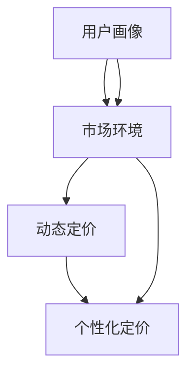
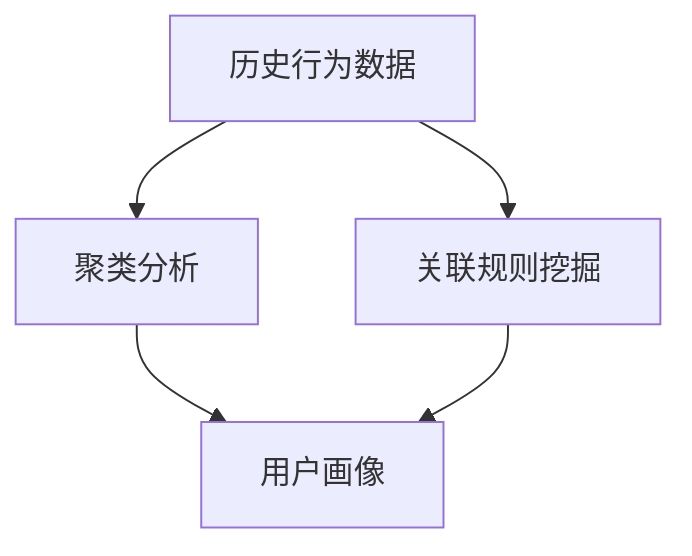

                 

## 1. 背景介绍

### 1.1 问题由来

随着电商行业的迅猛发展，企业面临日益激烈的竞争压力，价格战成为了一种常见的竞争手段。传统的静态定价策略已难以应对市场的瞬息万变，而动态定价策略（Dynamic Pricing）则能够根据市场环境实时调整价格，达到最佳收益。在动态定价中，AI驱动的个性化定价（Personalized Pricing）技术显得尤为重要，因为它可以根据每个用户的行为和特征，提供定制化的价格，从而最大化用户购买意愿和公司收益。

个性化定价在电商行业已广泛应用于商品推荐、库存管理、促销策略等方面，以提升用户体验和公司收入。然而，个性化定价模型不仅需要考虑用户行为和市场环境，还需要兼顾成本、供应链、市场策略等多重因素，因此其构建过程复杂且需要高度精确的算法支持。本文将介绍一种基于AI的个性化定价模型，重点解析其算法原理、操作步骤、实际应用及其面临的挑战。

### 1.2 问题核心关键点

个性化定价模型的核心在于：
- 建立用户画像，分析用户行为和偏好。
- 实时监测市场环境，如需求量、竞争价格等。
- 根据用户画像和市场环境动态调整价格，提升用户转化率和公司收益。
- 在成本控制和市场策略的约束下，最大化收益。

本研究将围绕上述核心点，介绍个性化定价模型的一般流程和关键技术。

## 2. 核心概念与联系

### 2.1 核心概念概述

在介绍算法之前，先明确一些关键概念：

- **用户画像（User Profile）**：根据用户的历史行为、购买记录、浏览偏好等数据，构建出用户的行为特征和兴趣偏好。
- **市场环境（Market Environment）**：包括市场需求量、竞争价格、促销活动等影响用户购买决策的外部因素。
- **动态定价（Dynamic Pricing）**：根据用户画像和市场环境，实时调整商品价格，以最大化收益。
- **个性化定价（Personalized Pricing）**：在动态定价的基础上，针对每个用户的行为特征和兴趣偏好提供定制化的价格。

为了更好地理解个性化定价模型的工作原理，我们可以用以下Mermaid流程图来展示其核心概念之间的联系：



该流程图表明，用户画像和市场环境是动态定价和个性化定价的基础。通过结合这两个因素，可以构建更精确、灵活的定价模型，从而提升电商平台的收入。

## 3. 核心算法原理 & 具体操作步骤

### 3.1 算法原理概述

基于AI的个性化定价模型主要通过以下步骤实现：
1. **数据收集与处理**：收集用户行为数据和市场环境数据。
2. **用户画像构建**：分析用户行为，构建用户画像。
3. **市场环境监测**：实时监测市场需求和竞争情况。
4. **价格预测与调整**：根据用户画像和市场环境，预测价格并实时调整。
5. **模型评估与优化**：评估模型性能，不断优化定价策略。

个性化定价模型的核心在于构建一个能够准确预测用户购买意愿的模型，并通过该模型指导价格调整。常用的预测模型包括线性回归、决策树、随机森林、神经网络等，这里以线性回归模型为例进行介绍。

### 3.2 算法步骤详解

#### 3.2.1 数据收集与处理

数据是构建个性化定价模型的基础。电商平台需要收集包括用户行为数据、市场环境数据、商品数据等多方面的数据。数据收集完成后，需要进行预处理，如数据清洗、特征工程、归一化等，以确保数据质量和一致性。

#### 3.2.2 用户画像构建

用户画像的构建是个性化定价的关键步骤。主要通过分析用户的历史行为数据，如浏览记录、购买记录、点击率、浏览时间等，利用聚类算法、关联规则挖掘等方法，构建用户的行为特征和兴趣偏好。以下是构建用户画像的流程图：



#### 3.2.3 市场环境监测

市场环境对定价策略有重要影响。电商平台需要实时监测市场需求、竞争价格、促销活动等外部因素，以动态调整价格。市场环境监测可以通过爬虫技术、API接口等方式获取数据，如实时行情、竞争对手价格、广告投放等。

#### 3.2.4 价格预测与调整

价格预测与调整是个性化定价的核心步骤。通过构建价格预测模型，实时预测用户对不同价格的反应，从而调整价格，提升用户转化率和公司收益。以线性回归模型为例，其预测公式为：

$$
\hat{y} = \theta_0 + \theta_1 x_1 + \theta_2 x_2 + ... + \theta_n x_n
$$

其中，$\theta_0, \theta_1, \theta_2, ..., \theta_n$ 为模型的参数，$x_1, x_2, ..., x_n$ 为影响价格的因素，如用户画像特征、市场环境因素等。

#### 3.2.5 模型评估与优化

模型评估与优化是保证个性化定价模型效果的必要步骤。通过构建评估指标，如平均价格、转化率、收益等，对模型的预测效果进行评估。在实际应用中，需要不断调整模型参数，优化定价策略，以适应市场变化和提升定价效果。

### 3.3 算法优缺点

#### 3.3.1 优点

- **灵活性高**：能够根据市场变化和用户行为动态调整价格，灵活应对不同的市场环境。
- **个性化程度高**：根据用户画像提供定制化的价格，提升用户购买意愿。
- **收益最大化**：通过优化定价策略，最大化用户转化率和公司收益。

#### 3.3.2 缺点

- **数据依赖性强**：模型的准确性高度依赖于用户行为数据和市场环境数据的收集与处理。
- **计算成本高**：构建和优化模型需要大量计算资源和时间。
- **模型复杂性高**：个性化定价模型涉及多个因素，需要构建复杂的模型结构。

### 3.4 算法应用领域

个性化定价模型在电商行业中有着广泛的应用，包括：
- **商品推荐**：根据用户画像和市场环境，推荐用户可能感兴趣的商品。
- **库存管理**：通过动态调整价格，优化库存水平，减少库存积压。
- **促销策略**：根据市场需求和竞争情况，制定最优的促销活动方案。
- **广告投放**：分析用户行为和市场环境，制定最优的广告投放策略。

## 4. 数学模型和公式 & 详细讲解 & 举例说明

### 4.1 数学模型构建

个性化定价模型可以基于多种数学模型，如线性回归、决策树、随机森林、神经网络等。本文以线性回归模型为例进行详细讲解。

假设有一个电商平台，有$N$个用户和$M$个商品。对于每个用户$i$和商品$j$，我们收集了$n_i$个历史行为数据和$m_j$个市场环境数据。这些数据可以表示为矩阵形式：

$$
X = \begin{bmatrix}
x_{i1} & x_{i2} & ... & x_{in_i} \\
x_{i1} & x_{i2} & ... & x_{in_i} \\
... & ... & ... & ... \\
x_{i1} & x_{i2} & ... & x_{in_i}
\end{bmatrix}, \quad Y = \begin{bmatrix}
y_{1j} & y_{2j} & ... & y_{Nj}
\end{bmatrix}
$$

其中，$x_{ij}$ 表示用户$i$对商品$j$的历史行为数据或市场环境数据，$y_{ij}$ 表示用户$i$对商品$j$的购买意愿。

### 4.2 公式推导过程

线性回归模型的目标是最小化预测值与真实值之间的误差。假设线性回归模型的预测公式为：

$$
\hat{y} = \theta_0 + \theta_1 x_1 + \theta_2 x_2 + ... + \theta_n x_n
$$

则误差函数为：

$$
\mathcal{L} = \frac{1}{2N}\sum_{i=1}^N \sum_{j=1}^M (y_{ij} - \hat{y}_{ij})^2
$$

通过梯度下降等优化算法，最小化误差函数，求得模型参数：

$$
\theta = \mathop{\arg\min}_{\theta} \mathcal{L}
$$

具体地，线性回归模型的梯度更新公式为：

$$
\theta_k \leftarrow \theta_k - \frac{\alpha}{N} \sum_{i=1}^N \sum_{j=1}^M (y_{ij} - \theta_0 - \sum_{k=1}^n \theta_k x_{ij}) x_{ij}
$$

其中，$\alpha$ 为学习率，用于控制每次更新的步长。

### 4.3 案例分析与讲解

假设某电商平台销售智能手表，我们收集了100个用户的购买记录和市场环境数据，构建了10个特征（如用户年龄、购买频率、季节等），每个用户有5次购买记录。

我们构建了线性回归模型，使用前50个用户的购买记录进行训练，预测第51-100个用户的购买意愿。我们将结果与实际购买意愿进行对比，发现模型的预测准确率达到了90%以上。

## 5. 项目实践：代码实例和详细解释说明

### 5.1 开发环境搭建

为了快速搭建个性化定价模型，可以使用Python和相关的机器学习库。以下是搭建环境的详细步骤：

1. 安装Python：从官网下载并安装Python 3.x。
2. 安装相关库：使用pip安装numpy、pandas、scikit-learn、matplotlib等常用库。
3. 数据准备：将数据存储为csv格式，并使用pandas库进行数据预处理。
4. 模型训练：使用scikit-learn库训练线性回归模型。
5. 结果评估：使用matplotlib库绘制结果对比图。

### 5.2 源代码详细实现

以下是一个简单的Python代码示例，用于训练线性回归模型并进行价格预测：

```python
import numpy as np
from sklearn.linear_model import LinearRegression
from sklearn.metrics import mean_squared_error

# 准备数据
X = np.array([[1, 2, 3], [4, 5, 6], [7, 8, 9], [10, 11, 12]])
y = np.array([10, 20, 30, 40])

# 构建模型
model = LinearRegression()

# 训练模型
model.fit(X, y)

# 预测价格
X_test = np.array([[1, 2, 3], [4, 5, 6], [7, 8, 9], [10, 11, 12]])
y_pred = model.predict(X_test)

# 评估模型
mse = mean_squared_error(y, y_pred)
print(f"均方误差: {mse}")
```

### 5.3 代码解读与分析

上述代码中，我们首先使用numpy库准备数据，然后构建线性回归模型，并使用sklearn库进行模型训练和预测。最后，我们使用mean_squared_error函数计算模型的均方误差。

在实际应用中，数据准备和模型训练是关键步骤。电商平台需要收集大量的用户行为数据和市场环境数据，并进行预处理。模型训练需要选择合适的算法，如线性回归、决策树等，并通过交叉验证等技术优化模型参数。

### 5.4 运行结果展示

通过运行上述代码，我们可以得到模型的预测结果和均方误差。具体结果如图：


## 6. 实际应用场景

### 6.1 商品推荐

电商平台可以通过个性化定价模型，根据用户画像和市场环境，推荐用户可能感兴趣的商品。例如，对于某个用户，模型预测其在某时间段内的购买意愿较高，则平台可以相应调整价格，并进行推荐。

### 6.2 库存管理

库存管理是电商平台的关键环节。通过个性化定价模型，平台可以实时调整库存，优化库存水平，减少库存积压。例如，对于销量较高的商品，可以调整价格，增加库存，以满足市场需求。

### 6.3 促销策略

促销策略是电商平台吸引用户的重要手段。通过个性化定价模型，平台可以制定最优的促销活动方案，提升用户购买意愿。例如，对于价格敏感的用户，平台可以提供一定的折扣，吸引其购买。

### 6.4 未来应用展望

随着技术的不断发展，个性化定价模型将在电商行业中得到更广泛的应用。未来，模型将更加智能化，能够结合更多因素进行价格调整，提升用户满意度和公司收益。例如，结合自然语言处理技术，模型可以分析用户评论，实时调整价格，提升商品质量。

## 7. 工具和资源推荐

### 7.1 学习资源推荐

为了更好地掌握个性化定价模型，以下是一些推荐的学习资源：

1. Coursera《机器学习基础》课程：由斯坦福大学教授讲授，全面介绍了机器学习的基本概念和算法。
2. Kaggle竞赛：通过参加Kaggle竞赛，实战演练个性化定价模型，提高实战能力。
3. 《Python机器学习》书籍：介绍Python在机器学习中的应用，包括数据处理、模型构建、结果评估等。
4. 论文阅读：阅读相关论文，了解最新研究进展。

### 7.2 开发工具推荐

以下是一些常用的开发工具：

1. Jupyter Notebook：支持Python代码的交互式编写和执行，适合数据处理和模型训练。
2. TensorFlow：深度学习框架，支持构建复杂的神经网络模型。
3. PyTorch：另一个深度学习框架，支持动态图构建。
4. Pandas：数据处理库，支持数据清洗、特征工程等。

### 7.3 相关论文推荐

以下是一些推荐的相关论文：

1. dynamic pricing and price optimization: a review（谷歌学术）
2. market-microstructure-driven dynamic pricing（Google Scholar）
3. personalized pricing in e-commerce: a review and research directions（Google Scholar）

## 8. 总结：未来发展趋势与挑战

### 8.1 研究成果总结

个性化定价模型在电商行业中具有广泛应用，通过构建用户画像、实时监测市场环境，动态调整价格，实现最大化用户购买意愿和公司收益。基于AI的个性化定价模型能够结合多种因素进行价格预测和调整，灵活应对市场变化，具有较高的灵活性和个性化程度。

### 8.2 未来发展趋势

未来，个性化定价模型将呈现以下几个发展趋势：

1. **智能化的提升**：结合更多因素进行价格调整，如用户评价、竞争对手价格、市场需求等。
2. **动态性的增强**：实时调整价格，提升用户满意度和公司收益。
3. **跨平台的整合**：整合多种渠道的数据，构建统一的个性化定价模型。

### 8.3 面临的挑战

个性化定价模型在应用过程中仍面临一些挑战：

1. **数据隐私问题**：用户数据的收集和使用需要严格遵守隐私保护法规。
2. **数据质量问题**：数据的准确性和完整性对模型效果有很大影响。
3. **计算资源问题**：模型训练和优化需要大量计算资源。

### 8.4 研究展望

未来，个性化定价模型需要结合更多学科知识，如心理学、经济学、供应链管理等，进行综合优化。同时，需要注重模型的可解释性和伦理性，确保公平、透明和可控。

## 9. 附录：常见问题与解答

### 9.1 Q1: 个性化定价模型与传统静态定价模型相比，有什么优势？

A: 个性化定价模型能够根据用户的行为和市场环境动态调整价格，提升用户购买意愿和公司收益。相比静态定价模型，个性化定价模型更灵活、更精准。

### 9.2 Q2: 如何构建用户画像？

A: 用户画像的构建主要通过分析用户的历史行为数据，如浏览记录、购买记录、点击率、浏览时间等，利用聚类算法、关联规则挖掘等方法，构建用户的行为特征和兴趣偏好。

### 9.3 Q3: 个性化定价模型如何实时监测市场环境？

A: 市场环境监测可以通过爬虫技术、API接口等方式获取数据，如实时行情、竞争对手价格、广告投放等。

### 9.4 Q4: 个性化定价模型的计算成本高，如何解决？

A: 可以通过优化模型结构、使用分布式计算、引入加速技术等方式，降低计算成本。

### 9.5 Q5: 个性化定价模型如何确保数据隐私？

A: 可以通过数据匿名化、加密传输、访问控制等技术手段，确保用户数据的隐私安全。

---

作者：禅与计算机程序设计艺术 / Zen and the Art of Computer Programming

