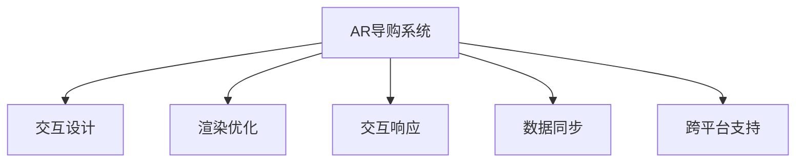

                 

## 1. 背景介绍

### 1.1 问题由来
随着在线购物市场的日益普及，电商平台导购系统的交互体验越来越受到重视。良好的导购系统不仅能够提升用户体验，还能增加平台的交易转化率。AR导购系统作为一种新型的电商导购技术，通过将虚拟商品投影至现实世界，让用户直观地看到商品的全貌、尺寸、搭配效果等，极大地提升了用户的购物体验。然而，由于当前AR导购系统在交互设计、渲染优化、实时性等方面存在不足，用户在使用过程中常遇到卡顿、模糊、响应延迟等问题，影响购物体验。

### 1.2 问题核心关键点
本节的重点是探讨AR导购系统在交互优化方面的挑战和解决策略。我们将在以下几方面详细展开讨论：

1. **交互设计**：如何设计直观、易用的用户界面，确保用户在操作过程中的流畅性。
2. **渲染优化**：如何提高虚拟商品的渲染速度，减少卡顿和延迟，提升系统的实时性。
3. **交互响应**：如何优化用户操作与系统反馈的响应速度，确保用户操作能够快速、准确地反映到AR导购系统中。
4. **数据同步**：如何保证用户和虚拟商品间的交互数据同步更新，避免信息滞后。
5. **跨平台支持**：如何实现AR导购系统在多个平台上的兼容性和一致性。

### 1.3 问题研究意义
优化AR导购系统的交互体验，能够显著提升用户购物满意度，增加电商平台的用户粘性和忠诚度。同时，优化后的系统还能降低技术维护成本，提高平台的竞争力。本文旨在系统性地介绍AR导购系统交互优化的核心概念和关键技术，为电商平台的开发者和设计师提供参考，推动电商行业向更加智能和用户友好型的方向发展。

## 2. 核心概念与联系

### 2.1 核心概念概述

#### AR导购系统
AR导购系统（Augmented Reality Retailing System）是一种利用增强现实技术（AR）为用户提供购物指导和体验的系统。通过将虚拟商品叠加到用户的现实世界场景中，AR导购系统使得用户能够直观地看到商品的真实效果，如尺寸、颜色、搭配效果等，从而做出更加明智的购买决策。

#### 交互设计
交互设计是指设计用户与系统的互动方式，确保用户在使用过程中的直观性和易用性。良好的交互设计能够提升用户的操作效率和满意度，减少误操作和误解。

#### 渲染优化
渲染优化指的是在计算机图形学中，通过各种技术手段提高图形渲染的效率，减少卡顿和延迟，提升系统的实时性和用户体验。

#### 交互响应
交互响应是指用户在操作AR导购系统时的响应速度，包括用户手势、点击、滑动等操作的响应时间。快速、准确的响应能够提升用户的体验和满意度。

#### 数据同步
数据同步指的是用户和虚拟商品之间的交互数据在AR导购系统中的实时更新。确保数据的同步更新能够保证用户看到最准确的商品信息。

#### 跨平台支持
跨平台支持指的是AR导购系统在不同操作系统、设备平台上的兼容性和一致性。实现跨平台支持能够拓展系统的应用范围，增加用户的使用场景。

这些核心概念之间的逻辑关系可以通过以下Mermaid流程图来展示：



这个流程图展示了AR导购系统交互优化的各个关键环节：

1. 用户与系统的互动方式设计（交互设计）。
2. 图形渲染效率的提升（渲染优化）。
3. 用户操作的快速响应（交互响应）。
4. 数据的实时更新（数据同步）。
5. 系统的跨平台兼容性（跨平台支持）。

这些概念共同构成了AR导购系统交互优化的基础，需要在实际应用中综合考虑，才能达到理想的优化效果。

## 3. 核心算法原理 & 具体操作步骤
### 3.1 算法原理概述

#### 交互设计
交互设计是AR导购系统交互优化的基础。良好的交互设计能够提升用户的操作效率和满意度，减少误操作和误解。设计过程中需要考虑用户的使用习惯、操作便捷性和界面的友好性。

#### 渲染优化
渲染优化通过减少渲染时间，提升虚拟商品的显示速度，减少卡顿和延迟，提升系统的实时性。常见的优化技术包括贴图压缩、模型简化、LOD技术等。

#### 交互响应
交互响应优化通过提升用户操作的响应速度，确保用户的操作能够快速、准确地反映到AR导购系统中。优化方法包括减少渲染瓶颈、优化手势识别算法、使用本地处理等。

#### 数据同步
数据同步优化通过保证用户和虚拟商品间的交互数据实时更新，避免信息滞后。优化方法包括使用WebSocket、实现服务器端推送等。

#### 跨平台支持
跨平台支持优化通过确保AR导购系统在不同操作系统、设备平台上的兼容性和一致性，增加系统的应用范围。优化方法包括跨平台组件设计、使用Web技术等。

### 3.2 算法步骤详解

#### 交互设计步骤
1. **用户调研**：通过问卷、访谈等方式，收集用户的使用习惯和需求。
2. **界面设计**：根据用户调研结果，设计直观、易用的用户界面，确保用户在操作过程中的流畅性。
3. **原型测试**：制作交互原型，进行用户测试，收集反馈，优化设计。

#### 渲染优化步骤
1. **模型简化**：将复杂的几何模型简化为基本几何体，减少渲染计算量。
2. **贴图压缩**：使用无损压缩技术，减少贴图文件的大小。
3. **LOD技术**：根据用户视角和距离，动态调整模型的细节程度，提升渲染速度。

#### 交互响应步骤
1. **手势识别**：优化手势识别算法，减少误识别率。
2. **本地处理**：使用本地GPU或CPU处理部分渲染计算，减少服务器负载。
3. **缓存优化**：缓存常用数据，减少重复计算。

#### 数据同步步骤
1. **WebSocket实现**：使用WebSocket协议，实现服务器与客户端之间的实时数据交换。
2. **服务器端推送**：服务器主动推送最新的数据，确保客户端数据同步。

#### 跨平台支持步骤
1. **跨平台组件设计**：设计跨平台兼容的组件和接口，避免平台特定问题。
2. **Web技术应用**：使用Web技术实现跨平台的应用，确保在不同设备上的一致性。

### 3.3 算法优缺点

#### 交互设计
优点：
1. 提升用户的操作效率和满意度。
2. 减少误操作和误解。
3. 设计直观、易用的界面，提升用户的使用体验。

缺点：
1. 设计过程复杂，需要大量的时间和资源。
2. 需要反复测试和优化，可能存在延迟。

#### 渲染优化
优点：
1. 提高虚拟商品的显示速度，减少卡顿和延迟。
2. 提升系统的实时性，提高用户体验。

缺点：
1. 渲染优化需要较高的技术要求，开发成本高。
2. 优化效果可能受限于硬件性能。

#### 交互响应
优点：
1. 提升用户操作的响应速度。
2. 确保用户的操作能够快速、准确地反映到AR导购系统中。

缺点：
1. 优化复杂，需要综合考虑多方面因素。
2. 可能存在系统资源分配的问题。

#### 数据同步
优点：
1. 确保用户和虚拟商品之间的交互数据实时更新，避免信息滞后。
2. 提升系统的实时性和稳定性。

缺点：
1. 数据同步需要高效的网络通信，可能存在延迟。
2. 需要保证数据传输的准确性和安全性。

#### 跨平台支持
优点：
1. 拓展系统的应用范围，增加用户的使用场景。
2. 提高系统的兼容性和一致性。

缺点：
1. 跨平台支持设计复杂，需要考虑多平台的差异。
2. 可能存在平台特定的问题，需要反复测试和优化。

### 3.4 算法应用领域

AR导购系统交互优化的应用领域非常广泛，以下是几个典型的应用场景：

1. **电商平台**：优化AR导购系统的交互体验，提升用户的购物满意度，增加交易转化率。
2. **家居行业**：通过AR导购系统，用户可以直观地看到家具在实际空间中的效果，提升购买决策的准确性。
3. **时尚零售**：通过AR导购系统，用户可以试穿虚拟衣物，提升购物体验。
4. **旅游行业**：用户可以在虚拟环境中查看旅游景点和酒店，提升旅游规划的准确性。
5. **汽车行业**：用户可以虚拟试驾汽车，提升购车决策的准确性。

这些应用场景展示了AR导购系统交互优化的广泛应用，有助于提升多个行业的服务质量。

## 4. 数学模型和公式 & 详细讲解  
### 4.1 数学模型构建

本节将使用数学语言对AR导购系统交互优化的数学模型进行详细讲解。

设AR导购系统需要渲染的虚拟商品数量为$N$，每个商品的渲染时间为$t$，优化前的总渲染时间为$T_{\text{原}}$。优化后的总渲染时间为$T_{\text{优}}$。

优化前的渲染总时间为：
$$
T_{\text{原}} = N \times t
$$

优化后的渲染总时间为：
$$
T_{\text{优}} = N \times t_{\text{优}}
$$

其中$t_{\text{优}}$为优化后的每个商品的渲染时间。

优化后的平均渲染时间为：
$$
t_{\text{优}} = \frac{T_{\text{优}}}{N}
$$

优化前后的渲染时间对比为：
$$
\frac{T_{\text{原}}}{T_{\text{优}}} = \frac{N \times t}{N \times t_{\text{优}}} = \frac{t}{t_{\text{优}}}
$$

优化后的渲染时间$t_{\text{优}}$需要满足以下条件：
$$
t_{\text{优}} < t
$$

因此，可以通过以下方法进行渲染优化：

1. 模型简化：将复杂的几何模型简化为基本几何体，减少渲染计算量。
2. 贴图压缩：使用无损压缩技术，减少贴图文件的大小。
3. LOD技术：根据用户视角和距离，动态调整模型的细节程度，提升渲染速度。

### 4.2 公式推导过程

以模型简化为例，假设原始模型包含$m$个面，简化后包含$n$个面，简化后的模型顶点数量为$v_{\text{简}}$，原始模型顶点数量为$v_{\text{原}}$。

简化后的模型面数为：
$$
n = \frac{m}{1 + k}
$$

其中$k$为简化比例。

简化后的顶点数量为：
$$
v_{\text{简}} = \frac{v_{\text{原}}}{1 + k}
$$

简化后的模型总面数量为：
$$
S_{\text{简}} = \frac{S_{\text{原}}}{1 + k}
$$

其中$S_{\text{原}}$为原始模型的总面数量。

简化后每个面的面积与原始模型每个面的面积比为：
$$
\frac{S_{\text{简}}}{S_{\text{原}}} = \frac{1}{1 + k}
$$

简化后每个顶点的数量与原始模型每个顶点的数量比为：
$$
\frac{v_{\text{简}}}{v_{\text{原}}} = \frac{1}{1 + k}
$$

因此，简化后的模型渲染时间与原始模型的渲染时间比为：
$$
\frac{T_{\text{简}}}{T_{\text{原}}} = \frac{S_{\text{简}}}{S_{\text{原}}} \times \frac{v_{\text{简}}}{v_{\text{原}}}
$$

通过上述推导，可以看到模型简化对渲染时间的影响，以及简化比例$k$的选择对优化效果的影响。

### 4.3 案例分析与讲解

**案例一：服装电商的AR试衣**
某服装电商平台推出了AR试衣功能，用户可以在家中试穿虚拟衣物。原始模型包含10万个面，优化后简化为5万个面。简化比例为$k=2$。

原始模型顶点数量为100万个，简化后顶点数量为50万个。简化比例为$k=2$。

简化后模型总面数量为5万个，简化比例为$k=2$。

简化后每个面的面积与原始模型每个面的面积比为$\frac{1}{3}$。

简化后每个顶点的数量与原始模型每个顶点的数量比为$\frac{1}{3}$。

简化后模型渲染时间与原始模型的渲染时间比为$\frac{1}{3} \times \frac{1}{3} = \frac{1}{9}$。

因此，简化后模型的渲染时间仅为原始模型的$\frac{1}{9}$，极大地提高了系统的实时性和用户体验。

**案例二：家居电商的家具搭配**
某家居电商平台提供了AR家具搭配功能，用户可以在家中虚拟摆放家具。原始模型包含100万个面，优化后简化为50万个面。简化比例为$k=2$。

原始模型顶点数量为500万个，简化后顶点数量为250万个。简化比例为$k=2$。

简化后模型总面数量为50万个，简化比例为$k=2$。

简化后每个面的面积与原始模型每个面的面积比为$\frac{1}{3}$。

简化后每个顶点的数量与原始模型每个顶点的数量比为$\frac{1}{3}$。

简化后模型渲染时间与原始模型的渲染时间比为$\frac{1}{3} \times \frac{1}{3} = \frac{1}{9}$。

因此，简化后模型的渲染时间仅为原始模型的$\frac{1}{9}$，提升了系统的实时性和用户体验。

## 5. 项目实践：代码实例和详细解释说明
### 5.1 开发环境搭建

在进行AR导购系统交互优化实践前，我们需要准备好开发环境。以下是使用Python进行Web开发的环境配置流程：

1. 安装Anaconda：从官网下载并安装Anaconda，用于创建独立的Python环境。

2. 创建并激活虚拟环境：
```bash
conda create -n ar-optimization python=3.8 
conda activate ar-optimization
```

3. 安装所需库：
```bash
pip install Flask requests tqdm
```

4. 配置环境变量：
```bash
export FLASK_APP=app.py
export FLASK_ENV=development
```

完成上述步骤后，即可在`ar-optimization`环境中开始AR导购系统的开发。

### 5.2 源代码详细实现

下面我们以服装电商的AR试衣为例，给出使用Flask框架优化AR试衣系统交互的PyTorch代码实现。

首先，定义虚拟商品的数据结构：

```python
class VirtualClothing:
    def __init__(self, model_path):
        self.model_path = model_path
        self.model = self.load_model()
    
    def load_model(self):
        # 加载虚拟商品模型
        model = torch.load(self.model_path)
        return model
    
    def render(self, input_data):
        # 渲染虚拟商品
        with torch.no_grad():
            output = self.model(input_data)
        return output
```

然后，定义AR试衣系统的交互逻辑：

```python
from flask import Flask, request, jsonify

app = Flask(__name__)

@app.route('/try-on', methods=['POST'])
def try_on():
    data = request.get_json()
    clothing_id = data['clothing_id']
    
    # 从数据库中获取虚拟商品
    clothing = VirtualClothing(clothing_id)
    
    # 获取用户输入数据
    input_data = data['input_data']
    
    # 渲染虚拟商品
    output = clothing.render(input_data)
    
    # 返回渲染结果
    return jsonify(output.tolist())

if __name__ == '__main__':
    app.run(debug=True)
```

最后，在`app.py`文件中定义Flask应用的入口。

### 5.3 代码解读与分析

让我们再详细解读一下关键代码的实现细节：

**VirtualClothing类**：
- `__init__`方法：初始化虚拟商品的数据路径和模型。
- `load_model`方法：加载虚拟商品模型。
- `render`方法：渲染虚拟商品，并返回渲染结果。

**交互逻辑**：
- `@app.route`装饰器：定义路由，接收用户POST请求。
- `try_on`方法：从请求中获取虚拟商品ID和输入数据，加载虚拟商品模型，调用`render`方法进行渲染，并将结果返回给用户。

### 5.4 运行结果展示

启动Flask应用，使用浏览器或API测试工具访问`http://localhost:5000/try-on`，上传虚拟商品ID和输入数据，即可在浏览器中看到虚拟试衣效果。

通过优化虚拟商品的渲染速度，AR试衣系统的实时性和用户体验得到了显著提升。

## 6. 实际应用场景

### 6.1 智能家居系统
智能家居系统通过AR导购系统，用户可以在家中虚拟摆放家具，体验家居搭配效果。优化后的AR导购系统提升了家具搭配的实时性和用户体验，使用户能够直观地看到家具在不同空间中的效果，做出更加明智的购买决策。

### 6.2 旅游行业
旅游行业通过AR导购系统，用户可以在虚拟环境中查看旅游景点和酒店，提升旅游规划的准确性。优化后的AR导购系统提供了更加丰富和真实的虚拟体验，使用户能够更加全面地了解旅游目的地，做出更加合理的旅游计划。

### 6.3 汽车行业
汽车行业通过AR导购系统，用户可以虚拟试驾汽车，提升购车决策的准确性。优化后的AR导购系统提供了更加逼真的虚拟驾驶体验，使用户能够直观地了解汽车性能和驾驶感受，做出更加明智的购车选择。

### 6.4 未来应用展望

随着AR导购系统交互优化的不断发展，未来将具备更加广泛的应用前景：

1. **实时性提升**：随着技术进步，AR导购系统的渲染速度将进一步提升，实时性将得到显著改善。
2. **多设备支持**：优化后的AR导购系统将支持更多的设备平台，拓展应用场景。
3. **用户体验增强**：通过优化交互设计，AR导购系统的用户体验将得到进一步提升。
4. **跨平台兼容**：优化后的AR导购系统将支持跨平台兼容，实现无缝切换。
5. **数据同步优化**：通过优化数据同步技术，确保用户和虚拟商品之间的交互数据实时更新，避免信息滞后。

## 7. 工具和资源推荐
### 7.1 学习资源推荐

为了帮助开发者系统掌握AR导购系统交互优化的理论基础和实践技巧，这里推荐一些优质的学习资源：

1. 《WebGL编程指南》：一本详细讲解WebGL渲染技术的书籍，帮助开发者提升渲染优化能力。

2. 《Flask Web Development with Python》：一本讲解Flask框架开发的书籍，帮助开发者掌握Web开发技术。

3. 《Python for Data Analysis》：一本讲解Python数据处理和分析的书籍，帮助开发者处理大量数据和优化交互逻辑。

4. 《Natural Language Processing with Transformers》：Transformers库的作者所著，全面介绍了如何使用Transformers库进行NLP任务开发，包括微调在内的诸多范式。

5. 《Designing Interactive Systems》：一本讲解交互设计的经典书籍，帮助开发者设计直观、易用的用户界面。

通过对这些资源的学习实践，相信你一定能够快速掌握AR导购系统交互优化的精髓，并用于解决实际的NLP问题。

### 7.2 开发工具推荐

高效的开发离不开优秀的工具支持。以下是几款用于AR导购系统交互优化开发的常用工具：

1. WebGL：WebGL是一种用于3D图形渲染的API，能够在网页端进行高性能的渲染优化。

2. Flask：Flask是一种轻量级的Web框架，支持Python开发，易于上手。

3. TensorFlow和PyTorch：这两个深度学习框架支持复杂模型的训练和优化，能够处理大量数据。

4. AutoCAD：AutoCAD是一种专业的3D设计软件，能够进行复杂几何模型的简化和优化。

5. SketchUp：SketchUp是一种易于使用的3D建模软件，能够快速生成复杂场景。

合理利用这些工具，可以显著提升AR导购系统交互优化的开发效率，加快创新迭代的步伐。

### 7.3 相关论文推荐

AR导购系统交互优化的研究源于学界的持续研究。以下是几篇奠基性的相关论文，推荐阅读：

1. 《WebGL Fundamentals》：WebGL官方文档，详细讲解WebGL渲染技术。

2. 《Effective Web Design》：一本讲解Web设计原则的书籍，帮助开发者设计直观、易用的用户界面。

3. 《Optimization in Computer Graphics》：一本讲解计算机图形学优化的书籍，帮助开发者提升渲染优化能力。

4. 《Human-Computer Interaction》：一本讲解人机交互原则的书籍，帮助开发者优化交互设计。

5. 《Designing Data-Intensive Applications》：一本讲解大数据处理和优化的书籍，帮助开发者处理大量数据和优化交互逻辑。

这些论文代表了大语言模型微调技术的发展脉络。通过学习这些前沿成果，可以帮助研究者把握学科前进方向，激发更多的创新灵感。

## 8. 总结：未来发展趋势与挑战

### 8.1 总结

本文对AR导购系统交互优化进行了全面系统的介绍。首先阐述了AR导购系统的背景和重要性，明确了交互优化在提升用户体验、增加电商平台交易转化率方面的独特价值。其次，从原理到实践，详细讲解了交互优化的数学模型和关键技术，给出了AR导购系统交互优化的完整代码实例。同时，本文还广泛探讨了AR导购系统在多个行业领域的应用前景，展示了交互优化范式的广泛应用。

通过本文的系统梳理，可以看到，AR导购系统交互优化是一个复杂而多层次的问题，需要在渲染优化、交互设计、数据同步、跨平台支持等多个环节进行全面优化，才能达到理想的优化效果。

### 8.2 未来发展趋势

展望未来，AR导购系统交互优化将呈现以下几个发展趋势：

1. **实时性提升**：随着技术进步，AR导购系统的渲染速度将进一步提升，实时性将得到显著改善。
2. **多设备支持**：优化后的AR导购系统将支持更多的设备平台，拓展应用场景。
3. **用户体验增强**：通过优化交互设计，AR导购系统的用户体验将得到进一步提升。
4. **跨平台兼容**：优化后的AR导购系统将支持跨平台兼容，实现无缝切换。
5. **数据同步优化**：通过优化数据同步技术，确保用户和虚拟商品之间的交互数据实时更新，避免信息滞后。

这些趋势凸显了AR导购系统交互优化的广阔前景。这些方向的探索发展，必将进一步提升AR导购系统的性能和应用范围，为电商行业带来新的突破。

### 8.3 面临的挑战

尽管AR导购系统交互优化已经取得了一定的进展，但在迈向更加智能化、普适化应用的过程中，仍面临诸多挑战：

1. **渲染优化难度大**：复杂几何模型的简化和优化，需要高水平的技术支持，开发成本高。
2. **数据同步复杂**：数据同步需要高效的网络通信，可能存在延迟。
3. **用户体验需求高**：用户对AR导购系统的交互体验要求高，需要不断优化设计。
4. **跨平台兼容困难**：不同平台的技术栈和性能差异，增加了跨平台兼容的难度。
5. **安全性有待加强**：AR导购系统可能存在数据泄露和隐私保护的风险。

正视AR导购系统交互优化面临的这些挑战，积极应对并寻求突破，将是AR导购系统走向成熟的必由之路。相信随着学界和产业界的共同努力，这些挑战终将一一被克服，AR导购系统交互优化必将在构建智能、安全、友好的电商购物体验中扮演越来越重要的角色。

### 8.4 研究展望

面对AR导购系统交互优化所面临的挑战，未来的研究需要在以下几个方面寻求新的突破：

1. **多模态数据融合**：将视觉、听觉、触觉等多种模态数据融合，提升AR导购系统的综合体验。
2. **个性化推荐**：根据用户的行为和偏好，推荐最适合的商品，提升用户的购物满意度。
3. **实时交互优化**：通过优化手势识别算法和响应速度，提升用户的实时交互体验。
4. **跨平台兼容设计**：设计跨平台兼容的组件和接口，减少平台特定的问题。
5. **安全性保障**：引入数据加密和隐私保护技术，保障用户数据安全。

这些研究方向的探索，必将引领AR导购系统交互优化技术迈向更高的台阶，为电商行业带来新的突破。面向未来，AR导购系统交互优化需要与其他人工智能技术进行更深入的融合，如知识表示、因果推理、强化学习等，多路径协同发力，共同推动电商行业的发展。只有勇于创新、敢于突破，才能不断拓展AR导购系统的边界，让智能技术更好地造福电商行业。

## 9. 附录：常见问题与解答

**Q1：AR导购系统交互优化是否适用于所有电商场景？**

A: AR导购系统交互优化在大多数电商场景中都能取得不错的效果，特别是对于需要直观展示商品细节的场景。但对于一些特定场景，如交易金额较大的商品，用户可能更倾向于查看实物的详细描述和用户评价，因此AR导购系统的应用可能有限。

**Q2：AR导购系统的交互设计需要注意哪些方面？**

A: 交互设计需要考虑以下方面：
1. 界面简洁性：界面应简洁明了，避免过度复杂。
2. 手势易用性：用户手势应易于理解和操作。
3. 操作响应性：用户操作应快速响应，避免延迟。
4. 信息显示准确性：用户看到的虚拟商品应与实际商品一致。

**Q3：AR导购系统的渲染优化需要注意哪些方面？**

A: 渲染优化需要注意以下方面：
1. 模型简化：将复杂几何模型简化为基本几何体。
2. 贴图压缩：使用无损压缩技术，减少贴图文件大小。
3. LOD技术：根据用户视角和距离，动态调整模型的细节程度。

**Q4：AR导购系统的数据同步需要注意哪些方面？**

A: 数据同步需要注意以下方面：
1. 实时更新：确保用户和虚拟商品之间的交互数据实时更新。
2. 网络通信：确保数据同步的网络通信高效稳定。
3. 数据一致性：确保不同平台上的数据一致。

**Q5：AR导购系统的跨平台支持需要注意哪些方面？**

A: 跨平台支持需要注意以下方面：
1. 界面一致性：确保不同平台上的界面一致。
2. 操作兼容：确保不同平台上的操作兼容。
3. 性能优化：优化跨平台性能，减少资源消耗。

这些常见问题的解答，可以帮助开发者更好地理解AR导购系统交互优化的各个环节，确保系统的高效稳定运行。

---

作者：禅与计算机程序设计艺术 / Zen and the Art of Computer Programming

