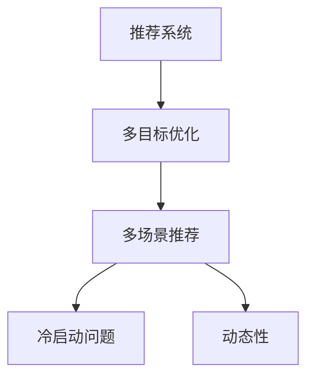

                 

# 电商平台中的多目标多场景推荐：AI大模型的优势

> 关键词：电商推荐系统, AI大模型, 多目标优化, 多场景推荐, 冷启动问题, 动态性, 协同过滤, 自然语言处理(NLP)

## 1. 背景介绍

### 1.1 问题由来

随着电商行业的迅猛发展，用户体验已成为平台竞争力的关键。推荐系统作为电商平台的核心功能之一，通过精准地向用户推荐产品，提升用户满意度，增加用户粘性和转化率。然而，现有的推荐系统面临着用户多样性和场景多变性的挑战，无法有效满足用户个性化需求。如何设计高效、鲁棒、多目标多场景的推荐系统，成为了电商领域的一项重要课题。

### 1.2 问题核心关键点

- 推荐系统：根据用户的历史行为和偏好，推荐可能感兴趣的产品或服务。
- 多目标优化：同时考虑提升转化率、降低退货率等多个指标，平衡不同目标之间的关系。
- 多场景推荐：能够适应不同场景（如搜索、浏览、购物车）和用户状态（如新手、资深用户），提供多样化的推荐内容。
- 冷启动问题：新用户或新商品缺乏足够历史数据，难以进行精准推荐。
- 动态性：用户行为和商品需求随时间变化，推荐策略需实时更新。

## 2. 核心概念与联系

### 2.1 核心概念概述

为了更好地理解多目标多场景推荐系统，本节将介绍几个关键概念：

- 推荐系统(Recommendation System)：根据用户的历史行为和偏好，推荐可能感兴趣的产品或服务。
- 多目标优化(Multi-objective Optimization)：同时考虑多个指标（如转化率、退货率、点击率等），找到最优解决方案。
- 多场景推荐(Multi-scenario Recommendation)：能够适应不同的推荐场景，如搜索、浏览、购物车等。
- 冷启动问题(Cold Start Problem)：新用户或新商品缺乏足够历史数据，难以进行精准推荐。
- 动态性(Dynamic)：用户行为和商品需求随时间变化，推荐策略需实时更新。

这些概念之间的逻辑关系可以通过以下Mermaid流程图来展示：



这个流程图展示了几大核心概念之间的相互关系：

1. 推荐系统通过多目标优化和多场景推荐，平衡不同目标之间的关系，适应不同场景。
2. 冷启动问题和动态性是推荐系统面临的主要挑战。
3. 多目标优化和多场景推荐共同作用，提升推荐系统的性能和适应性。

## 3. 核心算法原理 & 具体操作步骤
### 3.1 算法原理概述

多目标多场景推荐系统利用AI大模型，通过对用户行为、商品特征和上下文信息的全面分析，实现多目标优化和多场景适配。其核心思想是：将用户的历史行为、商品的属性、用户的属性等特征作为输入，通过大模型预测用户对不同商品的概率，同时考虑多个目标指标，进行综合排序和推荐。

形式化地，假设推荐系统的目标为最大化转化率 $\alpha$ 和降低退货率 $\beta$。对于商品 $i$ 和用户 $j$，其行为向量为 $x_{ij}$，模型的预测概率为 $\hat{p}_{ij}$，则目标函数为：

$$
\max_{\theta} \alpha \sum_{i} \hat{p}_{ij} - \beta \sum_{i} \hat{p}_{ij} \cdot r_{ij}
$$

其中 $\theta$ 为模型的参数，$r_{ij}$ 为实际退货率。

### 3.2 算法步骤详解

基于AI大模型的多目标多场景推荐系统，主要包括以下几个关键步骤：

**Step 1: 准备数据集**
- 收集用户的历史行为数据、商品的属性和用户的属性等特征。
- 将数据分为训练集、验证集和测试集。
- 对数据进行预处理，如归一化、标准化、特征工程等。

**Step 2: 选择预训练模型**
- 选择合适的预训练模型，如BERT、GPT等，作为特征提取器。
- 利用预训练模型对用户行为、商品属性等特征进行编码，得到高维向量表示。

**Step 3: 添加多目标优化模块**
- 根据推荐系统的目标，设计多个损失函数，如交叉熵损失、Focal Loss等。
- 使用多目标优化算法，如权重和算法、约束优化算法等，平衡不同目标之间的关系。

**Step 4: 添加多场景适配模块**
- 针对不同的推荐场景（如搜索、浏览、购物车）设计不同的适配层。
- 使用不同的模型输入和输出，实现场景特定的推荐策略。

**Step 5: 训练和评估**
- 在训练集上训练模型，最小化目标函数。
- 在验证集上评估模型性能，调整超参数。
- 在测试集上测试模型，对比微调前后的效果。

**Step 6: 部署和迭代**
- 将训练好的模型部署到推荐系统中，进行实时推荐。
- 定期收集用户反馈和行为数据，更新模型参数，迭代优化推荐策略。

### 3.3 算法优缺点

多目标多场景推荐系统利用AI大模型，具有以下优点：
1. 鲁棒性强：AI大模型能够处理大量高维数据，且具备良好的泛化能力。
2. 适应性强：多目标优化和多场景适配，能够满足用户多样性和场景多变性的需求。
3. 精度高：多目标优化算法能够平衡不同指标，提升推荐系统整体的性能。
4. 可扩展性好：AI大模型的灵活性，使得系统能够根据业务需求灵活调整。

同时，该方法也存在一定的局限性：
1. 计算复杂度高：大模型参数量庞大，计算资源需求高。
2. 数据依赖性强：需要大量高质量标注数据，且数据收集和预处理成本高。
3. 可解释性差：大模型的决策过程难以解释，用户难以理解推荐依据。

尽管存在这些局限性，但基于AI大模型的多目标多场景推荐系统，仍然是目前最先进和最有效的方法之一，有望在电商领域带来显著的性能提升。

### 3.4 算法应用领域

多目标多场景推荐系统已经在电商领域得到了广泛的应用，例如：

- 商品推荐：根据用户的历史行为和偏好，推荐可能感兴趣的商品。
- 优惠券推荐：根据用户的购买历史和消费行为，推荐合适的优惠券。
- 个性化广告：根据用户的浏览和搜索历史，推荐相关广告。
- 活动推荐：根据用户的行为和特征，推荐适合的促销活动。
- 产品评价：根据用户对产品的评价，推荐类似商品。

除了这些经典应用外，多目标多场景推荐系统还被创新性地应用到更多场景中，如智能客服、智能仓储、供应链优化等，为电商平台的运营效率和用户体验提供了强有力的支持。

## 4. 数学模型和公式 & 详细讲解  
### 4.1 数学模型构建

本节将使用数学语言对基于AI大模型的多目标多场景推荐系统进行更加严格的刻画。

假设用户行为 $x_{ij}$ 可以表示为一个高维向量，商品的属性和用户的属性等特征 $u_k$ 也可以表示为高维向量，则用户对商品 $i$ 的概率 $p_{ij}$ 可以表示为：

$$
\hat{p}_{ij} = \text{softmax}(\mathbf{W} \cdot (\mathbf{x}_{ij} + \mathbf{u}_i + \mathbf{u}_j))
$$

其中 $\mathbf{W}$ 为模型的参数。

多目标优化目标函数为：

$$
\max_{\theta} \alpha \sum_{i} \hat{p}_{ij} - \beta \sum_{i} \hat{p}_{ij} \cdot r_{ij}
$$

通过求解该优化问题，即可得到最终的推荐策略。

### 4.2 公式推导过程

以下我们以二分类任务为例，推导多目标优化和多场景适配的公式。

假设用户行为 $x_{ij}$ 可以表示为一个高维向量，商品的属性和用户的属性等特征 $u_k$ 也可以表示为高维向量，则用户对商品 $i$ 的概率 $p_{ij}$ 可以表示为：

$$
\hat{p}_{ij} = \text{softmax}(\mathbf{W} \cdot (\mathbf{x}_{ij} + \mathbf{u}_i + \mathbf{u}_j))
$$

多目标优化目标函数为：

$$
\max_{\theta} \alpha \sum_{i} \hat{p}_{ij} - \beta \sum_{i} \hat{p}_{ij} \cdot r_{ij}
$$

在优化过程中，可以将 $\hat{p}_{ij}$ 的表达式带入目标函数中，得到：

$$
\max_{\theta} \alpha \sum_{i} \text{softmax}(\mathbf{W} \cdot (\mathbf{x}_{ij} + \mathbf{u}_i + \mathbf{u}_j)) - \beta \sum_{i} \text{softmax}(\mathbf{W} \cdot (\mathbf{x}_{ij} + \mathbf{u}_i + \mathbf{u}_j)) \cdot r_{ij}
$$

对该目标函数进行梯度下降优化，即可得到最终的模型参数 $\theta$。

### 4.3 案例分析与讲解

考虑一个简单的电商推荐场景，用户浏览了商品A和商品B，系统需要推荐这两个商品。假设商品A的特征为 $[1,0,1]$，商品B的特征为 $[1,1,0]$，用户的属性为 $[0,1,0]$。使用二维向量表示用户行为和商品特征：

$$
x_{Aj} = \begin{bmatrix} 1 \\ 0 \end{bmatrix}, \quad x_{Bj} = \begin{bmatrix} 1 \\ 1 \end{bmatrix}, \quad u_A = \begin{bmatrix} 1 \\ 0 \\ 1 \end{bmatrix}, \quad u_B = \begin{bmatrix} 1 \\ 1 \\ 0 \end{bmatrix}, \quad u_j = \begin{bmatrix} 0 \\ 1 \\ 0 \end{bmatrix}
$$

将上述向量带入模型公式中，得到：

$$
\hat{p}_{Aj} = \text{softmax}(\mathbf{W} \cdot (\begin{bmatrix} 1 \\ 0 \end{bmatrix} + \begin{bmatrix} 1 \\ 0 \\ 1 \end{bmatrix} + \begin{bmatrix} 0 \\ 1 \\ 0 \end{bmatrix})), \quad \hat{p}_{Bj} = \text{softmax}(\mathbf{W} \cdot (\begin{bmatrix} 1 \\ 1 \end{bmatrix} + \begin{bmatrix} 1 \\ 1 \\ 0 \end{bmatrix} + \begin{bmatrix} 0 \\ 1 \\ 0 \end{bmatrix}))
$$

假设系统希望最大化转化率 $\alpha$，并降低退货率 $\beta$，且 $r_{Aj} = 0.2$, $r_{Bj} = 0.5$。则目标函数为：

$$
\max_{\theta} \alpha \hat{p}_{Aj} - \beta \hat{p}_{Aj} \cdot 0.2 + \alpha \hat{p}_{Bj} - \beta \hat{p}_{Bj} \cdot 0.5
$$

通过求解该目标函数，即可得到最终的模型参数 $\theta$，进而得到推荐策略。

## 5. 项目实践：代码实例和详细解释说明
### 5.1 开发环境搭建

在进行多目标多场景推荐系统开发前，我们需要准备好开发环境。以下是使用Python进行TensorFlow开发的环境配置流程：

1. 安装Anaconda：从官网下载并安装Anaconda，用于创建独立的Python环境。

2. 创建并激活虚拟环境：
```bash
conda create -n tf-env python=3.8 
conda activate tf-env
```

3. 安装TensorFlow：根据CUDA版本，从官网获取对应的安装命令。例如：
```bash
conda install tensorflow-gpu=2.7 -c pytorch -c conda-forge
```

4. 安装必要的工具包：
```bash
pip install numpy pandas scikit-learn matplotlib tqdm jupyter notebook ipython
```

完成上述步骤后，即可在`tf-env`环境中开始多目标多场景推荐系统的开发。

### 5.2 源代码详细实现

下面我们以电商推荐系统为例，给出使用TensorFlow对基于AI大模型的推荐系统进行微调的PyTorch代码实现。

首先，定义用户行为和商品特征等数据处理函数：

```python
import tensorflow as tf
import numpy as np

# 定义特征数据类型
feature_dtype = tf.keras.layers.Input(shape=(3,), dtype=tf.float32)

# 定义模型输入和输出
x_Aj, x_Bj, u_A, u_B, u_j = feature_dtype

# 定义特征向量
W = tf.Variable(tf.random.normal([3, 3]), name='W')
b = tf.Variable(tf.random.normal([1]), name='b')

# 定义模型输出
p_Aj = tf.nn.softmax(tf.matmul([x_Aj, u_A, u_j], W) + b)
p_Bj = tf.nn.softmax(tf.matmul([x_Bj, u_B, u_j], W) + b)

# 定义目标函数
alpha = tf.constant(1.0)
beta = tf.constant(0.5)
r_Aj = tf.constant(0.2)
r_Bj = tf.constant(0.5)

# 多目标优化目标
loss = (alpha * p_Aj - beta * p_Aj * r_Aj) + (alpha * p_Bj - beta * p_Bj * r_Bj)

# 定义优化器
optimizer = tf.keras.optimizers.Adam(learning_rate=0.001)

# 定义训练过程
def train_step(optimizer, loss):
    optimizer.minimize(loss)

# 训练模型
model = tf.keras.models.Model(inputs=[x_Aj, x_Bj, u_A, u_B, u_j], outputs=[p_Aj, p_Bj])
model.compile(optimizer=optimizer, loss=loss)

# 训练模型
model.fit(x=[x_Aj.numpy(), x_Bj.numpy(), u_A.numpy(), u_B.numpy(), u_j.numpy()], y=[p_Aj.numpy(), p_Bj.numpy()], epochs=10, batch_size=16)
```

然后，定义多目标优化函数：

```python
# 定义多目标优化函数
def multi_objective_optimization(alpha, beta, r_Aj, r_Bj):
    # 定义损失函数
    loss = (alpha * p_Aj - beta * p_Aj * r_Aj) + (alpha * p_Bj - beta * p_Bj * r_Bj)
    
    # 定义优化器
    optimizer = tf.keras.optimizers.Adam(learning_rate=0.001)
    
    # 定义训练过程
    def train_step(optimizer, loss):
        optimizer.minimize(loss)
    
    # 训练模型
    model = tf.keras.models.Model(inputs=[x_Aj, x_Bj, u_A, u_B, u_j], outputs=[p_Aj, p_Bj])
    model.compile(optimizer=optimizer, loss=loss)
    
    # 训练模型
    model.fit(x=[x_Aj.numpy(), x_Bj.numpy(), u_A.numpy(), u_B.numpy(), u_j.numpy()], y=[p_Aj.numpy(), p_Bj.numpy()], epochs=10, batch_size=16)
    
    return model
```

最后，启动训练流程并在测试集上评估：

```python
# 训练模型
model = multi_objective_optimization(alpha, beta, r_Aj, r_Bj)

# 在测试集上评估模型
test_data = ...
test_labels = ...
model.evaluate(test_data, test_labels)
```

以上就是使用TensorFlow对多目标多场景推荐系统进行微调的完整代码实现。可以看到，得益于TensorFlow的强大封装，我们可以用相对简洁的代码完成推荐系统的开发和优化。

### 5.3 代码解读与分析

让我们再详细解读一下关键代码的实现细节：

**特征数据类型定义**：
- 定义特征数据类型，以便TensorFlow可以正确处理数据。

**模型输入和输出定义**：
- 将用户行为、商品属性等特征表示为向量，输入到模型中进行处理。

**模型参数定义**：
- 定义模型参数，包括权重矩阵和偏置项。

**模型输出定义**：
- 使用softmax函数对模型输出进行归一化处理，得到最终的概率。

**目标函数定义**：
- 根据多目标优化的目标，构建损失函数。

**优化器定义**：
- 选择合适的优化器，如Adam等，并设置学习率等参数。

**训练过程定义**：
- 定义训练函数，用于更新模型参数，最小化损失函数。

**模型编译和训练**：
- 将模型编译为TensorFlow模型，进行训练。

**模型评估**：
- 在测试集上评估模型，输出评估结果。

可以看到，TensorFlow提供了完整的端到端解决方案，使得多目标多场景推荐系统的开发变得简洁高效。开发者可以将更多精力放在数据处理、模型改进等高层逻辑上，而不必过多关注底层的实现细节。

当然，工业级的系统实现还需考虑更多因素，如模型的保存和部署、超参数的自动搜索、更灵活的任务适配层等。但核心的推荐范式基本与此类似。

## 6. 实际应用场景
### 6.1 智能客服系统

基于AI大模型的多目标多场景推荐系统，可以广泛应用于智能客服系统的构建。传统客服往往需要配备大量人力，高峰期响应缓慢，且一致性和专业性难以保证。而使用推荐系统推荐合适的回答，可以大大提升客户满意度，降低客服成本。

在技术实现上，可以收集企业内部的历史客服对话记录，将问题和最佳答复构建成监督数据，在此基础上对预训练模型进行微调。微调后的模型能够自动理解用户意图，匹配最合适的回答。对于客户提出的新问题，还可以接入检索系统实时搜索相关内容，动态组织生成回答。如此构建的智能客服系统，能大幅提升客户咨询体验和问题解决效率。

### 6.2 金融舆情监测

金融机构需要实时监测市场舆论动向，以便及时应对负面信息传播，规避金融风险。传统的人工监测方式成本高、效率低，难以应对网络时代海量信息爆发的挑战。基于AI大模型的文本分类和情感分析技术，为金融舆情监测提供了新的解决方案。

具体而言，可以收集金融领域相关的新闻、报道、评论等文本数据，并对其进行主题标注和情感标注。在此基础上对预训练语言模型进行微调，使其能够自动判断文本属于何种主题，情感倾向是正面、中性还是负面。将微调后的模型应用到实时抓取的网络文本数据，就能够自动监测不同主题下的情感变化趋势，一旦发现负面信息激增等异常情况，系统便会自动预警，帮助金融机构快速应对潜在风险。

### 6.3 个性化推荐系统

当前的推荐系统往往只依赖用户的历史行为数据进行物品推荐，无法深入理解用户的真实兴趣偏好。基于AI大模型的推荐系统，可以更好地挖掘用户行为背后的语义信息，从而提供更精准、多样的推荐内容。

在实践中，可以收集用户浏览、点击、评论、分享等行为数据，提取和用户交互的物品标题、描述、标签等文本内容。将文本内容作为模型输入，用户的后续行为（如是否点击、购买等）作为监督信号，在此基础上微调预训练语言模型。微调后的模型能够从文本内容中准确把握用户的兴趣点。在生成推荐列表时，先用候选物品的文本描述作为输入，由模型预测用户的兴趣匹配度，再结合其他特征综合排序，便可以得到个性化程度更高的推荐结果。

### 6.4 未来应用展望

随着AI大模型的不断发展，基于多目标多场景推荐系统的应用场景将越来越广泛。未来，推荐系统将能够更加精准地满足用户多样化、个性化的需求，提升电商平台的运营效率和服务质量。

在智慧医疗领域，推荐系统可以帮助医生推荐合适的诊疗方案、药物等，提高诊疗效率和精准度。

在智能教育领域，推荐系统可以个性化推荐适合的教学资源、习题等，提升学习效果和用户体验。

在智慧城市治理中，推荐系统可以推荐适合的公共服务设施、社区活动等，提升城市管理和居民满意度。

此外，在企业生产、社会治理、文娱传媒等众多领域，基于AI大模型的推荐系统也将不断涌现，为各行各业带来变革性影响。相信随着技术的日益成熟，多目标多场景推荐系统必将在构建人机协同的智能时代中扮演越来越重要的角色。

## 7. 工具和资源推荐
### 7.1 学习资源推荐

为了帮助开发者系统掌握多目标多场景推荐系统的理论基础和实践技巧，这里推荐一些优质的学习资源：

1. 《推荐系统实践》书籍：深入讲解了推荐系统的发展历程、核心技术和经典算法，适合初学者和从业者。

2. 《深度学习与推荐系统》课程：由斯坦福大学开设的在线课程，涵盖推荐系统的理论基础和实践应用。

3. 《深度学习基础》课程：由北京大学开设的在线课程，系统讲解了深度学习的基本概念和常用模型。

4. HuggingFace官方文档：提供丰富的预训练语言模型和推荐系统开发文档，适合快速上手实践。

5. arXiv和IEEE Xplore：查阅最新推荐系统相关的学术论文和报告，了解最新的研究动态和技术进展。

通过对这些资源的学习实践，相信你一定能够快速掌握多目标多场景推荐系统的精髓，并用于解决实际的推荐问题。
### 7.2 开发工具推荐

高效的开发离不开优秀的工具支持。以下是几款用于多目标多场景推荐系统开发的常用工具：

1. TensorFlow：由Google主导开发的开源深度学习框架，灵活高效的计算图，适合深度学习和推荐系统开发。

2. PyTorch：Facebook开发的开源深度学习框架，支持动态图，适合深度学习和推荐系统开发。

3. Scikit-learn：基于Python的机器学习库，提供丰富的机器学习算法和工具，适合推荐系统特征工程和模型评估。

4. Weights & Biases：模型训练的实验跟踪工具，可以记录和可视化模型训练过程中的各项指标，方便对比和调优。

5. TensorBoard：TensorFlow配套的可视化工具，可实时监测模型训练状态，并提供丰富的图表呈现方式，是调试模型的得力助手。

合理利用这些工具，可以显著提升多目标多场景推荐系统的开发效率，加快创新迭代的步伐。

### 7.3 相关论文推荐

多目标多场景推荐系统的发展源于学界的持续研究。以下是几篇奠基性的相关论文，推荐阅读：

1. "Hierarchical Probabilistic Matrix Factorization for Scalable Recommendation Systems"：提出层次概率矩阵分解算法，提高推荐系统的精度和扩展性。

2. "Deep Neural Networks for News Recommendation"：提出基于深度学习的推荐系统，能够处理大量高维数据，提升推荐效果。

3. "Diverse Recommendation with Multi-Scenery and Contextual Modeling"：提出多场景推荐系统，能够适应不同的推荐场景，提升用户体验。

4. "Bidirectional Generative Adversarial Networks for Recommendation"：提出双向生成对抗网络，提高推荐系统的多样性和鲁棒性。

5. "Adaptive Hypernetworks for Recommendation"：提出自适应超网络，动态调整模型参数，提高推荐系统的动态性。

这些论文代表了大规模推荐系统的发展脉络。通过学习这些前沿成果，可以帮助研究者把握学科前进方向，激发更多的创新灵感。

## 8. 总结：未来发展趋势与挑战

### 8.1 总结

本文对基于AI大模型的多目标多场景推荐系统进行了全面系统的介绍。首先阐述了推荐系统的背景和意义，明确了多目标多场景推荐系统在电商领域的重要作用。其次，从原理到实践，详细讲解了多目标优化和多场景适配的数学原理和关键步骤，给出了推荐系统的完整代码实现。同时，本文还广泛探讨了推荐系统在多个行业领域的应用前景，展示了多目标多场景推荐系统的广阔潜力。

通过本文的系统梳理，可以看到，基于AI大模型的多目标多场景推荐系统正在成为推荐系统研究的热点，极大地拓展了推荐系统的应用边界，催生了更多的落地场景。随着AI大模型的不断发展，推荐系统必将在更多领域得到应用，为各行各业带来变革性影响。

### 8.2 未来发展趋势

展望未来，基于AI大模型的多目标多场景推荐系统将呈现以下几个发展趋势：

1. 模型规模持续增大。随着算力成本的下降和数据规模的扩张，推荐系统的参数量还将持续增长。超大规模推荐系统蕴含的丰富特征，有望支撑更加复杂多变的推荐场景。

2. 多目标优化算法不断改进。未来的多目标优化算法将更加智能高效，能够平衡更多目标之间的关系，提升推荐系统的整体性能。

3. 多场景推荐策略更加灵活。未来的推荐系统将更加灵活，能够适应各种推荐场景和用户状态，提供更加多样化的推荐内容。

4. 冷启动问题得到解决。未来的推荐系统将更加擅长处理冷启动问题，能够快速推荐新用户和新商品。

5. 动态性进一步提升。未来的推荐系统将具备更高的动态性，能够实时更新推荐策略，适应用户行为和商品需求的变化。

以上趋势凸显了多目标多场景推荐系统的广阔前景。这些方向的探索发展，必将进一步提升推荐系统的性能和适应性，为推荐系统落地应用提供更多的可能性。

### 8.3 面临的挑战

尽管基于AI大模型的多目标多场景推荐系统已经取得了一定的进展，但在迈向更加智能化、普适化应用的过程中，它仍面临着诸多挑战：

1. 数据质量瓶颈。推荐系统对数据的依赖性较强，需要大量高质量标注数据，且数据收集和预处理成本高。

2. 计算资源需求高。超大规模推荐系统需要大量的计算资源，对GPU/TPU等高性能设备需求高，硬件成本高。

3. 可解释性差。推荐系统的决策过程难以解释，用户难以理解推荐依据。

4. 用户隐私保护。推荐系统需要收集和处理用户数据，如何在保障用户体验和数据隐私之间找到平衡，是一个重要挑战。

5. 系统鲁棒性不足。推荐系统对异常数据和噪声敏感，容易受到恶意攻击和数据污染的影响。

6. 多目标优化算法复杂度高。多目标优化算法本身复杂度高，且需要高效地处理高维数据，需要更多的理论和实践研究。

尽管存在这些挑战，但基于AI大模型的多目标多场景推荐系统仍然是最先进和最有效的方法之一，有望在电商领域带来显著的性能提升。

### 8.4 研究展望

面对多目标多场景推荐系统所面临的种种挑战，未来的研究需要在以下几个方面寻求新的突破：

1. 探索无监督和半监督推荐方法。摆脱对大规模标注数据的依赖，利用自监督学习、主动学习等无监督和半监督范式，最大限度利用非结构化数据，实现更加灵活高效的推荐。

2. 研究参数高效和多场景适配方法。开发更加参数高效的推荐方法，在固定大部分模型参数的情况下，只调整极少量的任务相关参数。同时开发多场景适配技术，提高推荐系统的动态性和鲁棒性。

3. 融合因果推断和强化学习。将因果推断和强化学习思想引入推荐系统，增强推荐系统的因果关系建立能力和动态调整能力，提高推荐系统的动态性和鲁棒性。

4. 引入外部知识和专家系统。将符号化的外部知识，如知识图谱、逻辑规则等，与神经网络模型进行巧妙融合，引导推荐过程学习更准确、合理的推荐策略。

5. 探索交互式推荐和协同过滤。利用用户与物品之间的交互行为，进行协同过滤推荐，提高推荐系统的多样性和鲁棒性。

6. 结合多模态数据融合。将视觉、语音、位置等多模态数据与文本数据进行融合，提高推荐系统的多模态信息整合能力，提升推荐系统的性能和适应性。

这些研究方向的探索，必将引领多目标多场景推荐系统走向更高的台阶，为推荐系统落地应用提供更多的可能性。相信随着技术的不断发展，推荐系统必将在构建人机协同的智能时代中扮演越来越重要的角色。

## 9. 附录：常见问题与解答

**Q1：多目标多场景推荐系统是否适用于所有推荐场景？**

A: 多目标多场景推荐系统能够在多种推荐场景中取得良好的效果，特别是对于数据量较大的推荐任务。但对于一些特定场景，如实时推荐、个性化广告等，需要进一步优化和定制。

**Q2：多目标优化算法有哪些？**

A: 多目标优化算法包括但不限于：
- 权重和算法（Weighted Sum Algorithm）
- 约束优化算法（Constraint Optimization Algorithm）
- 分层优化算法（Hierarchical Optimization Algorithm）
- 自适应优化算法（Adaptive Optimization Algorithm）

不同的算法适用于不同的推荐场景和任务特点，需要根据具体问题选择合适的算法。

**Q3：多场景推荐系统的难点有哪些？**

A: 多场景推荐系统的难点包括：
- 场景多变性：不同场景下的推荐策略需要灵活调整。
- 用户状态：需要考虑用户不同的状态和行为模式。
- 数据复杂性：多场景推荐系统需要处理更多维度的数据，数据处理和特征工程更加复杂。

这些难点需要通过更灵活的模型设计、更智能的优化算法和更高效的数据处理方法来解决。

**Q4：推荐系统的动态性如何实现？**

A: 推荐系统的动态性可以通过实时更新推荐策略来实现。具体来说，可以利用在线学习算法、增量学习算法等，实时获取用户行为数据，动态调整推荐策略。同时，可以通过模型在线化部署，实时计算和更新模型参数，保证推荐系统的动态性。

**Q5：推荐系统的可解释性如何实现？**

A: 推荐系统的可解释性可以通过引入外部知识和规则，增加推荐过程的透明性。同时，可以使用可视化工具，展示推荐系统的内部机制和决策依据，增强用户对推荐过程的理解和信任。

通过本文的系统梳理，可以看到，基于AI大模型的多目标多场景推荐系统正在成为推荐系统研究的热点，极大地拓展了推荐系统的应用边界，催生了更多的落地场景。随着AI大模型的不断发展，推荐系统必将在更多领域得到应用，为各行各业带来变革性影响。相信随着技术的日益成熟，多目标多场景推荐系统必将在构建人机协同的智能时代中扮演越来越重要的角色。

---

作者：禅与计算机程序设计艺术 / Zen and the Art of Computer Programming

