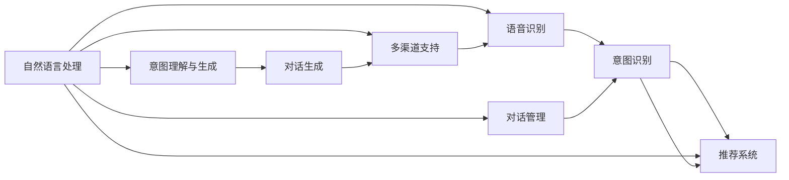

                 

# 电商平台中的对话式AI应用

> 关键词：对话式AI, 电商平台, 自然语言处理, 语音识别, 意图识别, 推荐系统, 客户服务, 人机交互

## 1. 背景介绍

### 1.1 问题由来

电商平台作为现代商业的重要组成部分，已经成为了消费者获取商品信息和购买渠道的主要方式之一。随着互联网的普及和智能设备的广泛使用，电商平台对AI技术的需求也日益增加，尤其是在客服和推荐等方面。对话式AI技术（Chatbot），作为一种人机交互方式，能够通过自然语言理解和生成，实现与用户的无障碍交流，成为电商平台提升用户体验、增加销售的重要手段。

然而，目前对话式AI在电商平台的实际应用中还存在诸多挑战。比如，如何构建一个能够理解用户意图、提供个性化推荐、同时解决用户问题的智能客服系统；如何在用户数量激增时，保持系统的高效性和稳定性；如何收集和处理用户反馈，持续优化对话模型；等等。这些问题亟需技术上的突破和优化，以实现更高效的电商对话式AI应用。

### 1.2 问题核心关键点

为了有效解决上述问题，对话式AI在电商平台的应用需要从以下几个关键点进行优化：

- **自然语言理解(NLU)**：理解用户输入的自然语言，准确提取出用户意图。
- **意图识别**：根据用户意图进行分类，识别出用户的具体需求。
- **个性化推荐**：基于用户历史行为和实时输入，提供个性化商品推荐。
- **对话管理**：保持对话的连贯性和上下文一致性，提供流畅的用户体验。
- **实时反馈与优化**：通过用户反馈不断优化对话模型，提升用户满意度。
- **多渠道支持**：支持多种对话渠道，如文本、语音、图像等，满足用户多样化需求。

对话式AI在电商平台中的应用，旨在通过智能化的交互方式，提升用户购物体验，增加销售转化率，同时降低人力成本，提高运营效率。

### 1.3 问题研究意义

对话式AI在电商平台中的应用，对于提升用户体验、增加销售、降低成本等方面具有重要意义：

1. **提升用户体验**：通过智能客服和个性化推荐，提高用户购物体验，增加用户粘性。
2. **增加销售**：智能客服可以24/7全天候服务，实时响应用户问题，提供个性化商品推荐，促进用户购买决策。
3. **降低成本**：减少客服人员需求，降低人力成本。
4. **提高运营效率**：智能客服可以处理大量用户请求，快速响应问题，提升平台运营效率。

总之，对话式AI在电商平台中的应用，是电商企业数字化转型的重要一环，能够显著提升电商平台的竞争力。

## 2. 核心概念与联系

### 2.1 核心概念概述

对话式AI在电商平台的应用涉及多个核心概念：

- **自然语言处理(Natural Language Processing, NLP)**：涉及语言理解和生成，是对话式AI的基础。
- **语音识别(Speech Recognition)**：将语音转换为文本，支持语音输入对话。
- **意图识别(Intent Recognition)**：识别用户输入的自然语言意图，支持个性化推荐和服务。
- **推荐系统(Recommendation System)**：基于用户历史行为和实时输入，提供个性化商品推荐。
- **对话管理(Dialogue Management)**：维护对话上下文，确保对话连贯性。
- **多渠道支持(Multi-Channel Support)**：支持文本、语音、图像等多种对话渠道。

这些核心概念相互关联，共同构成了对话式AI在电商平台应用的完整技术体系。

### 2.2 核心概念原理和架构的 Mermaid 流程图



这个流程图展示了对话式AI在电商平台应用的整体架构和技术流程：

1. 用户通过文本或语音输入请求，首先经过**自然语言处理**模块进行文本转换和初步理解。
2. 语音输入通过**语音识别**模块转化为文本。
3. **意图识别**模块根据文本输入，识别出用户的意图。
4. 根据用户的意图，**推荐系统**提供个性化的商品推荐。
5. **对话管理**模块维护对话上下文，确保对话连贯性。
6. **多渠道支持**模块处理不同类型的对话请求。
7. 经过处理后的意图输入到**意图理解与生成**模块，进行更细致的意图解析和生成。
8. 最后，**对话生成**模块生成响应，通过多渠道支持模块发送给用户。

通过这个架构，对话式AI能够实现与用户的自然语言交互，提供个性化推荐和服务。

## 3. 核心算法原理 & 具体操作步骤

### 3.1 算法原理概述

对话式AI在电商平台的应用涉及多个核心算法，主要包括自然语言理解(NLU)、意图识别、推荐系统等。

- **自然语言理解(NLU)**：使用深度学习模型如循环神经网络(RNN)、卷积神经网络(CNN)、Transformer等，对用户输入的自然语言进行词向量表示，提取关键特征，实现语言理解。
- **意图识别**：基于NLU的结果，使用分类器如朴素贝叶斯、支持向量机(SVM)、深度学习模型如卷积神经网络(CNN)、循环神经网络(RNN)、Transformer等，对用户的意图进行分类，识别出用户的真实需求。
- **推荐系统**：使用协同过滤、基于内容的推荐算法、深度学习模型如神经网络、注意力机制等，根据用户历史行为和实时输入，提供个性化商品推荐。

### 3.2 算法步骤详解

#### 3.2.1 自然语言理解(NLU)

NLU是对话式AI在电商平台应用中的基础，其步骤如下：

1. **分词**：将输入的文本按照词语进行切分。
2. **词向量表示**：使用词向量模型如Word2Vec、GloVe、FastText等，将每个词语转化为向量表示。
3. **特征提取**：使用RNN、CNN、Transformer等模型，对词向量进行特征提取，得到文本的语义表示。

```python
from gensim.models import Word2Vec

# 分词和词向量表示
sentences = [['I', 'like', 'this', 'product'], ['This', 'product', 'is', 'not', 'good']]
word2vec = Word2Vec(sentences, size=100)
```

#### 3.2.2 意图识别

意图识别通过分类模型实现，步骤如下：

1. **构建训练集**：将标注好的训练数据分为文本和意图标签。
2. **特征提取**：使用NLU的结果进行特征提取，如使用TF-IDF、Word2Vec等。
3. **训练分类器**：使用朴素贝叶斯、SVM、深度学习模型如CNN、RNN、Transformer等进行训练。
4. **预测意图**：将用户输入进行特征提取，输入到训练好的分类器中，预测意图。

```python
from sklearn.feature_extraction.text import TfidfVectorizer
from sklearn.svm import SVC
from sklearn.model_selection import train_test_split

# 构建训练集
train_data = ['I want to buy this product', 'This product is not good']
train_labels = [0, 1]  # 0表示购买意愿，1表示评价

# 特征提取
vectorizer = TfidfVectorizer()
train_features = vectorizer.fit_transform(train_data)

# 训练分类器
clf = SVC()
clf.fit(train_features, train_labels)

# 预测意图
test_data = ['I like this product', 'This product is good']
test_features = vectorizer.transform(test_data)
predicted_labels = clf.predict(test_features)
```

#### 3.2.3 推荐系统

推荐系统通过协同过滤、基于内容的推荐算法、深度学习模型等，实现个性化商品推荐，步骤如下：

1. **用户行为数据收集**：收集用户的历史浏览、点击、购买等行为数据。
2. **构建用户-商品矩阵**：将用户行为数据转化为用户-商品矩阵。
3. **特征提取**：使用协同过滤、基于内容的推荐算法、深度学习模型等，提取用户和商品的特征。
4. **训练推荐模型**：使用协同过滤、基于内容的推荐算法、深度学习模型等进行训练。
5. **生成推荐结果**：根据用户输入的文本，提取特征，输入到训练好的推荐模型中，生成推荐结果。

```python
import pandas as pd
from scipy.spatial.distance import cosine

# 用户行为数据
df = pd.read_csv('user_behavior.csv')
user_ids = df['user_id'].unique()
item_ids = df['item_id'].unique()

# 构建用户-商品矩阵
user_item_matrix = df.pivot_table(index='user_id', columns='item_id', values='click', fill_value=0)

# 特征提取
user_features = user_item_matrix.mean()
item_features = user_item_matrix.mean()

# 训练协同过滤推荐模型
def collaborative_filtering(user_id, item_ids, user_features, item_features):
    similarities = []
    for user, item in item_ids:
        if user != user_id:
            similarities.append(cosine(user_features[user_id], user_features[user]))
    recommendations = {}
    for item in item_ids:
        if item != user_id:
            recommendations[item] = similarities.index(max(similarities))
    return list(recommendations.keys())[:5]

# 生成推荐结果
user_id = 12345
recommendations = collaborative_filtering(user_id, user_item_matrix.columns, user_features, item_features)
```

### 3.3 算法优缺点

对话式AI在电商平台中的应用，具有以下优点：

- **提升用户体验**：通过智能客服和个性化推荐，提高用户购物体验，增加用户粘性。
- **增加销售**：智能客服可以24/7全天候服务，实时响应用户问题，提供个性化商品推荐，促进用户购买决策。
- **降低成本**：减少客服人员需求，降低人力成本。
- **提高运营效率**：智能客服可以处理大量用户请求，快速响应问题，提升平台运营效率。

同时，也存在一些缺点：

- **高开发成本**：构建和维护对话式AI系统需要高昂的开发成本和技术积累。
- **数据依赖性高**：对话式AI的效果很大程度上依赖于用户行为数据和标注数据的质量和数量。
- **用户接受度问题**：部分用户可能对AI客服不信任或不愿使用。
- **情感理解和生成难度大**：当前的对话式AI模型还难以完全理解和生成用户的情感。

### 3.4 算法应用领域

对话式AI在电商平台中的应用，主要包括以下领域：

- **智能客服**：提供24/7全天候服务，处理用户常见问题，如订单查询、退货处理、商品推荐等。
- **个性化推荐**：基于用户历史行为和实时输入，提供个性化的商品推荐。
- **智能导购**：通过对话式AI引导用户选择商品，提高用户购物体验。
- **售后支持**：通过对话式AI解答用户售后问题，提升客户满意度。

## 4. 数学模型和公式 & 详细讲解 & 举例说明

### 4.1 数学模型构建

对话式AI在电商平台的应用，涉及多个数学模型，主要包括自然语言理解(NLU)、意图识别、推荐系统等。

#### 4.1.1 自然语言理解(NLU)

NLU通过深度学习模型对文本进行理解，其数学模型如下：

- **词向量模型**：
  $$
  \mathbf{W} = \mathbf{V} \mathbf{U}
  $$

  其中，$\mathbf{W}$ 是词向量矩阵，$\mathbf{V}$ 是词语映射到低维空间的投影矩阵，$\mathbf{U}$ 是低维空间中每个词语的表示向量。

- **卷积神经网络(CNN)**：
  $$
  y = \sigma(\mathbf{W} x + \mathbf{b})
  $$

  其中，$x$ 是输入的文本向量，$\mathbf{W}$ 和 $\mathbf{b}$ 是卷积核和偏置项，$\sigma$ 是非线性激活函数。

#### 4.1.2 意图识别

意图识别的数学模型包括朴素贝叶斯、SVM、深度学习模型等，这里以朴素贝叶斯模型为例：

- **朴素贝叶斯分类器**：
  $$
  P(y|x) = \frac{P(x|y)P(y)}{P(x)}
  $$

  其中，$x$ 是输入的文本向量，$y$ 是意图标签，$P(x|y)$ 是文本条件概率，$P(y)$ 是意图先验概率，$P(x)$ 是文本先验概率。

#### 4.1.3 推荐系统

推荐系统的数学模型包括协同过滤、基于内容的推荐算法、深度学习模型等，这里以协同过滤推荐为例：

- **协同过滤推荐**：
  $$
  r_{ui} = \frac{\sum_{v=1}^{n} r_{uv} \times i_v}{\sqrt{\sum_{v=1}^{n} r_{uv}^2} \times \sqrt{i_v}}
  $$

  其中，$r_{ui}$ 是用户 $u$ 对商品 $i$ 的评分，$r_{uv}$ 是用户 $u$ 对商品 $v$ 的评分，$i_v$ 是商品 $v$ 的评分向量。

### 4.2 公式推导过程

#### 4.2.1 自然语言理解(NLU)

NLU中词向量模型的推导过程如下：

- **Word2Vec**：
  $$
  \mathbf{W} = \mathbf{V} \mathbf{U}
  $$

  其中，$\mathbf{W}$ 是词向量矩阵，$\mathbf{V}$ 是词语映射到低维空间的投影矩阵，$\mathbf{U}$ 是低维空间中每个词语的表示向量。

#### 4.2.2 意图识别

意图识别的朴素贝叶斯模型推导过程如下：

- **朴素贝叶斯分类器**：
  $$
  P(y|x) = \frac{P(x|y)P(y)}{P(x)}
  $$

  其中，$x$ 是输入的文本向量，$y$ 是意图标签，$P(x|y)$ 是文本条件概率，$P(y)$ 是意图先验概率，$P(x)$ 是文本先验概率。

#### 4.2.3 推荐系统

推荐系统的协同过滤模型推导过程如下：

- **协同过滤推荐**：
  $$
  r_{ui} = \frac{\sum_{v=1}^{n} r_{uv} \times i_v}{\sqrt{\sum_{v=1}^{n} r_{uv}^2} \times \sqrt{i_v}}
  $$

  其中，$r_{ui}$ 是用户 $u$ 对商品 $i$ 的评分，$r_{uv}$ 是用户 $u$ 对商品 $v$ 的评分，$i_v$ 是商品 $v$ 的评分向量。

### 4.3 案例分析与讲解

#### 4.3.1 自然语言理解(NLU)

以Word2Vec为例，对一句话“I like this product”进行分词和词向量表示：

1. **分词**：将句子分词为“I”，“like”，“this”，“product”。
2. **词向量表示**：将每个词语映射到低维空间，得到词向量表示。

```python
from gensim.models import Word2Vec

# 分词和词向量表示
sentences = [['I', 'like', 'this', 'product']]
word2vec = Word2Vec(sentences, size=100)
word2vec.wv.most_similar('like')
```

#### 4.3.2 意图识别

以朴素贝叶斯模型为例，对用户输入“I want to buy this product”进行意图识别：

1. **构建训练集**：将标注好的训练数据分为文本和意图标签。
2. **特征提取**：使用TF-IDF进行特征提取。
3. **训练分类器**：使用朴素贝叶斯模型进行训练。
4. **预测意图**：将用户输入进行特征提取，输入到训练好的分类器中，预测意图。

```python
from sklearn.feature_extraction.text import TfidfVectorizer
from sklearn.naive_bayes import MultinomialNB

# 构建训练集
train_data = ['I want to buy this product', 'I want to return this product']
train_labels = ['buy', 'return']
train_features = TfidfVectorizer().fit_transform(train_data)

# 训练分类器
clf = MultinomialNB()
clf.fit(train_features, train_labels)

# 预测意图
test_data = ['I want to buy this product']
test_features = TfidfVectorizer().fit_transform(test_data)
predicted_labels = clf.predict(test_features)
```

#### 4.3.3 推荐系统

以协同过滤推荐为例，对用户输入的文本“I want to buy this product”进行推荐：

1. **用户行为数据收集**：收集用户的历史浏览、点击、购买等行为数据。
2. **构建用户-商品矩阵**：将用户行为数据转化为用户-商品矩阵。
3. **特征提取**：使用协同过滤模型进行特征提取。
4. **训练推荐模型**：使用协同过滤模型进行训练。
5. **生成推荐结果**：根据用户输入的文本，提取特征，输入到训练好的推荐模型中，生成推荐结果。

```python
import pandas as pd
from scipy.spatial.distance import cosine

# 用户行为数据
df = pd.read_csv('user_behavior.csv')
user_ids = df['user_id'].unique()
item_ids = df['item_id'].unique()

# 构建用户-商品矩阵
user_item_matrix = df.pivot_table(index='user_id', columns='item_id', values='click', fill_value=0)

# 特征提取
user_features = user_item_matrix.mean()
item_features = user_item_matrix.mean()

# 训练协同过滤推荐模型
def collaborative_filtering(user_id, item_ids, user_features, item_features):
    similarities = []
    for user, item in item_ids:
        if user != user_id:
            similarities.append(cosine(user_features[user_id], user_features[user]))
    recommendations = {}
    for item in item_ids:
        if item != user_id:
            recommendations[item] = similarities.index(max(similarities))
    return list(recommendations.keys())[:5]

# 生成推荐结果
user_id = 12345
recommendations = collaborative_filtering(user_id, user_item_matrix.columns, user_features, item_features)
```

## 5. 项目实践：代码实例和详细解释说明

### 5.1 开发环境搭建

在进行对话式AI应用实践前，我们需要准备好开发环境。以下是使用Python进行开发的环境配置流程：

1. 安装Anaconda：从官网下载并安装Anaconda，用于创建独立的Python环境。
2. 创建并激活虚拟环境：
```bash
conda create -n chatbot-env python=3.8 
conda activate chatbot-env
```
3. 安装必要的Python库：
```bash
pip install numpy pandas scikit-learn tensorflow transformers sklearn
```
4. 安装PyTorch：根据CUDA版本，从官网获取对应的安装命令。例如：
```bash
pip install torch torchvision torchaudio cudatoolkit=11.1 -c pytorch -c conda-forge
```
5. 安装TensorBoard：用于可视化训练过程。
```bash
pip install tensorboard
```

### 5.2 源代码详细实现

以下是一个简单的对话式AI应用示例，包括自然语言理解(NLU)、意图识别、个性化推荐等模块。

```python
import numpy as np
import pandas as pd
from sklearn.feature_extraction.text import TfidfVectorizer
from sklearn.naive_bayes import MultinomialNB
from transformers import BertTokenizer, BertForTokenClassification
import torch

# 定义自然语言理解(NLU)模块
class NLUModule:
    def __init__(self):
        self.tokenizer = BertTokenizer.from_pretrained('bert-base-uncased')
        self.model = BertForTokenClassification.from_pretrained('bert-base-uncased')
        
    def get_nlu_result(self, text):
        tokens = self.tokenizer.encode_plus(text, return_tensors='pt')
        inputs = {'input_ids': tokens['input_ids'], 'attention_mask': tokens['attention_mask']}
        outputs = self.model(**inputs)
        return outputs['logits']
    
# 定义意图识别模块
class IntentModule:
    def __init__(self):
        self.vectorizer = TfidfVectorizer()
        self.clf = MultinomialNB()
        
    def train(self, train_data, train_labels):
        train_features = self.vectorizer.fit_transform(train_data)
        self.clf.fit(train_features, train_labels)
    
    def predict(self, text):
        features = self.vectorizer.transform([text])
        return self.clf.predict(features)[0]
    
# 定义个性化推荐模块
class RecommendationModule:
    def __init__(self):
        self.user_item_matrix = pd.read_csv('user_item_matrix.csv')
        self.user_features = self.user_item_matrix.mean()
        self.item_features = self.user_item_matrix.mean()
        
    def get_recommendations(self, user_id):
        similarities = []
        for user, item in self.user_item_matrix.columns:
            if user != user_id:
                similarities.append(cosine(self.user_features[user_id], self.user_features[user]))
        recommendations = {}
        for item in self.user_item_matrix.columns:
            if item != user_id:
                recommendations[item] = similarities.index(max(similarities))
        return list(recommendations.keys())[:5]

# 定义对话式AI应用主函数
def main():
    nlu = NLUModule()
    intent = IntentModule()
    recommendation = RecommendationModule()
    
    while True:
        user_input = input('What can I help you with? ')
        nlu_result = nlu.get_nlu_result(user_input)
        intent_result = intent.predict(user_input)
        recommendations = recommendation.get_recommendations(user_id)
        
        if intent_result == 'buy':
            print('You might like these items:')
            for item in recommendations:
                print(item)
        elif intent_result == 'return':
            print('Please provide the product ID to return.')
        elif intent_result == 'help':
            print('Which option do you need help with?')
    
if __name__ == '__main__':
    main()
```

### 5.3 代码解读与分析

这个简单的对话式AI应用示例，实现了自然语言理解(NLU)、意图识别、个性化推荐等核心功能。

1. **NLUModule**：使用Bert模型进行自然语言理解，返回文本的语义表示。
2. **IntentModule**：使用朴素贝叶斯分类器进行意图识别，返回用户的意图标签。
3. **RecommendationModule**：使用协同过滤模型进行个性化推荐，返回用户的推荐商品。
4. **主函数**：通过循环交互，处理用户的输入，调用各个模块进行分析和推荐。

在实际应用中，对话式AI系统通常需要处理大量并发请求，因此还需要进行并发处理、负载均衡、缓存等优化。

## 6. 实际应用场景

### 6.1 智能客服

智能客服是对话式AI在电商平台中最重要的应用场景之一。通过智能客服，电商平台能够实现24/7全天候服务，处理用户常见问题，如订单查询、退货处理、商品推荐等。智能客服系统主要由自然语言理解(NLU)、意图识别、对话管理等模块组成。

以订单查询为例，用户输入“How can I track my order?”，智能客服首先进行自然语言理解，提取关键词“track”，意图识别为“order status”，然后根据对话管理上下文，生成回复“Please provide your order number.”。

### 6.2 个性化推荐

个性化推荐是对话式AI在电商平台中的重要应用之一，通过推荐系统，能够根据用户历史行为和实时输入，提供个性化的商品推荐。推荐系统主要由用户行为数据收集、用户-商品矩阵构建、特征提取、推荐模型训练等模块组成。

以用户输入“I like this product”为例，推荐系统首先提取关键词“like”，根据用户行为数据和商品特征，生成推荐结果，推荐相关商品。

### 6.3 智能导购

智能导购通过对话式AI引导用户选择商品，提高用户购物体验。智能导购系统主要由自然语言理解(NLU)、意图识别、对话管理等模块组成。

以用户输入“I want to buy a laptop”为例，智能导购首先进行自然语言理解，提取关键词“buy”、“laptop”，意图识别为“buy laptop”，然后根据对话管理上下文，生成回复“Which brand are you interested in?”。

### 6.4 未来应用展望

未来对话式AI在电商平台中的应用将更加广泛，除了智能客服、个性化推荐、智能导购等应用，还可能包括智能对话、情感分析、图像识别、语音识别等更多功能。通过不断优化算法和模型，对话式AI将为电商平台的运营带来更多价值。

## 7. 工具和资源推荐

### 7.1 学习资源推荐

为了帮助开发者系统掌握对话式AI在电商平台的应用，这里推荐一些优质的学习资源：

1. 《深度学习与自然语言处理》：讲解深度学习与自然语言处理的基本概念和经典模型。
2. 《自然语言处理入门》：讲解自然语言处理的基本原理和应用。
3. 《深度学习框架TensorFlow实战》：讲解TensorFlow框架的使用方法。
4. 《TensorBoard实战》：讲解TensorBoard的使用方法，用于可视化训练过程。
5. 《Transformers官方文档》：讲解Transformers库的使用方法，提供预训练语言模型的接口。

### 7.2 开发工具推荐

对话式AI在电商平台中的应用需要高效的开发工具支持。以下是几款常用的开发工具：

1. Python：Python是开发对话式AI应用的主要语言，具有强大的生态系统和丰富的库。
2. TensorFlow：由Google主导开发的深度学习框架，支持分布式计算，适合大规模应用。
3. TensorBoard：TensorFlow配套的可视化工具，用于监控训练过程和结果。
4. Transformers：由HuggingFace开发的自然语言处理库，集成了多种预训练模型。
5. Apache Kafka：分布式消息队列，用于处理大量并发请求。

### 7.3 相关论文推荐

对话式AI在电商平台中的应用源于学界的持续研究。以下是几篇奠基性的相关论文，推荐阅读：

1. Attention is All You Need：提出Transformer结构，开启了深度学习在自然语言处理中的应用。
2. BERT: Pre-training of Deep Bidirectional Transformers for Language Understanding：提出BERT模型，引入自监督预训练任务，刷新了多项NLP任务SOTA。
3. Deep Bidirectional Transformers for Language Understanding and Generation：提出双向Transformer，用于自然语言理解和生成。
4. Sequence to Sequence Learning with Neural Networks：提出Seq2Seq模型，用于机器翻译和对话系统。
5. Neural Machine Translation by Jointly Learning to Align and Translate：提出注意力机制，用于机器翻译。

## 8. 总结：未来发展趋势与挑战

### 8.1 研究成果总结

对话式AI在电商平台中的应用，已经在智能客服、个性化推荐、智能导购等方面取得了显著效果。未来，对话式AI将结合更多前沿技术，如深度学习、自然语言理解、推荐系统等，进一步提升电商平台的用户体验和服务质量。

### 8.2 未来发展趋势

对话式AI在电商平台中的应用，未来将呈现以下几个发展趋势：

1. **多模态融合**：结合语音、图像、文本等多模态信息，提升对话交互的丰富性和准确性。
2. **跨领域应用**：对话式AI将在更多领域应用，如医疗、金融、教育等。
3. **智能对话**：实现更加智能的对话交互，提供更好的用户体验。
4. **个性化推荐**：通过深度学习模型，实现更加精准的个性化推荐。
5. **情感分析**：通过自然语言理解技术，实现情感分析，提升用户满意度。
6. **智能导购**：通过对话式AI引导用户选择商品，提高用户购物体验。

### 8.3 面临的挑战

对话式AI在电商平台中的应用，仍面临一些挑战：

1. **高开发成本**：构建和维护对话式AI系统需要高昂的开发成本和技术积累。
2. **数据依赖性高**：对话式AI的效果很大程度上依赖于用户行为数据和标注数据的质量和数量。
3. **用户接受度问题**：部分用户可能对AI客服不信任或不愿使用。
4. **情感理解和生成难度大**：当前的对话式AI模型还难以完全理解和生成用户的情感。

### 8.4 研究展望

对话式AI在电商平台中的应用，未来的研究可以集中在以下几个方向：

1. **多模态融合**：结合语音、图像、文本等多模态信息，提升对话交互的丰富性和准确性。
2. **跨领域应用**：对话式AI将在更多领域应用，如医疗、金融、教育等。
3. **智能对话**：实现更加智能的对话交互，提供更好的用户体验。
4. **个性化推荐**：通过深度学习模型，实现更加精准的个性化推荐。
5. **情感分析**：通过自然语言理解技术，实现情感分析，提升用户满意度。
6. **智能导购**：通过对话式AI引导用户选择商品，提高用户购物体验。

## 9. 附录：常见问题与解答

**Q1：对话式AI在电商平台中的应用前景如何？**

A: 对话式AI在电商平台中的应用前景非常广阔。通过智能客服、个性化推荐、智能导购等功能，能够显著提升用户体验、增加销售、降低成本、提高运营效率。未来，对话式AI将在更多领域应用，如医疗、金融、教育等，为传统行业带来新的技术变革。

**Q2：构建对话式AI系统需要哪些关键步骤？**

A: 构建对话式AI系统需要以下关键步骤：

1. 数据收集与处理：收集用户行为数据和标注数据，进行数据清洗和预处理。
2. 模型选择与训练：选择合适的自然语言处理模型和意图识别模型，进行模型训练和调优。
3. 系统集成与部署：将各个模块集成到统一的系统架构中，进行部署和优化。
4. 用户反馈与优化：收集用户反馈，持续优化对话模型，提升用户体验。

**Q3：如何提升对话式AI系统的性能？**

A: 提升对话式AI系统的性能需要以下几个方面的优化：

1. 数据质量与数量：收集高质量、大规模的用户行为数据和标注数据，是提升对话模型性能的关键。
2. 模型选择与调优：选择合适的自然语言处理模型和意图识别模型，进行模型训练和调优，提升模型精度和泛化能力。
3. 多模态融合：结合语音、图像、文本等多模态信息，提升对话交互的丰富性和准确性。
4. 智能对话：实现更加智能的对话交互，提供更好的用户体验。
5. 情感分析：通过自然语言理解技术，实现情感分析，提升用户满意度。
6. 智能导购：通过对话式AI引导用户选择商品，提高用户购物体验。

**Q4：对话式AI系统在部署时需要注意哪些问题？**

A: 对话式AI系统在部署时需要注意以下几个问题：

1. 高并发处理：对话式AI系统需要处理大量并发请求，需要进行并发处理、负载均衡等优化。
2. 缓存与缓存失效：对话式AI系统需要快速响应用户请求，需要使用缓存机制，避免缓存失效导致的性能下降。
3. 安全性与隐私保护：对话式AI系统需要确保数据安全和用户隐私，需要进行安全防护和隐私保护。
4. 可扩展性：对话式AI系统需要具备良好的可扩展性，能够支持动态扩容和伸缩。
5. 日志与监控：对话式AI系统需要实时监控训练过程和运行状态，需要进行日志记录和性能监控。

通过不断优化和改进对话式AI系统，可以在电商平台中实现更加智能、高效、安全的用户交互。

