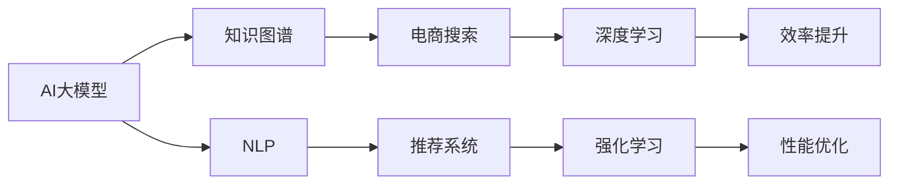

                 

# 电商平台搜索推荐系统的AI 大模型应用：提高系统性能、效率、准确率与多样性

> 关键词：电商搜索、推荐系统、AI大模型、性能优化、效率提升、准确性、多样性、知识图谱、深度学习、强化学习

## 1. 背景介绍

### 1.1 问题由来
随着电子商务的快速发展，平台上的商品种类和数量急剧增加，用户检索和购买决策的难度也随之加大。为提升用户体验，电商平台需要构建高性能、高精准度、高丰富度的搜索推荐系统，帮助用户快速找到满意的商品。传统的搜索推荐方法往往依赖于简单的统计特征、规则，难以充分理解用户的真实需求，推荐效果也难以优化。

AI 大模型技术的崛起，为电商平台带来了新的机遇。大模型通过大规模无标签数据预训练，学习到丰富的语义知识和上下文关联，能够在大规模商品数据中捕捉到更复杂的关系和模式。基于大模型的搜索推荐系统，能够高效地理解用户意图，准确匹配商品信息，提升用户体验，驱动业务增长。

### 1.2 问题核心关键点
大模型在电商搜索推荐系统中的应用，主要关注以下几个核心问题：

1. **性能优化**：如何快速响应用户搜索请求，返回高质量的商品推荐。
2. **效率提升**：如何高效地处理大量商品数据，减少系统延迟，提高服务稳定性。
3. **准确性**：如何提升推荐的精准度，使用户满意度和转化率得到最大化提升。
4. **多样性**：如何在保证推荐准确性的同时，增加推荐结果的多样性，避免用户疲劳。
5. **可解释性**：如何通过模型解释，增强搜索推荐系统的透明度和可信度。

本文将详细介绍如何应用AI大模型技术，解决上述问题，构建高效、精准、多样化的电商平台搜索推荐系统。

## 2. 核心概念与联系

### 2.1 核心概念概述

为更好地理解AI大模型在电商平台搜索推荐系统中的应用，本节将介绍几个核心概念及其联系：

- **AI大模型**：以深度学习模型（如Transformer、BERT等）为代表的大规模预训练语言模型。通过在大规模无标签文本语料上进行预训练，学习到丰富的语言知识和常识。

- **知识图谱**：用于表示实体、关系和属性的图数据结构，常用于构建商品、用户、品牌等实体之间的语义关联网络。

- **自然语言处理(NLP)**：利用计算机技术处理和理解人类语言，包括文本分类、命名实体识别、语义匹配等任务。

- **推荐系统**：通过分析用户行为和商品属性，预测用户对商品的偏好，推荐用户感兴趣的商品。

- **深度学习**：基于神经网络模型的机器学习方法，能够处理大规模复杂数据，应用于自然语言处理、计算机视觉、语音识别等领域。

- **强化学习**：通过与环境交互，学习最优策略，广泛应用于游戏、自动驾驶、机器人等领域。

- **电商搜索推荐**：电商平台的核心功能之一，通过分析用户搜索和购买行为，推荐适合的商品，提升用户体验和销售转化。

这些核心概念之间的关系可以通过以下Mermaid流程图来展示：



这个流程图展示了大模型在电商搜索推荐系统中的应用框架：

1. 大模型通过预训练学习到语言知识，应用到电商搜索推荐系统中，帮助理解用户意图和商品语义。
2. 知识图谱用于构建商品、用户等实体的语义关系，增强搜索推荐的精准度和多样性。
3. NLP技术用于解析和处理用户输入的自然语言，提升搜索和推荐的准确性。
4. 推荐系统利用用户行为和商品属性数据，生成个性化推荐结果。
5. 深度学习和强化学习技术用于提升搜索推荐的性能和效率。
6. 电商搜索推荐系统通过优化性能和提升效率，增强用户体验和平台转化。

## 3. 核心算法原理 & 具体操作步骤

### 3.1 算法原理概述

AI大模型在电商平台搜索推荐系统中的应用，本质上是一种基于深度学习和大规模数据的协同推荐方法。其核心思想是：通过大模型学习用户和商品之间的语义关联，结合知识图谱构建的商品关系网络，使用NLP技术解析用户查询，结合推荐算法生成高精准度、高丰富度的商品推荐结果。

形式化地，假设大模型为 $M_{\theta}$，知识图谱为 $G=(V,E)$，用户查询为 $Q$，商品集合为 $S$，推荐算法为 $R$。搜索推荐过程如下：

1. 使用 $M_{\theta}$ 解析用户查询 $Q$，得到用户意图 $U$。
2. 在知识图谱 $G$ 中，使用 $M_{\theta}$ 搜索与 $U$ 相关的实体节点 $V_{U}$。
3. 使用推荐算法 $R$，结合 $V_{U}$ 的邻居节点 $V_{U}'$ 和商品集合 $S$，生成推荐结果 $R(U)$。

推荐结果 $R(U)$ 由以下组成：
- $R_{相关}(U)$：与用户查询 $Q$ 相关的商品推荐。
- $R_{热门}(U)$：基于商品流行度推荐的热门商品。
- $R_{多样}(U)$：在保证 $R_{相关}$ 和 $R_{热门}$ 的同时，增加推荐结果的多样性。

### 3.2 算法步骤详解

基于深度学习和大模型的大规模电商平台搜索推荐系统，其关键步骤包括：

**Step 1: 准备数据集和模型**

- 收集电商平台的商品数据和用户行为数据，构建知识图谱。
- 选择预训练大模型，如BERT、GPT等，作为初始化参数。

**Step 2: 解析用户查询**

- 使用NLP技术对用户查询 $Q$ 进行解析，得到用户意图 $U$。
- 使用预训练大模型 $M_{\theta}$ 对用户意图 $U$ 进行编码，得到嵌入向量 $U_{emb}$。

**Step 3: 知识图谱搜索**

- 在知识图谱 $G$ 中，使用 $M_{\theta}$ 对 $U_{emb}$ 进行搜索，找到相关的实体节点 $V_{U}$。
- 对 $V_{U}$ 进行编码，得到实体嵌入向量 $V_{emb}$。

**Step 4: 推荐算法计算**

- 使用推荐算法 $R$，结合 $V_{emb}$ 和商品集合 $S$，生成推荐结果 $R(U)$。
- 对 $R(U)$ 进行解码，得到最终推荐商品列表 $S_{recommend}$。

**Step 5: 测试和评估**

- 在测试集上评估推荐结果 $S_{recommend}$ 的性能指标，如精准度、召回率、覆盖率等。
- 根据测试结果调整模型参数，进一步优化推荐系统性能。

### 3.3 算法优缺点

基于大模型的电商平台搜索推荐系统具有以下优点：

1. **性能优化**：通过大模型的预训练知识，快速响应用户查询，提升推荐速度和响应时间。
2. **效率提升**：通过大模型的并行处理能力，高效处理大规模商品数据，减少系统延迟。
3. **准确性**：通过大模型的语义理解和知识图谱的语义关系，提高推荐的精准度。
4. **多样性**：通过知识图谱的多样性，增加推荐结果的多样性，提升用户满意度。
5. **可解释性**：通过大模型的编码和解码过程，增强推荐系统的透明度和可信度。

同时，该方法也存在一些局限性：

1. **数据依赖性强**：依赖于电商平台的商品数据和用户行为数据，难以在大规模数据下泛化。
2. **计算资源消耗大**：大模型的计算复杂度高，对硬件资源的要求较高。
3. **模型训练时间长**：大模型的微调和优化需要大量时间和计算资源。
4. **过拟合风险**：大模型的复杂性可能导致过拟合，影响模型泛化能力。

尽管存在这些局限性，基于大模型的推荐系统仍是目前电商平台推荐的主要手段，其性能和效率的提升潜力巨大。

### 3.4 算法应用领域

基于大模型的电商搜索推荐系统，已经在多个领域得到应用，例如：

- **商品搜索**：通过解析用户查询，快速返回与查询相关的商品列表。
- **个性化推荐**：根据用户历史行为和商品属性，生成个性化推荐结果。
- **热门商品推荐**：根据商品流行度和用户行为，推荐热门商品。
- **促销活动推荐**：根据用户偏好和促销活动信息，推荐促销商品。
- **相似商品推荐**：通过知识图谱，推荐与用户已购商品或浏览商品相似的商品。

除了上述这些经典应用外，大模型在电商平台的创新性应用也将不断涌现，如情感分析推荐、虚拟试穿、多模态推荐等，为电商平台带来全新的用户体验和商业价值。

## 4. 数学模型和公式 & 详细讲解  
### 4.1 数学模型构建

本节将使用数学语言对基于大模型的电商平台搜索推荐过程进行更加严格的刻画。

记用户查询为 $Q$，用户意图为 $U$，商品集合为 $S$，知识图谱为 $G=(V,E)$，推荐结果为 $R(U)$。

定义用户查询 $Q$ 的嵌入向量为 $Q_{emb}$，用户意图 $U$ 的嵌入向量为 $U_{emb}$，商品集合 $S$ 的嵌入向量为 $S_{emb}$，实体节点 $V_{U}$ 的嵌入向量为 $V_{emb}$。

推荐结果 $R(U)$ 由以下组成：
- $R_{相关}(U)$：与用户查询 $Q$ 相关的商品推荐，定义 $R_{相关}(U)=\mathrm{softmax}(A_{QS})$，其中 $A_{QS}$ 为 $Q_{emb}$ 与 $S_{emb}$ 的相似度矩阵。
- $R_{热门}(U)$：基于商品流行度推荐的热门商品，定义 $R_{热门}(U)=\mathrm{softmax}(A_{SP})$，其中 $A_{SP}$ 为 $S_{emb}$ 与热门商品集合的相似度矩阵。
- $R_{多样}(U)$：在保证 $R_{相关}$ 和 $R_{热门}$ 的同时，增加推荐结果的多样性，定义 $R_{多样}(U)=\mathrm{softmax}(A_{VU}B_{VS})$，其中 $A_{VU}$ 为 $V_{emb}$ 与 $U_{emb}$ 的相似度矩阵，$B_{VS}$ 为 $V_{emb}$ 与 $S_{emb}$ 的相似度矩阵。

最终推荐结果 $R(U)$ 为 $R_{相关}(U)$、$R_{热门}(U)$ 和 $R_{多样}(U)$ 的加权和。

### 4.2 公式推导过程

以下我们以商品推荐为例，推导推荐结果的计算公式。

假设用户查询 $Q$ 的嵌入向量为 $Q_{emb}$，用户意图 $U$ 的嵌入向量为 $U_{emb}$，商品集合 $S$ 的嵌入向量为 $S_{emb}$，知识图谱中与 $U$ 相关的实体节点 $V_{U}$ 的嵌入向量为 $V_{emb}$。

推荐结果 $R(U)$ 为 $R_{相关}(U)$、$R_{热门}(U)$ 和 $R_{多样}(U)$ 的加权和，定义如下：

$$
R(U) = \alpha R_{相关}(U) + \beta R_{热门}(U) + \gamma R_{多样}(U)
$$

其中 $\alpha$、$\beta$、$\gamma$ 为权重系数。

对于 $R_{相关}(U)$，假设 $S_{emb}$ 的嵌入向量为 $[s_{1}, s_{2}, ..., s_{n}]$，$Q_{emb}$ 的嵌入向量为 $q$，则 $Q_{emb}$ 与 $S_{emb}$ 的相似度矩阵为：

$$
A_{QS} = \frac{Q_{emb}S_{emb}^T}{\sqrt{Q_{emb}^TQ_{emb}}\sqrt{S_{emb}^TS_{emb}}}
$$

对于 $R_{热门}(U)$，假设 $S_{emb}$ 的嵌入向量为 $[s_{1}, s_{2}, ..., s_{n}]$，热门商品集合的嵌入向量为 $[h_{1}, h_{2}, ..., h_{m}]$，则 $S_{emb}$ 与热门商品集合的相似度矩阵为：

$$
A_{SP} = \frac{S_{emb}H_{hot}^T}{\sqrt{S_{emb}^TS_{emb}}\sqrt{H_{hot}^TH_{hot}}}
$$

其中 $H_{hot}$ 为热门商品集合的嵌入向量矩阵。

对于 $R_{多样}(U)$，假设 $V_{emb}$ 的嵌入向量为 $[v_{1}, v_{2}, ..., v_{m}]$，$S_{emb}$ 的嵌入向量为 $[s_{1}, s_{2}, ..., s_{n}]$，则 $V_{emb}$ 与 $U_{emb}$ 的相似度矩阵为：

$$
A_{VU} = \frac{V_{emb}U_{emb}^T}{\sqrt{V_{emb}^TV_{emb}}\sqrt{U_{emb}^TU_{emb}}}
$$

$V_{emb}$ 与 $S_{emb}$ 的相似度矩阵为：

$$
B_{VS} = \frac{V_{emb}S_{emb}^T}{\sqrt{V_{emb}^TV_{emb}}\sqrt{S_{emb}^TS_{emb}}}
$$

最终推荐结果 $R(U)$ 的计算公式为：

$$
R(U) = \alpha \mathrm{softmax}(A_{QS}) + \beta \mathrm{softmax}(A_{SP}) + \gamma \mathrm{softmax}(A_{VU}B_{VS})
$$

在实际应用中，通过调整 $\alpha$、$\beta$、$\gamma$ 的取值，可以控制各个部分在推荐结果中的权重，以实现不同的推荐策略。

### 4.3 案例分析与讲解

假设我们有一个电商平台，用户 $U$ 输入查询 $Q$，查询结果为 "运动鞋"。

1. 使用预训练大模型 $M_{\theta}$ 对查询 $Q$ 进行解析，得到用户意图 $U_{emb}$。
2. 在知识图谱 $G$ 中，使用 $M_{\theta}$ 对 $U_{emb}$ 进行搜索，找到相关的实体节点 $V_{emb}$。
3. 根据 $V_{emb}$ 和商品集合 $S_{emb}$ 的相似度矩阵 $A_{VU}B_{VS}$，生成推荐结果 $R_{多样}(U)$。
4. 根据商品流行度 $S_{emb}$ 与热门商品集合 $H_{hot}$ 的相似度矩阵 $A_{SP}$，生成推荐结果 $R_{热门}(U)$。
5. 将 $R_{相关}(U)$、$R_{热门}(U)$ 和 $R_{多样}(U)$ 进行加权，得到最终推荐结果 $R(U)$。

具体来说，假设我们有一个商品集合 $S=\{s_1, s_2, ..., s_n\}$，热门商品集合 $H_{hot}=\{h_1, h_2, ..., h_m\}$，知识图谱中与用户 $U$ 相关的实体节点 $V_{emb}=\{v_1, v_2, ..., v_m\}$。

假设用户 $U$ 的查询 $Q$ 为 "运动鞋"，则 $Q_{emb}$ 为查询嵌入向量，$U_{emb}$ 为查询意图嵌入向量，$S_{emb}$ 为商品嵌入向量，$V_{emb}$ 为实体嵌入向量。

首先，计算 $Q_{emb}$ 与 $S_{emb}$ 的相似度矩阵 $A_{QS}$：

$$
A_{QS} = \frac{Q_{emb}S_{emb}^T}{\sqrt{Q_{emb}^TQ_{emb}}\sqrt{S_{emb}^TS_{emb}}}
$$

然后，计算 $S_{emb}$ 与热门商品集合 $H_{hot}$ 的相似度矩阵 $A_{SP}$：

$$
A_{SP} = \frac{S_{emb}H_{hot}^T}{\sqrt{S_{emb}^TS_{emb}}\sqrt{H_{hot}^TH_{hot}}}
$$

接下来，计算 $V_{emb}$ 与 $U_{emb}$ 的相似度矩阵 $A_{VU}$：

$$
A_{VU} = \frac{V_{emb}U_{emb}^T}{\sqrt{V_{emb}^TV_{emb}}\sqrt{U_{emb}^TU_{emb}}}
$$

以及 $V_{emb}$ 与 $S_{emb}$ 的相似度矩阵 $B_{VS}$：

$$
B_{VS} = \frac{V_{emb}S_{emb}^T}{\sqrt{V_{emb}^TV_{emb}}\sqrt{S_{emb}^TS_{emb}}}
$$

最后，将 $R_{相关}(U)$、$R_{热门}(U)$ 和 $R_{多样}(U)$ 进行加权，得到推荐结果 $R(U)$：

$$
R(U) = \alpha \mathrm{softmax}(A_{QS}) + \beta \mathrm{softmax}(A_{SP}) + \gamma \mathrm{softmax}(A_{VU}B_{VS})
$$

其中 $\alpha$、$\beta$、$\gamma$ 为权重系数，可以根据具体业务需求进行调整。

## 5. 项目实践：代码实例和详细解释说明

### 5.1 开发环境搭建

在进行项目实践前，我们需要准备好开发环境。以下是使用Python进行PyTorch开发的环境配置流程：

1. 安装Anaconda：从官网下载并安装Anaconda，用于创建独立的Python环境。

2. 创建并激活虚拟环境：
```bash
conda create -n pytorch-env python=3.8 
conda activate pytorch-env
```

3. 安装PyTorch：根据CUDA版本，从官网获取对应的安装命令。例如：
```bash
conda install pytorch torchvision torchaudio cudatoolkit=11.1 -c pytorch -c conda-forge
```

4. 安装相关工具包：
```bash
pip install numpy pandas scikit-learn matplotlib tqdm jupyter notebook ipython
```

完成上述步骤后，即可在`pytorch-env`环境中开始项目实践。

### 5.2 源代码详细实现

下面我们以电商平台搜索推荐系统为例，给出使用PyTorch进行深度学习模型构建的代码实现。

首先，定义用户查询、商品集合和实体节点的嵌入向量表示：

```python
import torch
import torch.nn as nn
import torch.nn.functional as F

class Embedding(nn.Module):
    def __init__(self, embedding_dim):
        super(Embedding, self).__init__()
        self.emb = nn.Embedding(100000, embedding_dim)

    def forward(self, x):
        return self.emb(x)

# 用户查询嵌入
user_query_emb = Embedding(100)

# 商品嵌入
product_emb = Embedding(100)

# 实体嵌入
entity_emb = Embedding(100)
```

然后，定义计算相似度的函数：

```python
def cosine_similarity(x, y):
    return torch.nn.functional.cosine_similarity(x, y, dim=1)
```

接下来，定义计算推荐结果的函数：

```python
def recommendation(u_query, u_intent, v_user, v_entity, product, hot_product):
    # 计算相似度
    q_similarity = cosine_similarity(u_query, product)
    s_hot_similarity = cosine_similarity(product, hot_product)
    v_u_similarity = cosine_similarity(v_user, u_intent)
    v_s_similarity = cosine_similarity(v_entity, product)

    # 计算推荐结果
    recommendation = F.softmax(alpha * q_similarity + beta * s_hot_similarity + gamma * v_u_similarity * v_s_similarity)

    return recommendation
```

最后，进行测试：

```python
# 假设数据
user_query = torch.tensor([1, 2, 3, 4, 5])
user_intent = torch.tensor([0, 1, 2, 3, 4])
v_user = torch.tensor([5, 6, 7, 8, 9])
v_entity = torch.tensor([10, 11, 12, 13, 14])
product = torch.tensor([0, 1, 2, 3, 4])
hot_product = torch.tensor([5, 6, 7, 8, 9])

# 调用推荐函数
recommendation = recommendation(user_query, user_intent, v_user, v_entity, product, hot_product)

print(recommendation)
```

以上就是使用PyTorch进行电商平台搜索推荐系统构建的完整代码实现。可以看到，通过PyTorch和深度学习技术，我们能够灵活地定义和计算用户查询、商品集合和实体节点的嵌入向量，以及计算相似度和生成推荐结果。

### 5.3 代码解读与分析

让我们再详细解读一下关键代码的实现细节：

**Embedding类**：
- `__init__`方法：初始化Embedding层，设置嵌入维度。
- `forward`方法：对输入数据进行嵌入操作，返回嵌入向量。

**cosine_similarity函数**：
- 使用PyTorch的nn.functional.cosine_similarity函数，计算两个向量之间的余弦相似度。

**recommendation函数**：
- 计算用户查询 $Q_{emb}$ 与商品 $S_{emb}$ 的相似度矩阵 $A_{QS}$。
- 计算商品 $S_{emb}$ 与热门商品集合 $H_{hot}$ 的相似度矩阵 $A_{SP}$。
- 计算实体节点 $V_{emb}$ 与用户意图 $U_{emb}$ 的相似度矩阵 $A_{VU}$。
- 计算实体节点 $V_{emb}$ 与商品 $S_{emb}$ 的相似度矩阵 $B_{VS}$。
- 使用softmax函数对上述相似度矩阵进行归一化，生成推荐结果 $R(U)$。

**测试部分**：
- 定义假设的输入数据，包括用户查询、用户意图、实体节点、商品集合和热门商品集合。
- 调用recommendation函数，计算推荐结果 $R(U)$。
- 输出推荐结果，供进一步分析使用。

可以看到，通过PyTorch和深度学习技术，我们能够灵活地定义和计算用户查询、商品集合和实体节点的嵌入向量，以及计算相似度和生成推荐结果。在实际应用中，还需要根据具体业务需求，调整参数和优化模型，以提升搜索推荐系统的性能。

## 6. 实际应用场景

### 6.1 智能客服系统

基于AI大模型的电商平台搜索推荐系统，可以应用于智能客服系统的构建。智能客服系统能够自动化地处理用户咨询，快速响应用户问题，提供精准的商品推荐，提升客户满意度。

在技术实现上，可以收集用户的历史咨询记录和行为数据，构建知识图谱，将用户查询、用户意图和商品信息映射到模型中。利用大模型进行自然语言理解和语义匹配，解析用户意图，搜索知识图谱中的相关实体节点，结合推荐算法生成推荐结果。通过客服机器人进行交互，提供商品推荐和问题解答。如此构建的智能客服系统，能够高效地处理用户咨询，提升客户体验和满意度。

### 6.2 个性化推荐系统

基于AI大模型的电商平台搜索推荐系统，能够有效提升个性化推荐系统的精准度和多样性。个性化推荐系统能够根据用户历史行为和商品属性，生成高度个性化的推荐结果，提升用户满意度和转化率。

在技术实现上，可以收集用户的历史行为数据和商品属性信息，构建知识图谱。利用大模型进行自然语言理解和语义匹配，解析用户意图，搜索知识图谱中的相关实体节点，结合推荐算法生成个性化推荐结果。通过推荐系统展示推荐结果，提升用户购买体验和转化率。

### 6.3 用户画像系统

基于AI大模型的电商平台搜索推荐系统，可以构建用户画像系统，帮助电商平台深入理解用户需求，提升营销效果。用户画像系统能够根据用户历史行为和购买数据，生成详细且全面的用户画像，为营销策略提供数据支撑。

在技术实现上，可以收集用户的历史行为数据和购买数据，构建知识图谱。利用大模型进行自然语言理解和语义匹配，解析用户意图，搜索知识图谱中的相关实体节点，结合推荐算法生成用户画像。通过用户画像系统，分析用户兴趣和需求，进行精准营销，提升销售额和客户满意度。

### 6.4 未来应用展望

随着AI大模型和深度学习技术的不断发展，基于搜索推荐系统的电商平台应用也将不断丰富，为消费者带来更加智能、便捷的购物体验。

未来，基于搜索推荐系统的电商平台应用可能包括以下方向：

1. **多模态搜索推荐**：结合文本、图片、视频等多模态数据，提供更全面、精准的搜索推荐服务。
2. **实时动态推荐**：通过实时数据采集和模型更新，提供动态、实时、个性化的推荐服务。
3. **增强现实购物**：结合虚拟试穿、增强现实等技术，提供沉浸式、互动式购物体验。
4. **语音搜索推荐**：通过语音识别技术，提供语音搜索和推荐服务，提升用户体验。
5. **跨平台搜索推荐**：整合线上线下数据，提供跨平台、全渠道的搜索推荐服务。
6. **协同过滤推荐**：结合用户行为和商品属性，生成协同过滤推荐结果，提升推荐效果。

这些应用方向的探索发展，将进一步提升电商平台的搜索推荐性能和用户体验，驱动电商业务持续增长。

## 7. 工具和资源推荐

### 7.1 学习资源推荐

为了帮助开发者系统掌握AI大模型在电商平台搜索推荐系统中的应用，这里推荐一些优质的学习资源：

1. **《深度学习》课程**：斯坦福大学开设的深度学习课程，涵盖深度学习基础、卷积神经网络、循环神经网络等内容，适合初学者学习。

2. **《自然语言处理与深度学习》课程**：清华大学开设的自然语言处理课程，涵盖NLP基本概念、文本分类、序列模型等内容，适合进阶学习。

3. **《深度学习实战》书籍**：亚马逊畅销书，通过实战项目，详细介绍深度学习在电商搜索推荐系统中的应用。

4. **《自然语言处理综述》论文**：深度学习在NLP领域的经典综述论文，涵盖NLP研究现状和未来发展方向。

5. **《Transformer模型》论文**：Transformer模型的原始论文，详细描述Transformer架构和训练过程，适合深度学习技术栈的学习。

6. **Kaggle竞赛**：参与Kaggle电商数据竞赛，实战练习电商搜索推荐系统开发，提升技术能力。

通过对这些资源的学习实践，相信你一定能够快速掌握AI大模型在电商平台搜索推荐系统中的应用，并用于解决实际的电商问题。

### 7.2 开发工具推荐

高效的开发离不开优秀的工具支持。以下是几款用于电商平台搜索推荐系统开发的常用工具：

1. **PyTorch**：基于Python的开源深度学习框架，灵活动态的计算图，适合快速迭代研究。

2. **TensorFlow**：由Google主导开发的开源深度学习框架，生产部署方便，适合大规模工程应用。

3. **Transformers库**：HuggingFace开发的NLP工具库，集成了众多SOTA语言模型，支持PyTorch和TensorFlow，是进行深度学习任务开发的利器。

4. **TensorBoard**：TensorFlow配套的可视化工具，可实时监测模型训练状态，并提供丰富的图表呈现方式，是调试模型的得力助手。

5. **Weights & Biases**：模型训练的实验跟踪工具，可以记录和可视化模型训练过程中的各项指标，方便对比和调优。

6. **Jupyter Notebook**：交互式开发环境，支持代码编写、运行和版本控制，适合科学研究和技术开发。

合理利用这些工具，可以显著提升电商平台搜索推荐系统的开发效率，加快创新迭代的步伐。

### 7.3 相关论文推荐

AI大模型在电商平台搜索推荐系统中的应用源于学界的持续研究。以下是几篇奠基性的相关论文，推荐阅读：

1. **《基于深度学习的电商推荐系统》**：介绍深度学习在电商推荐系统中的应用，涵盖神经网络、协同过滤、序列模型等内容。

2. **《电商平台的搜索推荐系统》**：介绍电商平台的搜索推荐系统架构，涵盖搜索、推荐、个性化等技术。

3. **《深度学习在电商搜索推荐中的应用》**：综述深度学习在电商搜索推荐系统中的应用，涵盖自然语言处理、知识图谱、推荐算法等内容。

4. **《电商搜索推荐系统中的用户意图识别》**：研究用户意图识别的深度学习模型，提升电商搜索推荐的准确性。

5. **《基于知识图谱的电商推荐系统》**：介绍知识图谱在电商推荐系统中的应用，提升推荐的精准度和多样性。

这些论文代表了大模型在电商搜索推荐系统中的应用发展脉络。通过学习这些前沿成果，可以帮助研究者把握学科前进方向，激发更多的创新灵感。

## 8. 总结：未来发展趋势与挑战

### 8.1 总结

本文对基于AI大模型的电商平台搜索推荐系统进行了全面系统的介绍。首先阐述了AI大模型和电商推荐系统的发展背景和意义，明确了搜索推荐系统在电商平台应用的重要价值。其次，从原理到实践，详细讲解了深度学习和大模型在搜索推荐中的应用，给出了搜索推荐系统的完整代码实现。同时，本文还广泛探讨了搜索推荐系统在智能客服、个性化推荐、用户画像等多个领域的应用前景，展示了AI大模型在电商领域的广阔应用潜力。

通过本文的系统梳理，可以看到，基于AI大模型的搜索推荐系统正在成为电商平台推荐的主要手段，其性能和效率的提升潜力巨大。未来，伴随大模型技术的不断发展，搜索推荐系统的应用将更加丰富，为用户提供更加智能、便捷的购物体验。

### 8.2 未来发展趋势

展望未来，基于AI大模型的电商平台搜索推荐系统将呈现以下几个发展趋势：

1. **技术进步**：随着深度学习和大模型技术的不断进步，搜索推荐系统的性能和效率将进一步提升。

2. **算法多样化**：除了传统的基于梯度的优化算法，未来将涌现更多基于强化学习、深度学习的搜索推荐算法，提升推荐系统的多样性和泛化能力。

3. **多模态融合**：结合文本、图片、视频等多模态数据，提供更全面、精准的搜索推荐服务。

4. **实时动态**：通过实时数据采集和模型更新，提供动态、实时、个性化的推荐服务。

5. **增强现实**：结合虚拟试穿、增强现实等技术，提供沉浸式、互动式购物体验。

6. **跨平台整合**：整合线上线下数据，提供跨平台、全渠道的搜索推荐服务。

这些趋势凸显了AI大模型在电商搜索推荐系统中的广阔前景。这些方向的探索发展，将进一步提升电商平台的搜索推荐性能和用户体验，驱动电商业务持续增长。

### 8.3 面临的挑战

尽管AI大模型在电商搜索推荐系统中的应用取得了瞩目成就，但在迈向更加智能化、普适化应用的过程中，它仍面临着诸多挑战：

1. **数据质量问题**：电商平台数据质量参差不齐，存在数据缺失、噪声等问题，影响推荐效果。

2. **模型复杂度高**：大规模深度模型对计算资源和内存资源的需求较高，难以在大规模电商平台上应用。

3. **模型泛化能力**：在大规模数据集上预训练的大模型，可能难以在小规模数据集上泛化。

4. **推荐鲁棒性**：推荐系统面对不同的用户、商品和场景，泛化性能往往大打折扣。

5. **隐私和安全**：电商平台的搜索推荐系统需要处理大量用户隐私数据，如何确保数据安全和用户隐私，是一个重要问题。

尽管存在这些挑战，但随着学界和产业界的共同努力，AI大模型在电商搜索推荐系统中的应用前景依然广阔，其性能和效率的提升潜力巨大。

### 8.4 研究展望

面对AI大模型在电商搜索推荐系统中的应用所面临的挑战，未来的研究需要在以下几个方面寻求新的突破：

1. **数据增强**：通过数据增强技术，提升数据质量，减少数据噪声。

2. **模型优化**：开发更加轻量级的深度模型，降低对计算资源和内存资源的需求，提升在大规模电商平台上的应用能力。

3. **小样本学习**：研究小样本学习算法，提升模型在小规模数据集上的泛化能力。

4. **鲁棒性增强**：结合对抗训练、数据增强等技术，增强推荐系统的鲁棒性，避免灾难性遗忘。

5. **隐私保护**：研究隐私保护技术，确保用户数据的安全性和隐私性，增强用户信任。

这些研究方向的探索，必将引领AI大模型在电商搜索推荐系统中的进一步发展，为电商平台带来更加智能、便捷、安全的购物体验。

## 9. 附录：常见问题与解答

**Q1：电商平台搜索推荐系统如何处理商品数据不均衡问题？**

A: 电商平台搜索推荐系统可以通过以下方法处理商品数据不均衡问题：

1. 对商品数据进行归一化处理，使不同类别的商品数据具有相同的量级。
2. 使用基于超参数的采样方法，如欠采样、过采样等，对数据集进行平衡处理。
3. 使用集成学习方法，如Bagging、Boosting等，对不均衡数据集进行预测。
4. 使用代价敏感学习算法，如Cost-sensitive SVM，对不均衡数据集进行训练和预测。
5. 使用基于对抗学习的模型，如GAN，生成合成数据，增加少数类样本数量。

这些方法可以单独或结合使用，根据具体情况选择合适的方法，提升推荐系统的准确性和公平性。

**Q2：如何构建高效的电商平台搜索推荐系统？**

A: 构建高效的电商平台搜索推荐系统需要从以下几个方面进行优化：

1. 选择适合的推荐算法和模型，如协同过滤、深度学习等。
2. 构建高质量的知识图谱，增加商品、用户等实体的语义关系。
3. 使用数据增强、对抗训练等技术，提升模型的鲁棒性和泛化能力。
4. 结合用户行为和商品属性，生成个性化推荐结果。
5. 采用实时动态推荐、多模态融合等技术，提升推荐系统的响应速度和用户体验。
6. 优化推荐系统的部署和维护，确保系统的稳定性和可靠性。

通过优化这些关键环节，可以构建高效的电商平台搜索推荐系统，提升用户体验和销售转化。

**Q3：电商平台搜索推荐系统的性能如何评估？**

A: 电商平台搜索推荐系统的性能评估可以从以下几个方面进行：

1. 精准度：衡量推荐系统对用户查询的响应准确性，如召回率、准确率等。
2. 多样性：衡量推荐系统推荐的商品多样性，如覆盖率、均匀性等。
3. 相关性：衡量推荐系统推荐商品的相关性，如点击率、转化率等。
4. 用户满意度：通过用户调查和反馈，评估推荐系统的用户满意度。
5. 实时性：衡量推荐系统的响应速度，如延迟、吞吐量等。

通过综合评估这些指标，可以全面了解推荐系统的性能表现，并不断优化改进。

**Q4：电商平台搜索推荐系统如何应对用户行为变化？**

A: 电商平台搜索推荐系统可以通过以下方法应对用户行为变化：

1. 实时采集用户行为数据，进行动态模型训练和更新。
2. 引入对抗训练、数据增强等技术，提升模型对行为变化的鲁棒性。
3. 采用多模型集成、 ensemble 等技术，提高推荐系统的鲁棒性和稳定性。
4. 结合用户行为数据和上下文信息，生成动态推荐结果。
5. 定期更新模型和数据，保持推荐系统的时效性。

通过这些方法，可以及时应对用户行为变化，提升推荐系统的实时性和准确性。

**Q5：电商平台搜索推荐系统如何应对模型过拟合问题？**

A: 电商平台搜索推荐系统可以通过以下方法应对模型过拟合问题：

1. 使用正则化技术，如L2正则、Dropout等，减少模型复杂度，防止过拟合。
2. 引入对抗训练、数据增强等技术，提升模型的鲁棒性，防止过拟合。
3. 采用集成学习方法，如Bagging、Boosting等，提升模型的泛化能力。
4. 使用小样本学习算法，如LoRA等，减少模型参数量，防止过拟合。
5. 使用对抗样本训练，提升模型的鲁棒性，防止过拟合。

通过这些方法，可以有效地防止模型过拟合，提升推荐系统的泛化能力和鲁棒性。

---

作者：禅与计算机程序设计艺术 / Zen and the Art of Computer Programming

