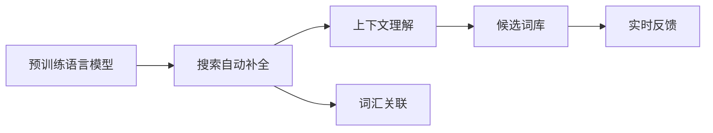

                 

# 电商平台搜索自动补全：AI大模型的上下文理解

> 关键词：电商平台,搜索补全,自然语言处理(NLP),上下文理解,深度学习,预训练模型

## 1. 背景介绍

### 1.1 问题由来

在电子商务的数字化转型过程中，电商平台搜索体验的优化成为了提升用户满意度和转化率的关键环节。电商平台搜索不仅仅是一个信息检索任务，更是一个复杂的语言理解和生成过程。传统的搜索算法往往依赖于关键词匹配，无法理解用户的真实意图，导致搜索结果的相关性和多样性不足。而利用自然语言处理(NLP)技术，特别是预训练语言模型，可以显著提升搜索体验的智能水平，更好地满足用户需求。

### 1.2 问题核心关键点

搜索引擎自动补全系统（Auto-Complete），在用户输入部分搜索词时，实时返回完整的搜索结果，使用户快速找到所需商品。基于深度学习的搜索自动补全系统，通常采用预训练语言模型，通过学习大量语料，构建词汇关系和上下文理解能力。

这种基于深度学习的自动补全系统能够根据输入的前缀自动生成可能的补全词，提升搜索体验和转化率。它的核心在于：

1. **上下文理解**：模型需要理解用户输入的前缀所蕴含的语义信息，能够根据上下文猜测用户的真实意图。
2. **词汇关联**：模型需要构建词汇之间的关联网络，能够在候选词库中匹配最相关的建议词。
3. **实时反馈**：系统需要实时响应用户输入，根据前后文动态生成补全词。

本文将详细介绍如何利用预训练语言模型实现搜索自动补全系统，并探讨其在电商平台中的实际应用。

## 2. 核心概念与联系

### 2.1 核心概念概述

为了更好地理解搜索自动补全的实现过程，我们需要明确几个关键概念：

- **预训练语言模型(Pretrained Language Model, PLM)**：通过在大规模无标签文本数据上进行自监督学习，学习到丰富的语言知识，包括词汇关系、语法规则、语义理解等。常用的预训练模型如BERT、GPT等。
- **搜索自动补全(Auto-Complete)**：根据用户输入的前缀，预测完整的搜索词，返回候选建议词。自动补全系统能够显著提升用户搜索效率和平台转化率。
- **上下文理解(Contextual Understanding)**：自动补全系统需要理解用户输入的前缀所蕴含的语义，推断用户可能想要搜索的关键词。
- **实时反馈(Real-time Feedback)**：系统需要实时响应用户输入，动态生成补全词，提升用户体验。

这些核心概念之间的联系可以通过以下Mermaid流程图来展示：



这个流程图展示了从预训练语言模型到搜索自动补全系统的整个处理流程：预训练语言模型构建上下文理解能力，再通过词汇关联生成候选词库，最后实时反馈给用户，动态生成补全词。

## 3. 核心算法原理 & 具体操作步骤
### 3.1 算法原理概述

搜索自动补全系统的核心算法基于深度学习和自然语言处理，主要分为两个步骤：预训练和微调。

### 3.2 算法步骤详解

#### 3.2.1 预训练

预训练阶段使用大规模无标签文本数据，如维基百科、新闻、小说等，通过自监督学习任务如掩码语言模型、next sentence prediction等，训练出具有强大语言理解能力的预训练模型。例如，BERT模型就是通过掩码语言模型进行预训练的，学习到词汇之间复杂的关联关系。

预训练模型通常包含Transformer架构，能够对长距离依赖关系进行建模，理解上下文信息。预训练模型可以通过迁移学习的方式应用于不同的NLP任务，包括搜索自动补全。

#### 3.2.2 微调

微调阶段将预训练模型应用于具体的搜索自动补全任务。在这个阶段，模型需要根据搜索结果与输入前缀之间的语义相关性进行优化，学习到更准确的词汇关联和上下文理解能力。微调通常使用有标签的搜索数据集，如电商平台的搜索日志，通过优化损失函数和更新模型参数，提升自动补全的性能。

#### 3.2.3 实时反馈

实时反馈机制是自动补全系统的重要组成部分。用户输入前缀后，系统需要立即生成候选词库，并动态更新建议词。这需要系统具备高效的推理能力，能够在极短的时间内完成计算。

### 3.3 算法优缺点

基于预训练语言模型的搜索自动补全系统有以下优点：

- **泛化能力**：通过在大规模语料上进行预训练，模型能够学习到通用的语言规律，泛化到新的搜索任务中。
- **灵活性**：预训练模型可以用于多种NLP任务，包括搜索自动补全，能够快速适应不同的应用场景。
- **效率**：预训练模型通常已经优化过推理速度，能够在实时环境中高效运行。

但这种系统也存在一些缺点：

- **数据依赖**：模型的性能很大程度上依赖于预训练数据的质量和数量，获取高质量数据需要大量资源。
- **过拟合风险**：微调数据量有限，模型可能出现过拟合现象，影响泛化能力。
- **部署复杂**：预训练模型通常参数量庞大，部署到实时系统中需要优化资源使用。

### 3.4 算法应用领域

搜索自动补全系统在电商平台中的应用非常广泛，能够显著提升搜索体验和转化率。以下是一些典型的应用场景：

- **商品搜索**：用户输入部分商品名称或描述，系统自动补全完整关键词，帮助用户快速找到所需商品。
- **分类浏览**：用户输入部分关键词，系统自动补全分类标签，提升浏览效率。
- **品牌搜索**：用户输入部分品牌名称，系统自动补全完整品牌，提升搜索准确率。
- **用户意图识别**：系统根据用户输入的前缀，自动识别用户的搜索意图，如查询商品信息、比较商品价格等，提供针对性的搜索结果。

## 4. 数学模型和公式 & 详细讲解 & 举例说明

### 4.1 数学模型构建

自动补全系统通常采用自回归模型或自编码模型进行构建。以自回归模型为例，模型输入为部分搜索结果，输出为完整的搜索词。数学上，可以定义如下模型：

$$
p(y|x) = \prod_{i=1}^{n}p(y_i|y_{<i}, x)
$$

其中，$y$ 为搜索结果，$x$ 为输入前缀，$y_i$ 为搜索结果中的第 $i$ 个词。

### 4.2 公式推导过程

在公式（1）的基础上，可以通过最大似然估计进行模型训练。假设已经收集到了搜索数据集 $D = \{(x_i, y_i)\}$，其中 $x_i$ 为输入前缀，$y_i$ 为完整搜索结果，模型的训练目标是最小化负对数似然损失函数：

$$
\mathcal{L}(\theta) = -\frac{1}{N}\sum_{i=1}^{N} \log p(y_i|x_i; \theta)
$$

其中，$\theta$ 为模型参数。通过反向传播算法，最小化损失函数，更新模型参数。

### 4.3 案例分析与讲解

以电商平台的商品搜索自动补全为例，可以具体分析模型的训练和推理过程：

1. **数据准备**：收集电商平台的搜索日志，划分训练集和验证集。每个样本包含用户输入的前缀 $x_i$ 和完整的搜索结果 $y_i$。

2. **模型搭建**：选择预训练语言模型（如BERT），并将其作为初始化参数。在模型顶部添加全连接层，输出搜索结果的概率分布。

3. **微调**：在训练集上，使用负对数似然损失函数进行有监督学习，最小化模型输出的预测结果与真实搜索结果之间的差异。在验证集上，使用BLEU、ROUGE等指标评估模型性能。

4. **实时推理**：在测试集中，输入用户输入的前缀，模型实时生成候选词库，动态更新补全词。

## 5. 项目实践：代码实例和详细解释说明

### 5.1 开发环境搭建

在进行搜索自动补全系统开发前，需要准备以下开发环境：

1. 安装Python：
   ```bash
   conda install python=3.8
   ```

2. 安装必要的库：
   ```bash
   pip install transformers torch torchtext
   ```

3. 下载预训练模型和数据集：
   ```bash
   wget https://huggingface.co/models/bert-base-uncased
   ```

4. 准备数据集：收集电商平台的搜索日志，进行数据清洗和预处理，划分训练集和验证集。

### 5.2 源代码详细实现

以下代码展示了搜索自动补全系统的实现过程：

```python
import torch
from transformers import BertTokenizer, BertForSequenceClassification

# 加载模型和分词器
tokenizer = BertTokenizer.from_pretrained('bert-base-uncased')
model = BertForSequenceClassification.from_pretrained('bert-base-uncased', num_labels=10000)

# 加载数据集
train_data = ...
val_data = ...
test_data = ...

# 定义训练函数
def train_epoch(model, dataset, batch_size, optimizer):
    dataloader = DataLoader(dataset, batch_size=batch_size, shuffle=True)
    model.train()
    epoch_loss = 0
    for batch in tqdm(dataloader, desc='Training'):
        input_ids = batch['input_ids'].to(device)
        attention_mask = batch['attention_mask'].to(device)
        labels = batch['labels'].to(device)
        model.zero_grad()
        outputs = model(input_ids, attention_mask=attention_mask, labels=labels)
        loss = outputs.loss
        epoch_loss += loss.item()
        loss.backward()
        optimizer.step()
    return epoch_loss / len(dataloader)

# 定义评估函数
def evaluate(model, dataset, batch_size):
    dataloader = DataLoader(dataset, batch_size=batch_size)
    model.eval()
    preds, labels = [], []
    with torch.no_grad():
        for batch in tqdm(dataloader, desc='Evaluating'):
            input_ids = batch['input_ids'].to(device)
            attention_mask = batch['attention_mask'].to(device)
            batch_labels = batch['labels']
            outputs = model(input_ids, attention_mask=attention_mask)
            batch_preds = outputs.logits.argmax(dim=2).to('cpu').tolist()
            batch_labels = batch_labels.to('cpu').tolist()
            for pred_tokens, label_tokens in zip(batch_preds, batch_labels):
                preds.append(pred_tokens[:len(label_tokens)])
                labels.append(label_tokens)
    
    # 计算BLEU分数
    bleu_score = calculate_bleu_score(preds, labels)
    return bleu_score

# 训练模型
epochs = 5
batch_size = 16
learning_rate = 2e-5
optimizer = AdamW(model.parameters(), lr=learning_rate)

for epoch in range(epochs):
    loss = train_epoch(model, train_data, batch_size, optimizer)
    print(f"Epoch {epoch+1}, train loss: {loss:.3f}")
    
    bleu_score = evaluate(model, val_data, batch_size)
    print(f"Epoch {epoch+1}, val BLEU: {bleu_score}")

# 推理测试
bleu_score = evaluate(model, test_data, batch_size)
print(f"Test BLEU: {bleu_score}")
```

### 5.3 代码解读与分析

上述代码实现了搜索自动补全系统的训练和评估过程。关键点包括：

- **分词和预处理**：使用BERT分词器对输入前缀和搜索结果进行分词，构建Tensor作为模型输入。
- **模型选择和搭建**：选择BERT模型作为初始化参数，并在顶部添加全连接层输出搜索结果的概率分布。
- **损失函数和优化器**：使用负对数似然损失函数和AdamW优化器，最小化模型输出与真实搜索结果之间的差异。
- **评估指标**：使用BLEU分数作为模型性能评估指标，计算模型预测结果与真实搜索结果之间的匹配度。

### 5.4 运行结果展示

运行上述代码后，可以得到训练和评估的输出结果，包括每个epoch的训练损失和验证BLEU分数。最终在测试集上评估模型性能，输出测试BLEU分数。

## 6. 实际应用场景

### 6.1 电商平台搜索自动补全

在电商平台中，搜索自动补全系统可以显著提升用户搜索体验和转化率。例如，用户在搜索"运动鞋"时，系统可以自动补全"运动鞋 跑步鞋"、"运动鞋 篮球鞋"等建议词，帮助用户快速找到所需商品。

### 6.2 智能客服系统

智能客服系统可以与搜索自动补全系统结合，提升客服响应速度和准确率。当用户输入"退货"时，系统自动补全"退货流程"、"退货政策"等建议词，引导用户快速获取所需信息。

### 6.3 广告推荐系统

广告推荐系统可以根据用户搜索行为，实时调整广告投放策略。例如，用户搜索"手机"时，系统自动补全"手机 华为"、"手机 苹果"等建议词，帮助广告商精准定位目标用户。

## 7. 工具和资源推荐

### 7.1 学习资源推荐

为了帮助开发者系统掌握搜索自动补全的实现过程，这里推荐一些优质的学习资源：

1. 《深度学习理论与实践》系列书籍：深入浅出地介绍深度学习的基本概念和实现技巧，包括自动补全系统的构建和优化。
2. CS234《深度学习与自然语言处理》课程：斯坦福大学开设的NLP明星课程，涵盖自动补全系统的基本原理和实现方法。
3. HuggingFace官方文档：详细介绍了BERT模型在自动补全系统中的应用，并提供了完整的样例代码。
4. Semantic Accuracy的博客：专注于NLP和自动补全系统的博客，提供丰富的案例分析和代码实现。
5. arXiv上的相关论文：如《Neural Network Models for Natural Language Processing》，详细介绍了预训练语言模型在自动补全系统中的应用。

通过对这些资源的学习实践，相信你一定能够快速掌握搜索自动补全的精髓，并用于解决实际的NLP问题。

### 7.2 开发工具推荐

高效的开发离不开优秀的工具支持。以下是几款用于搜索自动补全系统开发的常用工具：

1. PyTorch：基于Python的开源深度学习框架，灵活动态的计算图，适合快速迭代研究。
2. TensorFlow：由Google主导开发的开源深度学习框架，生产部署方便，适合大规模工程应用。
3. HuggingFace Transformers库：集成了多种预训练语言模型，支持模型训练和推理，是实现自动补全系统的利器。
4. Weights & Biases：模型训练的实验跟踪工具，可以记录和可视化模型训练过程中的各项指标，方便对比和调优。
5. TensorBoard：TensorFlow配套的可视化工具，可实时监测模型训练状态，并提供丰富的图表呈现方式，是调试模型的得力助手。

合理利用这些工具，可以显著提升搜索自动补全系统的开发效率，加快创新迭代的步伐。

### 7.3 相关论文推荐

搜索自动补全技术的发展源于学界的持续研究。以下是几篇奠基性的相关论文，推荐阅读：

1. "Neural Machine Translation by Jointly Learning to Align and Translate"（Cho et al., 2014）：介绍了注意力机制在机器翻译中的应用，对自动补全系统的构建有重要启发。
2. "Attention Is All You Need"（Vaswani et al., 2017）：提出了Transformer架构，为自动补全系统的优化提供了新思路。
3. "BERT: Pre-training of Deep Bidirectional Transformers for Language Understanding"（Devlin et al., 2018）：介绍了BERT模型的预训练过程，为自动补全系统提供了强大的语言理解能力。
4. "Unsupervised Pre-training of Attention-Only Models for Machine Translation"（Gu et al., 2017）：探讨了无监督学习方法在自动补全系统中的应用，提高了模型的泛化能力。
5. "Ensembling Multiple Pre-trained Models for Question Answering"（Sun et al., 2019）：介绍了多模型集成方法在自动补全系统中的应用，提高了模型的准确性和鲁棒性。

这些论文代表了大模型微调技术的发展脉络。通过学习这些前沿成果，可以帮助研究者把握学科前进方向，激发更多的创新灵感。

## 8. 总结：未来发展趋势与挑战

### 8.1 研究成果总结

本文对基于预训练语言模型的搜索自动补全系统进行了全面系统的介绍。首先阐述了搜索自动补全系统的研究背景和意义，明确了上下文理解、词汇关联和实时反馈等关键问题。其次，从原理到实践，详细讲解了预训练和微调的算法过程，给出了搜索自动补全系统的完整代码实现。同时，本文还广泛探讨了搜索自动补全系统在电商平台中的应用前景，展示了其巨大的应用潜力。最后，本文精选了搜索自动补全技术的各类学习资源，力求为读者提供全方位的技术指引。

通过本文的系统梳理，可以看到，搜索自动补全系统通过预训练语言模型，可以显著提升搜索体验和转化率，成为电商平台不可或缺的关键技术。未来，伴随预训练语言模型和微调方法的持续演进，搜索自动补全系统还将拓展到更多领域，为AI大模型的应用带来更多创新。

### 8.2 未来发展趋势

展望未来，搜索自动补全技术将呈现以下几个发展趋势：

1. **多模态融合**：未来搜索自动补全系统将更加关注多模态数据的融合，如图像、视频、文本等，提升搜索的全面性和准确性。
2. **个性化推荐**：系统将更加关注用户行为数据，实现个性化推荐，提升用户搜索满意度。
3. **实时推理优化**：未来系统将更加注重实时推理的优化，通过硬件加速和算法改进，提升推理速度和资源利用效率。
4. **联邦学习**：联邦学习可以实现在不共享用户隐私数据的前提下，跨平台训练搜索自动补全系统，提升模型的泛化能力和鲁棒性。
5. **自监督学习**：自监督学习方法可以在没有标签数据的情况下训练搜索自动补全系统，提升模型的无监督能力和泛化能力。

这些趋势将推动搜索自动补全系统走向更智能化、普适化的方向，为电商平台的数字化转型提供更加强大的技术支撑。

### 8.3 面临的挑战

尽管搜索自动补全技术已经取得了显著成就，但在迈向更加智能化、普适化应用的过程中，它仍面临着诸多挑战：

1. **数据隐私**：搜索自动补全系统需要处理大量用户数据，如何保护用户隐私，防止数据泄露，是重要的安全问题。
2. **模型公平性**：在处理多模态数据时，模型可能产生偏见，影响搜索结果的公平性。如何消除模型偏见，提升系统的公平性，仍需深入研究。
3. **计算资源**：搜索自动补全系统需要大量的计算资源，如何在不增加硬件成本的情况下，提升系统性能，仍是重要的研究方向。
4. **实时性能**：系统需要在极短的时间内完成推理，这对模型的推理速度和硬件资源提出了很高的要求。如何优化模型推理，提升实时性能，是重要的工程挑战。
5. **部署复杂度**：大规模预训练模型的部署需要优化资源使用，避免资源浪费。如何简化模型部署，提升系统可扩展性，是重要的研究方向。

正视搜索自动补全系统面临的这些挑战，积极应对并寻求突破，将是大模型微调技术迈向成熟的必由之路。相信随着学界和产业界的共同努力，这些挑战终将一一被克服，搜索自动补全技术必将在构建人机协同的智能时代中扮演越来越重要的角色。

### 8.4 研究展望

面对搜索自动补全系统所面临的种种挑战，未来的研究需要在以下几个方面寻求新的突破：

1. **隐私保护技术**：开发更加高效的数据隐私保护技术，保障用户数据安全。
2. **模型公平性优化**：引入公平性约束，消除模型偏见，提升系统公平性。
3. **资源优化算法**：开发更加高效的模型优化算法，提升实时推理性能。
4. **硬件加速技术**：结合硬件加速技术，提升模型的推理速度和资源利用效率。
5. **联邦学习算法**：研究联邦学习算法，提升跨平台模型的泛化能力和鲁棒性。

这些研究方向将推动搜索自动补全系统向更加智能化、普适化的方向发展，为构建人机协同的智能时代提供更加强大的技术支撑。

## 9. 附录：常见问题与解答

**Q1：搜索自动补全系统是如何理解上下文的？**

A: 搜索自动补全系统通常采用自回归模型或自编码模型，通过学习大量语料，构建词汇关系和上下文理解能力。模型通过前向传播计算上下文特征表示，再通过全连接层输出搜索结果的概率分布。

**Q2：如何提升搜索自动补全系统的实时推理性能？**

A: 可以通过以下方法提升搜索自动补全系统的实时推理性能：
1. 优化模型推理，减少计算量。
2. 使用硬件加速，如GPU、TPU等，提升计算效率。
3. 优化数据结构，减少内存占用。

**Q3：如何在搜索自动补全系统中实现个性化推荐？**

A: 可以通过以下方法实现搜索自动补全系统的个性化推荐：
1. 收集用户行为数据，构建用户兴趣模型。
2. 在搜索结果中引入个性化推荐算法，如协同过滤、基于内容的推荐等。
3. 在模型训练中引入个性化特征，提升推荐准确率。

**Q4：搜索自动补全系统面临的主要挑战是什么？**

A: 搜索自动补全系统面临的主要挑战包括：
1. 数据隐私问题，如何保护用户数据安全。
2. 模型公平性问题，如何消除模型偏见，提升系统公平性。
3. 实时性能问题，如何优化模型推理，提升实时性能。
4. 部署复杂度问题，如何简化模型部署，提升系统可扩展性。

**Q5：搜索自动补全系统的核心算法是什么？**

A: 搜索自动补全系统的核心算法基于深度学习和自然语言处理，主要分为两个步骤：预训练和微调。预训练阶段使用大规模无标签文本数据，通过自监督学习任务训练出具有强大语言理解能力的预训练模型。微调阶段将预训练模型应用于具体的搜索自动补全任务，通过优化损失函数和更新模型参数，提升自动补全的性能。

---

作者：禅与计算机程序设计艺术 / Zen and the Art of Computer Programming

