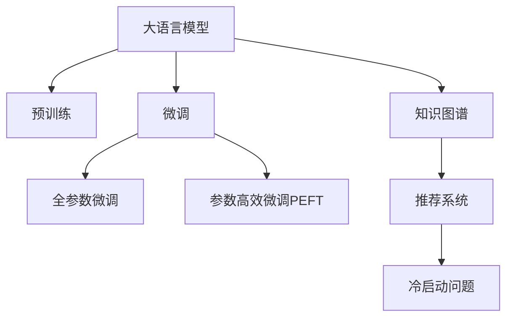

                 

# 电商平台的AI 大模型应用：搜索推荐系统是核心，冷启动策略是重点

## 1. 背景介绍

### 1.1 问题由来
随着电商行业的蓬勃发展，各大平台亟需利用人工智能技术来提升用户体验和销售转化率。其中，搜索推荐系统作为用户触达商品的关键入口，直接影响了用户的选择与购买决策。为了实现更加精准、高效的个性化推荐，电商平台纷纷引入大模型技术，利用其强大的语言理解和生成能力，对用户查询进行理解与优化，从而提高推荐系统的效果。

然而，大模型虽然在优化推荐结果上有着显著优势，但其应用也面临着诸多挑战，尤其是在用户冷启动阶段（即用户没有历史行为数据的情况下），大模型难以准确捕捉用户偏好，导致推荐效果不佳。冷启动问题直接关系到用户粘性和平台流量，成为亟需解决的难题。

### 1.2 问题核心关键点
冷启动是大模型在电商推荐系统应用中面临的关键问题。用户冷启动时，没有足够的历史数据供模型学习，难以建立有效的用户画像，无法提供个性化推荐。因此，解决冷启动问题成为电商平台应用大模型的重要突破点。

## 2. 核心概念与联系

### 2.1 核心概念概述

为更好地理解大模型在电商推荐系统中的应用，本节将介绍几个密切相关的核心概念：

- 大语言模型(Large Language Model, LLM)：以自回归(如GPT)或自编码(如BERT)模型为代表的大规模预训练语言模型。通过在大规模无标签文本语料上进行预训练，学习通用的语言表示，具备强大的语言理解和生成能力。

- 预训练(Pre-training)：指在大规模无标签文本语料上，通过自监督学习任务训练通用语言模型的过程。常见的预训练任务包括言语建模、遮挡语言模型等。预训练使得模型学习到语言的通用表示。

- 微调(Fine-tuning)：指在预训练模型的基础上，使用下游任务的少量标注数据，通过有监督地训练来优化模型在该任务上的性能。通常只需要调整顶层分类器或解码器，并以较小的学习率更新全部或部分的模型参数。

- 推荐系统(Recommendation System)：利用用户的历史行为数据和商品特征数据，通过算法模型推荐合适的商品给用户。是电商平台上提升用户满意度和购买转化率的重要工具。

- 冷启动问题(Cold Start Problem)：指在新用户刚加入平台或商品刚上架时，由于缺乏历史数据，推荐系统难以准确推荐商品给用户，导致用户流失或销量不佳。

- 知识图谱(Knowledge Graph)：由实体节点和关系边组成的图形结构，用于描述和存储实体之间的复杂关系。在推荐系统中，知识图谱可以用于辅助推荐模型，增强推荐结果的丰富性和准确性。

这些核心概念之间的逻辑关系可以通过以下Mermaid流程图来展示：



这个流程图展示了大语言模型的核心概念及其之间的关系：

1. 大语言模型通过预训练获得基础能力。
2. 微调是对预训练模型进行任务特定的优化，可以分为全参数微调和参数高效微调（PEFT）。
3. 推荐系统利用微调后的模型进行商品推荐。
4. 知识图谱可以增强推荐结果的丰富性和准确性。
5. 冷启动问题需要通过多种策略来解决。

这些概念共同构成了大模型在电商推荐系统中的应用框架，使得其在提升推荐效果和解决冷启动问题上具有显著优势。

## 3. 核心算法原理 & 具体操作步骤
### 3.1 算法原理概述

基于大模型的电商推荐系统，通常采用深度学习技术，如Transformer、BERT等，对用户查询进行理解与优化。通过微调，模型学习到用户查询与商品之间的语义关联，从而提升推荐准确度。

在推荐系统中，大模型的主要任务是对用户查询进行编码，生成商品的表示，并计算用户与商品的相似度，最后输出推荐结果。具体流程如下：

1. **用户查询编码**：使用大模型对用户查询进行编码，得到用户查询的向量表示。
2. **商品表示生成**：使用大模型对商品进行编码，得到商品的向量表示。
3. **相似度计算**：计算用户查询向量与商品向量之间的相似度，通常使用余弦相似度或点积相似度。
4. **推荐排序**：根据相似度排序，输出推荐商品列表。

该过程的数学基础是向量空间模型和余弦相似度计算，具体的公式推导将在下一节详细说明。

### 3.2 算法步骤详解

大模型在电商推荐系统中的应用，通常包括以下几个关键步骤：

**Step 1: 准备预训练模型和数据集**
- 选择合适的预训练语言模型 $M_{\theta}$ 作为初始化参数，如 BERT、GPT 等。
- 准备电商平台的商品数据集和用户行为数据集，标注数据集应包含商品ID、商品描述、用户ID、点击记录、购买记录等。

**Step 2: 添加推荐适配层**
- 根据推荐任务类型，在预训练模型顶层设计合适的输出层和损失函数。
- 对于推荐排序任务，通常在顶层添加线性分类器和交叉熵损失函数。
- 对于推荐生成任务，通常使用语言模型的解码器输出概率分布，并以负对数似然为损失函数。

**Step 3: 设置微调超参数**
- 选择合适的优化算法及其参数，如 AdamW、SGD 等，设置学习率、批大小、迭代轮数等。
- 设置正则化技术及强度，包括权重衰减、Dropout、Early Stopping等。
- 确定冻结预训练参数的策略，如仅微调顶层，或全部参数都参与微调。

**Step 4: 执行梯度训练**
- 将训练集数据分批次输入模型，前向传播计算损失函数。
- 反向传播计算参数梯度，根据设定的优化算法和学习率更新模型参数。
- 周期性在验证集上评估模型性能，根据性能指标决定是否触发 Early Stopping。
- 重复上述步骤直到满足预设的迭代轮数或 Early Stopping 条件。

**Step 5: 测试和部署**
- 在测试集上评估微调后模型 $M_{\hat{\theta}}$ 的性能，对比微调前后的精度提升。
- 使用微调后的模型对新样本进行推理预测，集成到实际的应用系统中。
- 持续收集新的数据，定期重新微调模型，以适应数据分布的变化。

以上是基于大模型的电商推荐系统的一般流程。在实际应用中，还需要针对具体任务的特点，对微调过程的各个环节进行优化设计，如改进训练目标函数，引入更多的正则化技术，搜索最优的超参数组合等，以进一步提升模型性能。

### 3.3 算法优缺点

基于大模型的电商推荐系统具有以下优点：

1. 精度高。大模型通过学习通用语言表示，能够更准确地捕捉用户查询与商品之间的语义关系，从而提升推荐效果。
2. 泛化能力强。大模型在多样化的语料上预训练，具有较强的泛化能力，可以应对不同领域的推荐任务。
3. 可解释性强。大模型的输出可以直接解释为概率分布，便于理解和调试推荐结果。
4. 灵活性高。大模型可以通过微调和参数高效微调方法，适应不同任务和数据分布，实现快速部署。

同时，该方法也存在以下局限性：

1. 计算资源消耗大。大模型参数量庞大，训练和推理计算量较大，需要高性能硬件支持。
2. 数据依赖性强。大模型的训练和微调需要大量的标注数据，对于冷启动用户，数据量不足会影响推荐效果。
3. 模型复杂度高。大模型的复杂度较高，难以解释模型的内部工作机制。
4. 部署复杂度高。大模型在部署时需要进行裁剪、量化等优化，同时需要考虑模型的推理速度和内存占用。

尽管存在这些局限性，但就目前而言，基于大模型的电商推荐系统仍是最先进的技术手段。未来相关研究的重点在于如何进一步降低计算资源消耗，提高模型的可解释性，解决冷启动问题，同时兼顾模型的部署效率。

### 3.4 算法应用领域

基于大模型的电商推荐系统，在实际应用中已经取得了显著的效果，适用于各种电商平台的商品推荐任务，例如：

- 商品推荐：根据用户的历史行为数据，推荐用户可能感兴趣的商品。
- 搜索排序：对用户查询进行优化，排序搜索结果，提高用户满意度。
- 个性化推荐：基于用户的兴趣和行为，推荐符合用户偏好的商品。
- 内容推荐：推荐与商品相关的图文、视频等多样性内容。
- 新商品推荐：对新上架的商品进行推荐，帮助用户发现潜在的购物机会。
- 促销活动推荐：推荐与用户购买行为相关的促销活动。

除了上述这些经典任务外，大模型推荐系统还被创新性地应用到更多场景中，如用户兴趣预测、跨商品推荐、商品类别预测等，为电商平台的个性化服务提供了新的技术路径。

## 4. 数学模型和公式 & 详细讲解  
### 4.1 数学模型构建

本节将使用数学语言对大模型在电商推荐系统中的应用进行更加严格的刻画。

记大语言模型为 $M_{\theta}:\mathcal{X} \rightarrow \mathcal{Y}$，其中 $\mathcal{X}$ 为用户查询，$\mathcal{Y}$ 为商品表示空间。假设微调任务的训练集为 $D=\{(x_i,y_i)\}_{i=1}^N, x_i \in \mathcal{X}, y_i \in \mathcal{Y}$。

定义模型 $M_{\theta}$ 在输入 $x$ 上的输出为 $y=M_{\theta}(x)$，则推荐系统的目标是最小化交叉熵损失，即：

$$
\mathcal{L}(\theta) = -\frac{1}{N}\sum_{i=1}^N [y_i\log M_{\theta}(x_i)+(1-y_i)\log(1-M_{\theta}(x_i))]
$$

其中，$y_i$ 为商品是否被用户点击或购买的二元标签，$M_{\theta}(x_i)$ 为模型对用户查询 $x_i$ 的预测概率。

### 4.2 公式推导过程

以下我们以推荐排序任务为例，推导交叉熵损失函数及其梯度的计算公式。

假设模型 $M_{\theta}$ 在输入 $x_i$ 上的输出为 $\hat{y}=M_{\theta}(x_i) \in [0,1]$，表示商品被用户点击或购买的概率。真实标签 $y_i \in \{0,1\}$。则二分类交叉熵损失函数定义为：

$$
\ell(M_{\theta}(x),y) = -[y\log \hat{y} + (1-y)\log (1-\hat{y})]
$$

将其代入经验风险公式，得：

$$
\mathcal{L}(\theta) = -\frac{1}{N}\sum_{i=1}^N [y_i\log M_{\theta}(x_i)+(1-y_i)\log(1-M_{\theta}(x_i))]
$$

根据链式法则，损失函数对参数 $\theta_k$ 的梯度为：

$$
\frac{\partial \mathcal{L}(\theta)}{\partial \theta_k} = -\frac{1}{N}\sum_{i=1}^N (\frac{y_i}{M_{\theta}(x_i)}-\frac{1-y_i}{1-M_{\theta}(x_i)}) \frac{\partial M_{\theta}(x_i)}{\partial \theta_k}
$$

其中 $\frac{\partial M_{\theta}(x_i)}{\partial \theta_k}$ 可进一步递归展开，利用自动微分技术完成计算。

在得到损失函数的梯度后，即可带入参数更新公式，完成模型的迭代优化。重复上述过程直至收敛，最终得到适应电商推荐任务的最优模型参数 $\theta^*$。

## 5. 项目实践：代码实例和详细解释说明
### 5.1 开发环境搭建

在进行推荐系统开发前，我们需要准备好开发环境。以下是使用Python进行PyTorch开发的环境配置流程：

1. 安装Anaconda：从官网下载并安装Anaconda，用于创建独立的Python环境。

2. 创建并激活虚拟环境：
```bash
conda create -n pytorch-env python=3.8 
conda activate pytorch-env
```

3. 安装PyTorch：根据CUDA版本，从官网获取对应的安装命令。例如：
```bash
conda install pytorch torchvision torchaudio cudatoolkit=11.1 -c pytorch -c conda-forge
```

4. 安装Transformers库：
```bash
pip install transformers
```

5. 安装各类工具包：
```bash
pip install numpy pandas scikit-learn matplotlib tqdm jupyter notebook ipython
```

完成上述步骤后，即可在`pytorch-env`环境中开始推荐系统开发。

### 5.2 源代码详细实现

下面我们以商品推荐任务为例，给出使用Transformers库对BERT模型进行电商推荐系统的PyTorch代码实现。

首先，定义推荐任务的数据处理函数：

```python
from transformers import BertTokenizer
from torch.utils.data import Dataset
import torch

class RecommendationDataset(Dataset):
    def __init__(self, user_ids, item_ids, item_texts, user_bought_items, tokenizer, max_len=128):
        self.user_ids = user_ids
        self.item_ids = item_ids
        self.item_texts = item_texts
        self.user_bought_items = user_bought_items
        self.tokenizer = tokenizer
        self.max_len = max_len
        
    def __len__(self):
        return len(self.user_ids)
    
    def __getitem__(self, item):
        user_id = self.user_ids[item]
        item_id = self.item_ids[item]
        item_text = self.item_texts[item]
        user_bought_items = self.user_bought_items[item]
        
        # 用户购买历史转化为用户兴趣向量
        user_interest = [0] * 30000
        for i in user_bought_items:
            user_interest[i] = 1
        
        # 商品文本转化为商品向量
        encoding = self.tokenizer(item_text, return_tensors='pt', max_length=self.max_len, padding='max_length', truncation=True)
        input_ids = encoding['input_ids'][0]
        attention_mask = encoding['attention_mask'][0]
        
        # 用户兴趣和商品向量拼接
        user_interest_ids = [id for id, value in enumerate(user_interest) if value == 1]
        user_interest_ids = torch.tensor(user_interest_ids, dtype=torch.long)
        encoded_tags = [tag2id[tag] for tag in user_interest_ids] 
        encoded_tags.extend([tag2id['O']] * (self.max_len - len(encoded_tags)))
        labels = torch.tensor(encoded_tags, dtype=torch.long)
        
        return {'input_ids': input_ids, 
                'attention_mask': attention_mask,
                'labels': labels,
                'user_id': user_id,
                'item_id': item_id}

# 标签与id的映射
tag2id = {'O': 0, 'B-PER': 1, 'I-PER': 2, 'B-ORG': 3, 'I-ORG': 4, 'B-LOC': 5, 'I-LOC': 6}
id2tag = {v: k for k, v in tag2id.items()}

# 创建dataset
tokenizer = BertTokenizer.from_pretrained('bert-base-cased')

train_dataset = RecommendationDataset(train_user_ids, train_item_ids, train_item_texts, train_user_bought_items, tokenizer)
dev_dataset = RecommendationDataset(dev_user_ids, dev_item_ids, dev_item_texts, dev_user_bought_items, tokenizer)
test_dataset = RecommendationDataset(test_user_ids, test_item_ids, test_item_texts, test_user_bought_items, tokenizer)
```

然后，定义模型和优化器：

```python
from transformers import BertForTokenClassification, AdamW

model = BertForTokenClassification.from_pretrained('bert-base-cased', num_labels=len(tag2id))

optimizer = AdamW(model.parameters(), lr=2e-5)
```

接着，定义训练和评估函数：

```python
from torch.utils.data import DataLoader
from tqdm import tqdm
from sklearn.metrics import classification_report

device = torch.device('cuda') if torch.cuda.is_available() else torch.device('cpu')
model.to(device)

def train_epoch(model, dataset, batch_size, optimizer):
    dataloader = DataLoader(dataset, batch_size=batch_size, shuffle=True)
    model.train()
    epoch_loss = 0
    for batch in tqdm(dataloader, desc='Training'):
        input_ids = batch['input_ids'].to(device)
        attention_mask = batch['attention_mask'].to(device)
        labels = batch['labels'].to(device)
        model.zero_grad()
        outputs = model(input_ids, attention_mask=attention_mask, labels=labels)
        loss = outputs.loss
        epoch_loss += loss.item()
        loss.backward()
        optimizer.step()
    return epoch_loss / len(dataloader)

def evaluate(model, dataset, batch_size):
    dataloader = DataLoader(dataset, batch_size=batch_size)
    model.eval()
    preds, labels = [], []
    with torch.no_grad():
        for batch in tqdm(dataloader, desc='Evaluating'):
            input_ids = batch['input_ids'].to(device)
            attention_mask = batch['attention_mask'].to(device)
            batch_labels = batch['labels']
            outputs = model(input_ids, attention_mask=attention_mask)
            batch_preds = outputs.logits.argmax(dim=2).to('cpu').tolist()
            batch_labels = batch_labels.to('cpu').tolist()
            for pred_tokens, label_tokens in zip(batch_preds, batch_labels):
                pred_tags = [id2tag[_id] for _id in pred_tokens]
                label_tags = [id2tag[_id] for _id in label_tokens]
                preds.append(pred_tags[:len(label_tokens)])
                labels.append(label_tags)
                
    print(classification_report(labels, preds))
```

最后，启动训练流程并在测试集上评估：

```python
epochs = 5
batch_size = 16

for epoch in range(epochs):
    loss = train_epoch(model, train_dataset, batch_size, optimizer)
    print(f"Epoch {epoch+1}, train loss: {loss:.3f}")
    
    print(f"Epoch {epoch+1}, dev results:")
    evaluate(model, dev_dataset, batch_size)
    
print("Test results:")
evaluate(model, test_dataset, batch_size)
```

以上就是使用PyTorch对BERT进行商品推荐任务开发的完整代码实现。可以看到，得益于Transformers库的强大封装，我们可以用相对简洁的代码完成BERT模型的加载和微调。

### 5.3 代码解读与分析

让我们再详细解读一下关键代码的实现细节：

**RecommendationDataset类**：
- `__init__`方法：初始化用户ID、商品ID、商品文本、用户购买历史等关键组件。
- `__len__`方法：返回数据集的样本数量。
- `__getitem__`方法：对单个样本进行处理，将用户购买历史转化为用户兴趣向量，将商品文本输入编码为token ids，将用户兴趣和商品向量拼接，并对其进行定长padding，最终返回模型所需的输入。

**tag2id和id2tag字典**：
- 定义了标签与数字id之间的映射关系，用于将token-wise的预测结果解码回真实的标签。

**训练和评估函数**：
- 使用PyTorch的DataLoader对数据集进行批次化加载，供模型训练和推理使用。
- 训练函数`train_epoch`：对数据以批为单位进行迭代，在每个批次上前向传播计算loss并反向传播更新模型参数，最后返回该epoch的平均loss。
- 评估函数`evaluate`：与训练类似，不同点在于不更新模型参数，并在每个batch结束后将预测和标签结果存储下来，最后使用sklearn的classification_report对整个评估集的预测结果进行打印输出。

**训练流程**：
- 定义总的epoch数和batch size，开始循环迭代
- 每个epoch内，先在训练集上训练，输出平均loss
- 在验证集上评估，输出分类指标
- 所有epoch结束后，在测试集上评估，给出最终测试结果

可以看到，PyTorch配合Transformers库使得BERT微调的代码实现变得简洁高效。开发者可以将更多精力放在数据处理、模型改进等高层逻辑上，而不必过多关注底层的实现细节。

当然，工业级的系统实现还需考虑更多因素，如模型的保存和部署、超参数的自动搜索、更灵活的任务适配层等。但核心的微调范式基本与此类似。

## 6. 实际应用场景
### 6.1 智能推荐引擎

基于大模型的电商推荐系统已经在各大电商平台得到广泛应用，成为提升用户体验和购买转化率的重要手段。智能推荐引擎利用大模型的强大语言理解和生成能力，对用户查询进行优化，并推荐符合用户偏好的商品，显著提高了平台的转化率和用户满意度。

在技术实现上，可以收集平台上的用户历史行为数据，将用户行为转化为向量表示，输入到预训练大模型中进行微调。微调后的模型能够更好地捕捉用户兴趣和行为，优化推荐结果。此外，平台还可以结合知识图谱等外部信息，增强推荐结果的丰富性和准确性，提升推荐系统的综合性能。

### 6.2 新商品推荐

电商平台不断引入新产品，如何快速地将这些新商品推荐给潜在用户，是大模型应用的重要场景。基于大模型的推荐系统可以快速地对这些新商品进行初步评估，并根据用户的历史行为和兴趣，推荐给可能感兴趣的潜在用户。

在具体实现中，可以将新商品的基本信息输入到微调后的模型中进行推理，得到商品与用户之间的相似度。同时，系统可以定期收集新商品的点击和购买数据，进一步微调模型，优化推荐效果。如此，电商平台可以迅速将新商品推荐给目标用户，加速商品的上架和销售。

### 6.3 跨品类推荐

用户往往对多种类别的商品都有兴趣，如何将不同类别的商品进行关联推荐，是大模型推荐系统的另一重要应用。基于大模型的推荐系统可以通过跨品类推荐，满足用户的多样化需求，提升用户的整体购物体验。

在技术实现上，可以结合用户历史行为数据和商品分类信息，构建跨品类推荐模型。微调后的模型可以学习不同品类商品之间的关联关系，推荐给用户跨品类商品组合。如此，用户可以在同一平台上发现更多符合自己兴趣的商品，增加平台的粘性和销量。

### 6.4 个性化搜索

传统的搜索系统通常只能根据简单的关键词匹配，无法理解用户查询背后的语义信息。基于大模型的推荐系统可以更好地捕捉用户查询的语义，从而实现更精准的搜索和推荐。

在具体实现中，可以将用户查询输入到微调后的模型中进行编码，得到用户查询的向量表示。同时，将商品信息也输入到模型中进行编码，得到商品向量的表示。根据用户查询向量与商品向量之间的相似度，排序推荐结果，满足用户的个性化需求。

## 7. 工具和资源推荐
### 7.1 学习资源推荐

为了帮助开发者系统掌握大模型在电商推荐系统中的应用，这里推荐一些优质的学习资源：

1. 《Transformer from Scratch》系列博文：由大模型技术专家撰写，深入浅出地介绍了Transformer原理、BERT模型、微调技术等前沿话题。

2. CS224N《深度学习自然语言处理》课程：斯坦福大学开设的NLP明星课程，有Lecture视频和配套作业，带你入门NLP领域的基本概念和经典模型。

3. 《Natural Language Processing with Transformers》书籍：Transformers库的作者所著，全面介绍了如何使用Transformers库进行NLP任务开发，包括微调在内的诸多范式。

4. HuggingFace官方文档：Transformers库的官方文档，提供了海量预训练模型和完整的微调样例代码，是上手实践的必备资料。

5. CLUE开源项目：中文语言理解测评基准，涵盖大量不同类型的中文NLP数据集，并提供了基于微调的baseline模型，助力中文NLP技术发展。

通过对这些资源的学习实践，相信你一定能够快速掌握大模型在电商推荐系统中的应用精髓，并用于解决实际的NLP问题。
###  7.2 开发工具推荐

高效的开发离不开优秀的工具支持。以下是几款用于大模型电商推荐系统开发的常用工具：

1. PyTorch：基于Python的开源深度学习框架，灵活动态的计算图，适合快速迭代研究。大部分预训练语言模型都有PyTorch版本的实现。

2. TensorFlow：由Google主导开发的开源深度学习框架，生产部署方便，适合大规模工程应用。同样有丰富的预训练语言模型资源。

3. Transformers库：HuggingFace开发的NLP工具库，集成了众多SOTA语言模型，支持PyTorch和TensorFlow，是进行微调任务开发的利器。

4. Weights & Biases：模型训练的实验跟踪工具，可以记录和可视化模型训练过程中的各项指标，方便对比和调优。与主流深度学习框架无缝集成。

5. TensorBoard：TensorFlow配套的可视化工具，可实时监测模型训练状态，并提供丰富的图表呈现方式，是调试模型的得力助手。

6. Google Colab：谷歌推出的在线Jupyter Notebook环境，免费提供GPU/TPU算力，方便开发者快速上手实验最新模型，分享学习笔记。

合理利用这些工具，可以显著提升大模型在电商推荐系统中的开发效率，加快创新迭代的步伐。

### 7.3 相关论文推荐

大模型在电商推荐系统中的应用源于学界的持续研究。以下是几篇奠基性的相关论文，推荐阅读：

1. Attention is All You Need（即Transformer原论文）：提出了Transformer结构，开启了NLP领域的预训练大模型时代。

2. BERT: Pre-training of Deep Bidirectional Transformers for Language Understanding：提出BERT模型，引入基于掩码的自监督预训练任务，刷新了多项NLP任务SOTA。

3. Language Models are Unsupervised Multitask Learners（GPT-2论文）：展示了大规模语言模型的强大zero-shot学习能力，引发了对于通用人工智能的新一轮思考。

4. Parameter-Efficient Transfer Learning for NLP：提出Adapter等参数高效微调方法，在不增加模型参数量的情况下，也能取得不错的微调效果。

5. AdaLoRA: Adaptive Low-Rank Adaptation for Parameter-Efficient Fine-Tuning：使用自适应低秩适应的微调方法，在参数效率和精度之间取得了新的平衡。

这些论文代表了大模型在电商推荐系统中的应用发展脉络。通过学习这些前沿成果，可以帮助研究者把握学科前进方向，激发更多的创新灵感。

## 8. 总结：未来发展趋势与挑战
### 8.1 总结

本文对基于大模型的电商推荐系统进行了全面系统的介绍。首先阐述了大模型在电商推荐系统中的应用背景和意义，明确了微调在提升推荐效果和解决冷启动问题上的独特价值。其次，从原理到实践，详细讲解了微调的数学原理和关键步骤，给出了微调任务开发的完整代码实例。同时，本文还广泛探讨了大模型在电商推荐系统中的多种应用场景，展示了其广泛的应用前景。

通过本文的系统梳理，可以看到，基于大模型的电商推荐系统已经广泛应用于各大电商平台，成为提升用户体验和购买转化率的重要手段。大模型通过微调，能够捕捉用户查询的语义信息，优化推荐结果，显著提高了平台的转化率和用户满意度。未来，伴随大模型的不断演进，其应用场景将进一步扩展，为电商平台的智能化转型提供新的技术路径。

### 8.2 未来发展趋势

展望未来，大模型在电商推荐系统中的应用将呈现以下几个发展趋势：

1. 多模态融合。随着大模型的不断进步，未来推荐系统将不仅仅局限于文本信息，而是能够融合图片、视频、语音等多种模态信息，提供更加丰富、立体的商品推荐。

2. 跨域推荐。大模型在跨品类、跨平台推荐方面具有显著优势，未来推荐系统将更好地利用知识图谱等外部信息，实现跨域商品的推荐，满足用户的多样化需求。

3. 个性化推荐算法的发展。推荐系统将更注重用户行为的个性化特征，利用深度学习技术进行动态调整，提供更加精准、个性化的推荐结果。

4. 实时推荐。随着大模型的部署和推理优化，推荐系统将能够实现实时推荐，快速响应用户需求，提升用户体验。

5. 知识图谱的深度融合。知识图谱在推荐系统中的应用将进一步深入，通过多维度的关联关系，增强推荐结果的准确性和丰富性。

6. 冷启动问题的解决。未来推荐系统将探索更多解决冷启动问题的策略，如利用先验知识、多任务学习等方法，提高推荐效果。

以上趋势凸显了大模型在电商推荐系统中的巨大潜力。这些方向的探索发展，必将进一步提升推荐系统的性能和用户体验，为电商平台的智能化转型提供强大的技术支持。

### 8.3 面临的挑战

尽管大模型在电商推荐系统中的应用已经取得了显著进展，但在迈向更加智能化、普适化应用的过程中，仍然面临诸多挑战：

1. 计算资源消耗大。大模型参数量庞大，训练和推理计算量较大，需要高性能硬件支持。

2. 数据依赖性强。大模型的训练和微调需要大量的标注数据，对于冷启动用户，数据量不足会影响推荐效果。

3. 模型复杂度高。大模型的复杂度较高，难以解释模型的内部工作机制。

4. 部署复杂度高。大模型在部署时需要进行裁剪、量化等优化，同时需要考虑模型的推理速度和内存占用。

尽管存在这些局限性，但就目前而言，基于大模型的电商推荐系统仍是最先进的技术手段。未来相关研究的重点在于如何进一步降低计算资源消耗，提高模型的可解释性，解决冷启动问题，同时兼顾模型的部署效率。

### 8.4 研究展望

面对大模型在电商推荐系统应用中面临的挑战，未来的研究需要在以下几个方面寻求新的突破：

1. 探索无监督和半监督微调方法。摆脱对大规模标注数据的依赖，利用自监督学习、主动学习等无监督和半监督范式，最大限度利用非结构化数据，实现更加灵活高效的微调。

2. 研究参数高效和计算高效的微调范式。开发更加参数高效的微调方法，在固定大部分预训练参数的同时，只更新极少量的任务相关参数。同时优化微调模型的计算图，减少前向传播和反向传播的资源消耗，实现更加轻量级、实时性的部署。

3. 融合因果和对比学习范式。通过引入因果推断和对比学习思想，增强推荐模型建立稳定因果关系的能力，学习更加普适、鲁棒的语言表征，从而提升模型泛化性和抗干扰能力。

4. 引入更多先验知识。将符号化的先验知识，如知识图谱、逻辑规则等，与神经网络模型进行巧妙融合，引导微调过程学习更准确、合理的语言模型。同时加强不同模态数据的整合，实现视觉、语音等多模态信息与文本信息的协同建模。

5. 结合因果分析和博弈论工具。将因果分析方法引入微调模型，识别出模型决策的关键特征，增强输出解释的因果性和逻辑性。借助博弈论工具刻画人机交互过程，主动探索并规避模型的脆弱点，提高系统稳定性。

6. 纳入伦理道德约束。在模型训练目标中引入伦理导向的评估指标，过滤和惩罚有偏见、有害的输出倾向。同时加强人工干预和审核，建立模型行为的监管机制，确保输出符合人类价值观和伦理道德。

这些研究方向的探索，必将引领大模型在电商推荐系统中的应用走向更高的台阶，为电商平台的智能化转型提供强大的技术支持。面向未来，大模型在电商推荐系统中的研究还需要与其他人工智能技术进行更深入的融合，如知识表示、因果推理、强化学习等，多路径协同发力，共同推动自然语言理解和智能交互系统的进步。只有勇于创新、敢于突破，才能不断拓展大模型的应用边界，让智能技术更好地造福人类社会。

## 9. 附录：常见问题与解答

**Q1：大模型在电商推荐系统中应用有哪些限制？**

A: 大模型在电商推荐系统中的应用存在以下限制：
1. 计算资源消耗大：大模型的参数量庞大，训练和推理计算量较大，需要高性能硬件支持。
2. 数据依赖性强：大模型的训练和微调需要大量的标注数据，对于冷启动用户，数据量不足会影响推荐效果。
3. 模型复杂度高：大模型的复杂度较高，难以解释模型的内部工作机制。
4. 部署复杂度高：大模型在部署时需要进行裁剪、量化等优化，同时需要考虑模型的推理速度和内存占用。

**Q2：如何提高大模型在电商推荐系统中的推荐精度？**

A: 提高大模型在电商推荐系统中的推荐精度可以从以下几个方面入手：
1. 数据增强：通过回译、近义替换等方式扩充训练集。
2. 正则化技术：使用L2正则、Dropout、Early Stopping等防止模型过度拟合。
3. 参数高效微调：只更新少量模型参数，固定大部分预训练权重，减少过拟合风险。
4. 对抗训练：引入对抗样本，提高模型鲁棒性。
5. 知识图谱融合：结合外部知识图谱，增强推荐结果的丰富性和准确性。

**Q3：如何处理电商推荐系统中的冷启动问题？**

A: 电商推荐系统中的冷启动问题可以通过以下策略解决：
1. 利用先验知识：结合用户行为、商品属性等信息，构建跨品类推荐模型，提高推荐效果。
2. 多任务学习：将推荐任务与其他NLP任务（如情感分析、命名实体识别等）结合，共同训练模型，提高推荐准确性。
3. 冷启动推荐：利用随机森林、协同过滤等方法，根据用户历史行为和商品相似性进行推荐。
4. 知识图谱辅助：利用知识图谱中的实体关系，增强推荐结果的准确性和丰富性。

通过这些策略的组合应用，可以有效解决电商推荐系统中的冷启动问题，提高推荐系统的综合性能。

