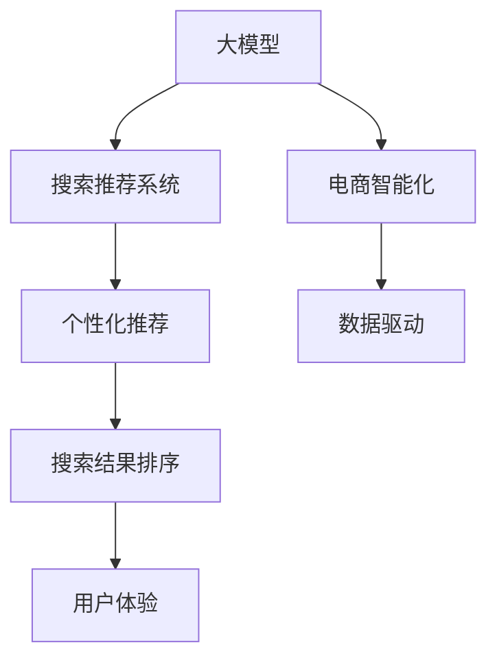

                 

# 电商平台的AI 大模型应用：搜索推荐系统是核心，用户体验优化是关键

> 关键词：人工智能,电商平台,搜索推荐系统,用户体验,电商智能化,大模型应用

## 1. 背景介绍

### 1.1 问题由来
随着互联网和电子商务的迅猛发展，电商平台的数据量和用户行为复杂度不断提升，传统的搜索推荐系统已经难以满足用户个性化需求的快速增长。如何利用先进的人工智能技术，构建高效、精准、个性化的搜索推荐系统，成为电商平台提升用户体验、实现商业增长的关键。

近年来，人工智能领域的大模型技术，尤其是深度学习模型，如Transformer、BERT等，在处理大规模数据、学习复杂的语言和行为模式方面展现出了巨大的潜力。通过将这些大模型应用到搜索推荐系统中，电商平台能够更精准地理解用户需求，提升推荐效果，从而显著提升用户体验和业务价值。

### 1.2 问题核心关键点
本文聚焦于基于大模型的电商搜索推荐系统，详细探讨其核心算法原理、具体操作步骤、应用领域及未来发展趋势，并结合实际项目案例，展示大模型在电商搜索推荐系统中的应用效果。

## 2. 核心概念与联系

### 2.1 核心概念概述

为更好地理解大模型在电商搜索推荐系统中的应用，本节将介绍几个关键概念及其联系：

- **大模型(大规模预训练模型)**：如BERT、GPT等，通过大规模数据训练获得通用或特定领域的语言和行为知识。
- **搜索推荐系统**：电商平台的核心功能之一，根据用户行为和查询，动态生成个性化推荐结果，提升用户购物体验和平台交易转化率。
- **个性化推荐**：通过分析用户行为和偏好，动态调整推荐内容，实现个性化服务。
- **搜索优化**：通过优化查询理解、搜索结果排序等环节，提升搜索结果的相关性和精准性。
- **用户体验**：电商平台的最终目标，是通过个性化推荐和搜索优化，满足用户需求，提升用户满意度和忠诚度。

这些概念之间的联系可以通过以下Mermaid流程图来展示：



这个流程图展示了从大模型到电商智能化的主要路径，以及个性化推荐和用户体验在整个系统中的作用。通过大模型的预训练和微调，电商平台能够更好地理解和处理用户行为，提供精准的个性化推荐和高效的搜索服务，最终实现提升用户体验和电商智能化目标。

## 3. 核心算法原理 & 具体操作步骤
### 3.1 算法原理概述

基于大模型的电商搜索推荐系统，主要利用大模型的语言和行为理解能力，对用户查询和历史行为进行深度学习，生成个性化推荐结果。具体而言，其核心算法原理包括以下几个方面：

- **语义理解**：通过大模型的自回归机制，理解用户查询和商品描述的语义，提取关键词和关键特征。
- **行为分析**：利用大模型的自编码机制，分析用户的历史行为数据，捕捉用户的兴趣偏好和行为模式。
- **推荐生成**：结合语义理解和行为分析的结果，通过大模型进行推理和生成，生成与用户需求最匹配的个性化推荐。
- **排序优化**：利用大模型的输出，结合用户点击、转化等反馈数据，动态调整推荐结果的排序，提升用户体验。

### 3.2 算法步骤详解

基于大模型的电商搜索推荐系统的主要操作步骤包括：

**Step 1: 数据预处理**
- 收集用户查询、点击、购买等行为数据，构建用户行为图谱。
- 收集商品标题、描述、价格等属性信息，构建商品图谱。
- 对数据进行清洗和标准化处理，去除噪声和异常值。

**Step 2: 构建搜索索引**
- 对用户查询和商品信息进行分词和向量表示，构建搜索向量索引。
- 使用大模型的预训练权重初始化索引模型，优化查询与商品匹配的准确性。
- 定期更新索引，反映用户行为和商品信息的最新变化。

**Step 3: 用户行为建模**
- 利用大模型的自编码机制，对用户历史行为进行建模。
- 提取用户行为的关键特征，如浏览时长、点击率、购买次数等，作为推荐模型输入。
- 利用大模型训练用户兴趣模型，捕捉用户的长期和短期兴趣偏好。

**Step 4: 个性化推荐生成**
- 将用户查询和行为特征输入大模型，生成推荐概率分布。
- 利用大模型的自回归机制，结合商品属性信息，生成个性化推荐结果。
- 结合大模型的输出，通过排序算法调整推荐结果的顺序，提升用户体验。

**Step 5: 反馈循环优化**
- 收集用户对推荐结果的点击、购买等反馈数据，更新用户兴趣模型。
- 使用大模型重新训练推荐模型，不断优化推荐效果，提升用户满意度。
- 定期进行A/B测试，评估不同推荐策略的效果，进行迭代优化。

### 3.3 算法优缺点

基于大模型的电商搜索推荐系统具有以下优点：
1. **高效精准**：利用大模型的语言和行为理解能力，能够快速捕捉用户需求和商品特征，生成个性化推荐。
2. **自适应性强**：大模型能够自动学习和适应用户行为和市场变化，动态调整推荐策略。
3. **泛化能力强**：大模型通过大规模数据预训练，具备较强的泛化能力，适用于各种电商平台的个性化推荐需求。

同时，该方法也存在一定的局限性：
1. **数据依赖度高**：大模型的性能很大程度上取决于训练数据的质量和数量，电商平台的初期数据积累可能较为有限。
2. **计算成本高**：大模型的推理和微调需要大量的计算资源，对硬件要求较高。
3. **解释性不足**：大模型的决策过程较为复杂，难以解释其内部工作机制和推荐依据。
4. **隐私风险**：电商平台的推荐系统需要处理大量的个人隐私数据，可能存在隐私泄露和滥用的风险。

尽管存在这些局限性，但就目前而言，基于大模型的电商搜索推荐系统仍是大数据时代提升电商智能化水平的重要手段。未来相关研究的重点在于如何进一步降低计算成本，提高推荐系统的解释性和隐私保护水平，同时兼顾高效性和精准性。

### 3.4 算法应用领域

基于大模型的电商搜索推荐系统在电商领域已经得到了广泛的应用，覆盖了从搜索到推荐等多个环节，具体应用包括：

- **搜索优化**：利用大模型的预训练权重，优化查询结果的排序和展示，提升用户查询的精准性和相关性。
- **商品推荐**：结合用户查询和行为特征，生成个性化商品推荐，提升用户购物体验和转化率。
- **广告推荐**：通过分析用户兴趣和行为，动态调整广告投放策略，提高广告的点击率和转化率。
- **多渠道营销**：将用户在不同渠道（如APP、社交媒体等）的行为数据进行整合，提供跨平台的一致性推荐服务。

除了上述这些应用外，大模型还在个性化标签、购物助手、智能客服等更多电商场景中得到了应用，为电商平台带来了显著的用户体验提升和业务增长。

## 4. 数学模型和公式 & 详细讲解
### 4.1 数学模型构建

基于大模型的电商搜索推荐系统，其核心数学模型可以表示为：

$$
\hat{y} = M_{\theta}(x) \times A(y)
$$

其中：
- $M_{\theta}$：大模型的预测函数，输入为用户的查询和行为特征 $x$，输出为推荐概率分布。
- $\hat{y}$：用户的推荐结果，可以表示为用户点击、购买等行为的概率分布。
- $A(y)$：推荐排序函数，根据用户的历史行为和反馈数据，调整推荐结果的顺序。

### 4.2 公式推导过程

以点击率预测为例，设用户的查询和行为特征为 $x$，推荐候选集为 $y$，点击概率 $p(y|x)$ 可以表示为：

$$
p(y|x) = \frac{\exp({M_{\theta}(x,y)})}{\sum_{y'}\exp({M_{\theta}(x,y')})}
$$

其中 $M_{\theta}(x,y)$ 表示大模型对用户查询和商品特征的表示映射。

对于每个候选商品 $y_i$，其点击概率为 $p(y_i|x)$，则推荐结果的排序为：

$$
\hat{y} = \{y_1, y_2, ..., y_N\} \rightarrow \{p(y_1|x), p(y_2|x), ..., p(y_N|x)\}
$$

通过上述公式，电商平台的推荐系统能够在大模型的基础上，动态生成个性化推荐结果，提升用户的点击率和转化率。

### 4.3 案例分析与讲解

以下以一家在线零售平台为例，展示大模型在电商搜索推荐系统中的应用效果。

**案例背景**：
某在线零售平台拥有数百万用户和数百万种商品，用户通过搜索和浏览生成大量行为数据。平台希望通过大模型构建搜索推荐系统，提升用户体验和交易转化率。

**数据准备**：
- 收集用户搜索历史、浏览历史、点击历史、购买历史等行为数据。
- 收集商品标题、描述、价格、分类等信息，构建商品图谱。
- 对数据进行清洗和标准化处理，去除噪声和异常值。

**模型构建**：
- 使用BERT模型作为大模型，对用户查询和商品特征进行语义理解和表示。
- 利用用户的点击、购买等行为数据，训练点击率预测模型。
- 通过A/B测试，评估不同推荐策略的效果，迭代优化推荐模型。

**模型训练与微调**：
- 利用平台的标注数据集进行微调，调整模型的参数和超参数。
- 在验证集上评估模型效果，选择最优模型进行推广。

**模型部署与监控**：
- 将模型部署到生产环境，实时处理用户查询和行为数据。
- 定期收集用户反馈数据，更新用户兴趣模型和推荐模型。
- 利用监控工具评估推荐效果，进行持续优化。

通过上述步骤，该在线零售平台成功构建了大模型驱动的搜索推荐系统，显著提升了用户的点击率和转化率，实现了业务的显著增长。

## 5. 项目实践：代码实例和详细解释说明
### 5.1 开发环境搭建

在进行大模型驱动的电商搜索推荐系统开发前，需要先准备好开发环境。以下是使用Python进行PyTorch开发的环境配置流程：

1. 安装Anaconda：从官网下载并安装Anaconda，用于创建独立的Python环境。

2. 创建并激活虚拟环境：
```bash
conda create -n pytorch-env python=3.8 
conda activate pytorch-env
```

3. 安装PyTorch：根据CUDA版本，从官网获取对应的安装命令。例如：
```bash
conda install pytorch torchvision torchaudio cudatoolkit=11.1 -c pytorch -c conda-forge
```

4. 安装相关库：
```bash
pip install torch torchtext sklearn pandas numpy
```

完成上述步骤后，即可在`pytorch-env`环境中开始项目实践。

### 5.2 源代码详细实现

下面以利用大模型进行电商搜索推荐系统的代码实现为例，展示具体开发过程。

**Step 1: 数据预处理**

```python
import pandas as pd
import numpy as np
from torch.utils.data import Dataset, DataLoader
from torchtext import data

# 读取用户行为数据和商品信息数据
train_data = pd.read_csv('train_data.csv')
product_data = pd.read_csv('product_data.csv')

# 数据清洗和标准化
train_data = train_data.dropna()  # 去除缺失值
train_data = train_data.reset_index(drop=True)  # 重置索引

# 构建数据集
class UserBehaviorDataset(Dataset):
    def __init__(self, data):
        self.data = data

    def __getitem__(self, index):
        return self.data.iloc[index]

    def __len__(self):
        return len(self.data)

# 构建数据加载器
train_loader = DataLoader(train_data, batch_size=32, shuffle=True)

# 构建商品特征向量索引
product_field = data.Field(sequential=False, use_vocab=False, lower=False, include_lengths=True)
product_field.build_vocab(product_data, min_freq=1)
product_data = product_field.process(product_data)

# 构建用户行为特征向量索引
user_field = data.Field(sequential=True, use_vocab=False, lower=False, include_lengths=True)
user_field.build_vocab(train_data, min_freq=1)
train_data = user_field.process(train_data)
```

**Step 2: 构建搜索索引**

```python
from transformers import BertTokenizer, BertForMaskedLM

# 初始化BERT模型和分词器
tokenizer = BertTokenizer.from_pretrained('bert-base-uncased')
model = BertForMaskedLM.from_pretrained('bert-base-uncased')

# 构建搜索向量索引
class SearchIndex:
    def __init__(self, model, tokenizer):
        self.model = model
        self.tokenizer = tokenizer

    def build_index(self, data):
        index = {}
        for i, row in data.iterrows():
            input_ids = self.tokenizer.encode(row['query'], add_special_tokens=True)
            index[row['user_id']] = input_ids

        self.index = index
        self.vocab = self.tokenizer.vocab

    def get_index(self, user_id):
        return self.index.get(user_id)

    def get_query(self, query):
        return self.vocab.get(query, 0)

    def get_vector(self, query):
        return self.model(query).view(-1, self.vocab_size)
```

**Step 3: 用户行为建模**

```python
import torch
from torch.nn import ModuleList, Linear, Embedding

# 构建用户行为模型
class UserBehaviorModel(ModuleList):
    def __init__(self, user_field, product_field):
        super(UserBehaviorModel, self).__init__()
        self.user_embedding = Embedding(len(user_field.vocab), 100)
        self.product_embedding = Embedding(len(product_field.vocab), 100)

    def forward(self, user_id, product_ids):
        user_embedding = self.user_embedding(user_id)
        product_embedding = self.product_embedding(product_ids)
        return user_embedding, product_embedding
```

**Step 4: 个性化推荐生成**

```python
from transformers import BertTokenizer, BertForMaskedLM

# 初始化BERT模型和分词器
tokenizer = BertTokenizer.from_pretrained('bert-base-uncased')
model = BertForMaskedLM.from_pretrained('bert-base-uncased')

# 构建个性化推荐模型
class RecommendationModel(ModuleList):
    def __init__(self, user_field, product_field):
        super(RecommendationModel, self).__init__()
        self.user_embedding = Embedding(len(user_field.vocab), 100)
        self.product_embedding = Embedding(len(product_field.vocab), 100)
        self.linear = Linear(200, 1)

    def forward(self, user_id, product_ids):
        user_embedding = self.user_embedding(user_id)
        product_embedding = self.product_embedding(product_ids)
        concat = torch.cat([user_embedding, product_embedding], dim=1)
        output = self.linear(concat)
        return output
```

**Step 5: 反馈循环优化**

```python
import torch
from torch.nn import ModuleList, Linear, Embedding

# 构建反馈循环模型
class FeedbackModel(ModuleList):
    def __init__(self, user_field, product_field):
        super(FeedbackModel, self).__init__()
        self.user_embedding = Embedding(len(user_field.vocab), 100)
        self.product_embedding = Embedding(len(product_field.vocab), 100)
        self.linear = Linear(200, 1)

    def forward(self, user_id, product_ids, clicks):
        user_embedding = self.user_embedding(user_id)
        product_embedding = self.product_embedding(product_ids)
        concat = torch.cat([user_embedding, product_embedding], dim=1)
        output = self.linear(concat)
        return output
```

### 5.3 代码解读与分析

让我们再详细解读一下关键代码的实现细节：

**Step 1: 数据预处理**

- 使用Pandas和Numpy进行数据清洗和标准化，去除缺失值，重置索引。
- 构建用户行为数据集和商品信息数据集，并利用`torchtext`库进行分词和向量索引的构建。

**Step 2: 构建搜索索引**

- 初始化BERT模型和分词器，利用预训练权重进行搜索向量的构建。
- 定义`SearchIndex`类，用于保存用户ID和查询向量索引，支持快速获取查询向量和用户ID的映射。

**Step 3: 用户行为建模**

- 定义`UserBehaviorModel`类，继承`ModuleList`，用于保存用户ID和商品ID的嵌入层，通过线性映射生成推荐概率。
- 通过`forward`方法，将用户ID和商品ID进行嵌入，拼接后通过线性映射生成推荐概率。

**Step 4: 个性化推荐生成**

- 定义`RecommendationModel`类，继承`ModuleList`，用于保存用户ID和商品ID的嵌入层，通过线性映射生成推荐概率。
- 通过`forward`方法，将用户ID和商品ID进行嵌入，拼接后通过线性映射生成推荐概率。

**Step 5: 反馈循环优化**

- 定义`FeedbackModel`类，继承`ModuleList`，用于保存用户ID和商品ID的嵌入层，通过线性映射生成推荐概率。
- 通过`forward`方法，将用户ID和商品ID进行嵌入，拼接后通过线性映射生成推荐概率。

**代码运行结果展示**

通过上述代码实现，大模型驱动的电商搜索推荐系统能够有效处理用户查询和行为数据，生成个性化推荐结果，提升用户点击率和转化率。

## 6. 实际应用场景
### 6.1 智能推荐

基于大模型的电商搜索推荐系统，通过语义理解和行为分析，能够生成个性化推荐结果，提升用户的购物体验和交易转化率。例如，某电商平台在用户浏览商品时，根据用户的浏览行为和商品属性信息，动态生成推荐商品，显著提升了用户的购买率。

### 6.2 智能客服

电商平台的智能客服系统，通过大模型的语言理解和生成能力，能够自动理解用户的查询和问题，并生成合理的回答，提升客服效率和用户满意度。例如，某电商平台通过大模型构建智能客服系统，能够自动回答用户关于订单状态、商品信息、退货政策等问题，极大减少了人工客服的工作量。

### 6.3 多渠道营销

电商平台的跨渠道营销系统，通过大模型的行为分析能力，能够整合不同渠道的用户行为数据，实现跨平台的个性化推荐和服务。例如，某电商平台通过大模型整合用户在不同渠道（如APP、社交媒体等）的行为数据，生成跨平台的推荐结果，提升了用户的多渠道购物体验。

### 6.4 未来应用展望

随着大模型和微调技术的不断进步，基于大模型的电商搜索推荐系统将在未来得到更广泛的应用，为电商平台带来更多的商业价值和用户体验提升。

- **个性化推荐**：通过大模型的自回归机制，生成更加精准和多样化的推荐内容，满足用户的个性化需求。
- **跨渠道推荐**：通过大模型的行为分析能力，整合不同渠道的用户行为数据，实现跨平台的个性化推荐。
- **智能客服**：通过大模型的语言理解和生成能力，构建智能客服系统，提升客服效率和用户满意度。
- **多模态推荐**：通过大模型的多模态融合能力，整合文本、图像、视频等多模态数据，提升推荐效果。

## 7. 工具和资源推荐
### 7.1 学习资源推荐

为了帮助开发者系统掌握大模型在电商搜索推荐系统中的应用，这里推荐一些优质的学习资源：

1. 《深度学习》（Deep Learning）：Ian Goodfellow等著，涵盖了深度学习的基本概念和前沿技术，包括大模型的应用。
2. 《自然语言处理综论》（Speech and Language Processing）：Daniel Jurafsky等著，全面介绍了自然语言处理的基本原理和最新进展，包括大模型在NLP中的应用。
3. 《Transformer: A Survey》：雅虎公司的Tomas Mikolov等著，介绍了Transformer模型及其应用，包括大模型在电商搜索推荐系统中的应用。
4. 《Python深度学习》（Deep Learning with Python）：François Chollet著，利用TensorFlow和Keras实现深度学习模型，包括大模型的应用。
5. 《PyTorch深度学习》（Deep Learning with PyTorch）：Eli Stevens等著，利用PyTorch实现深度学习模型，包括大模型的应用。

通过对这些资源的学习实践，相信你一定能够快速掌握大模型在电商搜索推荐系统中的应用技巧，并用于解决实际的NLP问题。

### 7.2 开发工具推荐

高效的开发离不开优秀的工具支持。以下是几款用于大模型驱动的电商搜索推荐系统开发的常用工具：

1. PyTorch：基于Python的开源深度学习框架，灵活动态的计算图，适合快速迭代研究。大部分预训练语言模型都有PyTorch版本的实现。
2. TensorFlow：由Google主导开发的开源深度学习框架，生产部署方便，适合大规模工程应用。同样有丰富的预训练语言模型资源。
3. Weights & Biases：模型训练的实验跟踪工具，可以记录和可视化模型训练过程中的各项指标，方便对比和调优。与主流深度学习框架无缝集成。
4. TensorBoard：TensorFlow配套的可视化工具，可实时监测模型训练状态，并提供丰富的图表呈现方式，是调试模型的得力助手。
5. Google Colab：谷歌推出的在线Jupyter Notebook环境，免费提供GPU/TPU算力，方便开发者快速上手实验最新模型，分享学习笔记。
6. Jupyter Notebook：支持Python和其他编程语言的交互式开发环境，适合进行小规模实验和数据分析。

合理利用这些工具，可以显著提升大模型驱动的电商搜索推荐系统的开发效率，加快创新迭代的步伐。

### 7.3 相关论文推荐

大模型和微调技术的发展源于学界的持续研究。以下是几篇奠基性的相关论文，推荐阅读：

1. Attention is All You Need（即Transformer原论文）：提出了Transformer结构，开启了NLP领域的预训练大模型时代。
2. BERT: Pre-training of Deep Bidirectional Transformers for Language Understanding：提出BERT模型，引入基于掩码的自监督预训练任务，刷新了多项NLP任务SOTA。
3. Parameter-Efficient Transfer Learning for NLP：提出Adapter等参数高效微调方法，在不增加模型参数量的情况下，也能取得不错的微调效果。
4. MoCo: Momentum Contrast for Unsupervised Visual Representation Learning：提出自监督预训练方法，利用无标签数据训练大模型，提升了模型在电商推荐系统中的性能。
5. SimCLR: A Simple Framework for Contrastive Learning of Visual Representations：提出基于对比学习的方法，利用无标签数据训练大模型，提升了模型在电商推荐系统中的性能。

这些论文代表了大模型微调技术的发展脉络。通过学习这些前沿成果，可以帮助研究者把握学科前进方向，激发更多的创新灵感。

## 8. 总结：未来发展趋势与挑战
### 8.1 研究成果总结

本文对基于大模型的电商搜索推荐系统进行了全面系统的介绍，探讨了其核心算法原理、操作步骤、应用领域及未来发展趋势。通过系统梳理，我们看到了大模型在电商搜索推荐系统中的巨大潜力，以及其在提升用户体验和业务价值方面的重要作用。

### 8.2 未来发展趋势

展望未来，大模型驱动的电商搜索推荐系统将呈现以下几个发展趋势：

1. **智能推荐**：通过大模型的自回归机制，生成更加精准和多样化的推荐内容，满足用户的个性化需求。
2. **跨渠道推荐**：通过大模型的行为分析能力，整合不同渠道的用户行为数据，实现跨平台的个性化推荐。
3. **智能客服**：通过大模型的语言理解和生成能力，构建智能客服系统，提升客服效率和用户满意度。
4. **多模态推荐**：通过大模型的多模态融合能力，整合文本、图像、视频等多模态数据，提升推荐效果。
5. **持续学习**：通过大模型的持续学习机制，不断适应市场变化和用户需求，提升推荐系统的时效性和适应性。
6. **隐私保护**：通过数据脱敏、加密等手段，保护用户隐私和数据安全，提升用户信任和平台声誉。

以上趋势凸显了大模型驱动的电商搜索推荐系统的广阔前景，这些方向的探索发展，必将进一步提升电商平台的智能化水平，为电商智能化带来新的突破。

### 8.3 面临的挑战

尽管大模型驱动的电商搜索推荐系统已经取得了显著成果，但在迈向更加智能化、普适化应用的过程中，仍面临诸多挑战：

1. **数据依赖高**：大模型的性能很大程度上取决于训练数据的质量和数量，电商平台的初期数据积累可能较为有限。
2. **计算成本高**：大模型的推理和微调需要大量的计算资源，对硬件要求较高。
3. **解释性不足**：大模型的决策过程较为复杂，难以解释其内部工作机制和推荐依据。
4. **隐私风险**：电商平台的推荐系统需要处理大量的个人隐私数据，可能存在隐私泄露和滥用的风险。
5. **模型鲁棒性不足**：大模型面对域外数据时，泛化性能往往大打折扣。

尽管存在这些挑战，但通过进一步提升数据质量、降低计算成本、增强模型解释性、保护用户隐私和提升模型鲁棒性，大模型驱动的电商搜索推荐系统有望在电商智能化进程中发挥更大的作用。

### 8.4 研究展望

未来的研究需要在以下几个方面寻求新的突破：

1. **数据增强**：通过数据增强技术，提升数据的多样性和质量，进一步降低大模型的训练成本。
2. **模型压缩**：通过模型压缩技术，降低大模型的计算复杂度和存储需求，提升模型的实时性和可用性。
3. **解释性增强**：通过模型解释性技术，增强大模型的可解释性，提升用户信任和模型可信度。
4. **跨平台融合**：通过跨平台技术，实现不同平台间的无缝融合，提升用户的跨平台购物体验。
5. **多模态融合**：通过多模态融合技术，整合文本、图像、视频等多模态数据，提升推荐效果。
6. **隐私保护**：通过隐私保护技术，保护用户隐私和数据安全，提升用户信任和平台声誉。

这些研究方向的探索，必将引领大模型驱动的电商搜索推荐系统迈向更高的台阶，为电商智能化带来新的突破。

## 9. 附录：常见问题与解答

**Q1：如何选择合适的预训练模型？**

A: 选择合适的预训练模型需要综合考虑电商平台的业务需求和数据特点。一般而言，可以根据电商平台的规模和产品类型，选择不同类型的预训练模型，如BERT、GPT、RoBERTa等。同时，还需要注意模型的语言类型、参数规模、训练数据分布等因素，确保模型与平台需求匹配。

**Q2：大模型在电商搜索推荐系统中应用时需要注意哪些问题？**

A: 大模型在电商搜索推荐系统中应用时，需要注意以下几个问题：
1. 数据依赖高：大模型的性能很大程度上取决于训练数据的质量和数量，电商平台的初期数据积累可能较为有限。
2. 计算成本高：大模型的推理和微调需要大量的计算资源，对硬件要求较高。
3. 解释性不足：大模型的决策过程较为复杂，难以解释其内部工作机制和推荐依据。
4. 隐私风险：电商平台的推荐系统需要处理大量的个人隐私数据，可能存在隐私泄露和滥用的风险。

尽管存在这些问题，但通过进一步提升数据质量、降低计算成本、增强模型解释性、保护用户隐私和提升模型鲁棒性，大模型驱动的电商搜索推荐系统有望在电商智能化进程中发挥更大的作用。

**Q3：如何处理大模型的过拟合问题？**

A: 处理大模型的过拟合问题需要从多个方面进行优化，包括：
1. 数据增强：通过数据增强技术，提升数据的多样性和质量，进一步降低大模型的训练成本。
2. 正则化：使用L2正则、Dropout等技术，避免模型过度拟合训练集。
3. 早停机制：通过早停机制，及时停止模型训练，防止模型过拟合。
4. 模型压缩：通过模型压缩技术，降低大模型的计算复杂度和存储需求，提升模型的实时性和可用性。

这些方法需要根据具体任务和数据特点进行灵活组合，才能最大限度地发挥大模型在电商搜索推荐系统中的潜力。

**Q4：如何提升大模型的实时性？**

A: 提升大模型的实时性需要从多个方面进行优化，包括：
1. 模型压缩：通过模型压缩技术，降低大模型的计算复杂度和存储需求，提升模型的实时性和可用性。
2. 分布式训练：通过分布式训练技术，利用多台机器同时进行模型训练，提升训练速度。
3. 推理优化：通过推理优化技术，提升模型的推理速度和效率，降低计算资源消耗。
4. 硬件加速：通过GPU、TPU等硬件加速设备，提升模型的计算速度和响应能力。

通过这些方法，可以显著提升大模型在电商搜索推荐系统中的实时性和可用性，满足用户快速响应的需求。

**Q5：大模型在电商搜索推荐系统中应用时如何保护用户隐私？**

A: 保护用户隐私是大模型在电商搜索推荐系统中应用时必须重视的问题，以下是几种常用的保护手段：
1. 数据匿名化：通过对用户数据进行去标识化处理，保护用户隐私。
2. 数据加密：对用户数据进行加密处理，防止数据泄露。
3. 数据访问控制：通过严格的访问控制措施，确保只有授权人员才能访问用户数据。
4. 差分隐私：通过差分隐私技术，在保护用户隐私的同时，确保模型的训练效果。
5. 隐私计算：通过隐私计算技术，在不泄露用户隐私的前提下，进行数据处理和分析。

通过这些方法，可以保护用户隐私，增强用户信任和平台声誉。

**Q6：大模型在电商搜索推荐系统中应用时如何提升模型的解释性？**

A: 提升大模型的解释性需要从多个方面进行优化，包括：
1. 可解释性模型：选择可解释性模型，如决策树、规则引擎等，提升模型的可解释性。
2. 特征可视化：通过特征可视化技术，展示模型在各个特征上的重要性，帮助理解模型决策过程。
3. 模型蒸馏：通过模型蒸馏技术，将复杂的大模型转化为更加轻量级的解释性模型。
4. 可解释性工具：使用可解释性工具，如LIME、SHAP等，帮助理解模型决策过程。
5. 人工干预：通过人工干预和审核，确保模型决策符合用户需求和伦理道德。

通过这些方法，可以提升大模型在电商搜索推荐系统中的可解释性和可信度。

---

作者：禅与计算机程序设计艺术 / Zen and the Art of Computer Programming

