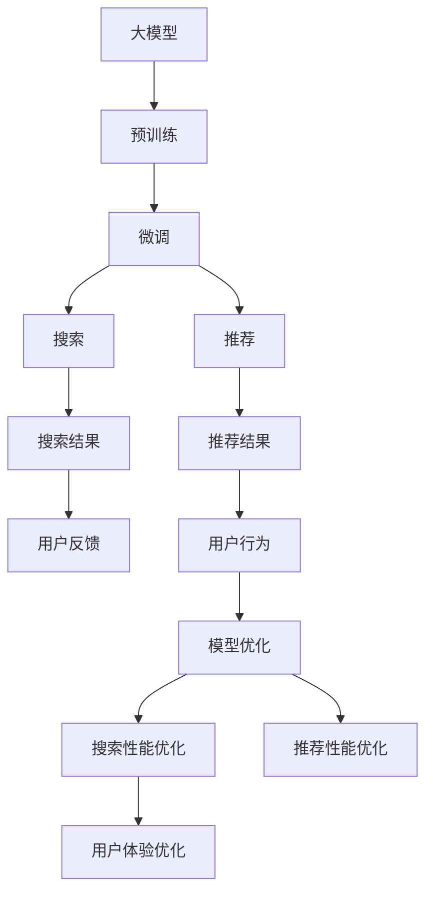

                 

# 电商平台的AI 大模型应用：搜索推荐系统是核心，用户体验优化是关键

## 1. 背景介绍

### 1.1 问题由来

随着电子商务的迅速发展，各大电商平台面临着前所未有的挑战。为了满足用户快速增长的需求，电商平台需要构建高效、智能的搜索推荐系统，提升用户体验，并提升转化率和营收。传统的搜索推荐系统主要依赖特征工程和规则匹配，难以满足多样化和个性化的用户需求。而人工智能技术的引入，特别是预训练语言模型和推荐算法的发展，为电商平台的搜索推荐系统带来了新的突破。

### 1.2 问题核心关键点

电商平台的AI搜索推荐系统主要包括两大核心组件：搜索和推荐。搜索组件利用自然语言处理技术，理解用户查询意图，从海量商品中筛选出最相关的结果。推荐组件则根据用户行为和商品属性，预测用户可能感兴趣的商品，并进行个性化推荐。

基于大模型的搜索推荐系统通过预训练学习丰富的语言和商品知识，通过微调适应特定的电商场景，提升了系统智能化水平和用户体验。

### 1.3 问题研究意义

构建高效、智能的搜索推荐系统，对于电商平台的长期发展具有重要意义：

1. **提升用户体验**：智能化的搜索推荐系统能够快速、准确地满足用户需求，提升用户满意度和忠诚度。
2. **优化流量分配**：通过智能推荐，能够更有效地将流量分配给高价值用户和商品，提高平台营收。
3. **降低运营成本**：智能系统减少了人工干预，降低了运营成本，提升了平台运营效率。
4. **拓展市场范围**：智能化的推荐能够发现用户未明确表达的需求，拓展市场机会，增加用户粘性。

## 2. 核心概念与联系

### 2.1 核心概念概述

- **大模型**：指基于深度学习的大型神经网络模型，如BERT、GPT、Transformer等，通过在大规模数据集上进行预训练，获得了广泛的语义理解能力。
- **预训练**：指在大规模无标注数据上进行自监督学习，学习通用的语言和商品表示。
- **微调**：指在大模型上进行下游任务的训练，适应特定的电商场景，提升系统的精确性和个性化。
- **搜索**：指根据用户查询，从商品库中筛选出最相关的商品展示。
- **推荐**：指根据用户行为和商品属性，预测用户可能感兴趣的商品，进行个性化推荐。
- **用户体验**：指用户在使用搜索推荐系统时的直观感受和满意度，是评估系统效果的关键指标。
- **数据湖**：指电商平台的商品库、用户行为数据、反馈数据等海量数据集合。

这些概念之间的联系可以概括为：

- 大模型通过预训练学习通用知识，微调后适配电商场景，提升了搜索和推荐系统的智能水平。
- 搜索和推荐系统分别处理用户查询和行为数据，利用大模型提取相关特征，进行意图匹配和商品推荐。
- 用户体验是系统效果的综合反映，系统优化应以提升用户体验为目标。
- 数据湖为系统的训练和优化提供了丰富的数据资源，是模型学习的基础。

### 2.2 核心概念原理和架构的 Mermaid 流程图



该流程图展示了从预训练大模型到搜索推荐系统的架构和流程，说明了各个组件之间的相互关系。

## 3. 核心算法原理 & 具体操作步骤

### 3.1 算法原理概述

电商平台的搜索推荐系统主要基于深度学习和大模型进行构建。其核心算法原理包括以下几个方面：

1. **搜索算法**：利用自然语言处理技术，理解用户查询意图，从商品库中筛选出最相关的商品。
2. **推荐算法**：基于用户行为和商品属性，预测用户可能感兴趣的商品，进行个性化推荐。
3. **大模型应用**：预训练大模型通过学习广泛的语义知识，微调后适应电商场景，提升了系统的精确性和个性化。

### 3.2 算法步骤详解

**步骤1：预训练大模型**

- **数据收集**：收集电商平台的商品描述、用户行为数据、商品属性数据等，构建大规模数据集。
- **模型选择**：选择适合电商场景的预训练模型，如BERT、GPT等。
- **预训练任务**：利用自监督学习任务，如掩码语言模型、预测下一个词等，训练模型。

**步骤2：微调大模型**

- **数据标注**：对用户查询和行为数据进行标注，构建监督数据集。
- **模型选择**：选择合适的优化器和超参数，如AdamW、SGD等。
- **微调训练**：在大模型上进行微调，适应电商场景，优化搜索和推荐性能。

**步骤3：搜索和推荐**

- **搜索算法**：利用微调后的大模型，理解用户查询意图，提取相关特征，从商品库中筛选出最相关的商品。
- **推荐算法**：基于用户行为和商品属性，预测用户可能感兴趣的商品，进行个性化推荐。

**步骤4：用户体验优化**

- **反馈收集**：收集用户对搜索结果和推荐结果的反馈数据，进行数据分析。
- **模型优化**：根据用户反馈数据，进一步微调模型，提升系统效果。
- **界面优化**：优化搜索和推荐系统的UI/UX设计，提升用户满意度。

### 3.3 算法优缺点

基于大模型的搜索推荐系统具有以下优点：

1. **精度高**：大模型通过预训练学习丰富的语言和商品知识，微调后提升了系统的精确性和个性化。
2. **扩展性强**：大模型可适配不同的电商场景和需求，灵活性高。
3. **效果显著**：在电商搜索推荐场景中，大模型显著提升了用户满意度、转化率和营收。

同时，该方法也存在一些缺点：

1. **计算资源消耗大**：大模型和微调过程需要大量的计算资源，成本较高。
2. **对标注数据依赖高**：微调过程依赖于标注数据，数据质量和数量直接影响系统效果。
3. **模型复杂度高**：大模型复杂度较高，部署和维护难度较大。
4. **过拟合风险**：大模型容易过拟合，需要合理选择学习率等参数。

### 3.4 算法应用领域

基于大模型的搜索推荐系统在电商领域有广泛应用：

- **搜索**：电商平台的商品搜索，利用大模型理解用户查询意图，筛选出最相关的商品。
- **推荐**：基于用户行为和商品属性，预测用户可能感兴趣的商品，进行个性化推荐。
- **广告推荐**：利用大模型预测用户可能感兴趣的广告，提升广告投放效果。
- **智能客服**：通过大模型构建智能客服系统，快速响应用户咨询，提升用户体验。

## 4. 数学模型和公式 & 详细讲解 & 举例说明

### 4.1 数学模型构建

电商平台的搜索推荐系统主要涉及自然语言处理和推荐系统两个领域。以下将分别介绍这两个领域的数学模型。

**自然语言处理模型**：

- **输入**：用户查询文本 $q$ 和商品描述文本 $d$。
- **输出**：用户对商品的相关度评分 $s$。

**推荐系统模型**：

- **输入**：用户行为数据 $u$ 和商品属性数据 $p$。
- **输出**：用户对商品的兴趣评分 $r$。

### 4.2 公式推导过程

**自然语言处理模型**：

- **查询理解**：利用BERT等大模型，将用户查询 $q$ 编码为向量表示 $q_v$。
- **商品匹配**：将商品描述 $d$ 编码为向量表示 $d_v$。
- **相关度评分**：计算查询向量和商品向量的相似度，得到相关度评分 $s$。

$$
s = \text{similarity}(q_v, d_v)
$$

其中 $\text{similarity}$ 可以是余弦相似度、点积相似度等。

**推荐系统模型**：

- **用户行为编码**：利用RNN、LSTM等模型，将用户行为 $u$ 编码为向量表示 $u_v$。
- **商品属性编码**：将商品属性 $p$ 编码为向量表示 $p_v$。
- **兴趣评分**：将用户行为向量 $u_v$ 和商品属性向量 $p_v$ 进行融合，得到兴趣评分 $r$。

$$
r = f(u_v, p_v)
$$

其中 $f$ 可以是加权平均、注意力机制等。

### 4.3 案例分析与讲解

以下以电商平台的搜索系统为例，具体讲解模型构建和推理过程。

**步骤1：预训练大模型**

- **数据收集**：收集电商平台的商品描述、用户行为数据等，构建大规模数据集。
- **模型选择**：选择BERT模型作为预训练模型。
- **预训练任务**：利用掩码语言模型、预测下一个词等任务，训练BERT模型。

**步骤2：微调大模型**

- **数据标注**：对用户查询和行为数据进行标注，构建监督数据集。
- **模型选择**：选择合适的优化器和超参数，如AdamW、SGD等。
- **微调训练**：在大模型上进行微调，适应电商搜索场景。

**步骤3：搜索结果计算**

- **查询理解**：利用微调后的BERT模型，将用户查询 $q$ 编码为向量表示 $q_v$。
- **商品匹配**：将商品描述 $d$ 编码为向量表示 $d_v$。
- **相关度评分**：计算查询向量和商品向量的余弦相似度，得到相关度评分 $s$。

$$
s = \frac{\vec{q} \cdot \vec{d}}{\|\vec{q}\| \|\vec{d}\|}
$$

其中 $\vec{q}$ 和 $\vec{d}$ 分别为查询向量和商品向量。

**步骤4：搜索结果展示**

- **排序算法**：根据相关度评分 $s$，对搜索结果进行排序，展示给用户。

## 5. 项目实践：代码实例和详细解释说明

### 5.1 开发环境搭建

进行项目实践前，我们需要准备好开发环境。以下是使用Python进行PyTorch开发的环境配置流程：

1. 安装Anaconda：从官网下载并安装Anaconda，用于创建独立的Python环境。
```bash
conda create -n pytorch-env python=3.8 
conda activate pytorch-env
```

2. 安装PyTorch：根据CUDA版本，从官网获取对应的安装命令。例如：
```bash
conda install pytorch torchvision torchaudio cudatoolkit=11.1 -c pytorch -c conda-forge
```

3. 安装Transformers库：
```bash
pip install transformers
```

4. 安装各类工具包：
```bash
pip install numpy pandas scikit-learn matplotlib tqdm jupyter notebook ipython
```

完成上述步骤后，即可在`pytorch-env`环境中开始项目实践。

### 5.2 源代码详细实现

下面我们以电商平台的搜索系统为例，给出使用Transformers库对BERT模型进行微调的PyTorch代码实现。

首先，定义搜索任务的数据处理函数：

```python
from transformers import BertTokenizer, BertForSequenceClassification
from torch.utils.data import Dataset
import torch

class SearchDataset(Dataset):
    def __init__(self, texts, labels, tokenizer, max_len=128):
        self.texts = texts
        self.labels = labels
        self.tokenizer = tokenizer
        self.max_len = max_len
        
    def __len__(self):
        return len(self.texts)
    
    def __getitem__(self, item):
        text = self.texts[item]
        label = self.labels[item]
        
        encoding = self.tokenizer(text, return_tensors='pt', max_length=self.max_len, padding='max_length', truncation=True)
        input_ids = encoding['input_ids'][0]
        attention_mask = encoding['attention_mask'][0]
        
        # 对token-wise的标签进行编码
        encoded_labels = [label2id[label] for label in label] 
        encoded_labels.extend([label2id['O']] * (self.max_len - len(encoded_labels)))
        labels = torch.tensor(encoded_labels, dtype=torch.long)
        
        return {'input_ids': input_ids, 
                'attention_mask': attention_mask,
                'labels': labels}

# 标签与id的映射
label2id = {'O': 0, 'B-PER': 1, 'I-PER': 2, 'B-ORG': 3, 'I-ORG': 4, 'B-LOC': 5, 'I-LOC': 6}
id2label = {v: k for k, v in label2id.items()}

# 创建dataset
tokenizer = BertTokenizer.from_pretrained('bert-base-cased')

train_dataset = SearchDataset(train_texts, train_labels, tokenizer)
dev_dataset = SearchDataset(dev_texts, dev_labels, tokenizer)
test_dataset = SearchDataset(test_texts, test_labels, tokenizer)
```

然后，定义模型和优化器：

```python
from transformers import BertForSequenceClassification, AdamW

model = BertForSequenceClassification.from_pretrained('bert-base-cased', num_labels=len(label2id))

optimizer = AdamW(model.parameters(), lr=2e-5)
```

接着，定义训练和评估函数：

```python
from torch.utils.data import DataLoader
from tqdm import tqdm
from sklearn.metrics import classification_report

device = torch.device('cuda') if torch.cuda.is_available() else torch.device('cpu')
model.to(device)

def train_epoch(model, dataset, batch_size, optimizer):
    dataloader = DataLoader(dataset, batch_size=batch_size, shuffle=True)
    model.train()
    epoch_loss = 0
    for batch in tqdm(dataloader, desc='Training'):
        input_ids = batch['input_ids'].to(device)
        attention_mask = batch['attention_mask'].to(device)
        labels = batch['labels'].to(device)
        model.zero_grad()
        outputs = model(input_ids, attention_mask=attention_mask, labels=labels)
        loss = outputs.loss
        epoch_loss += loss.item()
        loss.backward()
        optimizer.step()
    return epoch_loss / len(dataloader)

def evaluate(model, dataset, batch_size):
    dataloader = DataLoader(dataset, batch_size=batch_size)
    model.eval()
    preds, labels = [], []
    with torch.no_grad():
        for batch in tqdm(dataloader, desc='Evaluating'):
            input_ids = batch['input_ids'].to(device)
            attention_mask = batch['attention_mask'].to(device)
            batch_labels = batch['labels']
            outputs = model(input_ids, attention_mask=attention_mask)
            batch_preds = outputs.logits.argmax(dim=2).to('cpu').tolist()
            batch_labels = batch_labels.to('cpu').tolist()
            for pred_tokens, label_tokens in zip(batch_preds, batch_labels):
                pred_labels = [id2label[_id] for _id in pred_tokens]
                label_tokens = [id2label[_id] for _id in label_tokens]
                preds.append(pred_labels[:len(label_tokens)])
                labels.append(label_tokens)
                
    print(classification_report(labels, preds))
```

最后，启动训练流程并在测试集上评估：

```python
epochs = 5
batch_size = 16

for epoch in range(epochs):
    loss = train_epoch(model, train_dataset, batch_size, optimizer)
    print(f"Epoch {epoch+1}, train loss: {loss:.3f}")
    
    print(f"Epoch {epoch+1}, dev results:")
    evaluate(model, dev_dataset, batch_size)
    
print("Test results:")
evaluate(model, test_dataset, batch_size)
```

以上就是使用PyTorch对BERT进行电商搜索系统微调的完整代码实现。可以看到，得益于Transformers库的强大封装，我们可以用相对简洁的代码完成BERT模型的加载和微调。

### 5.3 代码解读与分析

让我们再详细解读一下关键代码的实现细节：

**SearchDataset类**：
- `__init__`方法：初始化文本、标签、分词器等关键组件。
- `__len__`方法：返回数据集的样本数量。
- `__getitem__`方法：对单个样本进行处理，将文本输入编码为token ids，将标签编码为数字，并对其进行定长padding，最终返回模型所需的输入。

**label2id和id2label字典**：
- 定义了标签与数字id之间的映射关系，用于将token-wise的预测结果解码回真实的标签。

**训练和评估函数**：
- 使用PyTorch的DataLoader对数据集进行批次化加载，供模型训练和推理使用。
- 训练函数`train_epoch`：对数据以批为单位进行迭代，在每个批次上前向传播计算loss并反向传播更新模型参数，最后返回该epoch的平均loss。
- 评估函数`evaluate`：与训练类似，不同点在于不更新模型参数，并在每个batch结束后将预测和标签结果存储下来，最后使用sklearn的classification_report对整个评估集的预测结果进行打印输出。

**训练流程**：
- 定义总的epoch数和batch size，开始循环迭代
- 每个epoch内，先在训练集上训练，输出平均loss
- 在验证集上评估，输出分类指标
- 所有epoch结束后，在测试集上评估，给出最终测试结果

可以看到，PyTorch配合Transformers库使得BERT微调的代码实现变得简洁高效。开发者可以将更多精力放在数据处理、模型改进等高层逻辑上，而不必过多关注底层的实现细节。

当然，工业级的系统实现还需考虑更多因素，如模型的保存和部署、超参数的自动搜索、更灵活的任务适配层等。但核心的微调范式基本与此类似。

## 6. 实际应用场景

### 6.1 智能客服系统

基于大语言模型微调的对话技术，可以广泛应用于智能客服系统的构建。传统客服往往需要配备大量人力，高峰期响应缓慢，且一致性和专业性难以保证。而使用微调后的对话模型，可以7x24小时不间断服务，快速响应客户咨询，用自然流畅的语言解答各类常见问题。

在技术实现上，可以收集企业内部的历史客服对话记录，将问题和最佳答复构建成监督数据，在此基础上对预训练对话模型进行微调。微调后的对话模型能够自动理解用户意图，匹配最合适的答案模板进行回复。对于客户提出的新问题，还可以接入检索系统实时搜索相关内容，动态组织生成回答。如此构建的智能客服系统，能大幅提升客户咨询体验和问题解决效率。

### 6.2 金融舆情监测

金融机构需要实时监测市场舆论动向，以便及时应对负面信息传播，规避金融风险。传统的人工监测方式成本高、效率低，难以应对网络时代海量信息爆发的挑战。基于大语言模型微调的文本分类和情感分析技术，为金融舆情监测提供了新的解决方案。

具体而言，可以收集金融领域相关的新闻、报道、评论等文本数据，并对其进行主题标注和情感标注。在此基础上对预训练语言模型进行微调，使其能够自动判断文本属于何种主题，情感倾向是正面、中性还是负面。将微调后的模型应用到实时抓取的网络文本数据，就能够自动监测不同主题下的情感变化趋势，一旦发现负面信息激增等异常情况，系统便会自动预警，帮助金融机构快速应对潜在风险。

### 6.3 个性化推荐系统

当前的推荐系统往往只依赖用户的历史行为数据进行物品推荐，难以深入理解用户的真实兴趣偏好。基于大语言模型微调技术，个性化推荐系统可以更好地挖掘用户行为背后的语义信息，从而提供更精准、多样的推荐内容。

在实践中，可以收集用户浏览、点击、评论、分享等行为数据，提取和用户交互的物品标题、描述、标签等文本内容。将文本内容作为模型输入，用户的后续行为（如是否点击、购买等）作为监督信号，在此基础上微调预训练语言模型。微调后的模型能够从文本内容中准确把握用户的兴趣点。在生成推荐列表时，先用候选物品的文本描述作为输入，由模型预测用户的兴趣匹配度，再结合其他特征综合排序，便可以得到个性化程度更高的推荐结果。

### 6.4 未来应用展望

随着大语言模型微调技术的发展，其在电商平台的搜索推荐系统中的应用前景将更加广阔。未来，基于大模型的搜索推荐系统将在以下几个方面得到进一步发展：

1. **多模态搜索**：结合视觉、语音等多模态信息，构建更全面、准确的搜索推荐系统。
2. **实时推荐**：利用流式数据处理技术，实现实时推荐，提升用户体验。
3. **知识图谱集成**：将知识图谱与搜索推荐系统结合，提升系统对复杂问题的理解和推理能力。
4. **个性化推荐**：结合用户行为、历史偏好、社交网络等多元信息，进行更精准的推荐。
5. **跨平台协作**：实现跨平台数据共享和协同推荐，提升推荐系统的覆盖范围和效果。
6. **实时反馈优化**：利用实时反馈机制，不断优化模型，提升推荐效果。

这些技术的发展将使得电商平台搜索推荐系统更加智能化、个性化，提升用户体验和平台营收。

## 7. 工具和资源推荐

### 7.1 学习资源推荐

为了帮助开发者系统掌握大语言模型微调的理论基础和实践技巧，这里推荐一些优质的学习资源：

1. 《Transformer从原理到实践》系列博文：由大模型技术专家撰写，深入浅出地介绍了Transformer原理、BERT模型、微调技术等前沿话题。

2. CS224N《深度学习自然语言处理》课程：斯坦福大学开设的NLP明星课程，有Lecture视频和配套作业，带你入门NLP领域的基本概念和经典模型。

3. 《Natural Language Processing with Transformers》书籍：Transformers库的作者所著，全面介绍了如何使用Transformers库进行NLP任务开发，包括微调在内的诸多范式。

4. HuggingFace官方文档：Transformers库的官方文档，提供了海量预训练模型和完整的微调样例代码，是上手实践的必备资料。

5. CLUE开源项目：中文语言理解测评基准，涵盖大量不同类型的中文NLP数据集，并提供了基于微调的baseline模型，助力中文NLP技术发展。

通过对这些资源的学习实践，相信你一定能够快速掌握大语言模型微调的精髓，并用于解决实际的NLP问题。

### 7.2 开发工具推荐

高效的开发离不开优秀的工具支持。以下是几款用于大语言模型微调开发的常用工具：

1. PyTorch：基于Python的开源深度学习框架，灵活动态的计算图，适合快速迭代研究。大部分预训练语言模型都有PyTorch版本的实现。

2. TensorFlow：由Google主导开发的开源深度学习框架，生产部署方便，适合大规模工程应用。同样有丰富的预训练语言模型资源。

3. Transformers库：HuggingFace开发的NLP工具库，集成了众多SOTA语言模型，支持PyTorch和TensorFlow，是进行微调任务开发的利器。

4. Weights & Biases：模型训练的实验跟踪工具，可以记录和可视化模型训练过程中的各项指标，方便对比和调优。与主流深度学习框架无缝集成。

5. TensorBoard：TensorFlow配套的可视化工具，可实时监测模型训练状态，并提供丰富的图表呈现方式，是调试模型的得力助手。

6. Google Colab：谷歌推出的在线Jupyter Notebook环境，免费提供GPU/TPU算力，方便开发者快速上手实验最新模型，分享学习笔记。

合理利用这些工具，可以显著提升大语言模型微调任务的开发效率，加快创新迭代的步伐。

### 7.3 相关论文推荐

大语言模型和微调技术的发展源于学界的持续研究。以下是几篇奠基性的相关论文，推荐阅读：

1. Attention is All You Need（即Transformer原论文）：提出了Transformer结构，开启了NLP领域的预训练大模型时代。

2. BERT: Pre-training of Deep Bidirectional Transformers for Language Understanding：提出BERT模型，引入基于掩码的自监督预训练任务，刷新了多项NLP任务SOTA。

3. Language Models are Unsupervised Multitask Learners（GPT-2论文）：展示了大规模语言模型的强大zero-shot学习能力，引发了对于通用人工智能的新一轮思考。

4. Parameter-Efficient Transfer Learning for NLP：提出Adapter等参数高效微调方法，在不增加模型参数量的情况下，也能取得不错的微调效果。

5. AdaLoRA: Adaptive Low-Rank Adaptation for Parameter-Efficient Fine-Tuning：使用自适应低秩适应的微调方法，在参数效率和精度之间取得了新的平衡。

这些论文代表了大语言模型微调技术的发展脉络。通过学习这些前沿成果，可以帮助研究者把握学科前进方向，激发更多的创新灵感。

## 8. 总结：未来发展趋势与挑战

### 8.1 研究成果总结

本文对基于大模型的电商搜索推荐系统进行了全面系统的介绍。首先阐述了电商搜索推荐系统的核心算法原理和构建步骤，详细讲解了预训练大模型的预训练和微调过程，以及搜索和推荐系统的实现细节。其次，通过实例代码演示了基于BERT的电商搜索系统的开发过程，展示了大模型在电商搜索推荐场景中的强大效果。最后，展望了未来大模型在电商搜索推荐系统的应用前景，分析了微调面临的挑战和未来突破方向。

通过本文的系统梳理，可以看到，基于大模型的搜索推荐系统为电商平台带来了显著的性能提升和用户体验优化，未来将在电商领域得到更广泛的应用。

### 8.2 未来发展趋势

展望未来，大语言模型在电商平台的搜索推荐系统中的应用前景将更加广阔：

1. **智能客服**：基于大模型的对话系统将进一步提升客服系统的响应速度和质量，提高用户满意度。
2. **个性化推荐**：结合多模态信息、知识图谱、实时反馈等技术，实现更精准的个性化推荐，提升转化率。
3. **实时推荐**：利用流式数据处理技术，实现实时推荐，提升用户体验。
4. **多模态搜索**：结合视觉、语音等多模态信息，构建更全面、准确的搜索推荐系统。
5. **跨平台协作**：实现跨平台数据共享和协同推荐，提升推荐系统的覆盖范围和效果。

这些技术的发展将使得电商平台搜索推荐系统更加智能化、个性化，提升用户体验和平台营收。

### 8.3 面临的挑战

尽管大语言模型在电商平台的搜索推荐系统中的应用前景广阔，但仍面临以下挑战：

1. **计算资源消耗大**：大模型和微调过程需要大量的计算资源，成本较高。
2. **对标注数据依赖高**：微调过程依赖于标注数据，数据质量和数量直接影响系统效果。
3. **模型复杂度高**：大模型复杂度较高，部署和维护难度较大。
4. **过拟合风险**：大模型容易过拟合，需要合理选择学习率等参数。
5. **数据隐私和安全**：电商平台的业务涉及大量敏感数据，需要确保数据隐私和安全。

### 8.4 研究展望

面对大语言模型在电商搜索推荐系统中的应用挑战，未来的研究需要在以下几个方面寻求新的突破：

1. **参数高效微调**：开发更加参数高效的微调方法，在固定大部分预训练参数的同时，只更新极少量的任务相关参数。
2. **多模态融合**：结合视觉、语音等多模态信息，提升搜索推荐系统的准确性和丰富性。
3. **实时数据处理**：利用流式数据处理技术，实现实时推荐，提升用户体验。
4. **跨平台协作**：实现跨平台数据共享和协同推荐，提升推荐系统的覆盖范围和效果。
5. **数据隐私保护**：采用隐私保护技术，如差分隐私、联邦学习等，确保用户数据隐私和安全。

这些研究方向的探索，将引领大语言模型在电商搜索推荐系统中的应用进入新的阶段，为电商平台的智能化、个性化发展提供强有力的技术支持。

## 9. 附录：常见问题与解答

**Q1：大语言模型微调是否适用于所有NLP任务？**

A: 大语言模型微调在大多数NLP任务上都能取得不错的效果，特别是对于数据量较小的任务。但对于一些特定领域的任务，如医学、法律等，仅仅依靠通用语料预训练的模型可能难以很好地适应。此时需要在特定领域语料上进一步预训练，再进行微调，才能获得理想效果。此外，对于一些需要时效性、个性化很强的任务，如对话、推荐等，微调方法也需要针对性的改进优化。

**Q2：微调过程中如何选择合适的学习率？**

A: 微调的学习率一般要比预训练时小1-2个数量级，如果使用过大的学习率，容易破坏预训练权重，导致过拟合。一般建议从1e-5开始调参，逐步减小学习率，直至收敛。也可以使用warmup策略，在开始阶段使用较小的学习率，再逐渐过渡到预设值。需要注意的是，不同的优化器(如AdamW、Adafactor等)以及不同的学习率调度策略，可能需要设置不同的学习率阈值。

**Q3：采用大模型微调时会面临哪些资源瓶颈？**

A: 目前主流的预训练大模型动辄以亿计的参数规模，对算力、内存、存储都提出了很高的要求。GPU/TPU等高性能设备是必不可少的，但即便如此，超大批次的训练和推理也可能遇到显存不足的问题。因此需要采用一些资源优化技术，如梯度积累、混合精度训练、模型并行等，来突破硬件瓶颈。同时，模型的存储和读取也可能占用大量时间和空间，需要采用模型压缩、稀疏化存储等方法进行优化。

**Q4：如何缓解微调过程中的过拟合问题？**

A: 过拟合是微调面临的主要挑战，尤其是在标注数据不足的情况下。常见的缓解策略包括：
1. 数据增强：通过回译、近义替换等方式扩充训练集
2. 正则化：使用L2正则、Dropout、Early Stopping等避免过拟合
3. 对抗训练：引入对抗样本，提高模型鲁棒性
4. 参数高效微调：只调整少量参数(如Adapter、Prefix等)，减小过拟合风险
5. 多模型集成：训练多个微调模型，取平均输出，抑制过拟合

这些策略往往需要根据具体任务和数据特点进行灵活组合。只有在数据、模型、训练、推理等各环节进行全面优化，才能最大限度地发挥大模型微调的威力。

**Q5：微调模型在落地部署时需要注意哪些问题？**

A: 将微调模型转化为实际应用，还需要考虑以下因素：
1. 模型裁剪：去除不必要的层和参数，减小模型尺寸，加快推理速度
2. 量化加速：将浮点模型转为定点模型，压缩存储空间，提高计算效率
3. 服务化封装：将模型封装为标准化服务接口，便于集成调用
4. 弹性伸缩：根据请求流量动态调整资源配置，平衡服务质量和成本
5. 监控告警：实时采集系统指标，设置异常告警阈值，确保服务稳定性
6. 安全防护：采用访问鉴权、数据脱敏等措施，保障数据和模型安全

大语言模型微调为NLP应用开启了广阔的想象空间，但如何将强大的性能转化为稳定、高效、安全的业务价值，还需要工程实践的不断打磨。唯有从数据、算法、工程、业务等多个维度协同发力，才能真正实现人工智能技术在垂直行业的规模化落地。总之，微调需要开发者根据具体任务，不断迭代和优化模型、数据和算法，方能得到理想的效果。

---

作者：禅与计算机程序设计艺术 / Zen and the Art of Computer Programming

