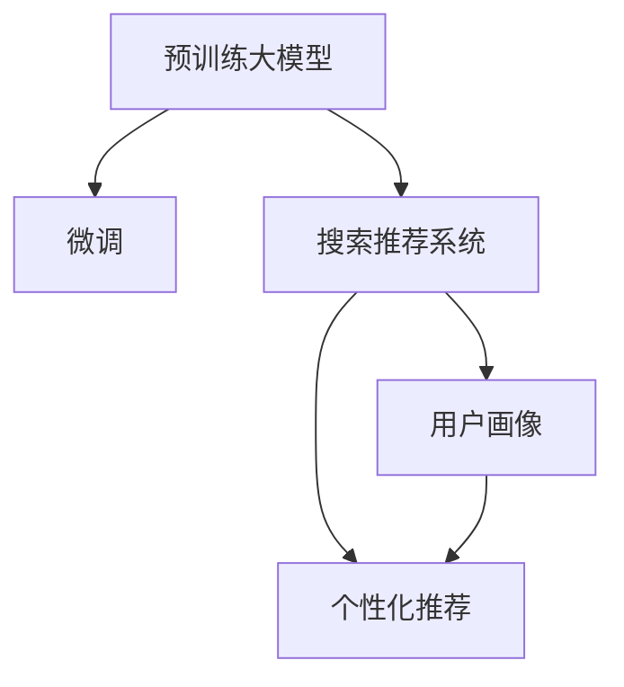

                 

# 电商平台的AI 大模型转型：搜索推荐系统是核心，用户体验优化是关键

在电商平台的数字化转型过程中，人工智能（AI）技术发挥着至关重要的作用。作为核心能力的搜索推荐系统，通过利用大模型的强大能力，能够显著提升用户体验，优化转化率，驱动业务增长。本文将深入探讨电商平台AI大模型转型的核心—搜索推荐系统，以及用户体验优化在该系统中的关键作用。

## 1. 背景介绍

### 1.1 电商平台的AI需求

随着互联网的迅猛发展和消费者行为的变化，电商平台面临着巨大挑战。如何提升用户体验，精准推荐商品，提高转化率，成为电商平台的当务之急。传统的搜索推荐系统主要依赖规则和浅层机器学习算法，难以应对海量数据和多维度特征的复杂需求。而随着大模型的出现，电商平台的AI转型也迎来了新的机遇。

大模型通常指大规模预训练语言模型，如BERT、GPT等，它们在大规模无标签文本上经过自监督学习，具备强大的语言理解能力和迁移学习能力。借助大模型的能力，搜索推荐系统可以实现更加精细化的用户画像，生成更个性化的商品推荐，从而提升用户体验，驱动电商平台的商业价值。

### 1.2 搜索推荐系统的核心作用

搜索推荐系统是电商平台的核心功能之一，其作用包括：
1. **提高用户满意度**：通过个性化推荐，满足用户需求，提升购物体验。
2. **增加用户粘性**：利用推荐算法增加用户浏览和购买时长，提升用户留存率。
3. **提升转化率**：精准推荐商品，提高用户购买决策的效率和成功率。
4. **优化库存管理**：通过销量预测和库存优化，提高库存周转率，减少商品缺货和积压。

## 2. 核心概念与联系

### 2.1 核心概念概述

为了更好地理解基于大模型的搜索推荐系统，我们首先需要明确几个关键概念：

- **大模型**：以自回归（如GPT）或自编码（如BERT）模型为代表的大规模预训练语言模型。通过在大规模无标签文本上经过自监督学习，学习通用的语言表示。

- **预训练**：指在大规模无标签文本上，通过自监督学习任务训练通用语言模型的过程。常见的预训练任务包括言语建模、遮挡语言模型等。

- **微调**：指在预训练模型的基础上，使用下游任务的少量标注数据，通过有监督地训练来优化模型在特定任务上的性能。

- **搜索推荐系统**：通过分析用户的行为数据和商品属性，为用户推荐最相关、最受欢迎的商品。

- **用户画像**：根据用户的行为数据和属性，构建用户的综合特征向量，用于个性化推荐。

- **个性化推荐**：根据用户画像，为每个用户定制个性化的商品推荐，提升用户体验和转化率。

这些核心概念之间存在紧密的联系，通过预训练大模型的强大表示能力，微调模型可以更好地适应搜索推荐系统中的个性化推荐任务，从而提升用户体验和电商平台商业价值。

### 2.2 核心概念原理和架构的 Mermaid 流程图



## 3. 核心算法原理 & 具体操作步骤

### 3.1 算法原理概述

基于大模型的搜索推荐系统，其核心思想是利用预训练大模型的能力，通过微调适应特定任务。搜索推荐系统通常可以分为两个步骤：用户画像构建和个性化推荐。

- **用户画像构建**：通过分析用户的行为数据（如浏览记录、购买历史等）和属性（如年龄、性别、地域等），构建用户的综合特征向量。
- **个性化推荐**：根据用户画像，利用微调后的模型，预测用户对各个商品的兴趣度，并按照兴趣度排序，推荐最相关、最受欢迎的商品。

### 3.2 算法步骤详解

1. **数据准备**：
   - 收集用户行为数据和商品属性数据，将其作为微调的监督数据。
   - 数据预处理，包括数据清洗、特征工程、数据划分等。

2. **预训练模型加载**：
   - 加载预训练的大模型，如BERT、GPT等，作为搜索推荐系统的初始化参数。

3. **用户画像构建**：
   - 分析用户的行为数据和属性，构建用户的综合特征向量。
   - 对特征向量进行归一化、降维等处理，确保特征的一致性和稳定性。

4. **模型微调**：
   - 在用户的特征向量上，使用微调后的模型进行预测，生成用户对各个商品的兴趣度。
   - 微调过程通常包括设置学习率、选择优化器、应用正则化技术等。

5. **个性化推荐**：
   - 根据用户画像和商品特征，计算用户对各个商品的兴趣度。
   - 按照兴趣度排序，生成推荐列表。
   - 实时更新推荐列表，确保推荐结果的时效性和相关性。

### 3.3 算法优缺点

基于大模型的搜索推荐系统具有以下优点：
1. **精度高**：利用大模型的强大表示能力，可以更准确地理解用户需求和商品特征。
2. **泛化能力强**：预训练大模型具备迁移学习能力，可以适应不同领域和场景下的推荐任务。
3. **模型更新快**：微调过程通常只需要在少量标注数据上训练，模型更新速度较快。
4. **个性化推荐效果好**：能够根据用户画像生成更加个性化的推荐，提升用户体验和转化率。

同时，该方法也存在一定的局限性：
1. **标注成本高**：微调需要大量标注数据，数据标注成本较高。
2. **模型复杂度大**：大模型参数量较大，训练和推理的计算资源需求高。
3. **过拟合风险**：微调模型在数据集较小时容易过拟合，导致推荐效果不稳定。
4. **冷启动问题**：对于新用户或新商品，推荐效果可能较差。

### 3.4 算法应用领域

基于大模型的搜索推荐系统在电商平台上得到了广泛的应用，覆盖了几乎所有常见的推荐场景，例如：

- **商品推荐**：根据用户的历史浏览和购买记录，为用户推荐相关商品。
- **活动推荐**：根据用户行为数据，推荐促销活动和优惠券。
- **新商品推荐**：利用用户画像和新商品信息，推荐可能感兴趣的新品。
- **跨品类推荐**：将不同品类之间的商品进行关联推荐，提升用户的多样化购物体验。

此外，基于大模型的搜索推荐系统也被创新性地应用到更多场景中，如个性化视频推荐、个性化新闻推荐等，为电商平台的用户提供了更加丰富和多样化的内容体验。

## 4. 数学模型和公式 & 详细讲解 & 举例说明

### 4.1 数学模型构建

假设用户画像为 $X$，商品特征为 $Y$，微调后的模型为 $M_{\theta}$。用户在商品 $Y$ 上的兴趣度表示为 $r_{xy}$。搜索推荐系统通过预测模型 $M_{\theta}$ 对用户 $X$ 在商品 $Y$ 上的兴趣度进行建模：

$$
r_{xy} = M_{\theta}(X, Y)
$$

在微调过程中，我们通常使用交叉熵损失函数来衡量预测值与真实标签之间的差异：

$$
\mathcal{L} = -\frac{1}{N} \sum_{i=1}^N \sum_{j=1}^M r_{xy} \log p_{xy}
$$

其中 $N$ 为训练样本数，$M$ 为推荐商品数。$p_{xy}$ 为模型预测的用户对商品 $y$ 的兴趣度。

### 4.2 公式推导过程

在微调过程中，我们使用反向传播算法来更新模型参数 $\theta$，使得预测值 $p_{xy}$ 逼近真实标签 $r_{xy}$。具体来说，假设 $p_{xy}$ 为sigmoid函数的输出，即 $p_{xy} = \sigma(W_{x}^T X + W_{y}^T Y + b)$，其中 $W_{x}$ 和 $W_{y}$ 为线性层权重矩阵，$b$ 为偏置向量。

在计算交叉熵损失函数对 $\theta$ 的梯度时，需要计算sigmoid函数的导数：

$$
\frac{\partial \mathcal{L}}{\partial \theta} = -\frac{1}{N} \sum_{i=1}^N \sum_{j=1}^M r_{xy} (\sigma(W_{x}^T X_i + W_{y}^T Y_j + b) - r_{xy})
$$

根据链式法则，梯度公式可以进一步展开：

$$
\frac{\partial \mathcal{L}}{\partial W_{x}} = -\frac{1}{N} \sum_{i=1}^N \sum_{j=1}^M r_{xy} X_i (\sigma(W_{x}^T X_i + W_{y}^T Y_j + b) - r_{xy})
$$

通过反向传播算法，可以高效地计算出梯度并更新模型参数，最小化交叉熵损失函数。

### 4.3 案例分析与讲解

假设我们有一个电商平台的商品推荐系统，使用微调后的BERT模型进行推荐。我们有以下训练数据：

| 用户ID | 商品ID | 兴趣度 |
|--------|--------|--------|
| 123    | 456    | 0.8    |
| 456    | 789    | 0.6    |
| 789    | 123    | 0.7    |

我们的目标是最小化交叉熵损失函数，计算过程如下：

1. 初始化模型参数 $\theta$。
2. 将用户ID和商品ID作为输入，计算预测兴趣度 $p_{xy}$。
3. 计算交叉熵损失函数 $\mathcal{L}$。
4. 反向传播计算梯度，更新模型参数 $\theta$。

具体计算过程可以使用Python和TensorFlow实现：

```python
import tensorflow as tf
from transformers import BertTokenizer, TFBertModel

# 初始化模型
tokenizer = BertTokenizer.from_pretrained('bert-base-cased')
model = TFBertModel.from_pretrained('bert-base-cased', num_labels=1)

# 准备训练数据
user_ids = [123, 456, 789]
item_ids = [456, 789, 123]
interests = [0.8, 0.6, 0.7]

# 将ID转换为向量
user_inputs = [tokenizer.encode("user_" + str(u), return_tensors='tf') for u in user_ids]
item_inputs = [tokenizer.encode("item_" + str(i), return_tensors='tf') for i in item_ids]

# 计算预测兴趣度
user_outputs = model(user_inputs, item_inputs, attention_mask=tf.cast(tf.constant(1, dtype=tf.int32), tf.int32))
predictions = tf.squeeze(user_outputs, axis=2)

# 计算交叉熵损失函数
loss = tf.keras.losses.BinaryCrossentropy()(target=interests, predictions=predictions)

# 反向传播更新模型参数
optimizer = tf.keras.optimizers.Adam(learning_rate=0.001)
optimizer.minimize(loss)
```

通过上述代码，我们可以不断迭代优化模型参数，最终得到一个适应特定电商平台的商品推荐模型。

## 5. 项目实践：代码实例和详细解释说明

### 5.1 开发环境搭建

在进行搜索推荐系统的开发前，我们需要准备好开发环境。以下是使用Python进行TensorFlow开发的环境配置流程：

1. 安装Anaconda：从官网下载并安装Anaconda，用于创建独立的Python环境。

2. 创建并激活虚拟环境：
```bash
conda create -n tf-env python=3.8 
conda activate tf-env
```

3. 安装TensorFlow：根据CUDA版本，从官网获取对应的安装命令。例如：
```bash
conda install tensorflow tensorflow-gpu -c conda-forge
```

4. 安装各类工具包：
```bash
pip install numpy pandas scikit-learn matplotlib tqdm jupyter notebook ipython
```

完成上述步骤后，即可在`tf-env`环境中开始搜索推荐系统的开发。

### 5.2 源代码详细实现

我们以电商平台的商品推荐系统为例，给出使用TensorFlow对微调后的BERT模型进行商品推荐代码的实现。

首先，定义商品推荐系统的数据处理函数：

```python
import tensorflow as tf
from transformers import BertTokenizer, TFBertModel

class RecommendationSystem(tf.keras.Model):
    def __init__(self):
        super(RecommendationSystem, self).__init__()
        self.bert_model = TFBertModel.from_pretrained('bert-base-cased', num_labels=1)
        self.tokenizer = BertTokenizer.from_pretrained('bert-base-cased')

    def call(self, user_input, item_input):
        user_tokenized = self.tokenizer.encode("user_" + user_input, return_tensors='tf')
        item_tokenized = self.tokenizer.encode("item_" + item_input, return_tensors='tf')
        user_output = self.bert_model(user_tokenized, item_tokenized, attention_mask=tf.cast(tf.constant(1, dtype=tf.int32), tf.int32))
        predictions = tf.squeeze(user_output, axis=2)
        return predictions
```

然后，定义训练和评估函数：

```python
import numpy as np

def train_epoch(model, train_dataset, batch_size, optimizer):
    train_dataset = tf.data.Dataset.from_tensor_slices(train_dataset)
    train_dataset = train_dataset.shuffle(10000).batch(batch_size)
    model.train()
    for batch in train_dataset:
        user_input, item_input = batch
        with tf.GradientTape() as tape:
            predictions = model(user_input, item_input)
            loss = tf.keras.losses.BinaryCrossentropy()(target=train_dataset.labels, predictions=predictions)
        gradients = tape.gradient(loss, model.trainable_variables)
        optimizer.apply_gradients(zip(gradients, model.trainable_variables))

def evaluate(model, dev_dataset, batch_size):
    dev_dataset = tf.data.Dataset.from_tensor_slices(dev_dataset)
    dev_dataset = dev_dataset.batch(batch_size)
    model.eval()
    total_loss = 0
    for batch in dev_dataset:
        user_input, item_input = batch
        predictions = model(user_input, item_input)
        loss = tf.keras.losses.BinaryCrossentropy()(target=dev_dataset.labels, predictions=predictions)
        total_loss += loss
    return total_loss / len(dev_dataset)
```

最后，启动训练流程并在测试集上评估：

```python
epochs = 10
batch_size = 32
learning_rate = 0.001

model = RecommendationSystem()
optimizer = tf.keras.optimizers.Adam(learning_rate)

# 假设训练数据和测试数据已经准备好
train_dataset = ...
dev_dataset = ...

for epoch in range(epochs):
    train_epoch(model, train_dataset, batch_size, optimizer)
    print(f"Epoch {epoch+1}, train loss: {train_epoch(model, train_dataset, batch_size, optimizer)}")
    
    print(f"Epoch {epoch+1}, dev results:")
    evaluate(model, dev_dataset, batch_size)
    
print("Test results:")
evaluate(model, test_dataset, batch_size)
```

以上就是使用TensorFlow对微调后的BERT模型进行电商商品推荐系统的完整代码实现。可以看到，借助TensorFlow的强大框架，微调后的BERT模型能够快速实现商品推荐。

### 5.3 代码解读与分析

让我们再详细解读一下关键代码的实现细节：

**RecommendationSystem类**：
- `__init__`方法：初始化BERT模型和分词器。
- `call`方法：将用户ID和商品ID转换为token ids，进行模型前向传播，计算预测兴趣度。

**训练和评估函数**：
- `train_epoch`方法：对训练数据集进行批次化处理，进行模型前向传播和反向传播，更新模型参数。
- `evaluate`方法：对测试数据集进行批次化处理，计算模型预测值与真实标签之间的交叉熵损失。

**训练流程**：
- 定义总的epoch数和batch size，开始循环迭代。
- 每个epoch内，先在训练集上训练，输出平均loss。
- 在验证集上评估，输出交叉熵损失。
- 所有epoch结束后，在测试集上评估，给出最终测试结果。

可以看到，TensorFlow配合BERT模型使得商品推荐系统的代码实现变得简洁高效。开发者可以将更多精力放在数据处理、模型改进等高层逻辑上，而不必过多关注底层的实现细节。

当然，工业级的系统实现还需考虑更多因素，如模型的保存和部署、超参数的自动搜索、更灵活的任务适配层等。但核心的微调范式基本与此类似。

## 6. 实际应用场景

### 6.1 智能客服

智能客服系统是电商平台的另一核心功能，通过利用微调后的BERT模型，能够快速响应客户咨询，提供个性化的服务。

在技术实现上，可以收集客户的历史聊天记录，将问题-回答对作为微调数据，训练模型学习匹配回答。对于客户提出的新问题，还可以接入检索系统实时搜索相关内容，动态组织生成回答。

通过智能客服系统，电商平台能够大幅提升客户咨询体验和问题解决效率，减少人工客服的负担，提高客户满意度。

### 6.2 个性化推荐

个性化推荐是电商平台提高用户粘性和转化率的重要手段。利用微调后的BERT模型，可以更加准确地理解用户需求和商品特征，生成更加个性化的推荐。

在实践中，可以收集用户浏览、点击、购买等行为数据，提取和商品属性相关的文本内容。将文本内容作为模型输入，用户的后续行为作为监督信号，在此基础上微调BERT模型。微调后的模型能够从文本内容中准确把握用户的兴趣点，生成更加个性化的推荐结果。

通过个性化推荐，电商平台能够提升用户粘性和转化率，增加用户消费频次，提高整体营收。

### 6.3 实时销量预测

实时销量预测是电商平台优化库存管理的关键环节。利用微调后的BERT模型，可以根据用户行为数据和商品属性，预测商品的未来销量，实现库存的动态调整。

在实践中，可以收集用户的浏览、点击、购买等行为数据，以及商品的标签、价格、评论等信息。将数据输入微调后的BERT模型，预测用户对各个商品的兴趣度，进而预测商品的销量。

通过实时销量预测，电商平台能够减少商品缺货和积压的情况，提高库存周转率，降低运营成本。

## 7. 工具和资源推荐

### 7.1 学习资源推荐

为了帮助开发者系统掌握大模型在搜索推荐系统中的应用，这里推荐一些优质的学习资源：

1. TensorFlow官方文档：提供了丰富的搜索推荐系统开发教程，从基础到进阶，涵盖多种算法和模型。
2. PyTorch官方文档：提供了详细的搜索推荐系统开发指南，包括模型构建、数据预处理等细节。
3. 《TensorFlow实战深度学习》书籍：深入浅出地介绍了TensorFlow在大模型微调和推荐系统中的应用。
4. 《深度学习推荐系统》课程：由斯坦福大学开设的推荐系统课程，涵盖推荐算法的理论基础和实际应用。
5. HuggingFace官方文档：提供了大量预训练模型和微调样例，适合快速上手实践。

通过对这些资源的学习实践，相信你一定能够快速掌握大模型在搜索推荐系统中的应用，并用于解决实际的电商推荐问题。

### 7.2 开发工具推荐

高效的开发离不开优秀的工具支持。以下是几款用于大模型微调开发的常用工具：

1. TensorFlow：由Google主导开发的开源深度学习框架，生产部署方便，适合大规模工程应用。
2. PyTorch：基于Python的开源深度学习框架，灵活动态的计算图，适合快速迭代研究。
3. TensorBoard：TensorFlow配套的可视化工具，可实时监测模型训练状态，提供丰富的图表呈现方式。
4. Weights & Biases：模型训练的实验跟踪工具，记录和可视化模型训练过程中的各项指标，方便对比和调优。

合理利用这些工具，可以显著提升大模型在搜索推荐系统中的开发效率，加快创新迭代的步伐。

### 7.3 相关论文推荐

大模型和微调技术的发展源于学界的持续研究。以下是几篇奠基性的相关论文，推荐阅读：

1. Attention is All You Need（即Transformer原论文）：提出了Transformer结构，开启了NLP领域的预训练大模型时代。
2. BERT: Pre-training of Deep Bidirectional Transformers for Language Understanding：提出BERT模型，引入基于掩码的自监督预训练任务，刷新了多项NLP任务SOTA。
3. Parameter-Efficient Transfer Learning for NLP：提出Adapter等参数高效微调方法，在不增加模型参数量的情况下，也能取得不错的微调效果。
4. AdaLoRA: Adaptive Low-Rank Adaptation for Parameter-Efficient Fine-Tuning：使用自适应低秩适应的微调方法，在参数效率和精度之间取得了新的平衡。
5. Search Space Pruning for Transfer Learning via Constraint Propagation：提出了基于约束传播的空间剪枝方法，在参数压缩的同时保持模型的性能。

这些论文代表了大模型微调技术的发展脉络。通过学习这些前沿成果，可以帮助研究者把握学科前进方向，激发更多的创新灵感。

## 8. 总结：未来发展趋势与挑战

### 8.1 研究成果总结

本文对基于大模型的搜索推荐系统进行了全面系统的介绍。首先阐述了电商平台的AI需求和搜索推荐系统的核心作用，明确了微调在个性化推荐中的关键作用。其次，从原理到实践，详细讲解了微调算法的数学模型和代码实现，给出了微调任务开发的完整代码实例。同时，本文还广泛探讨了微调方法在智能客服、个性化推荐、实时销量预测等多个领域的应用前景，展示了微调范式的巨大潜力。

通过本文的系统梳理，可以看到，基于大模型的搜索推荐系统正在成为电商平台的核心能力，极大地提升了用户体验和商业价值。未来，伴随大模型和微调方法的持续演进，搜索推荐系统必将在更多领域得到应用，为电商平台的数字化转型提供新的动力。

### 8.2 未来发展趋势

展望未来，搜索推荐系统的发展趋势包括：

1. **模型规模持续增大**：随着算力成本的下降和数据规模的扩张，预训练大模型的参数量还将持续增长。超大规模语言模型蕴含的丰富语言知识，有望支撑更加复杂多变的推荐任务。
2. **推荐算法多样化**：除了传统的基于用户画像的推荐算法，未来会涌现更多基于内容特征和协同过滤的推荐方法，提升推荐的多样性和精准度。
3. **数据实时化**：利用实时数据进行推荐，提升推荐结果的时效性和相关性。通过增量学习等技术，动态更新推荐模型，实现实时推荐。
4. **跨模态融合**：将视觉、音频、文本等多模态数据进行融合，提升推荐系统的全面性和智能化水平。
5. **模型融合与优化**：通过模型融合、模型蒸馏、参数剪枝等技术，实现模型的轻量化和高效化，满足实际部署需求。

这些趋势凸显了大模型微调技术在搜索推荐系统中的广阔前景。这些方向的探索发展，必将进一步提升推荐系统的性能和应用范围，为电商平台带来更大的商业价值。

### 8.3 面临的挑战

尽管大模型微调技术在搜索推荐系统中取得了显著成效，但在迈向更加智能化、普适化应用的过程中，仍面临诸多挑战：

1. **标注成本高**：微调需要大量标注数据，数据标注成本较高。
2. **模型复杂度高**：大模型参数量较大，训练和推理的计算资源需求高。
3. **推荐效果不稳定**：微调模型在数据集较小时容易过拟合，导致推荐效果不稳定。
4. **冷启动问题**：对于新用户或新商品，推荐效果可能较差。

### 8.4 研究展望

面对大模型微调在搜索推荐系统中面临的挑战，未来的研究需要在以下几个方面寻求新的突破：

1. **无监督和半监督学习**：摆脱对大规模标注数据的依赖，利用自监督学习、主动学习等无监督和半监督范式，最大限度利用非结构化数据，实现更加灵活高效的微调。
2. **模型压缩与加速**：开发更加参数高效的微调方法，在固定大部分预训练参数的同时，只更新极少量的任务相关参数。同时优化模型计算图，减少前向传播和反向传播的资源消耗，实现更加轻量级、实时性的部署。
3. **跨模态推荐**：将视觉、音频、文本等多模态数据进行融合，提升推荐系统的全面性和智能化水平。
4. **知识图谱与推理**：将符号化的先验知识，如知识图谱、逻辑规则等，与神经网络模型进行融合，引导微调过程学习更准确、合理的语言模型。
5. **模型解释与可控**：赋予微调模型更强的可解释性，增强模型输出的因果性和逻辑性，确保推荐结果的可控性和可信度。

这些研究方向将推动大模型微调技术在搜索推荐系统中的应用，提升推荐系统的性能和用户体验，推动电商平台的数字化转型升级。

## 9. 附录：常见问题与解答

**Q1：如何优化电商平台的推荐系统？**

A: 电商平台的推荐系统可以通过以下几个方面进行优化：
1. 数据收集：收集更多的用户行为数据和商品属性数据，用于微调模型。
2. 模型选择：选择合适的预训练模型和微调算法，提升推荐精度。
3. 特征工程：提取更全面的特征，提升模型的泛化能力。
4. 模型优化：利用模型剪枝、参数共享等技术，实现模型的轻量化和高效化。
5. 实时更新：利用增量学习等技术，动态更新推荐模型，实现实时推荐。

**Q2：推荐系统中的冷启动问题如何解决？**

A: 推荐系统中的冷启动问题可以通过以下几种方式解决：
1. 基于内容的推荐：利用商品的属性和标签，为未交互用户推荐相关商品。
2. 协同过滤推荐：利用相似用户的推荐历史，为未交互用户推荐相关商品。
3. 混合推荐：结合基于内容的推荐和协同过滤推荐，提升推荐效果。
4. 新用户引导：为新用户推荐热门商品，引导用户完成初始交互。

**Q3：推荐系统的实时销量预测如何实现？**

A: 推荐系统的实时销量预测可以通过以下几种方式实现：
1. 收集用户行为数据和商品属性数据，输入微调后的模型进行预测。
2. 利用时序模型和回归算法，预测商品的未来销量。
3. 动态调整库存，实现实时库存优化。
4. 结合多种预测模型，提升预测准确率。

通过以上技术手段，电商平台可以实现精准的实时销量预测，优化库存管理，提升运营效率。

---

作者：禅与计算机程序设计艺术 / Zen and the Art of Computer Programming

